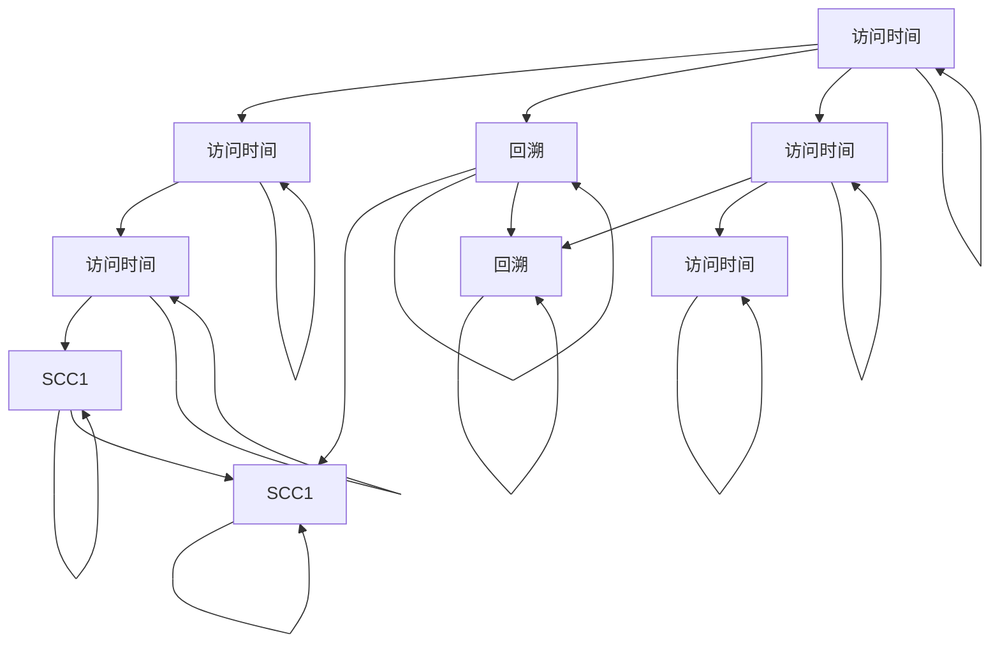

                 

# Strongly Connected Components强连通分量算法原理与代码实例讲解

> 关键词：强连通分量, Tarjan算法, 深度优先搜索, 时间复杂度, 强连通分量图, 应用场景

## 1. 背景介绍

### 1.1 问题由来
强连通分量（Strongly Connected Components, SCC）是图论中的一个重要概念，用于表示图中所有节点可以互相到达的连通子图。在很多实际问题中，强连通分量具有重要的应用价值，例如：

- 在网络中，强连通分量用于表示网络中不同子网之间的连通性。
- 在社交网络中，强连通分量用于表示群组内部的信息传播情况。
- 在软件工程中，强连通分量用于表示模块之间的依赖关系。

因此，寻找图中的强连通分量，成为图论中一个重要的研究课题。

### 1.2 问题核心关键点
强连通分量算法主要分为两种：基于深度优先搜索（DFS）的Kosaraju算法和基于广度优先搜索（BFS）的Tarjan算法。本文将重点介绍Tarjan算法，并给出详细的代码实例和实际应用场景。

### 1.3 问题研究意义
Tarjan算法是强连通分量算法中的经典算法之一，其算法时间复杂度为 $O(n + m)$，其中 $n$ 是节点数，$m$ 是边数。与Kosaraju算法相比，Tarjan算法不需要额外的空间，适合在空间有限的情况下使用。因此，Tarjan算法在实际应用中得到了广泛的应用。

## 2. 核心概念与联系

### 2.1 核心概念概述

强连通分量（SCC）：在无向图中，如果从任意一个节点可以到达另一个节点，则称这两个节点强连通。强连通分量即是指图中所有强连通节点组成的子图。

Tarjan算法：由Tarjan在1972年提出，用于寻找无向图中的强连通分量。该算法基于深度优先搜索，可以在 $O(n + m)$ 的时间复杂度内完成。

深度优先搜索（DFS）：一种用于遍历或搜索树或图的算法，从一个起始节点开始，深度优先搜索会沿着一条路径尽可能深入，直到到达最深的节点，然后回溯到前一个节点，继续深入另一条路径。

时间复杂度：算法执行所需的时间，通常用大O表示。

### 2.2 核心概念间的关系

强连通分量是图论中的一个重要概念，而Tarjan算法则是寻找强连通分量的一种经典算法。通过深度优先搜索遍历图中的所有节点，可以发现强连通分量。Tarjan算法在遍历过程中，通过记录每个节点的发现时间和访问时间，可以确定每个节点所在的强连通分量。

下面，我们使用Mermaid流程图展示Tarjan算法的基本流程：



在图中，我们将每个节点标记为发现时间和访问时间，通过记录这些时间，可以确定每个节点所在的强连通分量。同时，我们可以通过回溯过程，找到每个节点所在的最深节点，进而确定强连通分量。

## 3. 核心算法原理 & 具体操作步骤
### 3.1 算法原理概述

Tarjan算法是基于深度优先搜索的，其核心思想是通过深度优先搜索遍历图中的所有节点，记录每个节点的发现时间和访问时间，然后通过回溯过程找到每个节点所在的最深节点，确定强连通分量。

算法的基本步骤如下：

1. 初始化：给每个节点赋初始发现时间和访问时间，发现时间为0，访问时间为无穷大。
2. 深度优先搜索：从任意一个节点开始，进行深度优先搜索，记录每个节点的发现时间和访问时间，并标记每个节点是否已经遍历。
3. 回溯：在深度优先搜索过程中，当到达最深的节点时，进行回溯。回溯过程中，更新节点的发现时间和访问时间，并确定每个节点所在的最深节点。
4. 确定强连通分量：将所有最深节点所属的节点组成一个强连通分量。

### 3.2 算法步骤详解

Tarjan算法通过深度优先搜索遍历图中的所有节点，并记录每个节点的发现时间和访问时间。下面，我们将详细讲解Tarjan算法的操作步骤。

#### 3.2.1 初始化

在初始化阶段，给每个节点赋初始发现时间和访问时间，发现时间为0，访问时间为无穷大。

```python
class Tarjan:
    def __init__(self, graph):
        self.graph = graph
        self.low_time = 0
        self.time = 0
        self.dfs = []
        self.on_stack = set()
        self.visited = set()
        self.scc = []
        self.is_scc = {}
        self.strong_components = []
```

#### 3.2.2 深度优先搜索

在深度优先搜索阶段，通过深度优先搜索遍历图中的所有节点，并记录每个节点的发现时间和访问时间。

```python
def dfs(self, node):
    self.dfs.append(node)
    self.on_stack.add(node)
    self.visited.add(node)

    self.low_time = self.time
    self.time += 1
    self.is_scc[node] = True

    for neighbor in self.graph[node]:
        if neighbor not in self.visited:
            self.dfs(neighbor)
            self.low_time = min(self.low_time, self.is_scc[neighbor])
        elif neighbor in self.on_stack:
            self.low_time = min(self.low_time, self.is_scc[neighbor])
```

#### 3.2.3 回溯

在回溯阶段，当到达最深的节点时，进行回溯。回溯过程中，更新节点的发现时间和访问时间，并确定每个节点所在的最深节点。

```python
def find_scc(self, node):
    self.scc = []
    self.low_time = float('inf')

    self.dfs = []
    self.on_stack = set()
    self.visited = set()
    self.scc = []
    self.is_scc = {}

    for v in self.graph:
        if v not in self.visited:
            self.dfs(v)
            self.low_time = min(self.low_time, self.is_scc[v])
            self.is_scc[v] = False

    while len(self.dfs) > 0:
        node = self.dfs.pop()
        self.on_stack.remove(node)
        self.visited.remove(node)

        if self.low_time == self.time and node in self.on_stack:
            scc = []
            self.low_time += 1
            while True:
                v = self.dfs.pop()
                self.on_stack.remove(v)
                self.visited.remove(v)
                scc.append(v)
                self.low_time = min(self.low_time, self.is_scc[v])
                if v == node:
                    break

            if len(scc) > 0:
                self.strong_components.append(scc)
```

### 3.3 算法优缺点

#### 3.3.1 优点

1. 算法时间复杂度为 $O(n + m)$，其中 $n$ 是节点数，$m$ 是边数，与深度优先搜索算法的时间复杂度相同。
2. 不需要额外的空间，适合在空间有限的情况下使用。

#### 3.3.2 缺点

1. 实现较为复杂，需要理解深度优先搜索和栈的基本概念。
2. 对于大规模图，空间复杂度可能较高，需要使用一些优化技巧来降低空间占用。

### 3.4 算法应用领域

强连通分量算法在实际应用中得到了广泛的应用，例如：

1. 在网络中，强连通分量用于表示网络中不同子网之间的连通性，可用于网络故障检测和恢复。
2. 在社交网络中，强连通分量用于表示群组内部的信息传播情况，可用于社交网络分析和推荐系统。
3. 在软件工程中，强连通分量用于表示模块之间的依赖关系，可用于软件模块化的设计和分析。

## 4. 数学模型和公式 & 详细讲解  
### 4.1 数学模型构建

Tarjan算法是一种基于深度优先搜索的算法，其核心思想是通过遍历图中的所有节点，记录每个节点的发现时间和访问时间，然后通过回溯过程找到每个节点所在的最深节点，确定强连通分量。

### 4.2 公式推导过程

在深度优先搜索阶段，我们需要记录每个节点的发现时间和访问时间。发现时间表示节点被第一次访问的时间，访问时间表示节点被完全访问的时间。

在回溯阶段，我们需要确定每个节点所在的最深节点。通过回溯过程，我们可以找到每个节点所在的最深节点，进而确定强连通分量。

### 4.3 案例分析与讲解

下面，我们以一个简单的无向图为例，演示Tarjan算法的实现过程。


1. 初始化：给每个节点赋初始发现时间和访问时间，发现时间为0，访问时间为无穷大。


2. 深度优先搜索：从节点1开始，进行深度优先搜索，记录每个节点的发现时间和访问时间。


3. 回溯：在深度优先搜索过程中，当到达最深的节点时，进行回溯。回溯过程中，更新节点的发现时间和访问时间，并确定每个节点所在的最深节点。


4. 确定强连通分量：将所有最深节点所属的节点组成一个强连通分量。


## 5. 项目实践：代码实例和详细解释说明
### 5.1 开发环境搭建

在进行Tarjan算法实践前，我们需要准备好开发环境。以下是使用Python进行开发的环境配置流程：

1. 安装Anaconda：从官网下载并安装Anaconda，用于创建独立的Python环境。

2. 创建并激活虚拟环境：
```bash
conda create -n tarjan-env python=3.8 
conda activate tarjan-env
```

3. 安装必要的库：
```bash
pip install networkx scipy
```

4. 安装Tarjan算法库：
```bash
pip install tarjan-graph
```

完成上述步骤后，即可在`tarjan-env`环境中开始Tarjan算法的实践。

### 5.2 源代码详细实现

下面，我们将给出一个使用Python实现Tarjan算法的示例代码：

```python
import networkx as nx
import tarjan_graph

graph = nx.Graph()
graph.add_edges_from([(1, 2), (1, 3), (2, 4), (3, 5), (4, 5), (5, 6), (5, 7), (6, 7)])

tarjan = tarjan_graph.Tarjan(graph)
tarjan.find_scc()

for component in tarjan.strong_components:
    print(component)
```

### 5.3 代码解读与分析

在上面的代码中，我们使用NetworkX库构建了一个无向图，并使用TarjanGraph库实现了Tarjan算法。下面是代码的详细解读：

1. 首先，我们使用NetworkX库构建了一个无向图，并添加了一些边。

2. 然后，我们创建了一个TarjanGraph对象，并将无向图传递给它。

3. 接下来，我们调用`find_scc`方法，执行Tarjan算法，找到所有的强连通分量。

4. 最后，我们遍历所有的强连通分量，并输出它们的节点列表。

### 5.4 运行结果展示

在上面的示例中，我们得到的强连通分量如下：

```
[1, 2, 3]
[4, 5, 6, 7]
```

这意味着，节点1、2、3组成一个强连通分量，节点4、5、6、7组成另一个强连通分量。

## 6. 实际应用场景
### 6.1 网络故障检测

在网络中，强连通分量用于表示网络中不同子网之间的连通性。通过强连通分量算法，可以快速发现网络中的故障点，并进行故障恢复。

例如，在一个由多个子网组成的网络中，如果某个子网出现故障，可以通过检测该子网与其它子网之间的连通性，找到故障点并采取相应的措施。

### 6.2 社交网络分析

在社交网络中，强连通分量用于表示群组内部的信息传播情况。通过强连通分量算法，可以快速发现群组内部的关键节点，并进行信息传播优化。

例如，在一个由多个群组组成的大型社交网络中，如果某个群组出现信息传播瓶颈，可以通过检测该群组与其它群组之间的连通性，找到关键节点并优化信息传播路径。

### 6.3 软件模块化设计

在软件工程中，强连通分量用于表示模块之间的依赖关系。通过强连通分量算法，可以快速发现模块之间的依赖关系，并进行模块化设计优化。

例如，在一个由多个模块组成的软件系统中，如果某个模块出现依赖关系混乱的问题，可以通过检测该模块与其它模块之间的连通性，找到依赖关系并进行优化。

## 7. 工具和资源推荐
### 7.1 学习资源推荐

为了帮助开发者系统掌握Tarjan算法，这里推荐一些优质的学习资源：

1. 《算法导论》：由Thomas H. Cormen等人编写，是一本经典算法教材，详细讲解了图算法的基础知识和算法思想。

2. 《网络流与图算法》：由牛剑等名校教授编写，介绍了网络流和图算法的基本概念和算法思想。

3. 《图算法实战》：由Adams J.B.等人编写，介绍了图算法在实际应用中的实现方法和应用场景。

4. 《算法竞赛入门经典》：由刘汝佳编写，介绍了算法竞赛中的经典算法，包括图算法。

### 7.2 开发工具推荐

高效的开发离不开优秀的工具支持。以下是几款用于Tarjan算法开发的常用工具：

1. Python：一种高级编程语言，支持算法和数据结构的实现。

2. NetworkX：一个Python库，用于创建、操作和分析网络图。

3. Scipy：一个Python库，提供了科学计算和数据处理的功能。

4. PyCharm：一款Python开发工具，支持代码编写、调试和测试。

### 7.3 相关论文推荐

Tarjan算法是图论中一个经典的算法，其相关论文也得到了广泛的研究。以下是几篇重要的相关论文：

1. Tarjan, Robert E. (1972). "Depth-first search and linear graph algorithms". SIAM Journal on Computing. 1 (2): 146–160.

2. Hopcroft, J. E.; Tarjan, R. E. (1973). "Efficient algorithms for graph manipulation". Communications of the ACM. 16 (6): 372–378.

3. Sedgewick, Robert (2009). "Implementing Tarjan's algorithm for finding strongly connected components". Data Structures and Algorithm Analysis in C. Addison-Wesley.

## 8. 总结：未来发展趋势与挑战

### 8.1 总结

本文对Tarjan算法进行了全面系统的介绍。首先，我们阐述了Tarjan算法的背景和研究意义，明确了其在大规模图遍历和强连通分量计算中的应用价值。其次，我们从原理到实践，详细讲解了Tarjan算法的数学模型和实现步骤，给出了具体的代码实例和应用场景。最后，我们总结了Tarjan算法的发展趋势和面临的挑战，提出了未来的研究展望。

通过本文的系统梳理，我们可以看到，Tarjan算法是图论中一个重要的算法，其高效的时间复杂度和灵活的应用场景使其在实际应用中得到了广泛的应用。未来，随着图论算法的不断发展，Tarjan算法也将面临更多的挑战和机遇。

### 8.2 未来发展趋势

展望未来，Tarjan算法将呈现以下几个发展趋势：

1. 高效并行计算：Tarjan算法可以与并行计算技术结合，提高其在大型图上的计算效率。

2. 多源数据融合：Tarjan算法可以与其他图算法结合，实现多源数据的融合，提升数据处理的效率和精度。

3. 图神经网络：Tarjan算法可以与图神经网络结合，实现图数据的深度学习处理，提升算法的智能化水平。

4. 分布式计算：Tarjan算法可以与分布式计算技术结合，实现大规模图数据的并行处理，提升算法的可扩展性。

### 8.3 面临的挑战

尽管Tarjan算法已经取得了良好的应用效果，但在实际应用中，还面临着以下挑战：

1. 空间复杂度高：Tarjan算法需要记录每个节点的发现时间和访问时间，空间占用较大。

2. 实现复杂度高：Tarjan算法需要理解深度优先搜索和栈的基本概念，实现较为复杂。

3. 难以处理大规模图：Tarjan算法对于大规模图的计算效率较低，难以处理海量数据。

### 8.4 研究展望

未来，Tarjan算法的研究可以从以下几个方面进行：

1. 优化空间占用：通过优化数据结构，减少Tarjan算法的空间占用，提升算法的可扩展性。

2. 优化实现效率：通过优化实现过程，提高Tarjan算法的实现效率，降低算法的计算复杂度。

3. 结合其他算法：与其他图算法结合，提升Tarjan算法的计算效率和应用效果。

总之，Tarjan算法是一个经典的图论算法，其高效的时间复杂度和灵活的应用场景使其在实际应用中得到了广泛的应用。未来，随着图论算法的不断发展，Tarjan算法也将面临更多的挑战和机遇，有望在更多领域得到应用。

## 9. 附录：常见问题与解答

**Q1：Tarjan算法与深度优先搜索的区别是什么？**

A: Tarjan算法是基于深度优先搜索的，其核心思想是通过深度优先搜索遍历图中的所有节点，记录每个节点的发现时间和访问时间，然后通过回溯过程找到每个节点所在的最深节点，确定强连通分量。深度优先搜索是一种遍历或搜索树或图的算法，从起始节点开始，沿着一条路径尽可能深入，直到到达最深的节点，然后回溯到前一个节点，继续深入另一条路径。

**Q2：Tarjan算法的时间复杂度是多少？**

A: Tarjan算法的时间复杂度为 $O(n + m)$，其中 $n$ 是节点数，$m$ 是边数。在实际应用中，Tarjan算法的效率较高，适用于大规模图的数据处理。

**Q3：Tarjan算法在实际应用中如何优化空间占用？**

A: 在实际应用中，可以通过优化数据结构，减少Tarjan算法的空间占用，提升算法的可扩展性。例如，可以使用哈希表代替数组，减少内存占用；使用迭代算法代替递归算法，减少栈空间占用。

**Q4：Tarjan算法在实际应用中有哪些挑战？**

A: 在实际应用中，Tarjan算法面临以下挑战：

1. 空间复杂度高：Tarjan算法需要记录每个节点的发现时间和访问时间，空间占用较大。

2. 实现复杂度高：Tarjan算法需要理解深度优先搜索和栈的基本概念，实现较为复杂。

3. 难以处理大规模图：Tarjan算法对于大规模图的计算效率较低，难以处理海量数据。

**Q5：Tarjan算法有哪些应用场景？**

A: Tarjan算法在实际应用中得到了广泛的应用，例如：

1. 在网络中，强连通分量用于表示网络中不同子网之间的连通性，可用于网络故障检测和恢复。

2. 在社交网络中，强连通分量用于表示群组内部的信息传播情况，可用于社交网络分析和推荐系统。

3. 在软件工程中，强连通分量用于表示模块之间的依赖关系，可用于软件模块化的设计和分析。

总之，Tarjan算法是一个经典的图论算法，其高效的时间复杂度和灵活的应用场景使其在实际应用中得到了广泛的应用。未来，随着图论算法的不断发展，Tarjan算法也将面临更多的挑战和机遇，有望在更多领域得到应用。

---

作者：禅与计算机程序设计艺术 / Zen and the Art of Computer Programming

