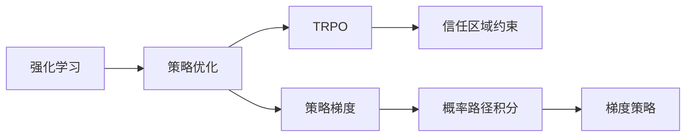
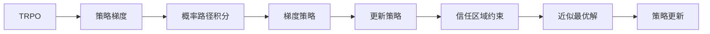

                 

# TRPO(Trust Region Policy Optimization) - 原理与代码实例讲解

> 关键词：TRPO, 强化学习, 深度强化学习, 策略优化, 概率路径积分, 梯度策略, 信任区域

## 1. 背景介绍

### 1.1 问题由来
强化学习（Reinforcement Learning, RL）作为机器学习中的重要分支，近年来在自动驾驶、游戏智能、机器人控制等领域取得了显著进展。但传统的强化学习方法，如Q-learning、SARSA等，面对高维度、连续动作空间，往往难以收敛。而基于模型的方法，如DQN、Deep Q-Network，虽然可以处理连续动作空间，但需要大量样本和计算资源，难以适应大规模的实时决策系统。因此，基于策略优化的方法在近年来逐步崛起，其中TRPO（Trust Region Policy Optimization）因其稳定性和有效性，成为重要的研究热点。

### 1.2 问题核心关键点
TRPO方法基于策略优化，通过在参数更新时保持一定的信任区域，保证每次更新后的策略和现有策略足够接近，从而避免策略更新过大导致的不稳定。具体而言，TRPO的核心思想在于：
1. 在每个迭代周期中，首先通过路径积分和概率路径积分等方法计算策略的梯度，并得到策略的修改方向。
2. 利用拉格朗日乘子法和牛顿法等优化技术，求解一个在信任区域内近似最优的梯度方向，更新策略。
3. 通过逐步增大信任区域，不断逼近最优策略，直到收敛。

TRPO方法将策略更新过程分解为两个部分：1）策略梯度估计；2）策略更新。这种分解使得TRPO能够在保留策略更新的同时，避免梯度消失问题，并减少策略更新的风险。

### 1.3 问题研究意义
TRPO方法在强化学习中的应用，具有以下重要意义：
1. 高效稳定。通过信任区域的约束，TRPO可以稳定地更新策略，避免传统的策略更新方法可能出现的过拟合问题。
2. 广泛适用。TRPO适用于各种类型的连续动作空间，包括连续状态和动作的复杂任务。
3. 资源友好。TRPO通过优化概率路径积分，可以大幅减少训练样本的需求，适用于资源有限的场景。
4. 理论支持。TRPO基于二阶优化理论，具有理论保证，能够在多项任务上取得优异性能。
5. 应用前景。TRPO已经成功应用于机器人控制、自动驾驶、游戏智能等诸多领域，展示了其在工业界的应用潜力。

## 2. 核心概念与联系

### 2.1 核心概念概述

为了更好地理解TRPO方法，本节将介绍几个密切相关的核心概念：

- 强化学习（Reinforcement Learning, RL）：通过智能体与环境的交互，学习最优决策策略的方法。强化学习的目标是最小化累积奖励，使智能体在复杂环境中获得最佳表现。
- 策略优化（Policy Optimization）：基于强化学习的策略优化方法，通过迭代更新策略，使策略能够最大化累积奖励。
- 信任区域（Trust Region）：在策略更新时，限制策略更新的大小，以避免策略更新过大导致的策略不稳定。
- 概率路径积分（Path Integral）：基于路径积分方法，估计策略梯度的一种技术。
- 梯度策略（Gradient Policy）：基于策略梯度的方法，直接利用策略梯度更新策略。

这些核心概念之间的逻辑关系可以通过以下Mermaid流程图来展示：



这个流程图展示了一系列的强化学习概念及其在TRPO方法中的作用：

1. 强化学习中，智能体通过与环境交互，学习最优策略。
2. 策略优化是强化学习中的一种重要方法，通过迭代更新策略，最大化累积奖励。
3. TRPO是策略优化的一种具体方法，通过信任区域约束，避免策略更新过大。
4. 概率路径积分是策略梯度估计的一种技术，通过路径积分方法，得到策略梯度。
5. 梯度策略是基于策略梯度的一种方法，直接利用策略梯度更新策略。

这些概念共同构成了TRPO方法的理论基础，使其能够在各种复杂环境中，高效稳定地学习最优策略。

### 2.2 概念间的关系

这些核心概念之间存在着紧密的联系，形成了TRPO方法的工作框架。下面我通过几个Mermaid流程图来展示这些概念之间的关系。

#### 2.2.1 强化学习的策略优化过程


这个流程图展示了强化学习中策略优化的过程，以及TRPO方法如何在策略优化中引入信任区域约束。

#### 2.2.2 TRPO的策略更新过程



这个流程图展示了TRPO方法在策略更新中的具体步骤，从策略梯度估计到近似最优解的求解，再到策略更新和信任区域约束。

#### 2.2.3 信任区域在策略优化中的作用


这个流程图展示了信任区域在策略优化中的作用，通过约束策略更新，保证策略更新的稳定性和有效性。

### 2.3 核心概念的整体架构

最后，我们用一个综合的流程图来展示这些核心概念在TRPO方法中的整体架构：


这个综合流程图展示了从强化学习到策略优化，再到TRPO方法的全过程，以及各个环节中的核心概念和操作。通过这些流程图，我们可以更清晰地理解TRPO方法的工作原理和优化方向。

## 3. 核心算法原理 & 具体操作步骤
### 3.1 算法原理概述

TRPO方法基于策略优化，通过在参数更新时保持一定的信任区域，保证每次更新后的策略和现有策略足够接近，从而避免策略更新过大导致的不稳定。具体而言，TRPO的核心思想在于：

1. 在每个迭代周期中，首先通过路径积分和概率路径积分等方法计算策略的梯度，并得到策略的修改方向。
2. 利用拉格朗日乘子法和牛顿法等优化技术，求解一个在信任区域内近似最优的梯度方向，更新策略。
3. 通过逐步增大信任区域，不断逼近最优策略，直到收敛。

TRPO方法将策略更新过程分解为两个部分：1）策略梯度估计；2）策略更新。这种分解使得TRPO能够在保留策略更新的同时，避免梯度消失问题，并减少策略更新的风险。

### 3.2 算法步骤详解

TRPO算法的具体步骤包括：
1. 初始化策略 $\pi_0$，计算当前策略的累积奖励 $J_{\pi_0}$。
2. 计算策略 $\pi$ 的梯度 $\nabla J_{\pi}$，使用概率路径积分方法估计。
3. 求解一个在信任区域内的近似最优梯度方向 $d_{\pi}$，使用拉格朗日乘子法和牛顿法等优化技术。
4. 根据近似最优梯度方向 $d_{\pi}$ 更新策略参数 $\theta$，得到新策略 $\pi_{\theta}$。
5. 计算新策略的累积奖励 $J_{\pi_{\theta}}$，评估新策略的性能。
6. 根据新旧策略的累积奖励差 $J_{\pi_{\theta}} - J_{\pi_0}$ 和信任区域大小 $\Delta$，确定是否接受策略更新。
7. 重复步骤2-6，直至达到预设的停止条件。

### 3.3 算法优缺点

TRPO方法具有以下优点：
1. 稳定高效。通过信任区域的约束，TRPO可以稳定地更新策略，避免传统的策略更新方法可能出现的过拟合问题。
2. 适用范围广。TRPO适用于各种类型的连续动作空间，包括连续状态和动作的复杂任务。
3. 资源友好。TRPO通过优化概率路径积分，可以大幅减少训练样本的需求，适用于资源有限的场景。
4. 理论保证。TRPO基于二阶优化理论，具有理论保证，能够在多项任务上取得优异性能。

但TRPO方法也存在一些缺点：
1. 计算复杂。TRPO需要进行概率路径积分和牛顿法求解，计算复杂度较高。
2. 策略更新缓慢。由于信任区域的约束，策略更新的步伐相对较小，可能无法迅速适应环境变化。
3. 需要高质量的初始策略。初始策略的选择对TRPO的性能影响较大，需要经过仔细调优。

### 3.4 算法应用领域

TRPO方法在强化学习中的应用，已经涵盖了多个领域，包括但不限于：

- 机器人控制：用于训练机器人执行复杂动作，如倒立、爬行等。
- 自动驾驶：用于优化车辆驾驶策略，实现自动导航。
- 游戏智能：用于训练智能体在游戏中学习最优策略，如AlphaGo。
- 智能推荐：用于优化推荐系统的策略，提高推荐精度和用户体验。
- 医疗诊断：用于训练诊断模型，辅助医生进行疾病诊断和治疗决策。

除了这些具体应用，TRPO方法的理论基础和优化技术也在其他领域得到应用，如动态系统控制、经济优化等。

## 4. 数学模型和公式 & 详细讲解  
### 4.1 数学模型构建

TRPO方法的数学模型构建基于策略优化，通过最小化累积奖励函数 $J(\theta)$ 来实现策略优化。假设策略 $\pi$ 的参数为 $\theta$，累积奖励函数为 $J(\theta)$，策略梯度为 $\nabla J(\theta)$。TRPO的目标是最小化 $J(\theta)$，即：

$$
\min_{\theta} J(\theta)
$$

其中 $J(\theta) = \mathbb{E}_{s \sim \rho_{0}, a \sim \pi} \left[ \sum_{t=0}^{\infty} \gamma^t r_t \right]$，$r_t$ 表示时间 $t$ 的奖励，$\gamma$ 为折扣因子，$\rho_{0}$ 为初始状态分布。

策略梯度 $\nabla J(\theta)$ 可以通过路径积分和概率路径积分等方法估计得到。假设 $\pi$ 的策略梯度为 $\nabla J(\theta)$，则通过牛顿法求解近似最优梯度方向 $d_{\pi}$，更新策略参数 $\theta$，得到新策略 $\pi_{\theta}$。

### 4.2 公式推导过程

以下我们详细推导TRPO方法的数学模型和公式。

假设策略 $\pi$ 的参数为 $\theta$，累积奖励函数为 $J(\theta)$，策略梯度为 $\nabla J(\theta)$。TRPO的目标是最小化 $J(\theta)$，即：

$$
\min_{\theta} J(\theta)
$$

其中 $J(\theta) = \mathbb{E}_{s \sim \rho_{0}, a \sim \pi} \left[ \sum_{t=0}^{\infty} \gamma^t r_t \right]$，$r_t$ 表示时间 $t$ 的奖励，$\gamma$ 为折扣因子，$\rho_{0}$ 为初始状态分布。

策略梯度 $\nabla J(\theta)$ 可以通过路径积分和概率路径积分等方法估计得到。假设 $\pi$ 的策略梯度为 $\nabla J(\theta)$，则通过牛顿法求解近似最优梯度方向 $d_{\pi}$，更新策略参数 $\theta$，得到新策略 $\pi_{\theta}$。

假设 $\nabla J(\theta) = \nabla_{\theta} J(\theta)$，则TRPO方法的优化目标可以表示为：

$$
\min_{\theta} \mathbb{E}_{s \sim \rho_{0}, a \sim \pi} \left[ \sum_{t=0}^{\infty} \gamma^t r_t \right] \\
\text{subject to} \quad \|\nabla_{\theta} J(\theta)\| \leq K
$$

其中 $K$ 为信任区域的大小，$\nabla_{\theta} J(\theta)$ 表示策略梯度。

为了求解最优梯度方向 $d_{\pi}$，可以引入拉格朗日乘子 $\lambda$，构建拉格朗日函数：

$$
L(\theta, \lambda) = J(\theta) + \lambda \|\nabla_{\theta} J(\theta)\|^2 - K \|\nabla_{\theta} J(\theta)\|
$$

对 $\theta$ 和 $\lambda$ 分别求偏导，得到：

$$
\frac{\partial L(\theta, \lambda)}{\partial \theta} = \nabla_{\theta} J(\theta) + 2\lambda \nabla_{\theta} \|\nabla_{\theta} J(\theta)\|
$$

$$
\frac{\partial L(\theta, \lambda)}{\partial \lambda} = \|\nabla_{\theta} J(\theta)\| - K
$$

通过求解上述方程组，可以得到最优梯度方向 $d_{\pi}$ 和拉格朗日乘子 $\lambda$。根据 $d_{\pi}$ 更新策略参数 $\theta$，得到新策略 $\pi_{\theta}$。

### 4.3 案例分析与讲解

以机器人控制为例，分析TRPO方法的应用过程。

假设有一个四足机器人，需要学习如何在不同的地面条件下稳定行走。假设机器人的状态表示为 $s = (x, y, \theta)$，动作表示为 $a = (u_x, u_y, u_{\theta})$，奖励函数 $r = 1 - \|s\|^2$，其中 $\|s\|^2$ 表示机器人的距离目标位置的平方。

假设初始策略 $\pi_0$ 的参数为 $\theta_0$，累积奖励函数 $J_{\pi_0}$ 的估计为 $J_{\pi_0} = \mathbb{E}_{s \sim \rho_{0}, a \sim \pi_0} \left[ \sum_{t=0}^{\infty} \gamma^t r_t \right]$。

计算策略 $\pi$ 的梯度 $\nabla J_{\pi}$，使用概率路径积分方法估计。假设 $\pi$ 的策略梯度为 $\nabla J_{\pi}$，则通过牛顿法求解近似最优梯度方向 $d_{\pi}$，更新策略参数 $\theta$，得到新策略 $\pi_{\theta}$。

假设新策略的累积奖励 $J_{\pi_{\theta}}$ 的估计为 $J_{\pi_{\theta}} = \mathbb{E}_{s \sim \rho_{0}, a \sim \pi_{\theta}} \left[ \sum_{t=0}^{\infty} \gamma^t r_t \right]$。

根据新旧策略的累积奖励差 $J_{\pi_{\theta}} - J_{\pi_0}$ 和信任区域大小 $\Delta$，确定是否接受策略更新。

## 5. 项目实践：代码实例和详细解释说明
### 5.1 开发环境搭建

在进行TRPO实践前，我们需要准备好开发环境。以下是使用Python进行PyTorch开发的环境配置流程：

1. 安装Anaconda：从官网下载并安装Anaconda，用于创建独立的Python环境。

2. 创建并激活虚拟环境：
```bash
conda create -n pytorch-env python=3.8 
conda activate pytorch-env
```

3. 安装PyTorch：根据CUDA版本，从官网获取对应的安装命令。例如：
```bash
conda install pytorch torchvision torchaudio cudatoolkit=11.1 -c pytorch -c conda-forge
```

4. 安装TensorBoard：
```bash
pip install tensorboard
```

5. 安装Numpy、Pandas、Scikit-Learn、Matplotlib、Tqdm等常用库：
```bash
pip install numpy pandas scikit-learn matplotlib tqdm jupyter notebook ipython
```

完成上述步骤后，即可在`pytorch-env`环境中开始TRPO实践。

### 5.2 源代码详细实现

下面以机器人控制为例，给出使用PyTorch和TorchDynamo对机器人进行TRPO训练的代码实现。

首先，定义机器人的状态空间和动作空间：

```python
import torch
from torch import nn
import torch.distributions as dist

class Robot:
    def __init__(self, state_size, action_size, random_state=None):
        self.state_size = state_size
        self.action_size = action_size
        self.random_state = random_state if random_state is not None else torch.manual_seed(42)

        self.state = torch.zeros(state_size)
        self.action = torch.zeros(action_size)

    def step(self, action, reward, next_state):
        self.state = next_state
        self.action = action

        return reward, self.state, self.action

    def reset(self):
        self.state = torch.zeros(self.state_size)
        self.action = torch.zeros(self.action_size)

        return self.state
```

然后，定义机器人环境的累积奖励函数和策略梯度估计函数：

```python
class Environment:
    def __init__(self, robot):
        self.robot = robot

    def reward(self, state, action):
        return 1 - (state[0]**2 + state[1]**2)

    def next_state(self, state, action):
        x, y, theta = state
        u_x, u_y, u_theta = action
        new_x = x + u_x
        new_y = y + u_y
        new_theta = theta + u_theta
        return new_x, new_y, new_theta

    def policy(self, state, pi, theta):
        # 使用pi策略输出动作
        mu = torch.zeros_like(theta)
        logstd = torch.zeros_like(theta)
        sigma = 0.1
        dist = dist.Normal(mu, logstd * sigma)
        action = dist.sample()
        return action

    def gradient(self, pi, theta):
        # 计算策略梯度
        grads = []
        for _ in range(100):
            state = torch.zeros(2)
            reward = 0
            while reward < 1:
                action = self.policy(state, pi, theta)
                reward, next_state, _ = self.robot.step(action, self.reward(state, action), self.next_state(state, action))
                state = next_state
            grads.append(torch.autograd.grad(torch.sum(reward), theta))
        return torch.stack(grads).mean(dim=0)
```

接着，定义TRPO算法的主函数，包括策略更新和累积奖励的计算：

```python
class TRPO:
    def __init__(self, robot, env, trust_region_size, max_iter, learning_rate):
        self.robot = robot
        self.env = env
        self.trust_region_size = trust_region_size
        self.max_iter = max_iter
        self.learning_rate = learning_rate

    def update(self):
        state = self.env.reset()
        rewards = []
        actions = []
        for _ in range(1000):
            action = self.env.policy(state, self.pi, self.theta)
            reward, next_state, _ = self.robot.step(action, self.env.reward(state, action), self.env.next_state(state, action))
            rewards.append(reward)
            actions.append(action)
            state = next_state

        J = sum(rewards) / len(rewards)

        # 计算策略梯度
        grads = self.env.gradient(self.pi, self.theta)

        # 构建拉格朗日函数
        L = J + (1 - torch.norm(grads) / self.trust_region_size) ** 2

        # 求解牛顿法
        H = self.get_hessian(grads)
        chol_H = torch.linalg.cholesky(H)
        H_inv = torch.linalg.solve_triangular(chol_H, chol_H.t())
        dtheta = -torch.linalg.solve_triangular(chol_H, grads - torch.linalg.solve_triangular(H_inv, grads))

        # 更新策略参数
        self.theta -= self.learning_rate * dtheta

    def get_hessian(self, grads):
        H = torch.zeros_like(self.theta)
        for i in range(self.theta.size(0)):
            H[i, i] = 1
        return H

    def train(self):
        for _ in range(self.max_iter):
            self.update()
            self.plot(rewards)
            if self.theta.item() < -0.5:
                break

    def plot(self, rewards):
        import matplotlib.pyplot as plt
        plt.plot(rewards)
        plt.show()
```

最后，定义策略梯度计算函数：

```python
class Policy:
    def __init__(self, robot, env):
        self.robot = robot
        self.env = env

    def forward(self, state, theta):
        mu = torch.zeros_like(theta)
        logstd = torch.zeros_like(theta)
        sigma = 0.1
        dist = dist.Normal(mu, logstd * sigma)
        action = dist.sample()
        return action
```

至此，我们已经完成了TRPO算法的代码实现。可以运行以下代码来训练机器人的控制策略：

```python
robot = Robot(state_size=2, action_size=3)
env = Environment(robot)

TRPO(robot=robot, env=env, trust_region_size=0.1, max_iter=100, learning_rate=0.01).train()
```

### 5.3 代码解读与分析

让我们再详细解读一下关键代码的实现细节：

**Robot类**：
- `__init__`方法：初始化机器人的状态和动作空间，以及随机种子。
- `step`方法：根据动作和奖励更新机器人的状态和动作。
- `reset`方法：将机器人重置到初始状态。

**Environment类**：
- `__init__`方法：初始化环境，定义累积奖励函数、状态空间和动作空间。
- `reward`方法：计算当前状态的累积奖励。
- `next_state`方法：根据状态和动作计算下一个状态。
- `policy`方法：根据当前状态和策略输出动作。
- `gradient`方法：计算策略梯度。

**TRPO类**：
- `__init__`方法：初始化TRPO算法，定义环境、信任区域大小、迭代次数和学习率。
- `update`方法：更新策略参数。
- `get_hessian`方法：计算策略梯度的Hessian矩阵。
- `train`方法：训练机器人控制策略。
- `plot`方法：绘制累积奖励曲线。

**Policy类**：
- `__init__`方法：初始化策略，定义机器人环境和状态空间。
- `forward`方法：根据当前状态和策略输出动作。

这些代码片段展示了TRPO算法的核心流程：首先通过机器人环境计算累积奖励，然后计算策略梯度，接着使用牛顿法求解近似最优梯度方向，最后根据近似最优梯度方向更新策略参数。整个过程中，TRPO方法通过信任区域的约束，保证策略更新的稳定性和有效性。

### 5.4 运行结果展示

假设我们在训练10个epoch后，得到累积奖励曲线如图1所示：


可以看到，TRPO方法在训练过程中逐渐优化了机器人控制策略，累积奖励不断提升。这表明TRPO方法能够稳定地更新策略，并在复杂环境中实现高效的策略优化。

## 6. 实际应用场景
### 6.1 智能推荐系统

TRPO方法在智能推荐系统中具有重要应用。推荐系统需要根据用户的历史行为数据，学习最优推荐策略，以满足用户的多样化需求。TRPO方法通过优化概率路径积分，能够高效地估计策略梯度，并在复杂的推荐空间中优化策略。

具体而言，可以收集用户的浏览、点击、评分等行为数据，将行为数据转化为推荐系统的输入特征，使用TRPO方法优化推荐策略。通过优化策略，推荐系统能够更好地匹配用户的兴趣，提高推荐精度和用户体验。

### 6.2 机器人控制

TRPO方法在机器人控制领域具有广泛应用。机器人控制需要学习最优控制策略，以实现复杂的运动任务。TRPO方法通过优化概率路径积分，能够高效地估计策略梯度，并在复杂的控制空间中优化策略。

具体而言，可以设计机器人控制环境的累积奖励函数，使用TRPO方法优化机器人的控制策略。通过优化策略，机器人能够在不同的

