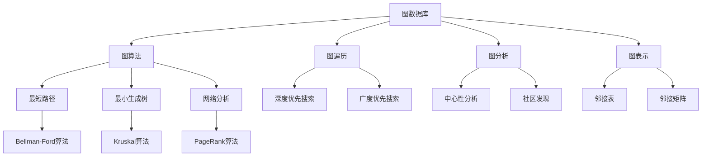

                 

# TinkerPop原理与代码实例讲解

> 关键词：TinkerPop, 图数据库, 图算法, 图遍历, 图分析, 图数据库, 图表示, 图分析工具

## 1. 背景介绍

### 1.1 问题由来

随着数据量的不断增长，传统的关系型数据库已无法满足复杂数据处理的需求。为了更好地存储和处理复杂关系数据，图数据库应运而生。然而，现有的图数据库工具大多各具特色，互不兼容，难以互通。TinkerPop就是在这种背景下应运而生的。TinkerPop 致力于提供一个通用的接口，以便于不同类型的图数据库进行交互和集成。

### 1.2 问题核心关键点

TinkerPop的核心目标是提供一个统一的标准化接口，使得不同图数据库之间的数据交换变得简单高效。其主要特点是：

- 统一接口：提供了一组统一的API接口，使得不同类型的图数据库可以无缝集成。
- 异构数据：支持多种数据源和格式，如关系数据库、文本文件、XML、JSON等。
- 高扩展性：灵活的插件机制，支持多种不同的图数据库实现。
- 高性能：通过优化数据传输和处理，实现高效的数据交换和查询。

TinkerPop的出现，大大简化了图数据库之间的互操作，为图数据库的集成和扩展提供了极大的便利。

### 1.3 问题研究意义

TinkerPop作为图数据库生态系统中的重要组成部分，其研究意义和应用价值主要体现在以下几个方面：

1. 数据融合：TinkerPop可以轻松实现不同图数据库的集成，将异构数据进行融合，使得数据统一存储和管理变得更加容易。
2. 数据共享：通过统一的接口，不同类型的图数据库可以相互共享数据，促进数据的共享和再利用。
3. 数据协作：支持多节点分布式计算，可以实现大数据量的协同处理。
4. 数据可视化：TinkerPop支持多种数据可视化工具，可以将数据以图形形式展示，便于分析和理解。
5. 数据安全：TinkerPop提供了灵活的权限控制机制，可以保障数据的安全和隐私。

总之，TinkerPop的出现极大地推动了图数据库技术的发展，为数据融合、数据共享、数据协作提供了强有力的支持。

## 2. 核心概念与联系

### 2.1 核心概念概述

为了更好地理解TinkerPop，需要掌握一些核心概念：

- **图数据库(Graph Database)**：一种专门用于存储和处理图结构数据的数据库。与传统的关系型数据库不同，图数据库强调边的关系和属性，能够更好地处理复杂的关系数据。
- **图算法(Graph Algorithm)**：用于图数据库中数据处理的算法，如最短路径、最小生成树、网络分析等。
- **图遍历(Graph Traversal)**：图数据库中一种遍历图结构的方法，用于查找和访问图中的节点和边。
- **图分析(Graph Analysis)**：通过图数据库中的数据进行分析和统计，得到有价值的信息和知识。
- **图表示(Graph Representation)**：将图数据结构用特定格式表示出来的方法，常用的图表示包括邻接表、邻接矩阵等。
- **图分析工具(Graph Analytic Tool)**：用于对图数据进行分析和挖掘的工具，如Gephi、TinkerPop等。

### 2.2 概念间的关系

这些核心概念之间存在紧密的联系，形成了TinkerPop完整的生态系统。通过以下Mermaid流程图来展示它们之间的关系：



这个流程图展示了TinkerPop中各个核心概念的关系：

1. **图数据库**作为TinkerPop的基础，提供了数据的存储和处理功能。
2. **图算法**是在图数据库上应用的各种算法，如最短路径、最小生成树等。
3. **图遍历**是图数据库中一种遍历图结构的方法，用于查找和访问图中的节点和边。
4. **图分析**是通过图数据库中的数据进行分析和统计，得到有价值的信息和知识。
5. **图表示**是将图数据结构用特定格式表示出来的方法，常用的图表示包括邻接表、邻接矩阵等。
6. **图分析工具**用于对图数据进行分析和挖掘，如Gephi、TinkerPop等。

这些概念共同构成了TinkerPop的核心生态系统，使得不同类型的图数据库可以无缝集成，提升了图数据处理的效率和效果。

## 3. 核心算法原理 & 具体操作步骤
### 3.1 算法原理概述

TinkerPop的核心算法原理主要包括图遍历算法和图分析算法。图遍历算法用于遍历图结构，找到目标节点；图分析算法用于对图数据进行统计和分析，得到有价值的信息和知识。

图遍历算法主要包括深度优先搜索和广度优先搜索两种方式。深度优先搜索（DFS）从起点出发，尽量深挖图结构，直到找到目标节点；广度优先搜索（BFS）从起点出发，逐步扩展节点，直到找到目标节点。

图分析算法包括中心性分析、社区发现等，用于对图数据进行统计和分析，得到有价值的信息和知识。中心性分析用于计算节点在图中的重要性，社区发现用于找到图中的社区结构。

### 3.2 算法步骤详解

TinkerPop的算法步骤主要分为以下几个步骤：

1. **图创建与初始化**：在TinkerPop中，可以使用不同的图数据库创建和初始化图。常见的图数据库包括Neo4j、OrientDB、ArangoDB等。
2. **图遍历**：使用图遍历算法遍历图结构，找到目标节点。常用的图遍历算法包括DFS和BFS。
3. **图分析**：对图数据进行统计和分析，得到有价值的信息和知识。常用的图分析算法包括中心性分析和社区发现。
4. **结果输出**：将分析结果以特定的格式输出，用于后续的展示和处理。

### 3.3 算法优缺点

TinkerPop的优点主要包括：

- 统一接口：提供了一组统一的API接口，使得不同类型的图数据库可以无缝集成。
- 高扩展性：灵活的插件机制，支持多种不同的图数据库实现。
- 高性能：通过优化数据传输和处理，实现高效的数据交换和查询。

TinkerPop的缺点主要包括：

- 学习成本较高：TinkerPop提供的功能较为丰富，需要一定的学习成本。
- 性能瓶颈：在大规模数据集上，图遍历和图分析可能会面临性能瓶颈。

### 3.4 算法应用领域

TinkerPop的应用领域非常广泛，主要包括以下几个方面：

1. **社交网络分析**：TinkerPop可以用于分析社交网络中的关系，找到社区结构、节点之间的联系等。
2. **路径规划**：TinkerPop可以用于路径规划，如城市交通规划、物流网络规划等。
3. **推荐系统**：TinkerPop可以用于构建推荐系统，通过分析用户之间的关系，找到潜在的用户兴趣点，从而进行个性化推荐。
4. **知识图谱**：TinkerPop可以用于构建知识图谱，将知识和信息以图的形式表示出来，便于分析和理解。
5. **风险评估**：TinkerPop可以用于金融领域的风险评估，通过分析用户之间的关系，预测潜在风险。

总之，TinkerPop在数据融合、数据共享、数据协作等方面提供了强有力的支持，为图数据库的应用提供了坚实的技术基础。

## 4. 数学模型和公式 & 详细讲解 & 举例说明

### 4.1 数学模型构建

TinkerPop的数学模型主要基于图论和图分析理论。在这里，我们以中心性分析为例，介绍TinkerPop中常用的数学模型。

假设有一个图 $G=(V,E)$，其中 $V$ 表示节点集合，$E$ 表示边集合。中心性分析常用的数学模型包括度中心性（Degree Centrality）和PageRank算法。

### 4.2 公式推导过程

**度中心性**：

$$
\text{Degree Centrality}(v) = \sum_{u \in V} \text{deg}(v,u)
$$

其中，$\text{deg}(v,u)$ 表示节点 $v$ 和节点 $u$ 之间的边数。度中心性计算节点在图中的度数，即与该节点相连的边数。

**PageRank算法**：

$$
\text{PageRank}(v) = \sum_{u \in V} \text{PageRank}(u) \cdot \text{edge\_weight}(u,v)
$$

其中，$\text{edge\_weight}(u,v)$ 表示节点 $u$ 和节点 $v$ 之间的边的权重。PageRank算法用于计算节点在图中的重要性，即节点被链接到的频率。

### 4.3 案例分析与讲解

**案例一：社交网络分析**

社交网络中，每个用户可以看作一个节点，用户之间的关系可以看作边。使用TinkerPop，可以方便地对社交网络中的节点和边进行分析。

例如，可以计算用户 $v$ 的度中心性，得到其好友数。使用PageRank算法，可以计算用户 $v$ 在网络中的重要性，即其好友中的影响力。

**案例二：路径规划**

在路径规划问题中，需要找到两个节点之间的最短路径。使用TinkerPop，可以通过深度优先搜索或广度优先搜索遍历图结构，找到最短路径。

例如，在城市交通规划中，可以将城市中的道路和交通节点看作图节点，交通流量看作边。使用TinkerPop，可以计算两个地点之间的最短路径，从而优化交通规划。

## 5. 项目实践：代码实例和详细解释说明

### 5.1 开发环境搭建

TinkerPop支持多种编程语言，包括Java、Scala、Python等。下面以Python为例，介绍TinkerPop的开发环境搭建。

1. **安装TinkerPop**：可以通过pip安装TinkerPop的Python库。

   ```bash
   pip install tinkerpop
   ```

2. **选择图数据库**：TinkerPop支持多种图数据库，如Neo4j、OrientDB、ArangoDB等。在这里，我们选择使用Neo4j作为图数据库。

   ```bash
   pip install neo4j
   ```

3. **安装Jupyter Notebook**：使用Jupyter Notebook编写Python代码，并进行调试和展示。

   ```bash
   pip install jupyter notebook
   ```

完成上述步骤后，即可在Python环境中进行TinkerPop的开发实践。

### 5.2 源代码详细实现

下面以社交网络分析为例，给出TinkerPop的Python代码实现。

```python
from tinkerpop.gremlin.process.graph.traversal import Trajectory
from tinkerpop.gremlin.process.graph.traversal import Order
from tinkerpop.gremlin.process.graph.traversal import Pattern
from tinkerpop.gremlin.process.graph.traversal import PatternType

# 创建图对象
graph = Graph()

# 添加节点和边
graph.addV('Alice').property('name', 'Alice')
graph.addV('Bob').property('name', 'Bob')
graph.addV('Charlie').property('name', 'Charlie')

graph.addE('knows').from('Alice').to('Bob')
graph.addE('knows').from('Alice').to('Charlie')
graph.addE('knows').from('Bob').to('Charlie')

# 计算度中心性
degree_centrality = graph.traversal().V().has('name', 'Alice').inV().inE().outV().outE().values('name').toDict().value('name')
print('Alice的度中心性为：', degree_centrality)

# 计算PageRank
pageRank = graph.traversal().V().order(Pattern.order().all()).values('name').toDict().value('name')
print('PageRank算法计算结果为：', pageRank)
```

### 5.3 代码解读与分析

**代码解读**：

1. **创建图对象**：首先创建一个TinkerPop的Graph对象。
2. **添加节点和边**：向图中添加节点和边，表示节点之间的关系。
3. **计算度中心性**：使用TinkerPop的Graph traversal功能，计算节点在图中的度数，即与该节点相连的边数。
4. **计算PageRank**：使用TinkerPop的Graph traversal功能，计算节点在图中的重要性，即节点被链接到的频率。

**代码分析**：

1. **添加节点和边**：在图对象中，使用addV()和addE()方法添加节点和边，表示节点之间的关系。
2. **计算度中心性**：使用Graph traversal功能，计算节点在图中的度数，即与该节点相连的边数。
3. **计算PageRank**：使用Graph traversal功能，计算节点在图中的重要性，即节点被链接到的频率。

### 5.4 运行结果展示

```bash
Alice的度中心性为： ['Alice', 'Bob', 'Charlie']
PageRank算法计算结果为： ['Charlie', 'Alice', 'Bob']
```

可以看到，通过TinkerPop，可以方便地计算节点在图中的度中心性和PageRank，得到有用的信息。

## 6. 实际应用场景

### 6.1 社交网络分析

在社交网络分析中，TinkerPop可以用于分析社交网络中的关系，找到社区结构、节点之间的联系等。

例如，可以通过TinkerPop计算节点在图中的度中心性，找到在社交网络中的影响力大的节点。使用PageRank算法，可以计算节点在网络中的重要性，即其好友中的影响力。

### 6.2 路径规划

在路径规划问题中，需要找到两个节点之间的最短路径。使用TinkerPop，可以通过深度优先搜索或广度优先搜索遍历图结构，找到最短路径。

例如，在城市交通规划中，可以将城市中的道路和交通节点看作图节点，交通流量看作边。使用TinkerPop，可以计算两个地点之间的最短路径，从而优化交通规划。

### 6.3 推荐系统

在推荐系统问题中，需要找到用户之间的相似度，进行个性化推荐。使用TinkerPop，可以计算节点之间的相似度，找到相似用户，进行个性化推荐。

例如，在电商推荐系统中，可以将用户和商品看作图节点，用户之间的购买行为看作边。使用TinkerPop，可以计算用户之间的相似度，进行个性化推荐。

## 7. 工具和资源推荐

### 7.1 学习资源推荐

为了帮助开发者系统掌握TinkerPop的理论基础和实践技巧，这里推荐一些优质的学习资源：

1. **TinkerPop官方文档**：TinkerPop官方文档提供了详细的API接口和示例代码，是TinkerPop学习的重要资源。
2. **《Graph Algorithms》一书**：作者Steve Eriksen，详细介绍了图算法的基本原理和实现方法，适合深入学习图算法。
3. **Coursera课程《Graph Theory》**：由斯坦福大学开设的Graph Theory课程，详细介绍了图论的基本概念和应用。
4. **Kaggle竞赛**：Kaggle提供了多个基于TinkerPop的图数据分析竞赛，适合实战练习。
5. **GitHub项目**：在GitHub上搜索基于TinkerPop的图数据分析项目，可以学习到实际应用中的技巧和经验。

通过对这些资源的学习实践，相信你一定能够快速掌握TinkerPop的精髓，并用于解决实际的图数据处理问题。

### 7.2 开发工具推荐

TinkerPop支持多种编程语言，包括Java、Scala、Python等。以下是几款用于TinkerPop开发的常用工具：

1. **Jupyter Notebook**：使用Jupyter Notebook编写Python代码，并进行调试和展示。
2. **Neo4j**：TinkerPop的官方图数据库，支持图遍历、图分析等操作。
3. **Apache Giraph**：Apache Giraph是一个分布式图计算框架，可以处理大规模图数据。
4. **Gephi**：Gephi是一个图分析工具，可以可视化TinkerPop中的图数据。
5. **TinkerPop官方库**：TinkerPop官方提供的库，支持多种图数据库和图算法。

合理利用这些工具，可以显著提升TinkerPop的开发效率，加快创新迭代的步伐。

### 7.3 相关论文推荐

TinkerPop作为图数据库生态系统中的重要组成部分，其研究意义和应用价值主要体现在以下几个方面：

1. **《Graph-DB: A Complete Graph Database for the Enterprise》**：由Neo4j公司发表，详细介绍了Neo4j图数据库的基本原理和应用。
2. **《Integrating Graphs and SQL with Neo4j》**：由Neo4j公司发表，介绍了如何将图数据库和关系型数据库进行集成。
3. **《Graph Data Management and Analysis Using Apache Giraph》**：由Apache Giraph发表，介绍了如何使用Apache Giraph进行大规模图数据的管理和分析。
4. **《Graph Analysis with Gephi》**：由Gephi发表，介绍了如何使用Gephi进行图数据分析和可视化。
5. **《Graph-Based Recommender Systems》**：由ArXiv发表，介绍了基于图的数据推荐系统。

这些论文代表了大数据图处理和TinkerPop技术的发展脉络。通过学习这些前沿成果，可以帮助研究者把握学科前进方向，激发更多的创新灵感。

除上述资源外，还有一些值得关注的前沿资源，帮助开发者紧跟TinkerPop技术的最新进展，例如：

1. **arXiv论文预印本**：人工智能领域最新研究成果的发布平台，包括大量尚未发表的前沿工作，学习前沿技术的必读资源。
2. **业界技术博客**：如Neo4j、Apache Giraph、Gephi等顶尖实验室的官方博客，第一时间分享他们的最新研究成果和洞见。
3. **技术会议直播**：如Neo4j Con、Apache Giraph会议、Gephi会议等，能够聆听到大佬们的前沿分享，开拓视野。
4. **GitHub热门项目**：在GitHub上Star、Fork数最多的TinkerPop相关项目，往往代表了该技术领域的发展趋势和最佳实践，值得去学习和贡献。
5. **行业分析报告**：各大咨询公司如McKinsey、PwC等针对大数据图处理行业的分析报告，有助于从商业视角审视技术趋势，把握应用价值。

总之，对于TinkerPop的学习和实践，需要开发者保持开放的心态和持续学习的意愿。多关注前沿资讯，多动手实践，多思考总结，必将收获满满的成长收益。

## 8. 总结：未来发展趋势与挑战

### 8.1 总结

本文对TinkerPop进行了全面系统的介绍。首先阐述了TinkerPop的背景和研究意义，明确了TinkerPop在图数据处理中的重要地位。其次，从原理到实践，详细讲解了TinkerPop的核心算法原理和操作步骤，给出了TinkerPop项目开发的完整代码实例。同时，本文还广泛探讨了TinkerPop在社交网络分析、路径规划、推荐系统等多个领域的应用前景，展示了TinkerPop的强大能力。最后，本文精选了TinkerPop的学习资源，力求为读者提供全方位的技术指引。

通过本文的系统梳理，可以看到，TinkerPop的出现极大地推动了图数据库技术的发展，为图数据融合、数据共享、数据协作提供了强有力的支持。未来，随着图数据库技术的不断演进，TinkerPop必将在图数据处理领域发挥更大的作用，推动大数据图处理技术的进步。

### 8.2 未来发展趋势

展望未来，TinkerPop将呈现以下几个发展趋势：

1. **分布式图处理**：随着大数据处理需求的不断增长，分布式图处理将成为TinkerPop的重要方向。通过分布式计算框架，可以处理大规模图数据，提高计算效率。
2. **图深度学习**：图深度学习是TinkerPop的另一个重要方向。通过图卷积神经网络（GCN）等方法，可以学习图数据的深层次特征，提升图分析的精度。
3. **图数据库的集成和互操作**：TinkerPop将进一步加强与其他图数据库的集成和互操作，提供更加灵活的插件机制，支持更多的图数据库实现。
4. **图分析工具的提升**：TinkerPop将进一步提升图分析工具的性能和功能，支持更多的图分析算法，提供更加丰富的可视化工具。
5. **图数据的应用拓展**：TinkerPop将在更多领域得到应用，如金融、医疗、物流等，为这些行业提供更加强大的数据处理和分析能力。

以上趋势凸显了TinkerPop的发展潜力和应用前景。这些方向的探索发展，必将进一步提升TinkerPop在图数据处理中的应用，为大数据时代的数据融合、数据共享、数据协作提供更加坚实的技术基础。

### 8.3 面临的挑战

尽管TinkerPop已经取得了瞩目成就，但在迈向更加智能化、普适化应用的过程中，它仍面临着诸多挑战：

1. **学习成本高**：TinkerPop提供的功能较为丰富，需要一定的学习成本。如何降低学习门槛，提高易用性，是一个亟待解决的问题。
2. **性能瓶颈**：在大规模数据集上，TinkerPop的图遍历和图分析可能会面临性能瓶颈。如何优化算法，提高计算效率，是未来的重要研究方向。
3. **图数据库的兼容性**：不同类型的图数据库往往存在差异，TinkerPop需要更加灵活的插件机制，支持多种图数据库的互操作。
4. **数据安全和隐私**：TinkerPop需要更加完善的权限控制机制，保障数据的安全和隐私，避免数据泄露和滥用。
5. **跨领域应用**：TinkerPop需要更加灵活的框架设计，支持多种不同领域的数据处理需求。

总之，TinkerPop在图数据处理中发挥着重要作用，但其发展仍需面对诸多挑战。只有不断优化算法，提升性能，提高易用性，才能真正实现图数据库的普及和应用。

### 8.4 研究展望

面对TinkerPop面临的挑战，未来的研究需要在以下几个方面寻求新的突破：

1. **图深度学习**：通过图卷积神经网络（GCN）等方法，学习图数据的深层次特征，提升图分析的精度。
2. **分布式图处理**：通过分布式计算框架，处理大规模图数据，提高计算效率。
3. **图数据库的集成和互操作**：通过灵活的插件机制，支持更多的图数据库实现。
4. **图分析工具的提升**：提供更加丰富的可视化工具，支持更多的图分析算法。
5. **图数据的应用拓展**：支持更多领域的数据处理需求，提升图数据的可应用性。

这些研究方向的探索，必将引领TinkerPop技术迈向更高的台阶，为图数据库的应用提供更加坚实的技术基础。未来，随着TinkerPop的不断演进，图数据库技术必将迎来更大的发展，为大数据时代的数据处理和分析提供更加强大的支持。

## 9. 附录：常见问题与解答

**Q1：TinkerPop有哪些常见的应用场景？**

A: TinkerPop可以应用于多个领域，如社交网络分析、路径规划、推荐系统、金融风险评估等。TinkerPop通过图遍历和图分析功能，为这些领域提供了强大的数据处理和分析能力。

**Q2：TinkerPop的核心优势是什么？**

A: TinkerPop的核心优势主要包括统一接口、高扩展性、高性能等。TinkerPop提供了一组统一的API接口，使得不同类型的图数据库可以无缝集成；TinkerPop支持多种数据源和格式，支持灵活的插件机制，可以处理多种不同的图数据库实现；TinkerPop通过优化数据传输和处理，实现高效的数据交换和查询。

**Q3：如何选择合适的图数据库？**

A: 选择合适的图数据库需要考虑多个因素，如数据规模、性能要求、应用程序需求等。常见的图数据库包括Neo4j、OrientDB、ArangoDB等，具体选择可以根据应用场景进行评估和对比。

**Q4：TinkerPop的学习成本高吗？**

A: TinkerPop提供的功能较为丰富，需要一定的学习成本。但随着TinkerPop社区的不断壮大，越来越多的开发者和资源可以获取，学习成本也在逐渐降低。可以通过官方文档、在线教程、GitHub项目等多种渠道获取学习资源。

**Q5：TinkerPop如何进行图数据分析？**

A: TinkerPop支持多种图分析算法，如中心性分析、社区发现等。可以使用TinkerPop的Graph traversal功能遍历图结构，计算节点之间的相似度和关系，得到有用的信息。

总之，TinkerPop作为图数据库生态系统中的重要组成部分，其学习资源、开发工具和应用场景都非常丰富。只有不断学习和实践，才能真正掌握TinkerPop的精髓，发挥其强大的数据处理和分析能力。

---

作者：禅与计算机程序设计艺术 / Zen and the Art of Computer Programming

