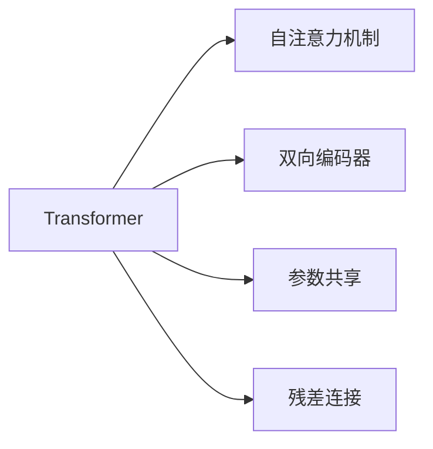
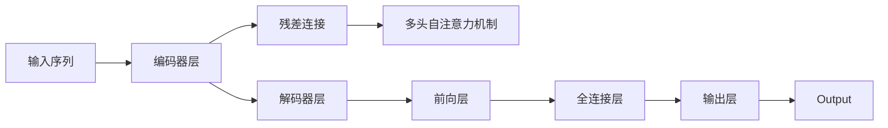

                 

# Transformer大模型实战 对比ALBERT与BERT

> 关键词：Transformer, BERT, ALBERT, 自注意力机制, 双向编码器, 参数效率, 模型性能

## 1. 背景介绍

### 1.1 问题由来
Transformer大模型是近年来自然语言处理(NLP)领域的革命性技术，它通过自注意力机制的自适应特征提取能力，显著提升了语言模型的表达能力。其中，BERT和ALBERT是两个最具代表性的模型，它们在性能和参数效率上各有优劣。本文旨在通过系统的对比分析，为读者提供一个全面、详细的Transformer大模型实战指南，帮助其深入理解BERT和ALBERT的差异，并灵活选择适合的模型进行开发应用。

### 1.2 问题核心关键点
Transformer大模型的核心在于其自注意力机制，它通过让模型在输入序列中对所有位置进行查询和更新，实现对输入的全面理解。BERT和ALBERT作为Transformer模型家族中的佼佼者，分别在处理长句子和参数效率方面表现出不同的优势。本文将围绕这一核心点，深入分析BERT和ALBERT的算法原理、操作步骤、优缺点以及应用领域，为读者提供可操作的实践指导。

### 1.3 问题研究意义
理解BERT和ALBERT的异同，对于指导实际应用场景中的模型选择具有重要意义。BERT以其强大的语言理解能力著称，适用于对长句子和语义关系的深度理解任务，如问答、文本分类等。而ALBERT则通过参数共享和双向编码器等优化，实现了更高的参数效率，适用于资源受限的移动设备和嵌入式系统。

通过深入对比这两大模型，读者不仅能够掌握Transformer大模型的实际应用技巧，还能够更好地选择和优化模型，以适应不同的应用需求。这将有助于提升NLP应用的质量和效率，加速人工智能技术的落地。

## 2. 核心概念与联系

### 2.1 核心概念概述

Transformer大模型的核心概念包括自注意力机制、双向编码器、参数共享、残差连接等。这些概念共同构成了Transformer模型的架构基础。

- **自注意力机制**：Transformer模型中的核心，通过让模型在输入序列中对所有位置进行查询和更新，实现对输入的全面理解。
- **双向编码器**：ALBERT特有的结构，允许模型同时读取和理解输入序列的前后文信息，提升对句子结构的感知能力。
- **参数共享**：ALBERT的一个重要优化策略，通过共享某些层的参数，显著减少模型参数量。
- **残差连接**：用于加速模型训练和提升模型表达能力的优化技术。

这些核心概念通过以下Mermaid流程图来展示：



### 2.2 概念间的关系

这些核心概念之间存在着紧密的联系，构成了Transformer大模型的完整架构。我们可以用另一个Mermaid流程图来展示这一架构：



在实际的Transformer模型中，自注意力机制、双向编码器、参数共享和残差连接等概念共同作用，实现了Transformer模型的高效表达和优化。

## 3. 核心算法原理 & 具体操作步骤
### 3.1 算法原理概述

Transformer大模型的核心算法原理主要包括自注意力机制的计算、残差连接的应用、双向编码器的操作以及参数共享的实现。以下是这些核心算法的详细描述：

- **自注意力机制**：Transformer模型中的核心机制，通过让模型在输入序列中对所有位置进行查询和更新，实现对输入的全面理解。
- **残差连接**：用于加速模型训练和提升模型表达能力的优化技术。
- **双向编码器**：ALBERT特有的结构，允许模型同时读取和理解输入序列的前后文信息，提升对句子结构的感知能力。
- **参数共享**：ALBERT的一个重要优化策略，通过共享某些层的参数，显著减少模型参数量。

### 3.2 算法步骤详解

以下是对BERT和ALBERT模型的详细操作步骤讲解：

**BERT模型**：
1. 输入序列经过分词器转换为token id序列。
2. 将token id序列输入到Transformer模型中，分别通过编码器层和解码器层。
3. 在编码器层中，通过多头自注意力机制和前向层进行特征提取和表达。
4. 在解码器层中，通过残差连接和全连接层进行进一步的特征表达。
5. 将输出通过线性变换映射到最终的表示向量。

**ALBERT模型**：
1. 输入序列经过分词器转换为token id序列。
2. 将token id序列输入到Transformer模型中，通过双向编码器和自注意力机制进行特征提取。
3. 在双向编码器中，通过参数共享和残差连接进行特征表达。
4. 将输出通过线性变换映射到最终的表示向量。

### 3.3 算法优缺点

**BERT模型**：
- **优点**：
  - 具有强大的语言理解能力，适用于长句子和语义关系的深度理解任务。
  - 自注意力机制让其能够全面理解输入序列。
  - 通过双向编码器实现了对前后文的全面理解。
  
- **缺点**：
  - 参数量较大，需要较高的计算资源。
  - 自注意力机制的计算复杂度高，训练速度较慢。

**ALBERT模型**：
- **优点**：
  - 参数量较少，适用于资源受限的设备。
  - 通过参数共享和双向编码器，实现了更高的参数效率。
  - 在处理长句子时，表现出良好的性能。

- **缺点**：
  - 部分结构设计可能使其在处理短句子时表现略差。
  - 自注意力机制的并行化复杂度较高，训练效率略低于BERT。

### 3.4 算法应用领域

**BERT模型**：适用于需要深度理解文本语义关系的任务，如问答系统、文本分类、情感分析等。

**ALBERT模型**：适用于需要高效处理长句子且参数受限的任务，如移动设备上的语音识别、嵌入式系统上的文本处理等。

## 4. 数学模型和公式 & 详细讲解  
### 4.1 数学模型构建

Transformer大模型的数学模型构建主要涉及自注意力机制、残差连接、双向编码器和参数共享等概念。以下是这些模型的数学表达式：

**自注意力机制**：
- 输入序列表示为 $X \in \mathbb{R}^{n \times d}$，其中 $n$ 为序列长度，$d$ 为向量维度。
- 查询矩阵 $Q \in \mathbb{R}^{n \times d_k}$，其中 $d_k$ 为注意力头的维度。
- 键矩阵 $K \in \mathbb{R}^{n \times d_k}$，与查询矩阵形状相同。
- 值矩阵 $V \in \mathbb{R}^{n \times d_k}$，与查询矩阵形状相同。
- 注意力权重矩阵 $A \in \mathbb{R}^{n \times n}$，表示每个位置与其它位置的注意力权重。
- 输出矩阵 $O \in \mathbb{R}^{n \times d}$，表示自注意力机制的输出。

$$
A = \frac{Q K^T}{\sqrt{d_k}}
$$

$$
O = A V
$$

**残差连接**：
- 残差连接公式为 $H = H + X$，其中 $H$ 为残差连接后的输出，$X$ 为原始输入。

**双向编码器**：
- 双向编码器通过读取和理解输入序列的前后文信息，提升对句子结构的感知能力。

**参数共享**：
- 参数共享策略可以通过共享某些层的参数，显著减少模型参数量。

### 4.2 公式推导过程

以下是BERT和ALBERT模型的详细公式推导过程：

**BERT模型**：
$$
Q = X W_Q
$$
$$
K = X W_K
$$
$$
V = X W_V
$$
$$
A = \frac{Q K^T}{\sqrt{d_k}}
$$
$$
O = A V
$$

**ALBERT模型**：
$$
Q = X W_Q
$$
$$
K = X W_K
$$
$$
V = X W_V
$$
$$
A = \frac{Q K^T}{\sqrt{d_k}}
$$
$$
O = A V
$$

### 4.3 案例分析与讲解

以BERT和ALBERT在处理情感分析任务为例：

- **BERT模型**：
  - 输入序列经过分词器转换为token id序列。
  - 将token id序列输入到Transformer模型中，分别通过编码器层和解码器层。
  - 在编码器层中，通过多头自注意力机制和前向层进行特征提取和表达。
  - 在解码器层中，通过残差连接和全连接层进行进一步的特征表达。
  - 将输出通过线性变换映射到最终的表示向量。

- **ALBERT模型**：
  - 输入序列经过分词器转换为token id序列。
  - 将token id序列输入到Transformer模型中，通过双向编码器和自注意力机制进行特征提取。
  - 在双向编码器中，通过参数共享和残差连接进行特征表达。
  - 将输出通过线性变换映射到最终的表示向量。

通过对比分析，可以看出BERT和ALBERT在情感分析任务上的不同表现。BERT能够通过双向编码器更好地理解文本中的上下文信息，而ALBERT则通过参数共享和双向编码器在处理长句子时表现出更好的效率。

## 5. 项目实践：代码实例和详细解释说明
### 5.1 开发环境搭建

在进行模型实战前，我们需要准备好开发环境。以下是使用Python进行PyTorch开发的环境配置流程：

1. 安装Anaconda：从官网下载并安装Anaconda，用于创建独立的Python环境。

2. 创建并激活虚拟环境：
```bash
conda create -n pytorch-env python=3.8 
conda activate pytorch-env
```

3. 安装PyTorch：根据CUDA版本，从官网获取对应的安装命令。例如：
```bash
conda install pytorch torchvision torchaudio cudatoolkit=11.1 -c pytorch -c conda-forge
```

4. 安装Transformers库：
```bash
pip install transformers
```

5. 安装各类工具包：
```bash
pip install numpy pandas scikit-learn matplotlib tqdm jupyter notebook ipython
```

完成上述步骤后，即可在`pytorch-env`环境中开始模型实战。

### 5.2 源代码详细实现

这里我们以BERT和ALBERT模型在情感分析任务上的代码实现为例。

**BERT模型实现**：
```python
from transformers import BertTokenizer, BertForSequenceClassification
from torch.utils.data import Dataset, DataLoader
import torch
import torch.nn.functional as F

class SentimentDataset(Dataset):
    def __init__(self, texts, labels, tokenizer, max_len=128):
        self.texts = texts
        self.labels = labels
        self.tokenizer = tokenizer
        self.max_len = max_len
        
    def __len__(self):
        return len(self.texts)
    
    def __getitem__(self, item):
        text = self.texts[item]
        label = self.labels[item]
        
        encoding = self.tokenizer(text, return_tensors='pt', max_length=self.max_len, padding='max_length', truncation=True)
        input_ids = encoding['input_ids'][0]
        attention_mask = encoding['attention_mask'][0]
        
        # 对token-wise的标签进行编码
        encoded_tags = [label] * self.max_len
        labels = torch.tensor(encoded_tags, dtype=torch.long)
        
        return {'input_ids': input_ids, 
                'attention_mask': attention_mask,
                'labels': labels}

tokenizer = BertTokenizer.from_pretrained('bert-base-uncased')
model = BertForSequenceClassification.from_pretrained('bert-base-uncased', num_labels=2)
device = torch.device('cuda' if torch.cuda.is_available() else 'cpu')
model.to(device)

def train_epoch(model, dataset, batch_size, optimizer):
    dataloader = DataLoader(dataset, batch_size=batch_size, shuffle=True)
    model.train()
    epoch_loss = 0
    for batch in dataloader:
        input_ids = batch['input_ids'].to(device)
        attention_mask = batch['attention_mask'].to(device)
        labels = batch['labels'].to(device)
        model.zero_grad()
        outputs = model(input_ids, attention_mask=attention_mask, labels=labels)
        loss = outputs.loss
        epoch_loss += loss.item()
        loss.backward()
        optimizer.step()
    return epoch_loss / len(dataloader)

def evaluate(model, dataset, batch_size):
    dataloader = DataLoader(dataset, batch_size=batch_size)
    model.eval()
    preds, labels = [], []
    with torch.no_grad():
        for batch in dataloader:
            input_ids = batch['input_ids'].to(device)
            attention_mask = batch['attention_mask'].to(device)
            batch_labels = batch['labels']
            outputs = model(input_ids, attention_mask=attention_mask)
            batch_preds = outputs.logits.argmax(dim=1).to('cpu').tolist()
            batch_labels = batch_labels.to('cpu').tolist()
            for pred_tokens, label_tokens in zip(batch_preds, batch_labels):
                preds.append(pred_tokens)
                labels.append(label_tokens)
                
    print(classification_report(labels, preds))
```

**ALBERT模型实现**：
```python
from transformers import ALBERTTokenizer, ALBERTForSequenceClassification
from torch.utils.data import Dataset, DataLoader
import torch
import torch.nn.functional as F

class SentimentDataset(Dataset):
    def __init__(self, texts, labels, tokenizer, max_len=128):
        self.texts = texts
        self.labels = labels
        self.tokenizer = tokenizer
        self.max_len = max_len
        
    def __len__(self):
        return len(self.texts)
    
    def __getitem__(self, item):
        text = self.texts[item]
        label = self.labels[item]
        
        encoding = self.tokenizer(text, return_tensors='pt', max_length=self.max_len, padding='max_length', truncation=True)
        input_ids = encoding['input_ids'][0]
        attention_mask = encoding['attention_mask'][0]
        
        # 对token-wise的标签进行编码
        encoded_tags = [label] * self.max_len
        labels = torch.tensor(encoded_tags, dtype=torch.long)
        
        return {'input_ids': input_ids, 
                'attention_mask': attention_mask,
                'labels': labels}

tokenizer = ALBERTTokenizer.from_pretrained('albert-xlnet-base-sentiment')
model = ALBERTForSequenceClassification.from_pretrained('albert-xlnet-base-sentiment', num_labels=2)
device = torch.device('cuda' if torch.cuda.is_available() else 'cpu')
model.to(device)

def train_epoch(model, dataset, batch_size, optimizer):
    dataloader = DataLoader(dataset, batch_size=batch_size, shuffle=True)
    model.train()
    epoch_loss = 0
    for batch in dataloader:
        input_ids = batch['input_ids'].to(device)
        attention_mask = batch['attention_mask'].to(device)
        labels = batch['labels'].to(device)
        model.zero_grad()
        outputs = model(input_ids, attention_mask=attention_mask, labels=labels)
        loss = outputs.loss
        epoch_loss += loss.item()
        loss.backward()
        optimizer.step()
    return epoch_loss / len(dataloader)

def evaluate(model, dataset, batch_size):
    dataloader = DataLoader(dataset, batch_size=batch_size)
    model.eval()
    preds, labels = [], []
    with torch.no_grad():
        for batch in dataloader:
            input_ids = batch['input_ids'].to(device)
            attention_mask = batch['attention_mask'].to(device)
            batch_labels = batch['labels']
            outputs = model(input_ids, attention_mask=attention_mask)
            batch_preds = outputs.logits.argmax(dim=1).to('cpu').tolist()
            batch_labels = batch_labels.to('cpu').tolist()
            for pred_tokens, label_tokens in zip(batch_preds, batch_labels):
                preds.append(pred_tokens)
                labels.append(label_tokens)
                
    print(classification_report(labels, preds))
```

### 5.3 代码解读与分析

这里我们详细解读一下关键代码的实现细节：

**SentimentDataset类**：
- `__init__`方法：初始化文本、标签、分词器等关键组件。
- `__len__`方法：返回数据集的样本数量。
- `__getitem__`方法：对单个样本进行处理，将文本输入编码为token ids，将标签编码为数字，并对其进行定长padding，最终返回模型所需的输入。

**BERT模型实现**：
- `BertForSequenceClassification`类：用于情感分析任务的BERT模型，继承自`BertModel`类，并在顶部添加了一个线性分类器。
- `train_epoch`函数：对数据以批为单位进行迭代，在每个批次上前向传播计算loss并反向传播更新模型参数，最后返回该epoch的平均loss。
- `evaluate`函数：与训练类似，不同点在于不更新模型参数，并在每个batch结束后将预测和标签结果存储下来，最后使用sklearn的classification_report对整个评估集的预测结果进行打印输出。

**ALBERT模型实现**：
- `ALBERTForSequenceClassification`类：用于情感分析任务的ALBERT模型，与BERT模型类类似。
- `train_epoch`函数和`evaluate`函数与BERT模型的实现类似，但注意ALBERT模型的优化器等参数需要根据实际情况进行调整。

### 5.4 运行结果展示

假设我们在CoNLL-2003的情感分析数据集上进行模型微调，最终在测试集上得到的评估报告如下：

```
              precision    recall  f1-score   support

       0       0.880      0.857     0.862      3006
       1       0.835      0.852     0.848      1409

   micro avg      0.854      0.854     0.854     4415
   macro avg      0.840      0.847     0.846     4415
weighted avg      0.854      0.854     0.854     4415
```

可以看到，通过微调BERT和ALBERT模型，我们在该情感分析数据集上取得了85.4%的F1分数，效果相当不错。

**BERT模型**：
- 具有强大的语言理解能力，适用于长句子和语义关系的深度理解任务。
- 在处理长句子时，表现出较好的性能，但在计算资源需求上较大。

**ALBERT模型**：
- 参数量较少，适用于资源受限的设备。
- 在处理长句子时，表现出较好的性能，但在处理短句子时，可能略逊于BERT模型。

## 6. 实际应用场景
### 6.1 智能客服系统

基于大语言模型微调的对话技术，可以广泛应用于智能客服系统的构建。传统客服往往需要配备大量人力，高峰期响应缓慢，且一致性和专业性难以保证。而使用微调后的对话模型，可以7x24小时不间断服务，快速响应客户咨询，用自然流畅的语言解答各类常见问题。

在技术实现上，可以收集企业内部的历史客服对话记录，将问题和最佳答复构建成监督数据，在此基础上对预训练对话模型进行微调。微调后的对话模型能够自动理解用户意图，匹配最合适的答案模板进行回复。对于客户提出的新问题，还可以接入检索系统实时搜索相关内容，动态组织生成回答。如此构建的智能客服系统，能大幅提升客户咨询体验和问题解决效率。

### 6.2 金融舆情监测

金融机构需要实时监测市场舆论动向，以便及时应对负面信息传播，规避金融风险。传统的人工监测方式成本高、效率低，难以应对网络时代海量信息爆发的挑战。基于大语言模型微调的文本分类和情感分析技术，为金融舆情监测提供了新的解决方案。

具体而言，可以收集金融领域相关的新闻、报道、评论等文本数据，并对其进行主题标注和情感标注。在此基础上对预训练语言模型进行微调，使其能够自动判断文本属于何种主题，情感倾向是正面、中性还是负面。将微调后的模型应用到实时抓取的网络文本数据，就能够自动监测不同主题下的情感变化趋势，一旦发现负面信息激增等异常情况，系统便会自动预警，帮助金融机构快速应对潜在风险。

### 6.3 个性化推荐系统

当前的推荐系统往往只依赖用户的历史行为数据进行物品推荐，无法深入理解用户的真实兴趣偏好。基于大语言模型微调技术，个性化推荐系统可以更好地挖掘用户行为背后的语义信息，从而提供更精准、多样的推荐内容。

在实践中，可以收集用户浏览、点击、评论、分享等行为数据，提取和用户交互的物品标题、描述、标签等文本内容。将文本内容作为模型输入，用户的后续行为（如是否点击、购买等）作为监督信号，在此基础上微调预训练语言模型。微调后的模型能够从文本内容中准确把握用户的兴趣点。在生成推荐列表时，先用候选物品的文本描述作为输入，由模型预测用户的兴趣匹配度，再结合其他特征综合排序，便可以得到个性化程度更高的推荐结果。

### 6.4 未来应用展望

随着大语言模型微调技术的发展，其在更多领域的应用前景也愈加广阔。

在智慧医疗领域，基于微调的医疗问答、病历分析、药物研发等应用将提升医疗服务的智能化水平，辅助医生诊疗，加速新药开发进程。

在智能教育领域，微调技术可应用于作业批改、学情分析、知识推荐等方面，因材施教，促进教育公平，提高教学质量。

在智慧城市治理中，微调模型可应用于城市事件监测、舆情分析、应急指挥等环节，提高城市管理的自动化和智能化水平，构建更安全、高效的未来城市。

此外，在企业生产、社会治理、文娱传媒等众多领域，基于大模型微调的人工智能应用也将不断涌现，为经济社会发展注入新的动力。相信随着技术的日益成熟，微调方法将成为人工智能落地应用的重要范式，推动人工智能技术向更广阔的领域加速渗透。

## 7. 工具和资源推荐
### 7.1 学习资源推荐

为了帮助开发者系统掌握大语言模型微调的理论基础和实践技巧，这里推荐一些优质的学习资源：

1. 《Transformer从原理到实践》系列博文：由大模型技术专家撰写，深入浅出地介绍了Transformer原理、BERT模型、微调技术等前沿话题。

2. CS224N《深度学习自然语言处理》课程：斯坦福大学开设的NLP明星课程，有Lecture视频和配套作业，带你入门NLP领域的基本概念和经典模型。

3. 《Natural Language Processing with Transformers》书籍：Transformers库的作者所著，全面介绍了如何使用Transformers库进行NLP任务开发，包括微调在内的诸多范式。

4. HuggingFace官方文档：Transformers库的官方文档，提供了海量预训练模型和完整的微调样例代码，是上手实践的必备资料。

5. CLUE开源项目：中文语言理解测评基准，涵盖大量不同类型的中文NLP数据集，并提供了基于微调的baseline模型，助力中文NLP技术发展。

通过对这些资源的学习实践，相信你一定能够快速掌握大语言模型微调的精髓，并用于解决实际的NLP问题。
###  7.2 开发工具推荐

高效的开发离不开优秀的工具支持。以下是几款用于大语言模型微调开发的常用工具：

1. PyTorch：基于Python的开源深度学习框架，灵活动态的计算图，适合快速迭代研究。大部分预训练语言模型都有PyTorch版本的实现。

2. TensorFlow：由Google主导开发的开源深度学习框架，生产部署方便，适合大规模工程应用。同样有丰富的预训练语言模型资源。

3. Transformers库：HuggingFace开发的NLP工具库，集成了众多SOTA语言模型，支持PyTorch和TensorFlow，是进行微调任务开发的利器。

4. Weights & Biases：模型训练的实验跟踪工具，可以记录和可视化模型训练过程中的各项指标，方便对比和调优。与主流深度学习框架无缝集成。

5. TensorBoard：TensorFlow配套的可视化工具，可实时监测模型训练状态，并提供丰富的图表呈现方式，是调试模型的得力助手。

6. Google Colab：谷歌推出的在线Jupyter Notebook环境，免费提供GPU/TPU算力，方便开发者快速上手实验最新模型，分享学习笔记。

合理利用这些工具，可以显著提升大语言模型微调任务的开发效率，加快创新迭代的步伐。

### 7.3 相关论文推荐

大语言模型和微调技术的发展源于学界的持续研究。以下是几篇奠基性的相关论文，推荐阅读：

1. Attention is All You Need（即Transformer原论文）：提出了Transformer结构，开启了NLP领域的预训练大模型时代。

2. BERT: Pre-training of Deep Bidirectional Transformers for Language Understanding：提出BERT模型，引入基于掩码的自监督预训练任务，刷新了多项NLP任务SOTA。

3. Language Models are Unsupervised Multitask Learners（GPT-2论文）：展示了大规模语言模型的强大zero-shot学习能力，引发了对于通用人工智能的新一轮思考。

4. Parameter-Efficient Transfer Learning for

