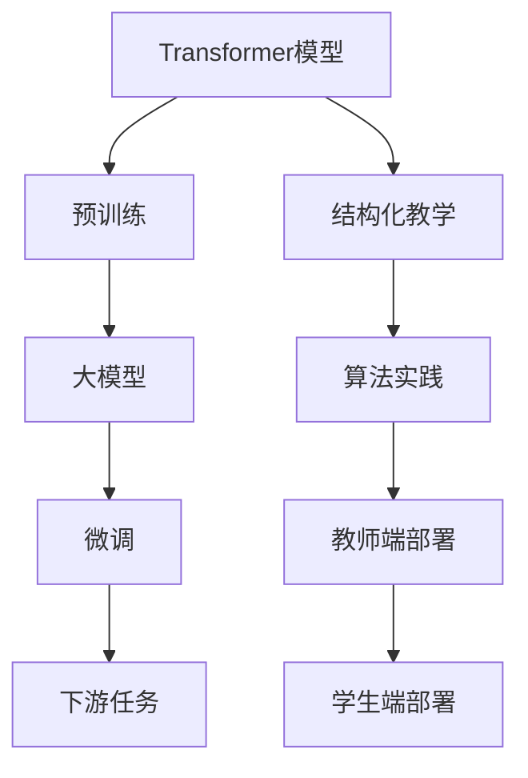

                 

# Transformer大模型实战 教师 学生架构

> 关键词：Transformer, 大模型, 微调, 预训练, 结构化教学, 算法实践

## 1. 背景介绍

### 1.1 问题由来

Transformer模型是目前最先进的自然语言处理(NLP)工具之一，特别是在语言生成、机器翻译、文本分类等任务上表现卓越。尽管Transformer在学术界和工业界都取得了巨大成功，但实际应用中仍面临着诸多挑战。如何在大规模教学场景中，将Transformer模型高效地部署到教师和学生端，一直是研究人员和工程人员的共同课题。

### 1.2 问题核心关键点

为满足大规模教学需求，基于Transformer的大模型实战需要考虑以下核心问题：

- 模型的可扩展性：如何快速搭建适合不同规模的教学环境的模型？
- 数据的自动化处理：如何高效收集、处理大规模的教学数据？
- 算力的合理利用：如何在资源有限的条件下高效利用计算资源？
- 模型的个性化适配：如何针对不同学科、不同年级的教学需求，定制化地调整模型参数？
- 教学评价的自动化：如何自动评估模型在实际教学中的表现？

### 1.3 问题研究意义

Transformer大模型实战的目的是，通过构建结构化、可定制化的教学环境，让Transformer模型能够高效、灵活地应用于各类教育场景。这不仅能提升教学质量，还能显著降低教育成本，缩短教学周期，为大规模教学提供技术支撑。

具体而言，大模型实战能带来以下几方面的好处：
- 提高教学效率：自动化收集和处理教学数据，显著提升教学活动的组织效率。
- 增强教学效果：通过定制化模型参数，提高针对特定学科、特定年级的教学效果。
- 优化教育体验：通过微调模型，适配不同学生的学习习惯和认知水平，实现个性化教学。
- 加速教育技术创新：为教育技术的迭代和优化提供高效的基础设施支持。

## 2. 核心概念与联系

### 2.1 核心概念概述

在讨论基于Transformer的大模型实战前，首先介绍一些关键概念：

- **Transformer模型**：一种基于自注意力机制的神经网络结构，能够在处理大规模文本数据时取得优异的效果。
- **大模型**：指基于大规模语料进行预训练的Transformer模型，包含数十亿甚至上百亿参数。
- **预训练**：指在大规模无标签文本数据上，通过自监督学习任务训练通用语言模型的过程。
- **微调**：指在预训练模型的基础上，使用下游任务的少量标注数据，通过有监督学习优化模型在特定任务上的性能。
- **结构化教学**：指在教学活动中，通过合理设计教学内容、评估标准等，引导学生高效学习的方法。
- **算法实践**：指将理论算法应用于具体教学实践中，提升教学效果的过程。

这些概念通过以下Mermaid流程图展示它们之间的联系：



### 2.2 概念间的关系

通过上述流程图可以看出，Transformer大模型实战涉及多个关键概念，它们的相互关系可以总结如下：

1. **大模型是基础**：大模型通过预训练获得了通用的语言表示，是进行微调的基础。
2. **微调是关键**：微调使大模型能够适应特定的下游任务，提升模型的教学效果。
3. **结构化教学提供方向**：结构化教学设计了合理的学习内容、评估标准，指导微调的优化方向。
4. **算法实践提供手段**：算法实践提供了具体的操作方法，将理论算法应用于教学实践中。
5. **教师端部署与学生端部署是目标**：最终目的是在实际教学中有效部署大模型，实现个性化、高效的教学效果。

## 3. 核心算法原理 & 具体操作步骤
### 3.1 算法原理概述

基于Transformer的大模型实战，核心在于通过微调，使大模型能够高效、灵活地适应不同的教学场景。微调的主要流程如下：

1. **数据收集与处理**：收集教师和学生的互动数据，包括提问、回答、反馈等，并进行清洗、标注。
2. **模型加载与适配**：根据教学需求，加载预训练大模型，并进行任务适配。
3. **模型微调**：使用标注数据，对模型进行有监督学习，优化其在特定任务上的性能。
4. **教学评估与反馈**：对微调后的模型进行评估，收集反馈数据，指导后续的微调优化。

### 3.2 算法步骤详解

接下来，详细讲解Transformer大模型实战的每个步骤：

#### 3.2.1 数据收集与处理

1. **数据来源**：可以从在线教育平台、学习管理系统(LMS)、学生自提交的数据等渠道收集教学数据。
2. **数据清洗**：去除噪声数据、处理缺失值、去重等，确保数据质量。
3. **数据标注**：将教师和学生的互动数据进行标注，如将学生回答标记为正确或错误，将教师反馈标记为积极或消极等。

#### 3.2.2 模型加载与适配

1. **模型选择**：根据教学需求选择合适的预训练大模型，如BART、GPT-3等。
2. **模型初始化**：加载预训练模型，并进行初始化，设置模型超参数，如学习率、批大小等。
3. **任务适配**：根据教学任务需求，修改模型的输出层和损失函数。例如，对于问答任务，可以使用线性分类器作为输出层，交叉熵损失作为损失函数。

#### 3.2.3 模型微调

1. **微调数据准备**：将标注好的数据集划分为训练集、验证集和测试集。
2. **微调过程**：使用微调数据集，对模型进行有监督学习。一般使用AdamW等优化器，设定较小的学习率，避免破坏预训练权重。
3. **评估与优化**：在验证集上定期评估模型性能，根据评估结果调整学习率、正则化强度等超参数，防止过拟合。

#### 3.2.4 教学评估与反馈

1. **评估指标**：根据教学目标，设计评估指标，如准确率、召回率、F1分数等。
2. **反馈机制**：收集教师和学生的反馈数据，如教学难度、学生掌握情况等，指导后续微调优化。
3. **模型迭代**：根据反馈数据，不断迭代微调过程，优化模型参数，提高教学效果。

### 3.3 算法优缺点

基于Transformer的大模型实战有以下优点：

- **高效性**：通过微调，可以快速适应特定教学任务，提升教学效果。
- **灵活性**：可以根据教学需求，灵活调整模型参数，满足个性化教学要求。
- **通用性**：适用于各种NLP任务，如问答、文本分类、机器翻译等。
- **可扩展性**：大模型可快速扩展到不同规模的教学环境，支持大规模教育需求。

同时，该方法也存在一些局限性：

- **依赖标注数据**：微调效果受标注数据质量的影响较大，数据标注成本较高。
- **资源消耗大**：大规模模型的训练和微调需要高性能计算资源，可能存在资源瓶颈。
- **易受数据偏见影响**：预训练模型可能学习到数据中的偏见，影响教学效果。

### 3.4 算法应用领域

基于Transformer的大模型实战，已经在多个教育领域得到应用，例如：

- **在线教育**：构建在线课堂，通过微调大模型，实时解答学生问题，提供个性化推荐。
- **智能辅导系统**：在智能辅导系统中，使用大模型分析学生作业，提供精准的反馈和改进建议。
- **自动批改系统**：对学生的编程作业、数学题等进行自动批改，提高批改效率。
- **智能评估系统**：评估学生的语言水平、知识掌握情况等，为教师提供参考。

除了上述应用外，大模型实战还在智能阅卷、跨语言教学等领域展示出其强大的潜力，为教育技术的创新提供了新的方向。

## 4. 数学模型和公式 & 详细讲解 & 举例说明

### 4.1 数学模型构建

假设我们有一个用于问答任务的大模型，记为 $M_{\theta}$，其中 $\theta$ 为模型参数。设微调任务的数据集为 $D=\{(x_i,y_i)\}_{i=1}^N$，其中 $x_i$ 为学生提问，$y_i$ 为教师回答。

定义模型 $M_{\theta}$ 在输入 $x_i$ 上的预测输出为 $\hat{y}_i=M_{\theta}(x_i)$，目标为最小化预测输出 $\hat{y}_i$ 与真实标签 $y_i$ 之间的差异。

常见的损失函数包括交叉熵损失：

$$
\mathcal{L}(\theta) = -\frac{1}{N}\sum_{i=1}^N \log \frac{e^{\hat{y}_{i,j}}}{\sum_k e^{\hat{y}_{i,k}}}
$$

其中 $\hat{y}_{i,j}$ 为模型预测输出的第 $j$ 个元素。

### 4.2 公式推导过程

以二分类任务为例，推导交叉熵损失函数及其梯度的计算公式。

设模型 $M_{\theta}$ 在输入 $x_i$ 上的输出为 $\hat{y}_i=M_{\theta}(x_i) \in [0,1]$，表示学生提问是否与教师回答匹配的概率。真实标签 $y_i \in \{0,1\}$。则二分类交叉熵损失函数定义为：

$$
\ell(M_{\theta}(x_i),y_i) = -[y_i\log \hat{y}_i + (1-y_i)\log (1-\hat{y}_i)]
$$

将其代入经验风险公式，得：

$$
\mathcal{L}(\theta) = -\frac{1}{N}\sum_{i=1}^N [y_i\log \hat{y}_i+(1-y_i)\log(1-\hat{y}_i)]
$$

根据链式法则，损失函数对参数 $\theta_k$ 的梯度为：

$$
\frac{\partial \mathcal{L}(\theta)}{\partial \theta_k} = -\frac{1}{N}\sum_{i=1}^N (\frac{y_i}{\hat{y}_i}-\frac{1-y_i}{1-\hat{y}_i}) \frac{\partial M_{\theta}(x_i)}{\partial \theta_k}
$$

其中 $\frac{\partial M_{\theta}(x_i)}{\partial \theta_k}$ 可进一步递归展开，利用自动微分技术完成计算。

### 4.3 案例分析与讲解

以一个具体的微调案例为例，解释如何使用微调实现问答任务。

假设我们有一个问答任务数据集，其中每个样本 $(x_i,y_i)$ 表示一个学生提问 $x_i$ 和教师回答 $y_i$。使用微调方法，将大模型 $M_{\theta}$ 适配为问答任务模型。

1. **数据准备**：将数据集划分为训练集、验证集和测试集，并保证数据分布的均衡性。
2. **模型初始化**：加载大模型 $M_{\theta}$，并设置模型超参数，如学习率、批大小等。
3. **任务适配**：在模型顶层添加线性分类器作为输出层，并使用交叉熵损失作为损失函数。
4. **模型微调**：使用训练集对模型进行有监督学习，最小化损失函数 $\mathcal{L}(\theta)$。在验证集上定期评估模型性能，防止过拟合。
5. **模型评估**：在测试集上评估微调后模型 $M_{\hat{\theta}}$ 的性能，对比微调前后的精度提升。

## 5. 项目实践：代码实例和详细解释说明

### 5.1 开发环境搭建

为了进行基于Transformer的大模型实战，我们需要准备以下开发环境：

1. **Python环境**：安装Python 3.x版本，确保环境稳定。
2. **TensorFlow或PyTorch**：选择TensorFlow或PyTorch作为深度学习框架，确保模型兼容性。
3. **Transformer库**：安装最新版本的Transformer库，支持多种预训练模型和微调功能。
4. **数据集准备**：准备教学数据集，并进行清洗、标注等处理。

### 5.2 源代码详细实现

以下是一个使用TensorFlow进行微调的问答任务代码实现示例：

```python
import tensorflow as tf
from transformers import TFAutoModel, AutoTokenizer

# 加载预训练模型和分词器
model_name = 'bert-base-uncased'
tokenizer = AutoTokenizer.from_pretrained(model_name)
model = TFAutoModel.from_pretrained(model_name)

# 定义交叉熵损失函数
def cross_entropy_loss(labels, logits):
    return tf.reduce_mean(tf.nn.sparse_softmax_cross_entropy_with_logits(labels=labels, logits=logits))

# 定义微调过程
@tf.function
def train_step(inputs, labels):
    with tf.GradientTape() as tape:
        logits = model(inputs)
        loss = cross_entropy_loss(labels, logits)
    gradients = tape.gradient(loss, model.trainable_variables)
    optimizer.apply_gradients(zip(gradients, model.trainable_variables))

# 训练循环
num_epochs = 5
batch_size = 32
train_dataset = preprocess_train_data()  # 数据预处理
for epoch in range(num_epochs):
    for inputs, labels in train_dataset:
        train_step(inputs, labels)

# 测试和评估
test_dataset = preprocess_test_data()
eval_loss = tf.keras.metrics.Mean()
for inputs, labels in test_dataset:
    eval_loss.update_state(cross_entropy_loss(labels, model(inputs)))
print('Test Loss:', eval_loss.result().numpy())
```

### 5.3 代码解读与分析

以上代码实现了基于Transformer的大模型微调过程。具体解释如下：

- **加载模型和分词器**：通过`AutoTokenizer`和`TFAutoModel`加载预训练模型和分词器，方便进行微调。
- **定义损失函数**：使用交叉熵损失函数，计算模型预测输出与真实标签之间的差异。
- **定义微调过程**：使用`tf.function`装饰器定义一个微调函数，计算损失并更新模型参数。
- **训练循环**：通过循环迭代，对训练数据集进行有监督学习。
- **测试和评估**：在测试数据集上评估微调后模型的性能，输出测试损失。

## 6. 实际应用场景

### 6.1 在线教育

在线教育平台可以采用大模型微调技术，构建智能问答系统，实时解答学生问题。系统首先收集学生的提问，并利用微调后的大模型进行回答。如果回答准确，系统可以提供额外解释和参考资料；否则，系统可以提示学生重新提问，直到得到满意的答案。

### 6.2 智能辅导系统

智能辅导系统可以基于大模型微调，对学生的作业进行智能批改。系统先通过微调模型对学生的作业进行初步判断，标记为正确或错误，并提供详细的错误提示和改进建议。这不仅能够提高批改效率，还能帮助学生更好地理解学习内容。

### 6.3 自动批改系统

自动批改系统可以用于数学题、编程题等复杂任务的批改。系统使用微调的大模型对学生提交的答案进行评分，并自动生成详细的解析过程。这不仅能够减轻教师的工作负担，还能为学生提供更具体的反馈。

### 6.4 未来应用展望

随着大模型实战技术的不断成熟，未来其在教育领域的应用将更加广泛，涵盖更多教育环节，带来更高的效率和更好的效果。

1. **个性化学习推荐**：基于学生学习行为数据，微调大模型进行个性化推荐，帮助学生选择适合自己的学习路径和资源。
2. **智能评估系统**：利用大模型进行学生的语言水平、知识掌握情况等评估，为教师提供有价值的参考。
3. **智能阅卷系统**：对学生的试卷进行自动批改，提高阅卷效率，同时保证评分的一致性和公正性。
4. **跨语言教育**：利用多语言模型，实现跨语言的智能教学，帮助学生更好地理解和掌握外语知识。

## 7. 工具和资源推荐

### 7.1 学习资源推荐

为了帮助开发者系统掌握Transformer大模型实战的理论基础和实践技巧，这里推荐一些优质的学习资源：

1. **《Transformer：从原理到实践》系列博文**：由大模型技术专家撰写，深入浅出地介绍了Transformer原理、预训练、微调等前沿话题。
2. **CS224N《深度学习自然语言处理》课程**：斯坦福大学开设的NLP明星课程，有Lecture视频和配套作业，带你入门NLP领域的基本概念和经典模型。
3. **《自然语言处理与Transformer》书籍**：Transformers库的作者所著，全面介绍了如何使用Transformer库进行NLP任务开发，包括微调在内的诸多范式。
4. **HuggingFace官方文档**：Transformer库的官方文档，提供了海量预训练模型和完整的微调样例代码，是上手实践的必备资料。
5. **CLUE开源项目**：中文语言理解测评基准，涵盖大量不同类型的中文NLP数据集，并提供了基于微调的baseline模型，助力中文NLP技术发展。

通过对这些资源的学习实践，相信你一定能够快速掌握Transformer大模型实战的精髓，并用于解决实际的NLP问题。

### 7.2 开发工具推荐

高效的开发离不开优秀的工具支持。以下是几款用于Transformer大模型微调开发的常用工具：

1. **TensorFlow**：由Google主导开发的开源深度学习框架，生产部署方便，适合大规模工程应用。
2. **PyTorch**：基于Python的开源深度学习框架，灵活动态的计算图，适合快速迭代研究。
3. **Transformer库**：HuggingFace开发的NLP工具库，集成了众多SOTA语言模型，支持TensorFlow和PyTorch，是进行微调任务开发的利器。
4. **Weights & Biases**：模型训练的实验跟踪工具，可以记录和可视化模型训练过程中的各项指标，方便对比和调优。
5. **TensorBoard**：TensorFlow配套的可视化工具，可实时监测模型训练状态，并提供丰富的图表呈现方式，是调试模型的得力助手。

合理利用这些工具，可以显著提升Transformer大模型微调任务的开发效率，加快创新迭代的步伐。

### 7.3 相关论文推荐

Transformer大模型实战的研究源于学界的持续研究。以下是几篇奠基性的相关论文，推荐阅读：

1. **Attention is All You Need**：提出了Transformer结构，开启了NLP领域的预训练大模型时代。
2. **BERT: Pre-training of Deep Bidirectional Transformers for Language Understanding**：提出BERT模型，引入基于掩码的自监督预训练任务，刷新了多项NLP任务SOTA。
3. **Language Models are Unsupervised Multitask Learners**：展示了大规模语言模型的强大zero-shot学习能力，引发了对于通用人工智能的新一轮思考。
4. **Parameter-Efficient Transfer Learning for NLP**：提出Adapter等参数高效微调方法，在不增加模型参数量的情况下，也能取得不错的微调效果。
5. **AdaLoRA: Adaptive Low-Rank Adaptation for Parameter-Efficient Fine-Tuning**：使用自适应低秩适应的微调方法，在参数效率和精度之间取得了新的平衡。
6. **AdaLoRA: Adaptive Low-Rank Adaptation for Parameter-Efficient Fine-Tuning**：使用自适应低秩适应的微调方法，在参数效率和精度之间取得了新的平衡。

这些论文代表了大模型实战的发展脉络。通过学习这些前沿成果，可以帮助研究者把握学科前进方向，激发更多的创新灵感。

除上述资源外，还有一些值得关注的前沿资源，帮助开发者紧跟Transformer大模型实战技术的最新进展，例如：

1. **arXiv论文预印本**：人工智能领域最新研究成果的发布平台，包括大量尚未发表的前沿工作，学习前沿技术的必读资源。
2. **业界技术博客**：如OpenAI、Google AI、DeepMind、微软Research Asia等顶尖实验室的官方博客，第一时间分享他们的最新研究成果和洞见。
3. **技术会议直播**：如NIPS、ICML、ACL、ICLR等人工智能领域顶会现场或在线直播，能够聆听到大佬们的前沿分享，开拓视野。
4. **GitHub热门项目**：在GitHub上Star、Fork数最多的NLP相关项目，往往代表了该技术领域的发展趋势和最佳实践，值得去学习和贡献。
5. **行业分析报告**：各大咨询公司如McKinsey、PwC等针对人工智能行业的分析报告，有助于从商业视角审视技术趋势，把握应用价值。

总之，对于Transformer大模型实战技术的学习和实践，需要开发者保持开放的心态和持续学习的意愿。多关注前沿资讯，多动手实践，多思考总结，必将收获满满的成长收益。

## 8. 总结：未来发展趋势与挑战

### 8.1 研究成果总结

Transformer大模型实战的研究取得了显著进展，主要体现在以下几个方面：

- **大模型性能提升**：通过微调，大模型的性能显著提升，能够适应各种NLP任务，如问答、文本分类、机器翻译等。
- **教学效果改进**：通过结构化教学设计，大模型实战能够实现个性化、高效的教学，提升学生的学习效果。
- **资源利用优化**：通过算法实践，合理利用计算资源，降低教学成本，提高教学效率。

### 8.2 未来发展趋势

展望未来，Transformer大模型实战将呈现以下几个发展趋势：

1. **多语言模型发展**：随着多语言模型的兴起，大模型实战将扩展到多语言教育场景，为国际教育提供支持。
2. **跨学科融合**：大模型微调将与跨学科的知识和技能整合，实现跨学科的教育创新。
3. **智能评估系统普及**：大模型实战将推动智能评估系统的普及，为教育质量的提升提供有力保障。
4. **个性化推荐系统优化**：通过优化推荐算法，实现更加精准、有效的个性化学习推荐。
5. **多模态教学应用**：结合视觉、语音等多模态信息，实现更加全面、立体的教育体验。

### 8.3 面临的挑战

尽管Transformer大模型实战取得了显著成果，但在迈向更加智能化、普适化应用的过程中，它仍面临着诸多挑战：

1. **数据收集难度大**：教学数据的收集和处理是一个复杂且耗时的过程，数据质量难以保证。
2. **模型鲁棒性不足**：模型面对不同学科、不同年级的教学需求，泛化能力有限。
3. **计算资源消耗大**：大规模模型的训练和微调需要高性能计算资源，可能存在资源瓶颈。
4. **模型可解释性差**：大模型往往是"黑盒"系统，难以解释其内部工作机制和决策逻辑。
5. **安全性问题**：模型可能学习到有害信息，存在安全隐患，需要加强数据和模型的安全防护。

### 8.4 研究展望

面对Transformer大模型实战所面临的挑战，未来的研究需要在以下几个方面寻求新的突破：

1. **数据收集与处理自动化**：通过自动化数据收集和处理工具，提高数据收集效率，降低数据处理成本。
2. **模型泛化能力提升**：研究跨学科、跨年级的通用模型，提升模型泛化能力和适应性。
3. **计算资源优化**：探索分布式训练、混合精度训练等方法，提高计算效率，降低资源消耗。
4. **模型可解释性增强**：引入可解释性方法，如LIME、SHAP等，增强模型的可解释性，提升教学透明度。
5. **安全性保障**：建立模型行为的监管机制，确保模型的安全性，避免有害信息的传播。

这些研究方向的探索，必将引领Transformer大模型实战技术迈向更高的台阶，为教育技术的创新和应用提供更加坚实的基础。

## 9. 附录：常见问题与解答

**Q1：Transformer大模型微调对教学效果有何提升？**

A: Transformer大模型微调可以通过以下方式提升教学效果：
1. **个性化学习**：根据学生的学习行为和反馈数据，微调大模型，提供个性化的学习推荐。
2. **智能辅导**：利用微调后的模型，对学生的作业和回答进行智能批改，并提供改进建议。
3. **实时解答**：通过智能问答系统，实时解答学生的问题，提供精准的解答和参考资料。

**Q2：微调过程中如何避免过拟合？**

A: 为了避免过拟合，可以采取以下措施：
1. **数据增强**：对训练数据进行扩充，如回译、近义替换等，增加数据多样性。
2. **正则化**：使用L2正则、Dropout等技术，防止模型过拟合。
3. **学习率调度**：采用学习率调度策略，如warmup、cosine annealing等，逐步降低学习率，防止过拟合。
4. **早停策略**：在验证集上评估模型性能，一旦发现性能不再提升，立即停止训练，避免过拟合。

**Q3：微调过程中如何选择学习率？**

A: 微调过程中的学习率选择非常重要，一般建议使用较小的学习率，以免破坏预训练权重。可以通过以下方法选择学习率：
1. **经验法则**：一般建议从1e-5开始，逐步减小学习率，直至收敛。
2. **学习率调度**：采用学习率调度策略，如warmup、cosine annealing等，逐步降低学习率，防止过拟合。
3. **验证集评估**：在验证集

