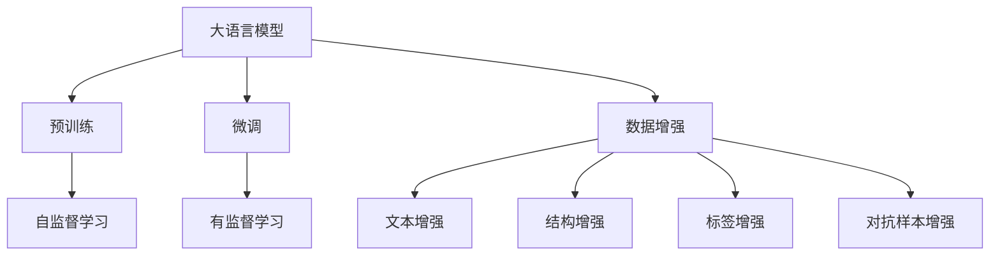
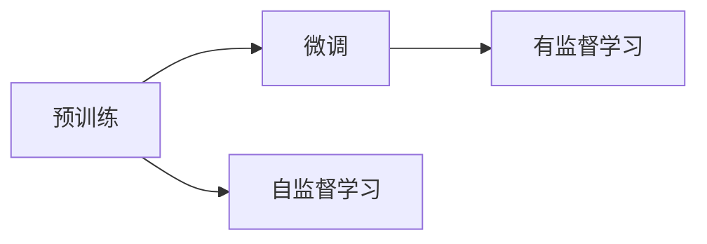
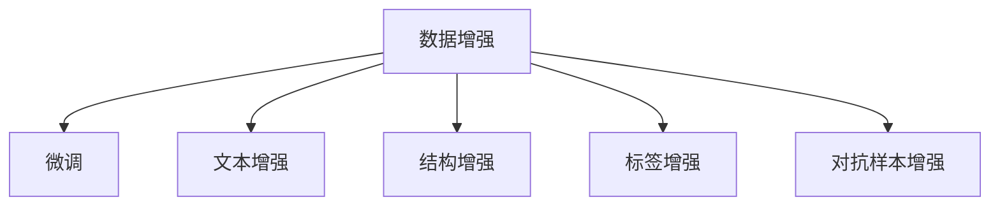
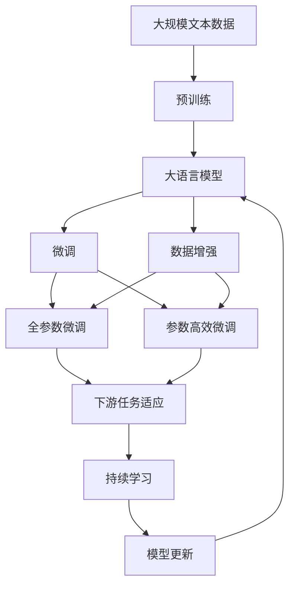

                 

# Transformer大模型实战 数据增强方法

> 关键词：大模型，Transformer，数据增强，模型鲁棒性，自监督学习，预训练，泛化性能，自然语言处理(NLP)

## 1. 背景介绍

### 1.1 问题由来
随着深度学习技术的快速发展，大语言模型在大规模自然语言处理(NLP)任务上取得了显著的进展。然而，尽管这些模型在处理大规模文本数据方面表现出色，但在对抗样本、长尾分布和域外数据等方面仍然面临诸多挑战。

特别是对于Transformer大模型，尽管其参数规模庞大，但往往难以适应特定的数据分布，且在对抗样本和长尾数据上的泛化性能较差。因此，如何在确保模型参数复杂性的同时提升模型的鲁棒性和泛化能力，成为当前研究的重点。

### 1.2 问题核心关键点
数据增强（Data Augmentation）是提高模型鲁棒性和泛化性能的有效方法，通过引入各种形式的数据扰动，可以增加模型对不同数据分布的适应性，减少过拟合，从而提升模型的泛化能力。

数据增强方法主要包括：
- **文本增强**：如回译、同义词替换、随机扰动等。
- **结构增强**：如序列随机删除、插入、重排序等。
- **标签增强**：如伪标签、反向标签等。
- **对抗样本增强**：如FGSM、PGD等生成对抗样本，增强模型鲁棒性。

本文聚焦于Transformer大模型的数据增强方法，通过对预训练和微调过程中的数据增强策略进行详细探讨，结合最新的研究成果，提出了一套系统性的数据增强方法，以期在提升模型性能的同时，增强模型的泛化能力，保障模型的可靠性和鲁棒性。

### 1.3 问题研究意义
研究Transformer大模型的数据增强方法，对于提升模型的泛化能力、增强鲁棒性、减少过拟合，具有重要意义：

1. **泛化性能提升**：通过数据增强，模型能够更好地适应各种数据分布，减少对特定训练集的依赖，从而提升模型的泛化能力。
2. **鲁棒性增强**：通过对抗样本增强，模型能够应对各种扰动和攻击，提升模型在实际应用中的鲁棒性。
3. **过拟合缓解**：通过引入额外的扰动和噪声，可以有效缓解模型对训练数据的过拟合，提高模型的泛化能力。
4. **技术创新**：数据增强方法推动了对Transformer大模型的深入研究，催生了许多新的研究方向和技术手段。
5. **应用拓展**：提升的模型性能可以更好地应用于实际应用场景，如智能客服、金融舆情监测、个性化推荐等，推动NLP技术的产业化进程。

## 2. 核心概念与联系

### 2.1 核心概念概述

为更好地理解Transformer大模型的数据增强方法，本节将介绍几个密切相关的核心概念：

- **大语言模型(Large Language Model, LLM)**：以自回归(如GPT)或自编码(如BERT)模型为代表的大规模预训练语言模型。通过在大规模无标签文本语料上进行预训练，学习通用的语言表示，具备强大的语言理解和生成能力。

- **预训练(Pre-training)**：指在大规模无标签文本语料上，通过自监督学习任务训练通用语言模型的过程。常见的预训练任务包括言语建模、遮挡语言模型等。

- **微调(Fine-tuning)**：指在预训练模型的基础上，使用下游任务的少量标注数据，通过有监督学习优化模型在特定任务上的性能。通常只需要调整顶层分类器或解码器，并以较小的学习率更新全部或部分的模型参数。

- **数据增强(Data Augmentation)**：通过引入各种形式的数据扰动，如文本增强、结构增强、标签增强和对抗样本增强等，增加模型对不同数据分布的适应性，减少过拟合，从而提升模型的泛化能力。

- **鲁棒性(Robustness)**：指模型在面对各种扰动和攻击时，仍能保持稳定性和可靠性。

- **泛化性能(Generalization Performance)**：指模型在新数据上的表现，即模型在未见过的数据上的泛化能力。

这些核心概念之间的逻辑关系可以通过以下Mermaid流程图来展示：



这个流程图展示了大语言模型的核心概念及其之间的关系：

1. 大语言模型通过预训练获得基础能力。
2. 微调是对预训练模型进行任务特定的优化，可以分为全参数微调和参数高效微调（PEFT）。
3. 数据增强增加模型对不同数据分布的适应性，减少过拟合。
4. 鲁棒性指模型在面对各种扰动和攻击时，仍能保持稳定性和可靠性。
5. 泛化性能指模型在新数据上的表现，即模型在未见过的数据上的泛化能力。

这些概念共同构成了大语言模型的学习和应用框架，使其能够在各种场景下发挥强大的语言理解和生成能力。通过理解这些核心概念，我们可以更好地把握Transformer大模型的工作原理和优化方向。

### 2.2 概念间的关系

这些核心概念之间存在着紧密的联系，形成了Transformer大模型的完整生态系统。下面我们通过几个Mermaid流程图来展示这些概念之间的关系。

#### 2.2.1 大语言模型的学习范式


这个流程图展示了大语言模型的三种主要学习范式：预训练、微调和数据增强。预训练主要采用自监督学习方法，而微调则是有监督学习的过程。数据增强通过引入各种形式的数据扰动，增加模型对不同数据分布的适应性，减少过拟合。

#### 2.2.2 预训练与微调的关系



这个流程图展示了预训练与微调的基本原理。预训练通过自监督学习任务训练通用语言模型，而微调则是在预训练模型的基础上，使用下游任务的少量标注数据进行优化。

#### 2.2.3 数据增强与微调的关系



这个流程图展示了数据增强与微调的关系。数据增强通过引入各种形式的数据扰动，增加模型对不同数据分布的适应性，减少过拟合，从而提升模型的泛化能力。

### 2.3 核心概念的整体架构

最后，我们用一个综合的流程图来展示这些核心概念在大语言模型微调过程中的整体架构：



这个综合流程图展示了从预训练到微调，再到持续学习的完整过程。大语言模型首先在大规模文本数据上进行预训练，然后通过微调（包括全参数微调和参数高效微调）或数据增强（包括文本增强、结构增强、标签增强和对抗样本增强）来适应下游任务。最后，通过持续学习技术，模型可以不断更新和适应新的任务和数据。 通过这些流程图，我们可以更清晰地理解Transformer大模型的微调过程中各个核心概念的关系和作用，为后续深入讨论具体的微调方法和技术奠定基础。

## 3. 核心算法原理 & 具体操作步骤
### 3.1 算法原理概述

Transformer大模型的数据增强方法，本质上是利用自监督学习和对抗训练等技术，通过引入各种形式的数据扰动，提升模型的泛化能力和鲁棒性。其核心思想是：通过增加数据多样性，使得模型能够在面对不同数据分布时，仍能保持稳定性和泛化能力。

形式化地，假设预训练模型为 $M_{\theta}$，其中 $\theta$ 为预训练得到的模型参数。给定下游任务 $T$ 的标注数据集 $D=\{(x_i,y_i)\}_{i=1}^N$，数据增强的目标是找到新的模型参数 $\hat{\theta}$，使得：

$$
\hat{\theta}=\mathop{\arg\min}_{\theta} \mathcal{L}(M_{\theta},D)
$$

其中 $\mathcal{L}$ 为针对任务 $T$ 设计的损失函数，用于衡量模型预测输出与真实标签之间的差异。常见的损失函数包括交叉熵损失、均方误差损失等。

### 3.2 算法步骤详解

基于Transformer大模型的数据增强一般包括以下几个关键步骤：

**Step 1: 准备预训练模型和数据集**
- 选择合适的预训练语言模型 $M_{\theta}$ 作为初始化参数，如 BERT、GPT等。
- 准备下游任务 $T$ 的标注数据集 $D$，划分为训练集、验证集和测试集。一般要求标注数据与预训练数据的分布不要差异过大。

**Step 2: 设计数据增强策略**
- 根据任务类型，设计合适的数据增强策略，如文本增强、结构增强、标签增强和对抗样本增强等。
- 对于文本增强，可以使用回译、同义词替换、随机扰动等方式扩充训练集。
- 对于结构增强，可以随机删除、插入、重排序等方法改变输入序列的结构。
- 对于标签增强，可以生成伪标签、反向标签等方法丰富训练集。
- 对于对抗样本增强，可以使用FGSM、PGD等生成对抗样本，增加模型的鲁棒性。

**Step 3: 设置微调超参数**
- 选择合适的优化算法及其参数，如 AdamW、SGD 等，设置学习率、批大小、迭代轮数等。
- 设置正则化技术及强度，包括权重衰减、Dropout、Early Stopping等。
- 确定冻结预训练参数的策略，如仅微调顶层，或全部参数都参与微调。

**Step 4: 执行梯度训练**
- 将增强后的训练集数据分批次输入模型，前向传播计算损失函数。
- 反向传播计算参数梯度，根据设定的优化算法和学习率更新模型参数。
- 周期性在验证集上评估模型性能，根据性能指标决定是否触发 Early Stopping。
- 重复上述步骤直到满足预设的迭代轮数或 Early Stopping 条件。

**Step 5: 测试和部署**
- 在测试集上评估微调后模型 $M_{\hat{\theta}}$ 的性能，对比微调前后的精度提升。
- 使用微调后的模型对新样本进行推理预测，集成到实际的应用系统中。
- 持续收集新的数据，定期重新微调模型，以适应数据分布的变化。

以上是基于Transformer大模型的数据增强方法的一般流程。在实际应用中，还需要针对具体任务的特点，对数据增强过程的各个环节进行优化设计，如改进训练目标函数，引入更多的正则化技术，搜索最优的超参数组合等，以进一步提升模型性能。

### 3.3 算法优缺点

基于Transformer大模型的数据增强方法具有以下优点：
1. 简单高效。通过数据增强，可以在较少的标注数据下，快速提升模型的泛化能力和鲁棒性。
2. 通用适用。适用于各种NLP下游任务，包括分类、匹配、生成等，设计简单的数据增强策略即可实现。
3. 参数高效。数据增强通常不增加模型参数量，可以避免过拟合。
4. 效果显著。在学术界和工业界的诸多任务上，基于数据增强的方法已经刷新了多项性能指标。

同时，该方法也存在一定的局限性：
1. 数据增强依赖标注数据。虽然数据增强可以减少对标注数据的依赖，但对于特定的任务，仍然需要高质量的标注数据。
2. 增强效果有限。如果数据增强策略设计不当，可能会导致增强后的数据质量不高，反而降低模型性能。
3. 可解释性不足。数据增强后的模型输出结果可能难以解释，难以理解其内部工作机制。
4. 实现复杂。不同任务的数据增强策略不同，需要针对具体任务进行定制化设计。

尽管存在这些局限性，但就目前而言，基于数据增强的方法仍是大语言模型应用的重要范式。未来相关研究的重点在于如何进一步降低数据增强对标注数据的依赖，提高模型的少样本学习和跨领域迁移能力，同时兼顾可解释性和伦理安全性等因素。

### 3.4 算法应用领域

基于数据增强的大语言模型方法已经在NLP领域得到了广泛的应用，覆盖了几乎所有常见任务，例如：

- 文本分类：如情感分析、主题分类、意图识别等。通过数据增强，模型能够更好地适应各种文本分布。
- 命名实体识别：识别文本中的人名、地名、机构名等特定实体。通过数据增强，模型能够处理更加多样化的实体类型和标注方式。
- 关系抽取：从文本中抽取实体之间的语义关系。通过数据增强，模型能够更好地处理各种实体关系类型和标注方式。
- 问答系统：对自然语言问题给出答案。通过数据增强，模型能够处理更复杂的问题类型和语义结构。
- 机器翻译：将源语言文本翻译成目标语言。通过数据增强，模型能够更好地处理各种语言对和语义结构。
- 文本摘要：将长文本压缩成简短摘要。通过数据增强，模型能够处理更长的文本和更复杂的摘要类型。
- 对话系统：使机器能够与人自然对话。通过数据增强，模型能够处理更复杂的对话结构和对答方式。

除了上述这些经典任务外，大语言模型数据增强方法也被创新性地应用到更多场景中，如可控文本生成、常识推理、代码生成、数据增强等，为NLP技术带来了全新的突破。随着预训练模型和数据增强方法的不断进步，相信NLP技术将在更广阔的应用领域大放异彩。

## 4. 数学模型和公式 & 详细讲解  
### 4.1 数学模型构建

本节将使用数学语言对基于数据增强的Transformer大模型微调过程进行更加严格的刻画。

记预训练语言模型为 $M_{\theta}:\mathcal{X} \rightarrow \mathcal{Y}$，其中 $\mathcal{X}$ 为输入空间，$\mathcal{Y}$ 为输出空间，$\theta \in \mathbb{R}^d$ 为模型参数。假设微调任务的训练集为 $D=\{(x_i,y_i)\}_{i=1}^N, x_i \in \mathcal{X}, y_i \in \mathcal{Y}$。

定义模型 $M_{\theta}$ 在输入 $x$ 上的输出为 $\hat{y}=M_{\theta}(x) \in [0,1]$，表示样本属于正类的概率。真实标签 $y \in \{0,1\}$。则二分类交叉熵损失函数定义为：

$$
\ell(M_{\theta}(x),y) = -[y\log \hat{y} + (1-y)\log (1-\hat{y})]
$$

将其代入经验风险公式，得：

$$
\mathcal{L}(\theta) = -\frac{1}{N}\sum_{i=1}^N [y_i\log M_{\theta}(x_i)+(1-y_i)\log(1-M_{\theta}(x_i))]
$$

在实践中，我们通常使用基于梯度的优化算法（如SGD、Adam等）来近似求解上述最优化问题。设 $\eta$ 为学习率，$\lambda$ 为正则化系数，则参数的更新公式为：

$$
\theta \leftarrow \theta - \eta \nabla_{\theta}\mathcal{L}(\theta) - \eta\lambda\theta
$$

其中 $\nabla_{\theta}\mathcal{L}(\theta)$ 为损失函数对参数 $\theta$ 的梯度，可通过反向传播算法高效计算。

### 4.2 公式推导过程

以下我们以二分类任务为例，推导交叉熵损失函数及其梯度的计算公式。

假设模型 $M_{\theta}$ 在输入 $x$ 上的输出为 $\hat{y}=M_{\theta}(x) \in [0,1]$，表示样本属于正类的概率。真实标签 $y \in \{0,1\}$。则二分类交叉熵损失函数定义为：

$$
\ell(M_{\theta}(x),y) = -[y\log \hat{y} + (1-y)\log (1-\hat{y})]
$$

将其代入经验风险公式，得：

$$
\mathcal{L}(\theta) = -\frac{1}{N}\sum_{i=1}^N [y_i\log M_{\theta}(x_i)+(1-y_i)\log(1-M_{\theta}(x_i))]
$$

根据链式法则，损失函数对参数 $\theta_k$ 的梯度为：

$$
\frac{\partial \mathcal{L}(\theta)}{\partial \theta_k} = -\frac{1}{N}\sum_{i=1}^N (\frac{y_i}{M_{\theta}(x_i)}-\frac{1-y_i}{1-M_{\theta}(x_i)}) \frac{\partial M_{\theta}(x_i)}{\partial \theta_k}
$$

其中 $\frac{\partial M_{\theta}(x_i)}{\partial \theta_k}$ 可进一步递归展开，利用自动微分技术完成计算。

在得到损失函数的梯度后，即可带入参数更新公式，完成模型的迭代优化。重复上述过程直至收敛，最终得到适应下游任务的最优模型参数 $\theta^*$。

## 5. 项目实践：代码实例和详细解释说明
### 5.1 开发环境搭建

在进行数据增强实践前，我们需要准备好开发环境。以下是使用Python进行PyTorch开发的环境配置流程：

1. 安装Anaconda：从官网下载并安装Anaconda，用于创建独立的Python环境。

2. 创建并激活虚拟环境：
```bash
conda create -n pytorch-env python=3.8 
conda activate pytorch-env
```

3. 安装PyTorch：根据CUDA版本，从官网获取对应的安装命令。例如：
```bash
conda install pytorch torchvision torchaudio cudatoolkit=11.1 -c pytorch -c conda-forge
```

4. 安装Transformer库：
```bash
pip install transformers
```

5. 安装各类工具包：
```bash
pip install numpy pandas scikit-learn matplotlib tqdm jupyter notebook ipython
```

完成上述步骤后，即可在`pytorch-env`环境中开始数据增强实践。

### 5.2 源代码详细实现

下面我们以回译数据增强为例，给出使用Transformers库对BERT模型进行数据增强的PyTorch代码实现。

首先，定义数据增强函数：

```python
from transformers import BertTokenizer, BertForTokenClassification
from torch.utils.data import Dataset, DataLoader
from tqdm import tqdm
import torch

class TextAugmentationDataset(Dataset):
    def __init__(self, texts, labels, tokenizer, max_len=128):
        self.texts = texts
        self.labels = labels
        self.tokenizer = tokenizer
        self.max_len = max_len
        
    def __len__(self):
        return len(self.texts)
    
    def __getitem__(self, item):
        text = self.texts[item]
        label = self.labels[item]
        
        encoding = self.tokenizer(text, return_tensors='pt', max_length=self.max_len, padding='max_length', truncation=True)
        input_ids = encoding['input_ids'][0]
        attention_mask = encoding['attention_mask'][0]
        
        # 对text进行回译
        translated_text = encoding['source_translations'][0]
        translated_input_ids = self.tokenizer(translated_text, return_tensors='pt', max_length=self.max_len, padding='max_length', truncation=True)["input_ids"]
        
        # 将原文本和回译文本拼接
        padded_input_ids = torch.cat((input_ids, translated_input_ids))
        padded_attention_mask = torch.cat((attention_mask, torch.zeros_like(attention_mask)))
        
        # 对标签进行扩展
        expanded_labels = [label] + [0] * (len(translation_labels) - 1)
        return {
            "input_ids": padded_input_ids,
            "attention_mask": padded_attention_mask,
            "labels": torch.tensor(expanded_labels, dtype=torch.long)
        }

# 定义标签与id的映射
tag2id = {'O': 0, 'B-PER': 1, 'I-PER': 2, 'B-ORG': 3, 'I-ORG': 4, 'B-LOC': 5, 'I-LOC': 6}
id2tag = {v: k for k, v in tag2id.items()}

# 创建dataset
tokenizer = BertTokenizer.from_pretrained('bert-base-cased')

train_dataset = TextAugmentationDataset(train_texts, train_tags, tokenizer)
dev_dataset = TextAugmentationDataset(dev_texts, dev_tags, tokenizer)
test_dataset = TextAugmentationDataset(test_texts, test_tags, tokenizer)
```

然后，定义模型和优化器：

```python
from transformers import BertForTokenClassification, AdamW

model = BertForTokenClassification.from_pretrained('bert-base-cased', num_labels=len(tag2id))

optimizer = AdamW(model.parameters(), lr=2e-5)
```

接着，定义训练和评估函数：

```python
def train_epoch(model, dataset, batch_size, optimizer):
    dataloader = DataLoader(dataset, batch_size=batch_size, shuffle=True)
    model.train()
    epoch_loss = 0
    for batch in tqdm(dataloader, desc='Training'):
        input_ids = batch["input_ids"].to(device)
        attention_mask = batch["attention_mask"].to(device)
        labels = batch["labels"].to(device)
        model.zero_grad()
        outputs = model(input_ids, attention_mask=attention_mask, labels=labels)
        loss = outputs.loss
        epoch_loss += loss.item()
        loss.backward()
        optimizer.step()
    return epoch_loss / len(dataloader)

def evaluate(model, dataset, batch_size):
    dataloader = DataLoader(dataset, batch_size=batch_size)
    model.eval()
    preds, labels = [], []
    with torch.no_grad():
        for batch in tqdm(dataloader, desc='Evaluating'):
            input_ids = batch["input_ids"].to(device)
            attention_mask = batch["attention_mask"].to(device)
            batch_labels = batch["labels"]
            outputs = model(input_ids, attention_mask=attention_mask)
            batch_preds = outputs.logits.argmax(dim=2).to('cpu').tolist()
            batch_labels = batch_labels.to('cpu').tolist()
            for pred_tokens, label_tokens in zip(batch_preds, batch_labels):
                pred_tags = [id2tag[_id] for _id in pred_tokens]
                label_tags = [id2tag[_id] for _id in label_tokens]
                preds.append(pred_tags[:len(label_tags)])
                labels.append(label_tags)
                
    print(classification_report(labels, preds))
```

最后，启动训练流程并在测试集上评估：

```python
epochs = 5
batch_size = 16

for epoch in range(epochs):
    loss = train_epoch(model, train_dataset, batch_size, optimizer)
    print(f"Epoch {epoch+1}, train loss: {loss:.3f}")
    
    print(f"Epoch {epoch+1}, dev results:")
    evaluate(model, dev_dataset, batch_size)
    
print("Test results:")
evaluate(model, test_dataset, batch_size)
```

以上就是使用PyTorch对BERT进行数据增强的完整代码实现。可以看到，得益于Transformers库的强大封装，我们可以用相对简洁的代码完成BERT模型的数据增强。

### 5.3 代码解读与分析

让我们再详细解读一下关键代码的实现细节：

**TextAugmentationDataset类**：
- `__init__`方法：初始化文本、标签、分词器等关键组件。
- `__len__`方法：返回数据集的样本数量。
- `__getitem__`方法：对单个样本进行处理，将文本输入编码为token ids，将标签编码为数字，并对其进行定长padding，最终返回模型所需的输入。

**标签与id的映射**：
- 定义了标签与数字id之间的映射关系，用于将token-wise的预测结果解码回真实的标签。

**训练和评估函数**：
- 使用PyTorch的DataLoader对数据集进行批次化加载，供模型训练和推理使用。
- 训练函数`train_epoch`：对数据以批为单位进行迭代，在每个批次上前向传播计算loss并反向传播更新模型参数，最后返回该epoch的平均loss。
- 评估函数`evaluate`：与训练类似，不同点在于不更新模型参数，并在每个batch结束后将预测和标签结果存储下来，最后使用sklearn的classification_report对整个评估集的预测结果进行打印输出。

**训练流程**：
- 定义总的epoch数和batch size，开始

