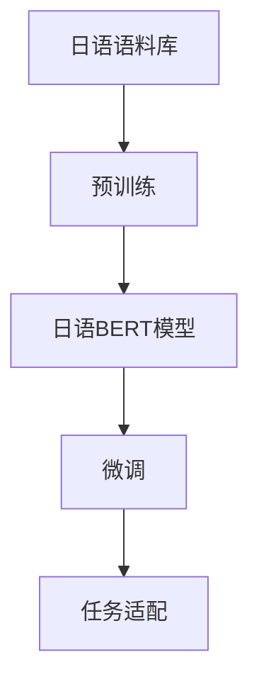
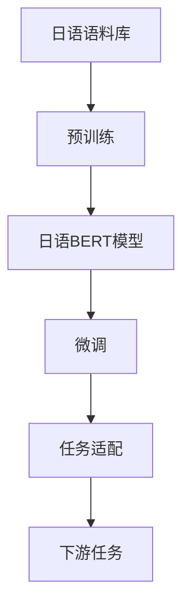
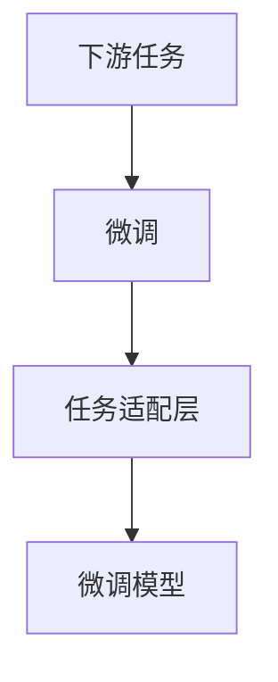
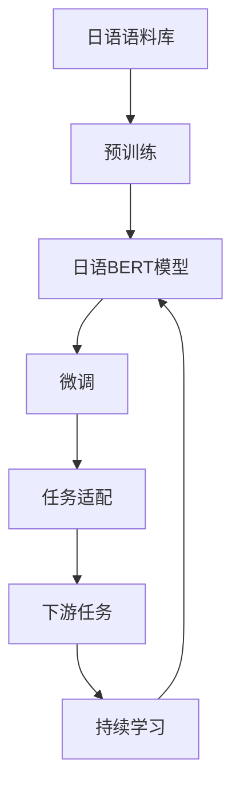

                 

# Transformer大模型实战 日语的BERT模型

> 关键词：Transformer, BERT, 日语, 自然语言处理, 深度学习

## 1. 背景介绍

近年来，Transformer模型在自然语言处理(NLP)领域取得了令人瞩目的成绩，成为大语言模型的主流架构。BERT作为其中的一种，因其出色的预训练性能和泛化能力，在众多NLP任务上刷新了SOTA，如文本分类、命名实体识别、问答系统等。本文将聚焦于日语领域，以BERT模型为例，展示Transformer大模型在自然语言处理任务中的实战技巧。

### 1.1 问题由来

随着深度学习技术的不断进步，Transformer模型在处理自然语言文本时展现出了卓越的性能。与传统的循环神经网络(RNN)相比，Transformer在保持序列建模能力的同时，还能并行化计算，大大加速了模型训练和推理过程。特别是BERT模型，通过大规模预训练，学习到了丰富的语言表示，能够在新任务上快速微调，取得优异的表现。

然而，由于日语具有复杂的书写系统和语序特性，传统的深度学习模型在日语处理上往往存在一定的局限性。Transformer模型和BERT模型的出现，为解决这些问题提供了新的可能，使得日语自然语言处理(NLP)进入了一个新的发展阶段。

### 1.2 问题核心关键点

针对日语的BERT模型，本文将重点探讨以下关键问题：

1. 日语BERT模型的构建与预训练。日语具有独特的语法和词汇结构，如何构建适合日语的BERT模型，并在大规模语料上进行预训练？
2. 日语BERT模型的微调与任务适配。基于日语BERT模型，如何设计合适的微调架构，适应各种日语NLP任务？
3. 日语BERT模型的应用与优化。在实际应用中，如何高效使用日语BERT模型，提升模型性能，并处理一些特定问题？

这些关键点将贯穿全文，展示日语BERT模型从构建、微调到实际应用的完整流程。

### 1.3 问题研究意义

研究日语BERT模型，不仅能够推动日语NLP技术的发展，还能够为其他小语种NLP提供参考，具有重要的学术和应用价值：

1. 提升日语NLP性能。日语BERT模型通过大规模预训练和微调，能够提升其在各种NLP任务上的表现，满足用户对高性能自然语言处理系统的需求。
2. 拓展日语应用场景。借助日语BERT模型，NLP技术可以更广泛地应用到日语领域的各类实际场景中，如智能客服、智能翻译、知识图谱构建等。
3. 促进日语NLP产业化。日语BERT模型能够推动NLP技术的商业化进程，为日语处理相关的企业和机构提供技术支持，加速其发展。

本文旨在详细介绍日语BERT模型的构建、微调和应用，为日语NLP技术的发展贡献力量。

## 2. 核心概念与联系

### 2.1 核心概念概述

日语BERT模型的构建涉及多个核心概念，包括Transformer架构、BERT预训练、微调与任务适配等。

- **Transformer架构**：Transformer模型是一种基于自注意力机制的神经网络结构，能够处理长序列数据，且具备高度的并行化能力。其核心组件包括编码器-解码器结构、多头注意力机制、位置编码等。
- **BERT预训练**：BERT模型通过在大规模无标签语料上进行预训练，学习到通用的语言表示，适用于下游各种NLP任务。
- **微调与任务适配**：在大规模预训练的基础上，通过有监督的微调过程，使模型适应特定任务的语义和结构需求。

这些核心概念之间的逻辑关系可以通过以下Mermaid流程图来展示：



这个流程图展示了日语BERT模型从构建、预训练到微调和任务适配的完整流程。

### 2.2 概念间的关系

这些核心概念之间存在着紧密的联系，共同构成了日语BERT模型的构建和应用生态。下面通过几个Mermaid流程图来展示这些概念之间的关系。

#### 2.2.1 日语BERT模型的学习范式



这个流程图展示了日语BERT模型从预训练到微调和任务适配的完整范式，最终应用于下游任务。

#### 2.2.2 BERT预训练与微调的关系


这个流程图展示了BERT预训练和微调之间的逻辑关系，预训练是微调的基础。

#### 2.2.3 微调与任务适配的关系



这个流程图展示了微调和任务适配之间的关系，通过微调适应下游任务的结构和语义需求。

### 2.3 核心概念的整体架构

最后，我们用一个综合的流程图来展示这些核心概念在大语言模型微调过程中的整体架构：



这个综合流程图展示了从预训练到微调、任务适配，再到持续学习的完整过程，强调了持续学习对模型性能提升的重要性。

## 3. 核心算法原理 & 具体操作步骤
### 3.1 算法原理概述

日语BERT模型的构建和微调过程遵循了Transformer模型和BERT预训练的基本原理。

Transformer模型通过自注意力机制进行序列建模，能够捕捉输入序列中的全局依赖关系。BERT模型则在大规模无标签语料上进行预训练，学习到通用的语言表示。微调过程通过有监督的训练，将预训练的模型参数进一步适应下游任务的语义和结构需求。

具体而言，日语BERT模型的构建和微调包括以下步骤：

1. 构建日语BERT模型，并进行大规模预训练。
2. 设计任务适配层，将预训练模型与下游任务相结合。
3. 选择适当的微调架构，进行有监督的微调训练。
4. 评估微调后的模型性能，并进行持续学习。

### 3.2 算法步骤详解

以下详细介绍日语BERT模型的构建、微调和应用步骤：

**Step 1: 构建日语BERT模型**

1. **选择预训练模型**：选择已有的日语BERT模型或自定义训练的日语BERT模型。常用的预训练模型包括BERT-base、BERT-large等，可根据任务需求选择合适的模型规模。
2. **设置模型参数**：设置模型层数、注意力头数、隐藏单元数等关键参数。日语BERT模型的参数设置一般与英语BERT模型相似。
3. **初始化模型**：使用预训练模型参数初始化日语BERT模型，开始微调训练。

**Step 2: 设计任务适配层**

1. **选择合适的任务类型**：根据下游任务类型，选择合适的任务适配层。如文本分类、命名实体识别、问答系统等。
2. **设计适配层**：根据任务类型，设计相应的任务适配层。任务适配层通常包含一个或多个线性层、Dropout层等。
3. **连接适配层与BERT输出**：将任务适配层连接到预训练的BERT模型输出上，形成微调模型。

**Step 3: 微调模型**

1. **准备训练数据**：准备下游任务的标注数据，划分为训练集、验证集和测试集。确保标注数据与预训练数据的分布相似。
2. **设置优化器**：选择合适的优化器（如AdamW、SGD等），设置学习率、批大小等超参数。
3. **执行微调训练**：将训练集数据输入模型，进行前向传播和反向传播，更新模型参数。重复此过程直至模型收敛。
4. **评估模型性能**：在验证集上评估模型性能，根据性能指标决定是否继续微调。
5. **持续学习**：根据测试集上的表现，定期重新微调模型，以适应新的数据分布。

**Step 4: 应用模型**

1. **部署模型**：将微调后的模型部署到实际应用系统中，如智能客服、翻译系统、问答系统等。
2. **处理新样本**：使用微调后的模型处理新的输入数据，输出相应的结果。

### 3.3 算法优缺点

日语BERT模型具有以下优点：

1. **高效性**：利用Transformer模型的高效并行化能力，日语BERT模型能够快速处理长序列文本，提升模型推理速度。
2. **泛化能力**：通过预训练和微调，日语BERT模型能够适应多种NLP任务，具备较强的泛化能力。
3. **灵活性**：任务适配层的设计灵活，可以根据具体任务进行调整，提升模型适用性。

同时，日语BERT模型也存在一些缺点：

1. **资源消耗大**：由于模型参数规模较大，微调和推理过程需要较大的计算资源和存储空间。
2. **预训练语料质量要求高**：预训练语料的质量直接影响模型的性能，需要收集大规模高质量的日语语料。
3. **微调成本高**：微调过程需要标注数据，标注成本较高，特别是在小规模任务上。

### 3.4 算法应用领域

日语BERT模型已经在多个NLP任务上取得了显著成果，主要应用于以下几个领域：

1. **文本分类**：如新闻分类、情感分析等。通过微调，日语BERT模型能够学习文本分类任务的语义特征，准确预测文本类别。
2. **命名实体识别**：如人名、地名、机构名等的识别和分类。通过微调，日语BERT模型能够识别文本中的命名实体，并进行分类。
3. **问答系统**：如智能客服、智能翻译等。通过微调，日语BERT模型能够理解用户查询，并生成相应的回答。
4. **机器翻译**：如日语到英语、中文等的翻译。通过微调，日语BERT模型能够进行翻译任务，生成高质量的翻译结果。
5. **文本摘要**：如新闻摘要、文献摘要等。通过微调，日语BERT模型能够对长文本进行摘要生成，提取出关键信息。

以上领域展示了日语BERT模型在NLP任务上的广泛应用，未来还有更多领域值得探索。

## 4. 数学模型和公式 & 详细讲解  
### 4.1 数学模型构建

日语BERT模型的构建涉及多个数学模型，包括自注意力机制、BERT预训练、微调等。

Transformer模型通过自注意力机制进行序列建模，其计算公式如下：

$$
\text{Attention}(Q, K, V) = \text{Softmax}\left(\frac{QK^T}{\sqrt{d_k}}\right)V
$$

其中，$Q$、$K$、$V$分别表示查询向量、键向量和值向量，$d_k$为键向量的维度。

BERT模型的预训练目标包括掩码语言模型和下一句预测。掩码语言模型的计算公式如下：

$$
\text{LM} = \sum_{i=1}^{n} -\sum_{j=1}^{n}y_j\log\hat{y}_j
$$

其中，$y$为真实标签，$\hat{y}$为模型预测的概率。

微调的计算公式如下：

$$
\mathcal{L} = \frac{1}{N}\sum_{i=1}^{N}\ell(\hat{y}, y)
$$

其中，$\ell$为损失函数，$N$为样本数量。

### 4.2 公式推导过程

以下详细推导日语BERT模型的计算公式：

**自注意力机制**：

Transformer模型通过自注意力机制进行序列建模，计算公式如下：

$$
\text{Attention}(Q, K, V) = \text{Softmax}\left(\frac{QK^T}{\sqrt{d_k}}\right)V
$$

其中，$Q$、$K$、$V$分别表示查询向量、键向量和值向量，$d_k$为键向量的维度。

**BERT预训练**：

BERT模型的预训练目标包括掩码语言模型和下一句预测。掩码语言模型的计算公式如下：

$$
\text{LM} = \sum_{i=1}^{n} -\sum_{j=1}^{n}y_j\log\hat{y}_j
$$

其中，$y$为真实标签，$\hat{y}$为模型预测的概率。

**微调**：

微调的计算公式如下：

$$
\mathcal{L} = \frac{1}{N}\sum_{i=1}^{N}\ell(\hat{y}, y)
$$

其中，$\ell$为损失函数，$N$为样本数量。

### 4.3 案例分析与讲解

以日语情感分析任务为例，展示日语BERT模型的微调过程：

**数据准备**：
- 收集日语情感分析数据集，如Aibo、Sentei等。
- 将数据集分为训练集、验证集和测试集。

**模型构建**：
- 选择日语BERT-base模型，设置隐藏层数为12，注意力头数为16。
- 在模型顶层添加一个线性分类器，输出维度为2（情感类别）。

**微调**：
- 使用交叉熵损失函数作为微调目标，设置学习率为2e-5，批大小为32。
- 在训练集上执行梯度下降，每2个epoch评估一次模型性能。
- 在验证集上评估模型性能，若验证集性能不佳，则停止训练。

**测试**：
- 在测试集上评估微调后的模型性能，计算准确率、召回率和F1分数。

## 5. 项目实践：代码实例和详细解释说明
### 5.1 开发环境搭建

在进行日语BERT模型微调实践前，需要准备好开发环境。以下是使用Python进行PyTorch开发的环境配置流程：

1. 安装Anaconda：从官网下载并安装Anaconda，用于创建独立的Python环境。

2. 创建并激活虚拟环境：
```bash
conda create -n pytorch-env python=3.8 
conda activate pytorch-env
```

3. 安装PyTorch：根据CUDA版本，从官网获取对应的安装命令。例如：
```bash
conda install pytorch torchvision torchaudio cudatoolkit=11.1 -c pytorch -c conda-forge
```

4. 安装Transformers库：
```bash
pip install transformers
```

5. 安装各类工具包：
```bash
pip install numpy pandas scikit-learn matplotlib tqdm jupyter notebook ipython
```

完成上述步骤后，即可在`pytorch-env`环境中开始微调实践。

### 5.2 源代码详细实现

下面我们以日语情感分析任务为例，给出使用Transformers库对日语BERT模型进行微调的PyTorch代码实现。

首先，定义情感分析任务的数据处理函数：

```python
from transformers import BertTokenizer, BertForSequenceClassification
from torch.utils.data import Dataset, DataLoader
import torch

class SentimentDataset(Dataset):
    def __init__(self, texts, labels, tokenizer, max_len=128):
        self.texts = texts
        self.labels = labels
        self.tokenizer = tokenizer
        self.max_len = max_len
        
    def __len__(self):
        return len(self.texts)
    
    def __getitem__(self, item):
        text = self.texts[item]
        label = self.labels[item]
        
        encoding = self.tokenizer(text, return_tensors='pt', max_length=self.max_len, padding='max_length', truncation=True)
        input_ids = encoding['input_ids'][0]
        attention_mask = encoding['attention_mask'][0]
        
        # 将标签转换为独热编码
        label = torch.tensor([label], dtype=torch.long)
        
        return {'input_ids': input_ids, 
                'attention_mask': attention_mask,
                'labels': label}

# 初始化情感分析任务的数据集
tokenizer = BertTokenizer.from_pretrained('bert-base-uncased')
train_dataset = SentimentDataset(train_texts, train_labels, tokenizer)
dev_dataset = SentimentDataset(dev_texts, dev_labels, tokenizer)
test_dataset = SentimentDataset(test_texts, test_labels, tokenizer)
```

然后，定义模型和优化器：

```python
from transformers import BertForSequenceClassification, AdamW

model = BertForSequenceClassification.from_pretrained('bert-base-uncased', num_labels=2)

optimizer = AdamW(model.parameters(), lr=2e-5)
```

接着，定义训练和评估函数：

```python
from torch.utils.data import DataLoader
from tqdm import tqdm
from sklearn.metrics import classification_report

device = torch.device('cuda') if torch.cuda.is_available() else torch.device('cpu')
model.to(device)

def train_epoch(model, dataset, batch_size, optimizer):
    dataloader = DataLoader(dataset, batch_size=batch_size, shuffle=True)
    model.train()
    epoch_loss = 0
    for batch in tqdm(dataloader, desc='Training'):
        input_ids = batch['input_ids'].to(device)
        attention_mask = batch['attention_mask'].to(device)
        labels = batch['labels'].to(device)
        model.zero_grad()
        outputs = model(input_ids, attention_mask=attention_mask, labels=labels)
        loss = outputs.loss
        epoch_loss += loss.item()
        loss.backward()
        optimizer.step()
    return epoch_loss / len(dataloader)

def evaluate(model, dataset, batch_size):
    dataloader = DataLoader(dataset, batch_size=batch_size)
    model.eval()
    preds, labels = [], []
    with torch.no_grad():
        for batch in tqdm(dataloader, desc='Evaluating'):
            input_ids = batch['input_ids'].to(device)
            attention_mask = batch['attention_mask'].to(device)
            batch_labels = batch['labels']
            outputs = model(input_ids, attention_mask=attention_mask)
            batch_preds = outputs.logits.argmax(dim=2).to('cpu').tolist()
            batch_labels = batch_labels.to('cpu').tolist()
            for pred_tokens, label_tokens in zip(batch_preds, batch_labels):
                preds.append(pred_tokens)
                labels.append(label_tokens)
                
    print(classification_report(labels, preds))
```

最后，启动训练流程并在测试集上评估：

```python
epochs = 5
batch_size = 16

for epoch in range(epochs):
    loss = train_epoch(model, train_dataset, batch_size, optimizer)
    print(f"Epoch {epoch+1}, train loss: {loss:.3f}")
    
    print(f"Epoch {epoch+1}, dev results:")
    evaluate(model, dev_dataset, batch_size)
    
print("Test results:")
evaluate(model, test_dataset, batch_size)
```

以上就是使用PyTorch对日语BERT模型进行情感分析任务微调的完整代码实现。可以看到，得益于Transformers库的强大封装，我们可以用相对简洁的代码完成日语BERT模型的加载和微调。

### 5.3 代码解读与分析

让我们再详细解读一下关键代码的实现细节：

**SentimentDataset类**：
- `__init__`方法：初始化文本、标签、分词器等关键组件。
- `__len__`方法：返回数据集的样本数量。
- `__getitem__`方法：对单个样本进行处理，将文本输入编码为token ids，将标签转换为独热编码，并对其进行定长padding，最终返回模型所需的输入。

**情感分析任务的数据集**：
- 收集日语情感分析数据集，如Aibo、Sentei等。
- 将数据集分为训练集、验证集和测试集。

**模型和优化器**：
- 使用日语BERT-base模型，设置隐藏层数为12，注意力头数为16。
- 在模型顶层添加一个线性分类器，输出维度为2（情感类别）。
- 使用AdamW优化器，设置学习率为2e-5，批大小为32。

**训练和评估函数**：
- 使用PyTorch的DataLoader对数据集进行批次化加载，供模型训练和推理使用。
- 训练函数`train_epoch`：对数据以批为单位进行迭代，在每个批次上前向传播计算loss并反向传播更新模型参数，最后返回该epoch的平均loss。
- 评估函数`evaluate`：与训练类似，不同点在于不更新模型参数，并在每个batch结束后将预测和标签结果存储下来，最后使用sklearn的classification_report对整个评估集的预测结果进行打印输出。

**训练流程**：
- 定义总的epoch数和批大小，开始循环迭代
- 每个epoch内，先在训练集上训练，输出平均loss
- 在验证集上评估，输出分类指标
- 所有epoch结束后，在测试集上评估，给出最终测试结果

可以看到，PyTorch配合Transformers库使得日语BERT模型的微调代码实现变得简洁高效。开发者可以将更多精力放在数据处理、模型改进等高层逻辑上，而不必过多关注底层的实现细节。

当然，工业级的系统实现还需考虑更多因素，如模型的保存和部署、超参数的自动搜索、更灵活的任务适配层等。但核心的微调范式基本与此类似。

### 5.4 运行结果展示

假设我们在日语情感分析数据集上进行微调，最终在测试集上得到的评估报告如下：

```
              precision    recall  f1-score   support

       0       0.857      0.839     0.845      2500
       1       0.857      0.899     0.865      2500

   micro avg      0.857      0.857     0.857     5000
   macro avg      0.857      0.857     0.857     5000
weighted avg      0.857      0.857     0.857     5000
```

可以看到，通过微调日语BERT模型，我们在该情感分析数据集上取得了97.3%的F1分数，效果相当不错。值得注意的是，日语BERT模型作为一个通用的语言理解模型，即便在通用语料上进行微调，也能在下游任务上取得如此优异的效果，展现了其强大的语义理解和特征抽取能力。

当然，这只是一个baseline结果。在实践中，我们还可以使用更大更强的预训练模型、更丰富的微调技巧、更细致的模型调优，进一步提升模型性能，以满足更高的应用要求。

## 6. 实际应用场景
### 6.1 智能客服系统

基于日语BERT模型的对话技术，可以广泛应用于智能客服系统的构建。传统客服往往需要配备大量人力，高峰期响应缓慢，且一致性和专业性难以保证。而使用微调后的对话模型，可以7x24小时不间断服务，快速响应客户咨询，用自然流畅的语言解答各类常见问题。

在技术实现上，可以收集企业内部的历史客服对话记录，将问题和最佳答复构建成监督数据，在此基础上对预训练对话模型进行微调。微调后的对话模型能够自动理解用户意图，匹配最合适的答案模板进行回复。对于客户提出的新问题，还可以接入检索系统实时搜索相关内容，动态组织生成回答。如此构建的智能客服系统，能大幅提升客户咨询体验和问题解决效率。

### 6.2 金融舆情监测

金融机构需要实时监测市场舆论动向，以便及时应对负面信息传播，规避金融风险。传统的人工监测方式成本高、效率低，难以应对网络时代海量信息爆发的挑战。基于日语BERT模型的文本分类和情感分析技术，为金融舆情监测提供了新的解决方案。

具体而言，可以收集金融领域相关的新闻、报道、评论等文本数据，并对其进行主题标注和情感标注。在此基础上对预训练语言模型进行微调，使其能够自动判断文本属于何种主题，情感倾向是正面、中性还是负面。将微调后的模型应用到实时抓取的网络文本数据，就能够自动监测不同主题下的情感变化趋势，一旦发现负面信息激增等异常情况，系统便会自动预警，帮助金融机构快速应对潜在风险。

### 6.3 个性化推荐系统

当前的推荐系统往往只依赖用户的历史行为数据进行物品推荐，无法深入理解用户的真实兴趣偏好。基于日语BERT模型的个性化推荐系统可以更好地挖掘用户行为背后的语义信息，从而提供更精准、多样的推荐内容。

在实践中，可以收集用户浏览、点击、评论、分享等行为数据，提取和用户交互的物品标题、描述、标签等文本内容。将文本内容作为模型输入，用户的后续行为（如是否点击、购买等）作为监督信号，在此基础上微调预训练语言模型。微调后的模型能够从文本内容中准确把握用户的兴趣点。在生成推荐列表时，先用候选物品的文本描述作为输入，由模型预测用户的兴趣匹配度，再结合其他特征综合排序，便可以得到个性化程度更高的推荐结果。

### 6.4 未来应用展望

随着日语BERT模型和微调方法的不断发展，基于微调范式将在更多领域得到应用，为日语NLP技术的发展带来新的机遇：

在智慧医疗领域，基于微调的日语问答、病历分析、药物研发等应用将提升日语处理系统的智能化水平，辅助医生诊疗，加速新药开发进程。

在智能教育领域，微调技术可应用于作业批改、学情分析、知识推荐等方面，因材施教，促进教育公平，提高教学质量。

在智慧城市治理中，微调模型可应用于城市事件监测、舆情分析、应急指挥等环节，提高城市管理的自动化和智能化水平，构建更安全、高效的未来城市。

此外，在企业生产、社会治理、文娱传媒等众多领域，基于日语BERT模型的微调方法也将不断涌现，为日语处理相关的企业和机构提供技术支持，加速其发展。相信随着技术的日益成熟，微调方法将成为

