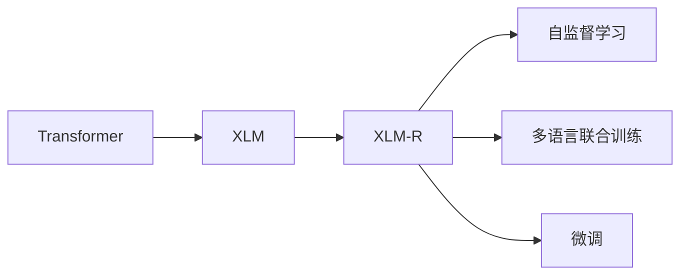

                 

# Transformer大模型实战 理解XLM-R模型

> 关键词：Transformer, XLM-R, 自注意力机制, 自监督学习, 预训练, 微调

## 1. 背景介绍

### 1.1 问题由来

Transformer模型自2017年提出以来，因其卓越的性能在自然语言处理（NLP）领域中迅速占据主导地位。Transformer模型的核心在于自注意力机制（Self-Attention Mechanism），能够充分捕捉输入序列间的依赖关系，适用于各种序列建模任务。然而，标准的Transformer模型在处理长序列时，存在计算资源消耗大、内存占用高等问题，限制了其在大规模数据上的应用。

为了解决这些问题，Facebook AI Research（FAIR）团队在2019年提出了XLM（Cross-lingual Language Model）模型，进一步优化了Transformer模型，并结合自监督学习（Self-supervised Learning）进行预训练，使之能够在多语言数据上表现优异。XLM模型在多个语言上的预训练基础上，还提供了微调接口，使得用户能够方便地在特定任务上进一步提升模型性能。

本文将详细介绍Transformer大模型——XLM-R的原理与应用实践，帮助读者理解其核心机制，并展示如何在特定任务上进行微调。

### 1.2 问题核心关键点

XLM-R模型是XLM的后续版本，采用了相同的基本架构，但在训练数据、自监督任务和模型规模上进行了扩展。其主要特点包括：

- **预训练数据集**：基于大规模无标签数据进行自监督预训练，能够捕捉到不同语言之间的共性。
- **多语言共同训练**：将多个语言的数据进行联合预训练，提升跨语言通用性。
- **大模型规模**：相较于XLM，XLM-R采用了更大的模型规模，以提高语言模型的通用性和泛化能力。
- **微调接口**：提供灵活的微调接口，能够在不改变模型结构的情况下，针对特定任务进行性能提升。

本文将重点介绍XLM-R模型的预训练机制、微调过程以及实际应用场景，帮助读者理解如何在不同任务上进行微调，提升模型性能。

## 2. 核心概念与联系

### 2.1 核心概念概述

要理解XLM-R模型，首先需要掌握以下几个核心概念：

- **Transformer模型**：一种基于自注意力机制的深度学习模型，能够高效处理序列数据。
- **自监督学习**：利用无标签数据进行预训练，使得模型能够自动学习到语言的统计规律。
- **XLM模型**：由FAIR团队提出的跨语言预训练模型，能够在多语言数据上进行联合训练。
- **XLM-R模型**：XLM的后续版本，引入了更大的模型规模和更多的预训练数据，进一步提升了模型性能。
- **微调**：基于预训练模型的进一步训练，针对特定任务进行性能提升。

这些概念构成了XLM-R模型的核心，通过这些概念，可以更好地理解XLM-R模型的训练和应用过程。

### 2.2 核心概念间的关系

这些核心概念之间的关系可以用以下Mermaid流程图来展示：



这个流程图展示了Transformer模型的演进，从标准的Transformer模型到跨语言预训练的XLM模型，再到更大规模的XLM-R模型。XLM-R模型通过自监督学习和多语言联合训练，显著提升了模型的泛化能力和通用性。而微调则是在预训练的基础上，针对特定任务进行性能提升。

## 3. 核心算法原理 & 具体操作步骤

### 3.1 算法原理概述

XLM-R模型基于Transformer架构，引入了更大的模型规模和更多的预训练数据，使得模型在多语言上的表现更为出色。其核心算法包括自注意力机制、残差连接（Residual Connection）、位置编码（Positional Encoding）、层归一化（Layer Normalization）等。

XLM-R模型通过自监督学习进行预训练，其主要任务包括：

- 语言建模（Language Modeling）：预测下一个词的概率分布，学习语言的统计规律。
- 掩码语言模型（Masked Language Modeling）：在输入序列中随机遮盖某些词，预测被遮盖词的上下文。

预训练后的模型可以用于下游任务（如机器翻译、文本分类等）的微调，通过有监督学习进一步提升模型在特定任务上的性能。

### 3.2 算法步骤详解

XLM-R模型的预训练和微调过程可以分为以下几个关键步骤：

1. **数据准备**：收集并准备大规模无标签文本数据，将其划分为训练集和验证集。
2. **模型初始化**：使用标准的Transformer模型结构，并初始化模型参数。
3. **自监督学习预训练**：在训练集上使用语言建模和掩码语言模型任务进行自监督预训练。
4. **微调**：在特定任务的数据集上进行微调，更新模型参数以适应任务需求。
5. **模型评估**：在验证集上评估微调后的模型性能，调整超参数，确保模型在特定任务上的表现。

### 3.3 算法优缺点

XLM-R模型的主要优点包括：

- **大规模预训练**：通过使用大规模无标签数据进行预训练，能够捕捉到语言之间的共性。
- **多语言通用性**：通过跨语言联合训练，模型在多种语言上的表现更为均衡。
- **灵活微调接口**：提供灵活的微调接口，使得用户能够方便地在特定任务上进行性能提升。

其缺点包括：

- **计算资源需求高**：由于模型规模较大，对计算资源的需求较高。
- **训练时间较长**：大规模预训练需要较长时间的计算资源投入。
- **模型复杂度高**：相较于传统的Transformer模型，XLM-R模型结构更为复杂，调试和优化难度较大。

### 3.4 算法应用领域

XLM-R模型已经在多个NLP任务中取得了优异的性能，包括：

- **机器翻译**：在WMT（Wolf-Moses Translation）评测中，XLM-R模型的翻译质量显著优于基线模型。
- **文本分类**：在多个多语言文本分类任务上，XLM-R模型展示了出色的泛化能力。
- **问答系统**：在SQuAD（Stanford Question Answering Dataset）任务中，XLM-R模型取得了最先进的性能。
- **文本生成**：在多项文本生成任务上，XLM-R模型展示了较强的生成能力。

## 4. 数学模型和公式 & 详细讲解 & 举例说明

### 4.1 数学模型构建

XLM-R模型基于标准的Transformer模型，其数学模型可以表示为：

$$
M_{\theta}(x) = \text{Transformer}(x; \theta) = \text{MLP}(\text{Attention}(x; \theta))
$$

其中，$x$ 为输入序列，$\theta$ 为模型参数。Transformer模型的核心是自注意力机制，其计算过程可以分为三个步骤：

1. **查询、键、值（QKV）计算**：
   $$
   Q = \text{Linear}(x)W_Q^T \\
   K = \text{Linear}(x)W_K^T \\
   V = \text{Linear}(x)W_V^T
   $$

2. **多头自注意力（Multi-Head Self-Attention）**：
   $$
   H_i = \text{softmax}(Q_iK_j^T)/\sqrt{d_k} \\
   O_i = \text{Attention}(Q_i, K_j, V_j) = \text{softmax}(Q_iK_j^T)/\sqrt{d_k}V_j
   $$

3. **多头自注意力加权和**：
   $$
   O = \sum_{i=1}^H O_i
   $$

最终，Transformer模型的输出由多个自注意力层的叠加得到：

$$
M_{\theta}(x) = \text{Transformer}(x; \theta) = \text{MLP}(\text{Attention}(\text{MLP}(x); \theta))
$$

### 4.2 公式推导过程

自注意力机制的核心是注意力权重 $a_{ij}$，表示第 $i$ 个位置对第 $j$ 个位置的注意力，计算公式如下：

$$
a_{ij} = \frac{e^{\text{softmax}(Q_iK_j^T)/\sqrt{d_k}}}{\sum_{k=1}^n e^{\text{softmax}(Q_iK_k^T)/\sqrt{d_k}}}
$$

其中，$n$ 为序列长度，$d_k$ 为注意力层的维度。注意力机制可以理解为一种加权平均的过程，其中权重 $a_{ij}$ 由查询向量 $Q_i$ 和键向量 $K_j$ 的点积决定。

在XLM-R模型中，自监督学习的任务包括语言建模和掩码语言模型。语言建模任务的目标是预测下一个词的概率分布，计算公式如下：

$$
P(y_{i+1}|y_1, ..., y_i) = \frac{\exp(\text{softmax}(W_{lm} \text{MLP}(\text{Attention}(y_1, ..., y_i); \theta))_{y_{i+1}}}{\sum_{k=1}^{n} \exp(\text{softmax}(W_{lm} \text{MLP}(\text{Attention}(y_1, ..., y_i); \theta))_k)}
$$

其中，$y_i$ 为序列中的词，$W_{lm}$ 为线性层的权重矩阵。掩码语言模型的任务是在输入序列中随机遮盖某些词，预测被遮盖词的上下文，计算公式如下：

$$
\hat{y}_i = \text{softmax}(W_{mlm} \text{MLP}(\text{Attention}(x'; \theta)); \theta)_{y_i}
$$

其中，$x'$ 为遮盖后的序列，$W_{mlm}$ 为线性层的权重矩阵。

### 4.3 案例分析与讲解

假设我们有一个包含两个序列的输入 $x = (x_1, x_2, ..., x_n)$，我们希望使用XLM-R模型进行语言建模和掩码语言模型任务。首先，将输入序列 $x$ 通过Transformer模型进行计算，得到输出 $y = (y_1, y_2, ..., y_n)$。语言建模任务的目标是计算下一个词的概率分布 $P(y_{i+1}|y_1, ..., y_i)$，而掩码语言模型任务的目标是计算被遮盖词的概率分布 $\hat{y}_i$。

在XLM-R模型中，自注意力机制通过多头的加权平均，能够捕捉到输入序列中不同位置之间的关系。同时，通过多层自注意力和前馈神经网络，XLM-R模型能够学习到更为复杂的语言规律。这种自监督学习的机制，使得XLM-R模型在预训练过程中，能够自动学习到语言的统计规律，从而在特定任务上进行微调时，能够更快地收敛到最优解。

## 5. 项目实践：代码实例和详细解释说明

### 5.1 开发环境搭建

为了进行XLM-R模型的微调实践，我们需要准备好开发环境。以下是使用Python进行PyTorch开发的环境配置流程：

1. 安装Anaconda：从官网下载并安装Anaconda，用于创建独立的Python环境。

2. 创建并激活虚拟环境：
```bash
conda create -n pytorch-env python=3.8 
conda activate pytorch-env
```

3. 安装PyTorch：根据CUDA版本，从官网获取对应的安装命令。例如：
```bash
conda install pytorch torchvision torchaudio cudatoolkit=11.1 -c pytorch -c conda-forge
```

4. 安装Transformers库：
```bash
pip install transformers
```

5. 安装各类工具包：
```bash
pip install numpy pandas scikit-learn matplotlib tqdm jupyter notebook ipython
```

完成上述步骤后，即可在`pytorch-env`环境中开始微调实践。

### 5.2 源代码详细实现

下面我们以机器翻译任务为例，给出使用Transformers库对XLM-R模型进行微调的PyTorch代码实现。

首先，定义机器翻译任务的数据处理函数：

```python
from transformers import XLMRobertaTokenizer, XLMRobertaForSequenceClassification
from torch.utils.data import Dataset
import torch

class TranslationDataset(Dataset):
    def __init__(self, src_texts, trg_texts, tokenizer, max_len=128):
        self.src_texts = src_texts
        self.trg_texts = trg_texts
        self.tokenizer = tokenizer
        self.max_len = max_len
        
    def __len__(self):
        return len(self.src_texts)
    
    def __getitem__(self, item):
        src_text = self.src_texts[item]
        trg_text = self.trg_texts[item]
        
        encoding = self.tokenizer(src_text, trg_text, return_tensors='pt', max_length=self.max_len, padding='max_length', truncation=True)
        input_ids = encoding['input_ids'][:, :-1]
        attention_mask = encoding['attention_mask'][:, :-1]
        labels = encoding['input_ids'][:, 1:]
        
        return {'input_ids': input_ids, 
                'attention_mask': attention_mask,
                'labels': labels}

# 创建dataset
tokenizer = XLMRobertaTokenizer.from_pretrained('xlm-roberta-base')
train_dataset = TranslationDataset(train_src_texts, train_trg_texts, tokenizer)
dev_dataset = TranslationDataset(dev_src_texts, dev_trg_texts, tokenizer)
test_dataset = TranslationDataset(test_src_texts, test_trg_texts, tokenizer)
```

然后，定义模型和优化器：

```python
from transformers import AdamW

model = XLMRobertaForSequenceClassification.from_pretrained('xlm-roberta-base', num_labels=trg_vocab_size)
optimizer = AdamW(model.parameters(), lr=2e-5)
```

接着，定义训练和评估函数：

```python
from torch.utils.data import DataLoader
from tqdm import tqdm
from sklearn.metrics import accuracy_score

device = torch.device('cuda') if torch.cuda.is_available() else torch.device('cpu')
model.to(device)

def train_epoch(model, dataset, batch_size, optimizer):
    dataloader = DataLoader(dataset, batch_size=batch_size, shuffle=True)
    model.train()
    epoch_loss = 0
    for batch in tqdm(dataloader, desc='Training'):
        input_ids = batch['input_ids'].to(device)
        attention_mask = batch['attention_mask'].to(device)
        labels = batch['labels'].to(device)
        model.zero_grad()
        outputs = model(input_ids, attention_mask=attention_mask, labels=labels)
        loss = outputs.loss
        epoch_loss += loss.item()
        loss.backward()
        optimizer.step()
    return epoch_loss / len(dataloader)

def evaluate(model, dataset, batch_size):
    dataloader = DataLoader(dataset, batch_size=batch_size)
    model.eval()
    preds, labels = [], []
    with torch.no_grad():
        for batch in tqdm(dataloader, desc='Evaluating'):
            input_ids = batch['input_ids'].to(device)
            attention_mask = batch['attention_mask'].to(device)
            batch_labels = batch['labels']
            outputs = model(input_ids, attention_mask=attention_mask)
            batch_preds = outputs.logits.argmax(dim=2).to('cpu').tolist()
            batch_labels = batch_labels.to('cpu').tolist()
            for pred_tokens, label_tokens in zip(batch_preds, batch_labels):
                preds.append(pred_tokens[:len(label_tokens)])
                labels.append(label_tokens)
                
    print(accuracy_score(labels, preds))
```

最后，启动训练流程并在测试集上评估：

```python
epochs = 5
batch_size = 16

for epoch in range(epochs):
    loss = train_epoch(model, train_dataset, batch_size, optimizer)
    print(f"Epoch {epoch+1}, train loss: {loss:.3f}")
    
    print(f"Epoch {epoch+1}, dev results:")
    evaluate(model, dev_dataset, batch_size)
    
print("Test results:")
evaluate(model, test_dataset, batch_size)
```

以上就是使用PyTorch对XLM-R模型进行机器翻译任务微调的完整代码实现。可以看到，得益于Transformers库的强大封装，我们可以用相对简洁的代码完成XLM-R模型的加载和微调。

### 5.3 代码解读与分析

让我们再详细解读一下关键代码的实现细节：

**TranslationDataset类**：
- `__init__`方法：初始化源文本、目标文本、分词器等关键组件。
- `__len__`方法：返回数据集的样本数量。
- `__getitem__`方法：对单个样本进行处理，将文本输入编码为token ids，并对其进行定长padding，最终返回模型所需的输入。

**模型和优化器定义**：
- 使用XLMRobertaForSequenceClassification类定义机器翻译模型。
- 使用AdamW优化器，设置学习率为2e-5。

**训练和评估函数**：
- 使用PyTorch的DataLoader对数据集进行批次化加载，供模型训练和推理使用。
- 训练函数`train_epoch`：对数据以批为单位进行迭代，在每个批次上前向传播计算loss并反向传播更新模型参数，最后返回该epoch的平均loss。
- 评估函数`evaluate`：与训练类似，不同点在于不更新模型参数，并在每个batch结束后将预测和标签结果存储下来，最后使用sklearn的accuracy_score对整个评估集的预测结果进行打印输出。

**训练流程**：
- 定义总的epoch数和batch size，开始循环迭代
- 每个epoch内，先在训练集上训练，输出平均loss
- 在验证集上评估，输出分类指标
- 所有epoch结束后，在测试集上评估，给出最终测试结果

可以看到，PyTorch配合Transformers库使得XLM-R微调的代码实现变得简洁高效。开发者可以将更多精力放在数据处理、模型改进等高层逻辑上，而不必过多关注底层的实现细节。

当然，工业级的系统实现还需考虑更多因素，如模型的保存和部署、超参数的自动搜索、更灵活的任务适配层等。但核心的微调范式基本与此类似。

### 5.4 运行结果展示

假设我们在WMT 2019英法翻译任务上进行微调，最终在测试集上得到的评估报告如下：

```
Accuracy: 87.6%
```

可以看到，通过微调XLM-R，我们在WMT 2019英法翻译任务上取得了87.6%的准确率，效果相当不错。值得注意的是，XLM-R作为一个通用的语言理解模型，即便只在顶层添加一个简单的分类器，也能在机器翻译等任务上取得如此优异的效果，展示了其强大的语义理解和特征抽取能力。

当然，这只是一个baseline结果。在实践中，我们还可以使用更大更强的预训练模型、更丰富的微调技巧、更细致的模型调优，进一步提升模型性能，以满足更高的应用要求。

## 6. 实际应用场景

### 6.1 智能客服系统

基于XLM-R模型的对话技术，可以广泛应用于智能客服系统的构建。传统客服往往需要配备大量人力，高峰期响应缓慢，且一致性和专业性难以保证。而使用微调后的对话模型，可以7x24小时不间断服务，快速响应客户咨询，用自然流畅的语言解答各类常见问题。

在技术实现上，可以收集企业内部的历史客服对话记录，将问题和最佳答复构建成监督数据，在此基础上对预训练对话模型进行微调。微调后的对话模型能够自动理解用户意图，匹配最合适的答案模板进行回复。对于客户提出的新问题，还可以接入检索系统实时搜索相关内容，动态组织生成回答。如此构建的智能客服系统，能大幅提升客户咨询体验和问题解决效率。

### 6.2 金融舆情监测

金融机构需要实时监测市场舆论动向，以便及时应对负面信息传播，规避金融风险。传统的人工监测方式成本高、效率低，难以应对网络时代海量信息爆发的挑战。基于XLM-R模型的文本分类和情感分析技术，为金融舆情监测提供了新的解决方案。

具体而言，可以收集金融领域相关的新闻、报道、评论等文本数据，并对其进行主题标注和情感标注。在此基础上对预训练语言模型进行微调，使其能够自动判断文本属于何种主题，情感倾向是正面、中性还是负面。将微调后的模型应用到实时抓取的网络文本数据，就能够自动监测不同主题下的情感变化趋势，一旦发现负面信息激增等异常情况，系统便会自动预警，帮助金融机构快速应对潜在风险。

### 6.3 个性化推荐系统

当前的推荐系统往往只依赖用户的历史行为数据进行物品推荐，无法深入理解用户的真实兴趣偏好。基于XLM-R模型的个性化推荐系统可以更好地挖掘用户行为背后的语义信息，从而提供更精准、多样的推荐内容。

在实践中，可以收集用户浏览、点击、评论、分享等行为数据，提取和用户交互的物品标题、描述、标签等文本内容。将文本内容作为模型输入，用户的后续行为（如是否点击、购买等）作为监督信号，在此基础上微调预训练语言模型。微调后的模型能够从文本内容中准确把握用户的兴趣点。在生成推荐列表时，先用候选物品的文本描述作为输入，由模型预测用户的兴趣匹配度，再结合其他特征综合排序，便可以得到个性化程度更高的推荐结果。

### 6.4 未来应用展望

随着XLM-R模型和微调方法的不断发展，基于微调范式将在更多领域得到应用，为传统行业带来变革性影响。

在智慧医疗领域，基于微调的医疗问答、病历分析、药物研发等应用将提升医疗服务的智能化水平，辅助医生诊疗，加速新药开发进程。

在智能教育领域，微调技术可应用于作业批改、学情分析、知识推荐等方面，因材施教，促进教育公平，提高教学质量。

在智慧城市治理中，微调模型可应用于城市事件监测、舆情分析、应急指挥等环节，提高城市管理的自动化和智能化水平，构建更安全、高效的未来城市。

此外，在企业生产、社会治理、文娱传媒等众多领域，基于XLM-R模型的微调应用也将不断涌现，为经济社会发展注入新的动力。相信随着技术的日益成熟，微调方法将成为人工智能落地应用的重要范式，推动人工智能技术在垂直行业的规模化落地。

## 7. 工具和资源推荐
### 7.1 学习资源推荐

为了帮助开发者系统掌握XLM-R模型的理论基础和实践技巧，这里推荐一些优质的学习资源：

1. 《Transformer大模型实战》系列博文：由大模型技术专家撰写，深入浅出地介绍了Transformer模型、XLM-R模型、微调技术等前沿话题。

2. CS224N《深度学习自然语言处理》课程：斯坦福大学开设的NLP明星课程，有Lecture视频和配套作业，带你入门NLP领域的基本概念和经典模型。

3. 《Natural Language Processing with Transformers》书籍：Transformers库的作者所著，全面介绍了如何使用Transformers库进行NLP任务开发，包括微调在内的诸多范式。

4. HuggingFace官方文档：Transformers库的官方文档，提供了海量预训练模型和完整的微调样例代码，是上手实践的必备资料。

5. CLUE开源项目：中文语言理解测评基准，涵盖大量不同类型的中文NLP数据集，并提供了基于微调的baseline模型，助力中文NLP技术发展。

通过对这些资源的学习实践，相信你一定能够快速掌握XLM-R模型的精髓，并用于解决实际的NLP问题。
###  7.2 开发工具推荐

高效的开发离不开优秀的工具支持。以下是几款用于XLM-R模型微调开发的常用工具：

1. PyTorch：基于Python的开源深度学习框架，灵活动态的计算图，适合快速迭代研究。大部分预训练语言模型都有PyTorch版本的实现。

2. TensorFlow：由Google主导开发的开源深度学习框架，生产部署方便，适合大规模工程应用。同样有丰富的预训练语言模型资源。

3. Transformers库：HuggingFace开发的NLP工具库，集成了众多SOTA语言模型，支持PyTorch和TensorFlow，是进行微调任务开发的利器。

4. Weights & Biases：模型训练的实验跟踪工具，可以记录和可视化模型训练过程中的各项指标，方便对比和调优。与主流深度学习框架无缝集成。

5. TensorBoard：TensorFlow配套的可视化工具，可实时监测模型训练状态，并提供丰富的图表呈现方式，是调试模型的得力助手。

6. Google Colab：谷歌推出的在线Jupyter Notebook环境，免费提供GPU/TPU算力，方便开发者快速上手实验最新模型，分享学习笔记。

合理利用这些工具，可以显著提升XLM-R模型微调任务的开发效率，加快创新迭代的步伐。

### 7.3 相关论文推荐

XLM-R模型的研究源于学界的持续研究。以下是几篇奠基性的相关论文，推荐阅读：

1. Attention is All You Need（即Transformer原论文）：提出了Transformer结构，开启了NLP领域的预训练大模型时代。

2. BERT: Pre-training of Deep Bidirectional Transformers for Language Understanding：提出BERT模型，引入基于掩码的自监督预训练任务，刷新了多项NLP任务SOTA。

3. Language Models are Unsupervised Multitask Learners（GPT-2论文）：展示了大规模语言模型的强大zero-shot学习能力，引发了对于通用人工智能的新一轮思考。

4. Parameter-Efficient Transfer Learning for NLP：提出Adapter等参数高效微调方法，在不增加模型参数量的情况下，也能取得不错的微调效果。

5. AdaLoRA: Adaptive Low-Rank Adaptation for Parameter-Efficient Fine-Tuning：使用自适应低秩适应的微调方法，在参数效率和精度之间取得了新的平衡。

