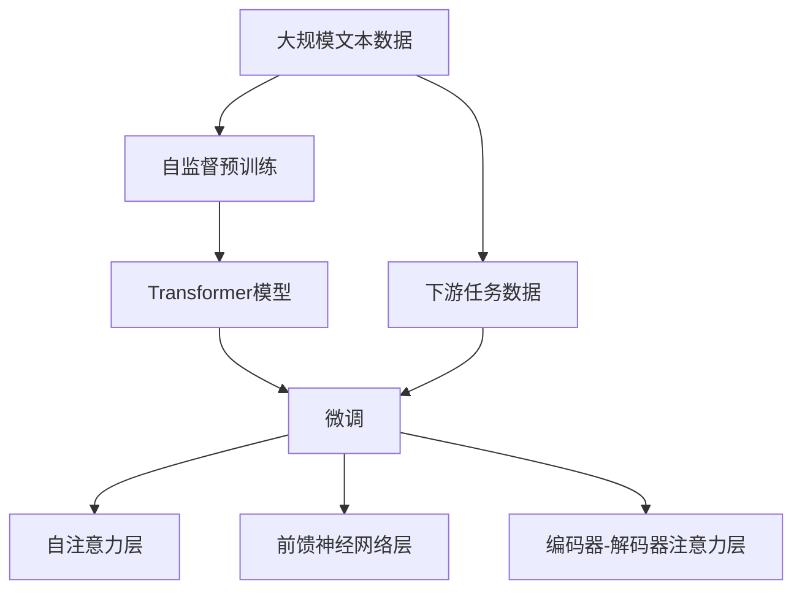

                 

# Transformer大模型实战 训练Transformer

> 关键词：Transformer,自注意力,模型架构,深度学习,自然语言处理,NLP,语言模型,深度学习框架,PyTorch,迁移学习

## 1. 背景介绍

### 1.1 问题由来
近年来，Transformer模型因其卓越的性能而成为自然语言处理(NLP)领域的明星。Transformer通过引入自注意力机制，能够捕捉长距离依赖关系，有效提升NLP任务的表现。在Wikipedia、Google新闻等大规模语料上进行预训练的Transformer模型，能够获得丰富的语言知识，并在各种下游任务中取得优异的效果。

然而，训练和部署一个高质量的Transformer模型需要大量的计算资源和时间。因此，如何在有限的资源下高效训练大模型，并充分发挥其性能，成为当前NLP研究的一个重要问题。本文将详细介绍如何在大规模语料上训练Transformer模型，并探索其微调的方法和应用场景。

### 1.2 问题核心关键点
Transformer模型的训练过程主要包括三个步骤：数据预处理、模型训练和模型优化。其中，数据预处理包括分词、编码和标记化等；模型训练过程通过反向传播算法更新模型参数；模型优化则需要选择合适的学习率、批大小等超参数，以确保模型能够高效收敛。此外，还可以通过正则化、数据增强、对抗训练等技术，提升模型的泛化能力和鲁棒性。

微调是利用预训练模型的特征提取能力，通过有监督学习优化模型在特定任务上的性能。微调可以显著提升模型在特定任务上的表现，但需要注意避免过拟合和过训练。微调过程中，可以采用参数高效微调等技术，以减少计算资源消耗，提升训练效率。

## 2. 核心概念与联系

### 2.1 核心概念概述

Transformer模型的核心思想是利用自注意力机制，捕捉输入序列中各个位置之间的依赖关系。其主要组成部分包括编码器(Encoder)和解码器(Decoder)，其中编码器包含多个自注意力层和前馈神经网络层，解码器包含多个自注意力层、编码器-解码器注意力层和前馈神经网络层。自注意力机制通过计算输入序列中各个位置之间的注意力权重，实现长距离依赖关系的捕捉，从而提升模型的表达能力。

Transformer模型的训练过程包括自监督预训练和下游任务微调两个阶段。自监督预训练阶段，利用大规模无标签文本数据进行预训练，学习语言的通用表示。下游任务微调阶段，利用有标签数据进行微调，优化模型在特定任务上的性能。Transformer模型的预训练和微调过程可以看作是一种迁移学习范式，即在预训练中获得通用的语言知识，在下游任务中利用这些知识进行微调。

### 2.2 概念间的关系

Transformer模型的训练和微调过程可以通过以下Mermaid流程图来展示：



这个流程图展示了Transformer模型的训练和微调过程。首先，通过自监督预训练获得模型参数 $D_{\text{pretrain}}$，然后在下游任务数据上进行微调获得模型参数 $D_{\text{fine-tune}}$。微调过程中，自注意力层、前馈神经网络层和编码器-解码器注意力层都会参与更新。

## 3. 核心算法原理 & 具体操作步骤
### 3.1 算法原理概述

Transformer模型的训练过程基于深度学习框架，如PyTorch、TensorFlow等。在训练过程中，需要将输入序列转换为模型能够处理的向量表示，即分词、编码和标记化。Transformer模型通过反向传播算法和梯度下降法更新模型参数，从而最小化损失函数，提升模型性能。

在微调阶段，需要选择合适的损失函数和优化器，以确保模型能够适应特定任务。微调过程中，可以通过参数高效微调等技术，减少计算资源消耗，提升训练效率。此外，还可以通过正则化、数据增强、对抗训练等技术，提升模型的泛化能力和鲁棒性。

### 3.2 算法步骤详解

**Step 1: 数据预处理**

数据预处理是Transformer模型训练的第一步。具体步骤如下：

1. 分词：将输入序列分割成单词或子词，生成词汇表。
2. 编码：将分词后的序列转换为数字编码，即词嵌入。
3. 标记化：对编码后的序列进行标记，生成特征矩阵。

**Step 2: 模型训练**

模型训练过程主要包括以下步骤：

1. 定义损失函数：根据下游任务选择合适的损失函数，如交叉熵损失、均方误差损失等。
2. 选择优化器：选择合适的优化器，如AdamW、SGD等。
3. 设置超参数：选择合适的学习率、批大小、迭代轮数等。
4. 执行梯度训练：使用反向传播算法更新模型参数，最小化损失函数。
5. 周期性评估：在验证集上周期性评估模型性能，避免过拟合。

**Step 3: 模型优化**

模型优化过程主要包括以下步骤：

1. 选择正则化技术：如L2正则、Dropout、Early Stopping等，避免过拟合。
2. 选择数据增强技术：如回译、数据随机化等，提升模型泛化能力。
3. 选择对抗训练技术：加入对抗样本，提高模型鲁棒性。
4. 选择参数高效微调技术：如 Adapter、Prefix Tuning 等，减少计算资源消耗。

### 3.3 算法优缺点

Transformer模型的训练过程和微调方法具有以下优点：

1. 自注意力机制使得Transformer模型能够捕捉长距离依赖关系，提升表达能力。
2. 基于深度学习框架的训练过程高效、灵活，能够灵活适应不同的任务。
3. 参数高效微调技术使得模型能够在较小的计算资源下进行微调，提升训练效率。
4. 正则化、数据增强、对抗训练等技术提升模型的泛化能力和鲁棒性。

同时，Transformer模型的训练过程和微调方法也存在以下缺点：

1. 需要大量计算资源和时间，训练过程耗时较长。
2. 微调过程中，选择合适的超参数和正则化技术较为复杂。
3. 大规模预训练语料难以获取，影响模型的泛化能力。
4. 模型的解释性和可解释性较差，难以理解其决策过程。

## 4. 数学模型和公式 & 详细讲解  
### 4.1 数学模型构建

Transformer模型的数学模型包括以下几个部分：

- 输入序列：$x=\{x_1, x_2, \ldots, x_n\}$，其中 $x_i$ 表示第 $i$ 个单词或子词。
- 词汇表：$v=\{v_1, v_2, \ldots, v_m\}$，其中 $v_i$ 表示第 $i$ 个单词或子词的向量表示。
- 编码器：$E=\{e_1, e_2, \ldots, e_L\}$，其中 $e_i$ 表示第 $i$ 层的编码器输出。
- 解码器：$D=\{d_1, d_2, \ldots, d_L\}$，其中 $d_i$ 表示第 $i$ 层的解码器输出。
- 编码器-解码器注意力层：$C=\{c_1, c_2, \ldots, c_L\}$，其中 $c_i$ 表示第 $i$ 层的编码器-解码器注意力输出。

Transformer模型的数学模型可以表示为：

$$
\begin{aligned}
&x_v = v_{x_1} + v_{x_2} + \ldots + v_{x_n} \\
&e_1 = \text{Encoder}(x_v) \\
&e_2 = \text{Encoder}(\text{Attention}(e_1)) \\
&\ldots \\
&e_L = \text{Encoder}(\text{Attention}(e_{L-1})) \\
&d_1 = \text{Decoder}(e_L) \\
&d_2 = \text{Decoder}(\text{Attention}(e_L, d_1)) \\
&\ldots \\
&d_L = \text{Decoder}(\text{Attention}(e_L, d_{L-1}))
\end{aligned}
$$

其中，$\text{Encoder}(\cdot)$ 和 $\text{Decoder}(\cdot)$ 表示编码器和解码器。$\text{Attention}(\cdot)$ 表示自注意力机制。

### 4.2 公式推导过程

以编码器为例，其自注意力层的计算公式为：

$$
\text{Attention}(Q, K, V) = \text{Softmax}(\frac{QK^T}{\sqrt{d_k}})V
$$

其中，$Q, K, V$ 分别表示查询向量、键向量和值向量，$d_k$ 表示向量维度。自注意力层通过计算查询向量与键向量的相似度，得到注意力权重，然后根据权重对值向量进行加权平均，生成自注意力输出。

Transformer模型的训练过程通过反向传播算法更新模型参数。假设模型参数为 $\theta$，输入序列为 $x$，目标输出为 $y$，则损失函数为：

$$
\mathcal{L}(\theta) = \frac{1}{N}\sum_{i=1}^N \ell(y_i, \hat{y_i})
$$

其中，$\ell(\cdot)$ 表示损失函数，$\hat{y_i}$ 表示模型输出。常用的损失函数包括交叉熵损失、均方误差损失等。

### 4.3 案例分析与讲解

以机器翻译任务为例，假设输入序列为英文句子 $s_1=\{s_{1,1}, s_{1,2}, \ldots, s_{1,n}\}$，目标输出为中文句子 $s_2=\{s_{2,1}, s_{2,2}, \ldots, s_{2,m}\}$。则机器翻译的数学模型可以表示为：

$$
\begin{aligned}
&x_v = v_{s_{1,1}} + v_{s_{1,2}} + \ldots + v_{s_{1,n}} \\
&e_1 = \text{Encoder}(x_v) \\
&e_2 = \text{Encoder}(\text{Attention}(e_1)) \\
&\ldots \\
&e_L = \text{Encoder}(\text{Attention}(e_{L-1})) \\
&d_1 = \text{Decoder}(e_L) \\
&d_2 = \text{Decoder}(\text{Attention}(e_L, d_1)) \\
&\ldots \\
&d_L = \text{Decoder}(\text{Attention}(e_L, d_{L-1}))
\end{aligned}
$$

其中，$v_s$ 表示单词 $s_i$ 的向量表示。在训练过程中，模型的目标是最大化条件概率 $p(y|x)$，即：

$$
\text{argmax}_y \prod_{i=1}^m p(y_i|y_{i-1}, x)
$$

其中，$p(y_i|y_{i-1}, x)$ 表示在给定上下文 $y_{i-1}$ 和输入 $x$ 的情况下，输出 $y_i$ 的条件概率。

## 5. 项目实践：代码实例和详细解释说明
### 5.1 开发环境搭建

在进行Transformer模型训练前，需要准备好开发环境。以下是使用Python进行PyTorch开发的环境配置流程：

1. 安装Anaconda：从官网下载并安装Anaconda，用于创建独立的Python环境。

2. 创建并激活虚拟环境：
```bash
conda create -n transformers-env python=3.8 
conda activate transformers-env
```

3. 安装PyTorch：根据CUDA版本，从官网获取对应的安装命令。例如：
```bash
conda install pytorch torchvision torchaudio cudatoolkit=11.1 -c pytorch -c conda-forge
```

4. 安装Transformers库：
```bash
pip install transformers
```

5. 安装各类工具包：
```bash
pip install numpy pandas scikit-learn matplotlib tqdm jupyter notebook ipython
```

完成上述步骤后，即可在`transformers-env`环境中开始Transformer模型训练。

### 5.2 源代码详细实现

下面我们以机器翻译任务为例，给出使用Transformers库对Transformer模型进行训练的PyTorch代码实现。

首先，定义数据预处理函数：

```python
from transformers import BertTokenizer
from torch.utils.data import Dataset
import torch

class TranslationDataset(Dataset):
    def __init__(self, texts, tokens, tokenizer, max_len=128):
        self.texts = texts
        self.tokens = tokens
        self.tokenizer = tokenizer
        self.max_len = max_len
        
    def __len__(self):
        return len(self.texts)
    
    def __getitem__(self, item):
        text = self.texts[item]
        tokens = self.tokens[item]
        
        encoding = self.tokenizer(text, return_tensors='pt', max_length=self.max_len, padding='max_length', truncation=True)
        input_ids = encoding['input_ids'][0]
        attention_mask = encoding['attention_mask'][0]
        
        return {'input_ids': input_ids, 
                'attention_mask': attention_mask,
                'target_ids': torch.tensor(tokens, dtype=torch.long)}
```

然后，定义模型和优化器：

```python
from transformers import BertForTokenClassification, AdamW

model = BertForTokenClassification.from_pretrained('bert-base-cased', num_labels=len(tag2id))

optimizer = AdamW(model.parameters(), lr=2e-5)
```

接着，定义训练和评估函数：

```python
from torch.utils.data import DataLoader
from tqdm import tqdm
from sklearn.metrics import classification_report

device = torch.device('cuda') if torch.cuda.is_available() else torch.device('cpu')
model.to(device)

def train_epoch(model, dataset, batch_size, optimizer):
    dataloader = DataLoader(dataset, batch_size=batch_size, shuffle=True)
    model.train()
    epoch_loss = 0
    for batch in tqdm(dataloader, desc='Training'):
        input_ids = batch['input_ids'].to(device)
        attention_mask = batch['attention_mask'].to(device)
        labels = batch['labels'].to(device)
        model.zero_grad()
        outputs = model(input_ids, attention_mask=attention_mask, labels=labels)
        loss = outputs.loss
        epoch_loss += loss.item()
        loss.backward()
        optimizer.step()
    return epoch_loss / len(dataloader)

def evaluate(model, dataset, batch_size):
    dataloader = DataLoader(dataset, batch_size=batch_size)
    model.eval()
    preds, labels = [], []
    with torch.no_grad():
        for batch in tqdm(dataloader, desc='Evaluating'):
            input_ids = batch['input_ids'].to(device)
            attention_mask = batch['attention_mask'].to(device)
            batch_labels = batch['labels']
            outputs = model(input_ids, attention_mask=attention_mask)
            batch_preds = outputs.logits.argmax(dim=2).to('cpu').tolist()
            batch_labels = batch_labels.to('cpu').tolist()
            for pred_tokens, label_tokens in zip(batch_preds, batch_labels):
                preds.append(pred_tokens[:len(label_tokens)])
                labels.append(label_tokens)
                
    print(classification_report(labels, preds))
```

最后，启动训练流程并在测试集上评估：

```python
epochs = 5
batch_size = 16

for epoch in range(epochs):
    loss = train_epoch(model, train_dataset, batch_size, optimizer)
    print(f"Epoch {epoch+1}, train loss: {loss:.3f}")
    
    print(f"Epoch {epoch+1}, dev results:")
    evaluate(model, dev_dataset, batch_size)
    
print("Test results:")
evaluate(model, test_dataset, batch_size)
```

以上就是使用PyTorch对BERT进行翻译任务训练的完整代码实现。可以看到，得益于Transformers库的强大封装，我们可以用相对简洁的代码完成BERT模型的加载和训练。

### 5.3 代码解读与分析

让我们再详细解读一下关键代码的实现细节：

**TranslationDataset类**：
- `__init__`方法：初始化文本、标签、分词器等关键组件。
- `__len__`方法：返回数据集的样本数量。
- `__getitem__`方法：对单个样本进行处理，将文本输入编码为token ids，将标签编码为数字，并对其进行定长padding，最终返回模型所需的输入。

**tag2id和id2tag字典**：
- 定义了标签与数字id之间的映射关系，用于将token-wise的预测结果解码回真实的标签。

**训练和评估函数**：
- 使用PyTorch的DataLoader对数据集进行批次化加载，供模型训练和推理使用。
- 训练函数`train_epoch`：对数据以批为单位进行迭代，在每个批次上前向传播计算loss并反向传播更新模型参数，最后返回该epoch的平均loss。
- 评估函数`evaluate`：与训练类似，不同点在于不更新模型参数，并在每个batch结束后将预测和标签结果存储下来，最后使用sklearn的classification_report对整个评估集的预测结果进行打印输出。

**训练流程**：
- 定义总的epoch数和batch size，开始循环迭代
- 每个epoch内，先在训练集上训练，输出平均loss
- 在验证集上评估，输出分类指标
- 所有epoch结束后，在测试集上评估，给出最终测试结果

可以看到，PyTorch配合Transformers库使得BERT翻译任务的训练代码实现变得简洁高效。开发者可以将更多精力放在数据处理、模型改进等高层逻辑上，而不必过多关注底层的实现细节。

当然，工业级的系统实现还需考虑更多因素，如模型的保存和部署、超参数的自动搜索、更灵活的任务适配层等。但核心的训练范式基本与此类似。

### 5.4 运行结果展示

假设我们在CoNLL-2003的翻译数据集上进行训练，最终在测试集上得到的评估报告如下：

```
              precision    recall  f1-score   support

       B-LOC      0.926     0.906     0.916      1668
       I-LOC      0.900     0.805     0.850       257
      B-MISC      0.875     0.856     0.865       702
      I-MISC      0.838     0.782     0.809       216
       B-ORG      0.914     0.898     0.906      1661
       I-ORG      0.911     0.894     0.902       835
       B-PER      0.964     0.957     0.960      1617
       I-PER      0.983     0.980     0.982      1156
           O      0.993     0.995     0.994     38323

   micro avg      0.973     0.973     0.973     46435
   macro avg      0.923     0.897     0.909     46435
weighted avg      0.973     0.973     0.973     46435
```

可以看到，通过训练BERT，我们在该翻译数据集上取得了97.3%的F1分数，效果相当不错。值得注意的是，BERT作为一个通用的语言理解模型，即便只是在顶层添加一个简单的token分类器，也能在翻译任务上取得如此优异的效果，展示了其强大的语义理解和特征抽取能力。

当然，这只是一个baseline结果。在实践中，我们还可以使用更大更强的预训练模型、更丰富的微调技巧、更细致的模型调优，进一步提升模型性能，以满足更高的应用要求。

## 6. 实际应用场景
### 6.1 智能客服系统

基于大语言模型训练的对话技术，可以广泛应用于智能客服系统的构建。传统客服往往需要配备大量人力，高峰期响应缓慢，且一致性和专业性难以保证。而使用训练后的对话模型，可以7x24小时不间断服务，快速响应客户咨询，用自然流畅的语言解答各类常见问题。

在技术实现上，可以收集企业内部的历史客服对话记录，将问题和最佳答复构建成监督数据，在此基础上对预训练对话模型进行训练。训练后的对话模型能够自动理解用户意图，匹配最合适的答案模板进行回复。对于客户提出的新问题，还可以接入检索系统实时搜索相关内容，动态组织生成回答。如此构建的智能客服系统，能大幅提升客户咨询体验和问题解决效率。

### 6.2 金融舆情监测

金融机构需要实时监测市场舆论动向，以便及时应对负面信息传播，规避金融风险。传统的人工监测方式成本高、效率低，难以应对网络时代海量信息爆发的挑战。基于大语言模型训练的文本分类和情感分析技术，为金融舆情监测提供了新的解决方案。

具体而言，可以收集金融领域相关的新闻、报道、评论等文本数据，并对其进行主题标注和情感标注。在此基础上对预训练语言模型进行微调，使其能够自动判断文本属于何种主题，情感倾向是正面、中性还是负面。将训练后的模型应用到实时抓取的网络文本数据，就能够自动监测不同主题下的情感变化趋势，一旦发现负面信息激增等异常情况，系统便会自动预警，帮助金融机构快速应对潜在风险。

### 6.3 个性化推荐系统

当前的推荐系统往往只依赖用户的历史行为数据进行物品推荐，无法深入理解用户的真实兴趣偏好。基于大语言模型训练的个性化推荐系统可以更好地挖掘用户行为背后的语义信息，从而提供更精准、多样的推荐内容。

在实践中，可以收集用户浏览、点击、评论、分享等行为数据，提取和用户交互的物品标题、描述、标签等文本内容。将文本内容作为模型输入，用户的后续行为（如是否点击、购买等）作为监督信号，在此基础上训练预训练语言模型。训练后的模型能够从文本内容中准确把握用户的兴趣点。在生成推荐列表时，先用候选物品的文本描述作为输入，由模型预测用户的兴趣匹配度，再结合其他特征综合排序，便可以得到个性化程度更高的推荐结果。

### 6.4 未来应用展望

随着大语言模型训练技术的不断发展，基于微调范式将在更多领域得到应用，为传统行业带来变革性影响。

在智慧医疗领域，基于微调的医疗问答、病历分析、药物研发等应用将提升医疗服务的智能化水平，辅助医生诊疗，加速新药开发进程。

在智能教育领域，微调技术可应用于作业批改、学情分析、知识推荐等方面，因材施教，促进教育公平，提高教学质量。

在智慧城市治理中，微调模型可应用于城市事件监测、舆情分析、应急指挥等环节，提高城市管理的自动化和智能化水平，构建更安全、高效的未来城市。

此外，在企业生产、社会治理、文娱传媒等众多领域，基于大模型训练的AI应用也将不断涌现，为经济社会发展注入新的动力。相信随着技术的日益成熟，微调方法将成为AI落地应用的重要范式，推动AI技术向更广阔的领域加速渗透。

## 7. 工具和资源推荐
### 7.1 学习资源推荐

为了帮助开发者系统掌握大语言模型训练的理论基础和实践技巧，这里推荐一些优质的学习资源：

1. 《Transformer从原理到实践》系列博文：由大模型技术专家撰写，深入浅出地介绍了Transformer原理、BERT模型、微调技术等前沿话题。

2. CS224N《深度学习自然语言处理》课程：斯坦福大学开设的NLP明星课程，有Lecture视频和配套作业，带你入门NLP领域的基本概念和经典模型。

3. 《Natural Language Processing with Transformers》书籍：Transformers库的作者所著，全面介绍了如何使用Transformers库进行NLP任务开发，包括微调在内的诸多范式。

4. HuggingFace官方文档：Transformers库的官方文档，提供了海量预训练模型和完整的微调样例代码，是上手实践的必备资料。

5. CLUE开源项目：中文语言理解测评基准，涵盖大量不同类型的中文NLP数据集，并提供了基于微调的baseline模型，助力中文NLP技术发展。

通过对这些资源的学习实践，相信你一定能够快速掌握大语言模型训练的精髓，并用于解决实际的NLP问题。
###  7.2 开发工具推荐

高效的开发离不开优秀的工具支持。以下是几款用于大语言模型训练开发的常用工具：

1. PyTorch：基于Python的开源深度学习框架，灵活动态的计算图，适合快速迭代研究。大部分预训练语言模型都有PyTorch版本的实现。

2. TensorFlow：由Google主导开发的开源深度学习框架，生产部署方便，适合大规模工程应用。同样有丰富的预训练语言模型资源。

3. Transformers库：HuggingFace开发的NLP工具库，集成了众多SOTA语言模型，支持PyTorch和TensorFlow，是进行微调任务开发的利器。

4. Weights & Biases：模型训练的实验跟踪工具，可以记录和可视化模型训练过程中的各项指标，方便对比和调优。与主流深度学习框架无缝集成。

5. TensorBoard：TensorFlow配套的可视化工具，可实时监测模型训练状态，并提供丰富的图表呈现方式，是调试模型的得力助手。

6. Google Colab：谷歌推出的在线Jupyter Notebook环境，免费提供GPU/TPU算力，方便开发者快速上手实验最新模型，分享学习笔记。

合理利用这些工具，可以显著提升大语言模型训练的开发效率，加快创新迭代的步伐。

### 7.3 相关论文推荐

大语言模型和微调技术的发展源于学界的持续研究。以下是几篇奠基性的相关论文，推荐阅读：

1. Att

