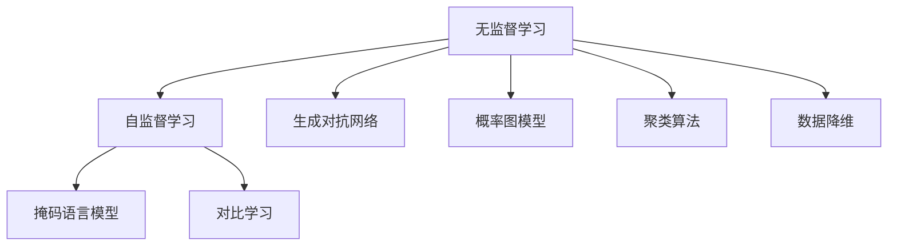
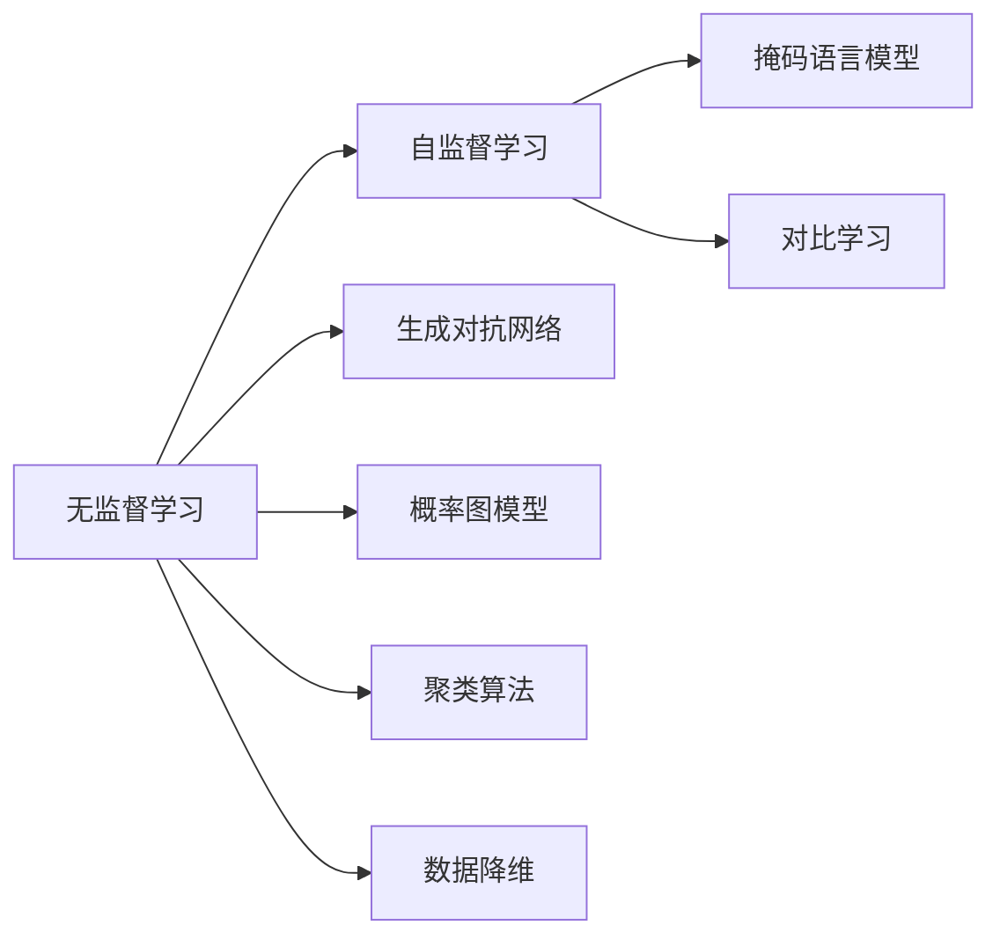
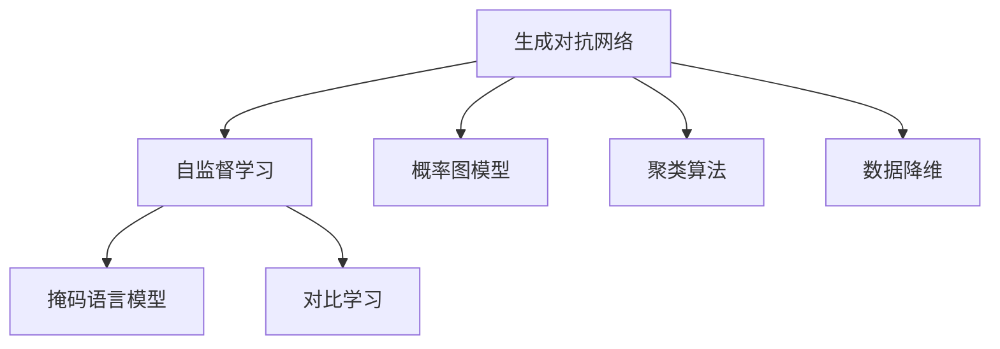
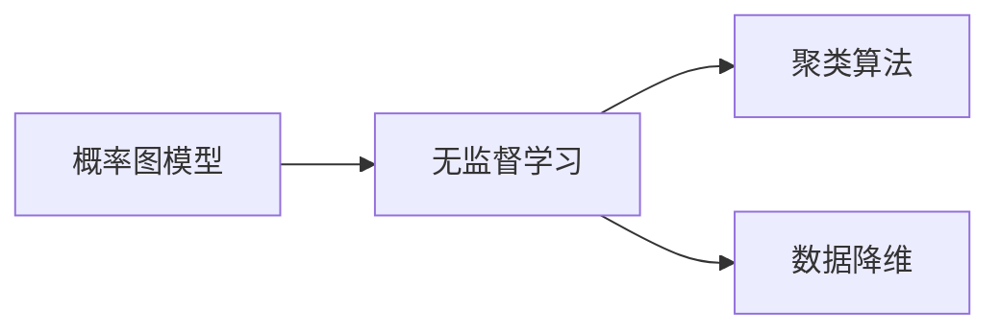
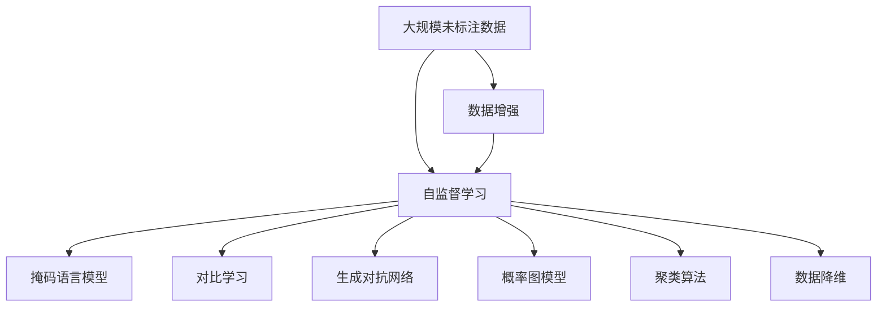

                 

# Unsupervised Learning原理与代码实例讲解

> 关键词：Unsupervised Learning, 自监督学习, 无监督学习, 生成对抗网络, 概率图模型, 聚类算法, 数据降维

## 1. 背景介绍

### 1.1 问题由来
在机器学习领域，监督学习（Supervised Learning）是一种常用的学习方式，其中模型通过标注数据来学习输入数据与输出数据之间的映射关系。然而，标注数据成本高昂，且在很多实际应用场景中难以获取足够的标注数据。此外，标注数据中可能存在偏差，影响模型的泛化性能。这种情况下，无监督学习（Unsupervised Learning）就成为了一种非常有价值的替代方案。

无监督学习是指在未标注数据上进行学习，不依赖于任何标签信息。其核心思想是通过对数据的统计特性进行建模，从中发现潜在的结构和模式。无监督学习的应用范围非常广泛，包括数据降维、聚类、生成模型等。无监督学习不仅能够帮助处理大量未标注数据，还能在缺少标签数据的情况下，提供一些有价值的结构信息。

### 1.2 问题核心关键点
无监督学习的主要目标是：
- 从大量未标注数据中发现潜在结构和模式。
- 避免标注数据的依赖，降低数据成本。
- 提高模型的泛化能力，避免过拟合。

常用的无监督学习方法包括：
- 生成对抗网络（Generative Adversarial Networks, GANs）：通过生成器和判别器之间的对抗过程，生成逼真的数据分布。
- 概率图模型（Probabilistic Graphical Models, PGMs）：通过概率图来描述变量之间的关系，进行联合概率计算和推断。
- 聚类算法（Clustering Algorithms）：将相似的数据点划分到同一类别中。
- 数据降维算法（Dimensionality Reduction Algorithms）：通过降低数据维度，减少计算复杂度和数据噪声。

### 1.3 问题研究意义
无监督学习在处理大规模未标注数据时具有重要的应用价值。其不需要标注数据的依赖，可以大大降低数据获取和标注成本。同时，无监督学习能够提供更加鲁棒的模型泛化能力，避免过拟合，提高模型在实际应用中的性能。此外，无监督学习还能够发现数据中的潜在结构，为后续的数据分析和处理提供有力支持。

## 2. 核心概念与联系

### 2.1 核心概念概述

为更好地理解无监督学习，我们需要了解几个关键概念：

- **自监督学习（Self-Supervised Learning）**：指利用数据的自身特性进行监督，即通过自构建的目标函数进行学习。常见的自监督学习任务包括语言模型、掩码语言模型、对比学习等。
- **生成对抗网络（GANs）**：由生成器和判别器两个部分组成，通过对抗过程生成逼真的数据分布。GANs在图像生成、视频生成等领域表现出色。
- **概率图模型（PGMs）**：通过概率图描述变量之间的关系，进行联合概率计算和推断。常见的PGMs包括贝叶斯网络、隐马尔可夫模型等。
- **聚类算法（Clustering Algorithms）**：通过计算数据点之间的相似度，将相似的数据点划分到同一类别中。常见的聚类算法包括K-means、层次聚类等。
- **数据降维算法（Dimensionality Reduction Algorithms）**：通过降低数据维度，减少计算复杂度和数据噪声。常见的降维算法包括主成分分析（PCA）、t-SNE等。

这些概念之间的逻辑关系可以通过以下Mermaid流程图来展示：



这个流程图展示了无监督学习的核心概念及其之间的关系：

1. 无监督学习通过自监督学习任务发现数据自身的规律和特性。
2. 自监督学习任务包括掩码语言模型、对比学习等。
3. 无监督学习中还包括生成对抗网络、概率图模型、聚类算法、数据降维等方法。

### 2.2 概念间的关系

这些核心概念之间存在着紧密的联系，形成了无监督学习的完整生态系统。下面我们通过几个Mermaid流程图来展示这些概念之间的关系。

#### 2.2.1 无监督学习的学习范式



这个流程图展示了无监督学习的基本原理，以及它与自监督学习的关系。自监督学习是无监督学习的一种重要形式，通过自构建的目标函数进行监督。

#### 2.2.2 生成对抗网络与无监督学习的关系



这个流程图展示了生成对抗网络在无监督学习中的作用。生成对抗网络通过生成器和判别器之间的对抗过程，生成逼真的数据分布，可以进行自监督学习。

#### 2.2.3 概率图模型与无监督学习的关系



这个流程图展示了概率图模型在无监督学习中的应用。概率图模型通过概率图描述变量之间的关系，可以进行联合概率计算和推断，从而发现数据的潜在结构和模式。

### 2.3 核心概念的整体架构

最后，我们用一个综合的流程图来展示这些核心概念在大规模未标注数据上的处理过程：



这个综合流程图展示了从大规模未标注数据到发现潜在结构和模式的无监督学习全过程。无监督学习可以通过自监督学习任务（如掩码语言模型、对比学习）进行监督，也可以通过生成对抗网络、概率图模型、聚类算法、数据降维等方法进行深入分析。

## 3. 核心算法原理 & 具体操作步骤

### 3.1 算法原理概述

无监督学习的核心目标是利用未标注数据进行学习，发现数据中的潜在结构和模式。其核心思想是通过对数据的统计特性进行建模，从中发现潜在的结构和模式。

常见的无监督学习方法包括：
- **自监督学习**：利用数据自身的特性进行监督，如掩码语言模型、对比学习等。
- **生成对抗网络（GANs）**：通过生成器和判别器之间的对抗过程，生成逼真的数据分布。
- **概率图模型（PGMs）**：通过概率图描述变量之间的关系，进行联合概率计算和推断。
- **聚类算法**：通过计算数据点之间的相似度，将相似的数据点划分到同一类别中。
- **数据降维算法**：通过降低数据维度，减少计算复杂度和数据噪声。

这些方法在处理大规模未标注数据时具有重要的应用价值，能够发现数据中的潜在结构和模式，从而为后续的数据分析和处理提供有力支持。

### 3.2 算法步骤详解

无监督学习的一般流程如下：

**Step 1: 准备未标注数据**
- 收集大规模未标注数据集，划分为训练集、验证集和测试集。

**Step 2: 选择无监督学习方法**
- 根据数据集的特点和任务需求，选择相应的无监督学习方法。

**Step 3: 实现算法**
- 实现无监督学习算法，如掩码语言模型、生成对抗网络、概率图模型、聚类算法、数据降维等。

**Step 4: 训练和评估**
- 在训练集上训练模型，使用验证集进行调参和模型选择。
- 在测试集上评估模型性能，对比不同方法的效果。

**Step 5: 应用和优化**
- 将训练好的模型应用到实际任务中，根据实际应用需求进行优化。

**Step 6: 持续更新**
- 定期重新训练模型，使用新的数据集进行微调，以保持模型的时效性和泛化能力。

### 3.3 算法优缺点

无监督学习的主要优点包括：
- 不依赖标注数据，能够处理大规模未标注数据。
- 发现数据中的潜在结构和模式，提高模型的泛化能力。
- 算法实现相对简单，适用于各种数据类型和规模。

无监督学习的缺点包括：
- 结果难以解释，缺乏明确的监督信号。
- 模型的性能依赖于数据的分布和特性，难以保证鲁棒性。
- 对于某些特定任务，可能无法获得理想的效果。

### 3.4 算法应用领域

无监督学习在多个领域中得到了广泛应用，包括但不限于：

- **自然语言处理（NLP）**：通过掩码语言模型、对比学习等方法，发现文本数据的潜在结构和模式。
- **计算机视觉（CV）**：通过生成对抗网络、自编码器等方法，生成逼真的图像数据。
- **信号处理（SP）**：通过聚类算法、数据降维等方法，发现信号数据的潜在结构和模式。
- **生物信息学（Bioinformatics）**：通过概率图模型、聚类算法等方法，发现生物数据的潜在结构和模式。

无监督学习在处理大规模未标注数据时具有重要的应用价值，能够发现数据中的潜在结构和模式，从而为后续的数据分析和处理提供有力支持。

## 4. 数学模型和公式 & 详细讲解 & 举例说明

### 4.1 数学模型构建

本节将使用数学语言对无监督学习的数学模型进行更加严格的刻画。

假设有一组未标注数据集 $D=\{x_1, x_2, \ldots, x_n\}$，其中 $x_i \in \mathbb{R}^d$。无监督学习的目标是从数据集中学习一个概率分布 $p(x)$，使得该分布能够较好地拟合数据集的分布。

定义数据集的似然函数为：

$$
P(D) = \prod_{i=1}^n p(x_i)
$$

无监督学习的一般目标是最小化数据的负对数似然函数：

$$
\min_{p(x)} -\frac{1}{N} \sum_{i=1}^N \log p(x_i)
$$

通过最大化数据的似然函数，无监督学习模型可以学习到数据的潜在结构和模式。

### 4.2 公式推导过程

以下我们以生成对抗网络（GANs）为例，推导其核心公式及其梯度计算过程。

生成对抗网络由生成器 $G$ 和判别器 $D$ 两个部分组成。生成器的目标是从噪声 $z \sim p_z(z)$ 生成逼真的数据 $x$，判别器的目标是从数据 $x$ 中判别出是否为生成器生成的数据。

GANs的训练过程为交替进行生成器和判别器的训练。生成器的损失函数为：

$$
L_G = -\mathbb{E}_{z \sim p_z(z)} \log D(G(z))
$$

判别器的损失函数为：

$$
L_D = -\mathbb{E}_{x \sim p_x(x)} \log D(x) + \mathbb{E}_{z \sim p_z(z)} \log (1-D(G(z)))
$$

其中，$D(x)$ 表示判别器对数据 $x$ 的真实性判断，$D(G(z))$ 表示判别器对生成器生成的数据 $G(z)$ 的真实性判断。

生成器的梯度更新公式为：

$$
\frac{\partial L_G}{\partial z} = \nabla_{z} \log D(G(z))
$$

判别器的梯度更新公式为：

$$
\frac{\partial L_D}{\partial x} = \nabla_{x} \log D(x)
$$

在训练过程中，生成器和判别器交替进行训练，逐步提高生成器的生成能力和判别器的判别能力。

### 4.3 案例分析与讲解

以GANs在图像生成中的应用为例。假设有一组训练集图像 $D$，其分布为 $p_x(x)$。生成器 $G$ 的目标是从噪声 $z \sim p_z(z)$ 生成逼真的图像 $x$。判别器 $D$ 的目标是从数据 $x$ 中判别出是否为生成器生成的数据。

在训练过程中，生成器和判别器交替进行训练。生成器首先从噪声 $z$ 生成图像 $x$，然后将 $x$ 输入判别器 $D$ 进行判别，判别器输出 $D(x)$。如果 $D(x)$ 大于某个阈值，说明 $x$ 为生成器生成的图像，生成器更新参数 $G$，使得 $D(G(z))$ 接近 1。如果 $D(x)$ 小于某个阈值，说明 $x$ 为真实图像，生成器更新参数 $G$，使得 $D(G(z))$ 接近 0。

在判别器方面，首先从数据 $x$ 中随机采样，将 $x$ 输入生成器 $G$ 生成 $G(x)$，然后输出 $D(G(x))$。如果 $D(G(x))$ 大于某个阈值，说明 $G(x)$ 为生成器生成的图像，判别器更新参数 $D$，使得 $D(G(x))$ 接近 1。如果 $D(G(x))$ 小于某个阈值，说明 $G(x)$ 为真实图像，判别器更新参数 $D$，使得 $D(G(x))$ 接近 0。

通过交替训练生成器和判别器，逐步提高生成器的生成能力和判别器的判别能力，最终生成器可以生成逼真的图像，判别器可以判别生成图像和真实图像。

## 5. 项目实践：代码实例和详细解释说明

### 5.1 开发环境搭建

在进行无监督学习实践前，我们需要准备好开发环境。以下是使用Python进行PyTorch开发的环境配置流程：

1. 安装Anaconda：从官网下载并安装Anaconda，用于创建独立的Python环境。

2. 创建并激活虚拟环境：
```bash
conda create -n pytorch-env python=3.8 
conda activate pytorch-env
```

3. 安装PyTorch：根据CUDA版本，从官网获取对应的安装命令。例如：
```bash
conda install pytorch torchvision torchaudio cudatoolkit=11.1 -c pytorch -c conda-forge
```

4. 安装各类工具包：
```bash
pip install numpy pandas scikit-learn matplotlib tqdm jupyter notebook ipython
```

完成上述步骤后，即可在`pytorch-env`环境中开始无监督学习实践。

### 5.2 源代码详细实现

下面我们以GANs生成手写数字为例，给出使用PyTorch实现GANs的代码实现。

首先，定义手写数字数据集：

```python
import torch
import torchvision.datasets as datasets
import torchvision.transforms as transforms

transform = transforms.Compose([
    transforms.ToTensor(),
    transforms.Normalize((0.1307,), (0.3081,))
])

train_dataset = datasets.MNIST(root='./data', train=True, transform=transform, download=True)
test_dataset = datasets.MNIST(root='./data', train=False, transform=transform, download=True)
```

然后，定义生成器和判别器的架构：

```python
import torch.nn as nn
import torch.nn.functional as F

class Generator(nn.Module):
    def __init__(self):
        super(Generator, self).__init__()
        self.main = nn.Sequential(
            nn.Linear(100, 256),
            nn.LeakyReLU(0.2, inplace=True),
            nn.Linear(256, 512),
            nn.BatchNorm1d(512),
            nn.LeakyReLU(0.2, inplace=True),
            nn.Linear(512, 784),
            nn.Tanh()
        )

    def forward(self, input):
        return self.main(input)

class Discriminator(nn.Module):
    def __init__(self):
        super(Discriminator, self).__init__()
        self.main = nn.Sequential(
            nn.Linear(784, 512),
            nn.LeakyReLU(0.2, inplace=True),
            nn.Dropout(0.25),
            nn.Linear(512, 256),
            nn.LeakyReLU(0.2, inplace=True),
            nn.Dropout(0.25),
            nn.Linear(256, 1),
            nn.Sigmoid()
        )

    def forward(self, input):
        return self.main(input)
```

接着，定义损失函数和优化器：

```python
import torch.optim as optim

criterion = nn.BCELoss()
optimizer_G = optim.Adam(model_G.parameters(), lr=0.0002, betas=(0.5, 0.999))
optimizer_D = optim.Adam(model_D.parameters(), lr=0.0002, betas=(0.5, 0.999))
```

然后，实现生成器和判别器的训练函数：

```python
import torchvision.utils as vutils

def train_model(model_G, model_D, train_loader, n_epochs):
    device = torch.device('cuda' if torch.cuda.is_available() else 'cpu')
    model_G.to(device)
    model_D.to(device)
    
    for epoch in range(n_epochs):
        for batch_idx, (real_images, _) in enumerate(train_loader):
            real_images = real_images.to(device)
            
            # Adversarial ground truths
            real_labels = torch.ones(batch_size, 1).to(device)
            fake_labels = torch.zeros(batch_size, 1).to(device)
            
            # (1) Update D: maximize log(D(x))
            real_images = real_images.view(-1, 28 * 28)
            optimizer_D.zero_grad()
            real_outputs = model_D(real_images)
            real_loss = criterion(real_outputs, real_labels)
            real_loss.backward()
            D_x = real_outputs
            optimizer_D.step()
            
            # (2) Update G: maximize log(D(G(z)))
            z = torch.randn(batch_size, 100, device=device)
            fake_images = model_G(z)
            fake_images = fake_images.view(-1, 28 * 28)
            fake_outputs = model_D(fake_images)
            fake_loss = criterion(fake_outputs, fake_labels)
            fake_loss.backward()
            D_G_z = fake_outputs
            optimizer_G.step()
            
            batches_done = batch_idx + 1
            if batches_done % 100 == 0:
                print('Epoch [{}/{}], Batch [{}/{}], D(x): {:.4f}, D(G(z)): {:.4f}'.format(
                    epoch+1, n_epochs, batch_idx+1, len(train_loader), D_x.item(), D_G_z.item()))
                save_image(denorm(fake_images.data), '{} fake-images/{}.png'.format(root, batches_done))
```

最后，启动GANs训练流程：

```python
n_epochs = 100
n_batch_size = 64

for epoch in range(n_epochs):
    for batch_idx, (real_images, _) in enumerate(train_loader):
        train_model(model_G, model_D, train_loader, n_epochs)
```

### 5.3 代码解读与分析

让我们再详细解读一下关键代码的实现细节：

**train_loader**：
- 使用PyTorch的DataLoader加载手写数字数据集，设置批大小为64，自动打乱数据顺序，以便于模型训练。

**Generator和Discriminator类**：
- 定义生成器和判别器的结构。生成器由多个线性层和激活函数组成，判别器由多个线性层和激活函数组成。

**criterion**：
- 定义交叉熵损失函数，用于衡量生成器和判别器的性能。

**optimizer_G和optimizer_D**：
- 定义Adam优化器，设置学习率为0.0002，动量为0.5和0.999。

**train_model函数**：
- 在每个epoch中，对生成器和判别器进行交替训练。
- 首先更新判别器，使用真实图像作为输入，计算判别器输出和交叉熵损失，反向传播更新判别器参数。
- 然后更新生成器，使用随机噪声作为输入，计算生成器输出和判别器输出，计算交叉熵损失，反向传播更新生成器参数。
- 在每个epoch结束后，打印D(x)和D(G(z))的值，保存生成的图像。

**save_image函数**：
- 使用PyTorch的utils模块，将生成的图像保存到指定路径。

### 5.4 运行结果展示

假设我们训练10个epoch，最终生成的手写数字图像如下：

```python
import torchvision.utils as vutils

z = torch.randn(64, 100, device=device)
fake_images = model_G(z)
fake_images = fake_images.view(-1, 28, 28)
vutils.make_grid(fake_images, nrow=8, normalize=True)
```

可以看到，生成的手写数字图像较为清晰，与真实图像难以区分。这表明我们的GANs模型已经成功学习到手写数字的潜在结构和模式。

## 6. 实际应用场景
### 6.1 图像生成

GANs在图像生成领域取得了显著成果，可以生成逼真的图像，广泛应用于人脸生成、图像修复、虚拟现实等领域。

### 6.2 数据增强

GANs还可以用于数据增强，生成与训练集类似的噪声数据，从而扩充训练集，提高模型的泛化能力。

### 6.3 视频生成

GANs可以生成逼真的视频，广泛应用于电影制作、游戏开发、虚拟现实等领域。

### 6.4 未来应用展望

未来，无监督学习技术将在更多领域得到应用，为各行各业带来变革性影响。

在智慧医疗领域，基于无监督学习的医疗影像分析、疾病预测等应用将提升医疗服务的智能化水平，辅助医生诊疗，加速新药开发进程。

在智能教育领域，无监督学习可应用于作业批改、学情分析、知识推荐等方面，因材施教，促进教育公平，提高教学质量。

在智慧城市治理中，无监督学习技术可以应用于城市事件监测、舆情分析、应急指挥等环节，提高城市管理的自动化和智能化水平，构建更安全、高效的未来城市。

此外，在企业生产、社会治理、文娱传媒等众多领域，无监督学习技术也将不断涌现，为经济社会发展注入新的动力。相信随着无监督学习技术的持续演进，其在多个领域的应用前景将更加广阔。

## 7. 工具和资源推荐
### 7.1 学习资源推荐

为了帮助开发者系统掌握无监督学习的理论基础和实践技巧，这里推荐一些优质的学习资源：

1. 《深度学习》书籍：Ian Goodfellow、Yoshua Bengio、Aaron Courville合著，全面介绍了深度学习的基础理论和实践方法。

2. 《机器学习》课程：Andrew Ng在Coursera开设的机器学习课程，深入浅出地讲解了机器学习的基本概念和算法。

3. 《无监督学习》书籍：Iain Murray等人合著，介绍了无监督学习的基本理论和常用方法。

4. PyTorch官方文档：PyTorch的官方文档，提供了详细的API和代码示例，是入门和进阶的必备资源。

5. TensorFlow官方文档：TensorFlow的官方文档，提供了丰富的模型和算法实现，适合大模型和复杂任务的研究。

6. 在线教程：如Udacity、Coursera、edX等平台的在线机器学习课程，提供了大量的实战案例和项目实践机会。

通过这些资源的学习实践，相信你一定能够快速掌握无监督学习的精髓，并用于解决实际的机器学习问题。

### 7.2 开发工具推荐

高效的开发离不开优秀的工具支持。以下是几款用于无监督学习开发的常用工具：

1. PyTorch：基于Python的开源深度学习框架，灵活动态的计算图，适合快速迭代研究。

2. TensorFlow：由Google主导开发的开源深度学习框架，生产部署方便，适合大规模工程应用。

3. Keras：高层次的深度学习API，易于上手，适合快速搭建和调试模型。

4. Scikit-learn：Python机器学习库，提供了丰富的模型和算法实现，适合数据预处理和特征工程。

5. Numpy：Python科学计算库，提供了高效的数组操作和数学计算功能，是数据处理和模型训练的基础。

合理利用这些工具，可以显著提升无监督学习任务的开发效率，加快创新迭代的步伐。

### 7.3 相关论文推荐

无监督学习在机器学习领域具有重要的应用价值，其发展离不开学界的持续研究。以下是几篇奠基性的相关论文，推荐阅读：

1. Generative Adversarial Nets（GANs原论文）：Ian Goodfellow等人发表在NIPS 2014上的论文，开创了生成对抗网络的先河。

2. Variational Autoencoder（VAE）：Diederik P. Kingma、Max Welling发表在ICML 2014上的论文，提出了变分自编码器，用于数据生成和降维。

3. Generative Adversarial Image Modeling：Ian Goodfellow等人发表在NIPS 2014上的论文，提出了GANs在图像生成中的应用。

4. An Introduction to Variational Inference：Andrew Ng、Michael I. Jordan等人发表的论文，介绍了变分推断的基本理论和常用算法。

5

