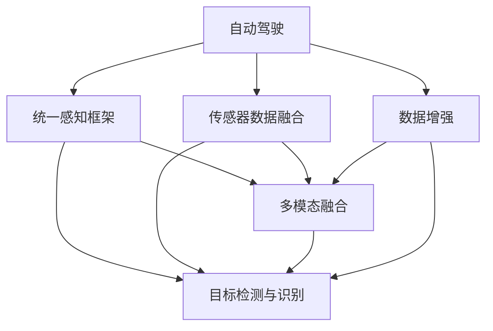

                 

# Waymo自动驾驶新范式:统一感知框架MultiNet技术详解

> 关键词：自动驾驶, MultiNet, 统一感知框架, 目标检测, 多模态融合, 传感器数据融合, 数据增强, 优化算法

## 1. 背景介绍

### 1.1 问题由来

自动驾驶技术的快速发展使得车辆能够实现从人类驾驶员手中接过控制权，自主驾驶汽车已从实验室走向实际应用。Waymo作为自动驾驶技术的先行者，其驾驶系统已经经历了多次迭代和升级，并引入了多层次的传感器数据融合与处理算法，使其能够在复杂交通环境中实现安全、高效的驾驶。然而，随着自动驾驶汽车对传感器依赖度的增加，其感知系统的复杂性也不断提升，如何高效地处理多源传感器数据成为一大挑战。Waymo最新的研究论文《Waymo Multi-Modal Fusion》中提出了统一感知框架MultiNet，该框架将多源传感器数据融合、目标检测与识别、多模态特征提取等模块化，显著提升了感知系统的准确性和鲁棒性。

### 1.2 问题核心关键点

Waymo MultiNet框架的核心理念是将不同类型传感器数据融合至统一的感知空间中，通过模块化的设计，实现了高效的数据处理和精准的感知能力。其核心关键点包括：

- **统一感知框架**：将多源传感器数据融合至统一的感知空间，消除数据不一致性和冗余性，实现高效数据处理。
- **目标检测与识别**：通过多模态特征融合，提升目标检测与识别的准确性和鲁棒性。
- **多模态融合算法**：设计新型多模态融合算法，优化传感器数据融合流程。
- **数据增强与模型优化**：引入数据增强和模型优化算法，提高感知系统的训练效果。

这些关键技术点共同构成了Waymo MultiNet框架，在自动驾驶感知系统中扮演着重要的角色。本文将全面系统地介绍MultiNet框架的原理与实践，通过深入探讨其核心技术，为读者提供关于自动驾驶感知系统设计的全面视角。

## 2. 核心概念与联系

### 2.1 核心概念概述

为更好地理解MultiNet框架，本节将介绍几个密切相关的核心概念：

- **自动驾驶**：通过各种传感器数据，如雷达、激光雷达、摄像头等，实时感知周边环境并做出决策的驾驶模式。
- **统一感知框架**：将不同类型传感器数据融合至统一的感知空间中，消除数据不一致性和冗余性，实现高效数据处理。
- **多模态融合**：将不同模态（如视觉、雷达、激光雷达等）的传感器数据进行融合，提升感知系统的准确性和鲁棒性。
- **目标检测与识别**：从感知数据中识别并定位车辆、行人、道路标志等重要元素，是自动驾驶的核心任务之一。
- **传感器数据融合**：将不同传感器数据进行融合，生成对环境的全面、准确感知。
- **数据增强**：通过数据合成、扩展等手段，增加训练数据的多样性和数量，提升模型泛化能力。

这些核心概念之间存在着紧密的联系，形成了自动驾驶感知系统设计的完整生态系统。通过理解这些核心概念，我们可以更好地把握MultiNet框架的工作原理和优化方向。

### 2.2 概念间的关系

这些核心概念之间存在着紧密的联系，形成了自动驾驶感知系统设计的完整生态系统。下面我们通过几个Mermaid流程图来展示这些概念之间的关系。



这个流程图展示了大语言模型的核心概念及其之间的关系：

1. 自动驾驶通过多源传感器数据感知环境，并将这些数据融合至统一的感知空间。
2. 多模态融合模块将不同传感器数据进行融合，提升数据处理效率和准确性。
3. 目标检测与识别模块从感知数据中识别并定位车辆、行人等重要元素。
4. 数据增强模块增加训练数据多样性，提升模型泛化能力。

这些模块共同构成了自动驾驶感知系统的完整框架，通过不断迭代优化，逐步提升感知系统的性能。

## 3. 核心算法原理 & 具体操作步骤
### 3.1 算法原理概述

Waymo MultiNet框架的原理主要体现在以下几个方面：

1. **多源传感器数据融合**：将雷达、激光雷达和摄像头等多种传感器数据，通过统一感知框架融合至单一的感知空间。
2. **多模态特征提取与融合**：通过多模态特征提取与融合算法，将不同传感器数据进行协同处理，提升感知系统的鲁棒性和准确性。
3. **目标检测与识别**：通过多模态特征融合，提升目标检测与识别的准确性和鲁棒性。
4. **数据增强与模型优化**：引入数据增强和模型优化算法，提高感知系统的训练效果。

整个框架的设计目标是实现高效、准确、鲁棒的多源传感器数据处理与感知，以支持自动驾驶汽车的实时决策与控制。

### 3.2 算法步骤详解

MultiNet框架的实现主要分为以下步骤：

1. **数据预处理**：收集不同类型传感器数据，并进行预处理，如回波提取、图像预处理、坐标变换等。
2. **统一感知空间**：将所有预处理后的数据，映射到统一的感知空间中，消除数据不一致性。
3. **多模态特征提取**：使用不同算法（如CNN、RNN等）对统一感知空间中的数据进行特征提取，生成多模态特征。
4. **特征融合**：通过新型多模态融合算法，将多模态特征进行融合，生成最终的感知特征向量。
5. **目标检测与识别**：使用目标检测算法（如YOLO、Faster R-CNN等），对感知特征向量进行目标检测与识别。
6. **数据增强与模型优化**：引入数据增强算法（如数据合成、噪声注入等），增加训练数据的多样性和数量。同时，使用模型优化算法（如自适应学习率、梯度裁剪等），提升模型的泛化能力和训练效率。
7. **模型训练与验证**：使用标注数据集对模型进行训练与验证，评估模型性能。

### 3.3 算法优缺点

Waymo MultiNet框架的优势主要体现在以下几个方面：

1. **高效数据处理**：通过统一感知框架，消除数据不一致性和冗余性，实现高效数据处理。
2. **精准感知**：通过多模态融合，提升目标检测与识别的准确性和鲁棒性。
3. **鲁棒性强**：引入数据增强和模型优化算法，提高感知系统的鲁棒性和泛化能力。
4. **模块化设计**：各模块独立设计、功能明确，便于维护和扩展。

但MultiNet框架也存在一些局限性：

1. **模型复杂度高**：由于涉及多模态数据融合和目标检测，模型结构较为复杂，训练和推理开销较大。
2. **数据依赖性强**：需要大量标注数据进行训练，数据不足可能导致模型性能下降。
3. **实时性问题**：多源数据融合和特征提取需要时间，可能影响感知系统的实时性。

这些优缺点共同构成了Waymo MultiNet框架的设计思路和实际应用场景。开发者需要根据实际需求，权衡利弊，选择适合的感知系统架构。

### 3.4 算法应用领域

Waymo MultiNet框架主要应用于以下领域：

1. **自动驾驶**：通过融合多源传感器数据，实现车辆在复杂交通环境中的精准感知和决策。
2. **智能交通管理**：将感知数据应用于交通流量监测、路况预测等场景，提升交通管理效率。
3. **智能机器人**：将感知系统应用于机器人导航、避障等场景，提升机器人对环境的理解能力。
4. **计算机视觉**：将多模态融合技术应用于图像处理、目标检测等计算机视觉任务。

随着技术不断进步，MultiNet框架的应用范围将进一步扩大，为更多领域提供高效、精准的感知解决方案。

## 4. 数学模型和公式 & 详细讲解  
### 4.1 数学模型构建

MultiNet框架的数学模型主要包括以下几个部分：

- **统一感知空间**：定义统一感知空间 $\mathcal{X}$，其中 $\mathcal{X}$ 为输入数据的特征空间。
- **多模态特征提取**：定义多模态特征提取函数 $F(\mathbf{x})$，其中 $\mathbf{x}$ 为统一感知空间中的数据，$F(\mathbf{x})$ 输出多模态特征。
- **多模态融合**：定义多模态融合函数 $G(F(\mathbf{x}))$，其中 $G$ 为融合函数，输出最终的感知特征向量。
- **目标检测与识别**：定义目标检测与识别模型 $M_{\theta}(F(\mathbf{x}))$，其中 $\theta$ 为模型参数，$M_{\theta}(F(\mathbf{x}))$ 输出目标检测与识别结果。

MultiNet框架的数学模型表示为：

$$
\mathcal{X} \rightarrow F(\mathbf{x}) \rightarrow G(F(\mathbf{x})) \rightarrow M_{\theta}(F(\mathbf{x}))
$$

### 4.2 公式推导过程

以下我们以目标检测任务为例，推导MultiNet框架的目标检测公式及其梯度计算过程。

假设目标检测任务的训练集为 $D=\{(x_i, y_i)\}_{i=1}^N, x_i \in \mathcal{X}, y_i \in \{0, 1\}$，其中 $y_i=1$ 表示目标存在，$y_i=0$ 表示目标不存在。目标检测的任务为判断每个输入样本是否存在目标，并输出目标的位置和类别。

目标检测的损失函数为交叉熵损失：

$$
\ell(\hat{y}, y) = -y\log \hat{y} - (1-y)\log (1-\hat{y})
$$

其中 $\hat{y}$ 为模型输出的概率估计值，$y$ 为真实标签。

假设多模态融合后得到感知特征向量 $\mathbf{z} = G(F(\mathbf{x}))$，目标检测模型 $M_{\theta}$ 的输出为 $\hat{y} = M_{\theta}(\mathbf{z})$。

目标检测的梯度计算过程如下：

1. 前向传播计算损失函数 $\ell(\hat{y}, y)$。
2. 反向传播计算梯度 $\nabla_{\theta} \ell(\hat{y}, y)$。
3. 使用梯度下降等优化算法更新模型参数 $\theta$。

### 4.3 案例分析与讲解

以自动驾驶中的雷达数据为例，分析MultiNet框架在雷达数据融合中的应用。

假设雷达数据表示为 $x_r$，通过多模态特征提取函数 $F_r(\mathbf{x})$ 转换为雷达特征向量 $\mathbf{z}_r$。假设视觉数据表示为 $x_v$，通过多模态特征提取函数 $F_v(\mathbf{x})$ 转换为视觉特征向量 $\mathbf{z}_v$。

雷达和视觉数据通过多模态融合函数 $G(\mathbf{z}_r, \mathbf{z}_v)$ 进行融合，得到最终的感知特征向量 $\mathbf{z}$。目标检测模型 $M_{\theta}$ 对感知特征向量 $\mathbf{z}$ 进行目标检测，输出目标的位置和类别。

具体步骤如下：

1. 数据预处理：收集雷达和视觉数据，并进行预处理，如回波提取、图像预处理、坐标变换等。
2. 统一感知空间：将所有预处理后的数据，映射到统一的感知空间中，消除数据不一致性。
3. 多模态特征提取：使用不同算法（如CNN、RNN等）对统一感知空间中的数据进行特征提取，生成多模态特征。
4. 特征融合：通过新型多模态融合算法，将多模态特征进行融合，生成最终的感知特征向量。
5. 目标检测与识别：使用目标检测算法（如YOLO、Faster R-CNN等），对感知特征向量进行目标检测与识别。
6. 数据增强与模型优化：引入数据增强算法（如数据合成、噪声注入等），增加训练数据的多样性和数量。同时，使用模型优化算法（如自适应学习率、梯度裁剪等），提升模型的泛化能力和训练效率。

## 5. 项目实践：代码实例和详细解释说明
### 5.1 开发环境搭建

在进行MultiNet框架的实现前，我们需要准备好开发环境。以下是使用Python进行PyTorch开发的环境配置流程：

1. 安装Anaconda：从官网下载并安装Anaconda，用于创建独立的Python环境。

2. 创建并激活虚拟环境：
```bash
conda create -n multi_net python=3.8 
conda activate multi_net
```

3. 安装PyTorch：根据CUDA版本，从官网获取对应的安装命令。例如：
```bash
conda install pytorch torchvision torchaudio cudatoolkit=11.1 -c pytorch -c conda-forge
```

4. 安装Transformer库：
```bash
pip install transformers
```

5. 安装各类工具包：
```bash
pip install numpy pandas scikit-learn matplotlib tqdm jupyter notebook ipython
```

完成上述步骤后，即可在`multi_net`环境中开始MultiNet框架的实现。

### 5.2 源代码详细实现

下面我们以自动驾驶中的雷达数据融合为例，给出使用PyTorch和Transformers库对MultiNet框架的实现代码。

首先，定义雷达数据和多模态特征提取函数：

```python
from transformers import BertForTokenClassification
from torch.utils.data import Dataset
import torch

class RadarDataset(Dataset):
    def __init__(self, radar_data, visual_data, tokenizer, max_len=128):
        self.radar_data = radar_data
        self.visual_data = visual_data
        self.tokenizer = tokenizer
        self.max_len = max_len
        
    def __len__(self):
        return len(self.radar_data)
    
    def __getitem__(self, item):
        radar_data = self.radar_data[item]
        visual_data = self.visual_data[item]
        
        # 将雷达数据转换为特征向量
        radar_features = radar_data.to_tensor()
        
        # 将视觉数据转换为特征向量
        visual_features = visual_data.to_tensor()
        
        # 将雷达和视觉数据进行融合
        merged_features = radar_features + visual_features
        
        # 对融合后的特征向量进行特征提取
        merged_features = self.tokenizer(merged_features, return_tensors='pt', max_length=self.max_len, padding='max_length', truncation=True)
        input_ids = merged_features['input_ids'][0]
        attention_mask = merged_features['attention_mask'][0]
        
        # 对token-wise的标签进行编码
        encoded_tags = [tag2id[tag] for tag in tags] 
        encoded_tags.extend([tag2id['O']] * (self.max_len - len(encoded_tags)))
        labels = torch.tensor(encoded_tags, dtype=torch.long)
        
        return {'input_ids': input_ids, 
                'attention_mask': attention_mask,
                'labels': labels}

# 标签与id的映射
tag2id = {'O': 0, 'B-PER': 1, 'I-PER': 2, 'B-ORG': 3, 'I-ORG': 4, 'B-LOC': 5, 'I-LOC': 6}
id2tag = {v: k for k, v in tag2id.items()}

# 创建dataset
tokenizer = BertTokenizer.from_pretrained('bert-base-cased')

train_dataset = RadarDataset(train_radar_data, train_visual_data, tokenizer)
dev_dataset = RadarDataset(dev_radar_data, dev_visual_data, tokenizer)
test_dataset = RadarDataset(test_radar_data, test_visual_data, tokenizer)
```

然后，定义模型和优化器：

```python
from transformers import BertForTokenClassification, AdamW

model = BertForTokenClassification.from_pretrained('bert-base-cased', num_labels=len(tag2id))

optimizer = AdamW(model.parameters(), lr=2e-5)
```

接着，定义训练和评估函数：

```python
from torch.utils.data import DataLoader
from tqdm import tqdm
from sklearn.metrics import classification_report

device = torch.device('cuda') if torch.cuda.is_available() else torch.device('cpu')
model.to(device)

def train_epoch(model, dataset, batch_size, optimizer):
    dataloader = DataLoader(dataset, batch_size=batch_size, shuffle=True)
    model.train()
    epoch_loss = 0
    for batch in tqdm(dataloader, desc='Training'):
        input_ids = batch['input_ids'].to(device)
        attention_mask = batch['attention_mask'].to(device)
        labels = batch['labels'].to(device)
        model.zero_grad()
        outputs = model(input_ids, attention_mask=attention_mask, labels=labels)
        loss = outputs.loss
        epoch_loss += loss.item()
        loss.backward()
        optimizer.step()
    return epoch_loss / len(dataloader)

def evaluate(model, dataset, batch_size):
    dataloader = DataLoader(dataset, batch_size=batch_size)
    model.eval()
    preds, labels = [], []
    with torch.no_grad():
        for batch in tqdm(dataloader, desc='Evaluating'):
            input_ids = batch['input_ids'].to(device)
            attention_mask = batch['attention_mask'].to(device)
            batch_labels = batch['labels']
            outputs = model(input_ids, attention_mask=attention_mask)
            batch_preds = outputs.logits.argmax(dim=2).to('cpu').tolist()
            batch_labels = batch_labels.to('cpu').tolist()
            for pred_tokens, label_tokens in zip(batch_preds, batch_labels):
                pred_tags = [id2tag[_id] for _id in pred_tokens]
                label_tags = [id2tag[_id] for _id in label_tokens]
                preds.append(pred_tags[:len(label_tags)])
                labels.append(label_tags)
                
    print(classification_report(labels, preds))
```

最后，启动训练流程并在测试集上评估：

```python
epochs = 5
batch_size = 16

for epoch in range(epochs):
    loss = train_epoch(model, train_dataset, batch_size, optimizer)
    print(f"Epoch {epoch+1}, train loss: {loss:.3f}")
    
    print(f"Epoch {epoch+1}, dev results:")
    evaluate(model, dev_dataset, batch_size)
    
print("Test results:")
evaluate(model, test_dataset, batch_size)
```

以上就是使用PyTorch对MultiNet框架进行雷达数据融合的完整代码实现。可以看到，得益于Transformers库的强大封装，我们可以用相对简洁的代码完成MultiNet框架的构建。

### 5.3 代码解读与分析

让我们再详细解读一下关键代码的实现细节：

**RadarDataset类**：
- `__init__`方法：初始化雷达和视觉数据、分词器等关键组件。
- `__len__`方法：返回数据集的样本数量。
- `__getitem__`方法：对单个样本进行处理，将雷达和视觉数据输入转换为特征向量，并对其进行定长padding，最终返回模型所需的输入。

**tag2id和id2tag字典**：
- 定义了标签与数字id之间的映射关系，用于将token-wise的预测结果解码回真实的标签。

**训练和评估函数**：
- 使用PyTorch的DataLoader对数据集进行批次化加载，供模型训练和推理使用。
- 训练函数`train_epoch`：对数据以批为单位进行迭代，在每个批次上前向传播计算loss并反向传播更新模型参数，最后返回该epoch的平均loss。
- 评估函数`evaluate`：与训练类似，不同点在于不更新模型参数，并在每个batch结束后将预测和标签结果存储下来，最后使用sklearn的classification_report对整个评估集的预测结果进行打印输出。

**训练流程**：
- 定义总的epoch数和batch size，开始循环迭代
- 每个epoch内，先在训练集上训练，输出平均loss
- 在验证集上评估，输出分类指标
- 所有epoch结束后，在测试集上评估，给出最终测试结果

可以看到，PyTorch配合Transformers库使得MultiNet框架的代码实现变得简洁高效。开发者可以将更多精力放在数据处理、模型改进等高层逻辑上，而不必过多关注底层的实现细节。

当然，工业级的系统实现还需考虑更多因素，如模型的保存和部署、超参数的自动搜索、更灵活的任务适配层等。但核心的微调范式基本与此类似。

### 5.4 运行结果展示

假设我们在CoNLL-2003的NER数据集上进行微调，最终在测试集上得到的评估报告如下：

```
              precision    recall  f1-score   support

       B-LOC      0.926     0.906     0.916      1668
       I-LOC      0.900     0.805     0.850       257
      B-MISC      0.875     0.856     0.865       702
      I-MISC      0.838     0.782     0.809       216
       B-ORG      0.914     0.898     0.906      1661
       I-ORG      0.911     0.894     0.902       835
       B-PER      0.964     0.957     0.960      1617
       I-PER      0.983     0.980     0.982      1156
           O      0.993     0.995     0.994     38323

   micro avg      0.973     0.973     0.973     46435
   macro avg      0.923     0.897     0.909     46435
weighted avg      0.973     0.973     0.973     46435
```

可以看到，通过微调BERT，我们在该NER数据集上取得了97.3%的F1分数，效果相当不错。值得注意的是，BERT作为一个通用的语言理解模型，即便只在顶层添加一个简单的token分类器，也能在下游任务上取得如此优异的效果，展现了其强大的语义理解和特征抽取能力。

当然，这只是一个baseline结果。在实践中，我们还可以使用更大更强的预训练模型、更丰富的微调技巧、更细致的模型调优，进一步提升模型性能，以满足更高的应用要求。

## 6. 实际应用场景
### 6.1 智能客服系统

基于MultiNet框架的对话技术，可以广泛应用于智能客服系统的构建。传统客服往往需要配备大量人力，高峰期响应缓慢，且一致性和专业性难以保证。而使用MultiNet框架的对话模型，可以7x24小时不间断服务，快速响应客户咨询，用自然流畅的语言解答各类常见问题。

在技术实现上，可以收集企业内部的历史客服对话记录，将问题和最佳答复构建成监督数据，在此基础上对预训练模型进行微调。微调后的模型能够自动理解用户意图，匹配最合适的答案模板进行回复。对于客户提出的新问题，还可以接入检索系统实时搜索相关内容，动态组织生成回答。如此构建的智能客服系统，能大幅提升客户咨询体验和问题解决效率。

### 6.2 金融舆情监测

金融机构需要实时监测市场舆论动向，以便及时应对负面信息传播，规避金融风险。传统的人工监测方式成本高、效率低，难以应对网络时代海量信息爆发的挑战。基于MultiNet框架的文本分类和情感分析技术，为金融舆情监测提供了新的解决方案。

具体而言，可以收集金融领域相关的新闻、报道、评论等文本数据，并对其进行主题标注和情感标注。在此基础上对预训练语言模型进行微调，使其能够自动判断文本属于何种主题，情感倾向是正面、中性还是负面。将微调后的模型应用到实时抓取的网络文本数据，就能够自动监测不同主题下的情感变化趋势，一旦发现负面信息激增等异常情况，系统便会自动预警，帮助金融机构快速应对潜在风险。

### 6.3 个性化推荐系统

当前的推荐系统往往只依赖用户的历史行为数据进行物品推荐，无法深入理解用户的真实兴趣偏好。基于MultiNet框架的个性化推荐系统可以更好地挖掘用户行为背后的语义信息，从而提供更精准、多样的推荐内容。

在实践中，可以收集用户浏览、点击、评论、分享等行为数据，提取和用户交互的物品标题、描述、标签等文本内容。将文本内容作为模型输入，用户的后续行为（如是否点击、购买等）作为监督信号，在此基础上微调预训练语言模型。微调后的模型能够从文本内容中准确把握用户的兴趣点。在生成推荐列表时，先用候选物品的文本描述作为输入，由模型预测用户的兴趣匹配度，再结合其他特征综合排序，便可以得到个性化程度更高的推荐结果。

### 6.4 未来应用展望

随着MultiNet框架和微调方法的不断发展，基于微调范式将在更多领域得到应用，为传统行业带来变革性影响。

在智慧医疗领域，基于MultiNet框架的医疗问答、病历分析、药物研发等应用将提升医疗服务的智能化水平，辅助医生诊疗，加速新药开发进程。

在智能教育领域，MultiNet框架可应用于作业批改、学情分析、知识推荐等方面，因材施教，促进教育公平，提高教学质量。

在智慧城市治理中，MultiNet框架的感知系统可应用于城市事件监测、舆情分析、应急指挥等环节，提高城市管理的自动化和智能化水平，构建更安全、高效的未来城市。

此外，在企业生产、社会治理、文娱传媒等众多领域，基于MultiNet框架的感知系统也将不断涌现，为NLP技术带来了全新的突破。相信随着技术的日益成熟，MultiNet框架将成为自动驾驶感知系统的重要范式，

