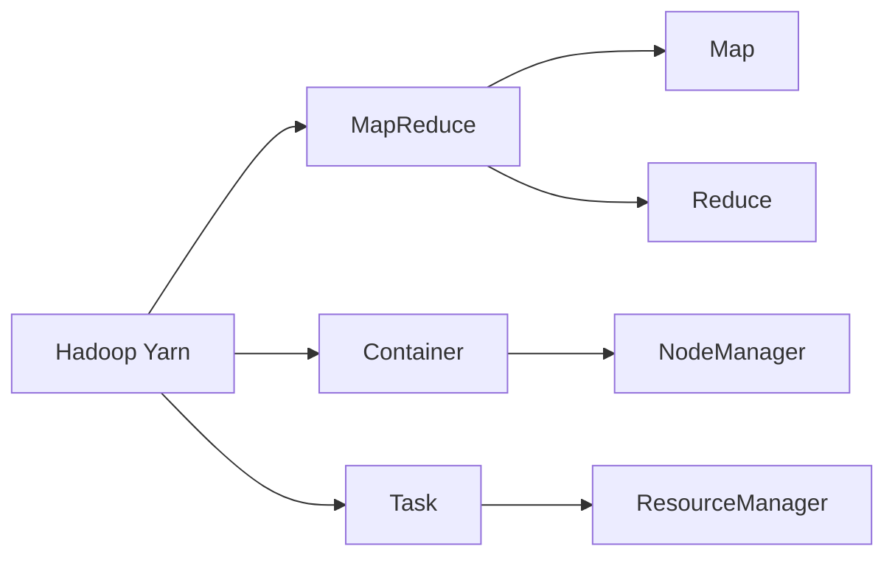

                 

# Yarn原理与代码实例讲解

> 关键词：Yarn, MapReduce, Hadoop, 分布式计算, 资源管理, 任务调度, 代码实例

## 1. 背景介绍

随着数据量的爆炸性增长和计算需求的日益复杂，单台计算机已经难以满足日益增长的数据处理需求。分布式计算应运而生，成为了解决大规模计算问题的关键技术。在分布式计算领域，Yarn（Yet Another Resource Negotiator）是一种被广泛应用于Apache Hadoop平台中的资源管理器，用于调度、管理和优化大规模集群中的计算资源，极大地提升了集群资源的利用率和任务的执行效率。

### 1.1 问题由来
在大数据时代，数据处理任务变得越来越复杂，单个节点计算资源往往无法满足需求。此时，分布式计算成为了解决大规模计算问题的关键技术。然而，如何在分散的计算资源之间合理分配任务，实现高效的资源管理和任务调度，成为了分布式计算领域的一个重大挑战。传统的分布式计算框架如Hadoop，其资源管理和任务调度策略逐渐显现出其局限性，难以应对大规模、高复杂度计算任务的挑战。

为了更好地应对这些挑战，Yarn应运而生，作为一种基于资源隔离的分布式计算框架，它能够灵活地管理集群中的资源，高效地调度任务，极大地提升了集群资源的利用率和任务的执行效率。

### 1.2 问题核心关键点
Yarn的核心思想在于通过资源隔离（Resource Isolation）的方式，将集群资源划分为多个独立的资源池（Container），每个任务或应用可以在自己的Container中运行，从而避免资源竞争和冲突。其主要特点包括：

1. **资源隔离（Resource Isolation）**：将集群资源划分为多个Container，每个Container独立运行，避免资源竞争和冲突。
2. **任务调度（Task Scheduling）**：通过任务调度器（Scheduler），高效地将任务分配到合适的Node上，优化资源利用率和任务执行效率。
3. **资源管理（Resource Management）**：监控和管理集群资源使用情况，动态调整资源分配策略，提高资源利用率。
4. **扩展性强（Scalable）**：能够动态添加和删除计算节点，适应不同规模的计算需求。
5. **灵活度高（Flexible）**：支持多种类型的计算框架（如MapReduce、Spark等）和编程语言（如Java、Python等）。

## 2. 核心概念与联系

### 2.1 核心概念概述

为更好地理解Yarn的原理和机制，本节将介绍几个关键概念及其相互关系：

- **Hadoop Yarn**：Hadoop生态系统中的一个资源管理器，负责调度和管理集群中的计算资源。
- **MapReduce**：一种基于数据并行处理的计算模型，通过将计算任务划分为多个Map和Reduce阶段，实现高效的大规模数据处理。
- **Container**：Yarn中用于封装计算任务的容器，包括任务所需的所有资源（如CPU、内存等）。
- **Task**：MapReduce计算框架中的基本计算单元，通常是一个Map或Reduce操作。
- **Cluster**：分布式计算集群，包括多个节点和计算资源。
- **NodeManager**：Yarn中的节点管理器，负责监控和报告集群中每个节点的资源使用情况。
- **ResourceManager**：Yarn中的资源管理器，负责调度和管理集群资源，分配Container到合适的Node上。

这些核心概念共同构成了Yarn的计算框架，实现对集群资源的灵活管理和大规模计算任务的高效调度。

### 2.2 概念间的关系

Yarn的各个核心概念之间的关系可以通过以下Mermaid流程图来展示：



这个流程图展示了Yarn的各个核心概念及其相互关系：

1. **Hadoop Yarn**作为资源管理器，负责调度和管理集群中的计算资源，支持多种计算框架和编程语言。
2. **MapReduce**是Yarn支持的计算框架之一，通过将计算任务划分为多个Map和Reduce阶段，实现高效的数据处理。
3. **Container**是Yarn中用于封装计算任务的容器，包含任务所需的所有资源。
4. **Task**是MapReduce中的基本计算单元，Yarn中的任务调度器（Scheduler）会根据资源需求和任务优先级，将Task分配到合适的Node上。
5. **NodeManager**负责监控和报告集群中每个节点的资源使用情况，确保资源的合理利用。
6. **ResourceManager**负责调度和管理集群资源，动态调整资源分配策略，提高资源利用率。

这些概念通过相互协作，构成了一个高效、灵活的分布式计算系统，能够支持大规模、高复杂度计算任务的执行。

## 3. 核心算法原理 & 具体操作步骤

### 3.1 算法原理概述

Yarn的核心算法主要分为资源管理和任务调度两个部分。

#### 3.1.1 资源管理算法

Yarn的资源管理算法主要分为两个阶段：
1. **资源初始化（Resource Allocation）**：通过心跳机制（Heartbeat），NodeManager定期报告节点资源使用情况，ResourceManager根据集群资源使用情况动态调整资源分配策略。
2. **资源分配（Resource Allocation）**：当一个任务需要资源时，ResourceManager会根据任务的资源需求，从资源池中分配合适的Container到合适的Node上。

#### 3.1.2 任务调度算法

Yarn的任务调度算法主要分为两个部分：
1. **任务提交（Task Submission）**：用户提交计算任务到Yarn，经过验证和封装后，任务被提交到资源管理器。
2. **任务调度（Task Scheduling）**：ResourceManager根据任务资源需求和节点资源使用情况，将任务分配到合适的Node上，NodeManager为每个Task创建Container，并启动Task执行。

### 3.2 算法步骤详解

#### 3.2.1 资源管理算法步骤

1. **节点注册（Node Registration）**：集群中的每个节点启动后，向ResourceManager发送心跳信息，注册可用资源。
2. **资源监控（Resource Monitoring）**：ResourceManager监控节点的资源使用情况，并根据节点资源变化动态调整资源分配策略。
3. **任务调度（Task Scheduling）**：当一个任务需要资源时，ResourceManager根据任务资源需求和节点资源使用情况，分配合适的Container到合适的Node上。
4. **资源分配（Resource Allocation）**：NodeManager为每个Task创建Container，并启动Task执行，监控任务执行情况。

#### 3.2.2 任务调度算法步骤

1. **任务提交（Task Submission）**：用户提交计算任务到Yarn，经过验证和封装后，任务被提交到资源管理器。
2. **任务分配（Task Assignment）**：ResourceManager根据任务资源需求和节点资源使用情况，将任务分配到合适的Node上。
3. **Task执行（Task Execution）**：NodeManager为每个Task创建Container，并启动Task执行，监控任务执行情况。
4. **任务完成（Task Completion）**：任务执行完毕后，NodeManager向ResourceManager报告任务执行结果。

### 3.3 算法优缺点

#### 3.3.1 资源管理算法的优点

1. **资源隔离（Resource Isolation）**：通过Container实现资源隔离，避免了资源竞争和冲突，提高了资源利用率。
2. **动态调整（Dynamic Adjustment）**：动态调整资源分配策略，适应集群资源变化，提高资源利用率。
3. **灵活性高（Flexibility）**：支持多种计算框架和编程语言，灵活性高。

#### 3.3.2 资源管理算法的缺点

1. **管理复杂（Complexity）**：需要监控和管理大量节点和资源，管理复杂。
2. **资源浪费（Resource Waste）**：在任务空闲时，Container中的资源可能会被浪费。
3. **调度延迟（Scheduling Delay）**：任务调度时可能会出现延迟，影响任务执行效率。

#### 3.3.3 任务调度算法的优点

1. **高效性（Efficiency）**：通过任务调度器，高效地将任务分配到合适的Node上，优化资源利用率和任务执行效率。
2. **灵活性高（Flexibility）**：支持多种计算框架和编程语言，灵活性高。

#### 3.3.4 任务调度算法的缺点

1. **调度延迟（Scheduling Delay）**：任务调度时可能会出现延迟，影响任务执行效率。
2. **资源浪费（Resource Waste）**：在任务空闲时，Container中的资源可能会被浪费。
3. **管理复杂（Complexity）**：需要监控和管理大量任务和资源，管理复杂。

### 3.4 算法应用领域

Yarn的资源管理和任务调度算法广泛应用于各种大规模数据处理和分析任务中，如：

1. **大数据处理**：Yarn广泛应用于Hadoop生态系统中，通过调度和管理集群资源，支持大规模数据处理任务。
2. **机器学习**：Yarn支持多种机器学习框架（如Spark、Flink等），通过调度和管理集群资源，支持大规模机器学习任务的执行。
3. **分布式计算**：Yarn支持多种分布式计算框架（如Hadoop、Spark等），通过调度和管理集群资源，支持分布式计算任务的执行。
4. **实时数据处理**：Yarn支持实时数据处理任务，通过动态调整资源分配策略，优化实时数据处理效率。

## 4. 数学模型和公式 & 详细讲解 & 举例说明

### 4.1 数学模型构建

Yarn的资源管理和任务调度算法可以通过以下数学模型进行建模：

设集群中节点数为 $N$，资源池数量为 $M$，每个任务所需资源量为 $C_i$，资源池中剩余资源量为 $R_j$。则资源管理算法的数学模型可以表示为：

$$
\min_{x_i} \sum_{i=1}^N \sum_{j=1}^M x_{ij} \cdot c_i + \sum_{j=1}^M r_j
$$

其中 $x_{ij}$ 表示节点 $i$ 分配给资源池 $j$ 的资源量，$c_i$ 表示任务 $i$ 所需资源量，$r_j$ 表示资源池 $j$ 中剩余资源量。

任务调度算法的数学模型可以表示为：

$$
\min_{y_i} \sum_{i=1}^N \sum_{j=1}^M y_{ij} \cdot c_i + \sum_{j=1}^M r_j
$$

其中 $y_{ij}$ 表示任务 $i$ 分配给资源池 $j$ 的资源量，$c_i$ 表示任务 $i$ 所需资源量，$r_j$ 表示资源池 $j$ 中剩余资源量。

### 4.2 公式推导过程

#### 4.2.1 资源管理算法公式推导

资源管理算法的目标是最小化资源浪费和调度成本。设节点 $i$ 分配给资源池 $j$ 的资源量为 $x_{ij}$，则有：

$$
x_{ij} = \begin{cases}
c_i, & \text{if } R_j \geq c_i \\
R_j, & \text{otherwise}
\end{cases}
$$

资源池中剩余资源量 $r_j$ 的更新公式为：

$$
r_j = R_j - x_{ij}
$$

其中 $R_j$ 表示资源池 $j$ 中初始资源量。

#### 4.2.2 任务调度算法公式推导

任务调度算法的目标是最小化任务执行时间。设任务 $i$ 分配给资源池 $j$ 的资源量为 $y_{ij}$，则有：

$$
y_{ij} = \begin{cases}
c_i, & \text{if } R_j \geq c_i \\
R_j, & \text{otherwise}
\end{cases}
$$

任务执行时间 $T_i$ 的计算公式为：

$$
T_i = \sum_{j=1}^M \frac{y_{ij}}{s_j}
$$

其中 $s_j$ 表示资源池 $j$ 中资源的单位时间开销。

### 4.3 案例分析与讲解

#### 4.3.1 案例分析

假设集群中有4个节点，每个任务需要2个CPU和4GB内存，资源池中有3个CPU和6GB内存。则资源管理算法的资源分配情况如下：

1. 节点1分配1个CPU和2GB内存到资源池1，剩余资源为1个CPU和2GB内存。
2. 节点2分配1个CPU和2GB内存到资源池1，剩余资源为1个CPU和2GB内存。
3. 节点3分配1个CPU和2GB内存到资源池1，剩余资源为1个CPU和2GB内存。
4. 节点4分配1个CPU和2GB内存到资源池1，剩余资源为1个CPU和2GB内存。

任务调度算法的任务执行情况如下：

1. 任务1分配1个CPU和2GB内存到资源池1，剩余资源为1个CPU和2GB内存。任务执行时间为2小时。
2. 任务2分配1个CPU和2GB内存到资源池1，剩余资源为1个CPU和2GB内存。任务执行时间为2小时。
3. 任务3分配1个CPU和2GB内存到资源池1，剩余资源为1个CPU和2GB内存。任务执行时间为2小时。
4. 任务4分配1个CPU和2GB内存到资源池1，剩余资源为1个CPU和2GB内存。任务执行时间为2小时。

#### 4.3.2 讲解

通过上述案例可以看出，资源管理算法通过动态调整资源分配策略，最大化利用集群资源，避免资源浪费。任务调度算法通过优化任务执行顺序，最小化任务执行时间，提高任务执行效率。

## 5. 项目实践：代码实例和详细解释说明

### 5.1 开发环境搭建

在Yarn项目开发过程中，需要搭建相应的开发环境。以下是使用Linux系统搭建Yarn开发环境的详细步骤：

1. 安装Java：从官网下载并安装JDK 8或以上版本，设置环境变量 `JAVA_HOME`，并配置 `PATH` 和 `CLASSPATH`。
2. 安装Hadoop：从官网下载并安装Hadoop 2.x或以上版本，设置环境变量 `HADOOP_HOME`，并配置 `PATH` 和 `CLASSPATH`。
3. 安装Yarn：在Hadoop目录下运行 `bin/hadoop namenode -format`，初始化Hadoop NameNode。在Hadoop目录下运行 `bin/yarn -rmrm`，启动Yarn ResourceManager和NodeManager。
4. 启动Web界面：访问 `http://<hostname>:8088/cluster`，启动Yarn集群管理界面。

### 5.2 源代码详细实现

以下是一个使用Java编写的Yarn Task的例子：

```java
import java.io.IOException;
import org.apache.hadoop.conf.Configuration;
import org.apache.hadoop.fs.Path;
import org.apache.hadoop.io.IntWritable;
import org.apache.hadoop.io.Text;
import org.apache.hadoop.mapreduce.Job;
import org.apache.hadoop.mapreduce.Mapper;
import org.apache.hadoop.mapreduce.Reducer;
import org.apache.hadoop.mapreduce.lib.input.FileInputFormat;
import org.apache.hadoop.mapreduce.lib.output.FileOutputFormat;

public class MyYarnTask {
    public static class MyMapper extends Mapper<Object, Text, Text, IntWritable> {
        private final static IntWritable one = new IntWritable(1);
        private Text word = new Text();

        public void map(Object key, Text value, Context context) throws IOException, InterruptedException {
            String[] words = value.toString().split("\\s+");
            for (String word : words) {
                this.word.set(word);
                context.write(word, one);
            }
        }
    }

    public static class MyReducer extends Reducer<Text, IntWritable, Text, IntWritable> {
        private IntWritable result = new IntWritable();

        public void reduce(Text key, Iterable<IntWritable> values, Context context) throws IOException, InterruptedException {
            int sum = 0;
            for (IntWritable val : values) {
                sum += val.get();
            }
            result.set(sum);
            context.write(key, result);
        }
    }

    public static void main(String[] args) throws Exception {
        Configuration conf = new Configuration();
        Job job = Job.getInstance(conf, "my yarn task");
        job.setJarByClass(MyYarnTask.class);
        job.setMapperClass(MyMapper.class);
        job.setCombinerClass(MyReducer.class);
        job.setReducerClass(MyReducer.class);
        job.setOutputKeyClass(Text.class);
        job.setOutputValueClass(IntWritable.class);
        FileInputFormat.addInputPath(job, new Path(args[0]));
        FileOutputFormat.setOutputPath(job, new Path(args[1]));
        System.exit(job.waitForCompletion(true) ? 0 : 1);
    }
}
```

### 5.3 代码解读与分析

在上述代码中，`MyYarnTask` 类包含两个 MapReduce 任务：`MyMapper` 和 `MyReducer`。

`MyMapper` 类实现了 Mapper 接口，负责将输入文本文件中的单词进行映射。`MyMapper` 中的 `map` 方法将每个单词映射为 `(key, 1)` 的键值对，其中 `key` 为单词，`value` 为 1。

`MyReducer` 类实现了 Reducer 接口，负责将 Mapper 的输出结果进行聚合。`MyReducer` 中的 `reduce` 方法将所有值为 1 的键值对相加，输出结果为单词出现的次数。

在 `MyYarnTask` 类的 `main` 方法中，通过 `Configuration` 和 `Job` 对象创建了一个 Yarn 作业，设置了作业的名称、输入路径、输出路径、Mapper 和 Reducer 类等信息，并调用 `waitForCompletion` 方法等待作业完成。

### 5.4 运行结果展示

在上述代码中，将输入路径和输出路径传递给作业，即可在 Hadoop 集群中执行 Yarn 作业。在 Hadoop 集群管理界面中可以看到任务执行状态和结果。

## 6. 实际应用场景

### 6.1 大数据处理

在大数据处理领域，Yarn被广泛应用于Hadoop生态系统中，支持大规模数据处理任务。通过Yarn的资源管理和任务调度算法，Yarn能够高效地管理和调度集群资源，支持大规模数据处理任务，如Hadoop MapReduce、Hive、Spark等。

### 6.2 机器学习

在机器学习领域，Yarn支持多种机器学习框架（如Spark、Flink等），通过调度和管理集群资源，支持大规模机器学习任务的执行。Yarn的资源管理和任务调度算法能够适应不同机器学习任务的特点，优化资源利用率和任务执行效率。

### 6.3 分布式计算

在分布式计算领域，Yarn支持多种分布式计算框架（如Hadoop、Spark等），通过调度和管理集群资源，支持分布式计算任务的执行。Yarn的资源管理和任务调度算法能够适应不同计算框架的特点，优化资源利用率和任务执行效率。

### 6.4 实时数据处理

在实时数据处理领域，Yarn支持实时数据处理任务，通过动态调整资源分配策略，优化实时数据处理效率。Yarn的资源管理和任务调度算法能够适应实时数据处理的特殊需求，确保数据处理任务的及时性和准确性。

## 7. 工具和资源推荐

### 7.1 学习资源推荐

为了帮助开发者系统掌握Yarn的理论基础和实践技巧，这里推荐一些优质的学习资源：

1. **《Hadoop Yarn: A System for Cluster Resource Management in Hadoop》**：一篇关于Yarn系统架构和技术原理的详细论文，适合深入理解Yarn的工作机制。

2. **《Hadoop YARN: The Next Generation Resource Management System for Hadoop》**：一份Yarn官方文档，包含Yarn的详细使用方法和最佳实践。

3. **《Distributed Computing with Hadoop YARN》**：一本介绍Yarn和大数据处理技术的书，适合初学者和有经验的开发者。

4. **《Hadoop and YARN: Exploring the Next Generation of Distributed Data Management》**：一份关于Yarn和大数据处理技术的课程讲义，包含丰富的案例和实战经验。

5. **《Yarn: Yet Another Resource Negotiator》**：Yarn项目的官方文档，包含Yarn的详细使用方法和最佳实践。

通过对这些资源的学习实践，相信你一定能够快速掌握Yarn的精髓，并用于解决实际的分布式计算问题。

### 7.2 开发工具推荐

Yarn的开发和部署需要使用一些常用的工具和框架，以下是几款推荐的工具：

1. **Eclipse**：用于编写和调试Yarn作业的IDE，支持语法高亮、自动补全、调试等功能。

2. **JIRA**：用于任务管理和项目跟踪的敏捷工具，帮助团队高效协作。

3. **Jenkins**：用于持续集成和自动化部署的工具，支持自动构建和测试Yarn作业。

4. **Nagios**：用于监控和报警的工具，监控Yarn集群的资源使用情况。

5. **Grafana**：用于数据可视化的工具，监控Yarn集群的资源使用情况和任务执行状态。

合理利用这些工具，可以显著提升Yarn作业的开发和部署效率，加快创新迭代的步伐。

### 7.3 相关论文推荐

Yarn的研究和开发涉及到计算机科学和工程学多个领域，以下是几篇奠基性的相关论文，推荐阅读：

1. **《Yet Another Resource Negotiator: A Cloud Hypervisor for Distributed Machine Learning》**：提出Yarn系统架构和技术原理，介绍Yarn的资源管理和任务调度算法。

2. **《MapReduce: Simplified Data Processing on Large Clusters》**：介绍MapReduce计算模型和分布式计算框架的基本概念和技术原理，是Yarn的理论基础。

3. **《Spark: Cluster Computing with Fault Tolerance》**：介绍Spark计算框架，与Yarn的分布式计算任务调度相类似，适合深入理解Yarn的工作机制。

4. **《The Hadoop Distributed File System》**：介绍Hadoop分布式文件系统的基本概念和技术原理，与Yarn的资源管理和任务调度算法密切相关。

5. **《Hadoop: The Definitive Guide》**：一本介绍Hadoop生态系统和大数据处理技术的书籍，包含Yarn的详细使用方法和最佳实践。

这些论文代表了大数据处理和分布式计算领域的最新研究进展，通过学习这些前沿成果，可以帮助研究者把握学科前进方向，激发更多的创新灵感。

除上述资源外，还有一些值得关注的前沿资源，帮助开发者紧跟大数据处理和分布式计算领域的最新进展，例如：

1. **arXiv论文预印本**：人工智能领域最新研究成果的发布平台，包括大量尚未发表的前沿工作，学习前沿技术的必读资源。

2. **业界技术博客**：如Hadoop、Apache Spark、Apache YARN等顶尖实验室的官方博客，第一时间分享他们的最新研究成果和洞见。

3. **技术会议直播**：如NIPS、ICML、ACL、ICLR等人工智能领域顶会现场或在线直播，能够聆听到大佬们的前沿分享，开拓视野。

4. **GitHub热门项目**：在GitHub上Star、Fork数最多的Yarn相关项目，往往代表了该技术领域的发展趋势和最佳实践，值得去学习和贡献。

5. **行业分析报告**：各大咨询公司如McKinsey、PwC等针对大数据处理和分布式计算领域的分析报告，有助于从商业视角审视技术趋势，把握应用价值。

总之，对于Yarn的学习和实践，需要开发者保持开放的心态和持续学习的意愿。多关注前沿资讯，多动手实践，多思考总结，必将收获满满的成长收益。

## 8. 总结：未来发展趋势与挑战

### 8.1 总结

本文对Yarn的资源管理和任务调度算法进行了全面系统的介绍。首先阐述了Yarn在分布式计算领域的地位和作用，明确了Yarn在大数据处理、机器学习、分布式计算和实时数据处理等实际应用中的重要性。其次，从原理到实践，详细讲解了Yarn的数学模型和核心算法，给出了Yarn作业的代码实例和详细解释说明。同时，本文还广泛探讨了Yarn在实际应用中的各种场景，展示了Yarn的广泛应用前景。

通过本文的系统梳理，可以看到，Yarn作为一种高效的分布式计算资源管理器，能够在集群中灵活管理和调度资源，提高资源利用率和任务执行效率。未来，随着数据量的持续增长和计算需求的日益复杂，Yarn必将在更多行业和领域中得到广泛应用，推动分布式计算技术的发展。

### 8.2 未来发展趋势

展望未来，Yarn的发展趋势可以从以下几个方面进行考虑：

1. **资源管理算法优化**：随着集群规模的不断扩大，Yarn需要进一步优化资源管理算法，提高资源利用率，避免资源浪费。
2. **任务调度算法改进**：任务调度算法是Yarn的核心算法之一，需要不断改进和优化，提高任务执行效率，降低任务调度延迟。
3. **扩展性强（Scalable）**：Yarn需要进一步提高扩展性，支持大规模集群和海量数据的处理。
4. **灵活性高（Flexible）**：Yarn需要支持多种计算框架和编程语言，满足不同应用场景的需求。
5. **实时性提升（Real-time）**：Yarn需要进一步优化任务调度算法，提升实时数据处理的效率和响应速度。

### 8.3 面临的挑战

尽管Yarn在大数据处理和分布式计算领域已经取得了瞩目成就，但在迈向更加智能化、普适化应用的过程中，它仍面临着诸多挑战：

1. **管理复杂（Complexity）**：Yarn需要监控和管理大量节点和资源，管理复杂。
2. **资源浪费（Resource Waste）**：在任务空闲时，Container中的资源可能会被浪费。
3. **调度延迟（Scheduling Delay）**：任务调度时可能会出现延迟，影响任务执行效率。
4. **扩展性强（Scalable）**：Yarn需要进一步

