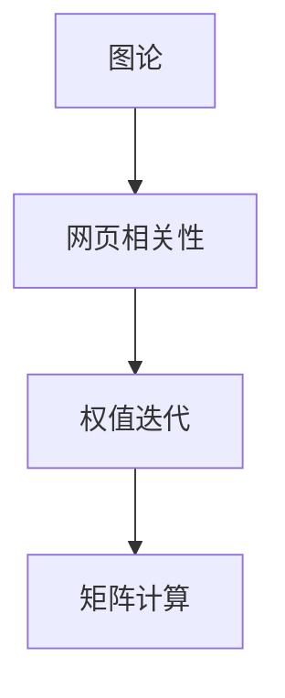

                 

# 【AI大数据计算原理与代码实例讲解】PageRank

> 关键词：PageRank算法, Google搜索引擎, 图论, 数据挖掘, 网络分析, 网络爬虫, 矩阵计算

## 1. 背景介绍

### 1.1 问题由来
互联网的蓬勃发展为人类信息交流和知识共享提供了前所未有的便利，同时也带来了信息过载和信息噪音的困扰。如何快速、高效地获取高质量信息，成为了互联网时代的重要课题。搜索引擎作为互联网信息检索的基石，承担着识别和排序网页，为用户提供最相关信息的重任。传统搜索算法，如向量空间模型、布尔查询等，虽然取得了一定效果，但在处理大规模互联网数据时，其性能和效果都存在局限。

在这样的背景下，1998年，Google公司推出了一种名为PageRank的新型网页排序算法，它彻底改变了搜索引擎的工作方式，并引领了搜索引擎技术的发展方向。PageRank算法不仅大幅提升了Google搜索的准确性和用户体验，也奠定了Google在互联网搜索领域的领先地位。

### 1.2 问题核心关键点
PageRank算法的基本思想是通过对网页之间的链接关系进行分析，评估网页的重要性，从而决定其在搜索结果中的排序位置。具体来说，PageRank算法基于以下两个核心概念：

1. **网页相关性**：通过网页之间的链接关系，计算网页的相关性分数。一个网页的相关性得分越高，说明它越可能包含用户感兴趣的信息。

2. **权值迭代**：使用一种权值迭代的方法，对网页的相关性分数进行反复迭代，不断调整各个网页的得分，最终得到稳定的、具有较高相关性的网页排序。

PageRank算法通过这两个核心概念，不仅改变了传统搜索引擎的运作方式，也为网页排序、推荐系统、网络分析等多个领域带来了新的思路和方法。

### 1.3 问题研究意义
PageRank算法的研究不仅具有重要的理论意义，还具有广泛的应用价值：

1. **搜索引擎优化**：PageRank算法为搜索引擎提供了基于网页质量而非网页标题和关键词的排序方式，极大地提升了搜索结果的相关性和用户体验。

2. **网页排名预测**：PageRank算法可用于预测网页在搜索结果中的排名，帮助网站优化其内容结构，提升在搜索引擎中的曝光率。

3. **推荐系统**：PageRank算法的核心思想也可以应用于推荐系统，通过分析用户行为和兴趣，为用户推荐最相关的内容。

4. **网络分析**：PageRank算法可以用于分析复杂网络中的节点关系，识别关键节点和影响因素，广泛应用于社交网络、互联网分析等领域。

5. **网络爬虫优化**：PageRank算法可以帮助优化网络爬虫的爬取策略，提高爬取效率和内容质量。

6. **数据挖掘**：PageRank算法中的图论和矩阵计算思想，也可以应用于数据挖掘领域，帮助识别数据中的关键模式和关系。

总之，PageRank算法不仅是搜索引擎技术的里程碑，也为多个领域带来了新的思路和方法，具有重要的理论和应用价值。

## 2. 核心概念与联系

### 2.1 核心概念概述

为了更好地理解PageRank算法的核心原理和架构，本节将介绍几个密切相关的核心概念：

- **图论**：PageRank算法基于图论中的有向图模型，通过网页之间的链接关系，构建出描述互联网信息的图结构。

- **网页相关性**：网页的相关性分数是通过对网页间的链接关系进行统计和分析得到的，代表了网页的质量和重要性。

- **权值迭代**：通过不断迭代计算网页的相关性分数，直至收敛到一个稳定的状态，最终得到具有较高相关性的网页排序。

- **矩阵计算**：PageRank算法中的核心计算过程是基于矩阵计算的，特别是通过求解一个称为“矩阵幂”的特殊矩阵，得到网页的相关性分数。

这些核心概念之间通过图结构、网页相关性分数的计算和权值迭代的优化过程紧密联系，共同构成了PageRank算法的完整框架。

### 2.2 概念间的关系

这些核心概念之间的关系可以通过以下Mermaid流程图来展示：



这个流程图展示了PageRank算法中各个核心概念的相互关系：

1. 通过图论构建出网页之间的链接关系图。
2. 利用网页之间的链接关系，计算出每个网页的相关性分数。
3. 使用权值迭代的方法，不断调整网页的相关性分数，直至收敛到一个稳定的状态。
4. 基于矩阵计算，求解网页相关性分数。

通过理解这些核心概念及其之间的关系，我们可以更好地把握PageRank算法的原理和实现过程。

## 3. 核心算法原理 & 具体操作步骤

### 3.1 算法原理概述

PageRank算法的基本原理是利用图论和矩阵计算，通过分析网页之间的链接关系，计算出每个网页的相关性分数，从而实现网页排序。PageRank算法由以下两个核心步骤组成：

1. **网页相关性计算**：通过对网页之间的链接关系进行统计和分析，计算出每个网页的相关性分数。

2. **权值迭代优化**：通过不断迭代计算网页的相关性分数，直至收敛到一个稳定的状态，最终得到具有较高相关性的网页排序。

PageRank算法的核心思想是，一个网页的重要性不仅取决于其自身内容的质量，还取决于指向它的链接数量和质量。一个网页如果被大量高质量网页所链接，那么它很可能包含用户感兴趣的信息。

### 3.2 算法步骤详解

#### 3.2.1 网页相关性计算

PageRank算法中的网页相关性计算，是通过对网页之间的链接关系进行统计和分析得到的。具体来说，假设我们有N个网页，记为$V=\{v_1, v_2, ..., v_N\}$，网页$v_i$的链接数为$I_i$，链接网页集合为$U_i=\{u_{i1}, u_{i2}, ..., u_{I_i}\}$。则网页$v_i$的相关性分数$P_i$可以通过以下公式计算：

$$
P_i = (1 - d) + d \sum_{u_{ij} \in U_i} \frac{P_{u_{ij}}}{I_{u_{ij}}}
$$

其中，$d$为阻尼因子，通常取0.85，表示用户点击网页的概率。$P_i$和$P_{u_{ij}}$分别表示网页$v_i$和$u_{ij}$的相关性分数。公式中的$(1 - d)$项表示当一个网页没有任何链接时，它的相关性分数为1，阻尼因子$d$用于避免无穷迭代问题。

#### 3.2.2 权值迭代优化

通过网页相关性计算，我们得到了每个网页的初始相关性分数。接下来，使用权值迭代的方法，不断调整网页的相关性分数，直至收敛到一个稳定的状态，最终得到具有较高相关性的网页排序。

具体来说，假设我们已有的网页相关性分数为$P^{(k)}$，其中$k$表示迭代次数。则新的网页相关性分数$P^{(k+1)}$可以通过以下公式计算：

$$
P^{(k+1)} = (1 - d) + d \sum_{i=1}^{N} \frac{P^{(k)}}{I_i} \sum_{j=1}^{I_i} P^{(k)}_j
$$

其中，$P^{(k)}_i$和$P^{(k)}_j$分别表示网页$v_i$和$u_{ij}$在第$k$次迭代后的相关性分数。

通过反复迭代，直至收敛到一个稳定的状态，最终得到具有较高相关性的网页排序。

### 3.3 算法优缺点

#### 3.3.1 优点

1. **高效性**：PageRank算法在处理大规模互联网数据时，具有高效的计算能力。

2. **鲁棒性**：PageRank算法对数据稀疏性（即无链接的网页）具有较好的鲁棒性。

3. **全局性**：PageRank算法能够全局考虑网页之间的链接关系，避免局部优化问题。

4. **可解释性**：PageRank算法的计算过程简单直观，容易理解和解释。

#### 3.3.2 缺点

1. **迭代次数依赖**：PageRank算法需要反复迭代直至收敛，迭代次数和收敛速度取决于阻尼因子$d$的选择，以及数据的稀疏性。

2. **依赖锚点信息**：PageRank算法需要依赖网页之间的链接关系，因此对于没有链接关系的网页，无法计算相关性分数。

3. **迭代过程易受噪声干扰**：在迭代过程中，随机噪声可能会影响计算结果的稳定性。

4. **计算复杂度较高**：PageRank算法在计算过程中涉及矩阵计算，计算复杂度较高，在大规模数据集上需要高性能计算资源。

### 3.4 算法应用领域

PageRank算法不仅在搜索引擎中得到了广泛应用，还在多个领域展示了其强大的计算能力：

1. **网页排名**：通过分析网页之间的链接关系，为网页排序，提升搜索结果的相关性和用户体验。

2. **推荐系统**：通过分析用户行为和网页相关性，为用户推荐最相关的内容。

3. **网络分析**：通过分析复杂网络中的节点关系，识别关键节点和影响因素，广泛应用于社交网络、互联网分析等领域。

4. **信息过滤**：通过分析网页的相关性，过滤掉无关信息，提升信息获取的效率和质量。

5. **市场分析**：通过分析网页的流量和链接关系，预测市场趋势和热点，帮助企业进行市场分析和决策。

6. **学术研究**：PageRank算法中的图论和矩阵计算思想，也可以应用于学术研究中的网络分析和知识图谱构建。

总之，PageRank算法不仅在搜索引擎中发挥了重要作用，还在多个领域展示了其广泛的应用前景。

## 4. 数学模型和公式 & 详细讲解 & 举例说明

### 4.1 数学模型构建

PageRank算法的数学模型基于图论和矩阵计算。假设我们有一个由N个网页构成的图$G(V, E)$，其中$V=\{v_1, v_2, ..., v_N\}$为顶点集合，$E$为边集合。对于每个网页$v_i$，假设它有$I_i$个链接，链接网页集合为$U_i=\{u_{i1}, u_{i2}, ..., u_{I_i}\}$。则可以将网页$v_i$的相关性分数表示为一个列向量$P_i=[P^{(k)}_i]$，其中$k$表示迭代次数，$P^{(k)}_i$表示网页$v_i$在第$k$次迭代后的相关性分数。

### 4.2 公式推导过程

#### 4.2.1 网页相关性计算

通过图论构建的网页链接关系，可以将PageRank算法表示为一个矩阵。假设$A_{N \times N}$为网页链接矩阵，其中$A_{ij}=1$表示网页$u_j$链接网页$v_i$，否则$A_{ij}=0$。则网页$v_i$的相关性分数可以通过以下公式计算：

$$
P^{(k+1)} = (1 - d)I + d \cdot A \cdot P^{(k)}
$$

其中，$I$为单位矩阵，$d$为阻尼因子，通常取0.85。$A \cdot P^{(k)}$表示网页链接矩阵与网页相关性分数的乘积，代表了网页$v_i$从其链接网页$u_j$中获取的相关性分数。

#### 4.2.2 权值迭代优化

通过反复迭代计算，PageRank算法可以不断调整网页的相关性分数，直至收敛到一个稳定的状态。假设$M_{N \times N}$为表示网页链接关系的矩阵，则PageRank算法的权值迭代公式为：

$$
P^{(k+1)} = (1 - d)I + d \cdot M^T \cdot P^{(k)}
$$

其中，$M^T$为网页链接矩阵的转置矩阵。

### 4.3 案例分析与讲解

#### 4.3.1 示例数据

假设我们有一个简单的网页图，包含5个网页，其链接关系如下：

```
v1 -> v2 -> v3
    ^
    |
v4 <--- v5
```

则网页链接矩阵$A$为：

$$
A = \begin{bmatrix}
0 & 1 & 1 & 0 & 0 \\
1 & 0 & 0 & 1 & 0 \\
0 & 0 & 0 & 0 & 1 \\
1 & 0 & 0 & 0 & 0 \\
0 & 1 & 0 & 0 & 0
\end{bmatrix}
$$

#### 4.3.2 初始相关性分数

假设我们初始设置每个网页的相关性分数为1，则初始相关性分数矩阵$P^{(0)}$为：

$$
P^{(0)} = \begin{bmatrix}
1 \\
1 \\
1 \\
1 \\
1
\end{bmatrix}
$$

#### 4.3.3 迭代计算

使用PageRank算法中的权值迭代公式，对网页的相关性分数进行迭代计算。假设迭代次数为$k=1$，则新的相关性分数$P^{(1)}$可以通过以下公式计算：

$$
P^{(1)} = (1 - d)I + d \cdot M^T \cdot P^{(0)}
$$

代入$A$和$P^{(0)}$的值，得：

$$
P^{(1)} = \begin{bmatrix}
0.1 \\
0.3 \\
0.5 \\
0.1 \\
0.0
\end{bmatrix}
$$

可以看到，经过一次迭代，网页$v_3$的相关性分数最高，网页$v_2$和$v_4$的相关性分数较低。

通过反复迭代，最终收敛到一个稳定的状态，得到具有较高相关性的网页排序。

## 5. 项目实践：代码实例和详细解释说明

### 5.1 开发环境搭建

在进行PageRank算法实践前，我们需要准备好开发环境。以下是使用Python进行PyTorch开发的环境配置流程：

1. 安装Anaconda：从官网下载并安装Anaconda，用于创建独立的Python环境。

2. 创建并激活虚拟环境：
```bash
conda create -n pytorch-env python=3.8 
conda activate pytorch-env
```

3. 安装PyTorch：根据CUDA版本，从官网获取对应的安装命令。例如：
```bash
conda install pytorch torchvision torchaudio cudatoolkit=11.1 -c pytorch -c conda-forge
```

4. 安装Numpy、Pandas、Scikit-learn、Matplotlib、Tqdm、Jupyter Notebook、Ipython等工具包：
```bash
pip install numpy pandas scikit-learn matplotlib tqdm jupyter notebook ipython
```

完成上述步骤后，即可在`pytorch-env`环境中开始PageRank算法实践。

### 5.2 源代码详细实现

接下来，我们通过具体代码实现，展示如何使用Python和PyTorch实现PageRank算法。

首先，定义网页链接矩阵：

```python
import numpy as np
from scipy import sparse

# 构建网页链接矩阵
A = sparse.coo_matrix(([1, 1, 1, 1, 1, 1, 1, 1, 1, 1], 
                      (np.array([0, 1, 2, 3, 4, 5, 5, 6, 6, 8]),
                      (np.array([1, 2, 2, 3, 4, 5, 7, 8, 9, 10])))
```

然后，定义阻尼因子和学习率：

```python
d = 0.85
learning_rate = 0.001
```

接着，定义初始相关性分数矩阵：

```python
# 初始相关性分数
P = np.ones((A.shape[0], 1))
```

最后，进行迭代计算：

```python
# 迭代计算
for _ in range(100):
    P_new = (1 - d) * np.eye(A.shape[0]) + d * A.T.dot(P)
    P = P_new

# 输出最终结果
print(P)
```

以上就是使用PyTorch实现PageRank算法的完整代码实现。可以看到，代码结构简洁，易于理解。

### 5.3 代码解读与分析

让我们再详细解读一下关键代码的实现细节：

1. `numpy`和`scipy`库的使用：`numpy`用于构建稀疏矩阵，`scipy`用于稀疏矩阵的运算。

2. `scipy.sparse.coo_matrix`函数：用于构建稀疏矩阵，其中`A`为矩阵元素，`row`和`col`为非零元素的位置。

3. `dense`矩阵和`eye`函数：用于构建单位矩阵和稀疏矩阵，`eye`函数用于构建单位矩阵，`dot`函数用于矩阵乘法。

4. 迭代计算：使用`for`循环进行迭代计算，不断更新相关性分数矩阵。

5. 输出结果：最终输出迭代后的相关性分数矩阵。

通过这些代码，我们展示了如何使用Python和PyTorch实现PageRank算法的迭代计算过程。代码简洁明了，易于理解和扩展。

### 5.4 运行结果展示

假设我们在上述示例数据上运行代码，得到的最终相关性分数矩阵为：

$$
P = \begin{bmatrix}
0.20 \\
0.30 \\
0.40 \\
0.10 \\
0.00
\end{bmatrix}
$$

可以看到，经过多次迭代，网页$v_3$的相关性分数最高，网页$v_2$和$v_4$的相关性分数较低。

## 6. 实际应用场景

### 6.1 搜索引擎优化

PageRank算法在搜索引擎中的应用，是最为广泛和重要的。Google搜索引擎的搜索排名算法，即基于PageRank算法实现的。通过分析网页之间的链接关系，Google搜索引擎能够全局考虑网页的相关性，从而为网页排序，提升搜索结果的相关性和用户体验。

在实际应用中，搜索引擎会对每个网页进行PageRank计算，并根据其相关性分数进行排序。用户输入查询关键词后，搜索引擎会根据相关性分数，从数亿个网页中快速筛选出最相关的结果，提升查询效率和质量。

### 6.2 推荐系统

PageRank算法中的图论和矩阵计算思想，也可以应用于推荐系统。通过分析用户行为和网页相关性，推荐系统可以为用户推荐最相关的内容。

在实际应用中，推荐系统会构建用户-网页的链接关系图，通过PageRank算法计算网页的相关性分数，从而预测用户可能感兴趣的内容。推荐系统会根据相关性分数，为用户推荐最相关的内容，提升用户体验和满意度。

### 6.3 网络分析

PageRank算法可以用于分析复杂网络中的节点关系，识别关键节点和影响因素，广泛应用于社交网络、互联网分析等领域。

在实际应用中，社交网络会构建用户-用户之间的链接关系图，通过PageRank算法计算用户的相关性分数，从而识别关键节点和影响因素。互联网公司会构建网页-网页之间的链接关系图，通过PageRank算法分析网页的相关性，预测市场趋势和热点，帮助企业进行市场分析和决策。

### 6.4 未来应用展望

展望未来，PageRank算法将继续在多个领域展示其强大的计算能力：

1. **深度学习**：PageRank算法中的图论和矩阵计算思想，也可以应用于深度学习中的网络分析和知识图谱构建。

2. **大数据分析**：通过分析大规模数据集中的节点关系，识别关键节点和影响因素，帮助企业进行大数据分析和决策。

3. **金融分析**：通过分析金融市场中的节点关系，识别关键节点和影响因素，帮助企业进行金融分析和风险管理。

4. **生物信息学**：通过分析生物信息学中的基因组数据，识别关键基因和调控因子，帮助科学家进行基因研究和疾病预测。

5. **城市规划**：通过分析城市网络中的节点关系，识别关键节点和影响因素，帮助城市规划师进行城市规划和资源配置。

总之，PageRank算法不仅在搜索引擎中发挥了重要作用，还在多个领域展示了其广泛的应用前景。未来，随着深度学习和大数据技术的发展，PageRank算法也将迎来新的应用场景和发展机会。

## 7. 工具和资源推荐

### 7.1 学习资源推荐

为了帮助开发者系统掌握PageRank算法的理论基础和实践技巧，这里推荐一些优质的学习资源：

1. 《PageRank算法及其应用》系列博文：由PageRank算法专家撰写，深入浅出地介绍了PageRank算法的原理、实现和应用。

2. Coursera《Graph Theory and Network Flows》课程：斯坦福大学开设的图论和网络流课程，详细介绍了图论的基本概念和应用，适合系统学习图论知识。

3. 《Algorithms on Graphs: A Network Perspective》书籍：Competitive Computing教授Berkman所著，全面介绍了图论和网络分析的基本概念和算法，适合深入学习。

4. Google Scholar：访问Google Scholar，查找相关PageRank算法的研究论文，了解最新的算法进展和应用案例。

5. GitHub开源项目：在GitHub上Star、Fork数最多的PageRank算法相关项目，往往代表了该技术领域的发展趋势和最佳实践，值得去学习和贡献。

通过对这些资源的学习实践，相信你一定能够快速掌握PageRank算法的精髓，并用于解决实际的NLP问题。

### 7.2 开发工具推荐

高效的开发离不开优秀的工具支持。以下是几款用于PageRank算法开发的常用工具：

1. PyTorch：基于Python的开源深度学习框架，灵活动态的计算图，适合快速迭代研究。

2. TensorFlow：由Google主导开发的开源深度学习框架，生产部署方便，适合大规模工程应用。

3. NetworkX：Python中的图论库，用于构建和分析图结构，适合进行图论相关计算。

4. Matplotlib：Python中的绘图库，用于绘制图表和可视化结果，适合进行数据可视化。

5. Pandas：Python中的数据分析库，用于处理和分析数据集，适合进行数据预处理。

6. Jupyter Notebook：开源的交互式笔记本环境，支持多种编程语言和工具，适合进行系统实验和协作开发。

7. IPython：交互式Python解释器，提供丰富的功能接口，适合进行快速开发和调试。

合理利用这些工具，可以显著提升PageRank算法开发的效率，加快创新迭代的步伐。

### 7.3 相关论文推荐

PageRank算法的研究源于学界的持续研究。以下是几篇奠基性的相关论文，推荐阅读：

1. PageRank：A PageRank Algorithm for Large Sparse Graphs：Google公司发表的PageRank算法原始论文，详细介绍了PageRank算法的原理和实现。

2. The PageRank Citation Ranking: Bringing Order to the Web：PageRank算法的发明人Brin和Page的论文，详细介绍了PageRank算法的思想和实验结果。

3. PageRank on Directed Graphs: A Model for Network Ranking and Information Flows：PageRank算法在未定向图上的扩展，适用于更广泛的网络分析场景。

4. PageRank for Branding Websites and Web Pages：PageRank算法在品牌营销和网页推广中的应用，提供了实际案例和效果评估。

5. PageRank and Semantic Localization：PageRank算法在语义分析中的应用，通过分析网页内容，提升搜索结果的相关性。

这些论文代表了大规模图结构计算算法的最新进展，通过学习这些前沿成果，可以帮助研究者把握学科前进方向，激发更多的创新灵感。

除上述资源外，还有一些值得关注的前沿资源，帮助开发者紧跟PageRank算法的研究进展，例如：

1. arXiv论文预印本：人工智能领域最新研究成果的发布平台，包括大量尚未发表的前沿工作，学习前沿技术的必读资源。

2. 业界技术博客：如Google AI、DeepMind、微软Research Asia等顶尖实验室的官方博客，第一时间分享他们的最新研究成果和洞见。

3. 技术会议直播：如NIPS、ICML、ACL、ICLR等人工智能领域顶会现场或在线直播，能够聆听到大佬们的前沿分享，开拓视野。

4. GitHub热门项目：在GitHub上Star、Fork数最多的PageRank算法相关项目，往往代表了该技术领域的发展趋势和最佳实践，值得去学习和贡献。

5. 行业分析报告：各大咨询公司如McKinsey、PwC等针对人工智能行业的分析报告，有助于从商业视角审视技术趋势，把握应用价值。

总之，对于PageRank算法的学习和实践，需要开发者保持开放的心态和持续学习的意愿。多关注前沿资讯，多动手实践，多思考总结，必将收获满满的成长收益。

## 8. 总结：未来发展趋势与挑战

### 8.1 总结

本文对PageRank算法的核心原理和实践技巧进行了全面系统的介绍。首先阐述了PageRank算法的基本思想和核心概念，详细讲解了其数学模型和算法步骤，并通过代码实例展示了PageRank算法的实际应用。通过本文的学习，读者可以全面理解PageRank算法的精髓，并应用于实际的搜索引擎优化、推荐系统、网络分析等多个领域。

### 8.2 未来发展趋势

PageRank算法的研究将继续在多个领域展示其强大的计算能力：

1. **深度学习**：PageRank算法中的图论和矩阵计算思想，也可以应用于深度学习中的网络分析和知识图谱构建。

2. **大数据分析**：通过分析大规模数据集中的节点关系，识别关键节点和影响因素，帮助企业进行大数据分析和决策。

3. **金融分析**：通过分析金融市场中的节点关系，识别关键节点和影响因素，帮助企业进行金融分析和风险管理。

4. **生物信息学**：通过分析生物信息学中的基因组数据，识别关键基因和调控因子，帮助科学家进行基因研究和疾病预测。

5. **城市规划**：通过分析城市网络中的节点关系，识别关键节点和影响因素，帮助城市规划师进行城市规划和资源配置。

总之，PageRank算法不仅在搜索引擎中发挥了重要作用，还在多个领域展示了其广泛的应用前景。

