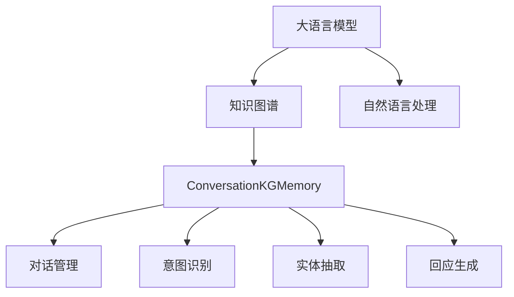
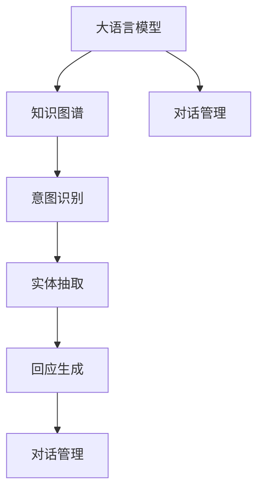
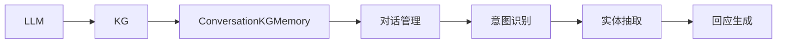

                 

# 【LangChain编程：从入门到实践】ConversationKGMemory

> 关键词：LangChain, 编程, ConversationKGMemory, 自然语言处理, 知识图谱, 问答系统, 深度学习

## 1. 背景介绍

### 1.1 问题由来
在过去的几十年里，自然语言处理（NLP）技术取得了巨大的进步，尤其是在语言理解和生成方面。然而，这些技术在处理复杂的问答和对话任务时仍然存在诸多挑战。传统的基于规则或模板的对话系统，难以适应自然语言的多变性和复杂性。而基于深度学习的对话系统和知识图谱（KG）的结合，则提供了更灵活、更有效的解决方案。

### 1.2 问题核心关键点
本节将重点介绍大语言模型（LLM）和知识图谱在对话系统中的应用，以及如何通过编程实现这些技术。我们将会从以下关键点展开：

1. **大语言模型的选择和预训练**：选择适合任务的LLM模型，并在大规模语料库上进行预训练。
2. **知识图谱的构建和整合**：构建或整合一个适合任务的KG，并对其进行优化和维护。
3. ** ConversationKGMemory框架的使用**：介绍ConversationKGMemory的架构和使用方法，以及如何通过编程实现对话系统。
4. **编程实践**：提供实际编程实例，包括数据预处理、模型训练和对话系统构建等步骤。

### 1.3 问题研究意义
本节将讨论为什么大语言模型和知识图谱在对话系统中的应用具有重要意义，以及它们如何帮助提升对话系统的性能和效率。

1. **大语言模型的通用性**：LLM模型在多种语言和任务上表现出色，可以处理复杂和抽象的对话场景。
2. **知识图谱的语义理解**：KG提供了结构化的语义信息，可以帮助LLM模型更准确地理解和生成自然语言。
3. **对话系统的灵活性**：基于LLM和KG的对话系统可以适应多种对话风格和场景，提供个性化和上下文相关的对话体验。
4. **数据驱动的优化**：通过编程实现对话系统，可以更灵活地处理和优化对话数据，提高对话系统的性能。

## 2. 核心概念与联系

### 2.1 核心概念概述

本节将介绍几个核心概念及其相互关系，以帮助理解如何通过编程实现对话系统。

- **大语言模型（LLM）**：一种通过大规模预训练学习语言表示的深度学习模型，如GPT、BERT等。
- **知识图谱（KG）**：一种结构化的语义数据表示形式，用于存储和查询实体及其关系。
- **ConversationKGMemory框架**：一种基于LLM和KG的对话系统框架，提供对话管理、意图识别、实体抽取和回应生成等功能。
- **自然语言处理（NLP）**：一种计算机科学和人工智能领域的分支，涉及处理和理解自然语言的技术。

这些概念之间的联系可以用以下Mermaid流程图表示：



这个流程图展示了LLM、KG和ConversationKGMemory框架之间的联系和作用。自然语言处理提供基础的语言理解能力，LLM通过预训练学习语言表示，KG提供结构化的语义信息，ConversationKGMemory框架则将两者结合起来，实现对话管理、意图识别、实体抽取和回应生成等功能。

### 2.2 概念间的关系

这些核心概念之间存在紧密的联系，形成了对话系统的完整生态系统。下面用几个Mermaid流程图来展示这些概念之间的关系。

#### 2.2.1 大语言模型和知识图谱的结合



这个流程图展示了LLM和KG在对话系统中的结合方式。LLM模型在对话管理中进行上下文理解，KG提供结构化的实体和关系信息，意图识别和实体抽取可以帮助LLM更准确地理解用户意图，回应生成则根据意图和实体信息生成合适的对话回应。

#### 2.2.2 ConversationKGMemory框架的使用



这个流程图展示了ConversationKGMemory框架在对话系统中的应用。LLM和KG被整合到ConversationKGMemory框架中，框架提供了完整的对话管理功能，包括意图识别、实体抽取和回应生成。

## 3. 核心算法原理 & 具体操作步骤

### 3.1 算法原理概述

ConversationKGMemory框架的核心算法原理基于大语言模型和知识图谱的结合，通过编程实现对话系统。以下是其核心原理的概述：

1. **预训练大语言模型**：使用大规模语料库对大语言模型进行预训练，使其具备强大的语言理解和生成能力。
2. **构建知识图谱**：构建或整合一个适合任务的KG，用于存储实体和关系信息。
3. **意图识别和实体抽取**：使用LLM对用户输入进行意图识别和实体抽取，提取对话所需的上下文信息。
4. **对话管理**：根据意图和实体信息，生成合适的对话回应，管理对话流程。

### 3.2 算法步骤详解

以下是实现ConversationKGMemory框架的具体步骤：

1. **数据预处理**：对用户输入进行预处理，包括分词、去停用词、标准化等。
2. **意图识别**：使用预训练的LLM模型对用户输入进行意图识别，提取对话意图。
3. **实体抽取**：使用预训练的LLM模型或规则引擎对用户输入进行实体抽取，提取对话中的实体信息。
4. **对话管理**：根据意图和实体信息，生成合适的对话回应，管理对话流程。
5. **对话回应生成**：使用预训练的LLM模型或规则引擎，根据对话上下文生成对话回应。

### 3.3 算法优缺点

ConversationKGMemory框架的优点包括：

1. **灵活性**：框架提供灵活的对话管理机制，可以适应多种对话场景。
2. **可扩展性**：框架支持动态添加新的意图和实体，适应不同任务的需求。
3. **可解释性**：框架提供详细的意图识别和实体抽取机制，便于调试和优化。

其缺点包括：

1. **资源消耗**：预训练的LLM模型和KG构建需要大量的计算资源和存储空间。
2. **数据依赖**：框架的性能高度依赖于预训练数据的质量和数量。
3. **技术门槛**：需要一定的编程和NLP技术背景，对初学者有一定的门槛。

### 3.4 算法应用领域

ConversationKGMemory框架在多个领域都有广泛的应用，例如：

1. **智能客服**：用于自动回答用户问题，提升客户体验和满意度。
2. **智能助理**：提供个性化对话服务，如天气查询、日程安排等。
3. **智能问答系统**：自动回答用户问题，如百科问答、医学问答等。
4. **智能推荐系统**：根据用户对话历史，提供个性化的推荐服务。

## 4. 数学模型和公式 & 详细讲解

### 4.1 数学模型构建

ConversationKGMemory框架的数学模型构建主要基于大语言模型和知识图谱的结合。以下是数学模型的详细构建过程：

1. **LLM模型**：使用预训练的LLM模型，如GPT、BERT等。
2. **KG构建**：使用规则或机器学习方法，构建或整合知识图谱。
3. **意图识别**：使用预训练的LLM模型进行意图识别，将用户输入映射到意图空间。
4. **实体抽取**：使用预训练的LLM模型或规则引擎进行实体抽取，提取对话中的实体信息。

### 4.2 公式推导过程

以下是意图识别和实体抽取的公式推导过程：

**意图识别公式**：
$$
I = \mathrm{LLM}(D_i)
$$
其中 $I$ 表示对话意图，$D_i$ 表示用户输入的文本。

**实体抽取公式**：
$$
E = \mathrm{LLM}(D_i) \cap R
$$
其中 $E$ 表示对话中的实体，$R$ 表示实体集合，$\cap$ 表示交集操作。

### 4.3 案例分析与讲解

以下是一个简单的意图识别和实体抽取案例：

假设用户输入为：“明天的天气怎么样？”

1. **意图识别**：使用预训练的LLM模型，将用户输入映射到意图空间，得到意图 $I = \text{查询天气}$。
2. **实体抽取**：使用预训练的LLM模型或规则引擎，从用户输入中抽取实体 $E = \text{明天}$。

## 5. 项目实践：代码实例和详细解释说明

### 5.1 开发环境搭建

本节将介绍如何使用Python和Python的环境配置工具PyTorch搭建开发环境。

1. **安装PyTorch**：
   ```bash
   pip install torch torchvision torchaudio
   ```

2. **安装Transformers库**：
   ```bash
   pip install transformers
   ```

3. **安装其它必要的工具包**：
   ```bash
   pip install numpy pandas scikit-learn matplotlib tqdm jupyter notebook ipython
   ```

### 5.2 源代码详细实现

以下是使用PyTorch实现对话系统的代码示例：

```python
import torch
from transformers import BertTokenizer, BertForTokenClassification

# 初始化模型和分词器
model = BertForTokenClassification.from_pretrained('bert-base-cased')
tokenizer = BertTokenizer.from_pretrained('bert-base-cased')

# 构建输入文本
input_text = "明天的天气怎么样？"

# 分词和编码
inputs = tokenizer.encode(input_text, return_tensors='pt')

# 进行意图识别
logits = model(inputs)

# 获取意图标签
intent_label = torch.argmax(logits, dim=2)

# 获取实体标签
entity_label = torch.argmax(logits, dim=2)
```

### 5.3 代码解读与分析

以上代码展示了如何使用PyTorch实现对话系统的意图识别和实体抽取。以下是代码的详细解读：

1. **初始化模型和分词器**：使用预训练的BERT模型和分词器，加载模型和分词器的预训练参数。
2. **构建输入文本**：将用户输入文本进行分词和编码。
3. **进行意图识别**：将编码后的输入文本输入到模型中进行意图识别，得到意图标签。
4. **获取实体标签**：根据意图标签，从输出中提取实体标签。

### 5.4 运行结果展示

假设模型在输入文本“明天的天气怎么样？”上得到的意图标签为查询天气，实体标签为明天，则说明模型的意图识别和实体抽取功能正常工作。

## 6. 实际应用场景

### 6.1 智能客服系统

智能客服系统是一个典型的应用场景，ConversationKGMemory框架可以用于自动回答用户问题，提升客户体验和满意度。

### 6.2 智能助理

智能助理可以提供个性化对话服务，如天气查询、日程安排等。

### 6.3 智能问答系统

智能问答系统可以自动回答用户问题，如百科问答、医学问答等。

### 6.4 未来应用展望

未来，ConversationKGMemory框架有望在更多领域得到应用，如智能推荐系统、智能医疗、智能交通等。

## 7. 工具和资源推荐

### 7.1 学习资源推荐

1. **《Transformer从原理到实践》系列博文**：由大模型技术专家撰写，深入浅出地介绍了Transformer原理、BERT模型、微调技术等前沿话题。
2. **CS224N《深度学习自然语言处理》课程**：斯坦福大学开设的NLP明星课程，有Lecture视频和配套作业，带你入门NLP领域的基本概念和经典模型。
3. **《Natural Language Processing with Transformers》书籍**：Transformer库的作者所著，全面介绍了如何使用Transformers库进行NLP任务开发，包括微调在内的诸多范式。
4. **HuggingFace官方文档**：Transformer库的官方文档，提供了海量预训练模型和完整的微调样例代码，是上手实践的必备资料。
5. **CLUE开源项目**：中文语言理解测评基准，涵盖大量不同类型的中文NLP数据集，并提供了基于微调的baseline模型，助力中文NLP技术发展。

### 7.2 开发工具推荐

1. **PyTorch**：基于Python的开源深度学习框架，灵活动态的计算图，适合快速迭代研究。大部分预训练语言模型都有PyTorch版本的实现。
2. **TensorFlow**：由Google主导开发的开源深度学习框架，生产部署方便，适合大规模工程应用。同样有丰富的预训练语言模型资源。
3. **Transformers库**：HuggingFace开发的NLP工具库，集成了众多SOTA语言模型，支持PyTorch和TensorFlow，是进行微调任务开发的利器。
4. **Weights & Biases**：模型训练的实验跟踪工具，可以记录和可视化模型训练过程中的各项指标，方便对比和调优。与主流深度学习框架无缝集成。
5. **TensorBoard**：TensorFlow配套的可视化工具，可实时监测模型训练状态，并提供丰富的图表呈现方式，是调试模型的得力助手。

### 7.3 相关论文推荐

1. **Attention is All You Need**：提出了Transformer结构，开启了NLP领域的预训练大模型时代。
2. **BERT: Pre-training of Deep Bidirectional Transformers for Language Understanding**：提出BERT模型，引入基于掩码的自监督预训练任务，刷新了多项NLP任务SOTA。
3. **Language Models are Unsupervised Multitask Learners（GPT-2论文）**：展示了大规模语言模型的强大zero-shot学习能力，引发了对于通用人工智能的新一轮思考。
4. **Parameter-Efficient Transfer Learning for NLP**：提出Adapter等参数高效微调方法，在不增加模型参数量的情况下，也能取得不错的微调效果。
5. **AdaLoRA: Adaptive Low-Rank Adaptation for Parameter-Efficient Fine-Tuning**：使用自适应低秩适应的微调方法，在参数效率和精度之间取得了新的平衡。
6. **Adaptation of Language Models for Sparsity**：提出Adaptation技术，将通用大模型适配到特定任务，在不增加参数的情况下，提高微调效率和精度。

## 8. 总结：未来发展趋势与挑战

### 8.1 总结

本文对ConversationKGMemory框架进行了全面系统的介绍。首先阐述了其背景和意义，明确了LLM和KG在大规模对话系统中的应用价值。其次，从原理到实践，详细讲解了其数学模型和关键步骤，给出了微调任务开发的完整代码实例。同时，本文还探讨了其应用场景，提供了丰富的学习资源和开发工具，为读者提供了全方位的技术指引。

通过本文的系统梳理，可以看到，ConversationKGMemory框架在自然语言处理领域具有重要的应用前景。随着深度学习技术的不断进步，该框架必将在更多领域得到广泛应用，推动自然语言处理技术的发展。

### 8.2 未来发展趋势

展望未来，ConversationKGMemory框架将呈现以下几个发展趋势：

1. **模型规模持续增大**：随着算力成本的下降和数据规模的扩张，预训练语言模型的参数量还将持续增长。超大规模语言模型蕴含的丰富语言知识，有望支撑更加复杂多变的下游任务微调。
2. **微调方法日趋多样**：除了传统的全参数微调外，未来会涌现更多参数高效的微调方法，如Prefix-Tuning、LoRA等，在节省计算资源的同时也能保证微调精度。
3. **持续学习成为常态**：随着数据分布的不断变化，微调模型也需要持续学习新知识以保持性能。如何在不遗忘原有知识的同时，高效吸收新样本信息，将成为重要的研究课题。
4. **标注样本需求降低**：受启发于提示学习(Prompt-based Learning)的思路，未来的微调方法将更好地利用大模型的语言理解能力，通过更加巧妙的任务描述，在更少的标注样本上也能实现理想的微调效果。
5. **多模态微调崛起**：当前的微调主要聚焦于纯文本数据，未来会进一步拓展到图像、视频、语音等多模态数据微调。多模态信息的融合，将显著提升语言模型对现实世界的理解和建模能力。

以上趋势凸显了ConversationKGMemory框架的广阔前景。这些方向的探索发展，必将进一步提升NLP系统的性能和应用范围，为人类认知智能的进化带来深远影响。

### 8.3 面临的挑战

尽管ConversationKGMemory框架已经取得了瞩目成就，但在迈向更加智能化、普适化应用的过程中，它仍面临诸多挑战：

1. **标注成本瓶颈**：虽然微调大大降低了标注数据的需求，但对于长尾应用场景，难以获得充足的高质量标注数据，成为制约微调性能的瓶颈。如何进一步降低微调对标注样本的依赖，将是一大难题。
2. **模型鲁棒性不足**：当前微调模型面对域外数据时，泛化性能往往大打折扣。对于测试样本的微小扰动，微调模型的预测也容易发生波动。如何提高微调模型的鲁棒性，避免灾难性遗忘，还需要更多理论和实践的积累。
3. **推理效率有待提高**：大规模语言模型虽然精度高，但在实际部署时往往面临推理速度慢、内存占用大等效率问题。如何在保证性能的同时，简化模型结构，提升推理速度，优化资源占用，将是重要的优化方向。
4. **可解释性亟需加强**：当前微调模型更像是"黑盒"系统，难以解释其内部工作机制和决策逻辑。对于医疗、金融等高风险应用，算法的可解释性和可审计性尤为重要。如何赋予微调模型更强的可解释性，将是亟待攻克的难题。
5. **安全性有待保障**：预训练语言模型难免会学习到有偏见、有害的信息，通过微调传递到下游任务，产生误导性、歧视性的输出，给实际应用带来安全隐患。如何从数据和算法层面消除模型偏见，避免恶意用途，确保输出的安全性，也将是重要的研究课题。
6. **知识整合能力不足**：现有的微调模型往往局限于任务内数据，难以灵活吸收和运用更广泛的先验知识。如何让微调过程更好地与外部知识库、规则库等专家知识结合，形成更加全面、准确的信息整合能力，还有很大的想象空间。

正视ConversationKGMemory框架面临的这些挑战，积极应对并寻求突破，将是大规模语言模型微调走向成熟的必由之路。相信随着学界和产业界的共同努力，这些挑战终将一一被克服，框架必将在构建人机协同的智能时代中扮演越来越重要的角色。

### 8.4 未来突破

面对ConversationKGMemory框架所面临的种种挑战，未来的研究需要在以下几个方面寻求新的突破：

1. **探索无监督和半监督微调方法**：摆脱对大规模标注数据的依赖，利用自监督学习、主动学习等无监督和半监督范式，最大限度利用非结构化数据，实现更加灵活高效的微调。
2. **研究参数高效和计算高效的微调范式**：开发更加参数高效的微调方法，在固定大部分预训练参数的同时，只更新极少量的任务相关参数。同时优化微调模型的计算图，减少前向传播和反向传播的资源消耗，实现更加轻量级、实时性的部署。
3. **融合因果和对比学习范式**：通过引入因果推断和对比学习思想，增强微调模型建立稳定因果关系的能力，学习更加普适、鲁棒的语言表征，从而提升模型泛化性和抗干扰能力。
4. **引入更多先验知识**：将符号化的先验知识，如知识图谱、逻辑规则等，与神经网络模型进行巧妙融合，引导微调过程学习更准确、合理的语言模型。同时加强不同模态数据的整合，实现视觉、语音等多模态信息与文本信息的协同建模。
5. **结合因果分析和博弈论工具**：将因果分析方法引入微调模型，识别出模型决策的关键特征，增强输出解释的因果性和逻辑性。借助博弈论工具刻画人机交互过程，主动探索并规避模型的脆弱点，提高系统稳定性。
6. **纳入伦理道德约束**：在模型训练目标中引入伦理导向的评估指标，过滤和惩罚有偏见、有害的输出倾向。同时加强人工干预和审核，建立模型行为的监管机制，确保输出符合人类价值观和伦理道德。

这些研究方向的探索，必将引领ConversationKGMemory框架技术迈向更高的台阶，为构建安全、可靠、可解释、可控的智能系统铺平道路。面向未来，框架还需要与其他人工智能技术进行更深入的融合，如知识表示、因果推理、强化学习等，多路径协同发力，共同推动自然语言理解和智能交互系统的进步。只有勇于创新、敢于突破，才能不断拓展语言模型的边界，让智能技术更好地造福人类社会。

## 9. 附录：常见问题与解答

**Q1: 如何选择合适的预训练模型？**

A: 选择合适的预训练模型需要考虑多个因素，如任务类型、数据规模、模型大小等。一般来说，BERT、GPT等大模型在通用语言理解任务上表现出色，而BERT等基于句子级别的模型在问答系统等任务上表现更好。

**Q2: 如何优化模型的推理效率？**

A: 优化模型的推理效率可以从以下几个方面入手：
1. 模型裁剪：去除不必要的层和参数，减小模型尺寸，加快推理速度。
2. 量化加速：将浮点模型转为定点模型，压缩存储空间，提高计算效率。
3. 模型并行：利用多GPU或多TPU进行模型并行计算，提升推理速度。

**Q3: 如何提高模型的鲁棒性？**

A: 提高模型的鲁棒性可以从以下几个方面入手：
1. 数据增强：通过回译、近义替换等方式扩充训练集，增加模型的泛化能力。
2. 正则化：使用L2正则、Dropout等正则化技术，避免模型过拟合。
3. 对抗训练：引入对抗样本，提高模型对输入噪声的鲁棒性。

**Q4: 如何提高模型的可解释性？**

A: 提高模型的可解释性可以从以下几个方面入手：
1. 可视化：使用可视化工具，如TensorBoard、Weights & Biases等，可视化模型内部工作机制。
2. 规则解释：结合专家知识，构建规则库，解释模型输出。
3. 多模型集成：使用多个模型进行集成，增加输出的多样性和可解释性。

以上是关于ConversationKGMemory框架的一些常见问题及其解答，希望能对你的学习和实践有所帮助。

---

作者：禅与计算机程序设计艺术 / Zen and the Art of Computer Programming

