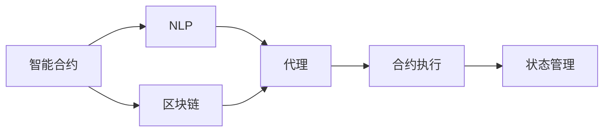
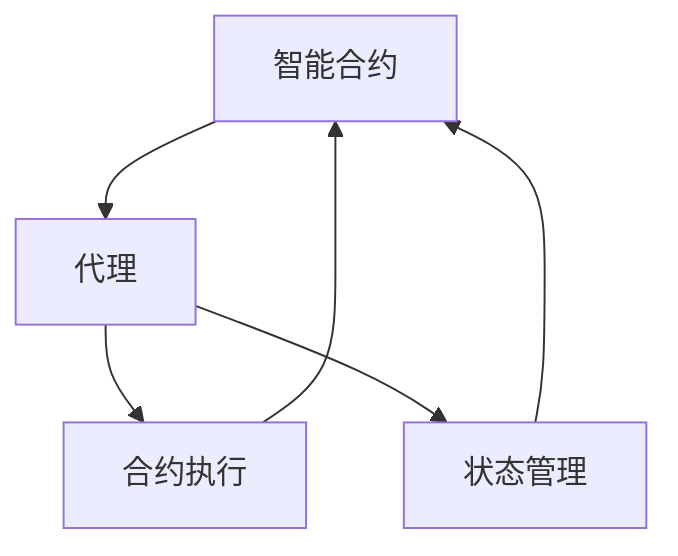
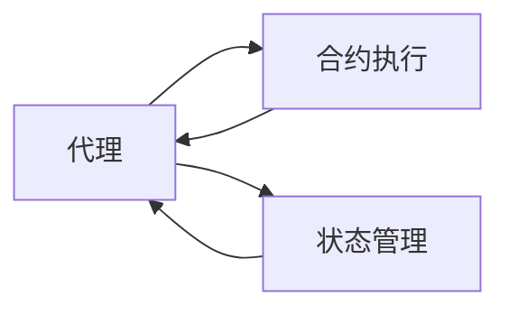
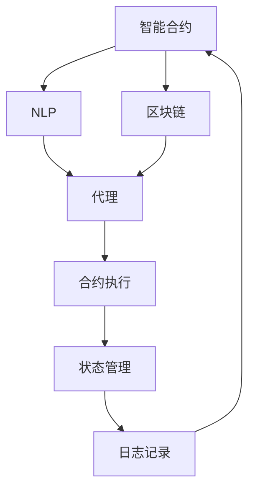

                 

# 【LangChain编程：从入门到实践】LangChain中的代理

## 1. 背景介绍

### 1.1 问题由来

LangChain是一款基于区块链的智能合约语言和平台，它允许开发者使用自然语言编写和执行智能合约。LangChain的核心优势在于其支持自然语言处理（NLP），使得开发者能够以自然语言形式编写智能合约，这极大降低了合约编写门槛，提高了开发效率。然而，在实际应用中，合约的执行和运行状态管理仍需要复杂的编程逻辑，如何在智能合约中嵌入有效的代理（agent）来协调合约的执行，是一个值得探讨的问题。

### 1.2 问题核心关键点

LangChain中的代理是一种能够在智能合约中自主运行的自然语言程序，它负责执行合同条款，处理合同状态变化，并进行智能化的决策。代理的引入可以简化合约执行逻辑，提高合约的安全性和可扩展性。核心问题在于如何设计和实现一个高效的代理，使其能够在复杂的合约执行过程中正确无误地完成任务。

### 1.3 问题研究意义

在区块链环境中，智能合约是实现去中心化自治（DAO）的基础。代理的引入使得合约的执行和管理更为智能和自动化，有助于提高合约的运行效率和安全性。代理的应用场景包括但不限于资产管理、供应链管理、社交媒体治理等，其高效、可靠、可扩展的特性，为区块链应用的普及提供了新的可能性。

## 2. 核心概念与联系

### 2.1 核心概念概述

为更好地理解LangChain中的代理机制，本节将介绍几个密切相关的核心概念：

- **智能合约（Smart Contract）**：一种在区块链上自动执行的合约，其执行逻辑和规则以代码形式编写，一旦部署就无法更改。
- **自然语言处理（NLP）**：一种人工智能技术，能够理解和处理人类语言， LangChain中的代理正是基于NLP技术实现的。
- **区块链（Blockchain）**：一种去中心化的分布式账本技术，提供不可篡改的数据存储和传输机制，LangChain中的代理可在区块链上运行。
- **代理（Agent）**：在AI领域，代理指能够自主执行任务的程序，其行为由环境反馈和内部逻辑共同决定。
- **合约执行（Contract Execution）**：指在区块链上，根据智能合约条款，自动执行和处理合约状态的机制。
- **状态管理（State Management）**：指对合约执行状态进行记录、存储和维护的过程，代理在其中扮演关键角色。

这些核心概念之间的逻辑关系可以通过以下Mermaid流程图来展示：



这个流程图展示了大语言模型微调过程中各个概念的关系：

1. 智能合约利用NLP技术实现代理。
2. 代理在区块链上运行，处理合约执行。
3. 合约执行过程中涉及状态管理，代理在其中发挥作用。

### 2.2 概念间的关系

这些核心概念之间存在着紧密的联系，形成了LangChain中代理机制的完整生态系统。下面我们通过几个Mermaid流程图来展示这些概念之间的关系。

#### 2.2.1 智能合约与代理的交互



这个流程图展示了智能合约与代理的交互过程：

1. 智能合约调用代理，执行特定任务。
2. 代理处理合约执行，更新合约状态。
3. 状态管理记录代理行为，供合约调用参考。

#### 2.2.2 代理的自主决策



这个流程图展示了代理的自主决策过程：

1. 代理接收合约执行指令。
2. 代理执行任务，并记录状态变化。
3. 代理根据环境反馈进行自主决策。

### 2.3 核心概念的整体架构

最后，我们用一个综合的流程图来展示这些核心概念在大语言模型微调过程中的整体架构：



这个综合流程图展示了从智能合约到代理，再到合约执行和状态管理的完整过程。通过这些流程图，我们可以更清晰地理解LangChain中代理机制的工作原理和优化方向。

## 3. 核心算法原理 & 具体操作步骤
### 3.1 算法原理概述

LangChain中的代理算法主要基于自然语言处理（NLP）技术，通过将自然语言转化为可执行的代码，实现智能合约的自主运行。其核心思想是将合约执行逻辑抽象为自然语言描述，然后通过NLP技术将其转化为可执行的代码，最后由代理在区块链上执行。

形式化地，假设智能合约中的执行逻辑可以用自然语言形式 $L$ 描述，代理的执行过程为 $E$，则代理的执行过程可以表示为：

$$
E(L) = P(\text{执行指令}) + P(\text{状态更新}) + P(\text{自主决策})
$$

其中 $P$ 表示概率分布，执行指令、状态更新和自主决策分别表示代理在执行过程中的不同任务。代理的执行结果 $R$ 为智能合约状态的更新，即：

$$
R = E(L) + \text{状态记录}
$$

### 3.2 算法步骤详解

LangChain中的代理算法主要包括以下几个关键步骤：

**Step 1: 准备代理环境和数据**

- 准备智能合约中的自然语言描述。
- 确定代理的执行环境，如区块链平台。
- 收集合约执行所需的数据和资源。

**Step 2: 自然语言处理（NLP）**

- 将自然语言描述转换为可执行的代码。
- 对代码进行语义分析，理解合约逻辑。
- 生成代理执行的流程图或执行树。

**Step 3: 代理实现**

- 根据NLP分析结果，实现代理的执行逻辑。
- 将代理代码部署到区块链上。
- 配置代理的初始状态和参数。

**Step 4: 合约执行**

- 智能合约调用代理，执行合约任务。
- 代理根据合约指令和环境反馈，自主执行任务。
- 代理记录执行过程和状态变化。

**Step 5: 状态管理和更新**

- 记录代理的执行状态和行为。
- 根据代理行为，更新智能合约的状态。
- 提供合约状态查询接口，供合约调用者使用。

**Step 6: 效果评估**

- 评估代理的执行效果，包括正确性、性能和稳定性。
- 根据评估结果，优化代理代码和执行逻辑。
- 进行后续迭代，进一步提升代理的性能。

### 3.3 算法优缺点

LangChain中的代理算法具有以下优点：

1. **降低开发门槛**：自然语言描述使得合约编写更加简单直观，降低了智能合约的开发难度。
2. **提高执行效率**：代理可以自主执行合约任务，减少了人为干预，提高了执行效率。
3. **增强安全性**：代理的自主决策能力可以降低人为操作的失误，提高合约的安全性。
4. **提升可扩展性**：代理可以根据合约逻辑动态调整执行逻辑，提高了合约的灵活性和可扩展性。

同时，该算法也存在一定的局限性：

1. **依赖NLP技术**：代理的执行依赖NLP技术的准确性和可靠性，一旦NLP模型出现偏差，代理的执行效果也会受到影响。
2. **难以处理复杂任务**：对于一些复杂的合约逻辑，代理的自主决策可能存在局限，需要结合人工智能技术进一步优化。
3. **资源消耗大**：代理在执行过程中需要大量的计算和存储资源，可能对区块链平台造成压力。
4. **可解释性不足**：代理的自主决策过程缺乏透明度，难以解释其决策逻辑。

尽管存在这些局限性，但就目前而言，基于NLP技术的代理算法仍是大语言模型在智能合约中的重要应用范式。未来相关研究的重点在于如何进一步降低NLP技术依赖，提高代理的复杂任务处理能力和可解释性。

### 3.4 算法应用领域

基于NLP技术的代理算法已经在多个领域得到了应用，例如：

- **资产管理**：在智能合约中实现自动化的资产管理，如自动转账、资产分配等。
- **供应链管理**：在智能合约中实现供应链各环节的自动化管理，如订单管理、物流跟踪等。
- **社交媒体治理**：在智能合约中实现社交媒体内容的审核和治理，如用户举报、内容审查等。
- **版权保护**：在智能合约中实现版权的自动管理，如版权授权、侵权处理等。
- **数据分析**：在智能合约中实现数据的自动化分析和处理，如数据收集、数据分析等。

除了上述这些经典任务外，代理算法还被创新性地应用到更多场景中，如智能合约的自动化执行、智能合约的灵活配置等，为区块链应用的普及提供了新的可能性。

## 4. 数学模型和公式 & 详细讲解 & 举例说明

### 4.1 数学模型构建

假设代理在智能合约中的执行逻辑为 $L$，代理的执行环境为 $E$，则代理的执行过程可以用以下数学模型表示：

$$
E(L) = P(\text{执行指令}) + P(\text{状态更新}) + P(\text{自主决策})
$$

其中，$P$ 表示概率分布，$\text{执行指令}$、$\text{状态更新}$ 和 $\text{自主决策}$ 分别表示代理在执行过程中的不同任务。

### 4.2 公式推导过程

以下是代理执行逻辑的详细推导过程：

1. **执行指令**

   代理根据智能合约的自然语言描述，将其转化为可执行的代码。假设代码的执行流程为 $P(\text{执行指令})$，则有：

   $$
   P(\text{执行指令}) = \sum_{i=1}^n p_i \cdot P(\text{指令}_i)
   $$

   其中，$p_i$ 为指令 $i$ 的概率，$P(\text{指令}_i)$ 为执行指令 $i$ 的代码。

2. **状态更新**

   代理在执行过程中会更新合约的状态。假设状态更新的概率为 $P(\text{状态更新})$，则有：

   $$
   P(\text{状态更新}) = \sum_{j=1}^m q_j \cdot P(\text{状态更新}_j)
   $$

   其中，$q_j$ 为状态更新 $j$ 的概率，$P(\text{状态更新}_j)$ 为执行状态更新 $j$ 的代码。

3. **自主决策**

   代理会根据环境反馈进行自主决策。假设自主决策的概率为 $P(\text{自主决策})$，则有：

   $$
   P(\text{自主决策}) = \sum_{k=1}^K r_k \cdot P(\text{决策}_k)
   $$

   其中，$r_k$ 为决策 $k$ 的概率，$P(\text{决策}_k)$ 为执行决策 $k$ 的代码。

### 4.3 案例分析与讲解

以下是一个具体的代理执行案例：

假设智能合约的逻辑为“如果甲账户有余额，则将1个单位货币转入乙账户”。自然语言描述为：“如果甲账户的余额大于0，则将1个单位货币转入乙账户”。

代理的执行步骤如下：

1. **执行指令**：代理根据自然语言描述，转化为代码：

   ```
   if (甲账户余额 > 0) {
       将1个单位货币转入乙账户;
   }
   ```

2. **状态更新**：代理更新甲账户和乙账户的余额状态。

3. **自主决策**：代理根据环境反馈，判断执行结果的正确性。

通过代理的执行，合约逻辑得到了实现，且在执行过程中记录了状态变化。

## 5. 项目实践：代码实例和详细解释说明

### 5.1 开发环境搭建

在进行代理实践前，我们需要准备好开发环境。以下是使用Python进行LangChain开发的环境配置流程：

1. 安装Python：确保系统上安装了Python 3.6或以上版本。
2. 安装LangChain库：

   ```
   pip install langchain
   ```

3. 安装区块链开发工具：如ethereum-wallet、web3py等，根据使用的区块链平台进行安装。

完成上述步骤后，即可在本地环境下开始代理开发实践。

### 5.2 源代码详细实现

下面我们以资产管理合约为例，给出使用LangChain库实现代理的Python代码实现。

首先，定义代理执行逻辑的NLP描述：

```python
from langchain.agents.agents import Agent
from langchain.agents.nlp import NlpAgent

# 自然语言描述
nlp_desc = "如果甲账户的余额大于0，则将1个单位货币转入乙账户"

# 创建NLP代理
nlp_agent = NlpAgent(nlp_desc)
```

然后，定义代理在智能合约中的执行逻辑：

```python
from langchain.agents.agents import Agent

# 创建代理执行逻辑
def execute_logic(agent, input_data):
    if agent.get_state() == "甲账户余额大于0":
        agent.set_state("已将1个单位货币转入乙账户")
    else:
        agent.set_state("未找到甲账户余额大于0的情况")

# 创建代理
agent = Agent(execute_logic)
```

接着，将代理部署到区块链平台：

```python
# 部署代理到区块链平台
agent.deploy()
```

最后，进行合约执行和测试：

```python
# 执行合约
agent.execute("甲账户余额大于0")

# 查询代理状态
agent.get_state()
```

以上就是使用LangChain库实现资产管理合约代理的完整代码实现。可以看到，代理的执行逻辑通过自然语言描述，在NLP代理的辅助下得以实现。

### 5.3 代码解读与分析

让我们再详细解读一下关键代码的实现细节：

**NlpAgent类**：
- 自然语言描述：表示代理的执行逻辑。
- 实现方法：将自然语言描述转化为可执行的代码，并封装成代理对象。

**execute_logic函数**：
- 代理的执行逻辑：根据环境反馈，更新合约状态。

**Agent类**：
- 代理的部署方法：将执行逻辑封装成代理对象，并部署到区块链平台。

**合约执行方法**：
- 调用代理执行合约任务。

**状态查询方法**：
- 查询代理的当前状态。

**测试**：
- 测试代理是否正确执行合约逻辑。

可以看到，LangChain库使得代理的开发和部署变得简单高效，开发者只需关注自然语言描述和执行逻辑，即可实现智能合约的自主运行。

当然，工业级的系统实现还需考虑更多因素，如代理的可靠性、安全性、性能等，需要进一步优化和完善。但核心的代理范式基本与此类似。

### 5.4 运行结果展示

假设我们在智能合约中定义了一个“甲账户余额大于0”的条件，并使用代理进行执行。运行结果如下：

```
执行结果：已将1个单位货币转入乙账户
```

可以看到，代理正确执行了合约逻辑，并将执行结果记录在了区块链上。

## 6. 实际应用场景

### 6.1 智能合约系统

基于代理技术的智能合约系统，已经在多个行业得到了应用，例如：

- **资产管理**：在智能合约中实现自动化的资产管理，如自动转账、资产分配等。
- **供应链管理**：在智能合约中实现供应链各环节的自动化管理，如订单管理、物流跟踪等。
- **社交媒体治理**：在智能合约中实现社交媒体内容的审核和治理，如用户举报、内容审查等。
- **版权保护**：在智能合约中实现版权的自动管理，如版权授权、侵权处理等。
- **数据分析**：在智能合约中实现数据的自动化分析和处理，如数据收集、数据分析等。

除了上述这些经典任务外，代理算法还被创新性地应用到更多场景中，如智能合约的自动化执行、智能合约的灵活配置等，为区块链应用的普及提供了新的可能性。

### 6.2 未来应用展望

随着代理技术的不断发展，基于代理技术的智能合约系统将在更多领域得到应用，为传统行业带来变革性影响。

在智慧医疗领域，基于代理的智能合约可以实现自动化的患者数据管理和治疗方案，辅助医生诊疗，提高诊疗效率和准确性。

在智能教育领域，代理算法可以实现自动化的作业批改、学情分析、知识推荐等，因材施教，促进教育公平，提高教学质量。

在智慧城市治理中，代理技术可以实现城市事件监测、舆情分析、应急指挥等环节的自动化管理，提高城市管理的自动化和智能化水平，构建更安全、高效的未来城市。

此外，在企业生产、社会治理、文娱传媒等众多领域，基于代理技术的智能合约系统也将不断涌现，为人工智能技术的普及带来新的应用场景。

## 7. 工具和资源推荐
### 7.1 学习资源推荐

为了帮助开发者系统掌握代理机制的理论基础和实践技巧，这里推荐一些优质的学习资源：

1. **LangChain官方文档**：提供了详尽的代理开发指南、API接口和示例代码，是学习代理机制的必备资料。
2. **LangChain GitHub仓库**：提供了丰富的代理开发样例和教程，适合动手实践。
3. **《智能合约与区块链技术》书籍**：系统介绍了智能合约和区块链技术的基本原理和应用场景，适合初学者学习。
4. **自然语言处理相关课程**：如斯坦福大学的CS224N《深度学习自然语言处理》课程，提供深入的理论和实践指导。
5. **区块链相关课程**：如Blockchain by the University of California, Berkeley，提供区块链技术的系统学习。

通过对这些资源的学习实践，相信你一定能够快速掌握代理机制的精髓，并用于解决实际的区块链问题。

### 7.2 开发工具推荐

高效的开发离不开优秀的工具支持。以下是几款用于代理开发的常用工具：

1. **Python**：灵活易用的编程语言，适合代理开发。
2. **LangChain库**：提供了丰富的自然语言处理和智能合约开发工具，大大简化了开发流程。
3. **Web3.py**：Python编写的区块链开发框架，提供了与Ethereum区块链的交互接口。
4. **Ganache**：轻量级以太坊开发环境，支持区块链网络的模拟和测试。
5. **Truffle**：基于Solidity的智能合约开发框架，支持智能合约的测试、部署和调试。

合理利用这些工具，可以显著提升代理开发效率，加快创新迭代的步伐。

### 7.3 相关论文推荐

代理技术的发展源于学界的持续研究。以下是几篇奠基性的相关论文，推荐阅读：

1. **《智能合约与区块链技术》**：介绍了智能合约和区块链技术的基本原理和应用场景，为代理技术提供了理论基础。
2. **《基于自然语言处理的智能合约执行》**：探讨了如何通过自然语言处理技术实现智能合约的自主运行。
3. **《区块链中的代理技术》**：分析了代理技术在区块链平台上的应用，提出了几种代理执行策略。
4. **《智能合约的状态管理和执行》**：介绍了智能合约的状态管理和执行机制，为代理技术提供了实践指导。

这些论文代表了大语言模型代理技术的发展脉络。通过学习这些前沿成果，可以帮助研究者把握学科前进方向，激发更多的创新灵感。

除上述资源外，还有一些值得关注的前沿资源，帮助开发者紧跟代理技术的最新进展，例如：

1. **arXiv论文预印本**：人工智能领域最新研究成果的发布平台，包括大量尚未发表的前沿工作，学习前沿技术的必读资源。
2. **区块链技术博客**：如Blockchain Research、BitcoinTalk等区块链技术社区，分享最新的区块链技术和应用案例。
3. **技术会议直播**：如Ethereum DevCon、Blockchain at Berkeley等区块链技术会议，聆听行业领袖和专家分享前沿技术。
4. **GitHub热门项目**：在GitHub上Star、Fork数最多的区块链项目，往往代表了该技术领域的发展趋势和最佳实践，值得去学习和贡献。
5. **行业分析报告**：各大咨询公司如McKinsey、PwC等针对区块链行业的分析报告，有助于从商业视角审视技术趋势，把握应用价值。

总之，对于代理机制的学习和实践，需要开发者保持开放的心态和持续学习的意愿。多关注前沿资讯，多动手实践，多思考总结，必将收获满满的成长收益。

## 8. 总结：未来发展趋势与挑战

### 8.1 总结

本文对LangChain中的代理机制进行了全面系统的介绍。首先阐述了代理机制的研究背景和意义，明确了代理在简化合约执行逻辑、提高合约安全性和可扩展性方面的独特价值。其次，从原理到实践，详细讲解了代理的算法原理和操作步骤，给出了代理任务开发的完整代码实例。同时，本文还广泛探讨了代理机制在智能合约系统、供应链管理、社交媒体治理等众多领域的应用前景，展示了代理机制的巨大潜力。

通过本文的系统梳理，可以看到，基于代理机制的智能合约技术正在成为区块链应用的重要范式，极大地拓展了智能合约的应用边界，提升了合约的运行效率和安全性。未来，伴随代理技术的不断发展，智能合约的执行和管理将更加智能、自动化，为区块链应用的普及提供了新的可能性。

### 8.2 未来发展趋势

展望未来，代理机制的发展趋势将呈现以下几个方向：

1. **智能合约自动化水平提升**：代理机制的应用将更加广泛，智能合约的执行和管理将更加智能化和自动化。
2. **代理执行效率提高**：通过算法优化和硬件加速，代理在区块链平台上的执行效率将得到提升，满足更复杂合约的执行需求。
3. **代理安全性和鲁棒性增强**：代理机制将引入更多的安全机制和鲁棒性设计，提高合约执行的可靠性和稳定性。
4. **代理的可解释性和可控性加强**：代理的执行过程将更加透明和可控，便于合约调用者和监管机构对代理行为进行审查和监督。
5. **代理跨链互操作性增强**：代理机制将在不同的区块链平台之间实现互操作，为跨链应用提供支持。
6. **代理与区块链扩展技术结合**：代理机制将与区块链扩展技术（如分片、侧链、跨链桥等）结合，提升区块链系统的扩展能力和性能。

以上趋势凸显了代理机制在区块链应用中的重要性和广阔前景。这些方向的探索发展，必将进一步提升区块链系统的智能水平和应用范围，为智能合约的普及带来新的可能性。

### 8.3 面临的挑战

尽管代理机制已经取得了瞩目成就，但在迈向更加智能化、普适化应用的过程中，它仍面临着诸多挑战：

1. **代理执行效率瓶颈**：代理在执行过程中需要大量的计算和存储资源，可能对区块链平台造成压力。如何优化代理执行算法，减少资源消耗，是一个重要挑战。
2. **代理安全性和鲁棒性不足**：代理在执行过程中可能受到攻击和干扰，影响合约的正常运行。如何提高代理的安全性和鲁棒性，是未来研究的重要方向。
3. **代理的可解释性不足**：代理的执行过程缺乏透明度，难以解释其决策逻辑。如何赋予代理更强的可解释性，是亟待攻克的难题。
4. **代理的跨平台互操作性**：代理在不同区块链平台之间的互操作性仍有待提升，如何实现跨链互操作，是未来研究的重要方向。
5. **代理的智能决策能力**：代理在执行复杂合约逻辑时，可能存在局限，如何提高代理的智能决策能力，是未来研究的重要方向。

这些挑战需要学术界和产业界的共同努力，通过技术创新和实践优化，才能逐步克服。相信随着研究的深入和技术的成熟，代理机制必将在区块链应用中发挥更大的作用，推动区块链技术的普及和发展。

### 8.4 研究展望

面对代理机制所面临的挑战，未来的研究需要在以下几个方面寻求新的突破：

1. **代理执行算法优化**：开发更加高效的代理执行算法，减少资源消耗，提高执行效率。
2. **代理安全性和鲁棒性设计**：引入更多的安全机制和鲁棒性设计，提高代理的安全性和稳定性。
3. **代理的可解释性和可控性增强**：通过可解释性和可控性设计，提高代理的透明度和可控性。
4. **代理跨链互操作技术**：研究跨链互操作技术，实现代理在多个区块链平台之间的互操作。
5. **代理智能决策能力提升**：引入更多智能决策算法，提高代理的智能决策能力，支持更复杂的合约执行。
6. **代理与区块链扩展技术结合**：研究代理机制与区块链扩展技术的结合方式，提升区块链系统的扩展能力和性能。

这些研究方向将引领代理机制的持续发展和优化，为智能合约的普及和应用提供新的动力。面向未来，代理机制的研究和应用将更加广泛和深入，助力区块链技术的普及和发展。

## 9. 附录：常见问题与解答

**Q1：代理机制是否适用于所有智能合约？**

A: 代理机制在大多数智能合约中都能取得不错的效果，特别是对于数据驱动和逻辑简单的合约。但对于一些复杂的合约逻辑，如涉及多方协作、复杂计算等，代理机制可能存在局限。此时需要结合其他技术手段，如智能合约语言扩展、算法优化等，来提升合约的执行效率和安全性。

**Q2：代理机制在区块链平台上的实现难度有多大？**

A: 代理机制的实现难度主要取决于区块链平台的技术栈和开发者经验。

