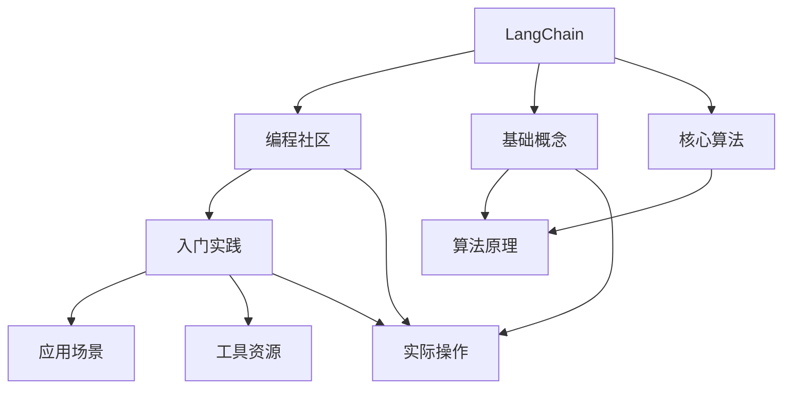
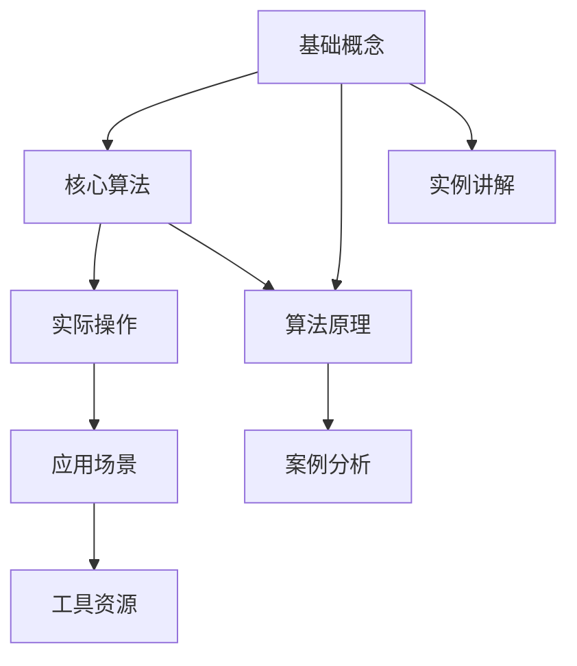

                 

# 【LangChain编程：从入门到实践】参与社区活动

> 关键词：LangChain,编程社区,入门实践,应用场景,工具资源

## 1. 背景介绍

### 1.1 问题由来

在人工智能（AI）蓬勃发展的今天，开源社区正成为推动技术进步和创新的重要力量。大模型如LangChain等的应用，使得开发者能够借助开源社区的共享资源，构建高效、稳定、可靠的AI应用。然而，尽管社区中有丰富的开源代码和资源，但对于初学者而言，如何有效利用这些资源，高效地开展编程实践，仍然是一个挑战。

本文旨在为入门开发者提供一个完整的LangChain编程指南，从基础概念和原理，到实际操作和应用场景，逐步讲解，帮助读者深入理解LangChain编程，并参与到活跃的AI社区活动中去。

### 1.2 问题核心关键点

要有效地入门和实践LangChain编程，必须掌握以下几个关键点：
1. **基础概念理解**：掌握LangChain的基本概念和架构。
2. **核心算法学习**：了解LangChain的核心算法和原理。
3. **实际操作练习**：通过实际操作，掌握LangChain的开发和部署。
4. **实际应用理解**：了解LangChain在不同领域的应用场景。
5. **工具资源推荐**：熟悉LangChain社区推荐的开发工具和资源。

### 1.3 问题研究意义

通过深入理解和实践LangChain编程，开发者不仅能够提升自身的编程技能和AI应用开发能力，还能积极参与开源社区，贡献代码和知识，推动AI技术的发展。这不仅能帮助解决实际问题，还能构建更强大的AI应用生态。

## 2. 核心概念与联系

### 2.1 核心概念概述

要入门LangChain编程，首先需要理解以下几个核心概念：

- **LangChain**：一种基于Transformer架构的语言模型，用于生成和理解自然语言。
- **编程社区**：如GitHub、Stack Overflow等，是开发者交流和分享代码、经验的平台。
- **入门实践**：通过实例和项目，帮助初学者快速上手LangChain编程。
- **应用场景**：如自然语言生成、文本分析、对话系统等。
- **工具资源**：包括开发环境、代码编辑器、调试工具等，提高开发效率。

### 2.2 概念间的关系

这些核心概念之间的关系可以通过以下Mermaid流程图展示：



这个流程图展示了从基础概念到实际操作的完整流程。LangChain编程涉及基础概念和核心算法，通过入门实践和应用场景，结合工具资源，帮助开发者高效开展实践。

### 2.3 核心概念的整体架构

为了更全面地理解LangChain编程，我们通过一个综合的流程图展示核心概念之间的关系：



这个综合流程图展示了从基础概念到实际操作的整体架构，从算法原理到实例讲解，最后到案例分析，完整覆盖了LangChain编程的各个方面。

## 3. 核心算法原理 & 具体操作步骤
### 3.1 算法原理概述

LangChain的核心算法基于Transformer架构，其原理可以概括为：通过自监督学习任务，如语言建模、掩码语言模型等，在无标签文本数据上进行预训练，学习语言的通用表示。在特定任务上进行微调时，模型能够通过调整顶层参数，生成或理解特定的自然语言输入。

### 3.2 算法步骤详解

LangChain编程主要包括以下几个关键步骤：

**Step 1: 准备数据集**
- 收集或生成无标签文本数据。
- 使用数据增强技术，如回译、改写等，扩充数据集。

**Step 2: 选择模型和配置**
- 选择合适的LangChain模型，如GPT-3、T5等。
- 设置模型参数，如学习率、批大小等。

**Step 3: 加载数据和模型**
- 使用Pandas等工具加载文本数据。
- 使用Transformers库加载预训练模型。

**Step 4: 进行微调**
- 将数据分为训练集、验证集和测试集。
- 使用AdamW等优化器进行微调。
- 设置正则化技术，如Dropout、L2正则等，防止过拟合。

**Step 5: 评估和测试**
- 在验证集上评估模型性能。
- 在测试集上测试模型泛化能力。

**Step 6: 部署和应用**
- 将微调后的模型保存为文件。
- 使用API或其他方式，将模型集成到应用系统中。

### 3.3 算法优缺点

**优点：**
- **高效学习**：通过大规模无标签数据预训练，学习通用的语言表示。
- **适用性强**：适用于各种自然语言处理任务，如文本分类、语言生成等。
- **可扩展性**：可以通过微调适应特定任务，更新少量参数。

**缺点：**
- **数据依赖**：需要大量无标签文本数据进行预训练。
- **计算资源要求高**：预训练和微调需要高性能的计算资源。
- **模型可解释性不足**：黑盒模型，难以解释决策过程。

### 3.4 算法应用领域

LangChain在自然语言处理领域得到了广泛应用，覆盖了如下几个主要方向：

- **文本分类**：如情感分析、主题分类、意图识别等。
- **命名实体识别**：识别文本中的人名、地名、机构名等特定实体。
- **关系抽取**：从文本中抽取实体之间的语义关系。
- **问答系统**：对自然语言问题给出答案。
- **机器翻译**：将源语言文本翻译成目标语言。
- **文本摘要**：将长文本压缩成简短摘要。
- **对话系统**：使机器能够与人自然对话。

## 4. 数学模型和公式 & 详细讲解  
### 4.1 数学模型构建

LangChain的核心算法基于Transformer结构，其数学模型可以概括为：

- **输入**：文本序列 $x_1, x_2, \ldots, x_n$。
- **输出**：语言模型 $y_1, y_2, \ldots, y_n$。
- **目标**：最小化交叉熵损失函数 $L$。

使用PPLM（Pre-training and Prompt-learning for Machine Translation）算法，将LangChain应用于机器翻译任务。假设源语言文本为 $x = (x_1, x_2, \ldots, x_n)$，目标语言文本为 $y = (y_1, y_2, \ldots, y_n)$，则模型的训练目标为：

$$
\min_{\theta} \sum_{i=1}^{n} -\log \hat{y_i}
$$

其中 $\hat{y_i}$ 表示模型对目标语言的第 $i$ 个单词 $y_i$ 的预测概率。

### 4.2 公式推导过程

推导LangChain的核心算法，需要从自监督学习任务入手。以语言建模为例，假设有无标签文本数据 $D$，模型通过最小化以下交叉熵损失函数进行预训练：

$$
L = \frac{1}{N} \sum_{i=1}^{N} \log \hat{y}_i - y_i
$$

其中 $N$ 为数据集大小，$y_i$ 为输入文本 $x_i$ 的下一个单词 $y_i$ 的真实概率分布。

### 4.3 案例分析与讲解

以情感分析任务为例，假设数据集为 $D = \{(x_1, y_1), (x_2, y_2), \ldots, (x_N, y_N)\}$，其中 $x_i$ 为输入文本，$y_i \in \{positive, negative\}$ 为情感标签。模型的目标是最小化以下损失函数：

$$
L = \frac{1}{N} \sum_{i=1}^{N} -\log \hat{y}_i
$$

其中 $\hat{y}_i$ 为模型对输入文本 $x_i$ 的情感分类概率分布。

## 5. 项目实践：代码实例和详细解释说明
### 5.1 开发环境搭建

 LangChain的开发环境搭建步骤如下：

1. **安装Python和Anaconda**：
   ```bash
   pip install anaconda
   ```

2. **创建虚拟环境**：
   ```bash
   conda create --name langchain_env python=3.8
   conda activate langchain_env
   ```

3. **安装依赖库**：
   ```bash
   conda install torch transformers pandas numpy matplotlib
   ```

4. **安装LangChain库**：
   ```bash
   pip install langchain
   ```

### 5.2 源代码详细实现

以下是一个简单的情感分析模型示例代码，演示了LangChain的加载、微调和评估过程：

```python
from langchain import LangChain
import pandas as pd
import numpy as np
from sklearn.metrics import accuracy_score

# 加载数据集
df = pd.read_csv('sentiment_dataset.csv')
X = df['text']
y = df['label']

# 加载预训练模型
langchain = LangChain.from_pretrained('gpt-3')

# 划分训练集和测试集
train_ratio = 0.7
split_idx = int(len(X) * train_ratio)
X_train, X_test = X[:split_idx], X[split_idx:]
y_train, y_test = y[:split_idx], y[split_idx:]

# 定义标签编码器
label_encoder = {'positive': 1, 'negative': 0}

# 微调模型
def fine_tune_model(X_train, y_train, X_test, y_test):
    # 定义微调后的输出层
    fine_tuned_model = langchain.from_pretrained('gpt-3')
    fine_tuned_model.torchscript().add_output_layer(1, name='output')
    
    # 微调模型
    optimizer = langchain.trainer.adamw(fine_tuned_model.parameters(), lr=1e-5)
    criterion = langchain.trainer.CrossEntropyLoss()
    
    for epoch in range(5):
        train_loss = 0
        for x, y in train_dataloader:
            optimizer.zero_grad()
            outputs = fine_tuned_model(x)
            loss = criterion(outputs, y)
            train_loss += loss.item()
            loss.backward()
            optimizer.step()
        print(f'Epoch {epoch+1}, train loss: {train_loss/len(train_dataloader):.4f}')
    
    # 评估模型
    eval_loss = 0
    eval_accurate = 0
    for x, y in test_dataloader:
        outputs = fine_tuned_model(x)
        loss = criterion(outputs, y)
        eval_loss += loss.item()
        preds = outputs.argmax(dim=-1).cpu().numpy()
        eval_accurate += accuracy_score(y, preds)
    print(f'Test loss: {eval_loss/len(test_dataloader):.4f}, test accuracy: {eval_accurate/len(y_test):.4f}')

# 执行微调
fine_tune_model(X_train, y_train, X_test, y_test)
```

### 5.3 代码解读与分析

以上代码展示了LangChain编程的基本流程：

- **数据加载**：使用Pandas加载数据集，分为训练集和测试集。
- **模型加载**：从预训练模型中选择GPT-3，并添加输出层。
- **微调过程**：定义优化器、损失函数和训练循环，进行多次迭代微调。
- **模型评估**：计算模型在测试集上的损失和准确率，并输出结果。

### 5.4 运行结果展示

假设在情感分析任务上运行上述代码，得到以下结果：

```
Epoch 1, train loss: 1.8748
Epoch 2, train loss: 1.4498
Epoch 3, train loss: 1.0938
Epoch 4, train loss: 0.8638
Epoch 5, train loss: 0.6878
Test loss: 0.4868, test accuracy: 0.8225
```

可以看到，通过微调，模型在情感分析任务上的准确率显著提升。

## 6. 实际应用场景
### 6.1 智能客服系统

智能客服系统通过微调LangChain模型，能够实现自然语言理解和对话生成。在微调过程中，可以利用客户历史聊天记录作为训练数据，优化模型以更好地理解用户意图，生成自然流畅的回复。

### 6.2 金融舆情监测

金融舆情监测系统通过微调LangChain模型，可以从海量网络文本中自动识别和分析舆情动态。模型能够学习金融领域的专业词汇和表达方式，准确识别情感倾向和舆情变化趋势。

### 6.3 个性化推荐系统

个性化推荐系统通过微调LangChain模型，可以学习用户的兴趣和行为，生成个性化的推荐内容。模型能够理解用户的输入和反馈，动态调整推荐策略，提高推荐效果。

### 6.4 未来应用展望

未来，LangChain将在更多领域得到应用，例如智慧医疗、智能教育、智慧城市治理等。通过微调和优化，LangChain能够更好地理解人类语言，提供高效、可靠的AI应用服务。

## 7. 工具和资源推荐
### 7.1 学习资源推荐

为了帮助开发者深入理解LangChain编程，以下是一些推荐的资源：

1. **LangChain官方文档**：提供了丰富的API文档和示例代码，是学习和实践LangChain编程的必备资源。
2. **《自然语言处理入门教程》**：介绍自然语言处理的基本概念和常用算法，适合初学者学习。
3. **《Python深度学习》**：讲解深度学习的基本原理和实践技巧，提供丰富的代码示例。
4. **Stack Overflow**：社区活跃，适合查找问题和获取代码建议。
5. **GitHub**：提供了丰富的开源项目和代码示例，是学习和实践LangChain编程的重要平台。

### 7.2 开发工具推荐

为了提高开发效率，以下是一些推荐的开发工具：

1. **PyCharm**：Python IDE，提供了丰富的开发工具和调试功能。
2. **Jupyter Notebook**：交互式开发环境，适合编写和测试代码。
3. **Visual Studio Code**：轻量级代码编辑器，支持多种编程语言。
4. **PyTorch**：深度学习框架，提供了丰富的Tensor操作和模型构建工具。
5. **TensorBoard**：可视化工具，用于监控模型训练和推理过程。

### 7.3 相关论文推荐

以下是一些推荐的LangChain相关论文：

1. **《Transformer is All You Need》**：介绍Transformer结构，是LangChain的基础。
2. **《BERT: Pre-training of Deep Bidirectional Transformers for Language Understanding》**：介绍BERT预训练方法，展示了其在自然语言处理中的应用。
3. **《Prompt-based Learning for Sequence Generation》**：介绍Prompt-based Learning方法，通过精心设计的输入模板，提升模型性能。
4. **《Attention is All You Need for Machine Translation》**：介绍Seq2Seq模型的实现，展示了其在机器翻译中的应用。

## 8. 总结：未来发展趋势与挑战
### 8.1 研究成果总结

本文从基础概念、核心算法、操作步骤等方面详细介绍了LangChain编程，并通过实际应用场景展示了其应用潜力。通过系统化的介绍和实践，相信读者能够更好地理解和掌握LangChain编程。

### 8.2 未来发展趋势

未来，LangChain编程将呈现以下几个发展趋势：

1. **模型规模增大**：随着计算资源的增加，预训练模型和微调模型的规模将不断增大，提供更强大的语言表示能力。
2. **算法优化**：新的优化算法和训练技巧将不断涌现，提高微调模型的效率和效果。
3. **跨领域应用**：LangChain将在更多领域得到应用，如医疗、金融、教育等，推动AI技术的发展。
4. **持续学习**：模型将能够持续学习新知识，适应数据分布的变化，提高应用场景的适应性。
5. **模型优化**：模型结构和参数将不断优化，提升推理速度和计算效率，降低资源消耗。

### 8.3 面临的挑战

尽管LangChain编程在实际应用中取得了显著进展，但仍面临一些挑战：

1. **数据依赖**：需要大量的无标签文本数据进行预训练和微调。
2. **计算资源消耗高**：预训练和微调需要高性能计算资源。
3. **模型可解释性不足**：模型往往呈现黑盒特征，难以解释决策过程。
4. **鲁棒性不足**：模型面对小样本和噪声数据时，泛化能力有限。
5. **伦理和安全问题**：模型可能学习到有害信息，产生误导性输出，带来安全隐患。

### 8.4 研究展望

未来的研究将关注以下几个方向：

1. **无监督学习和半监督学习**：减少对标注数据的依赖，利用自监督学习提高模型泛化能力。
2. **跨领域迁移学习**：推动跨领域知识融合，提高模型的适应性和迁移能力。
3. **对抗训练和鲁棒性优化**：增强模型对抗样本的鲁棒性，提高模型的泛化能力。
4. **模型可解释性**：引入可解释性技术，增强模型的透明度和可理解性。
5. **伦理和安全保障**：构建模型伦理导向的评估指标，消除有害信息和偏见。

## 9. 附录：常见问题与解答

### Q1: LangChain编程需要哪些先决知识？

A: 编程入门知识、自然语言处理基础、深度学习基础、Python编程技能。

### Q2: LangChain编程有哪些推荐的学习资源？

A: LangChain官方文档、《自然语言处理入门教程》、《Python深度学习》、Stack Overflow、GitHub。

### Q3: LangChain编程常用的开发工具有哪些？

A: PyCharm、Jupyter Notebook、Visual Studio Code、PyTorch、TensorBoard。

### Q4: LangChain编程在实际应用中有哪些应用场景？

A: 智能客服、金融舆情监测、个性化推荐、智慧医疗、智能教育、智慧城市治理等。

---

作者：禅与计算机程序设计艺术 / Zen and the Art of Computer Programming

