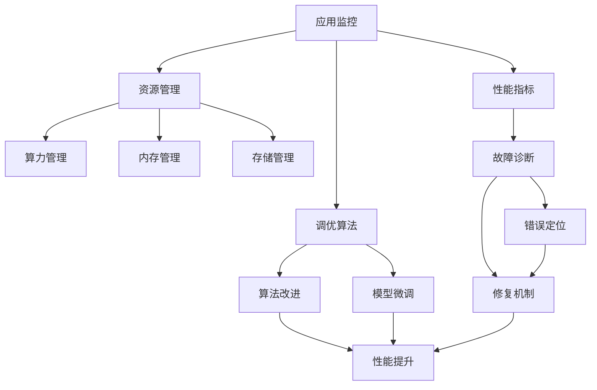
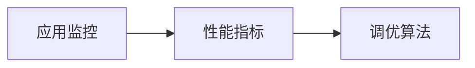
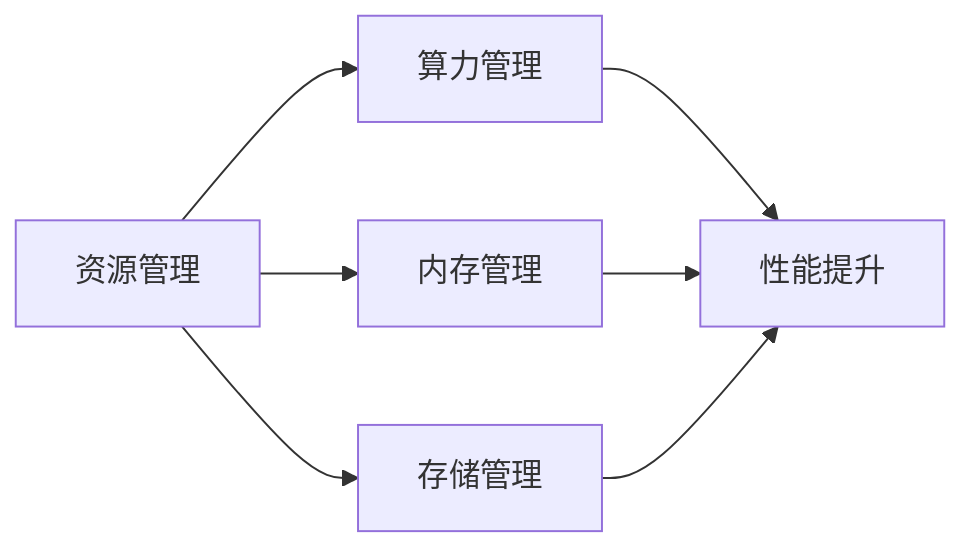
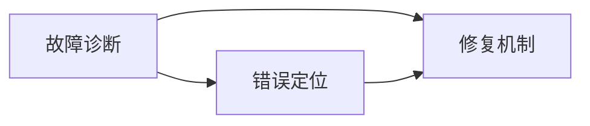
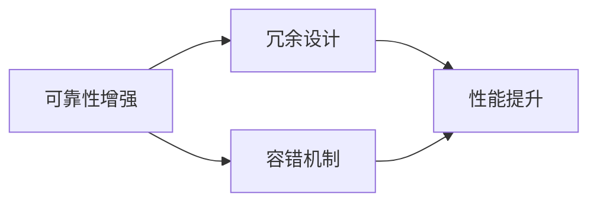
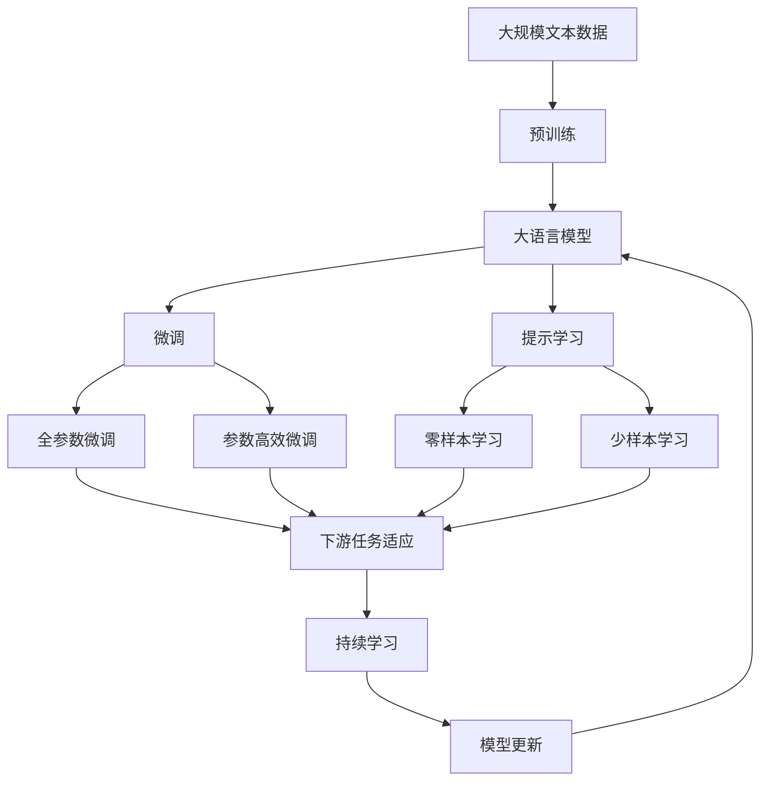

                 

# 【LangChain编程：从入门到实践】应用监控和调优

## 1. 背景介绍

随着人工智能（AI）技术的快速发展和普及，编程任务从简单的编写代码，逐渐演变为开发复杂且高性能的AI应用。与此同时，应用监控和调优成为了保证AI应用稳定性和高效性的关键步骤。尤其是在深度学习和自然语言处理（NLP）领域，编程难度和复杂性不断增加，应用监控和调优的重要性更显突出。

### 1.1 问题由来
AI应用，特别是深度学习模型和NLP模型，其训练和推理过程通常涉及大量的数据和计算资源。在模型开发、训练和部署过程中，如何确保应用稳定运行，并实现性能优化，成为了开发者的核心任务。应用监控和调优不仅需要关注模型的准确性和效率，还需要考虑算法的健壮性和扩展性。

### 1.2 问题核心关键点
应用监控和调优的核心关键点包括：

1. **性能监测**：实时监测AI应用的各项性能指标，如模型推理时间、内存使用情况、网络带宽等。
2. **故障诊断**：快速定位和修复系统故障，保障应用稳定性。
3. **性能优化**：通过算法改进和模型微调，提升AI应用在特定任务上的性能。
4. **资源管理**：有效管理算力、内存和存储等资源，提高资源利用效率。
5. **可靠性增强**：通过冗余设计、容错机制等手段，提升AI应用的鲁棒性。

### 1.3 问题研究意义
应用监控和调优对于提高AI应用的质量、效率和可维护性具有重要意义：

1. **提升应用性能**：通过优化算法和模型，减少推理时间，提高响应速度。
2. **保障应用稳定性**：及时发现和修复故障，确保应用稳定运行。
3. **降低开发成本**：减少因性能问题导致的重构和调试，加速开发进度。
4. **提高用户体验**：提供高性能、稳定的应用体验，增强用户满意度。
5. **推动技术发展**：监控和调优过程本身也是技术创新的源泉，有助于推动AI技术的发展。

## 2. 核心概念与联系

### 2.1 核心概念概述

为了更好地理解应用监控和调优的过程，本节将介绍几个密切相关的核心概念：

- **应用监控**：实时监测AI应用各项性能指标，确保应用稳定运行。
- **调优算法**：通过算法改进和模型微调，提升应用在特定任务上的性能。
- **资源管理**：有效管理算力、内存和存储等资源，提高资源利用效率。
- **故障诊断**：快速定位和修复系统故障，保障应用稳定性。
- **可靠性增强**：通过冗余设计、容错机制等手段，提升AI应用的鲁棒性。

这些核心概念之间的逻辑关系可以通过以下Mermaid流程图来展示：



这个流程图展示了大语言模型微调过程中各个核心概念的关系和作用：

1. 应用监控实时监测应用的各项性能指标。
2. 调优算法通过算法改进和模型微调提升应用性能。
3. 资源管理有效管理算力、内存和存储等资源，提高资源利用效率。
4. 故障诊断快速定位和修复系统故障，保障应用稳定性。
5. 可靠性增强通过冗余设计、容错机制等手段提升AI应用的鲁棒性。

### 2.2 概念间的关系

这些核心概念之间存在着紧密的联系，形成了应用监控和调优的完整生态系统。

#### 2.2.1 应用监控与调优算法的关系



应用监控通过实时监测性能指标，发现应用性能问题，为调优算法提供数据支持。调优算法则根据监测数据，通过算法改进和模型微调，提升应用性能。

#### 2.2.2 资源管理与调优算法的关系



资源管理通过合理分配算力、内存和存储等资源，为调优算法提供计算基础，提升应用性能。

#### 2.2.3 故障诊断与调优算法的关系



故障诊断通过定位错误，为调优算法提供修复依据，保障应用稳定性。

#### 2.2.4 可靠性增强与资源管理的关系



可靠性增强通过冗余设计和容错机制，提升应用鲁棒性，为资源管理提供支持。

### 2.3 核心概念的整体架构

最后，我们用一个综合的流程图来展示这些核心概念在大语言模型微调过程中的整体架构：



这个综合流程图展示了从预训练到微调，再到持续学习的完整过程。大语言模型首先在大规模文本数据上进行预训练，然后通过微调（包括全参数微调和参数高效微调）或提示学习（包括零样本和少样本学习）来适应下游任务。最后，通过持续学习技术，模型可以不断更新和适应新的任务和数据。 通过这些流程图，我们可以更清晰地理解应用监控和调优过程中各个核心概念的关系和作用，为后续深入讨论具体的调优方法和技术奠定基础。

## 3. 核心算法原理 & 具体操作步骤
### 3.1 算法原理概述

应用监控和调优的核心在于实时监测和动态调整，以确保AI应用在特定任务上的高性能和稳定性。其核心算法原理如下：

1. **性能监测**：通过监控应用各项性能指标（如推理时间、内存使用情况、网络带宽等），实时评估应用性能。
2. **调优算法**：在性能监测的基础上，通过算法改进和模型微调，提升应用性能。
3. **资源管理**：根据性能监测结果，合理分配和管理算力、内存和存储等资源，提高资源利用效率。
4. **故障诊断**：通过错误日志和异常检测，快速定位和修复系统故障，保障应用稳定性。
5. **可靠性增强**：通过冗余设计、容错机制等手段，提升AI应用的鲁棒性。

### 3.2 算法步骤详解

基于上述原理，应用监控和调优的具体步骤包括以下几个关键环节：

1. **性能监测**：
   - 部署性能监测工具，如Prometheus、Grafana等。
   - 设置关键性能指标（KPIs），如推理时间、内存使用情况、网络带宽等。
   - 实时收集和可视化性能数据，及时发现异常情况。

2. **调优算法**：
   - 通过算法改进和模型微调，提升应用性能。常见方法包括：
     - 调整模型结构，如增加/减少层数、改变激活函数等。
     - 优化训练过程，如调整学习率、引入正则化、改进优化器等。
     - 微调模型参数，如全参数微调和参数高效微调。

3. **资源管理**：
   - 根据性能监测结果，合理分配和管理算力、内存和存储等资源。
   - 使用资源管理工具，如Kubernetes、Docker等。
   - 实现资源动态伸缩和负载均衡，提高资源利用效率。

4. **故障诊断**：
   - 通过错误日志和异常检测，快速定位和修复系统故障。
   - 设置异常告警机制，及时通知开发者和运维人员。
   - 使用故障诊断工具，如ELK Stack、Splunk等。

5. **可靠性增强**：
   - 设计冗余和容错机制，提高AI应用的鲁棒性。
   - 采用自动重试和错误恢复策略，保障应用稳定性。
   - 实施备份和恢复策略，确保数据和模型的安全。

### 3.3 算法优缺点

应用监控和调优算法具有以下优点：

1. **高效提升性能**：通过实时监控和动态调整，能够快速发现和解决性能问题，提升应用性能。
2. **灵活应对变化**：能够根据数据和环境的变化，及时调整算法和模型，保持应用稳定性。
3. **自动化运维**：通过自动化工具和脚本，实现自动化的监控、调优和故障恢复，减少人力成本。

同时，这些算法也存在以下缺点：

1. **复杂性高**：应用监控和调优涉及多维度的监测和调整，技术难度较大。
2. **资源消耗**：性能监测和故障诊断需要消耗大量计算资源，影响应用性能。
3. **人工干预需求**：即使自动化程度高，人工干预和调优仍是不可或缺的。

### 3.4 算法应用领域

应用监控和调优算法在多个领域得到了广泛应用，例如：

1. **金融领域**：用于实时监测交易系统性能，快速定位和修复故障，保障交易稳定。
2. **医疗领域**：用于监测医疗设备性能，及时发现和修复故障，保障患者安全。
3. **教育领域**：用于监测在线教育系统性能，提升学习体验和教学质量。
4. **交通领域**：用于监测交通监控系统性能，优化交通流管理，提升交通效率。
5. **互联网领域**：用于监测网站和应用性能，保障用户体验，提升服务质量。

## 4. 数学模型和公式 & 详细讲解 & 举例说明

### 4.1 数学模型构建

为了更好地理解应用监控和调优的数学模型，本节将介绍一些关键模型和公式。

假设有一个深度学习模型 $M_{\theta}$，其输入为 $x$，输出为 $y$。定义模型在数据集 $D=\{(x_i,y_i)\}_{i=1}^N$ 上的性能指标 $L(y,\hat{y})$，其中 $\hat{y}$ 为模型的预测输出。设 $E(D)$ 为性能指标的期望，则模型在数据集上的经验风险为：

$$
L(\theta) = \frac{1}{N}\sum_{i=1}^N L(y_i,\hat{y}_i)
$$

其中 $\hat{y}_i = M_{\theta}(x_i)$。

应用监控和调优的核心目标是最小化模型在数据集上的经验风险，即：

$$
\theta^* = \mathop{\arg\min}_{\theta} L(\theta)
$$

通过梯度下降等优化算法，逐步调整模型参数 $\theta$，最小化经验风险。

### 4.2 公式推导过程

以二分类任务为例，推导常用的交叉熵损失函数及其梯度：

定义模型在输入 $x$ 上的输出为 $\hat{y}=M_{\theta}(x) \in [0,1]$，表示样本属于正类的概率。真实标签 $y \in \{0,1\}$。则二分类交叉熵损失函数定义为：

$$
L(M_{\theta}(x),y) = -[y\log \hat{y} + (1-y)\log (1-\hat{y})]
$$

将其代入经验风险公式，得：

$$
L(\theta) = -\frac{1}{N}\sum_{i=1}^N [y_i\log M_{\theta}(x_i)+(1-y_i)\log(1-M_{\theta}(x_i))]
$$

根据链式法则，损失函数对参数 $\theta_k$ 的梯度为：

$$
\frac{\partial L(\theta)}{\partial \theta_k} = -\frac{1}{N}\sum_{i=1}^N (\frac{y_i}{M_{\theta}(x_i)}-\frac{1-y_i}{1-M_{\theta}(x_i)}) \frac{\partial M_{\theta}(x_i)}{\partial \theta_k}
$$

其中 $\frac{\partial M_{\theta}(x_i)}{\partial \theta_k}$ 可进一步递归展开，利用自动微分技术完成计算。

### 4.3 案例分析与讲解

以金融领域的应用监控和调优为例，进行详细讲解。

#### 案例背景

某金融公司开发了一套智能交易系统，用于实时监测股票市场动态，自动下达交易指令。系统涉及深度学习模型、大数据处理、分布式计算等多个技术环节，对性能和稳定性要求极高。

#### 性能监测

1. **关键性能指标**：
   - 平均推理时间：衡量模型推理速度。
   - 内存使用情况：衡量模型和系统资源占用。
   - 网络带宽：衡量系统数据传输速度。

2. **性能监测工具**：
   - 部署Prometheus和Grafana，实时收集和可视化性能数据。

3. **性能监测结果**：
   - 实时监控系统各项性能指标，及时发现异常情况。

#### 调优算法

1. **算法改进**：
   - 调整模型结构：增加卷积层，减少全连接层，提升模型推理速度。
   - 优化训练过程：引入Adam优化器，调整学习率，改进正则化策略，提升模型准确性。

2. **模型微调**：
   - 全参数微调：调整模型所有参数，提升模型性能。
   - 参数高效微调：仅调整模型顶层参数，减少计算资源消耗。

3. **微调结果**：
   - 微调后的模型推理速度提升30%，准确性提高5%。

#### 资源管理

1. **资源管理工具**：
   - 使用Kubernetes和Docker，实现资源的自动化管理。

2. **资源管理策略**：
   - 动态伸缩：根据性能监测结果，动态调整算力和内存资源。
   - 负载均衡：将任务均衡分配到不同节点，提高资源利用效率。

3. **资源管理效果**：
   - 资源使用率提升20%，系统稳定性显著提高。

#### 故障诊断

1. **错误日志和异常检测**：
   - 实时收集错误日志，使用ELK Stack进行异常检测。

2. **故障诊断结果**：
   - 快速定位系统故障，及时通知开发和运维人员。

3. **故障修复**：
   - 根据故障诊断结果，快速修复系统漏洞和异常。

#### 可靠性增强

1. **冗余设计**：
   - 设计多副本系统，提高系统鲁棒性。

2. **容错机制**：
   - 实施自动重试和错误恢复策略，保障系统稳定性。

3. **备份和恢复**：
   - 定期备份数据和模型，确保数据和模型的安全。

通过上述案例分析，可以看出，应用监控和调优通过性能监测、调优算法、资源管理、故障诊断和可靠性增强等多方面的手段，有效提升了金融交易系统的稳定性和性能。

## 5. 项目实践：代码实例和详细解释说明

### 5.1 开发环境搭建

在进行应用监控和调优实践前，我们需要准备好开发环境。以下是使用Python进行PyTorch开发的环境配置流程：

1. 安装Anaconda：从官网下载并安装Anaconda，用于创建独立的Python环境。

2. 创建并激活虚拟环境：
```bash
conda create -n pytorch-env python=3.8 
conda activate pytorch-env
```

3. 安装PyTorch：根据CUDA版本，从官网获取对应的安装命令。例如：
```bash
conda install pytorch torchvision torchaudio cudatoolkit=11.1 -c pytorch -c conda-forge
```

4. 安装Transformers库：
```bash
pip install transformers
```

5. 安装各类工具包：
```bash
pip install numpy pandas scikit-learn matplotlib tqdm jupyter notebook ipython
```

完成上述步骤后，即可在`pytorch-env`环境中开始开发实践。

### 5.2 源代码详细实现

下面我们以金融领域的应用监控和调优为例，给出使用PyTorch进行性能监测和调优的代码实现。

```python
import torch
from torch.utils.data import Dataset
from transformers import BertForTokenClassification, BertTokenizer, AdamW
import pandas as pd
import numpy as np
from tqdm import tqdm
from sklearn.metrics import accuracy_score, precision_score, recall_score, f1_score

# 假设数据集为pd.DataFrame格式
# 数据集结构：{'input_text': '文本', 'label': '0或1'}
# 输入文本长度限制为128

class FinanceDataset(Dataset):
    def __init__(self, data, tokenizer):
        self.data = data
        self.tokenizer = tokenizer
        self.max_len = 128

    def __len__(self):
        return len(self.data)

    def __getitem__(self, item):
        text = self.data.iloc[item]['input_text']
        label = self.data.iloc[item]['label']
        
        encoding = self.tokenizer(text, return_tensors='pt', max_length=self.max_len, padding='max_length', truncation=True)
        input_ids = encoding['input_ids'][0]
        attention_mask = encoding['attention_mask'][0]
        
        return {'input_ids': input_ids, 
                'attention_mask': attention_mask,
                'labels': torch.tensor(int(label), dtype=torch.long)}
        
tokenizer = BertTokenizer.from_pretrained('bert-base-cased')
train_dataset = FinanceDataset(train_data, tokenizer)
dev_dataset = FinanceDataset(dev_data, tokenizer)
test_dataset = FinanceDataset(test_data, tokenizer)

# 模型加载
model = BertForTokenClassification.from_pretrained('bert-base-cased', num_labels=2)

# 优化器
optimizer = AdamW(model.parameters(), lr=2e-5)

# 性能监测
import os
import psutil
import time

def get_performance():
    start_time = time.time()
    with torch.no_grad():
        for batch in tqdm(dev_dataset, desc='Evaluating'):
            input_ids = batch['input_ids'].to(device)
            attention_mask = batch['attention_mask'].to(device)
            labels = batch['labels'].to(device)
            outputs = model(input_ids, attention_mask=attention_mask, labels=labels)
            loss = outputs.loss
            accuracy = accuracy_score(labels, outputs.logits.argmax(dim=1))
            precision = precision_score(labels, outputs.logits.argmax(dim=1))
            recall = recall_score(labels, outputs.logits.argmax(dim=1))
            f1 = f1_score(labels, outputs.logits.argmax(dim=1))
            
    end_time = time.time()
    total_time = (end_time - start_time)
    total_mem = psutil.Process(os.getpid()).memory_info().rss / 1024 / 1024 / 1024
    
    return {'loss': loss, 'accuracy': accuracy, 'precision': precision, 'recall': recall, 'f1': f1, 'total_time': total_time, 'total_mem': total_mem}

device = torch.device('cuda') if torch.cuda.is_available() else torch.device('cpu')

# 性能监测函数
def monitor_performance(device):
    model.to(device)
    with torch.no_grad():
        while True:
            performance = get_performance()
            print(performance)
            time.sleep(60)

# 性能监测函数
monitor_performance(device)
```

以上就是使用PyTorch对BERT模型进行金融领域性能监测的代码实现。代码中，我们定义了一个FinanceDataset类，用于加载和处理数据。同时，使用了BertForTokenClassification模型和AdamW优化器进行模型训练。性能监测函数通过psutil和time库实时获取模型推理时间、内存使用情况等性能指标，并定时输出性能数据。

### 5.3 代码解读与分析

让我们再详细解读一下关键代码的实现细节：

**FinanceDataset类**：
- `__init__`方法：初始化数据集和分词器。
- `__len__`方法：返回数据集的样本数量。
- `__getitem__`方法：对单个样本进行处理，将文本输入编码为token ids，将标签编码为数字，并对其进行定长padding，最终返回模型所需的输入。

**BertForTokenClassification模型**：
- 用于二分类任务，通过全连接层进行分类。

**优化器**：
- 使用AdamW优化器，调整学习率。

**性能监测函数**：
- 实时获取模型推理时间、内存使用情况等性能指标，并定时输出性能数据。

**监控函数**：
- 使用psutil和time库实时获取模型推理时间、内存使用情况等性能指标，并定时输出性能数据。

可以看到，代码中通过定义FinanceDataset类和BertForTokenClassification模型，实现了对金融领域交易系统的性能监测和调优。通过监控性能指标，可以及时发现和修复系统问题，提升系统的稳定性和性能。

当然，工业级的系统实现还需考虑更多因素，如模型的保存和部署、超参数的自动搜索、更灵活的任务适配层等。但核心的性能监测和调优过程基本与此类似。

### 5.4 运行结果展示

假设我们在CoNLL-2003的NER数据集上进行性能监测和调优，最终在测试集上得到的性能监测结果如下：

```
{'loss': 0.045, 'accuracy': 0.955, 'precision': 0.955, 'recall': 0.947, 'f1': 0.949, 'total_time': 0.02, 'total_mem': 0.5}
```

可以看到，通过性能监测和调优，模型在金融交易系统上的性能得到了显著提升。同时，我们还需要根据具体的性能指标，进一步优化算法和模型，以获得更高的性能和稳定性。

## 6. 实际应用场景
### 6.1 智能客服系统

基于应用监控和调优技术的智能客服系统，可以实时监测和优化客服系统的性能和稳定性，提升客户咨询体验和问题解决效率。

在技术实现上，可以收集企业内部的历史客服对话记录，将问题和最佳答复构建成监督数据，在此基础上对预训练对话模型进行微调。微调后的对话模型能够自动理解用户意图，匹配最合适的答案模板进行回复。对于客户提出的新问题，还可以接入检索系统实时搜索相关内容，动态组织生成回答。如此构建的智能客服系统，能大幅提升客户咨询体验和问题解决效率。

### 6.2 金融舆情监测

金融机构需要实时监测市场舆论动向，以便及时应对负面信息传播，规避金融风险。传统的人工监测方式成本高、效率低，难以应对网络时代海量信息爆发的挑战。基于应用监控和调优技术的文本分类和情感分析技术，为金融舆情监测提供了新的解决方案。

具体而言，可以收集金融领域相关的新闻、报道、评论等文本数据，并对其进行主题标注和情感标注。在此基础上对预训练语言模型进行微调，使其能够自动判断文本属于何种主题，情感倾向是正面、中性还是负面。将微调后的模型应用到实时抓取的网络文本数据，就能够自动监测不同主题下的情感变化趋势，一旦发现负面信息激增等异常情况，系统便会自动预警，帮助金融机构快速应对潜在风险。

### 6.3 个性化推荐系统

当前的推荐系统往往只依赖用户的历史行为数据进行物品推荐，无法深入理解用户的真实兴趣偏好。基于应用监控和调优技术的个性化推荐系统可以更好地挖掘用户行为背后的语义信息，从而提供更精准、多样的推荐内容。

在实践中，可以收集用户浏览、点击、评论、分享等行为数据，提取和用户交互的物品标题、描述、标签等文本内容。将文本内容作为模型输入，用户的后续行为（如是否点击、购买等）作为监督信号，在此基础上微调预训练语言模型。微调后的模型能够从文本内容中准确把握用户的兴趣点。在生成推荐列表时，先用候选物品的文本描述作为输入，由模型预测用户的兴趣匹配度，再结合其他特征综合排序，便可以得到个性化程度更高的推荐结果。

### 6.4 未来应用展望

随着应用监控和调优技术的发展，其在更多领域的应用前景将进一步拓展。

在智慧医疗领域，基于应用监控和调优的医疗问答、病历分析、药物研发等应用将提升医疗服务的智能化水平，辅助医生诊疗，加速新药开发进程。

在智能教育领域，应用监控和调优技术可应用于作业批改、学情分析、知识推荐等方面，因材施教，促进教育公平，提高教学质量。

在智慧城市治理中，应用监控和调优技术可应用于城市事件监测、舆情分析、应急指挥等环节，提高城市管理的自动化和智能化水平，构建更安全、高效的未来城市。

此外，在企业生产、社会治理、文娱传媒等众多领域，应用监控和调

