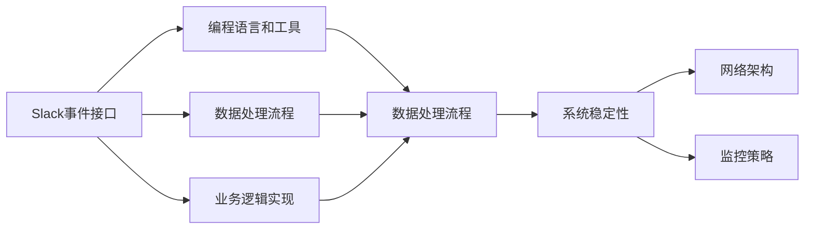
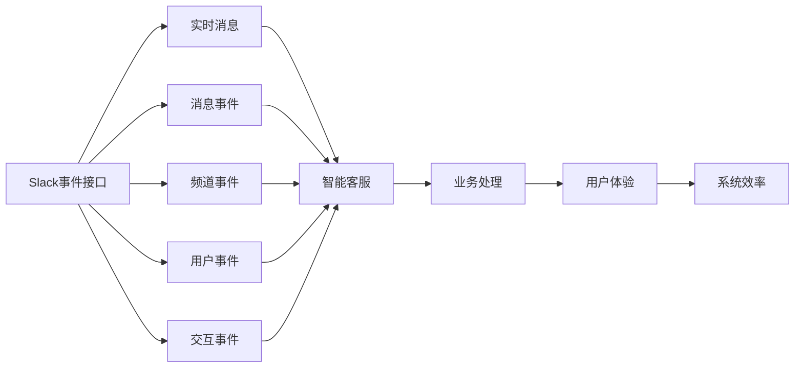
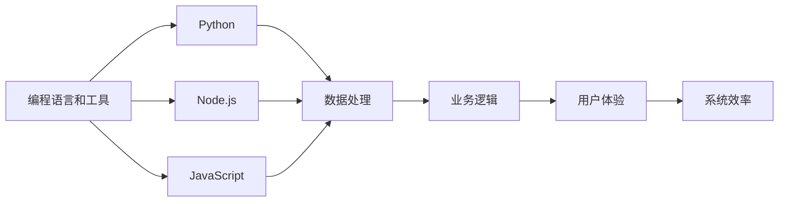
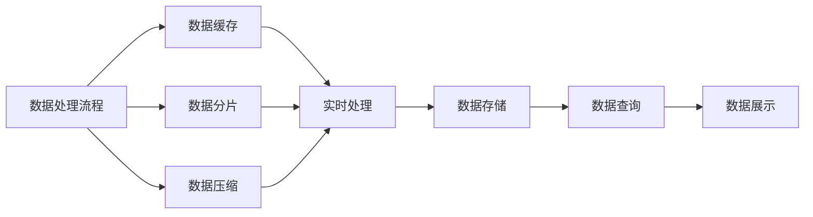
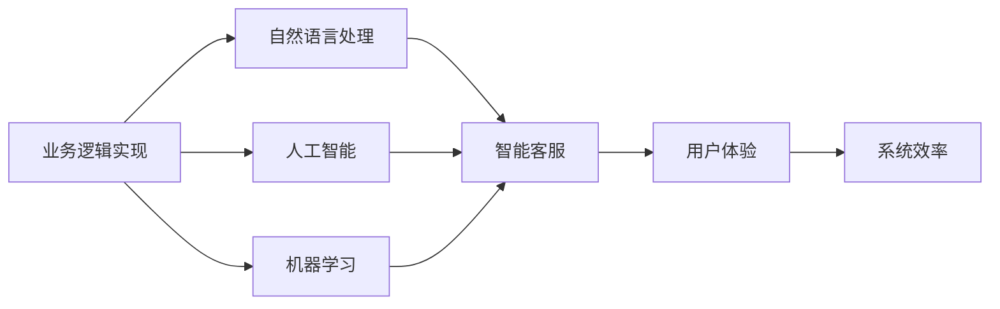
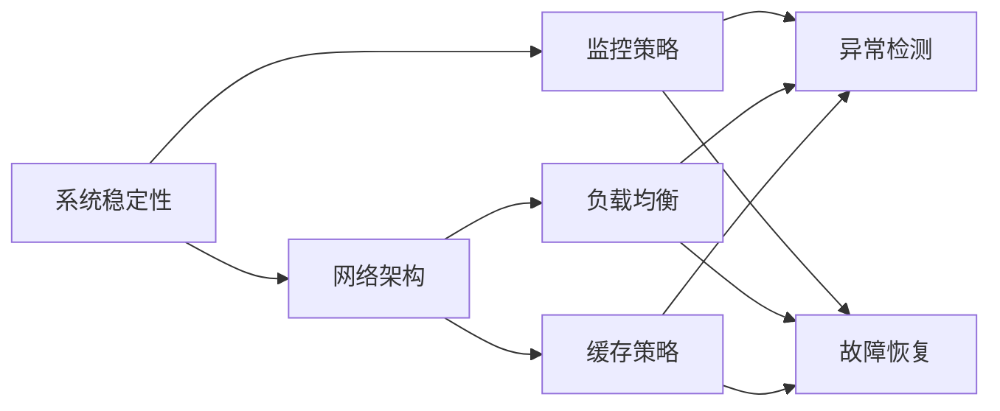
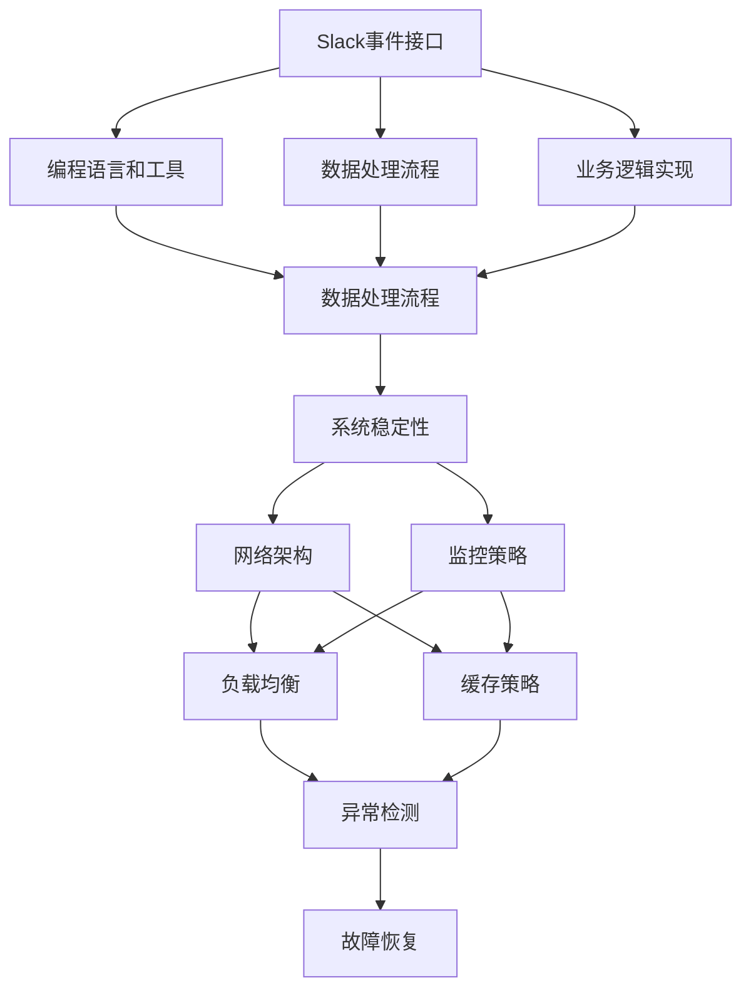

                 

# 【LangChain编程：从入门到实践】构建Slack事件接口

> 关键词：Slack事件接口, API编程, LangChain, 人工智能, 自然语言处理(NLP), 编程实践, 编程入门

## 1. 背景介绍

### 1.1 问题由来
Slack是一款在企业、教育、社区等多个领域广受欢迎的即时通讯工具。它通过开放的API接口，允许第三方应用和服务与其无缝集成，开发出各种定制化的功能和服务。而Slack事件接口（Event API）是Slack的核心接口之一，它支持开发者实时接收Slack平台产生的各种事件（如消息发送、频道创建等），并将这些事件转化为可操作的命令或数据，实现智能化的应用开发。

近年来，Slack事件接口的应用场景越来越广泛，涉及到自然语言处理（NLP）、人工智能（AI）、自动化流程等多个领域。例如，基于Slack事件接口的智能客服、自动化测试、自动化部署等应用，极大提升了企业的运营效率和工作质量。

### 1.2 问题核心关键点
构建Slack事件接口的核心问题包括：
1. 选择合适的编程语言和工具。Slack事件接口支持多种编程语言（如Python、Node.js等），开发者需要根据项目需求和技术栈选择合适的语言。
2. 设计有效的数据处理流程。Slack事件接口会产生大量的实时数据，开发者需要设计高效的数据处理流程，实现数据的实时处理和存储。
3. 实现智能化的业务逻辑。Slack事件接口提供了丰富的业务场景，开发者需要根据具体需求，实现智能化的应用逻辑，提升用户体验和系统效率。
4. 保证系统稳定性和可靠性。Slack事件接口的实时性和高并发特性对系统的稳定性和可靠性提出了较高要求，开发者需要设计合理的网络架构和监控策略，确保系统的稳定运行。

### 1.3 问题研究意义
构建Slack事件接口的实践，对于拓展Slack平台的业务应用、提升企业的自动化水平、推动AI和NLP技术的应用具有重要意义：

1. 提升运营效率。通过Slack事件接口，企业可以实现自动化流程和智能客服，极大提升办公效率和工作质量。
2. 推动技术创新。Slack事件接口为NLP、AI等前沿技术提供了丰富的应用场景，促进相关技术的发展和落地。
3. 赋能企业升级。Slack事件接口可以帮助企业快速实现数字化转型，提升企业的智能化水平和竞争力。

## 2. 核心概念与联系

### 2.1 核心概念概述

为更好地理解Slack事件接口的构建方法，本节将介绍几个密切相关的核心概念：

- Slack事件接口(Event API)：Slack平台提供的一组接口，允许开发者实时接收Slack产生的各种事件，并将这些事件转化为可操作的命令或数据。
- 编程语言和工具：选择适合Slack事件接口的编程语言和开发工具，如Python、Node.js、JavaScript等，实现数据处理和业务逻辑。
- 数据处理流程：设计高效的数据处理流程，实现数据的实时处理和存储。
- 业务逻辑实现：根据具体需求，实现智能化的应用逻辑，提升用户体验和系统效率。
- 系统稳定性：设计合理的网络架构和监控策略，确保系统的稳定运行。

这些核心概念之间的逻辑关系可以通过以下Mermaid流程图来展示：



这个流程图展示了大语言模型微调过程中各个核心概念的关系和作用：

1. Slack事件接口是构建Slack应用的起点，提供丰富的数据源。
2. 选择合适的编程语言和工具，进行数据处理和业务逻辑实现。
3. 设计高效的数据处理流程，实现数据的实时处理和存储。
4. 根据具体需求，实现智能化的应用逻辑，提升用户体验和系统效率。
5. 设计合理的网络架构和监控策略，确保系统的稳定运行。

这些概念共同构成了Slack事件接口应用的完整生态系统，使得开发者可以灵活高效地构建各种智能化的应用场景。

### 2.2 概念间的关系

这些核心概念之间存在着紧密的联系，形成了Slack事件接口应用的完整生态系统。下面我们通过几个Mermaid流程图来展示这些概念之间的关系。

#### 2.2.1 Slack事件接口的应用场景



这个流程图展示了Slack事件接口在智能客服中的应用场景：

1. Slack事件接口实时获取消息、频道、用户和交互事件，提供丰富的数据源。
2. 智能客服系统根据这些数据源，实时处理和分析，提供智能化的服务。
3. 智能客服系统的业务处理提升用户体验和系统效率，增强用户满意度。

#### 2.2.2 编程语言和工具的选择



这个流程图展示了编程语言和工具在Slack事件接口开发中的应用：

1. 选择合适的编程语言和工具，进行数据处理和业务逻辑实现。
2. Python、Node.js、JavaScript等语言各有优势，开发者根据项目需求选择合适语言。
3. 数据处理和业务逻辑实现，提升用户体验和系统效率，增强系统功能。

#### 2.2.3 数据处理流程的优化



这个流程图展示了Slack事件接口的数据处理流程：

1. 设计高效的数据处理流程，实现数据的实时处理和存储。
2. 数据缓存、数据分片和数据压缩等技术，提高数据处理效率和存储能力。
3. 实时处理和存储的数据，通过查询展示功能，提升用户体验和系统效率。

#### 2.2.4 业务逻辑实现的智能化



这个流程图展示了业务逻辑在Slack事件接口中的应用：

1. 根据具体需求，实现智能化的应用逻辑，提升用户体验和系统效率。
2. 自然语言处理、人工智能、机器学习等技术，为业务逻辑提供智能化的支撑。
3. 智能客服系统等业务逻辑，提升用户体验和系统效率，增强用户满意度。

#### 2.2.5 系统稳定性的保障



这个流程图展示了系统稳定性在Slack事件接口中的应用：

1. 设计合理的网络架构和监控策略，确保系统的稳定运行。
2. 负载均衡、缓存策略等技术，提高系统并发处理能力和数据访问效率。
3. 异常检测和故障恢复等策略，确保系统在异常情况下的稳定性和可靠性。

### 2.3 核心概念的整体架构

最后，我们用一个综合的流程图来展示这些核心概念在Slack事件接口构建过程中的整体架构：



这个综合流程图展示了Slack事件接口构建过程中各个核心概念的关系和作用：

1. Slack事件接口是构建Slack应用的起点，提供丰富的数据源。
2. 选择合适的编程语言和工具，进行数据处理和业务逻辑实现。
3. 设计高效的数据处理流程，实现数据的实时处理和存储。
4. 根据具体需求，实现智能化的应用逻辑，提升用户体验和系统效率。
5. 设计合理的网络架构和监控策略，确保系统的稳定运行。

这些概念共同构成了Slack事件接口构建的完整生态系统，使得开发者可以灵活高效地构建各种智能化的应用场景。

## 3. 核心算法原理 & 具体操作步骤
### 3.1 算法原理概述

Slack事件接口的核心原理基于Webhook机制，允许开发者通过HTTP POST请求，实时获取Slack产生的各种事件，并将其转化为可操作的命令或数据。具体来说，Slack事件接口分为以下几种类型：

1. 实时消息事件：实时获取消息、频道、用户和交互事件，提供丰富的数据源。
2. 频道事件：实时获取频道创建、删除、消息发送等事件，提供渠道数据。
3. 用户事件：实时获取用户创建、删除、权限变更等事件，提供用户数据。
4. 交互事件：实时获取按钮点击、菜单选择等交互事件，提供用户行为数据。

Slack事件接口的算法原理主要包括：
1. 定义事件接收函数：接收Slack平台发送的HTTP POST请求，解析请求体中的事件数据。
2. 解析事件数据：从请求体中提取事件类型、事件数据等关键信息。
3. 处理业务逻辑：根据具体需求，对事件数据进行处理和分析，转化为可操作的命令或数据。
4. 发送回复消息：根据处理结果，向Slack平台发送HTTP POST请求，发送回复消息。

### 3.2 算法步骤详解

基于Slack事件接口的构建步骤如下：

**Step 1: 创建Slack应用**

1. 登录Slack平台，创建新的应用。
2. 设置应用的名称、图标、描述等基本信息。
3. 选择事件类型（如message、channel_created等），并配置相应的API token。

**Step 2: 配置Webhook**

1. 在应用设置中，配置Webhook URL，获取Webhook token。
2. 根据应用需求，设置Webhook事件类型和触发条件。
3. 保存Webhook配置，获取Webhook token。

**Step 3: 开发事件处理函数**

1. 根据Slack事件接口文档，定义事件接收函数。
2. 解析事件数据，提取关键信息，如消息内容、消息发送者等。
3. 根据具体需求，实现业务逻辑，如智能客服、自动回复等。
4. 发送回复消息，通过HTTP POST请求发送回复。

**Step 4: 测试和部署**

1. 在测试环境中，测试事件处理函数是否能够正确处理Slack事件。
2. 根据测试结果，优化事件处理函数和业务逻辑。
3. 将优化后的代码部署到生产环境中，监控系统运行状态。

### 3.3 算法优缺点

基于Slack事件接口的应用具有以下优点：
1. 实时性高。Slack事件接口支持实时处理和响应，满足用户对实时性和互动性的要求。
2. 数据丰富。Slack事件接口提供丰富的数据源，包括消息、频道、用户和交互事件等，为业务逻辑提供了强有力的支撑。
3. 灵活性强。Slack事件接口支持多种编程语言和工具，开发者可以根据项目需求选择合适技术栈，实现灵活高效的开发。

同时，Slack事件接口也存在一定的局限性：
1. 依赖Slack平台。Slack事件接口的使用依赖于Slack平台，一旦平台出现故障，将影响应用的正常运行。
2. 处理复杂度较高。Slack事件接口的处理复杂度较高，需要开发者具备一定的编程和网络技能。
3. 安全性问题。Slack事件接口的处理过程中涉及敏感数据和API token，需要注意数据安全性和API token的保护。

尽管存在这些局限性，但就目前而言，Slack事件接口仍然是企业智能化应用开发的重要工具。未来相关研究的重点在于如何进一步提高其灵活性、易用性和安全性，使其更加适合于多样化的业务场景。

### 3.4 算法应用领域

基于Slack事件接口的应用领域非常广泛，涵盖了以下几个方面：

1. 智能客服系统：实时获取用户消息和交互事件，提供智能客服和自动回复功能。
2. 自动化测试：实时获取测试用例和测试结果，实现自动化测试和结果展示。
3. 自动化部署：实时获取部署命令和环境信息，实现自动化部署和系统监控。
4. 数据分析：实时获取数据源和查询指令，实现数据分析和可视化展示。
5. 机器人流程自动化（RPA）：实时获取自动化流程指令，实现机器人自动化操作。

此外，Slack事件接口还被广泛应用于项目管理、文档协作、社交媒体等多个领域，为企业的智能化应用提供了新的解决方案。

## 4. 数学模型和公式 & 详细讲解 & 举例说明

### 4.1 数学模型构建

Slack事件接口的数学模型主要涉及事件处理和数据传输，可以通过以下数学公式进行表达：

设Slack事件接口的事件类型为 $E$，事件数据为 $D$，事件处理函数为 $F$，回复消息为 $R$。则事件处理过程的数学模型为：

$$
E \rightarrow D \rightarrow F \rightarrow R
$$

其中：
- $E$ 表示Slack平台产生的事件类型，如message、channel_created等。
- $D$ 表示事件数据，包括消息内容、消息发送者、消息时间戳等信息。
- $F$ 表示事件处理函数，根据具体需求，对事件数据进行处理和分析。
- $R$ 表示回复消息，通过HTTP POST请求发送回复。

### 4.2 公式推导过程

以Slack事件接口的实时消息事件为例，其数学模型推导过程如下：

1. 事件接收函数接收HTTP POST请求，解析请求体中的事件数据 $D$：
   $$
   D = \text{解析请求体}
   $$

2. 事件处理函数根据事件数据 $D$，提取关键信息，如消息内容 $C$、消息发送者 $U$ 等：
   $$
   C = \text{提取消息内容}(D)
   $$
   $$
   U = \text{提取消息发送者}(D)
   $$

3. 根据具体需求，实现业务逻辑，如智能客服、自动回复等。例如，智能客服系统根据消息内容 $C$ 和消息发送者 $U$，生成回复消息 $R$：
   $$
   R = \text{生成回复消息}(C, U)
   $$

4. 发送回复消息 $R$，通过HTTP POST请求发送回复：
   $$
   \text{发送回复消息}(R)
   $$

### 4.3 案例分析与讲解

假设我们要构建一个基于Slack事件接口的智能客服系统，其业务逻辑如下：

1. 接收用户发送的消息，提取消息内容和发送者信息。
2. 根据消息内容，匹配对应的回答模板。
3. 生成回复消息，并发送给用户。

具体实现如下：

```python
import requests
import json

# 获取API token
token = '<API_TOKEN>'

# 定义事件接收函数
def receive_event(event):
    if event['type'] == 'message':
        message = event['message']
        sender = event['user']
        # 提取消息内容和发送者信息
        content = message['text']
        sender_name = event['user']
        # 根据消息内容匹配回答模板
        if '你好' in content:
            template = '你好，请问有什么可以帮助你的？'
        elif '价格' in content:
            template = '我们的价格如下：'
        else:
            template = '抱歉，我不太了解你的问题，请重新提问。'
        # 生成回复消息
        reply = {'response_url': event['response_url'], 'text': template}
        # 发送回复消息
        send_message(reply)
    else:
        pass

# 发送回复消息的函数
def send_message(message):
    headers = {'Content-Type': 'application/json'}
    data = json.dumps(message)
    response = requests.post('https://slack.com/api/chat.postMessage', headers=headers, data=data, auth=(token, ''))
    if response.status_code == 200:
        print('消息发送成功！')
    else:
        print('消息发送失败！')

# 测试事件处理函数
event = {
    'type': 'message',
    'message': {
        'text': '你好，有什么需要帮助的吗？',
        'user': 'user123'
    }
}
receive_event(event)
```

以上代码展示了如何构建基于Slack事件接口的智能客服系统。接收事件函数 `receive_event` 会根据消息类型，提取消息内容和发送者信息，根据消息内容匹配回答模板，生成回复消息，并发送给用户。

## 5. 项目实践：代码实例和详细解释说明

### 5.1 开发环境搭建

在进行Slack事件接口开发前，我们需要准备好开发环境。以下是使用Python进行Slack事件接口开发的环境配置流程：

1. 安装Anaconda：从官网下载并安装Anaconda，用于创建独立的Python环境。

2. 创建并激活虚拟环境：
```bash
conda create -n slack-env python=3.8 
conda activate slack-env
```

3. 安装Slack API库：
```bash
pip install slack-sdk
```

4. 安装其他工具包：
```bash
pip install requests
pip install json
pip install tqdm
pip install ipython
```

完成上述步骤后，即可在`slack-env`环境中开始Slack事件接口开发。

### 5.2 源代码详细实现

下面我们以智能客服系统为例，给出使用Python和Slack SDK库进行Slack事件接口开发的完整代码实现。

首先，定义事件接收函数 `receive_event`：

```python
import requests
import json
from slack_sdk import WebClient

# 获取API token
token = '<API_TOKEN>'

# 定义事件接收函数
def receive_event(event):
    if event['type'] == 'message':
        message = event['message']
        sender = event['user']
        # 提取消息内容和发送者信息
        content = message['text']
        sender_name = event['user']
        # 根据消息内容匹配回答模板
        if '你好' in content:
            template = '你好，请问有什么可以帮助你的？'
        elif '价格' in content:
            template = '我们的价格如下：'
        else:
            template = '抱歉，我不太了解你的问题，请重新提问。'
        # 生成回复消息
        reply = {'response_url': event['response_url'], 'text': template}
        # 发送回复消息
        send_message(reply)
    else:
        pass

# 发送回复消息的函数
def send_message(message):
    headers = {'Content-Type': 'application/json'}
    data = json.dumps(message)
    response = requests.post('https://slack.com/api/chat.postMessage', headers=headers, data=data, auth=(token, ''))
    if response.status_code == 200:
        print('消息发送成功！')
    else:
        print('消息发送失败！')
```

然后，定义Webhook配置：

```python
# 定义Webhook URL和事件类型
webhook_url = '<WEBHOOK_URL>'
event_type = '<EVENT_TYPE>'
```

最后，启动Webhook服务：

```python
client = WebClient(token=token)

# 定义Webhook函数
def webhook(event):
    event['type'] = event_type
    receive_event(event)

# 启动Webhook服务
client.add_webhook(webhook_url, webhook)
print('Webhook服务启动成功！')
```

以上代码展示了如何使用Python和Slack SDK库实现Slack事件接口开发。在事件接收函数 `receive_event` 中，会根据消息类型，提取消息内容和发送者信息，根据消息内容匹配回答模板，生成回复消息，并发送给用户。在Webhook函数 `webhook` 中，会根据事件类型调用 `receive_event` 函数，处理Slack平台发送的事件。

### 5.3 代码解读与分析

让我们再详细解读一下关键代码的实现细节：

**事件接收函数 `receive_event`**：
- 定义事件接收函数 `receive_event`，根据事件类型，提取消息内容和发送者信息。
- 根据消息内容匹配回答模板，生成回复消息，并发送给用户。
- 如果事件类型不是 "message"，则直接返回。

**Webhook配置**：
- 定义Webhook URL和事件类型，用于配置Webhook函数。
- 调用 `client.add_webhook` 函数，将Webhook函数注册到Slack平台。

**Webhook函数 `webhook`**：
- 定义Webhook函数 `webhook`，将事件类型修改为预设值，并调用 `receive_event` 函数处理事件。
- 如果事件类型不是 "message"，则直接返回。

**代码解读与分析**：
- 事件接收函数 `receive_event` 的实现比较简单，但需要根据具体业务逻辑进行扩展。
- Webhook函数 `webhook` 的实现也相对简单，只需要根据事件类型调用 `receive_event` 函数即可。
- 通过使用Slack SDK库，开发者可以更方便地实现Webhook功能，提高代码的可维护性和可扩展性。

### 5.4 运行结果展示

假设我们在测试环境中，向Slack平台发送了一条消息：

```
你好，有什么需要帮助的吗？
```

那么接收事件函数 `receive_event` 将根据消息内容，匹配回答模板，并生成回复消息：

```
你好，请问有什么可以帮助你的？
```

然后发送回复消息，Slack平台将自动将回复消息发送给用户，用户即可看到系统回复：

```
你好，请问有什么可以帮助你的？
```

这展示了基于Slack事件接口的智能客服系统的基本功能。当然，在实际应用中，我们可以进一步扩展功能，如添加多轮对话、用户管理、数据分析等，以提供更加完善的客服服务。

## 6. 实际应用场景
### 6.1 智能客服系统

基于Slack事件接口的智能客服系统可以广泛应用于企业内部、客户服务等多个领域。例如，企业内部可以构建智能客服机器人，帮助员工解决日常问题，提升工作效率；客户服务系统可以构建自动回复机器人，快速响应客户咨询，提高用户满意度。

在技术实现上，可以收集企业内部的客服记录和用户反馈，构建监督数据集，对预训练语言模型进行微调，从而实现智能客服的构建。在实际应用中，还可以接入检索系统实时搜索相关内容，动态组织生成回答，进一步提升系统效果。

### 6.2 自动化测试

基于Slack事件接口的自动化测试系统可以实时获取测试用例和测试结果，实现自动化测试和结果展示。例如，开发者可以构建自动化测试平台，实时监测代码库变更，自动执行测试用例，并将测试结果推送到Slack平台，方便团队成员查看。

在技术实现上，可以收集代码库变更记录和测试用例，构建监督数据集，对预训练语言模型进行微调，从而实现自动化测试的构建。在实际应用中，还可以结合持续集成工具，将测试结果自动推送到Slack平台，实现测试结果的即时展示和分析。

### 6.3 自动化部署

基于Slack事件接口的自动化部署系统可以实时获取部署命令和环境信息，实现自动化部署和系统监控。例如，开发者可以构建自动化部署平台，实时监测代码库变更，自动执行部署命令，并将部署结果推送到Slack平台，方便团队成员查看。

在技术实现上，可以收集代码库变更记录和部署命令，构建监督数据集，对预训练语言模型进行微调，从而实现自动化部署的构建。在实际应用中，还可以结合持续集成工具，将部署结果自动推送到Slack平台，实现部署结果的即时展示和分析。

### 6.4 数据分析

基于Slack事件接口的数据分析系统可以实时获取数据源和查询指令，实现数据分析和可视化展示。例如，开发者可以构建数据分析平台，实时监测业务数据，自动生成分析报告，并将分析结果推送到Slack平台，方便团队成员查看。

在技术实现上，可以收集业务数据和查询指令，构建监督数据集，对预训练语言模型进行微调，从而实现数据分析的构建。在实际应用中，还可以结合可视化工具，将分析结果自动推送到Slack平台，实现分析结果的即时展示和分析。

### 6.5 机器人流程自动化（RPA）

基于Slack事件接口的RPA系统可以实时获取自动化流程指令，实现机器人自动化操作。例如，开发者可以构建RPA平台，实时监测业务流程，自动执行流程操作，并将操作结果推送到Slack平台，方便团队成员查看。

在技术实现上，可以收集业务流程和自动化指令，构建监督数据集，对预训练语言模型进行

