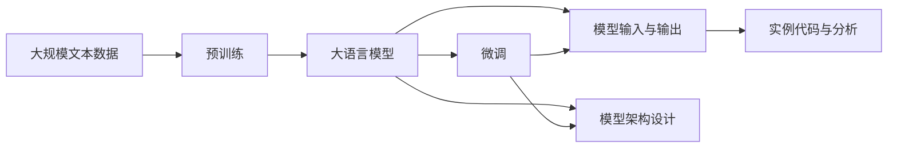

                 

# 【LangChain编程：从入门到实践】模型输入与输出

> 关键词：
- 自然语言处理(NLP)
- 模型输入与输出
- 预训练模型
- 微调(Fine-tuning)
- 模型架构设计
- 实例代码与分析

## 1. 背景介绍

### 1.1 问题由来

近年来，随着深度学习技术的快速发展，自然语言处理(NLP)领域取得了巨大的突破。基于大规模预训练语言模型的大语言模型（Large Language Model，LLM），如BERT、GPT-3等，在文本分类、情感分析、机器翻译等任务上取得了前所未有的成绩。这些大语言模型通过在海量无标签文本数据上进行预训练，学习到丰富的语言知识，通过微调（Fine-tuning），能够在特定任务上取得优异的性能。

然而，预训练模型的输入输出设计直接决定了模型的效果和使用方式。如何高效、准确地设计模型的输入和输出接口，以适配不同任务的需求，是每个开发者都必须面对的问题。本文将从模型输入与输出的角度，全面介绍大语言模型编程的核心概念、实现步骤和典型应用，为读者提供深入的理解和实用的技巧。

### 1.2 问题核心关键点

本文聚焦于大语言模型的输入输出设计，主要围绕以下几个核心问题展开：

- 如何选择合适的输入格式，最大化模型的语义理解能力？
- 如何设计输出格式，使模型的预测结果易于理解和使用？
- 如何利用预训练模型的能力，高效地适配下游任务？
- 如何结合微调技术，进一步提升模型的性能？

这些问题在大语言模型开发过程中至关重要。良好的输入输出设计能够显著提高模型的效果，降低开发成本，促进模型的广泛应用。

### 1.3 问题研究意义

研究大语言模型的输入输出设计，对于拓展大语言模型的应用范围，提升模型的性能和实用性，具有重要意义：

1. 提高模型效果：合适的输入输出设计能够显著提升模型的语义理解能力和预测精度。
2. 降低开发成本：高效的设计能够简化模型接口，减少开发和调试的复杂度。
3. 促进模型应用：简洁易用的输入输出接口，使得模型更容易被各种应用系统集成。
4. 提升用户体验：良好的输出格式设计，能够使模型预测结果易于理解和操作。

## 2. 核心概念与联系

### 2.1 核心概念概述

为更好地理解大语言模型的输入输出设计，本节将介绍几个密切相关的核心概念：

- **大语言模型(Large Language Model, LLM)**：以自回归(如GPT)或自编码(如BERT)模型为代表的大规模预训练语言模型。通过在大规模无标签文本语料上进行预训练，学习通用的语言表示，具备强大的语言理解和生成能力。

- **预训练(Pre-training)**：指在大规模无标签文本语料上，通过自监督学习任务训练通用语言模型的过程。常见的预训练任务包括言语建模、遮挡语言模型等。

- **微调(Fine-tuning)**：指在预训练模型的基础上，使用下游任务的少量标注数据，通过有监督学习优化模型在特定任务上的性能。通常只需要调整顶层分类器或解码器，并以较小的学习率更新全部或部分的模型参数。

- **模型输入与输出**：模型的输入是用于模型计算的特征数据，输出是模型根据输入数据生成的预测结果。输入输出格式的设计直接影响模型的性能和使用方式。

- **模型架构设计**：模型的层次结构、组件选择和连接方式，直接关系到模型的复杂度和计算效率。

- **实例代码与分析**：通过具体的编程实例，展示模型输入输出设计的方法和技巧，并进行详细分析。

这些核心概念之间的逻辑关系可以通过以下Mermaid流程图来展示：


这个流程图展示了大语言模型从预训练到微调，再到输入输出设计的整体过程。预训练模型通过微调，适应特定任务的需求，设计良好的输入输出接口，使得模型能够高效地进行推理和应用。

### 2.2 概念间的关系

这些核心概念之间存在着紧密的联系，形成了大语言模型的完整生态系统。下面我们通过几个Mermaid流程图来展示这些概念之间的关系。

#### 2.2.1 大语言模型的学习范式


这个流程图展示了大语言模型的三种主要学习范式：预训练、微调和输入输出设计。预训练主要采用自监督学习方法，而微调则是有监督学习的过程。输入输出设计则是在微调的基础上，进一步优化模型的接口，使其能够适配下游任务。

#### 2.2.2 微调与输入输出设计的联系


这个流程图展示了微调和输入输出设计的关系。微调通过优化模型的内部结构，使其能够更好地适应下游任务，而输入输出设计则通过优化接口，使得模型更加直观、易用。

#### 2.2.3 模型架构设计与输入输出设计的联系


这个流程图展示了模型架构设计与输入输出设计的关系。良好的模型架构设计能够提升模型的计算效率和灵活性，而输入输出设计则通过合理的数据格式，使模型输出更加易于理解和操作。

### 2.3 核心概念的整体架构

最后，我们用一个综合的流程图来展示这些核心概念在大语言模型微调过程中的整体架构：



这个综合流程图展示了从预训练到微调，再到输入输出设计和架构优化的完整过程。大语言模型首先在大规模文本数据上进行预训练，然后通过微调，适应特定任务的需求。在设计良好的输入输出接口和模型架构的支撑下，模型能够高效地进行推理和应用。

## 3. 核心算法原理 & 具体操作步骤
### 3.1 算法原理概述

大语言模型的输入输出设计，本质上是一个模型优化和接口设计的过程。其核心思想是：通过合理选择输入输出格式，最大化模型的语义理解能力和预测精度，同时优化模型的计算效率和可扩展性，以适应不同的下游任务需求。

形式化地，假设预训练语言模型为 $M_{\theta}$，其中 $\theta$ 为预训练得到的模型参数。给定下游任务 $T$ 的标注数据集 $D=\{(x_i, y_i)\}_{i=1}^N, x_i \in \mathcal{X}, y_i \in \mathcal{Y}$，模型输入输出设计的过程可以描述为：

1. 选择合适的输入格式 $\mathcal{X}$ 和输出格式 $\mathcal{Y}$，使得 $M_{\theta}$ 能够在 $\mathcal{X}$ 上高效计算，并在 $\mathcal{Y}$ 上输出合理的预测结果。
2. 设计模型架构 $N$，在 $M_{\theta}$ 的层次结构和组件选择上进行调整，以适应下游任务 $T$ 的需求。
3. 使用微调技术，在标注数据集 $D$ 上优化模型参数 $\theta$，最小化损失函数 $\mathcal{L}$，使得 $M_{\theta}$ 在特定任务 $T$ 上的表现最佳。

通过梯度下降等优化算法，微调过程不断更新模型参数 $\theta$，最小化损失函数 $\mathcal{L}$，使得模型输出逼近真实标签。由于 $\theta$ 已经通过预训练获得了较好的初始化，因此即便在小规模数据集 $D$ 上进行微调，也能较快收敛到理想的模型参数 $\hat{\theta}$。

### 3.2 算法步骤详解

大语言模型的输入输出设计主要包括以下几个关键步骤：

**Step 1: 确定输入输出格式**

- 输入格式 $\mathcal{X}$：根据任务需求，选择合适的特征表示形式。常见的输入格式包括：
  - 词向量表示：将文本转换为词嵌入，如Word2Vec、GloVe等。
  - 子词表示：如BERT中的token embedding，Subword NMT等。
  - 句子表示：如LSTM、GRU等序列模型。
- 输出格式 $\mathcal{Y}$：根据任务类型，设计相应的预测输出格式。常见的输出格式包括：
  - 标签序列：如分类任务的标签序列。
  - 概率分布：如语言模型的概率分布。
  - 句子表示：如摘要任务的句子表示。

**Step 2: 设计模型架构**

- 组件选择：根据任务需求，选择合适的组件和层次结构。常见的组件包括：
  - 编码器：如LSTM、GRU等序列模型。
  - 解码器：如LSTM、Transformer等。
  - 分类器：如线性分类器、softmax等。
- 连接方式：根据组件特性，设计合理的连接方式。常见的连接方式包括：
  - 串联：将多个组件按顺序连接。
  - 并联：将多个组件并行连接。
  - 融合：将多个组件的输出通过聚合函数（如Max Pooling、Average Pooling）进行融合。

**Step 3: 进行微调**

- 选择优化算法：如Adam、SGD等。
- 设置学习率：通常较小，以避免破坏预训练权重。
- 定义损失函数：根据任务类型，选择合适的损失函数。常见的损失函数包括：
  - 交叉熵损失：适用于分类任务。
  - 均方误差损失：适用于回归任务。
  - 交叉熵损失+L2正则：适用于分类任务，避免过拟合。
- 进行训练：在标注数据集上，使用梯度下降等优化算法，更新模型参数，最小化损失函数。

**Step 4: 评估模型性能**

- 在验证集上评估模型性能，选择合适的指标（如准确率、F1分数等）。
- 根据评估结果，调整模型参数，进行微调。

**Step 5: 部署模型**

- 将训练好的模型保存为可执行文件或模块，部署到实际应用中。
- 使用模型接口进行推理预测，实现模型应用。

以上是输入输出设计的完整流程。通过合理选择输入输出格式和组件连接方式，可以设计出高效、灵活、易于应用的大语言模型。

### 3.3 算法优缺点

大语言模型的输入输出设计具有以下优点：

- 灵活性高：根据任务需求，可以选择合适的输入输出格式和组件连接方式。
- 可扩展性强：可以通过微调和组件融合，适应不同的下游任务。
- 性能提升明显：合理的输入输出设计能够显著提升模型的语义理解能力和预测精度。

同时，该方法也存在以下局限性：

- 设计和调试复杂：输入输出设计和模型架构设计需要综合考虑多个因素，设计难度较大。
- 模型参数较多：大语言模型参数量庞大，对计算资源和存储资源要求较高。
- 可解释性不足：模型的输入输出设计通常较为复杂，难以解释模型的内部工作机制。

尽管存在这些局限性，但大语言模型的输入输出设计仍是当前NLP技术的重要组成部分。通过合理的输入输出设计，可以在不增加计算资源消耗的情况下，显著提升模型性能，推动NLP技术的进步。

### 3.4 算法应用领域

大语言模型的输入输出设计在NLP领域已经得到了广泛的应用，覆盖了几乎所有常见任务，例如：

- 文本分类：如情感分析、主题分类、意图识别等。通过输入文本和输出标签进行微调。
- 命名实体识别：识别文本中的人名、地名、机构名等特定实体。通过输入文本和输出标签进行微调。
- 关系抽取：从文本中抽取实体之间的语义关系。通过输入文本和输出关系三元组进行微调。
- 问答系统：对自然语言问题给出答案。通过输入问题和输出答案进行微调。
- 机器翻译：将源语言文本翻译成目标语言。通过输入源语言文本和输出目标语言文本进行微调。
- 文本摘要：将长文本压缩成简短摘要。通过输入文本和输出摘要进行微调。
- 对话系统：使机器能够与人自然对话。通过输入多轮对话历史和输出回复进行微调。

除了上述这些经典任务外，大语言模型的输入输出设计还被创新性地应用到更多场景中，如可控文本生成、常识推理、代码生成、数据增强等，为NLP技术带来了全新的突破。随着预训练模型和输入输出设计的持续演进，相信NLP技术将在更广阔的应用领域大放异彩。

## 4. 数学模型和公式 & 详细讲解 & 举例说明

### 4.1 数学模型构建

本节将使用数学语言对大语言模型的输入输出设计进行更加严格的刻画。

假设预训练语言模型为 $M_{\theta}$，其中 $\theta$ 为预训练得到的模型参数。给定下游任务 $T$ 的标注数据集 $D=\{(x_i, y_i)\}_{i=1}^N, x_i \in \mathcal{X}, y_i \in \mathcal{Y}$。

定义模型 $M_{\theta}$ 在输入 $x$ 上的输出为 $\hat{y}=M_{\theta}(x) \in \mathcal{Y}$，表示模型对输入 $x$ 的预测输出。

定义模型 $M_{\theta}$ 在输入 $x$ 上的损失函数为 $\ell(M_{\theta}(x),y)$，用于衡量模型输出 $\hat{y}$ 与真实标签 $y$ 之间的差异。常见的损失函数包括交叉熵损失、均方误差损失等。

将损失函数扩展到整个数据集 $D$ 上，得到经验风险 $\mathcal{L}(\theta)$：

$$
\mathcal{L}(\theta) = \frac{1}{N} \sum_{i=1}^N \ell(M_{\theta}(x_i),y_i)
$$

微调的优化目标是最小化经验风险 $\mathcal{L}(\theta)$，即找到最优参数：

$$
\theta^* = \mathop{\arg\min}_{\theta} \mathcal{L}(\theta)
$$

在实践中，我们通常使用基于梯度的优化算法（如Adam、SGD等）来近似求解上述最优化问题。设 $\eta$ 为学习率，$\lambda$ 为正则化系数，则参数的更新公式为：

$$
\theta \leftarrow \theta - \eta \nabla_{\theta}\mathcal{L}(\theta) - \eta\lambda\theta
$$

其中 $\nabla_{\theta}\mathcal{L}(\theta)$ 为损失函数对参数 $\theta$ 的梯度，可通过反向传播算法高效计算。

### 4.2 公式推导过程

以下我们以二分类任务为例，推导交叉熵损失函数及其梯度的计算公式。

假设模型 $M_{\theta}$ 在输入 $x$ 上的输出为 $\hat{y}=M_{\theta}(x) \in [0,1]$，表示样本属于正类的概率。真实标签 $y \in \{0,1\}$。则二分类交叉熵损失函数定义为：

$$
\ell(M_{\theta}(x),y) = -[y\log \hat{y} + (1-y)\log (1-\hat{y})]
$$

将其代入经验风险公式，得：

$$
\mathcal{L}(\theta) = -\frac{1}{N}\sum_{i=1}^N [y_i\log M_{\theta}(x_i)+(1-y_i)\log(1-M_{\theta}(x_i))]
$$

根据链式法则，损失函数对参数 $\theta_k$ 的梯度为：

$$
\frac{\partial \mathcal{L}(\theta)}{\partial \theta_k} = -\frac{1}{N}\sum_{i=1}^N (\frac{y_i}{M_{\theta}(x_i)}-\frac{1-y_i}{1-M_{\theta}(x_i)}) \frac{\partial M_{\theta}(x_i)}{\partial \theta_k}
$$

其中 $\frac{\partial M_{\theta}(x_i)}{\partial \theta_k}$ 可进一步递归展开，利用自动微分技术完成计算。

在得到损失函数的梯度后，即可带入参数更新公式，完成模型的迭代优化。重复上述过程直至收敛，最终得到适应下游任务的最优模型参数 $\theta^*$。

### 4.3 案例分析与讲解

以下我们将通过几个典型案例，展示如何在大语言模型上进行输入输出设计和微调。

#### 案例1：文本分类

在文本分类任务中，输入为文本 $x$，输出为标签 $y$。假设我们有一个包含1000个类别的分类任务，使用BERT进行微调。

**Step 1: 输入输出格式设计**

- 输入格式：BERT模型将文本转换为token embedding，并传递给分类器。
- 输出格式：分类器输出每个类别的概率，选择概率最大的类别作为预测标签。

**Step 2: 模型架构设计**

- 编码器：使用BERT作为预训练编码器。
- 分类器：添加一个全连接层进行分类，输出每个类别的概率分布。

**Step 3: 进行微调**

- 优化算法：AdamW
- 学习率：2e-5
- 损失函数：交叉熵损失
- 训练轮数：10

**Step 4: 评估模型性能**

- 在验证集上评估模型的F1分数，选择最佳模型进行微调。

**Step 5: 部署模型**

- 保存训练好的模型，部署到实际应用中。

#### 案例2：命名实体识别

在命名实体识别任务中，输入为文本 $x$，输出为实体标签序列 $y$。假设我们使用BERT进行微调。

**Step 1: 输入输出格式设计**

- 输入格式：BERT模型将文本转换为token embedding，并传递给解码器。
- 输出格式：解码器输出每个token的标签，标记出实体边界。

**Step 2: 模型架构设计**

- 编码器：使用BERT作为预训练编码器。
- 解码器：添加一个CRF层，进行序列标注。

**Step 3: 进行微调**

- 优化算法：AdamW
- 学习率：2e-5
- 损失函数：交叉熵损失
- 训练轮数：10

**Step 4: 评估模型性能**

- 在验证集上评估模型的F1分数，选择最佳模型进行微调。

**Step 5: 部署模型**

- 保存训练好的模型，部署到实际应用中。

#### 案例3：机器翻译

在机器翻译任务中，输入为源语言文本 $x$，输出为目标语言文本 $y$。假设我们使用GPT-3进行微调。

**Step 1: 输入输出格式设计**

- 输入格式：将源语言文本转换为token embedding，并传递给解码器。
- 输出格式：解码器输出目标语言文本。

**Step 2: 模型架构设计**

- 编码器：使用GPT-3作为预训练编码器。
- 解码器：添加一个解码器，生成目标语言文本。

**Step 3: 进行微调**

- 优化算法：AdamW
- 学习率：2e-5
- 损失函数：交叉熵损失
- 训练轮数：10

**Step 4: 评估模型性能**

- 在验证集上评估模型的BLEU分数，选择最佳模型进行微调。

**Step 5: 部署模型**

- 保存训练好的模型，部署到实际应用中。

## 5. 项目实践：代码实例和详细解释说明
### 5.1 开发环境搭建

在进行微调实践前，我们需要准备好开发环境。以下是使用Python进行PyTorch开发的环境配置流程：

1. 安装Anaconda：从官网下载并安装Anaconda，用于创建独立的Python环境。

2. 创建并激活虚拟环境：
```bash
conda create -n pytorch-env python=3.8 
conda activate pytorch-env
```

3. 安装PyTorch：根据CUDA版本，从官网获取对应的安装命令。例如：
```bash
conda install pytorch torchvision torchaudio cudatoolkit=11.1 -c pytorch -c conda-forge
```

4. 安装Transformers库：
```bash
pip install transformers
```

5. 安装各类工具包：
```bash
pip install numpy pandas scikit-learn matplotlib tqdm jupyter notebook ipython
```

完成上述步骤后，即可在`pytorch-env`环境中开始微调实践。

### 5.2 源代码详细实现

下面我们以命名实体识别(NER)任务为例，给出使用Transformers库对BERT模型进行微调的PyTorch代码实现。

首先，定义NER任务的数据处理函数：

```python
from transformers import BertTokenizer
from torch.utils.data import Dataset
import torch

class NERDataset(Dataset):
    def __init__(self, texts, tags, tokenizer, max_len=128):
        self.texts = texts
        self.tags = tags
        self.tokenizer = tokenizer
        self.max_len = max_len
        
    def __len__(self):
        return len(self.texts)
    
    def __getitem__(self, item):
        text = self.texts[item]
        tags = self.tags[item]
        
        encoding = self.tokenizer(text, return_tensors='pt', max_length=self.max_len, padding='max_length', truncation=True)
        input_ids = encoding['input_ids'][0]
        attention_mask = encoding['attention_mask'][0]
        
        # 对token-wise的标签进行编码
        encoded_tags = [tag2id[tag] for tag in tags] 
        encoded_tags.extend([tag2id['O']] * (self.max_len - len(encoded_tags)))
        labels = torch.tensor(encoded_tags, dtype=torch.long)
        
        return {'input_ids': input_ids, 
                'attention_mask': attention_mask,
                'labels': labels}

# 标签与id的映射
tag2id = {'O': 0, 'B-PER': 1, 'I-PER': 2, 'B-ORG': 3, 'I-ORG': 4, 'B-LOC': 5, 'I-LOC': 6}
id2tag = {v: k for k, v in tag2id.items()}

# 创建dataset
tokenizer = BertTokenizer.from_pretrained('bert-base-cased')

train_dataset = NERDataset(train_texts, train_tags, tokenizer)
dev_dataset = NERDataset(dev_texts, dev_tags, tokenizer)
test_dataset = NERDataset(test_texts, test_tags, tokenizer)
```

然后，定义模型和优化器：

```python
from transformers import BertForTokenClassification, AdamW

model = BertForTokenClassification.from_pretrained('bert-base-cased', num_labels=len(tag2id))

optimizer = AdamW(model.parameters(), lr=2e-5)
```

接着，定义训练和评估函数：

```python
from torch.utils.data import DataLoader
from tqdm import tqdm
from sklearn.metrics import classification_report

device = torch.device('cuda') if torch.cuda.is_available() else torch.device('cpu')
model.to(device)

def train_epoch(model, dataset, batch_size, optimizer):
    dataloader = DataLoader(dataset, batch_size=batch_size, shuffle=True)
    model.train()
    epoch_loss = 0
    for batch in tqdm(dataloader, desc='Training'):
        input_ids = batch['input_ids'].to(device)
        attention_mask = batch['attention_mask'].to(device)
        labels = batch['labels'].to(device)
        model.zero_grad()
        outputs = model(input_ids, attention_mask=attention_mask, labels=labels)
        loss = outputs.loss
        epoch_loss += loss.item()
        loss.backward()
        optimizer.step()
    return epoch_loss / len(dataloader)

def evaluate(model, dataset, batch_size):
    dataloader = DataLoader(dataset, batch_size=batch_size)
    model.eval()
    preds, labels = [], []
    with torch.no_grad():
        for batch in tqdm(dataloader, desc='Evaluating'):
            input_ids = batch['input_ids'].to(device)
            attention_mask = batch['attention_mask'].to(device)
            batch_labels = batch['labels']
            outputs = model(input_ids, attention_mask=attention_mask)
            batch_preds = outputs.logits.argmax(dim=2).to('cpu').tolist()
            batch_labels = batch_labels.to('cpu').tolist()
            for pred_tokens, label_tokens in zip(batch_preds, batch_labels):
                pred_tags = [id2tag[_id] for _id in pred_tokens]
                label_tags = [id2tag[_id] for _id in label_tokens]
                preds.append(pred_tags[:len(label_tokens)])
                labels.append(label_tags)
                
    print(classification_report(labels, preds))
```

最后，启动训练流程并在测试集上评估：

```python
epochs = 5
batch_size = 16

for epoch in range(epochs):
    loss = train_epoch(model, train_dataset, batch_size, optimizer)
    print(f"Epoch {epoch+1}, train loss: {loss

