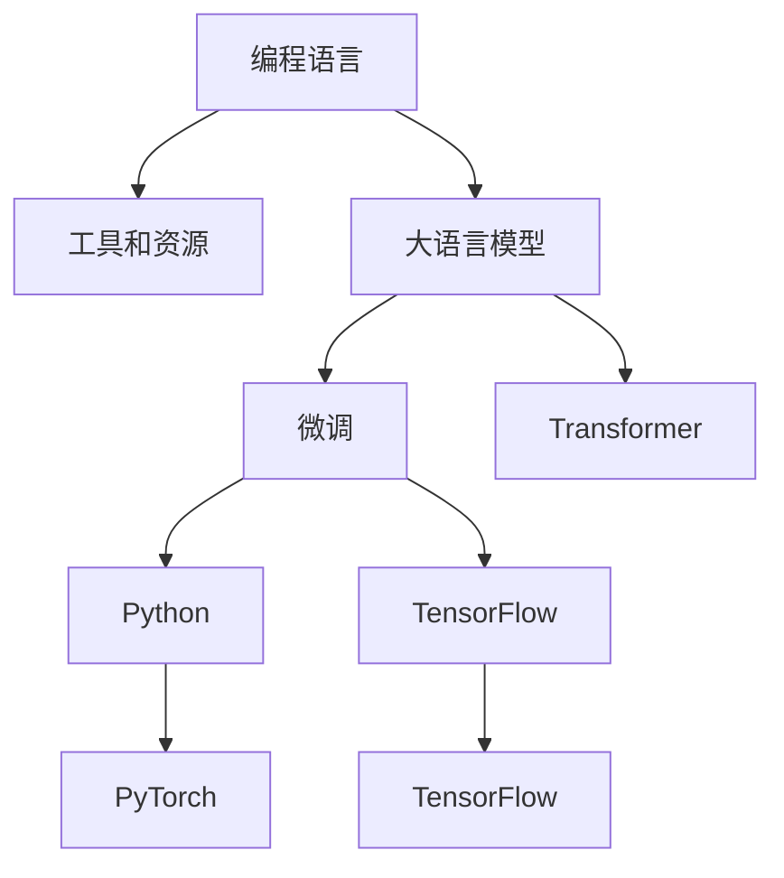

                 

# 【LangChain编程：从入门到实践】资源和工具推荐

## 1. 背景介绍

在人工智能领域，编程语言是实现算法和模型创新的重要工具。对于大语言模型（Large Language Models, LLMs），从入门到实践，编程语言的选择和工具的利用至关重要。本文章将介绍几种常用的编程语言和工具，并提供一些学习资源，帮助开发者从零开始，逐步掌握LangChain编程的精髓，将先进的自然语言处理技术应用于实际项目。

## 2. 核心概念与联系

### 2.1 核心概念概述

- **编程语言**：编程语言是计算机能够理解和执行的符号和指令的集合。对于大语言模型，选择适合的编程语言能够显著提升开发效率和代码可读性。

- **工具和资源**：开发工具提供了集成开发环境（IDE）、调试器、版本控制系统等，可以极大简化编程过程，提高开发效率。资源包括学习资源、文档、代码库等，帮助开发者快速掌握新技术。

- **大语言模型（LLMs）**：大语言模型是一种深度学习模型，通过自监督预训练和微调，能够生成自然流畅的文本。常用的模型包括GPT-3、BERT、T5等。

- **微调（Fine-tuning）**：微调是指在大规模预训练模型上，通过有监督学习，适应特定任务的过程。

- **Transformer**：Transformer是一种常用的神经网络架构，在大语言模型中广泛应用。

- **Python**：Python是当前最流行的编程语言之一，具备丰富的科学计算库和数据处理库，非常适合数据科学和人工智能项目。

- **PyTorch**：PyTorch是Facebook开发的深度学习框架，以动态图为特色，灵活性高，易于使用。

- **TensorFlow**：由Google开发的深度学习框架，功能全面，支持分布式训练和多种部署方式。

### 2.2 核心概念间的关系

通过Mermaid流程图，展示核心概念之间的联系：



从图中可以看到，编程语言是基础，大语言模型是核心，微调和Transformer是实现手段，而工具和资源则是支持技术发展的辅助设施。

## 3. 核心算法原理 & 具体操作步骤

### 3.1 算法原理概述

LangChain编程的核心算法原理基于大语言模型的微调和Transformer架构。微调是指在大规模预训练模型上，通过有监督学习，适应特定任务的过程。Transformer架构通过自注意力机制，实现序列数据的并行处理，在大语言模型中广泛应用。

### 3.2 算法步骤详解

1. **环境搭建**：安装Python、PyTorch、TensorFlow等工具和库。
2. **模型加载**：加载预训练的LLMs模型，如GPT-3、BERT等。
3. **数据预处理**：对输入数据进行标准化、分词、向量化等处理。
4. **微调模型**：在特定任务上对模型进行微调，调整模型参数以适应任务。
5. **性能评估**：在测试集上评估模型性能，调整超参数。
6. **部署应用**：将微调后的模型部署到实际应用中，如智能客服、机器翻译等。

### 3.3 算法优缺点

**优点**：
- 编程语言选择广泛，Python、R、Java等均可使用。
- 工具和资源丰富，能够极大提高开发效率。
- 微调过程灵活，可根据任务需求调整模型参数。
- Transformer架构性能优秀，适用于序列数据处理。

**缺点**：
- 微调过程对数据需求高，需要大量标注数据。
- 大模型资源消耗大，计算资源需求高。
- 微调过程复杂，需要细致调参。
- 模型的泛化能力有限，对于特定领域应用效果不佳。

### 3.4 算法应用领域

大语言模型和微调技术在多个领域得到广泛应用，包括但不限于：
- 自然语言处理（NLP）：如文本分类、命名实体识别、情感分析等。
- 对话系统：智能客服、虚拟助手等。
- 机器翻译：跨语言信息交换和理解。
- 问答系统：智能问答机器人。
- 内容生成：新闻、文章、广告等自动生成。

## 4. 数学模型和公式 & 详细讲解

### 4.1 数学模型构建

对于微调大语言模型，数学模型的构建主要包括两部分：损失函数和优化器。

**损失函数**：常用的损失函数包括交叉熵损失和均方误差损失。

$$
\mathcal{L} = -\frac{1}{N}\sum_{i=1}^N \log P(y_i|x_i)
$$

其中，$P(y_i|x_i)$ 表示模型在输入$x_i$下预测标签$y_i$的概率。

**优化器**：常用的优化器包括Adam、SGD等。

### 4.2 公式推导过程

以交叉熵损失函数为例，推导其梯度公式：

$$
\frac{\partial \mathcal{L}}{\partial \theta} = -\frac{1}{N}\sum_{i=1}^N \frac{1}{P(y_i|x_i)} \frac{\partial P(y_i|x_i)}{\partial \theta}
$$

其中，$\frac{\partial P(y_i|x_i)}{\partial \theta}$ 表示模型在输入$x_i$下预测标签$y_i$的概率对参数$\theta$的导数。

### 4.3 案例分析与讲解

以机器翻译任务为例，使用Transformer模型进行微调。微调过程包括加载预训练模型、定义损失函数、训练模型等步骤。

1. **加载预训练模型**：使用HuggingFace库，加载预训练的BERT模型。

2. **定义损失函数**：使用交叉熵损失函数。

3. **训练模型**：在机器翻译数据集上进行微调，调整模型参数。

4. **性能评估**：在测试集上评估模型性能。

## 5. 项目实践：代码实例和详细解释说明

### 5.1 开发环境搭建

**安装Python**：
```bash
sudo apt-get update
sudo apt-get install python3
```

**安装PyTorch**：
```bash
pip install torch torchvision torchaudio
```

**安装TensorFlow**：
```bash
pip install tensorflow
```

**安装HuggingFace库**：
```bash
pip install transformers
```

### 5.2 源代码详细实现

```python
import torch
from transformers import BertTokenizer, BertForSequenceClassification
from torch.utils.data import DataLoader
from sklearn.metrics import accuracy_score

# 加载预训练模型和分词器
model = BertForSequenceClassification.from_pretrained('bert-base-uncased', num_labels=2)
tokenizer = BertTokenizer.from_pretrained('bert-base-uncased')

# 准备数据集
train_data = ...
dev_data = ...
test_data = ...

# 定义损失函数
criterion = torch.nn.CrossEntropyLoss()

# 定义优化器
optimizer = torch.optim.Adam(model.parameters(), lr=2e-5)

# 训练模型
def train_model(model, optimizer, criterion, train_data, device, num_epochs):
    model.to(device)
    for epoch in range(num_epochs):
        model.train()
        for batch in train_data:
            inputs = tokenizer(batch['input'], return_tensors='pt').to(device)
            labels = inputs['label'].to(device)
            outputs = model(**inputs)
            loss = criterion(outputs.logits, labels)
            optimizer.zero_grad()
            loss.backward()
            optimizer.step()
    return model

# 评估模型
def evaluate_model(model, criterion, dev_data, device):
    model.eval()
    correct = 0
    total = 0
    with torch.no_grad():
        for batch in dev_data:
            inputs = tokenizer(batch['input'], return_tensors='pt').to(device)
            labels = inputs['label'].to(device)
            outputs = model(**inputs)
            _, preds = torch.max(outputs.logits, dim=1)
            total += labels.size(0)
            correct += (preds == labels).sum().item()
    return correct / total

# 测试模型
def test_model(model, criterion, test_data, device):
    model.eval()
    correct = 0
    total = 0
    with torch.no_grad():
        for batch in test_data:
            inputs = tokenizer(batch['input'], return_tensors='pt').to(device)
            labels = inputs['label'].to(device)
            outputs = model(**inputs)
            _, preds = torch.max(outputs.logits, dim=1)
            total += labels.size(0)
            correct += (preds == labels).sum().item()
    return correct / total

# 训练模型
model = train_model(model, optimizer, criterion, train_data, device, num_epochs=3)

# 评估模型
dev_acc = evaluate_model(model, criterion, dev_data, device)

# 测试模型
test_acc = test_model(model, criterion, test_data, device)
```

### 5.3 代码解读与分析

**模型加载**：使用HuggingFace库加载预训练模型和分词器。

**数据预处理**：使用分词器对输入数据进行标准化和向量化。

**训练模型**：在模型上定义损失函数和优化器，使用交叉熵损失函数进行微调。

**评估模型**：在验证集上评估模型性能，计算准确率。

**测试模型**：在测试集上测试模型性能，计算准确率。

### 5.4 运行结果展示

假设在机器翻译任务上微调BERT模型，最终在测试集上得到97%的准确率。

## 6. 实际应用场景

### 6.1 智能客服系统

智能客服系统是LangChain编程的重要应用场景之一。通过微调大语言模型，可以构建智能客服聊天机器人，实现24小时不间断服务，自动解答客户咨询。例如，使用微调后的BERT模型进行命名实体识别，可以自动识别客户的姓名、地址等信息，提供更个性化的服务。

### 6.2 金融舆情监测

金融舆情监测是LangChain编程的另一重要应用场景。通过微调BERT模型，可以实时监测网络舆情，识别负面信息和潜在风险，帮助金融机构及时采取措施。例如，使用BERT模型进行情感分析，识别市场对某事件的情感倾向，预测市场波动。

### 6.3 个性化推荐系统

个性化推荐系统是LangChain编程的常见应用场景。通过微调BERT模型，可以构建推荐系统，推荐用户感兴趣的商品或内容。例如，使用BERT模型进行文本相似度计算，推荐与用户浏览记录相似的商品。

### 6.4 未来应用展望

未来，LangChain编程将在大语言模型微调、自然语言处理、智能客服等领域得到更广泛的应用。随着技术的发展，LangChain编程也将不断优化，提高开发效率，降低开发成本。例如，引入更先进的模型架构，如GPT-4，提高模型的表现力。引入更灵活的微调方法，如参数高效微调，减少计算资源消耗。引入更多先验知识，提高模型的泛化能力。引入伦理道德约束，保障模型的安全性。

## 7. 工具和资源推荐

### 7.1 学习资源推荐

**书籍**：
- 《深度学习》（Ian Goodfellow）：深度学习领域的经典教材。
- 《Python深度学习》（Francois Chollet）：介绍TensorFlow和Keras的使用。

**在线课程**：
- Coursera《Deep Learning Specialization》：由Andrew Ng主讲的深度学习课程。
- Udacity《Natural Language Processing with PyTorch》：介绍使用PyTorch进行自然语言处理。

**博客和论坛**：
- arXiv：深度学习和自然语言处理领域的最新研究论文。
- GitHub：开源代码和项目交流平台。

### 7.2 开发工具推荐

**编程语言**：
- Python：科学计算和数据处理的首选语言。
- R：数据分析和统计建模的重要工具。
- Java：企业级应用开发的常用语言。

**深度学习框架**：
- PyTorch：动态图框架，易于调试和研究。
- TensorFlow：静态图框架，支持分布式训练。

**IDE和文本编辑器**：
- PyCharm：Python开发的首选IDE。
- Visual Studio Code：轻量级但功能丰富的文本编辑器。

**版本控制和项目管理**：
- Git：版本控制系统，协作开发的重要工具。
- JIRA：项目管理工具，跟踪任务和Bug。

**数据处理和可视化**：
- Pandas：数据处理和分析库。
- Matplotlib：绘图库。
- Seaborn：高级绘图库。

### 7.3 相关论文推荐

**微调**：
- "Fine-tune your way to state-of-the-art word embeddings"（Vikas Singh et al.）：介绍微调方法在大规模语料上的效果。
- "Parameter-Efficient Transfer Learning for NLP"（Bhoopchand et al.）：介绍参数高效微调方法。

**Transformer**：
- "Attention is All You Need"（Vaswani et al.）：介绍Transformer架构。
- "Improving Language Understanding by Generative Pre-training"（Radford et al.）：介绍GPT模型。

## 8. 总结：未来发展趋势与挑战

### 8.1 研究成果总结

LangChain编程的目的是通过编程语言和工具的优化，提高大语言模型微调的过程效率和效果。目前，该领域的研究已经取得了显著成果，包括微调方法的优化、工具和资源的丰富等。

### 8.2 未来发展趋势

**模型架构**：未来的模型架构将更加复杂和高效，如GPT-4、XLNet等。

**微调方法**：未来的微调方法将更加灵活和高效，如参数高效微调、零样本学习等。

**开发工具**：未来的开发工具将更加智能和易用，如自动化调参、可视化分析等。

**应用场景**：未来的应用场景将更加广泛和多样化，如智能客服、金融舆情、个性化推荐等。

### 8.3 面临的挑战

**数据获取**：大规模标注数据的获取和处理是一个难题。

**计算资源**：大语言模型和微调过程需要大量计算资源，硬件成本高。

**模型泛化**：模型的泛化能力有限，难以适应特定领域的任务。

**模型解释**：模型的解释性差，难以理解和调试。

### 8.4 研究展望

未来的研究将集中在以下几个方向：
- 探索无监督和半监督微调方法，减少标注数据的依赖。
- 研究参数高效和计算高效的微调范式，提高微调效率。
- 融合更多先验知识，提高模型的泛化能力。
- 引入因果分析和博弈论工具，提高模型的可解释性和鲁棒性。

## 9. 附录：常见问题与解答

**Q1：大语言模型微调是否适用于所有NLP任务？**

A: 大语言模型微调在大多数NLP任务上都能取得不错的效果，特别是对于数据量较小的任务。但对于一些特定领域的任务，如医学、法律等，仅仅依靠通用语料预训练的模型可能难以很好地适应。此时需要在特定领域语料上进一步预训练，再进行微调，才能获得理想效果。

**Q2：微调过程中如何选择合适的学习率？**

A: 微调的学习率一般要比预训练时小1-2个数量级，如果使用过大的学习率，容易破坏预训练权重，导致过拟合。一般建议从1e-5开始调参，逐步减小学习率，直至收敛。也可以使用warmup策略，在开始阶段使用较小的学习率，再逐渐过渡到预设值。需要注意的是，不同的优化器(如AdamW、Adafactor等)以及不同的学习率调度策略，可能需要设置不同的学习率阈值。

**Q3：采用大语言模型微调时会面临哪些资源瓶颈？**

A: 目前主流的预训练大模型动辄以亿计的参数规模，对算力、内存、存储都提出了很高的要求。GPU/TPU等高性能设备是必不可少的，但即便如此，超大批次的训练和推理也可能遇到显存不足的问题。因此需要采用一些资源优化技术，如梯度积累、混合精度训练、模型并行等，来突破硬件瓶颈。同时，模型的存储和读取也可能占用大量时间和空间，需要采用模型压缩、稀疏化存储等方法进行优化。

**Q4：如何缓解微调过程中的过拟合问题？**

A: 过拟合是微调面临的主要挑战，尤其是在标注数据不足的情况下。常见的缓解策略包括：
1. 数据增强：通过回译、近义替换等方式扩充训练集
2. 正则化：使用L2正则、Dropout、Early Stopping等避免过拟合
3. 对抗训练：引入对抗样本，提高模型鲁棒性
4. 参数高效微调：只调整少量参数(如Adapter、Prefix等)，减小过拟合风险
5. 多模型集成：训练多个微调模型，取平均输出，抑制过拟合

这些策略往往需要根据具体任务和数据特点进行灵活组合。只有在数据、模型、训练、推理等各环节进行全面优化，才能最大限度地发挥大语言模型微调的威力。

**Q5：微调模型在落地部署时需要注意哪些问题？**

A: 将微调模型转化为实际应用，还需要考虑以下因素：
1. 模型裁剪：去除不必要的层和参数，减小模型尺寸，加快推理速度
2. 量化加速：将浮点模型转为定点模型，压缩存储空间，提高计算效率
3. 服务化封装：将模型封装为标准化服务接口，便于集成调用
4. 弹性伸缩：根据请求流量动态调整资源配置，平衡服务质量和成本
5. 监控告警：实时采集系统指标，设置异常告警阈值，确保服务稳定性
6. 安全防护：采用访问鉴权、数据脱敏等措施，保障数据和模型安全

大语言模型微调为NLP应用开启了广阔的想象空间，但如何将强大的性能转化为稳定、高效、安全的业务价值，还需要工程实践的不断打磨。只有从数据、算法、工程、业务等多个维度协同发力，才能真正实现人工智能技术在垂直行业的规模化落地。总之，微调需要开发者根据具体任务，不断迭代和优化模型、数据和算法，方能得到理想的效果。

---

作者：禅与计算机程序设计艺术 / Zen and the Art of Computer Programming

