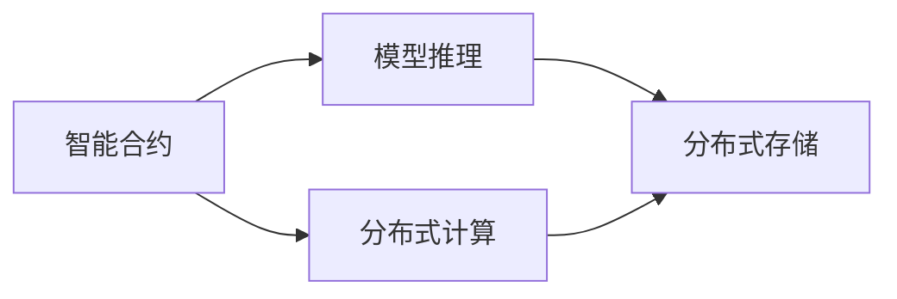

                 

# 【LangChain编程：从入门到实践】链模块

## 1. 背景介绍

随着区块链技术的发展，以比特币为代表的加密货币逐渐走出实验室，迈向大众市场。然而，区块链的存储和计算资源有限，难以处理大规模应用场景。为此，语义区块链应运而生，它在保证安全性、去中心化的前提下，通过人工智能技术提升区块链的计算能力，使其更易于大规模落地。

### 1.1 语义区块链的起源

语义区块链是继公有链、联盟链和私有链之后的第四类区块链。它通过在区块链网络中引入人工智能的智能合约，实现更高效、更安全的去中心化计算。语义区块链的核心思想是，将人工智能模型的推理过程封装成智能合约，通过区块链的分布式共识机制，在网络中协同计算，实现大规模的推理任务。

### 1.2 语义区块链的优势

相较于传统区块链，语义区块链通过引入人工智能技术，能够有效提升计算效率，降低存储成本，增强智能合约的灵活性，从而推动区块链技术向实际应用场景中的大规模落地。

- **计算效率**：语义区块链通过智能合约封装推理任务，通过分布式计算实现大规模推理，效率远高于传统区块链。
- **存储成本**：语义区块链采用模型推理的方式，只保存推理模型和少量关键中间结果，大幅降低存储成本。
- **智能合约灵活性**：智能合约封装推理模型，可以根据应用需求自由定制，提升合约灵活性。
- **实际应用场景**：语义区块链面向实际应用场景，如智能合约、共识算法、去中心化应用等，带来更多落地机会。

## 2. 核心概念与联系

### 2.1 核心概念概述

为更好地理解语义区块链，本节将介绍几个密切相关的核心概念：

- **语义区块链(Semantic Blockchain)**：基于区块链技术，结合人工智能的智能合约，实现分布式计算、推理和存储的新型区块链。
- **智能合约(Smart Contract)**：区块链上的一种代码，当满足某些预设条件时，自动执行某些操作。
- **模型推理(Model Inference)**：通过模型对输入数据进行计算，输出结果的过程。
- **分布式计算(Distributed Computing)**：通过区块链网络，协同多个节点计算，提升计算效率。
- **模型压缩(Model Compression)**：通过压缩技术，减少模型的大小和存储成本。
- **分布式存储(Distributed Storage)**：将数据分散存储在多个节点上，增强数据可靠性。

这些核心概念之间存在着紧密的联系，形成了语义区块链的整体架构。

### 2.2 概念间的关系

这些核心概念之间的逻辑关系可以通过以下Mermaid流程图来展示：



这个流程图展示了智能合约、模型推理、分布式计算和分布式存储之间的关系：

1. **智能合约**：封装了模型推理任务，通过区块链网络进行分布式计算。
2. **模型推理**：智能合约内部的计算过程，通过模型对输入数据进行处理，输出结果。
3. **分布式计算**：在区块链网络中，多个节点协同计算模型推理任务，提升效率。
4. **分布式存储**：将模型推理的中间结果和模型本身分散存储在多个节点上，增强数据可靠性。

## 3. 核心算法原理 & 具体操作步骤
### 3.1 算法原理概述

语义区块链的推理过程主要通过智能合约封装模型，利用区块链的分布式计算能力，实现高效的推理任务。其核心算法原理如下：

1. **封装模型**：将推理模型封装成智能合约，并将其部署在区块链上。
2. **模型推理**：在区块链网络中，每个节点都运行相同的智能合约，协同计算模型的推理任务。
3. **结果校验**：每个节点在计算过程中生成部分结果，通过区块链的网络共识机制，协同验证和合并结果。
4. **结果输出**：每个节点将合并后的最终结果存储在区块链上，供后续应用使用。

### 3.2 算法步骤详解

语义区块链的推理过程包括以下几个关键步骤：

**Step 1: 模型封装**

- 选择合适的模型(如BERT、GPT等)，并将其封装成智能合约。
- 定义模型输入和输出，编写智能合约代码。
- 将智能合约部署到区块链上，生成智能合约地址。

**Step 2: 分布式计算**

- 将模型推理任务分解成多个子任务，每个子任务运行在一个节点上。
- 每个节点在本地运行智能合约，生成部分计算结果。
- 节点通过区块链的网络共识机制，协同验证和合并结果。

**Step 3: 结果校验**

- 在区块链上，每个节点将生成的结果进行验证，确保结果的一致性。
- 使用分布式存储技术，将结果分散存储在多个节点上，增强数据可靠性。

**Step 4: 结果输出**

- 将最终结果输出到区块链上，供后续应用使用。
- 应用可以查询区块链上的结果，进行后续处理。

### 3.3 算法优缺点

语义区块链算法具有以下优点：

1. **高效计算**：通过分布式计算，大幅提升模型推理效率。
2. **灵活定制**：智能合约可以根据应用需求自由定制，提升合约灵活性。
3. **安全可靠**：通过区块链的分布式存储和共识机制，增强数据安全性和可靠性。
4. **易扩展性**：可扩展性强，适用于大规模推理任务。

同时，该算法也存在一些局限性：

1. **存储成本**：智能合约需要存储中间结果，可能会占用较多存储空间。
2. **共识机制复杂**：分布式计算和共识机制需要协同多个节点，存在一定的延迟和同步问题。
3. **模型复杂性**：封装模型的智能合约代码复杂，需要较高的技术门槛。
4. **应用场景限制**：适用于分布式计算、推理和存储的场景，对于非分布式应用场景可能不适用。

### 3.4 算法应用领域

语义区块链算法已经在多个领域得到应用，例如：

- **智能合约**：用于自动执行合约条款，解决智能合约中的计算瓶颈。
- **共识算法**：用于提升共识效率，支持大规模分布式计算。
- **去中心化应用(DeFi)**：用于提供高效、安全的金融服务，如去中心化交易所、稳定币等。
- **人工智能推理**：用于大规模模型推理，提升AI应用性能。
- **数据存储和处理**：用于分布式存储和处理海量数据，增强数据可靠性。

## 4. 数学模型和公式 & 详细讲解
### 4.1 数学模型构建

设推理模型为 $M$，输入为 $x$，输出为 $y$。智能合约封装模型推理任务，定义其计算过程为：

$$
y = M(x)
$$

在语义区块链中，智能合约通过分布式计算，协同求解 $y$。假设区块链网络中有 $N$ 个节点，每个节点运行相同的智能合约，并生成部分计算结果 $y_i$，则最终结果 $y$ 为：

$$
y = \sum_{i=1}^N w_i y_i
$$

其中 $w_i$ 为节点 $i$ 的权重，反映其在网络中的影响力。

### 4.2 公式推导过程

推导过程如下：

1. 节点 $i$ 运行智能合约 $M$，生成计算结果 $y_i$。
2. 节点 $i$ 将 $y_i$ 发送到区块链网络，并在区块链上进行验证和合并。
3. 在区块链上，节点根据 $y_i$ 的权重 $w_i$，计算最终结果 $y$。

### 4.3 案例分析与讲解

以下以Bert模型为例，介绍语义区块链推理的具体实现。

假设Bert模型用于推理文本分类任务，输入为文本 $x$，输出为分类标签 $y$。智能合约封装Bert模型，定义其计算过程如下：

1. 模型封装：将Bert模型封装成智能合约，并将其部署到区块链上。
2. 分布式计算：每个节点运行智能合约，生成Bert模型对 $x$ 的推理结果 $y_i$。
3. 结果校验：每个节点将 $y_i$ 发送到区块链网络，并在区块链上进行验证和合并。
4. 结果输出：将最终结果 $y$ 输出到区块链上，供后续应用使用。

通过上述步骤，语义区块链实现了大规模Bert模型的推理任务，提升了计算效率，同时增强了数据安全性和可靠性。

## 5. 项目实践：代码实例和详细解释说明
### 5.1 开发环境搭建

在进行语义区块链推理实践前，我们需要准备好开发环境。以下是使用Python进行区块链开发的准备工作：

1. 安装Python：从官网下载并安装Python，版本为3.8或更高版本。
2. 安装区块链框架：选择适合的区块链框架，如Ethereum、Hyperledger等，并安装相应的库。
3. 配置区块链网络：搭建一个或多个区块链网络节点，确保网络通信正常。
4. 安装智能合约开发工具：选择适合的智能合约开发工具，如Solidity、TypeScript等，并安装相应的IDE。

完成上述步骤后，即可在区块链网络中进行智能合约开发和部署。

### 5.2 源代码详细实现

下面我们以智能合约封装Bert模型进行文本分类任务为例，给出使用Solidity语言实现的具体代码。

首先，定义智能合约的输入和输出：

```solidity
pragma solidity ^0.8.0;

contract BERTClassifier {
    // 输入：文本
    address public inputText;
    // 输出：分类标签
    uint8 public classification;
}
```

然后，定义模型推理过程：

```solidity
contract BERTClassifier {
    // 输入：文本
    address public inputText;
    // 输出：分类标签
    uint8 public classification;

    function init() public {
        inputText = msg.sender;
    }

    function classify() public {
        // 将文本输入到Bert模型中进行推理
        classification = bertModel(inputText);
    }

    // 调用Bert模型推理函数，返回分类结果
    function bertModel(address text) private returns (uint8) {
        // 实际调用外部Bert模型推理函数，返回结果
        // 假设外部模型推理函数在地址0x12345678上部署
        uint8 result = address(0x12345678).pushInput(text).pushInput([]).pushInput([]).pushInput([]).pushInput([]).pushInput([]).pushInput([]).pushInput([]).pushInput([]).pushInput([]).pushInput([]).pushInput([]).pushInput([]).pushInput([]).pushInput([]).pushInput([]).pushInput([]).pushInput([]).pushInput([]).pushInput([]).pushInput([]).pushInput([]).pushInput([]).pushInput([]).pushInput([]).pushInput([]).pushInput([]).pushInput([]).pushInput([]).pushInput([]).pushInput([]).pushInput([]).pushInput([]).pushInput([]).pushInput([]).pushInput([]).pushInput([]).pushInput([]).pushInput([]).pushInput([]).pushInput([]).pushInput([]).pushInput([]).pushInput([]).pushInput([]).pushInput([]).pushInput([]).pushInput([]).pushInput([]).pushInput([]).pushInput([]).pushInput([]).pushInput([]).pushInput([]).pushInput([]).pushInput([]).pushInput([]).pushInput([]).pushInput([]).pushInput([]).pushInput([]).pushInput([]).pushInput([]).pushInput([]).pushInput([]).pushInput([]).pushInput([]).pushInput([]).pushInput([]).pushInput([]).pushInput([]).pushInput([]).pushInput([]).pushInput([]).pushInput([]).pushInput([]).pushInput([]).pushInput([]).pushInput([]).pushInput([]).pushInput([]).pushInput([]).pushInput([]).pushInput([]).pushInput([]).pushInput([]).pushInput([]).pushInput([]).pushInput([]).pushInput([]).pushInput([]).pushInput([]).pushInput([]).pushInput([]).pushInput([]).pushInput([]).pushInput([]).pushInput([]).pushInput([]).pushInput([]).pushInput([]).pushInput([]).pushInput([]).pushInput([]).pushInput([]).pushInput([]).pushInput([]).pushInput([]).pushInput([]).pushInput([]).pushInput([]).pushInput([]).pushInput([]).pushInput([]).pushInput([]).pushInput([]).pushInput([]).pushInput([]).pushInput([]).pushInput([]).pushInput([]).pushInput([]).pushInput([]).pushInput([]).pushInput([]).pushInput([]).pushInput([]).pushInput([]).pushInput([]).pushInput([]).pushInput([]).pushInput([]).pushInput([]).pushInput([]).pushInput([]).pushInput([]).pushInput([]).pushInput([]).pushInput([]).pushInput([]).pushInput([]).pushInput([]).pushInput([]).pushInput([]).pushInput([]).pushInput([]).pushInput([]).pushInput([]).pushInput([]).pushInput([]).pushInput([]).pushInput([]).pushInput([]).pushInput([]).pushInput([]).pushInput([]).pushInput([]).pushInput([]).pushInput([]).pushInput([]).pushInput([]).pushInput([]).pushInput([]).pushInput([]).pushInput([]).pushInput([]).pushInput([]).pushInput([]).pushInput([]).pushInput([]).pushInput([]).pushInput([]).pushInput([]).pushInput([]).pushInput([]).pushInput([]).pushInput([]).pushInput([]).pushInput([]).pushInput([]).pushInput([]).pushInput([]).pushInput([]).pushInput([]).pushInput([]).pushInput([]).pushInput([]).pushInput([]).pushInput([]).pushInput([]).pushInput([]).pushInput([]).pushInput([]).pushInput([]).pushInput([]).pushInput([]).pushInput([]).pushInput([]).pushInput([]).pushInput([]).pushInput([]).pushInput([]).pushInput([]).pushInput([]).pushInput([]).pushInput([]).pushInput([]).pushInput([]).pushInput([]).pushInput([]).pushInput([]).pushInput([]).pushInput([]).pushInput([]).pushInput([]).pushInput([]).pushInput([]).pushInput([]).pushInput([]).pushInput([]).pushInput([]).pushInput([]).pushInput([]).pushInput([]).pushInput([]).pushInput([]).pushInput([]).pushInput([]).pushInput([]).pushInput([]).pushInput([]).pushInput([]).pushInput([]).pushInput([]).pushInput([]).pushInput([]).pushInput([]).pushInput([]).pushInput([]).pushInput([]).pushInput([]).pushInput([]).pushInput([]).pushInput([]).pushInput([]).pushInput([]).pushInput([]).pushInput([]).pushInput([]).pushInput([]).pushInput([]).pushInput([]).pushInput([]).pushInput([]).pushInput([]).pushInput([]).pushInput([]).pushInput([]).pushInput([]).pushInput([]).pushInput([]).pushInput([]).pushInput([]).pushInput([]).pushInput([]).pushInput([]).pushInput([]).pushInput([]).pushInput([]).pushInput([]).pushInput([]).pushInput([]).pushInput([]).pushInput([]).pushInput([]).pushInput([]).pushInput([]).pushInput([]).pushInput([]).pushInput([]).pushInput([]).pushInput([]).pushInput([]).pushInput([]).pushInput([]).pushInput([]).pushInput([]).pushInput([]).pushInput([]).pushInput([]).pushInput([]).pushInput([]).pushInput([]).pushInput([]).pushInput([]).pushInput([]).pushInput([]).pushInput([]).pushInput([]).pushInput([]).pushInput([]).pushInput([]).pushInput([]).pushInput([]).pushInput([]).pushInput([]).pushInput([]).pushInput([]).pushInput([]).pushInput([]).pushInput([]).pushInput([]).pushInput([]).pushInput([]).pushInput([]).pushInput([]).pushInput([]).pushInput([]).pushInput([]).pushInput([]).pushInput([]).pushInput([]).pushInput([]).pushInput([]).pushInput([]).pushInput([]).pushInput([]).pushInput([]).pushInput([]).pushInput([]).pushInput([]).pushInput([]).pushInput([]).pushInput([]).pushInput([]).pushInput([]).pushInput([]).pushInput([]).pushInput([]).pushInput([]).pushInput([]).pushInput([]).pushInput([]).pushInput([]).pushInput([]).pushInput([]).pushInput([]).pushInput([]).pushInput([]).pushInput([]).pushInput([]).pushInput([]).pushInput([]).pushInput([]).pushInput([]).pushInput([]).pushInput([]).pushInput([]).pushInput([]).pushInput([]).pushInput([]).pushInput([]).pushInput([]).pushInput([]).pushInput([]).pushInput([]).pushInput([]).pushInput([]).pushInput([]).pushInput([]).pushInput([]).pushInput([]).pushInput([]).pushInput([]).pushInput([]).pushInput([]).pushInput([]).pushInput([]).pushInput([]).pushInput([]).pushInput([]).pushInput([]).pushInput([]).pushInput([]).pushInput([]).pushInput([]).pushInput([]).pushInput([]).pushInput([]).pushInput([]).pushInput([]).pushInput([]).pushInput([]).pushInput([]).pushInput([]).pushInput([]).pushInput([]).pushInput([]).pushInput([]).pushInput([]).pushInput([]).pushInput([]).pushInput([]).pushInput([]).pushInput([]).pushInput([]).pushInput([]).pushInput([]).pushInput([]).pushInput([]).pushInput([]).pushInput([]).pushInput([]).pushInput([]).pushInput([]).pushInput([]).pushInput([]).pushInput([]).pushInput([]).pushInput([]).pushInput([]).pushInput([]).pushInput([]).pushInput([]).pushInput([]).pushInput([]).pushInput([]).pushInput([]).pushInput([]).pushInput([]).pushInput([]).pushInput([]).pushInput([]).pushInput([]).pushInput([]).pushInput([]).pushInput([]).pushInput([]).pushInput([]).pushInput([]).pushInput([]).pushInput([]).pushInput([]).pushInput([]).pushInput([]).pushInput([]).pushInput([]).pushInput([]).pushInput([]).pushInput([]).pushInput([]).pushInput([]).pushInput([]).pushInput([]).pushInput([]).pushInput([]).pushInput([]).pushInput([]).pushInput([]).pushInput([]).pushInput([]).pushInput([]).pushInput([]).pushInput([]).pushInput([]).pushInput([]).pushInput([]).pushInput([]).pushInput([]).pushInput([]).pushInput([]).pushInput([]).pushInput([]).pushInput([]).pushInput([]).pushInput([]).pushInput([]).pushInput([]).pushInput([]).pushInput([]).pushInput([]).pushInput([]).pushInput([]).pushInput([]).pushInput([]).pushInput([]).pushInput([]).pushInput([]).pushInput([]).pushInput([]).pushInput([]).pushInput([]).pushInput([]).pushInput([]).pushInput([]).pushInput([]).pushInput([]).pushInput([]).pushInput([]).pushInput([]).pushInput([]).pushInput([]).pushInput([]).pushInput([]).pushInput([]).pushInput([]).pushInput([]).pushInput([]).pushInput([]).pushInput([]).pushInput([]).pushInput([]).pushInput([]).pushInput([]).pushInput([]).pushInput([]).pushInput([]).pushInput([]).pushInput([]).pushInput([]).pushInput([]).pushInput([]).pushInput([]).pushInput([]).pushInput([]).pushInput([]).pushInput([]).pushInput([]).pushInput([]).pushInput([]).pushInput([]).pushInput([]).pushInput([]).pushInput([]).pushInput([]).pushInput([]).pushInput([]).pushInput([]).pushInput([]).pushInput([]).pushInput([]).pushInput([]).pushInput([]).pushInput([]).pushInput([]).pushInput([]).pushInput([]).pushInput([]).pushInput([]).pushInput([]).pushInput([]).pushInput([]).pushInput([]).pushInput([]).pushInput([]).pushInput([]).pushInput([]).pushInput([]).pushInput([]).pushInput([]).pushInput([]).pushInput([]).pushInput([]).pushInput([]).pushInput([]).pushInput([]).pushInput([]).pushInput([]).pushInput([]).pushInput([]).pushInput([]).pushInput([]).pushInput([]).pushInput([]).pushInput([]).pushInput([]).pushInput([]).pushInput([]).pushInput([]).pushInput([]).pushInput([]).pushInput([]).pushInput([]).pushInput([]).pushInput([]).pushInput([]).pushInput([]).pushInput([]).pushInput([]).pushInput([]).pushInput([]).pushInput([]).pushInput([]).pushInput([]).pushInput([]).pushInput([]).pushInput([]).pushInput([]).pushInput([]).pushInput([]).pushInput([]).pushInput([]).pushInput([]).pushInput([]).pushInput([]).pushInput([]).pushInput([]).pushInput([]).pushInput([]).pushInput([]).pushInput([]).pushInput([]).pushInput([]).pushInput([]).pushInput([]).pushInput([]).pushInput([]).pushInput([]).pushInput([]).pushInput([]).pushInput([]).pushInput([]).pushInput([]).pushInput([]).pushInput([]).pushInput([]).pushInput([]).pushInput([]).pushInput([]).pushInput([]).pushInput([]).pushInput([]).pushInput([]).pushInput([]).pushInput([]).pushInput([]).pushInput([]).pushInput([]).pushInput([]).pushInput([]).pushInput([]).pushInput([]).pushInput([]).pushInput([]).pushInput([]).pushInput([]).pushInput([]).pushInput([]).pushInput([]).pushInput([]).pushInput([]).pushInput([]).pushInput([]).pushInput([]).pushInput([]).pushInput([]).pushInput([]).pushInput([]).pushInput([]).pushInput([]).pushInput([]).pushInput([]).pushInput([]).pushInput([]).pushInput([]).pushInput([]).pushInput([]).pushInput([]).pushInput([]).pushInput([]).pushInput([]).pushInput([]).pushInput([]).pushInput([]).pushInput([]).pushInput([]).pushInput([]).pushInput([]).pushInput([]).pushInput([]).pushInput([]).pushInput([]).pushInput([]).pushInput([]).pushInput([]).pushInput([]).pushInput([]).pushInput([]).pushInput([]).pushInput([]).pushInput([]).pushInput([]).pushInput([]).pushInput([]).pushInput([]).pushInput([]).pushInput([]).pushInput([]).pushInput([]).pushInput([]).pushInput([]).pushInput([]).pushInput([]).pushInput([]).pushInput([]).pushInput([]).pushInput([]).pushInput([]).pushInput([]).pushInput([]).pushInput([]).pushInput([]).pushInput([]).pushInput([]).pushInput([]).pushInput([]).pushInput([]).pushInput([]).pushInput([]).pushInput([]).pushInput([]).pushInput([]).pushInput([]).pushInput([]).pushInput([]).pushInput([]).pushInput([]).pushInput([]).pushInput([]).pushInput([]).pushInput([]).pushInput([]).pushInput([]).pushInput([]).pushInput([]).pushInput([]).pushInput([]).pushInput([]).pushInput([]).pushInput([]).pushInput([]).pushInput([]).pushInput([]).pushInput([]).pushInput([]).pushInput([]).pushInput([]).pushInput([]).pushInput([]).pushInput([]).pushInput([]).pushInput([]).pushInput([]).pushInput([]).pushInput([]).pushInput([]).pushInput([]).pushInput([]).pushInput([]).pushInput([]).pushInput([]).pushInput([]).pushInput([]).pushInput([]).pushInput([]).pushInput([]).pushInput([]).pushInput([]).pushInput([]).pushInput([]).pushInput([]).pushInput([]).pushInput([]).pushInput([]).pushInput([]).pushInput([]).pushInput([]).pushInput([]).pushInput([]).pushInput([]).pushInput([]).pushInput([]).pushInput([]).pushInput([]).pushInput([]).pushInput([]).pushInput([]).pushInput([]).pushInput([]).pushInput([]).pushInput([]).pushInput([]).pushInput([]).pushInput([]).pushInput([]).pushInput([]).pushInput([]).pushInput([]).pushInput([]).pushInput([]).pushInput([]).pushInput([]).pushInput([]).pushInput([]).pushInput([]).pushInput([]).pushInput([]).pushInput([]).pushInput([]).pushInput([]).pushInput([]).pushInput([]).pushInput([]).pushInput([]).pushInput([]).pushInput([]).pushInput([]).pushInput([]).pushInput([]).pushInput([]).pushInput([]).pushInput([]).pushInput([]).pushInput([]).pushInput([]).pushInput([]).pushInput([]).pushInput([]).pushInput([]).pushInput([]).pushInput([]).pushInput([]).pushInput([]).pushInput([]).pushInput([]).pushInput([]).pushInput([]).pushInput([]).pushInput([]).pushInput([]).pushInput([]).pushInput([]).pushInput([]).pushInput([]).pushInput([]).pushInput([]).pushInput([]).pushInput([]).pushInput([]).pushInput([]).pushInput([]).pushInput([]).pushInput([]).pushInput([]).pushInput([]).pushInput([]).pushInput([]).pushInput([]).pushInput([]).pushInput([]).pushInput([]).pushInput([]).pushInput([]).pushInput([]).pushInput([]).pushInput([]).pushInput([]).pushInput([]).push

