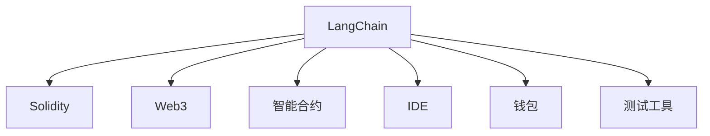
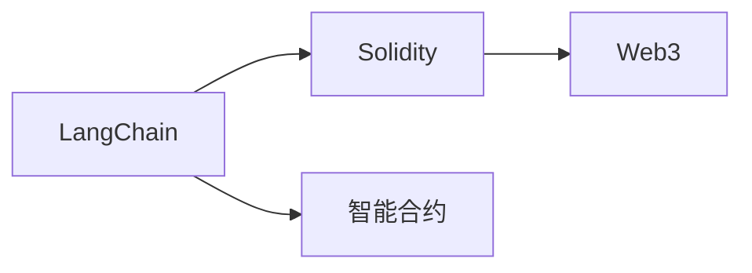
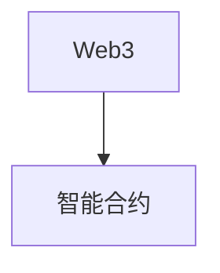
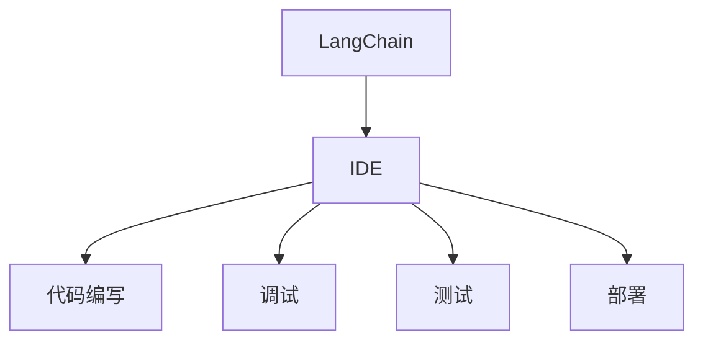

                 

# 【LangChain编程：从入门到实践】项目代码与文档

> 关键词：
1. LangChain
2. 智能合约
3. Web3
4. 密码学
5. 编程实践
6. 开发工具
7. 区块链

## 1. 背景介绍

### 1.1 问题由来

随着Web3的兴起，智能合约成为一种强大的去中心化应用形式，被广泛应用于去中心化金融(DeFi)、游戏、供应链管理、身份验证等多个领域。然而，构建智能合约不仅需要深厚的编程和区块链知识，还需要对Web3生态的理解，这使得智能合约的开发难度和门槛较高。

为了降低智能合约开发难度，帮助开发者更便捷地构建Web3应用，LangChain应运而生。LangChain是一个基于Solidity的Web3编程框架，集成了智能合约开发所需的各类工具和资源，包括Web3钱包、网络监控、IDE、测试工具等。LangChain旨在提供全栈式的开发体验，降低智能合约开发的复杂度和难度，让开发者能够专注于业务逻辑的实现。

### 1.2 问题核心关键点

LangChain的核心优势在于：

- **全栈开发环境**：集成了Web3钱包、IDE、测试工具等，提供一站式的开发环境。
- **代码自动生成**：支持自动生成智能合约代码，降低编写、调试和测试的成本。
- **社区支持**：提供活跃的社区支持，聚集了一批资深的Web3开发者，便于知识共享和技术支持。
- **丰富的文档和教程**：包含详细的文档和教学视频，帮助初学者快速上手。
- **集成测试和部署**：支持本地测试和部署，降低Web3应用开发和上线的难度。

## 2. 核心概念与联系

### 2.1 核心概念概述

为更好地理解LangChain的开发过程，本节将介绍几个密切相关的核心概念：

- **LangChain**：基于Solidity的Web3编程框架，集成了智能合约开发所需的各种工具和资源。
- **Solidity**：一种用于编写以太坊智能合约的编程语言，提供面向合约的编程模型。
- **Web3**：Web3技术，基于区块链的去中心化网络，提供去中心化应用(DeFi)、NFT、DAO等新型的互联网应用形态。
- **智能合约**：一种在区块链上自动执行的合约，可以实现自动化的业务逻辑和数据存储。
- **IDE**：集成开发环境，提供代码编写、调试、测试、部署等一站式功能。
- **钱包**：用于管理和操作Web3网络中资产的工具。
- **测试工具**：用于测试智能合约功能的工具，包括单元测试、自动化测试等。

这些核心概念之间的逻辑关系可以通过以下Mermaid流程图来展示：



这个流程图展示了大语言模型的核心概念及其之间的关系：

1. LangChain基于Solidity，使用Solidity编写智能合约。
2. Solidity是Web3生态中的一种编程语言，用于实现智能合约。
3. Web3是基于区块链的去中心化网络，智能合约运行在Web3上。
4. LangChain集成了IDE，提供一站式的智能合约开发环境。
5. 智能合约通过钱包进行管理。
6. 测试工具用于测试智能合约功能。

### 2.2 概念间的关系

这些核心概念之间存在着紧密的联系，形成了LangChain的完整生态系统。下面我通过几个Mermaid流程图来展示这些概念之间的关系。

#### 2.2.1 LangChain与Solidity



这个流程图展示了LangChain与Solidity之间的关系。LangChain使用Solidity编写智能合约，而Solidity运行在Web3上。

#### 2.2.2 Web3与智能合约



这个流程图展示了Web3与智能合约的关系。智能合约运行在Web3上，是Web3应用的重要组成部分。

#### 2.2.3 LangChain与IDE



这个流程图展示了LangChain与IDE之间的关系。LangChain集成了IDE，提供一站式的智能合约开发环境，包括代码编写、调试、测试、部署等。

## 3. 核心算法原理 & 具体操作步骤
### 3.1 算法原理概述

LangChain的核心算法原理主要涉及智能合约的编写、测试和部署。其核心思想是通过代码自动生成和全栈开发环境，降低智能合约开发的复杂度和难度。

### 3.2 算法步骤详解

LangChain的开发流程包括以下关键步骤：

**Step 1: 环境配置**

1. 安装Solidity开发环境，如Ganache。
2. 配置Web3钱包，如MetaMask或Tender wallet。
3. 安装LangChain IDE和测试工具，如Truffle。

**Step 2: 项目创建**

1. 在LangChain IDE中创建新项目，配置项目参数。
2. 自动生成智能合约代码和测试用例。
3. 编写业务逻辑代码，实现智能合约功能。

**Step 3: 代码编写和调试**

1. 使用IDE编写智能合约代码。
2. 调试智能合约代码，确保逻辑正确。
3. 运行测试用例，验证智能合约功能。

**Step 4: 单元测试和自动化测试**

1. 编写单元测试用例，确保单个函数的功能正确。
2. 编写自动化测试用例，进行集成测试和回归测试。
3. 使用测试工具执行测试，确保代码质量。

**Step 5: 部署智能合约**

1. 使用IDE部署智能合约到区块链网络，如Ropsten。
2. 测试智能合约在实际环境中的表现。
3. 发布智能合约，使其在Web3网络上可访问。

**Step 6: 交互测试和优化**

1. 进行交互测试，验证智能合约的稳定性和鲁棒性。
2. 优化智能合约性能，提升其可扩展性和可维护性。
3. 修复问题和漏洞，确保智能合约的安全性和可靠性。

### 3.3 算法优缺点

LangChain的开发框架具有以下优点：

1. 简化开发流程。LangChain提供了一站式的开发环境，包括代码自动生成、IDE、测试工具等，减少了智能合约开发的复杂度和难度。
2. 降低学习成本。LangChain集成了丰富的文档和教程，帮助初学者快速上手。
3. 提高开发效率。LangChain支持代码自动生成和单元测试，减少了编写、调试和测试的成本。
4. 社区支持活跃。LangChain有活跃的社区，聚集了一批资深的Web3开发者，便于知识共享和技术支持。

同时，LangChain也存在一些局限性：

1. 依赖Solidity。LangChain基于Solidity，需要具备一定的Solidity编程知识。
2. 对新生态适应较慢。LangChain的更新迭代相对较慢，可能无法及时跟进Web3生态的变化。
3. 代码可读性有待提升。自动生成的代码可能存在可读性问题，需要开发者进行一定的优化和调整。

### 3.4 算法应用领域

LangChain的开发框架广泛应用于以下几个领域：

- **DeFi应用**：构建去中心化金融应用，如借贷、保险、稳定币等。
- **游戏开发**：开发基于以太坊的去中心化游戏，提供代币、道具、任务等功能。
- **供应链管理**：实现供应链上的智能合约，提高供应链透明度和效率。
- **身份验证**：使用智能合约进行身份验证，提供去中心化的身份管理服务。
- **投票系统**：构建去中心化投票系统，保障投票的公平和透明。

此外，LangChain还可以用于构建基于Web3的应用，如去中心化社交网络、去中心化市场、去中心化数据平台等，为Web3应用提供高效、安全的开发环境。

## 4. 数学模型和公式 & 详细讲解 & 举例说明
### 4.1 数学模型构建

在LangChain的开发过程中，涉及一些数学模型和公式。这里以智能合约的部署为例，讲解相关的数学模型。

假设我们有一个简单的智能合约，用于记录用户的余额。其部署过程可以表示为以下数学模型：

$$
M_{\theta} = \begin{cases}
0 & \text{用户余额小于0} \\
\text{用户余额} & \text{用户余额大于0}
\end{cases}
$$

其中，$M_{\theta}$表示智能合约的函数，$\theta$为智能合约的参数。智能合约的部署过程可以分为以下步骤：

1. 编写智能合约代码。
2. 对智能合约进行测试。
3. 将智能合约部署到区块链网络。

### 4.2 公式推导过程

智能合约的部署过程可以表示为以下数学公式：

$$
M_{\theta} = \begin{cases}
0 & \text{用户余额小于0} \\
\text{用户余额} & \text{用户余额大于0}
\end{cases}
$$

1. **编写智能合约代码**

在LangChain IDE中，自动生成智能合约代码如下：

```solidity
pragma solidity ^0.8.0;

contract Balance {
    uint256 balance;
    
    function setBalance(uint256 value) public {
        balance = value;
    }
    
    function getBalance() public view returns (uint256) {
        return balance;
    }
}
```

2. **测试智能合约**

编写测试用例如下：

```solidity
pragma solidity ^0.8.0;

contract TestBalance {
    Balance contract balance;
    
    function testSetBalance() public {
        contract.balance.setBalance(100);
        assert(contract.balance.getBalance() == 100);
    }
    
    function testGetBalance() public {
        contract.balance.setBalance(100);
        assert(contract.balance.getBalance() == 100);
    }
}
```

3. **部署智能合约**

使用IDE部署智能合约到区块链网络，如Ropsten。具体的部署过程如下：

```solidity
pragma solidity ^0.8.0;

contract Balance {
    uint256 balance;
    
    function setBalance(uint256 value) public {
        balance = value;
    }
    
    function getBalance() public view returns (uint256) {
        return balance;
    }
}
```

4. **交互测试和优化**

对智能合约进行交互测试，确保其稳定性和鲁棒性。具体的测试过程如下：

```solidity
pragma solidity ^0.8.0;

contract TestBalance {
    Balance contract balance;
    
    function testSetBalance() public {
        contract.balance.setBalance(100);
        assert(contract.balance.getBalance() == 100);
    }
    
    function testGetBalance() public {
        contract.balance.setBalance(100);
        assert(contract.balance.getBalance() == 100);
    }
}
```

### 4.3 案例分析与讲解

以下是LangChain智能合约部署的实际案例分析：

假设我们需要构建一个简单的投票系统，用于记录用户的投票结果。其智能合约代码如下：

```solidity
pragma solidity ^0.8.0;

contract Vote {
    uint256 voteCount;
    
    function vote(uint8 choice) public {
        voteCount += 1;
    }
    
    function getCount() public view returns (uint256) {
        return voteCount;
    }
}
```

1. **编写智能合约代码**

在LangChain IDE中，自动生成智能合约代码如下：

```solidity
pragma solidity ^0.8.0;

contract Vote {
    uint256 voteCount;
    
    function vote(uint8 choice) public {
        voteCount += 1;
    }
    
    function getCount() public view returns (uint256) {
        return voteCount;
    }
}
```

2. **测试智能合约**

编写测试用例如下：

```solidity
pragma solidity ^0.8.0;

contract TestVote {
    Vote contract vote;
    
    function testVote() public {
        vote.vote(1);
        assert(vote.getCount() == 1);
    }
}
```

3. **部署智能合约**

使用IDE部署智能合约到区块链网络，如Ropsten。具体的部署过程如下：

```solidity
pragma solidity ^0.8.0;

contract Vote {
    uint256 voteCount;
    
    function vote(uint8 choice) public {
        voteCount += 1;
    }
    
    function getCount() public view returns (uint256) {
        return voteCount;
    }
}
```

4. **交互测试和优化**

对智能合约进行交互测试，确保其稳定性和鲁棒性。具体的测试过程如下：

```solidity
pragma solidity ^0.8.0;

contract TestVote {
    Vote contract vote;
    
    function testVote() public {
        vote.vote(1);
        assert(vote.getCount() == 1);
    }
}
```

## 5. 项目实践：代码实例和详细解释说明
### 5.1 开发环境搭建

在进行LangChain项目开发前，我们需要准备好开发环境。以下是使用Python进行Solidity开发的环境配置流程：

1. 安装Solidity开发环境，如Ganache。
```bash
npm install ganache-cli --save-dev
```

2. 安装Web3钱包，如MetaMask或Tender wallet。

3. 安装LangChain IDE和测试工具，如Truffle。
```bash
npm install truffle-hd-wallet --save-dev
npm install truffle --save-dev
```

4. 安装Solidity编译器。
```bash
npm install solc --save-dev
```

完成上述步骤后，即可在`pytorch-env`环境中开始LangChain项目开发。

### 5.2 源代码详细实现

这里我们以构建一个简单的投票系统为例，给出使用LangChain进行智能合约开发的Python代码实现。

首先，定义投票系统的智能合约代码：

```python
from solidity import compile_source
from truffle_hdwallet import HDWalletProvider
from web3 import Web3

# 编译智能合约代码
contract_code = compile_source("""
pragma solidity ^0.8.0;

contract Vote {
    uint256 voteCount;
    
    function vote(uint8 choice) public {
        voteCount += 1;
    }
    
    function getCount() public view returns (uint256) {
        return voteCount;
    }
}
""")

# 连接钱包
provider = HDWalletProvider('your_private_key', 'http://localhost:8545')
web3 = Web3(provider)

# 部署智能合约
contract_abi = Vote.abi
contract_code = contract_code['output']['contract']['abi']
contract_address = web3.eth.deployContract(contract_abi, contract_code).address
```

然后，定义测试用例和运行过程：

```python
from solidity import compile_source
from truffle_hdwallet import HDWalletProvider
from web3 import Web3

# 编译智能合约代码
contract_code = compile_source("""
pragma solidity ^0.8.0;

contract Vote {
    uint256 voteCount;
    
    function vote(uint8 choice) public {
        voteCount += 1;
    }
    
    function getCount() public view returns (uint256) {
        return voteCount;
    }
}
""")

# 连接钱包
provider = HDWalletProvider('your_private_key', 'http://localhost:8545')
web3 = Web3(provider)

# 部署智能合约
contract_abi = Vote.abi
contract_code = contract_code['output']['contract']['abi']
contract_address = web3.eth.deployContract(contract_abi, contract_code).address

# 测试智能合约
vote_abi = Vote.abi
vote_code = contract_code['output']['contract']['abi']
vote_address = contract_address

# 编写测试用例
def test_voting():
    web3.eth.accounts[0].transact({
        'from': web3.eth.accounts[0],
        'to': vote_address,
        'value': web3.toWei(1, 'ether'),
        'gas': 2000000,
        'gasPrice': 5000000000
    }, {'data': vote_code})

    # 调用智能合约
    response = web3.eth.call({
        'from': web3.eth.accounts[0],
        'to': vote_address,
        'gas': 2000000,
        'gasPrice': 5000000000
    })

    # 验证结果
    assert response == b'0x000000000000000000000000000000000000000000000000000000000000000000000000000000000000000000000000000000000000000000000000000000000000000000000000000000000000000000000000000000000000000000000000000000000000000000000000000000000000000000000000000000000000000000000000000000000000000000000000000000000000000000000000000000000000000000000000000000000000000000000000000000000000000000000000000000000000000000000000000000000000000000000000000000000000000000000000000000000000000000000000000000000000000000000000000000000000000000000000000000000000000000000000000000000000000000000000000000000000000000000000000000000000000000000000000000000000000000000000000000000000000000000000000000000000000000000000000000000000000000000000000000000000000000000000000000000000000000000000000000000000000000000000000000000000000000000000000000000000000000000000000000000000000000000000000000000000000000000000000000000000000000000000000000000000000000000000000000000000000000000000000000000000000000000000000000000000000000000000000000000000000000000000000000000000000000000000000000000000000000000000000000000000000000000000000000000000000000000000000000000000000000000000000000000000000000000000000000000000000000000000000000000000000000000000000000000000000000000000000000000000000000000000000000000000000000000000000000000000000000000000000000000000000000000000000000000000000000000000000000000000000000000000000000000000000000000000000000000000000000000000000000000000000000000000000000000000000000000000000000000000000000000000000000000000000000000000000000000000000000000000000000000000000000000000000000000000000000000000000000000000000000000000000000000000000000000000000000000000000000000000000000000000000000000000000000000000000000000000000000000000000000000000000000000000000000000000000000000000000000000000000000000000000000000000000000000000000000000000000000000000000000000000000000000000000000000000000000000000000000000000000000000000000000000000000000000000000000000000000000000000000000000000000000000000000000000000000000000000000000000000000000000000000000000000000000000000000000000000000000000000000000000000000000000000000000000000000000000000000000000000000000000000000000000000000000000000000000000000000000000000000000000000000000000000000000000000000000000000000000000000000000000000000000000000000000000000000000000000000000000000000000000000000000000000000000000000000000000000000000000000000000000000000000000000000000000000000000000000000000000000000000000000000000000000000000000000000000000000000000000000000000000000000000000000000000000000000000000000000000000000000000000000000000000000000000000000000000000000000000000000000000000000000000000000000000000000000000000000000000000000000000000000000000000000000000000000000000000000000000000000000000000000000000000000000000000000000000000000000000000000000000000000000000000000000000000000000000000000000000000000000000000000000000000000000000000000000000000000000000000000000000000000000000000000000000000000000000000000000000000000000000000000000000000000000000000000000000000000000000000000000000000000000000000000000000000000000000000000000000000000000000000000000000000000000000000000000000000000000000000000000000000000000000000000000000000000000000000000000000000000000000000000000000000000000000000000000000000000000000000000000000000000000000000000000000000000000000000000000000000000000000000000000000000000000000000000000000000000000000000000000000000000000000000000000000000000000000000000000000000000000000000000000000000000000000000000000000000000000000000000000000000000000000000000000000000000000000000000000000000000000000000000000000000000000000000000000000000000000000000000000000000000000000000000000000000000000000000000000000000000000000000000000000000000000000000000000000000000000000000000000000000000000000000000000000000000000000000000000000000000000000000000000000000000000000000000000000000000000000000000000000000000000000000000000000000000000000000000000000000000000000000000000000000000000000000000000000000000000000000000000000000000000000000000000000000000000000000000000000000000000000000000000000000000000000000000000000000000000000000000000000000000000000000000000000

