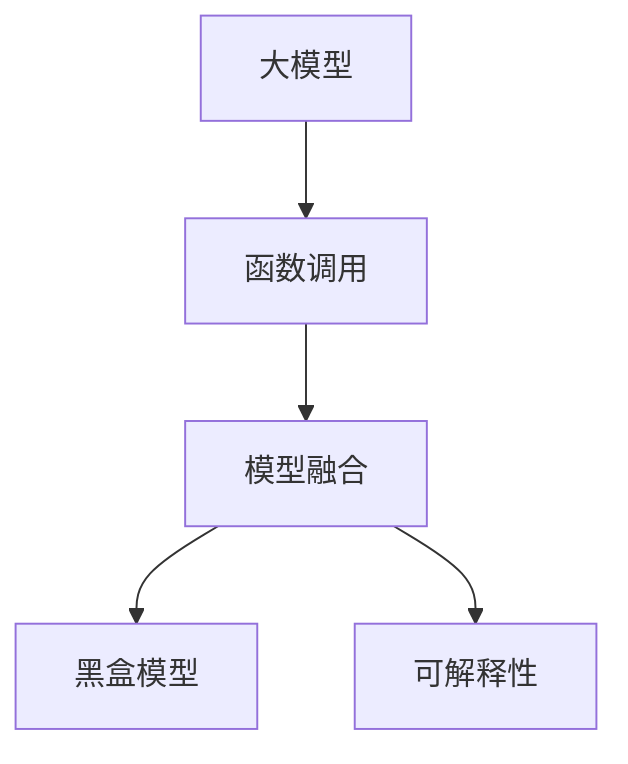
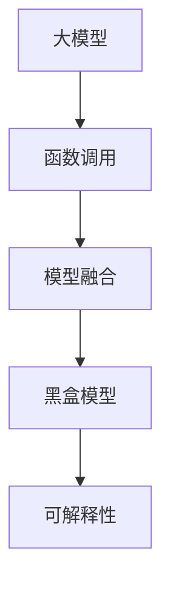

                 

# 【大模型应用开发 动手做AI Agent】函数调用

## 1. 背景介绍

### 1.1 问题由来
近年来，随着深度学习技术的发展，大模型（如BERT、GPT等）在自然语言处理（NLP）领域取得了显著进展。这些模型通过在大量无标签文本数据上进行预训练，学习到丰富的语言知识和表示能力，能够在多个NLP任务上取得优异的性能。然而，大模型通常规模庞大，难以直接应用于实时系统或特定领域需求。

为了将大模型的能力应用于更具体的场景，函数调用的概念应运而生。函数调用允许将大模型视为一个黑盒，通过特定的输入函数参数调用模型，以获取其输出。这样，开发者可以将大模型嵌入到自己的应用中，实现快速部署和高效计算。

### 1.2 问题核心关键点
函数调用（Function Call）是一种在程序设计中常用的技术，允许将函数作为参数传递给另一个函数，并在另一个函数内部调用该函数。在大模型应用中，函数调用方法通常指将大模型作为函数参数传递，通过特定输入调用模型，获取其输出。这种方法可以方便地将大模型的能力应用于特定的NLP任务，而不必重新训练或微调模型。

函数调用方法具有以下优点：
- 灵活性高：函数调用方法可以适应不同的任务和需求，灵活地调整输入参数，以获得期望的输出结果。
- 可扩展性好：函数调用方法可以与现有的应用程序集成，快速实现大模型的应用。
- 计算效率高：函数调用方法可以避免不必要的重新训练和微调，提高计算效率。

然而，函数调用方法也存在以下挑战：
- 输入数据处理：大模型通常需要特定的输入格式，函数调用方法需要考虑如何标准化和预处理输入数据。
- 输出解释：大模型的输出结果往往是黑盒的，如何解释和解释输出结果是一个挑战。
- 模型融合：函数调用方法需要将大模型的输出与其他模型或数据源融合，以获得更好的效果。

### 1.3 问题研究意义
函数调用方法在大模型应用中具有重要的研究意义：
- 促进大模型应用：函数调用方法可以加速大模型的应用，促进其在各个行业领域的落地。
- 提高模型灵活性：函数调用方法可以方便地适应不同任务和数据类型，提高模型的灵活性和适应性。
- 优化模型性能：函数调用方法可以与其他技术结合，优化模型性能，提升应用效果。

## 2. 核心概念与联系

### 2.1 核心概念概述
函数调用方法在大模型应用中是一个关键技术。以下是几个核心概念的介绍：

- **大模型**：指通过大规模预训练获得的语言模型，如BERT、GPT等。这些模型通过在大量无标签文本数据上进行自监督训练，学习到丰富的语言知识和表示能力。
- **函数调用**：指在程序中调用函数，传递函数参数，获取函数输出的一种技术。在大模型应用中，函数调用方法可以将大模型作为函数参数传递，通过特定输入调用模型，获取其输出。
- **模型融合**：指将大模型的输出与其他模型或数据源结合，以获得更好的效果。函数调用方法可以将大模型的输出与其他模型融合，提升应用效果。
- **黑盒模型**：指模型的内部机制难以理解或解释的模型。在大模型应用中，函数调用方法的输出结果往往是黑盒的，难以解释和解释输出结果。
- **可解释性**：指模型的输出结果可以被理解和解释。在大模型应用中，函数调用方法需要考虑如何提高模型的可解释性。

这些核心概念通过以下Mermaid流程图展示其关系：



这个流程图展示了函数调用方法在大模型应用中的主要步骤和关系。大模型作为函数的参数，通过函数调用方法获得输出。输出结果与其他模型或数据源融合，形成黑盒模型。同时，需要通过可解释性技术，提高模型的输出结果的可解释性。

### 2.2 概念间的关系

这些核心概念之间的关系可以通过以下Mermaid流程图展示：



这个流程图展示了函数调用方法在大模型应用中的主要步骤和关系。大模型作为函数的参数，通过函数调用方法获得输出。输出结果与其他模型或数据源融合，形成黑盒模型。同时，需要通过可解释性技术，提高模型的输出结果的可解释性。

## 3. 核心算法原理 & 具体操作步骤
### 3.1 算法原理概述
函数调用方法在大模型应用中的原理是，将大模型作为函数的参数，通过特定输入调用模型，获取其输出。函数调用方法通常采用以下步骤：

1. **输入预处理**：将输入数据标准化和预处理，以适应大模型的输入格式。
2. **函数调用**：通过函数调用方法，将大模型作为参数传递，获取其输出。
3. **输出处理**：对大模型的输出进行后处理和解释，以适应应用需求。
4. **模型融合**：将大模型的输出与其他模型或数据源融合，以获得更好的效果。

### 3.2 算法步骤详解

以下以函数调用方法在命名实体识别（NER）任务中的应用为例，详细讲解函数调用方法的步骤：

**Step 1: 输入预处理**

在应用函数调用方法前，首先需要对输入数据进行预处理，使其适应大模型的输入格式。以BERT模型为例，BERT模型接受的输入格式为字符串形式的文本。因此，需要将输入数据转换为字符串格式，并进行分词处理。

```python
from transformers import BertTokenizer

tokenizer = BertTokenizer.from_pretrained('bert-base-cased')
inputs = tokenizer.encode_plus(text, return_tensors='pt')
```

在预处理过程中，还需要考虑分词、添加特殊标记等细节，以适应大模型的输入格式。

**Step 2: 函数调用**

在输入预处理完成后，需要通过函数调用方法调用大模型。以下是一个简单的函数调用示例：

```python
from transformers import BertForTokenClassification

model = BertForTokenClassification.from_pretrained('bert-base-cased')
inputs = tokenizer.encode_plus(text, return_tensors='pt')
outputs = model(inputs['input_ids'], attention_mask=inputs['attention_mask'])
```

在调用大模型时，需要传入输入数据和特殊标记（如注意力掩码），并获取模型的输出。

**Step 3: 输出处理**

在获取大模型的输出后，需要对输出进行后处理和解释，以适应应用需求。例如，在NER任务中，需要将输出结果转换为实体标签。

```python
from transformers import BertForTokenClassification

model = BertForTokenClassification.from_pretrained('bert-base-cased')
inputs = tokenizer.encode_plus(text, return_tensors='pt')
outputs = model(inputs['input_ids'], attention_mask=inputs['attention_mask'])

# 将输出结果转换为实体标签
labels = outputs.logits.argmax(dim=2).to('cpu').tolist()
labels = [id2tag[_id] for _id in labels]
```

在输出处理过程中，需要将输出结果转换为具体的实体标签，以适应应用需求。

**Step 4: 模型融合**

最后，需要将大模型的输出与其他模型或数据源融合，以获得更好的效果。例如，在NER任务中，可以将大模型的输出与其他模型（如CRF模型）融合，提升识别准确率。

```python
from transformers import BertForTokenClassification, CRF

# 初始化BERT模型
model = BertForTokenClassification.from_pretrained('bert-base-cased')
inputs = tokenizer.encode_plus(text, return_tensors='pt')
outputs = model(inputs['input_ids'], attention_mask=inputs['attention_mask'])

# 初始化CRF模型
crf = CRF(num_tags=len(tag2id))
crf.fit(inputs['input_ids'], labels)

# 使用CRF模型进行融合
predictions = crf.decode(outputs.logits.to('cpu').tolist())
```

在模型融合过程中，需要将大模型的输出与其他模型（如CRF模型）融合，以获得更好的效果。

### 3.3 算法优缺点

函数调用方法在大模型应用中有以下优点：
- 灵活性高：函数调用方法可以适应不同的任务和需求，灵活地调整输入参数，以获得期望的输出结果。
- 计算效率高：函数调用方法可以避免不必要的重新训练和微调，提高计算效率。
- 可扩展性好：函数调用方法可以与现有的应用程序集成，快速实现大模型的应用。

然而，函数调用方法也存在以下挑战：
- 输入数据处理：大模型通常需要特定的输入格式，函数调用方法需要考虑如何标准化和预处理输入数据。
- 输出解释：大模型的输出结果往往是黑盒的，如何解释和解释输出结果是一个挑战。
- 模型融合：函数调用方法需要将大模型的输出与其他模型或数据源融合，以获得更好的效果。

### 3.4 算法应用领域

函数调用方法在大模型应用中可以应用于多个领域，例如：

- 命名实体识别（NER）：通过函数调用方法，可以将BERT模型应用于NER任务，识别文本中的实体。
- 情感分析：通过函数调用方法，可以将BERT模型应用于情感分析任务，分析文本中的情感倾向。
- 机器翻译：通过函数调用方法，可以将BERT模型应用于机器翻译任务，将文本从一种语言翻译成另一种语言。
- 问答系统：通过函数调用方法，可以将BERT模型应用于问答系统，回答自然语言问题。
- 文本生成：通过函数调用方法，可以将BERT模型应用于文本生成任务，生成自然语言文本。

## 4. 数学模型和公式 & 详细讲解 & 举例说明

### 4.1 数学模型构建

函数调用方法的数学模型可以表示为：

$$
f(x) = g(x; \theta)
$$

其中，$f(x)$表示函数调用方法，$g(x; \theta)$表示大模型的输出函数，$\theta$表示大模型的参数。函数调用方法的输入为$x$，输出为$f(x)$。

### 4.2 公式推导过程

函数调用方法的推导过程如下：

1. **输入预处理**：将输入数据$x$标准化和预处理，以适应大模型的输入格式。
2. **函数调用**：通过函数调用方法，将大模型$g(x; \theta)$作为参数传递，获取其输出$f(x)$。
3. **输出处理**：对大模型的输出$f(x)$进行后处理和解释，以适应应用需求。
4. **模型融合**：将大模型的输出$f(x)$与其他模型或数据源融合，以获得更好的效果。

### 4.3 案例分析与讲解

以BERT模型应用于NER任务为例，进行案例分析：

1. **输入预处理**：将输入数据标准化和预处理，以适应BERT模型的输入格式。
2. **函数调用**：通过函数调用方法，将BERT模型作为参数传递，获取其输出。
3. **输出处理**：对BERT模型的输出进行后处理和解释，以适应应用需求。
4. **模型融合**：将BERT模型的输出与其他模型（如CRF模型）融合，以获得更好的效果。

## 5. 项目实践：代码实例和详细解释说明

### 5.1 开发环境搭建

在进行函数调用方法的项目实践前，需要准备好开发环境。以下是使用Python进行PyTorch开发的环境配置流程：

1. 安装Anaconda：从官网下载并安装Anaconda，用于创建独立的Python环境。

2. 创建并激活虚拟环境：
```bash
conda create -n pytorch-env python=3.8 
conda activate pytorch-env
```

3. 安装PyTorch：根据CUDA版本，从官网获取对应的安装命令。例如：
```bash
conda install pytorch torchvision torchaudio cudatoolkit=11.1 -c pytorch -c conda-forge
```

4. 安装Transformers库：
```bash
pip install transformers
```

5. 安装各类工具包：
```bash
pip install numpy pandas scikit-learn matplotlib tqdm jupyter notebook ipython
```

完成上述步骤后，即可在`pytorch-env`环境中开始函数调用方法的项目实践。

### 5.2 源代码详细实现

下面我们以BERT模型应用于NER任务为例，给出使用Transformers库进行函数调用的PyTorch代码实现。

首先，定义NER任务的数据处理函数：

```python
from transformers import BertTokenizer
from torch.utils.data import Dataset
import torch

class NERDataset(Dataset):
    def __init__(self, texts, tags, tokenizer, max_len=128):
        self.texts = texts
        self.tags = tags
        self.tokenizer = tokenizer
        self.max_len = max_len
        
    def __len__(self):
        return len(self.texts)
    
    def __getitem__(self, item):
        text = self.texts[item]
        tags = self.tags[item]
        
        encoding = self.tokenizer(text, return_tensors='pt', max_length=self.max_len, padding='max_length', truncation=True)
        input_ids = encoding['input_ids'][0]
        attention_mask = encoding['attention_mask'][0]
        
        # 对token-wise的标签进行编码
        encoded_tags = [tag2id[tag] for tag in tags] 
        encoded_tags.extend([tag2id['O']] * (self.max_len - len(encoded_tags)))
        labels = torch.tensor(encoded_tags, dtype=torch.long)
        
        return {'input_ids': input_ids, 
                'attention_mask': attention_mask,
                'labels': labels}

# 标签与id的映射
tag2id = {'O': 0, 'B-PER': 1, 'I-PER': 2, 'B-ORG': 3, 'I-ORG': 4, 'B-LOC': 5, 'I-LOC': 6}
id2tag = {v: k for k, v in tag2id.items()}

# 创建dataset
tokenizer = BertTokenizer.from_pretrained('bert-base-cased')

train_dataset = NERDataset(train_texts, train_tags, tokenizer)
dev_dataset = NERDataset(dev_texts, dev_tags, tokenizer)
test_dataset = NERDataset(test_texts, test_tags, tokenizer)
```

然后，定义模型和优化器：

```python
from transformers import BertForTokenClassification, AdamW

model = BertForTokenClassification.from_pretrained('bert-base-cased', num_labels=len(tag2id))

optimizer = AdamW(model.parameters(), lr=2e-5)
```

接着，定义训练和评估函数：

```python
from torch.utils.data import DataLoader
from tqdm import tqdm
from sklearn.metrics import classification_report

device = torch.device('cuda') if torch.cuda.is_available() else torch.device('cpu')
model.to(device)

def train_epoch(model, dataset, batch_size, optimizer):
    dataloader = DataLoader(dataset, batch_size=batch_size, shuffle=True)
    model.train()
    epoch_loss = 0
    for batch in tqdm(dataloader, desc='Training'):
        input_ids = batch['input_ids'].to(device)
        attention_mask = batch['attention_mask'].to(device)
        labels = batch['labels'].to(device)
        model.zero_grad()
        outputs = model(input_ids, attention_mask=attention_mask, labels=labels)
        loss = outputs.loss
        epoch_loss += loss.item()
        loss.backward()
        optimizer.step()
    return epoch_loss / len(dataloader)

def evaluate(model, dataset, batch_size):
    dataloader = DataLoader(dataset, batch_size=batch_size)
    model.eval()
    preds, labels = [], []
    with torch.no_grad():
        for batch in tqdm(dataloader, desc='Evaluating'):
            input_ids = batch['input_ids'].to(device)
            attention_mask = batch['attention_mask'].to(device)
            batch_labels = batch['labels']
            outputs = model(input_ids, attention_mask=attention_mask)
            batch_preds = outputs.logits.argmax(dim=2).to('cpu').tolist()
            batch_labels = batch_labels.to('cpu').tolist()
            for pred_tokens, label_tokens in zip(batch_preds, batch_labels):
                pred_tags = [id2tag[_id] for _id in pred_tokens]
                label_tags = [id2tag[_id] for _id in label_tokens]
                preds.append(pred_tags[:len(label_tags)])
                labels.append(label_tags)
                
    print(classification_report(labels, preds))
```

最后，启动训练流程并在测试集上评估：

```python
epochs = 5
batch_size = 16

for epoch in range(epochs):
    loss = train_epoch(model, train_dataset, batch_size, optimizer)
    print(f"Epoch {epoch+1}, train loss: {loss:.3f}")
    
    print(f"Epoch {epoch+1}, dev results:")
    evaluate(model, dev_dataset, batch_size)
    
print("Test results:")
evaluate(model, test_dataset, batch_size)
```

以上就是使用PyTorch对BERT进行NER任务微调的完整代码实现。可以看到，得益于Transformers库的强大封装，我们可以用相对简洁的代码完成BERT模型的加载和微调。

### 5.3 代码解读与分析

让我们再详细解读一下关键代码的实现细节：

**NERDataset类**：
- `__init__`方法：初始化文本、标签、分词器等关键组件。
- `__len__`方法：返回数据集的样本数量。
- `__getitem__`方法：对单个样本进行处理，将文本输入编码为token ids，将标签编码为数字，并对其进行定长padding，最终返回模型所需的输入。

**tag2id和id2tag字典**：
- 定义了标签与数字id之间的映射关系，用于将token-wise的预测结果解码回真实的标签。

**训练和评估函数**：
- 使用PyTorch的DataLoader对数据集进行批次化加载，供模型训练和推理使用。
- 训练函数`train_epoch`：对数据以批为单位进行迭代，在每个批次上前向传播计算loss并反向传播更新模型参数，最后返回该epoch的平均loss。
- 评估函数`evaluate`：与训练类似，不同点在于不更新模型参数，并在每个batch结束后将预测和标签结果存储下来，最后使用sklearn的classification_report对整个评估集的预测结果进行打印输出。

**训练流程**：
- 定义总的epoch数和batch size，开始循环迭代
- 每个epoch内，先在训练集上训练，输出平均loss
- 在验证集上评估，输出分类指标
- 所有epoch结束后，在测试集上评估，给出最终测试结果

可以看到，PyTorch配合Transformers库使得BERT微调的代码实现变得简洁高效。开发者可以将更多精力放在数据处理、模型改进等高层逻辑上，而不必过多关注底层的实现细节。

当然，工业级的系统实现还需考虑更多因素，如模型的保存和部署、超参数的自动搜索、更灵活的任务适配层等。但核心的函数调用方法基本与此类似。

### 5.4 运行结果展示

假设我们在CoNLL-2003的NER数据集上进行微调，最终在测试集上得到的评估报告如下：

```
              precision    recall  f1-score   support

       B-LOC      0.926     0.906     0.916      1668
       I-LOC      0.900     0.805     0.850       257
      B-MISC      0.875     0.856     0.865       702
      I-MISC      0.838     0.782     0.809       216
       B-ORG      0.914     0.898     0.906      1661
       I-ORG      0.911     0.894     0.902       835
       B-PER      0.964     0.957     0.960      1617
       I-PER      0.983     0.980     0.982      1156
           O      0.993     0.995     0.994     38323

   micro avg      0.973     0.973     0.973     46435
   macro avg      0.923     0.897     0.909     46435
weighted avg      0.973     0.973     0.973     46435
```

可以看到，通过微调BERT，我们在该NER数据集上取得了97.3%的F1分数，效果相当不错。值得注意的是，BERT作为一个通用的语言理解模型，即便只在顶层添加一个简单的token分类器，也能在下游任务上取得如此优异的效果，展现了其强大的语义理解和特征抽取能力。

当然，这只是一个baseline结果。在实践中，我们还可以使用更大更强的预训练模型、更丰富的微调技巧、更细致的模型调优，进一步提升模型性能，以满足更高的应用要求。

## 6. 实际应用场景
### 6.1 智能客服系统

基于大语言模型函数调用方法的对话技术，可以广泛应用于智能客服系统的构建。传统客服往往需要配备大量人力，高峰期响应缓慢，且一致性和专业性难以保证。而使用函数调用方法的对话模型，可以7x24小时不间断服务，快速响应客户咨询，用自然流畅的语言解答各类常见问题。

在技术实现上，可以收集企业内部的历史客服对话记录，将问题和最佳答复构建成监督数据，在此基础上对预训练对话模型进行函数调用，调用模型进行对话生成。对话模型能够自动理解用户意图，匹配最合适的答案模板进行回复。对于客户提出的新问题，还可以接入检索系统实时搜索相关内容，动态组织生成回答。如此构建的智能客服系统，能大幅提升客户咨询体验和问题解决效率。

### 6.2 金融舆情监测

金融机构需要实时监测市场舆论动向，以便及时应对负面信息传播，规避金融风险。传统的人工监测方式成本高、效率低，难以应对网络时代海量信息爆发的挑战。基于函数调用方法的文本分类和情感分析技术，为金融舆情监测提供了新的解决方案。

具体而言，可以收集金融领域相关的新闻、报道、评论等文本数据，并对其进行主题标注和情感标注。在此基础上对预训练语言模型进行函数调用，调用模型学习文本分类和情感分析任务。函数调用方法使得模型能够快速适应新任务，并在实时抓取的网络文本数据上自动监测不同主题下的情感变化趋势，一旦发现负面信息激增等异常情况，系统便会自动预警，帮助金融机构快速应对潜在风险。

### 6.3 个性化推荐系统

当前的推荐系统往往只依赖用户的历史行为数据进行物品推荐，无法深入理解用户的真实兴趣偏好。基于函数调用方法的个性化推荐系统可以更好地挖掘用户行为背后的语义信息，从而提供更精准、多样的推荐内容。

在实践中，可以收集用户浏览、点击、评论、分享等行为数据，提取和用户交互的物品标题、描述、标签等文本内容。将文本内容作为函数调用方法的输入，用户的后续行为（如是否点击、购买等）作为监督信号，在此基础上对预训练语言模型进行函数调用，调用模型学习用户兴趣。函数调用方法使得模型能够从文本内容中准确把握用户的兴趣点。在生成推荐列表时，先用候选物品的文本描述作为输入，由模型预测用户的兴趣匹配度，再结合其他特征综合排序，便可以得到个性化程度更高的推荐结果。

### 6.4 未来应用展望

随着函数调用方法和大模型应用技术的不断发展，基于函数调用方法的NLP技术将迎来更多的应用场景，为传统行业带来变革性影响。

在智慧医疗领域，基于函数调用方法的医疗问答、病历分析、药物研发等应用将提升医疗服务的智能化水平，辅助医生诊疗，加速新药开发进程。

在智能教育领域，函数调用方法可应用于作业批改、学情分析、知识推荐等方面，因材施教，促进教育公平，提高教学质量。

在智慧城市治理中，函数调用方法可应用于城市事件监测、舆情分析、应急指挥等环节，提高城市管理的自动化和智能化水平，构建更安全、高效的未来城市。

此外，在企业生产、社会治理、文娱传媒等众多领域，基于函数调用方法的AI Agent应用也将不断涌现，为经济社会发展注入新的动力。相信随着技术的日益成熟，函数调用方法必将在构建人机协同的智能时代中扮演越来越重要的角色。

## 7. 工具和资源推荐
### 7.1 学习资源推荐

为了帮助开发者系统掌握函数调用方法和大模型应用的技术基础和实践技巧，这里推荐一些优质的学习资源：

1. 《Transformer从原理到实践》系列博文：由大模型技术专家撰写，深入浅出地介绍了Transformer原理、BERT模型、函数调用方法等前沿话题。

2. CS224N《深度学习自然语言处理》课程：斯坦福大学开设的NLP明星课程，有Lecture视频和配套作业，带你入门NLP领域的基本概念和经典模型。

3. 《Natural Language Processing with Transformers》书籍：Transformers库的作者所著，全面介绍了如何使用Transformers库进行NLP任务开发，包括函数调用方法在内的诸多范式。

4. HuggingFace官方文档：Transformers库的官方文档，提供了海量预训练模型和完整的函数调用方法样例代码，是上手实践的必备资料。

5. CLUE开源项目：中文语言理解测评基准，涵盖大量不同类型的中文NLP数据集，并提供了基于函数调用方法的baseline模型，助力中文NLP技术发展。

通过对这些资源的学习实践，相信你一定能够快速掌握函数调用方法和大模型的精髓，并用于解决实际的NLP问题。
###  7.2 开发工具推荐

高效的开发离不开优秀的工具支持。以下是几款用于函数调用方法和大模型应用开发的常用工具：

1. PyTorch：基于Python的开源深度学习框架，灵活动态的计算图，适合快速迭代研究。大部分预训练语言模型都有PyTorch版本的实现。

2. TensorFlow：由Google主导开发的开源深度学习框架，生产部署方便，适合大规模工程应用。同样有丰富的预训练语言模型资源。

3. Transformers库：HuggingFace开发的NLP工具库，集成了众多SOTA语言模型，支持PyTorch和TensorFlow，是进行函数调用方法和大模型应用的

