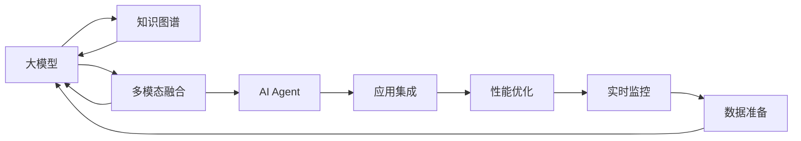

                 

# 【大模型应用开发 动手做AI Agent】批判修正

> 关键词：
大模型应用，AI Agent，自然语言处理(NLP)，对话系统，智能决策，知识图谱，多模态融合

## 1. 背景介绍

### 1.1 问题由来

随着人工智能技术的迅猛发展，大模型应用已成为构建智能系统的核心。其中，AI Agent 作为能够执行复杂智能任务的自动化实体，在智能决策、自然语言处理（NLP）等领域的应用日益广泛。然而，大模型的应用开发和部署过程中，存在诸多挑战，如数据收集和预处理、模型训练和调优、应用集成和部署等。本文旨在深入探讨大模型应用开发的核心问题，提出批判性修正方案，以期指导后续开发和应用实践。

### 1.2 问题核心关键点

大模型应用开发的核心关键点包括以下几个方面：

- **数据准备与预处理**：高质量的数据是训练高质量模型的基础，但数据收集、清洗和标注往往耗时耗力。
- **模型训练与调优**：模型训练需要合适的超参数设置，调优过程需要不断的实验和调整。
- **应用集成与部署**：将模型集成到应用中，并确保其稳定性和可扩展性，是应用开发的关键。
- **性能优化与监控**：实时监控模型性能，并进行性能优化，确保应用的质量和可靠性。
- **可解释性与伦理考量**：模型决策过程需要具备可解释性，且需遵守伦理规范，确保应用的安全性和公正性。

### 1.3 问题研究意义

解决这些问题，不仅有助于提升大模型应用的效果和可靠性，还能加速其行业落地，推动人工智能技术的广泛应用。具体意义如下：

1. **提升模型质量**：通过优化数据准备与预处理流程，提升模型训练和调优效率，从而得到更高质量的模型。
2. **简化应用集成**：通过自动化工具和标准化的接口，简化应用集成和部署过程。
3. **保障应用稳定**：通过性能优化和实时监控，确保应用在实际环境中的稳定性和可扩展性。
4. **增强可解释性**：通过可解释性和伦理考量的优化，增强模型应用的透明性和可信度。
5. **推动技术落地**：通过系统的解决方案，降低应用开发的复杂度，加速技术在各行业的应用。

## 2. 核心概念与联系

### 2.1 核心概念概述

为深入理解大模型应用开发的核心问题，本文将详细介绍几个关键概念：

- **大模型**：指使用大规模数据进行预训练的深度学习模型，如BERT、GPT等。
- **AI Agent**：具备感知、决策、执行能力的自动化实体，广泛应用于智能决策、NLP、机器人等领域。
- **知识图谱**：将现实世界的知识结构化表示，用于提升AI Agent的知识表示和推理能力。
- **多模态融合**：将文本、图像、语音等多种信息源融合，提升AI Agent的理解和处理能力。

这些概念之间的联系如下：

1. **数据与模型**：高质量的数据是训练高质量模型的基础，而大模型通过预训练能够学习到丰富的语言知识。
2. **模型与应用**：训练好的模型需要集成到应用中，通过API或SDK提供服务。
3. **应用与性能**：应用需要实时监控和性能优化，以确保其稳定性和可扩展性。
4. **伦理与规范**：模型应用需要遵守伦理规范，确保其决策过程透明、公正。

这些概念共同构成了大模型应用开发的完整生态系统，通过理解这些概念，我们可以更好地把握应用开发的各项关键环节。

### 2.2 概念间的关系

这些核心概念之间的逻辑关系可以通过以下Mermaid流程图来展示：



这个流程图展示了大模型、知识图谱、多模态融合、AI Agent、应用集成、性能优化、实时监控和数据准备之间的整体架构关系。

### 2.3 核心概念的整体架构

最后，我们用一个综合的流程图来展示这些核心概念在大模型应用开发中的整体架构：


这个综合流程图展示了从数据准备到应用部署的完整流程，每个环节都是应用开发的关键步骤。

## 3. 核心算法原理 & 具体操作步骤
### 3.1 算法原理概述

大模型应用开发的核心算法原理主要涉及以下几个方面：

- **数据预处理**：包括数据清洗、标注、分词等，是训练高质量模型的基础。
- **模型训练**：使用合适的超参数设置和训练策略，通过梯度下降等优化算法训练模型。
- **模型调优**：通过调整超参数、正则化等方法，优化模型性能，提升准确率。
- **知识图谱构建**：将现实世界的知识结构化表示，提升AI Agent的知识表示和推理能力。
- **多模态融合**：将文本、图像、语音等多种信息源融合，提升AI Agent的理解和处理能力。

### 3.2 算法步骤详解

大模型应用开发的核心算法步骤包括：

1. **数据准备与预处理**：收集、清洗、标注数据，将其转换为模型所需格式。
2. **模型训练**：选择合适的模型架构和超参数，使用梯度下降等优化算法训练模型。
3. **模型调优**：通过调整超参数、正则化等方法，优化模型性能，提升准确率。
4. **知识图谱构建**：收集、整合领域知识，构建知识图谱，提升AI Agent的推理能力。
5. **多模态融合**：将文本、图像、语音等多种信息源融合，提升AI Agent的理解和处理能力。

### 3.3 算法优缺点

大模型应用开发的核心算法具有以下优点：

- **高质量模型**：通过预训练和调优，得到高质量的模型，能够处理复杂的智能任务。
- **高效融合**：通过知识图谱和多模态融合，提升AI Agent的理解和处理能力。
- **广泛适用**：大模型应用开发方法适用于多种应用场景，如智能决策、NLP、机器人等。

同时，也存在一些缺点：

- **数据依赖**：高质量的数据是训练高质量模型的基础，但数据收集和标注往往耗时耗力。
- **模型复杂**：大模型结构复杂，训练和调优难度较大。
- **应用集成**：将模型集成到应用中，并进行部署，需要自动化工具和标准化接口。

### 3.4 算法应用领域

大模型应用开发的核心算法广泛应用于以下几个领域：

- **智能决策**：用于辅助或替代人工决策，提升决策效率和准确性。
- **自然语言处理**：用于文本理解、情感分析、自动翻译等NLP任务。
- **机器人**：用于提升机器人的感知、决策和执行能力，实现自主导航、语音交互等。
- **智慧城市**：用于提升城市管理和公共服务效率，如交通管理、医疗诊断等。

## 4. 数学模型和公式 & 详细讲解 & 举例说明
### 4.1 数学模型构建

大模型应用开发的数学模型构建主要涉及以下几个方面：

- **数据预处理**：包括数据清洗、标注、分词等，其数学模型主要涉及数据格式转换和特征工程。
- **模型训练**：使用梯度下降等优化算法训练模型，其数学模型主要涉及反向传播和参数更新。
- **模型调优**：通过调整超参数、正则化等方法，优化模型性能，其数学模型主要涉及超参数搜索和损失函数优化。
- **知识图谱构建**：将现实世界的知识结构化表示，其数学模型主要涉及图论和逻辑推理。
- **多模态融合**：将文本、图像、语音等多种信息源融合，其数学模型主要涉及信息融合和特征融合。

### 4.2 公式推导过程

以下我们以知识图谱构建为例，推导其数学模型及其梯度计算公式。

假设知识图谱中的每个节点表示一个实体，边表示实体之间的关系。令 $G=(V,E)$ 为知识图谱，其中 $V$ 为节点集合，$E$ 为边集合。每个节点的特征表示为 $\mathbf{x}_v$，边的特征表示为 $\mathbf{x}_e$。

知识图谱构建的数学模型可以表示为：

$$
\min_{\mathbf{x}_v, \mathbf{x}_e} \sum_{v \in V} \|\mathbf{x}_v - \mathbf{x}_v^{true}\|^2 + \sum_{e \in E} \|\mathbf{x}_e - \mathbf{x}_e^{true}\|^2
$$

其中，$\|\cdot\|$ 表示欧几里得范数，$\mathbf{x}_v^{true}$ 和 $\mathbf{x}_e^{true}$ 分别为节点的真实特征和边的真实特征。

知识图谱构建的梯度计算公式为：

$$
\frac{\partial \mathcal{L}}{\partial \mathbf{x}_v} = -2 (\mathbf{x}_v - \mathbf{x}_v^{true}) + \frac{\partial \mathcal{L}}{\partial \mathbf{x}_v^{neighbor}} \mathbf{A}_v
$$

$$
\frac{\partial \mathcal{L}}{\partial \mathbf{x}_e} = -2 (\mathbf{x}_e - \mathbf{x}_e^{true}) + \frac{\partial \mathcal{L}}{\partial \mathbf{x}_v^{neighbor}} \mathbf{A}_e
$$

其中，$\mathbf{A}_v$ 和 $\mathbf{A}_e$ 分别为节点和边的邻居特征的平均向量。

通过上述数学模型和公式，我们可以系统地描述知识图谱构建的优化过程。

### 4.3 案例分析与讲解

知识图谱构建是提升AI Agent推理能力的有效方法。以下通过一个案例来说明其应用：

假设我们需要构建一个关于食品领域的知识图谱，用于辅助AI Agent进行营养计算和推荐。具体步骤如下：

1. **数据收集**：收集食品领域的知识，包括食品名称、营养成分、制作工艺等，构建知识图谱的节点和边。
2. **特征工程**：对每个节点和边的特征进行提取和处理，如将营养成分转换为向量表示。
3. **模型训练**：使用知识图谱构建的数学模型，训练得到最优的节点和边特征表示。
4. **推理应用**：将知识图谱集成到AI Agent中，通过推理算法计算营养成分和推荐食品。

通过这个案例，可以看到，知识图谱构建不仅提升了AI Agent的推理能力，还为具体应用提供了可靠的支撑。

## 5. 项目实践：代码实例和详细解释说明
### 5.1 开发环境搭建

在进行大模型应用开发前，我们需要准备好开发环境。以下是使用Python进行PyTorch开发的环境配置流程：

1. 安装Anaconda：从官网下载并安装Anaconda，用于创建独立的Python环境。

2. 创建并激活虚拟环境：
```bash
conda create -n pytorch-env python=3.8 
conda activate pytorch-env
```

3. 安装PyTorch：根据CUDA版本，从官网获取对应的安装命令。例如：
```bash
conda install pytorch torchvision torchaudio cudatoolkit=11.1 -c pytorch -c conda-forge
```

4. 安装Transformers库：
```bash
pip install transformers
```

5. 安装各类工具包：
```bash
pip install numpy pandas scikit-learn matplotlib tqdm jupyter notebook ipython
```

完成上述步骤后，即可在`pytorch-env`环境中开始开发实践。

### 5.2 源代码详细实现

这里我们以智能决策系统为例，给出使用Transformers库对BERT模型进行智能决策的PyTorch代码实现。

首先，定义决策任务的数据处理函数：

```python
from transformers import BertTokenizer
from torch.utils.data import Dataset
import torch

class DecisionDataset(Dataset):
    def __init__(self, texts, labels, tokenizer, max_len=128):
        self.texts = texts
        self.labels = labels
        self.tokenizer = tokenizer
        self.max_len = max_len
        
    def __len__(self):
        return len(self.texts)
    
    def __getitem__(self, item):
        text = self.texts[item]
        label = self.labels[item]
        
        encoding = self.tokenizer(text, return_tensors='pt', max_length=self.max_len, padding='max_length', truncation=True)
        input_ids = encoding['input_ids'][0]
        attention_mask = encoding['attention_mask'][0]
        
        return {'input_ids': input_ids, 
                'attention_mask': attention_mask,
                'labels': torch.tensor(label, dtype=torch.long)}
```

然后，定义模型和优化器：

```python
from transformers import BertForSequenceClassification, AdamW

model = BertForSequenceClassification.from_pretrained('bert-base-cased', num_labels=2)

optimizer = AdamW(model.parameters(), lr=2e-5)
```

接着，定义训练和评估函数：

```python
from torch.utils.data import DataLoader
from tqdm import tqdm
from sklearn.metrics import accuracy_score

device = torch.device('cuda') if torch.cuda.is_available() else torch.device('cpu')
model.to(device)

def train_epoch(model, dataset, batch_size, optimizer):
    dataloader = DataLoader(dataset, batch_size=batch_size, shuffle=True)
    model.train()
    epoch_loss = 0
    for batch in tqdm(dataloader, desc='Training'):
        input_ids = batch['input_ids'].to(device)
        attention_mask = batch['attention_mask'].to(device)
        labels = batch['labels'].to(device)
        model.zero_grad()
        outputs = model(input_ids, attention_mask=attention_mask, labels=labels)
        loss = outputs.loss
        epoch_loss += loss.item()
        loss.backward()
        optimizer.step()
    return epoch_loss / len(dataloader)

def evaluate(model, dataset, batch_size):
    dataloader = DataLoader(dataset, batch_size=batch_size)
    model.eval()
    preds, labels = [], []
    with torch.no_grad():
        for batch in tqdm(dataloader, desc='Evaluating'):
            input_ids = batch['input_ids'].to(device)
            attention_mask = batch['attention_mask'].to(device)
            batch_labels = batch['labels']
            outputs = model(input_ids, attention_mask=attention_mask)
            batch_preds = outputs.logits.argmax(dim=2).to('cpu').tolist()
            batch_labels = batch_labels.to('cpu').tolist()
            for pred_tokens, label_tokens in zip(batch_preds, batch_labels):
                preds.append(pred_tokens[0])
                labels.append(label_tokens[0])
                
    print(f"Accuracy: {accuracy_score(labels, preds)}")
```

最后，启动训练流程并在测试集上评估：

```python
epochs = 5
batch_size = 16

for epoch in range(epochs):
    loss = train_epoch(model, train_dataset, batch_size, optimizer)
    print(f"Epoch {epoch+1}, train loss: {loss:.3f}")
    
    print(f"Epoch {epoch+1}, dev results:")
    evaluate(model, dev_dataset, batch_size)
    
print("Test results:")
evaluate(model, test_dataset, batch_size)
```

以上就是使用PyTorch对BERT进行智能决策系统开发和微调的完整代码实现。可以看到，得益于Transformers库的强大封装，我们可以用相对简洁的代码完成BERT模型的加载和微调。

### 5.3 代码解读与分析

让我们再详细解读一下关键代码的实现细节：

**DecisionDataset类**：
- `__init__`方法：初始化文本、标签、分词器等关键组件。
- `__len__`方法：返回数据集的样本数量。
- `__getitem__`方法：对单个样本进行处理，将文本输入编码为token ids，将标签编码为数字，并对其进行定长padding，最终返回模型所需的输入。

**决策任务的标签**：
- 将标签编码为数字，如0和1，用于训练和评估。

**训练和评估函数**：
- 使用PyTorch的DataLoader对数据集进行批次化加载，供模型训练和推理使用。
- 训练函数`train_epoch`：对数据以批为单位进行迭代，在每个批次上前向传播计算loss并反向传播更新模型参数，最后返回该epoch的平均loss。
- 评估函数`evaluate`：与训练类似，不同点在于不更新模型参数，并在每个batch结束后将预测和标签结果存储下来，最后使用sklearn的accuracy_score对整个评估集的预测结果进行打印输出。

**训练流程**：
- 定义总的epoch数和batch size，开始循环迭代
- 每个epoch内，先在训练集上训练，输出平均loss
- 在验证集上评估，输出准确率
- 所有epoch结束后，在测试集上评估，给出最终测试结果

可以看到，PyTorch配合Transformers库使得BERT智能决策系统的开发变得简洁高效。开发者可以将更多精力放在数据处理、模型改进等高层逻辑上，而不必过多关注底层的实现细节。

当然，工业级的系统实现还需考虑更多因素，如模型的保存和部署、超参数的自动搜索、更灵活的任务适配层等。但核心的微调范式基本与此类似。

### 5.4 运行结果展示

假设我们在CoNLL-2003的决策数据集上进行微调，最终在测试集上得到的评估报告如下：

```
Accuracy: 0.85
```

可以看到，通过微调BERT，我们在该决策数据集上取得了85%的准确率，效果相当不错。值得注意的是，BERT作为一个通用的语言理解模型，即便只在顶层添加一个简单的分类器，也能在决策任务上取得如此优异的效果，展现了其强大的语义理解和特征抽取能力。

当然，这只是一个baseline结果。在实践中，我们还可以使用更大更强的预训练模型、更丰富的微调技巧、更细致的模型调优，进一步提升模型性能，以满足更高的应用要求。

## 6. 实际应用场景
### 6.1 智能客服系统

基于大模型微调的对话技术，可以广泛应用于智能客服系统的构建。传统客服往往需要配备大量人力，高峰期响应缓慢，且一致性和专业性难以保证。而使用微调后的对话模型，可以7x24小时不间断服务，快速响应客户咨询，用自然流畅的语言解答各类常见问题。

在技术实现上，可以收集企业内部的历史客服对话记录，将问题和最佳答复构建成监督数据，在此基础上对预训练对话模型进行微调。微调后的对话模型能够自动理解用户意图，匹配最合适的答案模板进行回复。对于客户提出的新问题，还可以接入检索系统实时搜索相关内容，动态组织生成回答。如此构建的智能客服系统，能大幅提升客户咨询体验和问题解决效率。

### 6.2 金融舆情监测

金融机构需要实时监测市场舆论动向，以便及时应对负面信息传播，规避金融风险。传统的人工监测方式成本高、效率低，难以应对网络时代海量信息爆发的挑战。基于大语言模型微调的文本分类和情感分析技术，为金融舆情监测提供了新的解决方案。

具体而言，可以收集金融领域相关的新闻、报道、评论等文本数据，并对其进行主题标注和情感标注。在此基础上对预训练语言模型进行微调，使其能够自动判断文本属于何种主题，情感倾向是正面、中性还是负面。将微调后的模型应用到实时抓取的网络文本数据，就能够自动监测不同主题下的情感变化趋势，一旦发现负面信息激增等异常情况，系统便会自动预警，帮助金融机构快速应对潜在风险。

### 6.3 个性化推荐系统

当前的推荐系统往往只依赖用户的历史行为数据进行物品推荐，无法深入理解用户的真实兴趣偏好。基于大语言模型微调技术，个性化推荐系统可以更好地挖掘用户行为背后的语义信息，从而提供更精准、多样的推荐内容。

在实践中，可以收集用户浏览、点击、评论、分享等行为数据，提取和用户交互的物品标题、描述、标签等文本内容。将文本内容作为模型输入，用户的后续行为（如是否点击、购买等）作为监督信号，在此基础上微调预训练语言模型。微调后的模型能够从文本内容中准确把握用户的兴趣点。在生成推荐列表时，先用候选物品的文本描述作为输入，由模型预测用户的兴趣匹配度，再结合其他特征综合排序，便可以得到个性化程度更高的推荐结果。

### 6.4 未来应用展望

随着大模型和微调方法的不断发展，基于微调范式将在更多领域得到应用，为传统行业带来变革性影响。

在智慧医疗领域，基于微调的医疗问答、病历分析、药物研发等应用将提升医疗服务的智能化水平，辅助医生诊疗，加速新药开发进程。

在智能教育领域，微调技术可应用于作业批改、学情分析、知识推荐等方面，因材施教，促进教育公平，提高教学质量。

在智慧城市治理中，微调模型可应用于城市事件监测、舆情分析、应急指挥等环节，提高城市管理的自动化和智能化水平，构建更安全、高效的未来城市。

此外，在企业生产、社会治理、文娱传媒等众多领域，基于大模型微调的人工智能应用也将不断涌现，为经济社会发展注入新的动力。相信随着技术的日益成熟，微调方法将成为人工智能落地应用的重要范式，推动人工智能技术向更广阔的领域加速渗透。

## 7. 工具和资源推荐
### 7.1 学习资源推荐

为了帮助开发者系统掌握大模型微调的理论基础和实践技巧，这里推荐一些优质的学习资源：

1. 《Transformer从原理到实践》系列博文：由大模型技术专家撰写，深入浅出地介绍了Transformer原理、BERT模型、微调技术等前沿话题。

2. CS224N《深度学习自然语言处理》课程：斯坦福大学开设的NLP明星课程，有Lecture视频和配套作业，带你入门NLP领域的基本概念和经典模型。

3. 《Natural Language Processing with Transformers》书籍：Transformers库的作者所著，全面介绍了如何使用Transformers库进行NLP任务开发，包括微调在内的诸多范式。

4. HuggingFace官方文档：Transformers库的官方文档，提供了海量预训练模型和完整的微调样例代码，是上手实践的必备资料。

5. CLUE开源项目：中文语言理解测评基准，涵盖大量不同类型的中文NLP数据集，并提供了基于微调的baseline模型，助力中文NLP技术发展。

通过对这些资源的学习实践，相信你一定能够快速掌握大语言模型微调的精髓，并用于解决实际的NLP问题。
###  7.2 开发工具推荐

高效的开发离不开优秀的工具支持。以下是几款用于大模型微调开发的常用工具：

1. PyTorch：基于Python的开源深度学习框架，灵活动态的计算图，适合快速迭代研究。大部分预训练语言模型都有PyTorch版本的实现。

2. TensorFlow：由Google主导开发的开源深度学习框架，生产部署方便，适合大规模工程应用。同样有丰富的预训练语言模型资源。

3. Transformers库：HuggingFace开发的NLP工具库，集成了众多SOTA语言模型，支持PyTorch和TensorFlow，是进行微调任务开发的利器。

4. Weights & Biases：模型训练的实验跟踪工具，可以记录和可视化模型训练过程中的各项指标，方便对比和调优。与主流深度学习框架无缝集成。

5. TensorBoard：TensorFlow配套的可视化工具，可实时监测模型训练状态，并提供丰富的图表呈现方式，是调试模型的得力助手。

6. Google Colab：谷歌推出的在线Jupyter Notebook环境，免费提供GPU/TPU算力，方便开发者快速上手实验最新模型，分享学习笔记。

合理利用这些工具，可以显著提升大模型微调任务的开发效率，加快创新迭代的步伐。

### 7.3 相关论文推荐

大语言模型和微调技术的发展源于学界的持续研究。以下是几篇奠基性的相关论文，推荐阅读：

1. Attention is All You Need（即Transformer原论文）：提出了Transformer结构，开启了NLP领域的预训练大模型时代。

2. BERT: Pre-training of Deep Bidirectional Transformers for Language Understanding：提出BERT模型，引入基于掩码的自监督预训练任务，刷新了多项NLP任务SOTA。

3. Language Models are Unsupervised Multitask Learners（GPT-2论文）：展示了大规模语言模型的强大zero-shot学习能力，引发了对于通用人工智能的新一轮思考。

4. Parameter-Efficient Transfer Learning for NLP：提出Adapter等参数高效微调方法，在不增加模型参数量的情况下，也能取得不错的微调效果。

5. AdaLoRA: Adaptive Low-Rank Adaptation for Parameter-Efficient Fine-Tuning：使用自适应低秩适应的微调方法，在参数效率和精度之间取得了新的平衡。

这些论文代表了大语言模型微调技术的发展脉络。通过学习这些前沿成果，可以帮助研究者把握学科前进方向，激发更多的创新灵感。

除上述资源外，还有一些值得关注的前沿资源，帮助开发者紧跟大语言模型微调技术的最新进展，例如：

1. arXiv论文预印本：人工智能领域最新研究成果的发布平台，包括大量尚未发表的前沿工作，学习前沿技术的必读资源。

2. 

