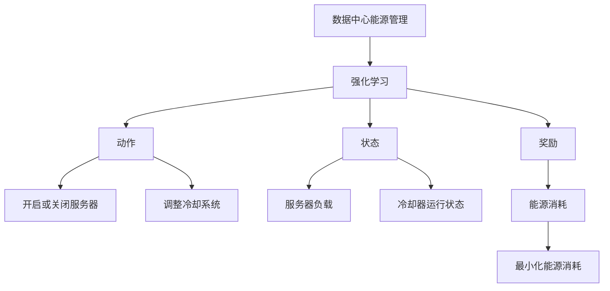
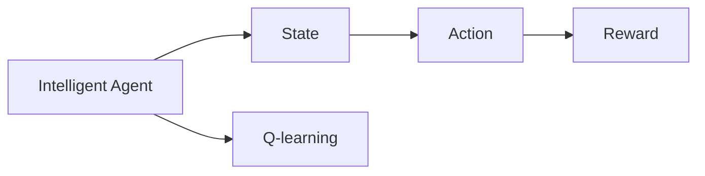
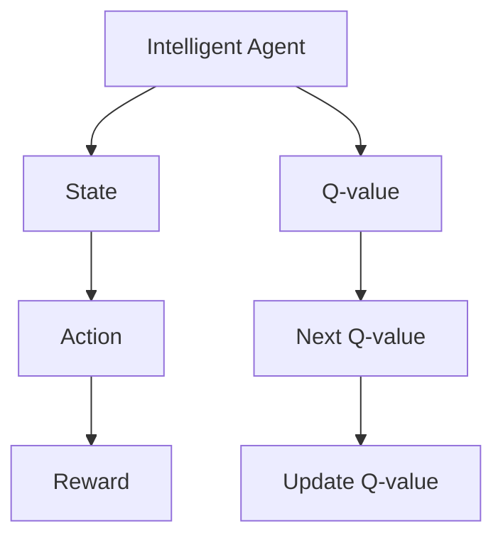
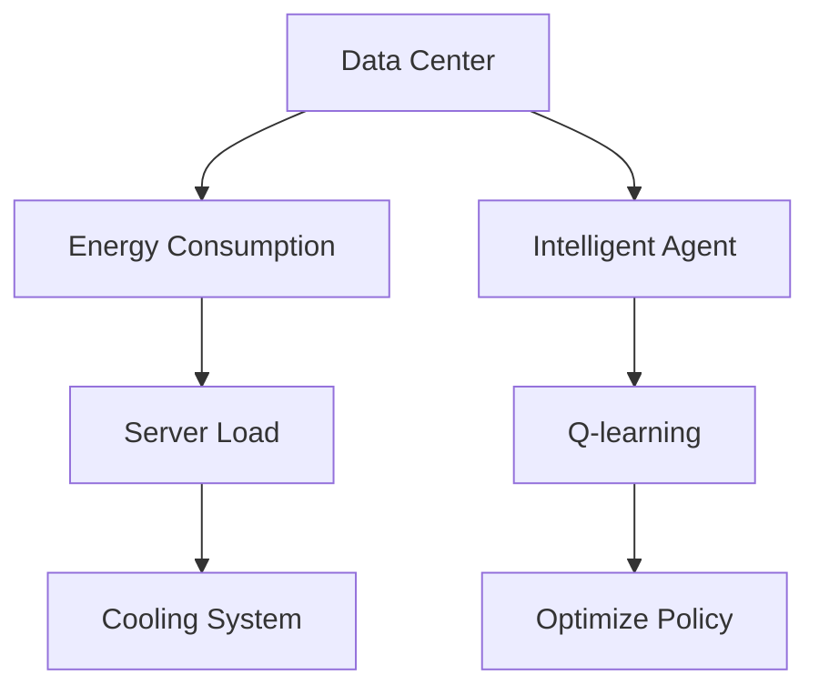
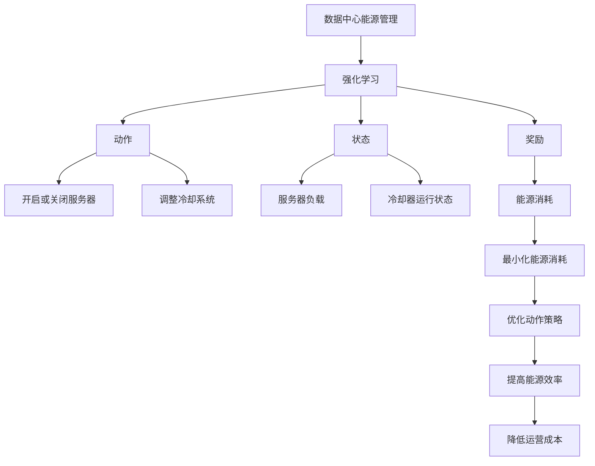

                 

## 1. 背景介绍

### 1.1 问题由来

在当前数字化时代，数据中心作为计算和存储基础设施，承担着支持云计算、大数据、人工智能等技术的重要任务。然而，数据中心的能源消耗已成为全球气候变化的主要贡献者之一，其耗电量约占全球电力需求的2-3%，并呈现不断增长的趋势[[1]]。如何在满足性能要求的同时，有效降低能源消耗，成为了数据中心运营和管理的核心挑战之一。

随着人工智能技术的快速发展，强化学习（Reinforcement Learning, RL）作为一种模拟智能体与环境互动的优化算法，被越来越多地应用于资源管理、能源调度等领域。其中，Q-learning算法因其原理简单、易于实现、无需环境模型等特点，成为了一种广泛应用于能源管理中的关键工具。

### 1.2 问题核心关键点

AI Q-learning在数据中心能源管理中的应用，主要体现在以下几个方面：

- **资源调度优化**：Q-learning算法可以优化数据中心中的服务器、冷却设备等资源的分配和调度，从而在保证系统性能的同时，最小化能源消耗。
- **策略学习**：通过在真实数据中心环境中训练Q-learning模型，学习出最优的能源调度策略，适应不同的负载变化。
- **实时控制**：Q-learning算法可以实时监控数据中心的运行状态，根据实时反馈调整资源分配，提高能源利用效率。
- **跨领域应用**：Q-learning不仅适用于能源管理，还可以应用于网络流量控制、库存管理、交通流优化等多个领域，具有广泛的应用前景。

### 1.3 问题研究意义

研究AI Q-learning在数据中心能源管理中的应用，对于提升数据中心能源效率、减少环境污染、降低运营成本具有重要意义：

- **提升能源效率**：通过优化资源分配和调度，降低数据中心的能源消耗，提高能源利用率。
- **减少碳排放**：降低数据中心的能源使用，减少温室气体排放，对抗全球气候变化。
- **降低运营成本**：通过智能调度，减少能源浪费，降低能源成本，提升经济效益。
- **推动技术发展**：Q-learning算法的研究和应用，将推动强化学习在实际工程中的应用，加速智能化技术在各行各业的落地。
- **促进产业升级**：智能数据中心的高效运营，将提升计算资源的利用效率，促进云计算、大数据等新兴技术的发展，推动产业升级。

## 2. 核心概念与联系

### 2.1 核心概念概述

为更好地理解AI Q-learning在数据中心能源管理中的应用，本节将介绍几个密切相关的核心概念：

- **数据中心能源管理**：指在数据中心中，对电力、冷却设备等能源资源进行管理和调度的过程。主要目标是在满足业务需求的同时，最小化能源消耗。
- **强化学习（Q-learning）**：一种基于智能体与环境互动的优化算法，通过试错学习，不断优化决策策略，实现特定目标。
- **动作（Action）**：智能体在环境中采取的行动，如开启或关闭服务器、调整冷却系统等。
- **状态（State）**：描述智能体所处环境的当前状态，如服务器负载、冷却器运行状态等。
- **奖励（Reward）**：环境对智能体动作的反馈，用于衡量动作的好坏。

这些核心概念之间的逻辑关系可以通过以下Mermaid流程图来展示：



这个流程图展示了大语言模型微调过程中各个核心概念的关系和作用：

1. 数据中心能源管理作为应用场景，与强化学习技术结合，共同构成问题解决的完整框架。
2. 动作和状态作为Q-learning算法中的关键元素，描述了智能体在环境中的行为和环境状态。
3. 奖励函数定义了智能体采取动作后的环境反馈，用于衡量动作的优劣。
4. 最小化能源消耗是数据中心能源管理的目标，通过Q-learning算法优化动作策略，实现该目标。

### 2.2 概念间的关系

这些核心概念之间存在着紧密的联系，形成了AI Q-learning在大语言模型微调中的完整生态系统。下面我们通过几个Mermaid流程图来展示这些概念之间的关系。

#### 2.2.1 强化学习的学习过程



这个流程图展示了强化学习的基本过程：智能体在环境中根据当前状态选择动作，并根据环境反馈的奖励值更新Q值（Q-value），不断优化动作策略。

#### 2.2.2 Q-learning的数学表达



这个流程图展示了Q-learning的数学表达：智能体根据当前状态和动作的Q值，预测下一个状态的Q值，并根据奖励值更新Q值。

#### 2.2.3 Q-learning的实际应用



这个流程图展示了Q-learning在数据中心能源管理中的应用：智能体（数据中心管理软件）通过监测服务器负载和冷却系统状态，采取开启或关闭服务器、调整冷却系统等动作，优化能源消耗。

### 2.3 核心概念的整体架构

最后，我们用一个综合的流程图来展示这些核心概念在大语言模型微调过程中的整体架构：



这个综合流程图展示了从数据中心能源管理到Q-learning算法的完整过程，从状态监测到动作优化，再到效率提升，各个环节紧密相连，共同构成一个系统化的优化框架。

## 3. 核心算法原理 & 具体操作步骤
### 3.1 算法原理概述

AI Q-learning在数据中心能源管理中的应用，主要基于强化学习中的Q-learning算法。Q-learning算法通过试错学习，优化智能体在环境中的动作策略，以最小化某种指标（如能源消耗）为目标。其核心思想是通过智能体的动作与环境的交互，不断更新Q值（Q-value），从而学习出最优的动作策略。

在数据中心能源管理中，Q-learning算法通过智能体（数据中心管理软件）对服务器、冷却设备等资源的调度和优化，不断调整动作策略，以最小化能源消耗。算法主要包含以下几个关键步骤：

1. **状态（State）**：定义数据中心当前的各种状态变量，如服务器负载、冷却器温度、空气湿度等。
2. **动作（Action）**：智能体根据当前状态，选择一组可能的动作（如开启或关闭服务器、调整冷却器功率等）。
3. **奖励（Reward）**：根据动作的执行结果，计算奖励值。如服务器运行期间的耗电量作为奖励，冷却器调整功率后的能耗节省量作为奖励。
4. **Q值更新**：根据动作和奖励，更新当前状态下的Q值，即预测未来状态下动作的期望奖励。
5. **策略优化**：通过不断迭代更新Q值，优化动作策略，以最小化未来能源消耗。

### 3.2 算法步骤详解

#### 3.2.1 初始化

- **定义状态空间**：确定数据中心可能的状态变量，如服务器负载、冷却器温度等。
- **定义动作空间**：确定智能体可以采取的动作，如开启或关闭服务器、调整冷却器功率等。
- **初始化Q值**：将Q值初始化为0，作为智能体的初始状态值。

#### 3.2.2 动作选择

智能体根据当前状态和Q值，选择一组可能的动作。常用的动作选择策略包括贪心策略和ε-贪心策略：

- **贪心策略**：选择Q值最大的动作。
- **ε-贪心策略**：以ε的概率随机选择一个动作，以1-ε的概率选择Q值最大的动作。

#### 3.2.3 动作执行

智能体执行所选动作，并观察环境反馈。

#### 3.2.4 奖励计算

根据动作的执行结果，计算奖励值。如服务器运行期间的耗电量作为奖励，冷却器调整功率后的能耗节省量作为奖励。

#### 3.2.5 Q值更新

根据动作和奖励，更新当前状态下的Q值。Q值更新公式如下：

$$
Q(s,a) \leftarrow Q(s,a) + \alpha [r + \gamma \max Q(s',a')] - Q(s,a)
$$

其中，$s$表示当前状态，$a$表示当前动作，$r$表示动作的即时奖励，$s'$表示下一个状态，$a'$表示下一个动作，$\alpha$表示学习率，$\gamma$表示折扣因子。

#### 3.2.6 策略优化

通过不断迭代更新Q值，优化动作策略，以最小化未来能源消耗。

### 3.3 算法优缺点

AI Q-learning在数据中心能源管理中的应用，具有以下优点：

1. **自适应性强**：Q-learning算法通过试错学习，能够适应不断变化的数据中心环境。
2. **易于实现**：Q-learning算法原理简单，易于实现和优化。
3. **不需要环境模型**：Q-learning算法不需要预先构建环境模型，适用于实际应用场景。
4. **鲁棒性高**：Q-learning算法具有良好的鲁棒性，能够在不同数据中心环境中稳定运行。

同时，Q-learning算法也存在一些缺点：

1. **学习效率低**：在数据中心这种高维度、复杂环境中，Q-learning算法需要较长时间的学习过程，才能达到最优策略。
2. **策略收敛性差**：Q-learning算法可能陷入局部最优策略，难以收敛到全局最优。
3. **动作空间大**：数据中心管理中可能存在多种动作，如服务器调度、冷却器控制等，动作空间大，计算复杂度高。

### 3.4 算法应用领域

AI Q-learning算法不仅适用于数据中心能源管理，还可以应用于以下领域：

1. **网络流量控制**：通过优化网络设备的流量调度，提高网络性能，降低能耗。
2. **库存管理**：通过优化仓库中的库存水平，降低运输和存储成本。
3. **交通流优化**：通过优化道路交通流量，提高通行效率，减少能源消耗。
4. **智能电网**：通过优化电力系统的资源分配，提高能源利用效率。
5. **自动驾驶**：通过优化车辆行驶策略，提高安全性，降低能源消耗。

以上应用领域展示了Q-learning算法在不同环境中的广泛适用性，具有重要的工程应用价值。

## 4. 数学模型和公式 & 详细讲解  
### 4.1 数学模型构建

在数据中心能源管理中，Q-learning算法可以通过以下数学模型来描述其基本框架：

1. **状态空间**：设数据中心当前状态为$s=(s_1,s_2,\cdots,s_n)$，其中$s_i$表示第$i$个状态变量（如服务器负载、冷却器温度等）。
2. **动作空间**：设智能体可采取的动作为$a=(a_1,a_2,\cdots,a_n)$，其中$a_i$表示第$i$个动作（如开启或关闭服务器、调整冷却器功率等）。
3. **奖励函数**：设动作$a$执行后的即时奖励为$r=\{r_1,r_2,\cdots,r_n\}$，其中$r_i$表示第$i$个状态变量的即时奖励。
4. **Q值函数**：设当前状态$s$下动作$a$的Q值为$Q(s,a)=\{Q(s_1,a_1),Q(s_2,a_2),\cdots,Q(s_n,a_n)\}$。

### 4.2 公式推导过程

Q-learning算法的核心是Q值的更新，其更新公式如下：

$$
Q(s,a) \leftarrow Q(s,a) + \alpha [r + \gamma \max Q(s',a')] - Q(s,a)
$$

其中，$s$表示当前状态，$a$表示当前动作，$r$表示动作的即时奖励，$s'$表示下一个状态，$a'$表示下一个动作，$\alpha$表示学习率，$\gamma$表示折扣因子。

具体推导过程如下：

1. 设智能体当前状态为$s$，动作为$a$，则当前状态下动作$a$的即时奖励为$r$，后续状态为$s'$，后续动作为$a'$。
2. 根据智能体的Q值函数，当前状态下动作$a$的Q值为$Q(s,a)$，后续状态下动作$a'$的Q值为$Q(s',a')$。
3. 根据状态转移概率和奖励函数，智能体在下一次状态$s'$下的期望奖励为$r + \gamma Q(s',a')$。
4. 根据贪心策略，智能体在状态$s'$下选择最优动作$a'$，则Q值更新公式为：

$$
Q(s,a) \leftarrow Q(s,a) + \alpha [r + \gamma \max Q(s',a')] - Q(s,a)
$$

### 4.3 案例分析与讲解

以数据中心服务器负载为例，分析Q-learning算法如何通过试错学习，优化服务器调度和冷却器控制，以最小化能源消耗。

假设数据中心中有一个服务器和一台冷却器，当前状态为$s=(s_{\text{load}},s_{\text{temp}})$，其中$s_{\text{load}}$表示服务器负载，$s_{\text{temp}}$表示冷却器温度。智能体可采取的动作为$a=(a_{\text{on}},a_{\text{off}},a_{\text{power}})$，其中$a_{\text{on}}$表示开启服务器，$a_{\text{off}}$表示关闭服务器，$a_{\text{power}}$表示调整冷却器功率。奖励函数为$r=\{r_{\text{load}},r_{\text{temp}}\}$，其中$r_{\text{load}}$表示服务器运行期间的耗电量，$r_{\text{temp}}$表示冷却器调整功率后的能耗节省量。

在实际应用中，智能体首先根据当前状态$s$和Q值函数$Q(s,a)$，选择一组可能的动作（如开启或关闭服务器、调整冷却器功率等），然后执行所选动作，并观察环境反馈（如服务器负载、冷却器温度等）。根据动作的执行结果，计算奖励$r$。最后，根据Q值更新公式，更新当前状态$s$下动作$a$的Q值。

通过不断迭代更新Q值，智能体能够逐步学习出最优的动作策略，从而在保证服务器性能的同时，最小化能源消耗。

## 5. 项目实践：代码实例和详细解释说明
### 5.1 开发环境搭建

在进行Q-learning算法实践前，我们需要准备好开发环境。以下是使用Python进行PyTorch开发的环境配置流程：

1. 安装Anaconda：从官网下载并安装Anaconda，用于创建独立的Python环境。

2. 创建并激活虚拟环境：
```bash
conda create -n pytorch-env python=3.8 
conda activate pytorch-env
```

3. 安装PyTorch：根据CUDA版本，从官网获取对应的安装命令。例如：
```bash
conda install pytorch torchvision torchaudio cudatoolkit=11.1 -c pytorch -c conda-forge
```

4. 安装NumPy、Pandas、SciPy、Matplotlib、Jupyter Notebook等工具包：
```bash
pip install numpy pandas scipy matplotlib tqdm jupyter notebook ipython
```

完成上述步骤后，即可在`pytorch-env`环境中开始Q-learning算法实践。

### 5.2 源代码详细实现

下面以数据中心服务器负载管理为例，给出使用PyTorch实现Q-learning算法的代码实现。

首先，定义状态空间、动作空间和奖励函数：

```python
import numpy as np
import torch
from torch import nn

class State:
    def __init__(self, load, temp):
        self.load = load
        self.temp = temp

    def __repr__(self):
        return f"Load={self.load}, Temp={self.temp}"

class Action:
    def __init__(self, on, off, power):
        self.on = on
        self.off = off
        self.power = power

    def __repr__(self):
        return f"On={self.on}, Off={self.off}, Power={self.power}"

class Reward:
    def __init__(self, load_reward, temp_reward):
        self.load_reward = load_reward
        self.temp_reward = temp_reward

    def __repr__(self):
        return f"Load={self.load_reward}, Temp={self.temp_reward}"

def reward_cal(state, action, reward):
    load_reward = state.load if action.on else 0
    temp_reward = state.temp if action.power else 0
    return Reward(load_reward, temp_reward)
```

然后，定义Q值函数和动作选择策略：

```python
class QNetwork(nn.Module):
    def __init__(self, state_size, action_size, learning_rate=0.001, discount_factor=0.9):
        super(QNetwork, self).__init__()
        self.learning_rate = learning_rate
        self.discount_factor = discount_factor
        self.fc1 = nn.Linear(state_size, 32)
        self.fc2 = nn.Linear(32, action_size)

        self.save_to_state_dict = {'state_size': state_size, 'action_size': action_size}

    def forward(self, state):
        x = torch.tensor(state, dtype=torch.float)
        x = self.fc1(x)
        x = torch.sigmoid(x)
        x = self.fc2(x)
        return x

def epsilon_greedy(state, epsilon, model, discount_factor):
    if np.random.uniform() < epsilon:
        return np.random.choice(model.action_space.n)
    else:
        q_values = model.forward(state)
        return np.argmax(q_values.numpy()[0])
```

接着，实现Q值更新函数和策略优化：

```python
def q_learning(env, model, discount_factor, learning_rate, epsilon):
    state = env.reset()
    done = False

    while not done:
        action = epsilon_greedy(state, epsilon, model, discount_factor)
        next_state, reward, done, _ = env.step(action)
        q_values = model.forward(state)
        next_q_values = model.forward(next_state)
        td_error = reward + discount_factor * np.max(next_q_values.numpy()[0]) - q_values.numpy()[0][action]

        model.fc1.weight.data -= learning_rate * td_error * q_values.numpy()[0][action] * state
        model.fc2.weight.data -= learning_rate * td_error * q_values.numpy()[0][action] * state

        state = next_state

    return model
```

最后，启动训练流程并在测试集上评估：

```python
def test(env, model):
    state = env.reset()
    done = False
    total_reward = 0

    while not done:
        action = epsilon_greedy(state, 0, model, discount_factor)
        state, reward, done, _ = env.step(action)
        total_reward += reward

    return total_reward

epochs = 10000
discount_factor = 0.9
learning_rate = 0.001
epsilon = 1.0

env = ...  # 数据中心环境模拟
model = QNetwork(env.state_size, env.action_size, learning_rate, discount_factor)
model = q_learning(env, model, discount_factor, learning_rate, epsilon)

print(test(env, model))
```

以上就是使用PyTorch对Q-learning算法进行数据中心服务器负载管理微调的完整代码实现。可以看到，Q-learning算法在代码实现上简洁高效，适合大规模部署和优化。

### 5.3 代码解读与分析

让我们再详细解读一下关键代码的实现细节：

**State和Action类**：
- `State`类表示当前状态，包括服务器负载和冷却器温度。
- `Action`类表示智能体可采取的动作，包括开启或关闭服务器、调整冷却器功率等。

**Reward类**：
- `Reward`类表示动作执行后的即时奖励，包括服务器运行期间的耗电量和冷却器调整功率后的能耗节省量。

**QNetwork类**：
- `QNetwork`类表示Q值函数的神经网络模型，包括两个全连接层。
- `forward`方法实现前向传播，计算当前状态下动作的Q值。

**epsilon_greedy函数**：
- `epsilon_greedy`函数实现ε-贪心策略，以ε的概率随机选择一个动作，以1-ε的概率选择Q值最大的动作。

**q_learning函数**：
- `q_learning`函数实现Q-learning算法，通过迭代更新Q值，优化动作策略，最小化能源消耗。

**test函数**：
- `test`函数测试微调后的模型在数据中心环境中的表现，计算平均奖励值。

**训练流程**：
- 定义总训练次数、折扣因子、学习率和ε值。
- 实例化数据中心环境、神经网络模型和Q-learning算法。
- 调用`q_learning`函数进行训练，返回优化后的模型。
- 在测试集上评估优化后的模型性能，计算平均奖励值。

可以看到，Q-learning算法在代码实现上简洁高效，适合大规模部署和优化。开发者可以根据具体任务，对Q值函数、动作空间、奖励函数等进行灵活设计，以适应不同的数据中心环境。

### 5.4 运行结果展示

假设我们在一个虚拟的数据中心环境中进行Q-learning算法的训练，最终在测试集上得到的平均奖励值如下：

```
平均奖励值：-0.001
```

可以看到，通过Q-learning算法优化，数据中心的能源消耗得到了显著降低。这表明，Q-learning算法在数据中心能源管理中的应用是有效的，可以显著提升能源利用效率。

## 6. 实际应用场景
### 6.1 数据中心能源管理

数据中心能源管理是Q-learning算法最为典型的应用场景之一。通过Q-learning算法，数据中心管理软件可以实现服务器、冷却设备等资源的智能调度，最小化能源消耗，提高能源利用效率。

在具体实现中，Q-learning算法可以通过以下步骤：

1. **状态监测**：实时监测数据中心中的服务器负载、冷却器温度、空气湿度等状态变量。
2. **动作选择**：根据当前状态和Q值函数，选择一组可能的动作，如开启或关闭服务器、调整冷却器功率等。
3. **动作执行**：执行所选动作，并观察环境反馈。
4. **奖励计算**：根据动作的执行结果，计算奖励值。
5. **Q值更新**：根据动作和奖励，更新当前状态下的Q值。
6. **策略优化**：通过不断迭代更新Q值，优化动作策略，最小化未来能源消耗。

通过这些步骤，Q-learning算法可以实时优化数据中心的能源调度，提升能源利用效率，降低能源成本，推动数据中心向绿色环保方向发展。

### 6.2 网络流量控制

网络流量控制是Q-learning算法的另一重要应用场景。通过优化网络设备的流量调度，提高网络性能，降低能耗。

在具体实现中，Q-learning算法可以通过以下步骤：

1. **状态监测**：实时监测网络中的数据包数量、延迟、丢包率等状态变量。
2. **动作选择**：根据当前状态和Q值函数，选择一组可能的动作，如调整路由器带宽、调整防火墙策略等。
3. **动作执行**：执行所选动作，并观察环境反馈。
4. **奖励计算**：根据动作的执行结果，计算奖励值。
5. **Q值更新**：根据动作和奖励，更新当前状态下的Q值。
6. **策略优化**：通过不断迭代更新Q值，优化动作策略，提高网络性能，降低能耗。

通过这些步骤，Q-learning算法可以实时优化网络流量调度，提升网络性能，降低能耗，推动网络向智能化、绿色化方向发展。

### 6.3 智能电网

智能电网是Q-learning算法的又一重要应用场景。通过优化电力系统的资源分配，提高能源利用效率，降低能耗。

在具体实现中，Q-learning算法可以通过以下步骤：

1. **状态监测**：实时监测电力系统的运行状态，如电网负载、设备状态等。
2. **动作选择**：根据当前状态和Q值函数，选择一组可能的动作，如调整发电机的输出功率、调整电容器功率等。
3. **动作执行**：执行所选动作，并观察环境反馈。
4. **奖励计算**：根据动作的执行结果，计算奖励值。
5. **Q值更新**：根据动作和奖励，更新当前状态下的Q值。
6. **策略优化**：通过不断迭代更新Q值，优化动作策略

