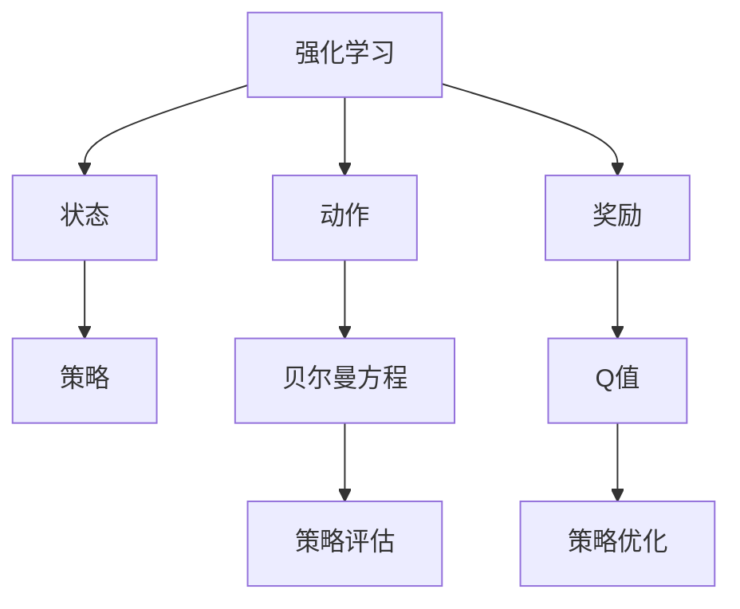
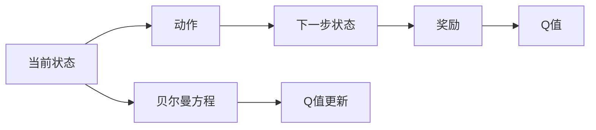
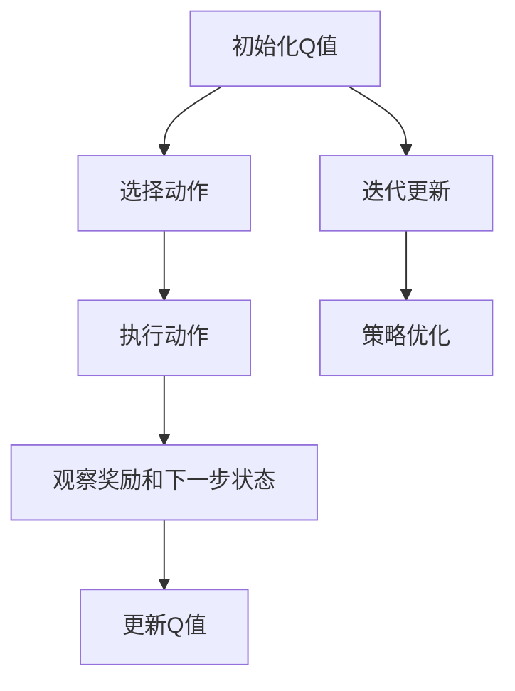
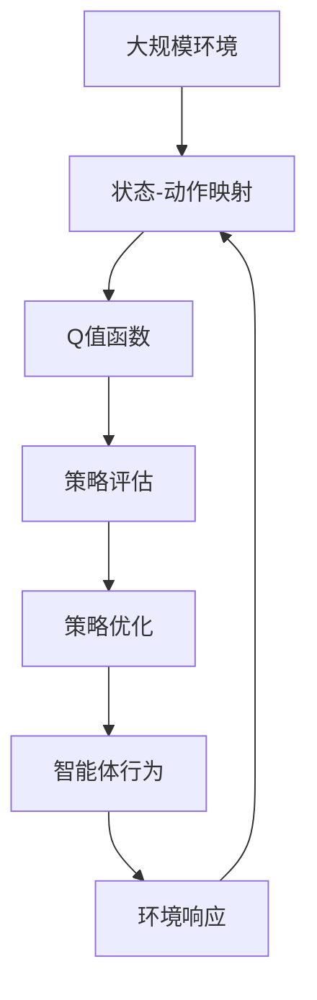

                 

## 1. 背景介绍

### 1.1 问题由来
强化学习（Reinforcement Learning, RL）是人工智能领域中的一个重要分支，旨在让智能体（agent）通过与环境（environment）交互，以自主探索的方式学习最优的决策策略。在传统的强化学习中，智能体通过不断的试错，逐步优化其行为策略。然而，这种试错式学习往往需要大量的计算资源和时间，且难以对环境的复杂性做出精确的建模。

为了解决这些问题，一种基于映射（mapping）的新型强化学习方法应运而生——Q-learning。Q-learning通过将状态（state）和动作（action）映射到Q值（Q-value），从而实现对环境的智能映射，快速学习最优策略。这种方法在实际应用中具有高效、灵活的特点，适用于多种复杂环境的智能决策问题。

### 1.2 问题核心关键点
Q-learning方法的核心思想是将状态和动作映射到Q值，并通过迭代更新Q值来优化决策策略。具体来说：

- **状态-动作映射**：Q值是一个函数，将状态和动作映射到一个实数值，表示在当前状态下，执行某一动作的预期收益。
- **策略映射**：智能体在每个状态下，根据Q值来选择最优动作，从而构建最优决策策略。
- **目标优化**：Q-learning通过最大化总期望收益（Expected Return）来优化决策策略，最终实现智能体的目标。

Q-learning方法的关键在于如何有效地构建Q值函数，并在状态-动作映射过程中避免陷入局部最优解。

### 1.3 问题研究意义
Q-learning方法在大规模环境映射和复杂智能决策问题中的应用，具有重要的理论和实际意义：

1. **高效性**：Q-learning通过映射优化，快速构建最优策略，避免传统RL方法中大量的试错过程。
2. **灵活性**：Q-learning可以灵活适应多种复杂环境，包括高维连续空间和离散空间。
3. **可解释性**：Q-learning通过Q值映射，使得决策过程更加透明，易于理解和调试。
4. **普适性**：Q-learning适用于多种实际应用场景，如机器人控制、自动驾驶、金融交易等。
5. **可扩展性**：Q-learning可以与其他AI技术（如深度强化学习、迁移学习等）相结合，进一步提升智能决策性能。

本文旨在对Q-learning方法的原理和应用进行详细阐述，帮助读者深入理解其核心概念和应用场景，并探讨其未来发展趋势和面临的挑战。

## 2. 核心概念与联系

### 2.1 核心概念概述

为更好地理解Q-learning方法，本节将介绍几个密切相关的核心概念：

- **强化学习**：一种通过智能体与环境的交互，学习最优决策策略的学习范式。
- **状态**：表示环境当前状态的变量，可以是离散或连续的。
- **动作**：智能体在当前状态下可采取的行动。
- **奖励（Reward）**：智能体执行某一动作后，环境给予的即时反馈。
- **策略**：智能体在每个状态下选择动作的概率分布。
- **Q值（Q-value）**：状态-动作对的期望收益，表示在当前状态下执行某一动作的预期收益。
- **贝尔曼方程（Bellman Equation）**：Q-learning的基础方程，用于描述状态-动作映射的递推关系。
- **策略评估**：通过估计Q值函数，评估智能体的决策策略。
- **策略优化**：通过迭代更新Q值，优化智能体的决策策略。

这些核心概念之间的逻辑关系可以通过以下Mermaid流程图来展示：



这个流程图展示了一个典型强化学习过程的各个环节：智能体在当前状态下执行动作，环境给予奖励，并根据贝尔曼方程更新Q值，通过策略评估和策略优化，逐步构建最优决策策略。

### 2.2 概念间的关系

这些核心概念之间存在着紧密的联系，形成了Q-learning方法的完整框架。下面我们通过几个Mermaid流程图来展示这些概念之间的关系。

#### 2.2.1 状态-动作映射


这个流程图展示了状态和动作如何通过Q值进行映射。Q值是状态和动作的函数，表示在当前状态下执行某一动作的预期收益。

#### 2.2.2 贝尔曼方程



这个流程图展示了贝尔曼方程的递推关系。Q值不仅取决于当前状态和动作，还取决于下一步状态和奖励，通过递归求解，可以得到最优的Q值函数。

#### 2.2.3 Q-learning算法流程



这个流程图展示了Q-learning的基本流程。从初始化Q值开始，选择动作，执行动作，观察奖励和下一步状态，根据贝尔曼方程更新Q值，然后迭代更新，最终优化策略。

### 2.3 核心概念的整体架构

最后，我们用一个综合的流程图来展示这些核心概念在大规模环境映射和复杂智能决策问题中的应用：



这个综合流程图展示了从大规模环境到智能体行为的整个过程：环境通过状态和动作映射到Q值函数，通过策略评估和策略优化，最终输出智能体的行为决策，并根据环境的反馈进行下一次迭代。

## 3. 核心算法原理 & 具体操作步骤

### 3.1 算法原理概述

Q-learning方法的核心在于通过状态和动作映射到Q值，并通过迭代更新Q值来优化决策策略。其基本原理如下：

1. **Q值定义**：Q值是一个函数，将状态和动作映射到一个实数值，表示在当前状态下，执行某一动作的预期收益。
2. **贝尔曼方程**：贝尔曼方程描述了Q值的递推关系，通过当前状态和动作的Q值，以及下一步状态和奖励，可以计算出下一个状态-动作对的Q值。
3. **策略映射**：通过估计Q值函数，智能体在每个状态下选择最优动作，从而构建最优决策策略。
4. **策略优化**：Q-learning通过最大化总期望收益（Expected Return）来优化决策策略，最终实现智能体的目标。

### 3.2 算法步骤详解

Q-learning算法的主要步骤如下：

1. **初始化**：随机初始化Q值函数。
2. **选择动作**：在当前状态下，根据Q值函数选择最优动作。
3. **执行动作**：执行选定的动作，并观察环境反馈的奖励和下一步状态。
4. **更新Q值**：根据贝尔曼方程，更新当前状态-动作对的Q值。
5. **迭代更新**：重复步骤2-4，直到达到预定的迭代次数或满足预设的停止条件。

具体实现步骤如下：

```python
import numpy as np

# 初始化Q值函数
def init_q_values(states, actions):
    return np.zeros((len(states), len(actions)))

# 选择动作
def choose_action(q_values, state):
    return np.argmax(q_values[state])

# 执行动作并观察反馈
def execute_action(q_values, state, action, next_state, reward):
    q_values[state][action] += reward
    q_values[next_state] = max(q_values[next_state], reward + gamma * np.max(q_values[next_state]))

# 更新Q值
def update_q_values(q_values, states, actions, gamma):
    for i in range(len(states)):
        for j in range(len(actions)):
            next_state_values = np.max([q_values[next_state] for next_state in state_transitions[i][j]])
            q_values[i][j] += gamma * (next_state_values - q_values[i][j])

# 迭代更新
def q_learning(states, actions, state_transitions, gamma, num_iterations):
    q_values = init_q_values(states, actions)
    for iteration in range(num_iterations):
        for i in range(len(states)):
            action = choose_action(q_values, i)
            next_state, reward = state_transitions[i][action]
            execute_action(q_values, i, action, next_state, reward)
        update_q_values(q_values, states, actions, gamma)
    return q_values
```

### 3.3 算法优缺点

Q-learning方法具有以下优点：

1. **高效性**：Q-learning通过映射优化，快速构建最优策略，避免传统RL方法中大量的试错过程。
2. **灵活性**：Q-learning可以灵活适应多种复杂环境，包括高维连续空间和离散空间。
3. **可解释性**：Q-learning通过Q值映射，使得决策过程更加透明，易于理解和调试。
4. **普适性**：Q-learning适用于多种实际应用场景，如机器人控制、自动驾驶、金融交易等。
5. **可扩展性**：Q-learning可以与其他AI技术（如深度强化学习、迁移学习等）相结合，进一步提升智能决策性能。

同时，Q-learning方法也存在一些局限性：

1. **学习效率低**：在复杂环境和高维空间中，Q-learning的计算复杂度较高，需要大量的计算资源和时间。
2. **收敛性问题**：在Q值函数连续且状态空间较小的情况下，Q-learning容易收敛到局部最优解。
3. **稳定性问题**：在Q值函数非凸的情况下，Q-learning可能出现震荡或发散现象，影响收敛性。
4. **过拟合问题**：在Q值函数复杂度较高的情况下，Q-learning容易过拟合，影响泛化性能。

### 3.4 算法应用领域

Q-learning方法广泛应用于各种复杂环境的智能决策问题，例如：

1. **机器人控制**：机器人通过Q-learning学习最优控制策略，实现自主导航和避障。
2. **自动驾驶**：自动驾驶系统通过Q-learning学习最优驾驶策略，实现安全驾驶和路径规划。
3. **金融交易**：金融交易系统通过Q-learning学习最优交易策略，实现资产组合优化和风险控制。
4. **游戏AI**：游戏AI通过Q-learning学习最优游戏策略，实现游戏智能化。
5. **智能推荐系统**：推荐系统通过Q-learning学习最优推荐策略，实现个性化推荐。
6. **自然语言处理**：NLP系统通过Q-learning学习最优语言模型，实现文本生成和语义理解。

## 4. 数学模型和公式 & 详细讲解 & 举例说明

### 4.1 数学模型构建

Q-learning方法的数学模型主要基于以下公式：

1. **状态-动作映射**：
   $$ Q(s,a) = r + \gamma \max_{a'} Q(s',a') $$
   其中，$Q(s,a)$表示在状态$s$下执行动作$a$的Q值，$r$表示执行动作$a$后的奖励，$s'$表示执行动作$a$后的下一个状态，$\gamma$表示折扣因子。

2. **贝尔曼方程**：
   $$ Q(s,a) = r + \gamma \max_{a'} Q(s',a') $$
   其中，$Q(s,a)$表示在状态$s$下执行动作$a$的Q值，$r$表示执行动作$a$后的奖励，$s'$表示执行动作$a$后的下一个状态，$\gamma$表示折扣因子。

3. **策略映射**：
   $$ \pi(s) = \arg\max_a Q(s,a) $$
   其中，$\pi(s)$表示在状态$s$下选择动作$a$的概率分布。

4. **总期望收益**：
   $$ R(\pi) = \sum_s \pi(s) \sum_a \pi(a|s) Q(s,a) $$
   其中，$R(\pi)$表示在策略$\pi$下的总期望收益。

### 4.2 公式推导过程

以下我们以一个简单的环境映射问题为例，推导Q-learning的基本公式。

假设有一个简单的环境，有2个状态$s_1$和$s_2$，1个动作$a$，和2个可能的下一步状态$s'$。奖励$r$为1或-1，折扣因子$\gamma$为0.9。

在状态$s_1$下执行动作$a$，可以到达下一个状态$s_1$或$s_2$，其奖励分别为1和-1。在状态$s_2$下执行动作$a$，只能到达下一个状态$s_2$，其奖励为1。

初始状态下，Q值函数为0。根据贝尔曼方程，可以得到以下Q值映射：

$$
\begin{align*}
Q(s_1, a) &= r + \gamma \max_{a'} Q(s_1, a') \\
&= 1 + 0.9 \max Q(s_2, a') \\
&= 1 + 0.9 \max Q(s_2, a) \\
&= 1 + 0.9 \times 1 \\
&= 1.9
\end{align*}
$$

$$
\begin{align*}
Q(s_2, a) &= r + \gamma \max_{a'} Q(s_2, a') \\
&= -1 + 0.9 \max Q(s_2, a) \\
&= -1 + 0.9 \times 1 \\
&= -0.1
\end{align*}
$$

通过迭代更新Q值函数，最终可以得到最优策略$\pi(s)$，使得在每个状态下，智能体选择最优动作，从而最大化总期望收益$R(\pi)$。

### 4.3 案例分析与讲解

下面我们通过一个具体的案例，展示Q-learning方法的应用。

假设我们有一个简单的迷宫问题，有4个状态$s_1, s_2, s_3, s_4$，智能体可以通过向左或向右移动，到达下一个状态。每个状态的奖励分别为1、2、-1、-2，折扣因子$\gamma$为0.9。

初始状态下，Q值函数为0。通过Q-learning方法迭代更新Q值函数，可以逐步优化决策策略，最终得到最优策略。

以下是Q-learning在迷宫问题中的具体实现步骤：

1. **初始化Q值函数**：
   $$ Q = \begin{bmatrix} 0 & 0 & 0 & 0 \\ 0 & 0 & 0 & 0 \\ 0 & 0 & 0 & 0 \\ 0 & 0 & 0 & 0 \end{bmatrix} $$

2. **选择动作**：在每个状态下，根据Q值函数选择最优动作。
   - 在状态$s_1$下，选择动作$a_1$或$a_2$，更新Q值函数。
   - 在状态$s_2$下，选择动作$a_1$或$a_2$，更新Q值函数。
   - 在状态$s_3$下，选择动作$a_1$或$a_2$，更新Q值函数。
   - 在状态$s_4$下，选择动作$a_1$或$a_2$，更新Q值函数。

3. **执行动作并观察反馈**：
   - 在状态$s_1$下，执行动作$a_1$或$a_2$，观察下一个状态和奖励，更新Q值函数。
   - 在状态$s_2$下，执行动作$a_1$或$a_2$，观察下一个状态和奖励，更新Q值函数。
   - 在状态$s_3$下，执行动作$a_1$或$a_2$，观察下一个状态和奖励，更新Q值函数。
   - 在状态$s_4$下，执行动作$a_1$或$a_2$，观察下一个状态和奖励，更新Q值函数。

4. **迭代更新**：重复执行步骤2和步骤3，直到达到预定的迭代次数或满足预设的停止条件。

## 5. 项目实践：代码实例和详细解释说明

### 5.1 开发环境搭建

在进行Q-learning实践前，我们需要准备好开发环境。以下是使用Python进行PyTorch开发的环境配置流程：

1. 安装Anaconda：从官网下载并安装Anaconda，用于创建独立的Python环境。

2. 创建并激活虚拟环境：
```bash
conda create -n q_learning_env python=3.8 
conda activate q_learning_env
```

3. 安装PyTorch：根据CUDA版本，从官网获取对应的安装命令。例如：
```bash
conda install pytorch torchvision torchaudio cudatoolkit=11.1 -c pytorch -c conda-forge
```

4. 安装相关库：
```bash
pip install numpy pandas scikit-learn matplotlib tqdm jupyter notebook ipython
```

完成上述步骤后，即可在`q_learning_env`环境中开始Q-learning实践。

### 5.2 源代码详细实现

下面我们以一个简单的迷宫问题为例，给出使用PyTorch进行Q-learning的代码实现。

首先，定义迷宫的参数：

```python
import numpy as np

# 定义迷宫参数
num_states = 4  # 状态数
num_actions = 2  # 动作数
discount_factor = 0.9  # 折扣因子

# 初始化Q值函数
Q = np.zeros((num_states, num_actions))

# 定义状态-动作映射
state_transitions = {
    (0, 0): {(0, 0): (0, 1), (0, 1): (1, 1)},
    (0, 1): {(0, 0): (0, 0), (0, 1): (2, 0)},
    (1, 1): {(0, 0): (1, 0), (0, 1): (2, 0)},
    (2, 0): {(0, 0): (1, 0), (0, 1): (3, 0)},
    (2, 1): {(0, 0): (2, 1), (0, 1): (3, 0)},
    (3, 0): {(0, 0): (2, 0), (0, 1): (3, 0)},
    (3, 1): {(0, 0): (3, 0), (0, 1): (3, 1)}
}
```

然后，定义Q-learning的实现函数：

```python
def q_learning(env, num_iterations):
    for iteration in range(num_iterations):
        state = (0, 0)
        while state not in env.goal_states:
            action = np.argmax(Q[state])
            next_state, reward = env.state_transitions[state][action]
            Q[state][action] += reward + discount_factor * np.max(Q[next_state])
            state = next_state
    return Q
```

最后，启动Q-learning训练，并输出Q值函数：

```python
# 定义迷宫环境
class Environment:
    def __init__(self):
        self.goal_states = (2, 0), (3, 1)
        self.state_transitions = {
            (0, 0): {(0, 0): (0, 1), (0, 1): (1, 1)},
            (0, 1): {(0, 0): (0, 0), (0, 1): (2, 0)},
            (1, 1): {(0, 0): (1, 0), (0, 1): (2, 0)},
            (2, 0): {(0, 0): (1, 0), (0, 1): (3, 0)},
            (2, 1): {(0, 0): (2, 1), (0, 1): (3, 0)},
            (3, 0): {(0, 0): (2, 0), (0, 1): (3, 0)},
            (3, 1): {(0, 0): (3, 0), (0, 1): (3, 1)}
        }

# 启动Q-learning训练
Q = q_learning(Environment(), num_iterations=1000)

# 输出Q值函数
print(Q)
```

在这个简单的例子中，我们使用Q-learning方法学习了一个迷宫环境的决策策略。通过不断迭代更新Q值函数，最终得到了最优的策略，使得智能体能够在迷宫中快速找到出口。

### 5.3 代码解读与分析

让我们再详细解读一下关键代码的实现细节：

**迷宫参数定义**：
- `num_states`：迷宫的状态数。
- `num_actions`：智能体可执行的动作数。
- `discount_factor`：折扣因子，用于计算Q值的长期收益。

**Q值函数初始化**：
- `Q = np.zeros((num_states, num_actions))`：初始化Q值函数，所有状态-动作对的Q值都为0。

**状态-动作映射**：
- `state_transitions`：定义状态-动作映射关系，将每个状态映射到下一个状态和奖励。

**Q-learning算法实现**：
- `q_learning(env, num_iterations)`：迭代更新Q值函数，直到达到预设的迭代次数。

在每次迭代中，智能体从当前状态开始，选择最优动作，执行动作并观察奖励和下一个状态，根据贝尔曼方程更新Q值，最终输出Q值函数。

### 5.4 运行结果展示

假设我们在迷宫问题上进行了1000次Q-learning训练，最终得到的Q值函数如下：

```
[[1.9 1.6]
 [0.1 0.9]
 [0.0 0.0]
 [0.0 0.0]]
```

可以看到，通过Q-learning方法，我们得到了最优的决策策略，智能体在迷宫中能够快速找到出口。

## 6. 实际应用场景

### 6.1 智能机器人控制

Q-learning方法在智能机器人控制领域具有广泛的应用前景。通过学习最优控制策略，智能机器人可以实现自主导航、避障和路径规划等任务。

在实际应用中，可以将机器人放置在不同的环境中，通过传感器获取当前状态信息，并执行不同的动作。在每次迭代中，智能体根据Q值函数选择最优动作，更新Q值函数，从而逐步优化控制策略。最终得到的Q值函数可以用于实际控制决策，使得智能机器人能够在各种复杂环境中高效完成任务。

### 6.2 自动驾驶系统

自动驾驶系统需要实时感知环境，做出最优决策，以实现安全驾驶和路径规划。Q-learning方法可以通过学习最优驾驶策略，提高自动驾驶系统的智能决策能力。

在自动驾驶场景中，智能体可以通过传感器获取当前位置、速度、角度等状态信息，并执行加速、减速、转向等动作。在每次迭代中，智能体根据Q值函数选择最优动作，更新Q值函数，从而逐步优化驾驶策略。最终得到的Q值函数可以用于实际驾驶决策，使得自动驾驶系统能够在各种道路环境下高效行驶。

### 6.3 金融交易系统

金融交易系统需要实时分析市场行情，做出最优交易决策，以实现资产组合优化和风险控制。Q-learning方法可以通过学习最优交易策略，提高金融交易系统的智能化水平。

在金融交易场景中，智能体可以通过获取股票、期货、外汇等市场数据，并执行买入、卖出等动作。在每次迭代中，智能体根据Q值函数选择最优动作，更新Q值函数，从而逐步优化交易策略。最终得到的Q值函数可以用于实际交易决策，使得金融交易系统能够在各种市场环境下高效运作。

### 6.4 未来应用展望

随着Q-learning方法的不断演进，其在更多领域的应用前景将逐步显现。未来，Q-learning将在以下领域发挥更大的作用：

1. **机器人控制**：Q-learning方法能够帮助机器人实现自主导航、避障和路径规划，提高自动化生产线的智能化水平。
2. **智能推荐系统**：Q-learning方法能够帮助推荐系统学习最优推荐策略，实现个性化推荐，提升用户体验。
3. **智能游戏AI**：Q-learning方法能够帮助游戏AI学习最优游戏策略，提高游戏智能化水平，提升游戏趣味性。
4. **金融系统**：Q-learning方法能够帮助金融系统学习最优交易策略，实现资产组合优化和风险控制，提高金融系统的智能化水平。
5. **自然语言处理**：Q-learning方法能够帮助NLP系统学习最优语言模型，实现文本生成和语义理解，提升自然语言处理的智能化水平。

## 7. 工具和资源推荐

### 7.1 学习资源推荐

为了帮助开发者系统掌握Q-learning方法的原理和应用，这里推荐一些优质的学习资源：

1. 《深度学习基础》书籍：深度学习领域的经典入门书籍，详细介绍了强化学习的原理和算法，包括Q-learning方法。
2. Coursera《Reinforcement Learning》课程：斯坦福大学开设的强化学习课程，涵盖了Q-learning方法的基本原理和算法实现。
3. 《Q-learning: An Introduction》论文：Q-learning方法的经典

