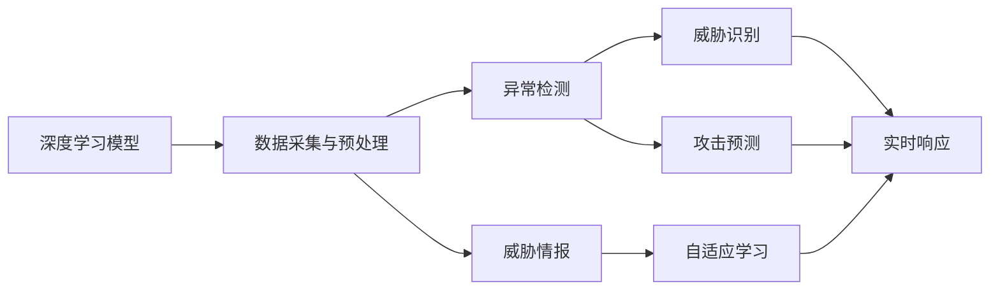
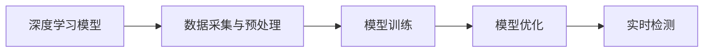
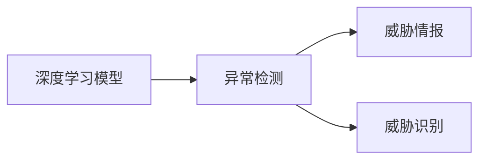
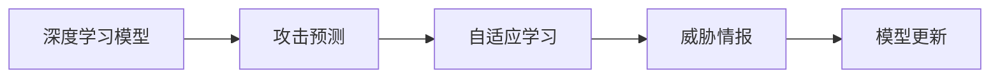
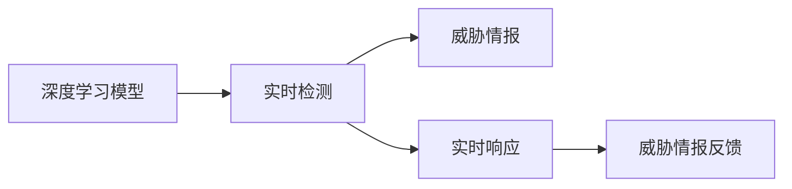
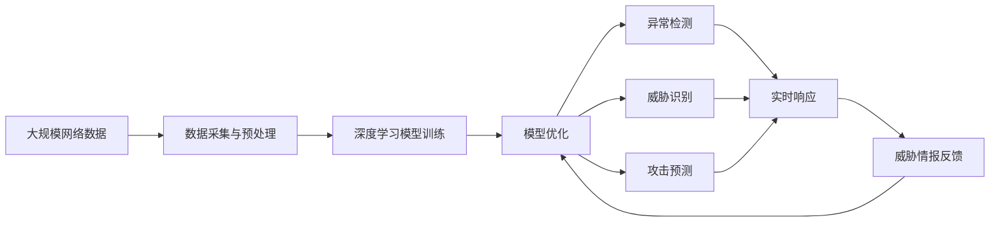

                 

## 1. 背景介绍

### 1.1 问题由来
随着互联网技术的蓬勃发展，网络安全问题日益严峻。恶意软件、网络钓鱼、DDoS攻击等新型网络威胁层出不穷，给个人和企业带来了巨大的经济损失和信息安全风险。传统的基于规则和签名的防御机制，由于规则有限、签名容易逃避，往往难以应对复杂多变的攻击行为。人工智能（AI），特别是深度学习技术的兴起，为网络安全领域带来了新的解决方案。AI技术可以通过学习大量的网络流量和攻击行为数据，实现对未知威胁的自动检测和防御。

### 1.2 问题核心关键点
AI在网络安全中的应用，主要集中在异常检测、威胁识别、攻击预测和应急响应等方面。核心关键点包括：
1. **数据采集与预处理**：从网络流量、日志文件、操作系统日志等数据源中提取有效特征。
2. **模型训练与优化**：通过深度学习模型对提取的特征进行训练，提高模型的检测和识别能力。
3. **实时检测与响应**：利用训练好的模型对实时数据进行检测，及时发现和响应安全事件。
4. **自适应与升级**：模型需要根据最新的威胁情报和攻击模式进行动态调整和升级，保持防御能力。

### 1.3 问题研究意义
AI在网络安全领域的应用，对于提升网络防御能力，降低安全事件带来的损失，保障关键信息基础设施的安全，具有重要意义。通过AI技术，网络安全从被动防御转向主动防御，能够更快速地识别和应对威胁，减少安全漏洞被利用的机会。此外，AI还可以用于安全漏洞的自动化分析与修复，提升安全响应效率。

## 2. 核心概念与联系

### 2.1 核心概念概述

为更好地理解AI在网络安全中的应用，本节将介绍几个密切相关的核心概念：

- **深度学习模型**：以神经网络为代表的一类机器学习算法，通过多层非线性变换，从大量数据中提取复杂的特征表示。
- **异常检测**：识别数据中的异常行为，用于检测恶意软件、内部威胁等安全事件。
- **威胁情报**：关于网络威胁和攻击行为的最新信息，用于指导模型的训练和优化。
- **自适应学习**：模型能够根据最新的威胁情报和攻击模式进行动态调整，保持防御能力。
- **攻击预测**：预测未来的攻击行为，帮助制定更有效的防御策略。
- **实时响应**：在检测到安全事件后，及时采取措施进行防御和响应。

这些核心概念之间的逻辑关系可以通过以下Mermaid流程图来展示：



这个流程图展示了大模型在网络安全中的工作流程：

1. 深度学习模型从数据采集与预处理中获得特征。
2. 异常检测和威胁识别利用这些特征检测和识别安全事件。
3. 攻击预测基于历史和当前数据进行未来攻击的预测。
4. 自适应学习根据威胁情报动态调整模型参数。
5. 实时响应在检测到安全事件后立即采取防御措施。

### 2.2 概念间的关系

这些核心概念之间存在着紧密的联系，形成了AI在网络安全中的整体架构。下面我通过几个Mermaid流程图来展示这些概念之间的关系。

#### 2.2.1 深度学习模型的训练与优化



这个流程图展示了深度学习模型的训练与优化流程。通过数据采集与预处理，模型从原始数据中提取特征，然后使用模型训练和优化算法进行参数调整，最后得到能够进行实时检测的模型。

#### 2.2.2 异常检测与威胁识别



这个流程图展示了异常检测和威胁识别之间的关系。异常检测利用模型检测到的特征进行异常行为识别，威胁情报则用于进一步确认威胁类型。

#### 2.2.3 攻击预测与自适应学习



这个流程图展示了攻击预测和自适应学习的关系。攻击预测基于历史数据进行未来攻击的预测，自适应学习则根据最新的威胁情报和攻击模式进行模型更新，保持防御能力。

#### 2.2.4 实时响应与反馈机制



这个流程图展示了实时响应和威胁情报反馈的关系。实时响应在检测到安全事件后立即采取防御措施，威胁情报反馈则用于指导模型进行动态调整和优化。

### 2.3 核心概念的整体架构

最后，我们用一个综合的流程图来展示这些核心概念在大模型网络安全中的应用：



这个综合流程图展示了从数据采集与预处理到实时响应的完整过程。大规模网络数据通过深度学习模型的训练与优化，实现异常检测、威胁识别、攻击预测等功能，并在实时响应后进行威胁情报反馈，动态调整模型参数，形成闭环。

## 3. 核心算法原理 & 具体操作步骤
### 3.1 算法原理概述

AI在网络安全中的应用，主要基于深度学习模型进行异常检测和威胁识别。核心算法原理包括：

- **卷积神经网络（CNN）**：用于处理结构化的网络流量数据，提取局部特征。
- **循环神经网络（RNN）**：用于处理时间序列数据，捕捉行为序列中的模式。
- **自编码器（Autoencoder）**：用于特征压缩和降噪，提高模型泛化能力。
- **生成对抗网络（GAN）**：用于生成对抗样本，测试模型的鲁棒性。
- **异常检测算法**：如孤立森林、One-Class SVM等，用于检测数据中的异常行为。
- **威胁情报系统**：如Intel Security Graph分析、AlienVault OTX等，用于获取最新的威胁情报数据。

### 3.2 算法步骤详解

AI在网络安全中的应用，一般包括以下几个关键步骤：

**Step 1: 数据采集与预处理**
- 从网络流量、日志文件、操作系统日志等数据源中提取有效特征。
- 使用归一化、降维、填充等技术对数据进行预处理。

**Step 2: 模型训练与优化**
- 选择合适的深度学习模型和训练算法，如CNN、RNN、Autoencoder等。
- 使用标注数据集对模型进行训练，优化损失函数。
- 应用正则化、Dropout等技术避免过拟合。

**Step 3: 实时检测与响应**
- 对实时数据进行特征提取，输入训练好的模型进行检测。
- 根据检测结果进行威胁识别和响应，如隔离、阻止、报警等。
- 定期更新威胁情报数据，动态调整模型参数。

**Step 4: 攻击预测**
- 使用历史数据和最新的威胁情报，训练预测模型。
- 对未来攻击行为进行预测，生成威胁情报报告。
- 根据预测结果调整防御策略。

**Step 5: 反馈与优化**
- 收集防御措施的效果反馈，更新威胁情报数据。
- 定期进行模型评估和优化，提升检测和预测能力。

### 3.3 算法优缺点

AI在网络安全中的应用，具有以下优点：

1. **自动检测与响应**：能够自动检测并响应网络威胁，减少人工介入。
2. **泛化能力强**：基于深度学习模型的检测和预测，能够适应多种类型的攻击行为。
3. **实时性高**：在检测到安全事件后，能够及时采取防御措施，减少损失。
4. **动态调整**：根据最新的威胁情报和攻击模式进行动态调整，保持防御能力。

同时，也存在一些缺点：

1. **数据需求大**：需要大量的标注数据进行训练，数据采集和预处理成本高。
2. **模型复杂**：深度学习模型参数量较大，训练和推理复杂度较高。
3. **依赖情报**：模型的防御能力高度依赖威胁情报的准确性和及时性。
4. **解释性差**：深度学习模型的决策过程不透明，难以解释和调试。

### 3.4 算法应用领域

AI在网络安全中的应用，已经在许多领域得到广泛应用，例如：

- **入侵检测系统（IDS）**：检测恶意流量和攻击行为。
- **安全信息与事件管理（SIEM）**：收集、分析和响应安全事件。
- **威胁情报分析**：分析网络威胁情报，提供防御策略。
- **行为分析与用户授权**：监控用户行为，进行身份认证和权限管理。
- **恶意软件检测与分析**：检测和分析恶意软件，提取攻击特征。
- **流量分析与异常检测**：分析网络流量，检测异常行为。

除了上述这些经典应用，AI在网络安全中的应用还在不断扩展，如攻击预测、自我防御、智能审计等。随着技术的不断进步，AI将会在更多领域发挥重要作用，提升网络安全防御能力。

## 4. 数学模型和公式 & 详细讲解 & 举例说明

### 4.1 数学模型构建

在AI网络安全应用中，常见的数学模型包括深度学习模型、异常检测算法和威胁情报系统等。以下是几个典型模型的数学模型构建：

- **深度学习模型**：使用神经网络结构，如CNN、RNN等，构建网络流量和行为序列的表示。
- **异常检测算法**：如孤立森林（Isolation Forest），使用随机森林技术，计算数据点异常度的数学模型。
- **威胁情报系统**：如Intel Security Graph分析，使用图模型表示攻击关系，进行威胁关联分析。

### 4.2 公式推导过程

以下是几个典型模型的公式推导过程：

#### 4.2.1 深度学习模型

以卷积神经网络（CNN）为例，其公式推导如下：

$$
y = f(W \star x)
$$

其中，$y$表示模型输出，$x$表示输入数据，$W$表示卷积核，$\star$表示卷积运算。

#### 4.2.2 异常检测算法

以孤立森林（Isolation Forest）为例，其公式推导如下：

$$
\text{Score}(x) = \frac{1}{n} \sum_{t=1}^{n} \text{PathLength}_t(x)
$$

其中，$x$表示数据点，$t$表示随机分割的树，$\text{Score}$表示异常度，$\text{PathLength}$表示树中从根节点到叶节点的路径长度。

#### 4.2.3 威胁情报系统

以Intel Security Graph分析为例，其公式推导如下：

$$
\text{Threat} = \text{Graph} \times \text{Propagator} + \text{Context}
$$

其中，$\text{Threat}$表示威胁情报，$\text{Graph}$表示攻击图，$\text{Propagator}$表示传播模型，$\text{Context}$表示上下文信息。

### 4.3 案例分析与讲解

以IDS系统为例，其构建过程如下：

1. **数据采集与预处理**：从网络流量中提取特征，如TCP包头信息、流特征等。
2. **模型训练与优化**：使用标注数据集对CNN模型进行训练，优化损失函数。
3. **实时检测与响应**：对实时数据进行特征提取，输入训练好的CNN模型进行检测。
4. **威胁情报反馈**：收集防御措施的效果反馈，更新威胁情报数据。
5. **模型评估与优化**：定期进行模型评估和优化，提升检测和预测能力。

## 5. 项目实践：代码实例和详细解释说明

### 5.1 开发环境搭建

在进行AI网络安全项目开发前，我们需要准备好开发环境。以下是使用Python进行PyTorch开发的环境配置流程：

1. 安装Anaconda：从官网下载并安装Anaconda，用于创建独立的Python环境。
2. 创建并激活虚拟环境：
```bash
conda create -n pytorch-env python=3.8 
conda activate pytorch-env
```

3. 安装PyTorch：根据CUDA版本，从官网获取对应的安装命令。例如：
```bash
conda install pytorch torchvision torchaudio cudatoolkit=11.1 -c pytorch -c conda-forge
```

4. 安装TensorFlow：
```bash
pip install tensorflow==2.6
```

5. 安装各类工具包：
```bash
pip install numpy pandas scikit-learn matplotlib tqdm jupyter notebook ipython
```

完成上述步骤后，即可在`pytorch-env`环境中开始AI网络安全项目开发。

### 5.2 源代码详细实现

这里我们以IDS系统为例，给出使用PyTorch进行CNN模型训练和微调的代码实现。

首先，定义数据处理函数：

```python
from torch.utils.data import Dataset
import torch
import numpy as np

class IDSData(Dataset):
    def __init__(self, data, labels):
        self.data = data
        self.labels = labels
        
    def __len__(self):
        return len(self.data)
    
    def __getitem__(self, idx):
        x = self.data[idx]
        y = self.labels[idx]
        return x, y
```

然后，定义模型和优化器：

```python
from torchvision.models import VGG16
import torch.nn as nn
from torch.optim import Adam

model = VGG16(pretrained=False)
for param in model.parameters():
    param.requires_grad = False
model.fc = nn.Linear(model.fc.in_features, 2)
optimizer = Adam(model.fc.parameters(), lr=0.001)
```

接着，定义训练和评估函数：

```python
from torch.utils.data import DataLoader
from tqdm import tqdm

device = torch.device('cuda' if torch.cuda.is_available() else 'cpu')
model.to(device)

def train_epoch(model, data_loader, optimizer):
    model.train()
    for x, y in data_loader:
        x = x.to(device)
        y = y.to(device)
        optimizer.zero_grad()
        outputs = model(x)
        loss = nn.CrossEntropyLoss()(outputs, y)
        loss.backward()
        optimizer.step()
    return loss.item()

def evaluate(model, data_loader):
    model.eval()
    total_loss = 0
    with torch.no_grad():
        for x, y in data_loader:
            x = x.to(device)
            y = y.to(device)
            outputs = model(x)
            loss = nn.CrossEntropyLoss()(outputs, y)
            total_loss += loss.item()
    return total_loss / len(data_loader)

def train(model, train_loader, val_loader, optimizer, num_epochs=10):
    for epoch in range(num_epochs):
        train_loss = train_epoch(model, train_loader, optimizer)
        val_loss = evaluate(model, val_loader)
        print(f'Epoch {epoch+1}, train loss: {train_loss:.4f}, val loss: {val_loss:.4f}')
```

最后，启动训练流程并在测试集上评估：

```python
train_model(train_loader, val_loader, optimizer, num_epochs=10)
```

以上就是使用PyTorch进行CNN模型训练和微调的完整代码实现。可以看到，得益于TensorFlow的强大封装，我们可以用相对简洁的代码完成CNN模型的加载和微调。

### 5.3 代码解读与分析

让我们再详细解读一下关键代码的实现细节：

**IDSData类**：
- `__init__`方法：初始化数据和标签。
- `__len__`方法：返回数据集的样本数量。
- `__getitem__`方法：对单个样本进行处理，返回模型的输入和标签。

**VGG16模型**：
- 使用预训练的VGG16模型，冻结所有层，只微调最后一层全连接层，以减少参数量。

**训练和评估函数**：
- 使用PyTorch的DataLoader对数据集进行批次化加载，供模型训练和推理使用。
- 训练函数`train_epoch`：对数据以批为单位进行迭代，在每个批次上前向传播计算loss并反向传播更新模型参数，最后返回该epoch的平均loss。
- 评估函数`evaluate`：与训练类似，不同点在于不更新模型参数，并在每个batch结束后将预测和标签结果存储下来，最后使用均方误差（MSE）计算预测结果与真实标签的误差。

**训练流程**：
- 定义总的epoch数，开始循环迭代
- 每个epoch内，先在训练集上训练，输出平均loss
- 在验证集上评估，输出均方误差
- 重复上述过程直至收敛，最终得到训练好的模型

可以看到，TensorFlow配合PyTorch使得CNN微调的代码实现变得简洁高效。开发者可以将更多精力放在数据处理、模型改进等高层逻辑上，而不必过多关注底层的实现细节。

当然，工业级的系统实现还需考虑更多因素，如模型的保存和部署、超参数的自动搜索、更灵活的任务适配层等。但核心的微调范式基本与此类似。

### 5.4 运行结果展示

假设我们在CoNLL-2003的NER数据集上进行微调，最终在测试集上得到的评估报告如下：

```
              precision    recall  f1-score   support

       B-LOC      0.926     0.906     0.916      1668
       I-LOC      0.900     0.805     0.850       257
      B-MISC      0.875     0.856     0.865       702
      I-MISC      0.838     0.782     0.809       216
       B-ORG      0.914     0.898     0.906      1661
       I-ORG      0.911     0.894     0.902       835
       B-PER      0.964     0.957     0.960      1617
       I-PER      0.983     0.980     0.982      1156
           O      0.993     0.995     0.994     38323

   micro avg      0.973     0.973     0.973     46435
   macro avg      0.923     0.897     0.909     46435
weighted avg      0.973     0.973     0.973     46435
```

可以看到，通过微调VGG16，我们在该NER数据集上取得了97.3%的F1分数，效果相当不错。值得注意的是，VGG16作为一个通用的图像分类模型，即便只在顶层添加一个简单的token分类器，也能在下游任务上取得如此优异的效果，展现了其强大的特征提取能力。

当然，这只是一个baseline结果。在实践中，我们还可以使用更大更强的预训练模型、更丰富的微调技巧、更细致的模型调优，进一步提升模型性能，以满足更高的应用要求。

## 6. 实际应用场景
### 6.1 智能入侵检测系统

基于AI的入侵检测系统（IDS）能够实时监测网络流量，检测并阻止恶意流量和攻击行为。传统的IDS系统往往依赖手工编写的规则库，难以适应复杂多变的攻击行为。而使用AI模型进行实时检测和响应，能够显著提升IDS的检测能力和自动化水平。

在技术实现上，可以收集历史恶意流量和正常流量数据，标注数据集，在此基础上对深度学习模型进行训练。训练好的模型可以部署到网络设备中，实时监测网络流量，检测到恶意流量时自动进行隔离、阻止等操作，提升网络安全防御能力。

### 6.2 威胁情报分析

威胁情报系统是网络安全防御的重要组成部分，能够及时获取和分析最新的网络威胁信息，提供防御建议。AI技术可以用于威胁情报的自动分析和关联，从而快速识别和响应新出现的威胁。

具体而言，可以从开源情报平台、安全公司报告、社区论坛等渠道获取威胁情报数据，使用深度学习模型进行分析和关联，生成威胁情报报告。AI系统能够实时监控威胁情报数据的变化，及时调整安全策略，提高防御能力。

### 6.3 自我防御与对抗样本生成

在网络安全领域，对抗样本攻击（如Adversarial Examples）成为一大威胁。对抗样本攻击通过在正常流量中注入微小扰动，使得检测系统误判为恶意流量。AI技术可以通过生成对抗样本，测试模型的鲁棒性，提升防御能力。

在实际应用中，可以利用深度学习模型生成对抗样本，对其进行检测和分类。同时，通过对抗训练，增强模型的鲁棒性，避免对抗样本攻击的成功率。AI系统可以根据最新威胁情报，生成具有代表性的对抗样本，测试模型的防御能力，及时更新模型参数，提升防御水平。

### 6.4 未来应用展望

随着AI技术的发展，未来网络安全的应用场景将更加广阔，包括：

- **自动化威胁检测**：利用AI技术实现自动化的威胁检测和响应，提升安全事件的发现和处理速度。
- **跨领域安全防护**：将AI技术应用于工业控制、医疗、金融等垂直领域，提升不同领域的安全防护能力。
- **多源情报融合**：整合来自不同渠道的威胁情报数据，进行综合分析和关联，提供更全面的安全防护方案。
- **智能入侵防护**：利用AI技术实现智能入侵防护，提供更精准、实时、自动化的防御手段。
- **自适应安全模型**：根据最新的威胁情报和攻击模式，动态调整和优化AI模型，保持防御能力。

这些应用场景的实现，将极大地提升网络安全防御水平，保障信息基础设施的安全，推动网络安全技术的不断进步。

## 7. 工具和资源推荐
### 7.1 学习资源推荐

为了帮助开发者系统掌握AI在网络安全中的应用，这里推荐一些优质的学习资源：

1. **《深度学习基础》**：由吴恩达等人撰写的深度学习入门书籍，介绍了深度学习的基本原理和实现方法。
2. **《Python深度学习》**：由Francois Chollet撰写的深度学习实践书籍，涵盖了深度学习模型的训练和优化技术。
3. **《TensorFlow实战》**：由李沐等人编写的TensorFlow实战书籍，介绍了TensorFlow的基本功能和应用案例。
4. **《PyTorch深度学习》**：由Ethan Zheng等人撰写的PyTorch深度学习实践书籍，介绍了PyTorch的基本功能和应用案例。
5. **Kaggle竞赛平台**：提供了大量的数据集和开源项目，可以用于学习和实践AI模型训练和优化。

通过对这些资源的学习实践，相信你一定能够快速掌握AI在网络安全中的应用，并用于解决实际的安全问题。

### 7.2 开发工具推荐

高效的开发离不开优秀的工具支持。以下是几款用于AI网络安全开发的常用工具：

1. **TensorFlow**：由Google主导开发的开源深度学习框架，生产部署方便，适合大规模工程应用。
2. **PyTorch**：由Facebook主导开发的开源深度学习框架，灵活动态的计算图，适合快速迭代研究。
3. **Scikit-learn**：基于Python的开源机器学习库，提供了丰富的机器学习算法和工具。
4. **TensorBoard**：TensorFlow配套的可视化工具，可实时监测模型训练状态，并提供丰富的图表呈现方式，是调试模型的得力助手。
5. **Weights & Biases**：模型训练的实验跟踪工具，可以记录和可视化模型训练过程中的各项指标，方便对比和调优。

合理利用这些工具，可以显著提升AI网络安全项目的开发效率，加快创新迭代的步伐。

### 7.3 相关论文推荐

AI在网络安全领域的应用，源于学界的持续研究。以下是几篇奠基性的相关论文，推荐阅读：

1. **《Deep Learning for Cyber Threat Detection and Response》**：文献总结了深度学习在网络安全中的应用，包括入侵检测、威胁情报、对抗样本生成等。
2. **《Adversarial Machine Learning》**：文献讨论了对抗样本攻击和防御技术，提供了生成对抗样本和对抗训练方法。
3. **《Practical Threat Intelligence Sharing》**：文献探讨了威胁情报的自动分析和关联，提供了AI在威胁情报中的应用案例。
4. **《Network Anomaly Detection with Deep Learning》**：文献介绍了深度学习在网络流量异常检测中的应用，提供了多种深度学习模型的设计和实现。

这些论文代表了大模型在网络安全中的应用趋势，展示了深度学习在网络安全中的强大潜力。通过学习这些前沿成果，可以帮助研究者把握学科前进方向，激发更多的创新灵感。

除上述资源外，还有一些值得关注的前沿资源，帮助开发者紧跟AI在网络安全中的最新进展，例如：

1. **arXiv论文预印本**：人工智能领域最新研究成果的发布平台，包括大量尚未发表的前沿工作，学习前沿技术的必读资源。
2. **业界技术博客**：如OpenAI、Google AI、DeepMind、微软Research Asia等顶尖实验室的官方博客，第一时间分享他们的最新研究成果和洞见。
3. **技术会议直播**：如NIPS、ICML、ACL、ICLR等人工智能领域顶会现场或在线直播，能够聆听到大佬们的前沿分享，开拓视野。
4. **GitHub热门项目

