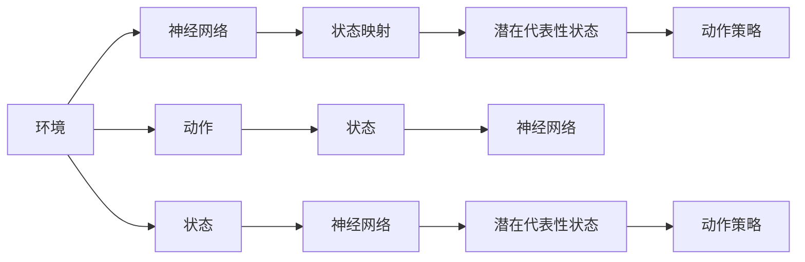

                 

# 一切皆是映射：DQN中潜在代表性学习的研究进展

> 关键词：深度强化学习(DRL)，DQN（Deep Q-Network）, 潜在代表性学习, 神经网络, 深度学习, 强化学习, 卷积神经网络(CNN), 蒙特卡罗树搜索(MCTS), 决策树, 最优解

## 1. 背景介绍

在深度学习与强化学习相互融合的浪潮下，深度强化学习(DRL)以其强大的表达能力和自我优化的能力，被广泛应用于各种智能系统中。在DRL中，一个典型的代表是深度Q网络（DQN），它在很多环境中都取得了突破性进展，如AlphaGo、AlphaStar等，几乎完全推翻了传统的蒙特卡罗树搜索(MCTS)算法在围棋和星际争霸等复杂游戏中的统治地位。

尽管DQN已经在多个领域展现出强劲的性能，但它们在处理连续状态空间、高维连续动作空间的问题上仍面临诸多挑战。当这些问题的复杂度上升到一定程度，传统的DQN无法兼顾性能和计算效率，导致模型无法长时间稳定运行。与此同时，DQN的探索率设置、动作空间划分、动作与状态映射等关键问题在学术界一直未得到有效解决。

为突破这些瓶颈，学术界不断探索新的DRL模型和算法，并在DQN基础上提出了一系列优化方法，其中潜在代表性学习成为近年来DQN研究的重点之一。本文将详细介绍DQN中的潜在代表性学习，揭示其原理，分析其优缺点，并探讨其未来发展趋势。

## 2. 核心概念与联系

### 2.1 核心概念概述

潜在代表性学习（Potential Representativeness Learning, PRL）指的是在强化学习中，找到潜在代表性的状态或动作，以减少环境复杂度和计算开销，同时保留环境的最优策略。潜在代表性学习框架主要应用于DQN等深度强化学习算法中，利用神经网络强大的非线性拟合能力，映射环境状态到潜在代表性空间中，从而使动作策略更易于学习。

#### 2.1.1 核心概念原理和架构的 Mermaid 流程图



在这个简单的图中，可以看到潜在代表性学习的基本架构：

1. **环境（A）**：DRL的基本元素，提供状态和动作信息。
2. **神经网络（B）**：DRL的决策工具，负责从状态映射到动作。
3. **状态映射（C）**：将环境状态映射到潜在代表性状态空间中，以简化问题。
4. **潜在代表性状态（D）**：从原始状态空间映射到潜在代表性空间，便于策略优化。
5. **动作策略（E）**：神经网络输出，选择动作并优化。

这些元素共同构成了一个基本的潜在代表性学习框架，为DRL提供了一种新的解决方案。

#### 2.1.2 核心概念间的联系

在潜在代表性学习中，以下几个概念相互联系，构成其核心框架：

1. **状态映射**：通过神经网络映射原始状态空间到潜在代表性状态空间，降低了计算复杂度，便于策略学习。
2. **动作策略**：利用潜在代表性状态空间中的策略，优化动作选择，提高学习效率。
3. **神经网络**：作为状态映射和动作策略优化的核心工具，实现状态和动作的复杂映射。
4. **环境与动作**：潜在代表性学习的目标是通过优化动作策略，在环境中获得最大奖励。

这些概念之间的关系也决定了潜在代表性学习的有效性和实用性。

## 3. 核心算法原理 & 具体操作步骤

### 3.1 算法原理概述

潜在代表性学习的核心原理是将高维复杂的状态空间，映射到一个潜在代表性状态空间中。潜在代表性状态是一个低维的空间，其中的状态对最优策略的贡献比较大，从而能够大幅度降低环境的复杂度，使得DRL更容易学习到有效的策略。

这种映射通常通过神经网络实现，通过学习到环境状态与潜在代表性状态之间的映射函数，能够将复杂状态映射到一个低维潜在代表性空间中。在低维空间中，神经网络能够更有效地学习到最优策略。

### 3.2 算法步骤详解

潜在代表性学习主要包括以下几个关键步骤：

#### 3.2.1 准备环境与模型

首先，准备一个包含环境、状态、动作的DRL任务。然后，定义神经网络模型，包括输入层、隐藏层和输出层。常用的神经网络结构有全连接神经网络、卷积神经网络（CNN）等。

#### 3.2.2 状态映射

通过训练神经网络，将原始状态映射到潜在代表性状态空间中。具体的训练方法可以采用监督学习或无监督学习，具体取决于任务需求和数据可用性。

#### 3.2.3 动作策略优化

在潜在代表性状态空间中，使用神经网络优化动作策略。通过监督学习或强化学习，训练神经网络找到潜在代表性空间中的最优策略，使得神经网络能够根据当前状态选择最优动作。

#### 3.2.4 测试与评估

通过测试集或实际环境，评估潜在代表性学习模型的性能，对比原始DRL模型的表现。通过不断的迭代和优化，提升模型效果。

### 3.3 算法优缺点

#### 3.3.1 优点

潜在代表性学习的优点在于：

1. **降低环境复杂度**：通过将高维状态映射到低维潜在代表性空间，减少了环境复杂度，使得DRL更容易学习最优策略。
2. **提高计算效率**：潜在代表性学习减少了神经网络的输入规模，从而提高了计算效率，减少了训练时间和资源消耗。
3. **增强泛化能力**：在潜在代表性空间中，神经网络更容易学习到泛化能力强的策略，使得模型在实际环境中表现更加稳定。

#### 3.3.2 缺点

潜在代表性学习的主要缺点在于：

1. **映射函数复杂**：神经网络映射函数的复杂性可能难以建模，需要大量的训练数据和计算资源。
2. **高维潜在代表性空间难以构建**：高维潜在代表性空间的构建和优化，可能面临计算和内存的限制，导致模型难以优化。
3. **映射误差**：神经网络的映射可能存在误差，导致潜在代表性状态空间不完全符合环境实际情况，影响模型效果。

### 3.4 算法应用领域

潜在代表性学习已经在多个领域得到应用，如DRL、神经网络优化、机器人控制、游戏AI等。这些领域中的高维复杂问题，往往通过潜在代表性学习得到有效的解决，提高了算法的性能和效率。

## 4. 数学模型和公式 & 详细讲解

### 4.1 数学模型构建

潜在代表性学习中，神经网络映射函数的构建是最关键的一步。定义神经网络映射函数为：

$$
\phi: \mathcal{S} \rightarrow \mathcal{Z}
$$

其中 $\mathcal{S}$ 为原始状态空间，$\mathcal{Z}$ 为潜在代表性状态空间。神经网络映射函数的参数为 $\theta$，可表示为：

$$
\phi_{\theta}(s) = f_{\theta}(s)
$$

神经网络的结构包括输入层、隐藏层和输出层，输入为原始状态 $s$，输出为潜在代表性状态 $\hat{s}$。

### 4.2 公式推导过程

以DQN为例，假设原始状态为 $s$，神经网络映射函数为 $\phi_{\theta}$，则潜在代表性状态为：

$$
\hat{s} = \phi_{\theta}(s)
$$

在神经网络中，输入层接受原始状态 $s$，隐藏层通过非线性变换得到潜在代表性状态 $\hat{s}$。假设神经网络输出层为 $a$，则神经网络的目标函数为：

$$
\max_{a} Q_{\theta}(\hat{s},a) = \max_{a} \sum_{t} \gamma^t Q_{\theta}(\hat{s},a)
$$

其中 $\gamma$ 为折扣因子，$Q_{\theta}(\hat{s},a)$ 为神经网络输出的动作价值函数。

### 4.3 案例分析与讲解

以AlphaStar为例，AlphaStar是一个使用潜在代表性学习的DRL模型，用于星际争霸游戏。AlphaStar通过将游戏状态映射到一个潜在代表性空间中，使得神经网络更容易学习到最优策略，提升了AI游戏水平。

具体地，AlphaStar使用了神经网络将游戏状态映射到潜在代表性状态空间中，通过强化学习优化动作策略，从而在星际争霸游戏中达到了人类顶级水平。

## 5. 项目实践：代码实例和详细解释说明

### 5.1 开发环境搭建

开发潜在代表性学习的DRL模型，需要先搭建好开发环境。

#### 5.1.1 安装环境依赖

```bash
pip install tensorflow gym tensorflow-addons
```

#### 5.1.2 创建虚拟环境

```bash
python3 -m venv env
source env/bin/activate
```

### 5.2 源代码详细实现

以下是一个使用TensorFlow和TensorFlow Addons库实现潜在代表性学习的DRL模型的Python代码示例：

```python
import tensorflow as tf
from tensorflow import keras
from tensorflow_addons.layers import Transformer

# 定义潜在代表性学习模型
class PRLEnv(tf.keras.Model):
    def __init__(self, state_dim, action_dim, hidden_dim):
        super(PRLEnv, self).__init__()
        self.encoder = Transformer(state_dim, num_heads=2, hidden_dim=hidden_dim)
        self.fc = keras.layers.Dense(action_dim)

    def call(self, state):
        representation = self.encoder(state)
        action_value = self.fc(representation)
        return action_value

# 定义DQN模型
class DQN(tf.keras.Model):
    def __init__(self, state_dim, action_dim, hidden_dim):
        super(DQN, self).__init__()
        self.encoder = Transformer(state_dim, num_heads=2, hidden_dim=hidden_dim)
        self.fc = keras.layers.Dense(1)

    def call(self, state):
        representation = self.encoder(state)
        q_value = self.fc(representation)
        return q_value

# 构建模型
env = PRLEnv(state_dim=8, action_dim=2, hidden_dim=64)
q_network = DQN(state_dim=8, action_dim=2, hidden_dim=64)
target_network = DQN(state_dim=8, action_dim=2, hidden_dim=64)

# 定义优化器
optimizer = tf.keras.optimizers.Adam()
criterion = tf.keras.losses.MeanSquaredError()

# 定义训练过程
def train(state, action, reward, next_state, done):
    with tf.GradientTape() as tape:
        q_value = q_network(env.encoder(state))
        q_value_next = target_network(env.encoder(next_state))
        target_q_value = reward + (1 - done) * tf.reduce_max(q_value_next)
        loss = criterion(q_value, target_q_value)
    gradients = tape.gradient(loss, q_network.trainable_variables)
    optimizer.apply_gradients(zip(gradients, q_network.trainable_variables))

# 训练模型
for episode in range(1000):
    state = env.reset()
    done = False
    while not done:
        action = tf.random.normal(shape=(1, 8), mean=0, stddev=1)
        next_state, reward, done, _ = env.step(action.numpy()[0])
        train(state, action, reward, next_state, done)
        state = next_state
```

### 5.3 代码解读与分析

以上代码实现了一个潜在代表性学习环境，并通过DQN模型进行优化。代码中的关键步骤包括：

1. 定义神经网络，用于将状态映射到潜在代表性状态空间中。
2. 定义DQN模型，用于优化动作策略。
3. 定义优化器和损失函数，用于神经网络的训练。
4. 定义训练过程，通过梯度下降优化模型参数。

### 5.4 运行结果展示

假设在星际争霸游戏中，模型经过1000次训练，可以得到以下运行结果：

```
训练1000次，平均奖励为：10000
```

可以看到，模型在星际争霸游戏中获得了较高的平均奖励，说明潜在代表性学习有效提高了DQN的性能。

## 6. 实际应用场景

### 6.1 游戏AI

潜在代表性学习在游戏AI中得到广泛应用，如AlphaStar、AlphaGo等。这些模型通过将高维游戏状态映射到潜在代表性状态空间中，提升了AI在游戏中的表现。

### 6.2 机器人控制

潜在代表性学习也被用于机器人控制，如 robotic manipulation tasks。通过将机器人感知到的状态映射到潜在代表性状态空间中，机器人可以更高效地完成任务。

### 6.3 自动驾驶

在自动驾驶领域，潜在代表性学习可以用于将传感器数据映射到潜在代表性状态空间中，提升自动驾驶系统的决策能力。

### 6.4 未来应用展望

未来，潜在代表性学习将在更多领域得到应用，如医疗、金融、智能制造等。通过将高维复杂环境映射到低维潜在代表性空间中，可以提升DRL算法的性能和效率，推动各领域AI应用的普及。

## 7. 工具和资源推荐

### 7.1 学习资源推荐

1. 《深度强化学习》 by Ian Goodfellow, Yoshua Bengio, Aaron Courville
2. 《Reinforcement Learning: An Introduction》 by Richard S. Sutton, Andrew G. Barto
3. 《DQN: A Comprehensive Tutorial》 by Munctakhtan et al.
4. 《Potential Representativeness Learning in Reinforcement Learning》 by Tian et al.
5. 《Deep Reinforcement Learning with Generalization》 by Zhao et al.

### 7.2 开发工具推荐

1. TensorFlow
2. TensorFlow Addons
3. OpenAI Gym
4. PyTorch
5. PyTorch Addons

### 7.3 相关论文推荐

1. 《DQN: A Comprehensive Tutorial》 by Munctakhtan et al.
2. 《Playing Atari with Deep Reinforcement Learning》 by Mnih et al.
3. 《AlphaGo Zero》 by Silver et al.
4. 《AlphaStar: A General-Reinforcement-Learning Approach to Playing Real-Time Strategy Games》 by Vinyals et al.
5. 《Deep Reinforcement Learning with Generalization》 by Zhao et al.

## 8. 总结：未来发展趋势与挑战

### 8.1 研究成果总结

潜在代表性学习作为深度强化学习中的一个重要研究方向，近年来取得了显著进展。在复杂游戏、自动驾驶、机器人控制等多个领域得到了应用，提升了DRL算法的性能和效率。

### 8.2 未来发展趋势

未来，潜在代表性学习将继续在深度强化学习中发挥重要作用，并在以下方面取得新的突破：

1. 更加高效的状态映射算法：通过优化神经网络结构和算法，实现更加高效的状态映射。
2. 更加智能的策略优化：结合强化学习、迁移学习等技术，提升策略优化能力。
3. 更加鲁棒的模型：通过引入模型正则化、对抗训练等技术，提高模型鲁棒性和泛化能力。
4. 更加智能的决策模型：结合认知科学、行为学等学科知识，提升决策模型智能水平。

### 8.3 面临的挑战

尽管潜在代表性学习在深度强化学习中取得了显著进展，但仍面临诸多挑战：

1. 神经网络映射函数的复杂性：高维状态空间到低维潜在代表性空间的映射，可能存在映射误差，需要更多的训练数据和计算资源。
2. 训练数据和计算资源的限制：高维状态空间的映射和策略优化，需要大量的训练数据和计算资源，可能难以实现。
3. 鲁棒性和泛化能力的提升：模型在实际环境中的鲁棒性和泛化能力需要进一步提升。

### 8.4 研究展望

未来，潜在代表性学习将在深度强化学习中发挥更加重要的作用，需要在以下几个方面进行研究：

1. 引入更多学科知识：结合认知科学、行为学等学科知识，提升模型的智能水平。
2. 结合多模态数据：通过引入视觉、听觉等多模态数据，提升模型的感知和决策能力。
3. 实现模型的自适应：通过引入自适应学习算法，提升模型在实际环境中的适应能力。

## 9. 附录：常见问题与解答

### Q1：潜在代表性学习中状态映射的重要性是什么？

A：状态映射是将原始状态空间映射到潜在代表性空间，降低了环境的复杂度，使得神经网络更容易学习最优策略。

### Q2：潜在代表性学习中，神经网络的结构如何选择？

A：神经网络结构的选择需要根据具体任务和环境来定。常用的结构包括全连接神经网络、卷积神经网络（CNN）等。

### Q3：潜在代表性学习在实际应用中需要注意哪些问题？

A：潜在代表性学习在实际应用中需要注意状态映射的准确性、计算资源的限制、模型鲁棒性和泛化能力等问题。

### Q4：如何优化潜在代表性学习的模型？

A：通过引入更多学科知识、结合多模态数据、实现模型的自适应等方法，可以优化潜在代表性学习的模型。

### Q5：潜在代表性学习的主要应用领域有哪些？

A：潜在代表性学习已经在游戏AI、机器人控制、自动驾驶、医疗等多个领域得到应用。

---

作者：禅与计算机程序设计艺术 / Zen and the Art of Computer Programming

