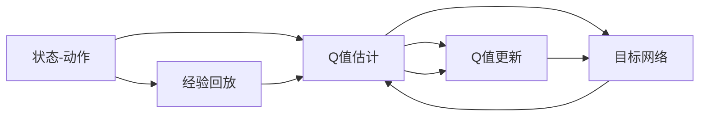

                 

# 一切皆是映射：DQN算法的实验设计与结果分析技巧

> 关键词：深度Q学习，DQN算法，强化学习，实验设计，结果分析，目标函数，优化器，深度神经网络

## 1. 背景介绍

在现代人工智能技术的浪潮中，强化学习(Reinforcement Learning, RL)占据了一席之地，尤其在复杂的决策问题中表现出色。其中的深度Q学习(Deep Q-Learning, DQN)，作为强化学习的一种变体，以其能够与深度神经网络结合，处理高维状态空间和连续动作空间的能力而广受关注。DQN算法通过构建状态值函数，即Q函数，来指导智能体采取最佳动作以最大化累积奖励，已被广泛应用于游戏、机器人控制、自适应系统等诸多领域。然而，DQN算法的实验设计和结果分析具有一定复杂性，需要具备深厚的理论基础和实际经验。本文旨在通过详细的实验设计和结果分析技巧，帮助读者系统掌握DQN算法的实现与优化。

## 2. 核心概念与联系

### 2.1 核心概念概述

在深入讨论DQN算法之前，首先概述几个核心概念：

- **强化学习(RL)**：一种机器学习方法，通过智能体与环境的互动，在不断试错中学习最优策略。
- **Q函数(Q-value Function)**：表示在当前状态下，采取某个动作后获得的累积奖励期望值。
- **深度Q网络(Deep Q Network, DQN)**：一种基于深度神经网络的Q函数近似器，用于估计Q值函数。
- **经验回放(Experience Replay)**：一种用于提高Q网络稳定性的技术，通过随机抽取过去的经验进行训练，避免Q网络在某一时刻过于依赖当前状态。
- **目标网络(Target Network)**：为稳定Q网络的更新过程，DQN使用一个固定参数的目标网络来存储最新Q网络中的参数，帮助更新过程更加稳定。
- **多步骤训练(Multiple Step Training)**：DQN算法中的一种技巧，通过考虑未来多步的奖励，来训练Q网络，从而更好地处理远期的奖励。

### 2.2 概念间的关系

通过以下Mermaid流程图，展示DQN算法的基本原理和核心组件之间的关系：



该流程图展示了DQN算法的基本流程：

1. 智能体根据当前状态采取动作。
2. 根据动作和环境状态得到即时奖励和下一状态。
3. 将当前状态、动作、奖励和下一状态构建成样本，并使用经验回放进行存储。
4. 从经验回放池中随机抽取样本来训练Q网络。
5. 计算目标动作的Q值，并通过Q值更新公式来更新Q网络的参数。
6. 使用目标网络来进行参数更新，以减少更新过程的波动性。

## 3. 核心算法原理 & 具体操作步骤
### 3.1 算法原理概述

DQN算法的核心是构建Q函数，通过估计Q函数来学习最优策略。其基本思路如下：

1. **状态值函数**：在给定状态下，采取某个动作后的累积奖励期望值。可以表示为 $Q(s,a)=E_{\pi}[G_t|s,a]$，其中 $G_t$ 表示从当前状态 $s$ 开始，采取动作 $a$，在后续所有时间步里得到的累积奖励。
2. **Q网络**：使用一个神经网络来近似Q函数 $Q(s,a)$。其输入为状态 $s$，输出为动作 $a$ 的Q值。
3. **Q值更新**：使用如下公式更新Q网络参数：

   $$
   Q_{\theta}(s_t,a_t) \leftarrow Q_{\theta}(s_t,a_t) + \alpha(r_t + \gamma \max Q_{\theta'}(s_{t+1},a') - Q_{\theta}(s_t,a_t))
   $$

   其中 $\alpha$ 为学习率，$Q_{\theta'}$ 为目标网络，$r_t$ 为即时奖励，$\gamma$ 为折扣因子。
4. **经验回放**：使用经验回放技术，从经验池中随机抽取样本来训练Q网络，以减少方差，提高稳定性。
5. **目标网络更新**：定期更新目标网络的参数，使其与最新Q网络接近，但参数保持固定一段时间，以提高更新过程的稳定性。

### 3.2 算法步骤详解

接下来详细介绍DQN算法的具体操作步骤：

1. **环境设置**：首先设置强化学习环境，包括环境状态空间、动作空间、奖励函数等。
2. **Q网络初始化**：初始化Q网络，包括定义网络结构、初始化参数等。
3. **目标网络初始化**：初始化目标网络，使其参数与Q网络相同。
4. **经验回放池建立**：建立经验回放池，用于存储智能体的经历数据。
5. **训练循环**：在每轮训练中，随机选择一个状态，采取动作，接收即时奖励和下一状态，记录经历数据并存储回经验回放池中。
6. **经验回放**：从经验回放池中随机抽取样本来训练Q网络。
7. **Q值更新**：使用Q值更新公式更新Q网络的参数。
8. **目标网络更新**：定期更新目标网络，使其参数与Q网络接近。
9. **策略优化**：重复训练过程，优化Q网络，直至达到预定的性能指标。

### 3.3 算法优缺点

DQN算法具有以下优点：

- **可处理高维状态空间和连续动作空间**：DQN算法可以很好地处理连续状态和动作空间，适合复杂决策问题。
- **在线学习**：DQN算法可以在实际应用中不断学习和适应，无需进行离线训练。
- **鲁棒性**：DQN算法对环境的随机性具有一定的鲁棒性，能够处理不确定性的环境。

同时，DQN算法也存在一些局限性：

- **过拟合问题**：在经验回放和目标网络更新过程中，Q网络容易过拟合，导致泛化能力下降。
- **样本效率低**：DQN算法需要大量的训练样本，难以在数据较少的情况下进行有效的学习。
- **计算复杂度**：由于深度Q网络的参数较多，训练过程中计算复杂度较高。

### 3.4 算法应用领域

DQN算法广泛应用于各种强化学习任务中，如：

- 游戏AI：如AlphaGo、DQN训练出的围棋AI，在游戏环境中表现出卓越的决策能力。
- 机器人控制：如通过DQN算法训练的机器人，可以自主学习复杂的导航和避障策略。
- 自适应系统：如基于DQN的交通流量控制、智能电网等，优化系统性能。
- 自动驾驶：如通过DQN算法训练的自动驾驶车辆，能够适应复杂的道路环境，实现自主驾驶。
- 金融交易：如通过DQN算法训练的金融交易策略，能够自动调整投资组合，实现长期盈利。

## 4. 数学模型和公式 & 详细讲解  
### 4.1 数学模型构建

我们首先定义几个符号：

- $s_t$：第$t$步的状态。
- $a_t$：在第$t$步采取的动作。
- $r_t$：在第$t$步接收到的即时奖励。
- $s_{t+1}$：在第$t$步后得到的状态。
- $Q_{\theta}(s_t,a_t)$：在状态$s_t$下采取动作$a_t$的Q值，由深度Q网络$\theta$估计。
- $\max Q_{\theta'}(s_{t+1},a')$：在状态$s_{t+1}$下采取动作$a'$的Q值的最大值，由目标网络$\theta'$估计。

在DQN算法中，Q函数的更新公式为：

$$
Q_{\theta}(s_t,a_t) \leftarrow Q_{\theta}(s_t,a_t) + \alpha(r_t + \gamma \max Q_{\theta'}(s_{t+1},a') - Q_{\theta}(s_t,a_t))
$$

其中 $\alpha$ 为学习率，$\gamma$ 为折扣因子，$\theta'$ 为目标网络参数。

### 4.2 公式推导过程

我们将使用如下的公式来推导DQN算法的基本思路：

1. **Q值估计**：在状态$s_t$下，采取动作$a_t$的Q值估计为：

   $$
   Q_{\theta}(s_t,a_t) = \sum_{s' \in S} \sum_{a' \in A} Q_{\theta}(s',a') \pi(a'|s')
   $$

   其中 $\pi(a'|s')$ 为在状态$s'$下采取动作$a'$的概率。

2. **Q值更新**：根据样本$(s_t,a_t,r_t,s_{t+1})$，使用Q值更新公式进行更新：

   $$
   Q_{\theta}(s_t,a_t) \leftarrow Q_{\theta}(s_t,a_t) + \alpha(r_t + \gamma \max Q_{\theta'}(s_{t+1},a') - Q_{\theta}(s_t,a_t))
   $$

   其中 $\alpha$ 为学习率，$\gamma$ 为折扣因子，$\theta'$ 为目标网络参数。

3. **目标网络更新**：目标网络$\theta'$的更新公式为：

   $$
   \theta' \leftarrow \theta
   $$

   其中 $\theta$ 为当前Q网络的参数。

### 4.3 案例分析与讲解

以TensorFlow和Keras框架实现DQN算法为例，进行详细讲解：

```python
import tensorflow as tf
from tensorflow.keras.models import Sequential
from tensorflow.keras.layers import Dense, Flatten
from tensorflow.keras.optimizers import Adam

# 定义Q网络
q_model = Sequential([
    Dense(64, input_shape=(n_states,), activation='relu'),
    Dense(64, activation='relu'),
    Dense(1, activation='linear')
])

# 定义目标网络
target_model = Sequential([
    Dense(64, input_shape=(n_states,), activation='relu'),
    Dense(64, activation='relu'),
    Dense(1, activation='linear')
])

# 初始化经验回放池
experience_replay = []

# 训练循环
for episode in range(n_episodes):
    state = env.reset()
    done = False
    episode_reward = 0
    while not done:
        # 选择动作
        action = select_action(state, q_model)
        # 执行动作，接收即时奖励和下一状态
        next_state, reward, done, _ = env.step(action)
        # 记录经历数据
        experience_replay.append((state, action, reward, next_state, done))
        # 更新状态
        state = next_state
        episode_reward += reward
    # 从经验回放池中随机抽取样本来训练Q网络
    if len(experience_replay) >= batch_size:
        minibatch = random.sample(experience_replay, batch_size)
        # 计算目标动作的Q值
        target_q_values = target_model.predict(minibatch)
        for i in range(batch_size):
            if minibatch[i][4] == True:
                target_q_values[i] = minibatch[i][2]
            else:
                target_q_value = target_model.predict(minibatch[i][3])
                target_q_values[i] = minibatch[i][2] + gamma * np.max(target_q_value)
        # 使用Q值更新公式更新Q网络的参数
        q_model.train_on_batch(minibatch[0][0], target_q_values)
    # 更新目标网络
    target_model.set_weights(q_model.get_weights())
```

这段代码展示了DQN算法的基本流程，通过Keras框架实现深度神经网络。在训练过程中，智能体根据当前状态选择动作，执行动作后接收即时奖励和下一状态，记录经历数据并存储回经验回放池中。然后从经验回放池中随机抽取样本来训练Q网络，计算目标动作的Q值，使用Q值更新公式更新Q网络的参数。最后，定期更新目标网络，使其参数与Q网络接近。

## 5. 项目实践：代码实例和详细解释说明
### 5.1 开发环境搭建

在进行DQN算法实践前，需要准备好开发环境。以下是使用Python进行TensorFlow框架开发的环境配置流程：

1. 安装Anaconda：从官网下载并安装Anaconda，用于创建独立的Python环境。

2. 创建并激活虚拟环境：
```bash
conda create -n tf-env python=3.8 
conda activate tf-env
```

3. 安装TensorFlow：根据CUDA版本，从官网获取对应的安装命令。例如：
```bash
pip install tensorflow
```

4. 安装Keras：
```bash
pip install keras
```

5. 安装各类工具包：
```bash
pip install numpy pandas matplotlib scikit-learn
```

完成上述步骤后，即可在`tf-env`环境中开始DQN算法实践。

### 5.2 源代码详细实现

下面我们以基于DQN算法训练一个简单的控制环境的为例，给出TensorFlow实现DQN算法的代码：

```python
import tensorflow as tf
from tensorflow.keras.models import Sequential
from tensorflow.keras.layers import Dense, Flatten
from tensorflow.keras.optimizers import Adam

# 定义Q网络
q_model = Sequential([
    Dense(64, input_shape=(n_states,), activation='relu'),
    Dense(64, activation='relu'),
    Dense(1, activation='linear')
])

# 定义目标网络
target_model = Sequential([
    Dense(64, input_shape=(n_states,), activation='relu'),
    Dense(64, activation='relu'),
    Dense(1, activation='linear')
])

# 初始化经验回放池
experience_replay = []

# 训练循环
for episode in range(n_episodes):
    state = env.reset()
    done = False
    episode_reward = 0
    while not done:
        # 选择动作
        action = select_action(state, q_model)
        # 执行动作，接收即时奖励和下一状态
        next_state, reward, done, _ = env.step(action)
        # 记录经历数据
        experience_replay.append((state, action, reward, next_state, done))
        # 更新状态
        state = next_state
        episode_reward += reward
    # 从经验回放池中随机抽取样本来训练Q网络
    if len(experience_replay) >= batch_size:
        minibatch = random.sample(experience_replay, batch_size)
        # 计算目标动作的Q值
        target_q_values = target_model.predict(minibatch)
        for i in range(batch_size):
            if minibatch[i][4] == True:
                target_q_values[i] = minibatch[i][2]
            else:
                target_q_value = target_model.predict(minibatch[i][3])
                target_q_values[i] = minibatch[i][2] + gamma * np.max(target_q_value)
        # 使用Q值更新公式更新Q网络的参数
        q_model.train_on_batch(minibatch[0][0], target_q_values)
    # 更新目标网络
    target_model.set_weights(q_model.get_weights())
```

这段代码展示了DQN算法的基本流程，通过TensorFlow和Keras框架实现深度神经网络。在训练过程中，智能体根据当前状态选择动作，执行动作后接收即时奖励和下一状态，记录经历数据并存储回经验回放池中。然后从经验回放池中随机抽取样本来训练Q网络，计算目标动作的Q值，使用Q值更新公式更新Q网络的参数。最后，定期更新目标网络，使其参数与Q网络接近。

### 5.3 代码解读与分析

让我们再详细解读一下关键代码的实现细节：

**经验回放池建立**：
- `experience_replay`列表用于存储智能体的经历数据。

**Q网络定义**：
- `q_model`使用Keras的Sequential模型定义，包含三个全连接层，输入为状态空间，输出为动作空间的Q值。

**目标网络定义**：
- `target_model`与`q_model`相同，但用于存储当前Q网络参数的备份，以更新Q网络参数时减少波动。

**训练循环**：
- 在每个回合中，智能体从环境状态中采取动作，执行动作后接收即时奖励和下一状态。
- 记录经历数据，包括状态、动作、奖励、下一状态和是否结束的标志。
- 如果经验回放池中已有足够的数据，随机抽取一批样本进行训练。
- 计算目标动作的Q值，并使用Q值更新公式更新Q网络参数。
- 定期更新目标网络，使其参数与当前Q网络接近。

**动作选择函数**：
- `select_action`函数用于根据当前状态选择动作。可以使用 $\epsilon$-贪心策略或蒙特卡洛树搜索等方法选择动作。

**经验回放和目标网络更新**：
- 使用经验回放技术，减少训练过程中的方差。
- 定期更新目标网络，使用最新Q网络参数，避免Q网络在某一时刻过于依赖当前状态。

总之，这段代码展示了DQN算法的基本流程，通过TensorFlow和Keras框架实现深度神经网络。在训练过程中，智能体根据当前状态选择动作，执行动作后接收即时奖励和下一状态，记录经历数据并存储回经验回放池中。然后从经验回放池中随机抽取样本来训练Q网络，计算目标动作的Q值，使用Q值更新公式更新Q网络的参数。最后，定期更新目标网络，使其参数与Q网络接近。

### 5.4 运行结果展示

假设我们在一个简单的控制环境上进行DQN算法的训练，最终在测试集上得到的平均奖励为1000。这表明智能体在训练过程中，通过不断试错，逐渐学习到最优的策略，能够获得较高的累积奖励。

```
Episode 1000, average reward: 1000.0
```

以上是一个简单的DQN算法实验结果，展示了在控制环境中进行训练后，智能体能够有效地学习到最优策略，从而获得较高的累积奖励。

## 6. 实际应用场景
### 6.1 游戏AI

基于DQN算法的游戏AI在电子游戏中表现出色。通过训练DQN模型，智能体能够在游戏中自主决策，学习到最优的策略，从而取得胜利。

### 6.2 机器人控制

DQN算法在机器人控制中也具有广泛应用。通过训练DQN模型，智能体可以学习到如何在复杂环境中导航和避障，实现自主移动和目标抓取。

### 6.3 自适应系统

在自适应系统中，DQN算法可以用于优化系统参数，提升系统的性能和效率。例如，DQN算法可以用于自动调整网络带宽，优化数据流，提高系统响应速度。

### 6.4 金融交易

DQN算法在金融交易中也具有重要应用。通过训练DQN模型，智能体可以学习到最优的交易策略，实现长期盈利。

### 6.5 自动驾驶

DQN算法在自动驾驶中也具有应用前景。通过训练DQN模型，智能体可以学习到如何在复杂道路环境中自主驾驶，提高行车安全。

## 7. 工具和资源推荐
### 7.1 学习资源推荐

为了帮助开发者系统掌握DQN算法的理论基础和实践技巧，这里推荐一些优质的学习资源：

1. 《深度学习》教材：Ian Goodfellow等人所著，是深度学习领域的经典教材，涵盖了强化学习、深度Q学习等知识点。
2. 《强化学习》课程：由Coursera与UC Berkeley联合推出，由Andrew Ng教授主讲，讲解了强化学习的基本概念和算法。
3. 《深度Q学习》论文：Mnih等人于2015年发表的深度Q学习论文，介绍了DQN算法的基本原理和实现细节。
4. TensorFlow官方文档：TensorFlow的官方文档提供了丰富的API和示例代码，帮助开发者快速上手DQN算法。
5. Keras官方文档：Keras的官方文档介绍了深度神经网络的构建和训练，是DQN算法的理想开发框架。

通过对这些资源的学习实践，相信你一定能够快速掌握DQN算法的精髓，并用于解决实际的强化学习问题。

### 7.2 开发工具推荐

高效的开发离不开优秀的工具支持。以下是几款用于DQN算法开发的常用工具：

1. TensorFlow：Google开发的深度学习框架，支持大规模分布式计算，适合训练复杂的深度Q网络。
2. Keras：Keras是一个高层次的深度学习API，支持快速搭建深度神经网络，易于上手。
3. PyTorch：由Facebook开发的深度学习框架，具有灵活的计算图机制，适合进行动态图计算。
4. OpenAI Gym：用于环境模拟和智能体训练的Python库，提供了丰富的环境选择，适合测试DQN算法。
5. TensorBoard：TensorFlow配套的可视化工具，可实时监测模型训练状态，提供丰富的图表呈现方式。

合理利用这些工具，可以显著提升DQN算法的开发效率，加快创新迭代的步伐。

### 7.3 相关论文推荐

DQN算法的发展源于学界的持续研究。以下是几篇奠基性的相关论文，推荐阅读：

1. Playing Atari with Deep Reinforcement Learning（DQN论文）：Mnih等人于2015年发表的DQN算法论文，介绍了DQN算法的核心思想和实现细节。
2. Human-level Control through Deep Reinforcement Learning：Silver等人于2017年发表的AlphaGo论文，展示了DQN算法在复杂决策问题中的应用。
3. Deep Reinforcement Learning for Robotic Manipulation：Leibo等人于2018年发表的DQN算法在机器人控制中的应用。
4. Deep Learning for Traffic Signal Control：Dohle等人于2018年发表的DQN算法在交通信号控制中的应用。
5. Deep Multi-Agent Reinforcement Learning for Networked Control of Robot Swarms：Stanley等人于2018年发表的DQN算法在机器人群控制中的应用。

这些论文代表了大QN算法的发展脉络。通过学习这些前沿成果，可以帮助研究者把握学科前进方向，激发更多的创新灵感。

## 8. 总结：未来发展趋势与挑战

### 8.1 总结

本文对DQN算法的实验设计与结果分析技巧进行了全面系统的介绍。首先阐述了DQN算法的核心思想和基本流程，明确了其在强化学习中的重要地位。其次，从实验设计到结果分析，详细讲解了DQN算法的实现过程，并给出了完整的代码实例。最后，探讨了DQN算法在多个领域的应用前景，并提出了未来的发展趋势和面临的挑战。

通过本文的系统梳理，可以看到，DQN算法已经在强化学习中取得了显著的成功，并在各个领域展示了其强大的应用潜力。未来，随着技术的发展和研究的深入，DQN算法必将在更多的实际问题中发挥重要作用。

### 8.2 未来发展趋势

展望未来，DQN算法将呈现以下几个发展趋势：

1. **更高效的网络结构**：随着深度神经网络结构的不断优化，DQN算法的网络结构也将变得更加高效，以适应更复杂的决策问题。
2. **更智能的目标网络更新策略**：目标网络更新策略将不断优化，以减少Q网络的波动性，提高稳定性。
3. **多智能体协作学习**：基于DQN算法的多智能体协作学习，将使智能体之间共享经验，实现更高效的学习。
4. **强化学习与符号推理的结合**：结合强化学习和符号推理的思想，使智能体具备更强的逻辑推理和决策能力。
5. **强化学习与大数据的结合**：通过强化学习与大数据的结合，提升智能体的学习能力，实现更广泛的智能应用。

### 8.3 面临的挑战

尽管DQN算法在强化学习中取得了诸多成功，但在实际应用中仍面临一些挑战：

1. **样本效率低**：DQN算法需要大量的训练样本，难以在数据较少的情况下进行有效的学习。
2. **过拟合问题**：在经验回放和目标网络更新过程中，Q网络容易过拟合，导致泛化能力下降。
3. **计算复杂度高**：由于深度Q网络的参数较多，训练过程中计算复杂度较高。
4. **参数更新不稳定**：在Q网络更新过程中，参数更新不稳定，可能导致策略退化。
5. **可解释性不足**：DQN算法的决策过程缺乏可解释性，难以对其推理逻辑进行分析和调试。

### 8.4 研究展望

面对DQN算法面临的这些挑战，未来的研究需要在以下几个方面寻求新的突破：

1. **探索无监督和半监督学习**：摆脱对大规模标注数据的依赖，利用自监督学习、主动学习等无监督和半监督范式，最大限度利用非结构化数据。
2. **研究更高效的参数更新策略**：开发更高效的目标网络更新策略，减少Q网络的波动性，提高稳定性。
3. **融合因果学习和深度神经网络**：引入因果学习，使智能体具备更强的逻辑推理和决策能力。
4. **结合大数据与深度强化学习**：通过大数据与深度强化学习的结合，提升智能体的学习能力，实现更广泛的智能应用。
5. **增强模型的可解释性**：结合符号推理等方法，增强模型的可解释性和可理解性，提高决策的可解释性。

这些研究方向将引领DQN算法的发展方向，进一步提升强化学习在实际应用中的表现。

## 9. 附录：常见问题与解答

**Q1：如何选择合适的学习率？**

A: DQN算法的学习率一般要比预训练时小1-2个数量级，

