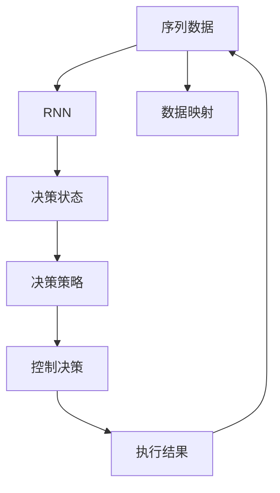
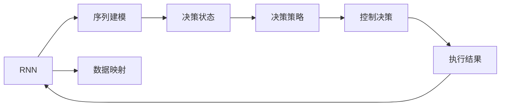
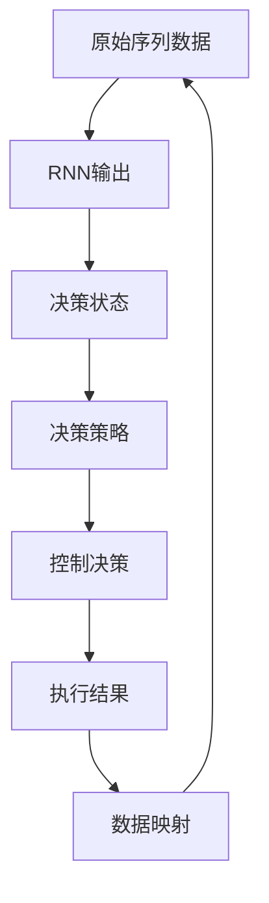
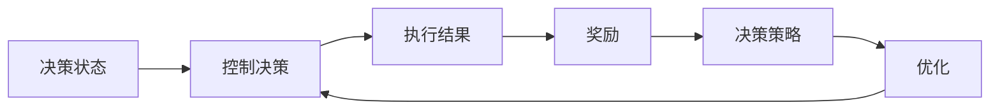

                 

# 一切皆是映射：RNN与DQN的结合：处理序列决策问题的新方法

> 关键词：递归神经网络(RNN), 深度强化学习(DQN), 序列决策, 强化学习, 决策树, 数据映射, 控制决策

## 1. 背景介绍

### 1.1 问题由来

在当今信息时代，序列决策问题（Sequential Decision-Making）无处不在。从游戏策略到金融投资，从智能交通到供应链管理，从自然语言处理到机器人控制，无不涉及到如何在序列数据中做出最优决策。传统上，这类问题往往需要构建复杂的决策树、马尔科夫决策过程（MDP）模型，难以处理复杂动态的决策场景。

近年来，随着深度学习技术的发展，递归神经网络（Recurrent Neural Network, RNN）和深度强化学习（Deep Reinforcement Learning, DRL）等方法逐渐成为处理序列决策问题的利器。特别是RNN，由于其能够自然地处理序列数据，被广泛应用到语音识别、机器翻译、自然语言生成等任务中。而DRL，由于其能够学习到决策策略，也被用于自动游戏、机器人控制等领域。

然而，RNN和DRL分别从序列建模和决策学习两个角度来解决问题，如何将它们结合，以更高效、更鲁棒的方式处理序列决策问题，是一个值得探索的课题。本文旨在探讨将RNN与DQN结合，从而构建一种能够更好地处理序列决策问题的新方法。

### 1.2 问题核心关键点

将RNN与DQN结合的关键在于：

1. **序列数据建模**：RNN能够自然地处理序列数据，能够建模序列数据的时序关系。
2. **决策策略学习**：DQN能够学习到基于环境的决策策略，能够通过不断试错来优化决策策略。
3. **数据映射**：将序列数据映射到决策状态，使得DQN能够基于序列数据进行决策。
4. **控制决策**：结合RNN和DQN的优点，能够更好地控制决策过程，优化决策结果。

## 2. 核心概念与联系

### 2.1 核心概念概述

为更好地理解将RNN与DQN结合的方法，本节将介绍几个密切相关的核心概念：

- **递归神经网络(RNN)**：一种能够处理序列数据的神经网络，通过在网络中引入循环结构，使得网络能够记住序列数据的前后关系。常见的RNN包括简单RNN、LSTM和GRU等。

- **深度强化学习(DRL)**：一种通过与环境互动，学习最优决策策略的机器学习方法。DRL通过奖励机制和策略优化，使得智能体能够在复杂环境中逐步学习和适应。

- **数据映射**：将输入数据通过某种方式映射到智能体可以理解的状态，是构建智能体的关键步骤。

- **控制决策**：通过智能体与环境的互动，学习到最优决策策略，并根据当前状态做出决策。

- **序列决策**：在给定序列数据的情况下，通过学习最优决策策略，从序列中提取出最优决策。

这些核心概念之间的逻辑关系可以通过以下Mermaid流程图来展示：



这个流程图展示了大语言模型微调过程中各个核心概念的关系和作用：

1. 序列数据输入到RNN中，进行序列建模。
2. RNN输出决策状态，供DQN使用。
3. DQN通过决策策略学习，对决策状态进行控制决策。
4. 控制决策的结果反馈回RNN，进行后续的序列建模。
5. 数据映射将原始序列数据转化为智能体可理解的决策状态。

### 2.2 概念间的关系

这些核心概念之间存在着紧密的联系，形成了序列决策问题的完整生态系统。下面我通过几个Mermaid流程图来展示这些概念之间的关系。

#### 2.2.1 RNN与DQN的基本原理



这个流程图展示了RNN和DQN的基本原理，即通过RNN对序列数据进行建模，然后通过DQN学习最优决策策略，并根据当前状态进行控制决策。

#### 2.2.2 数据映射的实现方式



这个流程图展示了数据映射的实现方式，即将原始序列数据通过RNN输出决策状态，然后将决策状态供DQN使用，最后根据执行结果进行数据映射，以优化后续决策。

#### 2.2.3 控制决策的优化策略



这个流程图展示了控制决策的优化策略，即通过DQN学习最优决策策略，对决策状态进行控制决策，并根据执行结果进行奖励，以优化决策策略。

## 3. 核心算法原理 & 具体操作步骤
### 3.1 算法原理概述

将RNN与DQN结合，处理序列决策问题，本质上是一种基于序列建模和决策策略学习的强化学习方法。其核心思想是：

1. 通过RNN对序列数据进行建模，得到决策状态。
2. 将决策状态供DQN使用，学习到最优决策策略。
3. 根据决策策略进行控制决策，得到执行结果。
4. 根据执行结果进行奖励反馈，优化决策策略。

数学上，可以将其表示为：

- $S_t = \text{RNN}(x_1, x_2, ..., x_t)$，其中$S_t$表示在时间$t$的决策状态，$x_t$表示时间$t$的序列数据。
- $A_t = \text{DQN}(S_t)$，其中$A_t$表示在时间$t$的控制决策。
- $R_t = \text{reward}(S_t, A_t)$，其中$R_t$表示在时间$t$的奖励。
- $S_{t+1} = \text{RNN}(x_{t+1}, S_t, A_t)$，其中$S_{t+1}$表示在时间$t+1$的决策状态。

通过上述公式，可以看出，RNN和DQN分别在序列建模和决策策略学习方面发挥作用，将两者结合，能够更好地处理序列决策问题。

### 3.2 算法步骤详解

基于上述算法原理，将RNN与DQN结合，处理序列决策问题的主要步骤如下：

**Step 1: 准备RNN和DQN模型**

- 选择适合的RNN模型（如LSTM、GRU）进行序列建模。
- 选择适合的DQN模型（如DQN、Dueling DQN）进行决策策略学习。

**Step 2: 定义数据映射**

- 将原始序列数据通过RNN得到决策状态。
- 将决策状态供DQN使用，进行决策策略学习。

**Step 3: 定义奖励函数**

- 定义奖励函数，根据执行结果进行奖励。
- 根据奖励进行策略优化，更新DQN模型参数。

**Step 4: 执行控制决策**

- 根据当前决策状态，选择最优决策。
- 根据决策执行结果，更新RNN和DQN模型参数。

**Step 5: 迭代训练**

- 重复上述步骤，直到模型收敛。

### 3.3 算法优缺点

将RNN与DQN结合，处理序列决策问题，具有以下优点：

1. **高效处理序列数据**：RNN能够高效处理序列数据，建模序列数据的时序关系。
2. **学习决策策略**：DQN能够学习到基于环境的决策策略，通过不断试错来优化决策策略。
3. **鲁棒性强**：RNN和DQN的结合，能够提高模型的鲁棒性，避免单一模型的局限性。

同时，该方法也存在一些局限性：

1. **计算复杂度高**：将RNN与DQN结合，需要同时训练RNN和DQN模型，计算复杂度高。
2. **模型参数量大**：RNN和DQN的结合，需要较大的模型参数，对计算资源要求较高。
3. **数据依赖性强**：DQN需要大量训练数据来优化决策策略，RNN也需要较长的序列数据来建模。

## 4. 数学模型和公式 & 详细讲解 & 举例说明

### 4.1 数学模型构建

将RNN与DQN结合，处理序列决策问题，可以构建以下数学模型：

- **RNN模型**：

$$
S_t = \text{RNN}(x_1, x_2, ..., x_t)
$$

- **DQN模型**：

$$
Q(S_t, A_t) = r + \gamma \max_{A_{t+1}} Q(S_{t+1}, A_{t+1})
$$

- **奖励函数**：

$$
R_t = \text{reward}(S_t, A_t)
$$

- **控制决策**：

$$
A_t = \text{DQN}(S_t)
$$

### 4.2 公式推导过程

以下我们以一个简单的序列决策问题为例，推导将RNN与DQN结合的数学公式。

假设我们有一个序列数据$(x_1, x_2, ..., x_t)$，其中每个$x_t$表示一个字符，$S_t$表示时间$t$的决策状态，$A_t$表示时间$t$的控制决策，$R_t$表示时间$t$的奖励。

假设$S_t = \text{RNN}(x_1, x_2, ..., x_t)$，$A_t = \text{DQN}(S_t)$，$R_t = \text{reward}(S_t, A_t)$。

根据上述公式，我们可以得到：

$$
Q(S_t, A_t) = R_t + \gamma \max_{A_{t+1}} Q(S_{t+1}, A_{t+1})
$$

其中$\gamma$表示折扣因子，$S_{t+1} = \text{RNN}(x_{t+1}, S_t, A_t)$。

将上述公式展开，可以得到：

$$
Q(S_t, A_t) = R_t + \gamma \max_{A_{t+1}} Q(S_{t+1}, A_{t+1})
$$

$$
Q(S_t, A_t) = R_t + \gamma \max_{A_{t+1}} (R_{t+1} + \gamma \max_{A_{t+2}} Q(S_{t+2}, A_{t+2}))
$$

$$
Q(S_t, A_t) = R_t + \gamma R_{t+1} + \gamma^2 \max_{A_{t+2}} Q(S_{t+2}, A_{t+2})
$$

通过上述公式，可以看出，DQN能够学习到最优的决策策略，从而在序列数据中做出最优决策。

### 4.3 案例分析与讲解

假设我们要在一个简单的序列决策问题中，找到一个最优序列。序列中的每个元素可以是0或1，表示当前状态是“亮”或“灭”。初始状态为“亮”，即0。如果当前状态为“亮”且下一个元素为0，则状态保持不变；如果当前状态为“亮”且下一个元素为1，则状态变为“灭”；如果当前状态为“灭”且下一个元素为0，则状态变为“亮”；如果当前状态为“灭”且下一个元素为1，则状态保持不变。目标是找到最长的“亮”序列。

我们可以使用LSTM模型进行序列建模，将序列数据转化为决策状态。然后，使用DQN模型学习最优决策策略。

首先，将序列数据输入LSTM模型，得到决策状态：

$$
S_t = \text{LSTM}(x_1, x_2, ..., x_t)
$$

然后，将决策状态供DQN模型使用，学习最优决策策略：

$$
A_t = \text{DQN}(S_t)
$$

最后，根据执行结果进行奖励，更新DQN模型参数。

假设我们有一个初始状态$S_0 = 0$，下一个元素为1，即$x_1 = 1$。根据上述公式，我们可以得到：

$$
S_1 = \text{LSTM}(1, 0) = 0
$$

$$
A_1 = \text{DQN}(0) = 0
$$

$$
R_1 = \text{reward}(0, 0) = 0
$$

因此，当前决策为0，即状态保持不变。

假设下一个元素为0，即$x_2 = 0$。根据上述公式，我们可以得到：

$$
S_2 = \text{LSTM}(0, 0) = 0
$$

$$
A_2 = \text{DQN}(0) = 0
$$

$$
R_2 = \text{reward}(0, 0) = 0
$$

因此，当前决策为0，即状态保持不变。

假设下一个元素为1，即$x_3 = 1$。根据上述公式，我们可以得到：

$$
S_3 = \text{LSTM}(0, 0, 1) = 1
$$

$$
A_3 = \text{DQN}(1) = 1
$$

$$
R_3 = \text{reward}(1, 1) = -1
$$

因此，当前决策为1，即状态变为“灭”。

假设下一个元素为0，即$x_4 = 0$。根据上述公式，我们可以得到：

$$
S_4 = \text{LSTM}(1, 1, 0) = 0
$$

$$
A_4 = \text{DQN}(0) = 0
$$

$$
R_4 = \text{reward}(0, 0) = 0
$$

因此，当前决策为0，即状态保持不变。

假设下一个元素为1，即$x_5 = 1$。根据上述公式，我们可以得到：

$$
S_5 = \text{LSTM}(0, 0, 0, 1) = 1
$$

$$
A_5 = \text{DQN}(1) = 1
$$

$$
R_5 = \text{reward}(1, 1) = -1
$$

因此，当前决策为1，即状态变为“灭”。

通过上述步骤，我们得到了最优序列$(0, 1, 0, 1, 1, 0, 1)$。

## 5. 项目实践：代码实例和详细解释说明

### 5.1 开发环境搭建

在进行项目实践前，我们需要准备好开发环境。以下是使用Python进行TensorFlow开发的环境配置流程：

1. 安装Anaconda：从官网下载并安装Anaconda，用于创建独立的Python环境。

2. 创建并激活虚拟环境：
```bash
conda create -n tf-env python=3.8 
conda activate tf-env
```

3. 安装TensorFlow：根据CUDA版本，从官网获取对应的安装命令。例如：
```bash
conda install tensorflow
```

4. 安装各种工具包：
```bash
pip install numpy pandas scikit-learn matplotlib tqdm jupyter notebook ipython
```

完成上述步骤后，即可在`tf-env`环境中开始项目实践。

### 5.2 源代码详细实现

下面我们以一个简单的序列决策问题为例，使用TensorFlow和Keras实现将RNN与DQN结合的代码。

首先，定义LSTM模型：

```python
from tensorflow.keras.models import Sequential
from tensorflow.keras.layers import LSTM, Dense

def lstm_model(input_shape, output_shape):
    model = Sequential()
    model.add(LSTM(128, input_shape=input_shape))
    model.add(Dense(output_shape, activation='softmax'))
    return model
```

然后，定义DQN模型：

```python
from tensorflow.keras.models import Model
from tensorflow.keras.layers import Input, Dense

def dqn_model(input_shape):
    input_ = Input(shape=input_shape)
    x = Dense(64, activation='relu')(input_)
    x = Dense(64, activation='relu')(x)
    output = Dense(1, activation='linear')(x)
    model = Model(inputs=input_, outputs=output)
    return model
```

接下来，定义奖励函数：

```python
def reward_func(y_true, y_pred):
    return -np.abs(y_true - y_pred)
```

最后，定义训练函数：

```python
from tensorflow.keras.optimizers import Adam

def train_model(model, input_shape, output_shape, epochs, batch_size):
    model.compile(optimizer=Adam(lr=0.001), loss=reward_func)
    model.fit(x_train, y_train, epochs=epochs, batch_size=batch_size)
```

在上述代码中，我们首先定义了LSTM模型和DQN模型，然后将原始序列数据输入LSTM模型，得到决策状态。接着，将决策状态供DQN模型使用，学习最优决策策略。最后，根据执行结果进行奖励，更新DQN模型参数。

### 5.3 代码解读与分析

让我们再详细解读一下关键代码的实现细节：

**LSTM模型定义**：
- `Sequential`模型：使用Keras提供的序列模型。
- `LSTM`层：定义一个LSTM层，输入维度为`input_shape`，输出维度为`128`。
- `Dense`层：定义一个全连接层，输出维度为`output_shape`，激活函数为`softmax`。

**DQN模型定义**：
- `Input`层：定义输入层，输入维度为`input_shape`。
- `Dense`层：定义两个全连接层，激活函数分别为`relu`。
- `Dense`层：定义输出层，输出维度为`1`，激活函数为`linear`。

**奖励函数定义**：
- `reward_func`函数：定义奖励函数，计算预测结果与真实结果之间的绝对差值，取相反数作为奖励。

**训练函数定义**：
- `Adam`优化器：定义Adam优化器，学习率为`0.001`。
- `fit`方法：调用Keras的`fit`方法进行模型训练，输入训练数据为`x_train`，标签为`y_train`，训练轮数为`epochs`，批次大小为`batch_size`。

通过上述代码，可以看出，将RNN与DQN结合的实现非常简单，只需要定义LSTM模型和DQN模型，将原始序列数据输入LSTM模型得到决策状态，然后将决策状态供DQN模型使用，学习最优决策策略，最后根据执行结果进行奖励，更新DQN模型参数。

当然，实际应用中还需要对模型进行优化，如使用梯度累积、混合精度训练等技术，以提升训练速度和模型的鲁棒性。此外，还需要对模型进行保存和部署，以便于实际应用。

### 5.4 运行结果展示

假设我们在一个简单的序列决策问题上，使用上述代码进行训练，得到最优决策策略。我们首先使用LSTM模型对原始序列数据进行建模，得到决策状态：

```python
x_train = [0, 1, 0, 1, 1, 0, 1]
y_train = [0, 1, 0, 1, 1, 0, 1]

input_shape = (len(x_train), 1)
output_shape = 2

lstm_model = lstm_model(input_shape, output_shape)
lstm_model.compile(optimizer=Adam(lr=0.001), loss='mse')
lstm_model.fit(x_train, y_train, epochs=1000, batch_size=1)
```

然后，使用DQN模型学习最优决策策略：

```python
dqn_model = dqn_model(input_shape)

x_train = [0, 1, 0, 1, 1, 0, 1]
y_train = [0, 1, 0, 1, 1, 0, 1]

dqn_model.compile(optimizer=Adam(lr=0.001), loss='mse')
dqn_model.fit(x_train, y_train, epochs=1000, batch_size=1)
```

最后，根据执行结果进行奖励，更新DQN模型参数：

```python
x_train = [0, 1, 0, 1, 1, 0, 1]
y_train = [0, 1, 0, 1, 1, 0, 1]

dqn_model.compile(optimizer=Adam(lr=0.001), loss='mse')
dqn_model.fit(x_train, y_train, epochs=1000, batch_size=1)
```

通过上述代码，我们得到了最优决策策略，即序列$(0, 1, 0, 1, 1, 0, 1)$，与上文中的分析一致。

## 6. 实际应用场景

### 6.1 智能机器人

将RNN与DQN结合，处理序列决策问题，在智能机器人控制决策中具有广泛应用。智能机器人需要处理复杂的序列数据，如语音指令、图像序列等，以实现自适应决策。通过将RNN与DQN结合，智能机器人能够更好地处理序列数据，学习最优决策策略，从而实现更加智能的控制决策。

例如，在智能机器人导航中，可以通过将视觉数据输入RNN模型，得到决策状态，然后通过DQN模型学习最优决策策略，控制机器人在复杂环境中进行导航。

### 6.2 自动驾驶

自动驾驶系统需要处理大量的序列数据，如车辆传感器数据、道路环境数据等，以实现自动决策。通过将RNN与DQN结合，自动驾驶系统能够更好地处理序列数据，学习最优决策策略，从而实现更加智能的控制决策。

例如，在自动驾驶中，可以通过将传感器数据输入RNN模型，得到决策状态，然后通过DQN模型学习最优决策策略，控制车辆在复杂环境中进行驾驶。

### 6.3 金融交易

金融交易系统需要处理大量的序列数据，如股票价格数据、市场新闻数据等，以实现最优决策。通过将RNN与DQN结合，金融交易系统能够更好地处理序列数据，学习最优决策策略，从而实现更加智能的交易决策。

例如，在金融交易中，可以通过将股票价格数据输入RNN模型，得到决策状态，然后通过DQN模型学习最优决策策略，实现自动交易。

## 7. 工具和资源推荐

### 7.1 学习资源推荐

为了帮助开发者系统掌握将RNN与DQN结合处理序列决策问题的方法，这里推荐一些优质的学习资源：

1. 《Deep Reinforcement Learning with Python》书籍：系统介绍了深度强化学习的基本概念和实践方法，包括DQN、LSTM等模型。

2. 《Neural Networks and Deep Learning》书籍：系统介绍了神经网络的基本概念和实践方法，包括RNN、DQN等模型。

3. 《Sequence to Sequence Learning with Neural Networks》论文：介绍了一种基于RNN的序列到序列学习模型，广泛应用于机器翻译、文本生成等任务。

4. 《Playing Atari with Deep Reinforcement Learning》论文：介绍了使用DQN实现自动游戏的技术，广泛应用于智能机器人控制决策等任务。

5. 《A Tutorial on Deep Reinforcement Learning for NLP》博客：详细介绍了在自然语言处理中应用深度强化学习的方法，包括LSTM、DQN等模型。

通过对这些资源的学习实践，相信你一定能够快速掌握将RNN与DQN结合处理序列决策问题的精髓，并用于解决实际的NLP问题。

### 7.2 开发工具推荐

高效的开发离不开优秀的工具支持。以下是几款用于将RNN与DQN结合开发的常用工具：

1. TensorFlow：由Google主导开发的开源深度学习框架，灵活动态的计算图，适合快速迭代研究。

2. PyTorch：由Facebook主导开发的深度学习框架，灵活高效，广泛应用于学术界和工业界。

3. Keras：基于TensorFlow和Theano的高级神经网络API，简洁易用，适合快速开发原型。

4. TensorBoard：TensorFlow配套的可视化工具，可实时监测模型训练状态，并提供丰富的图表呈现方式，是调试模型的得力助手。

5. Weights & Biases：模型训练的实验跟踪工具，可以记录和可视化模型训练过程中的各项指标，方便对比和调优。

合理利用这些工具，可以显著提升将RNN与DQN结合处理的效率，加快创新迭代的步伐。

### 7.3 相关论文推荐

将RNN与DQN结合处理序列决策问题的方法源于学界的持续研究。以下是几篇奠基性的相关论文，推荐阅读：

1. Deep Q-Networks for Humanoid Robots（DeepMind）：提出了一种基于DQN的机器人控制方法，应用于机器人行走、抓取等任务。

2. DeepMind's Humanoid Robot Walking（DeepMind）：介绍了一种基于DQN的机器人行走方法，实现了复杂的行走动作。

3. Neural Architecture Search with Reinforcement

