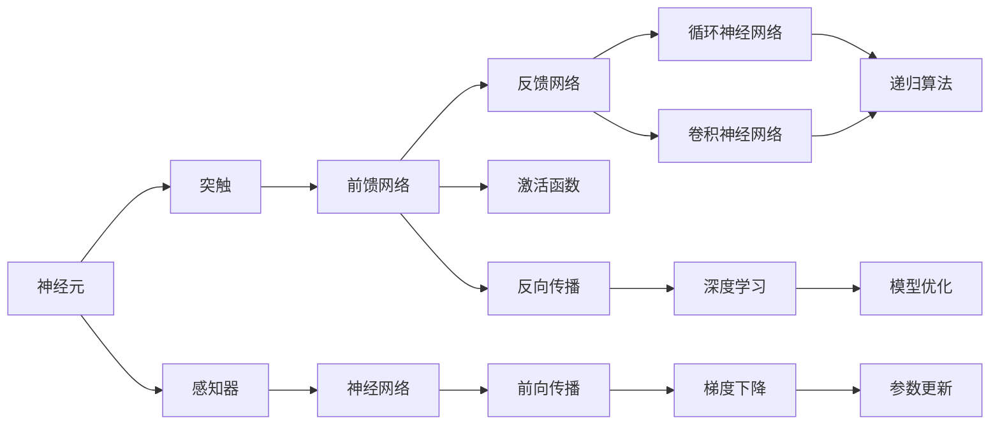
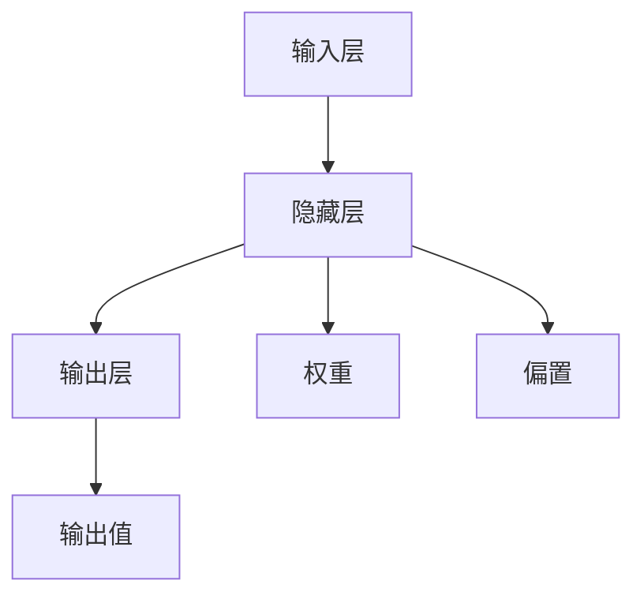
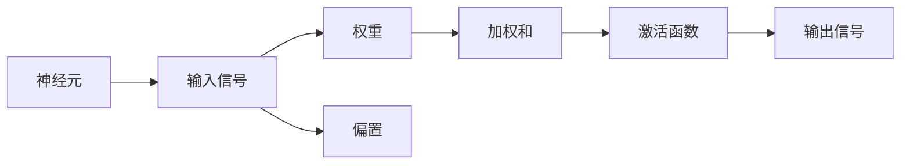
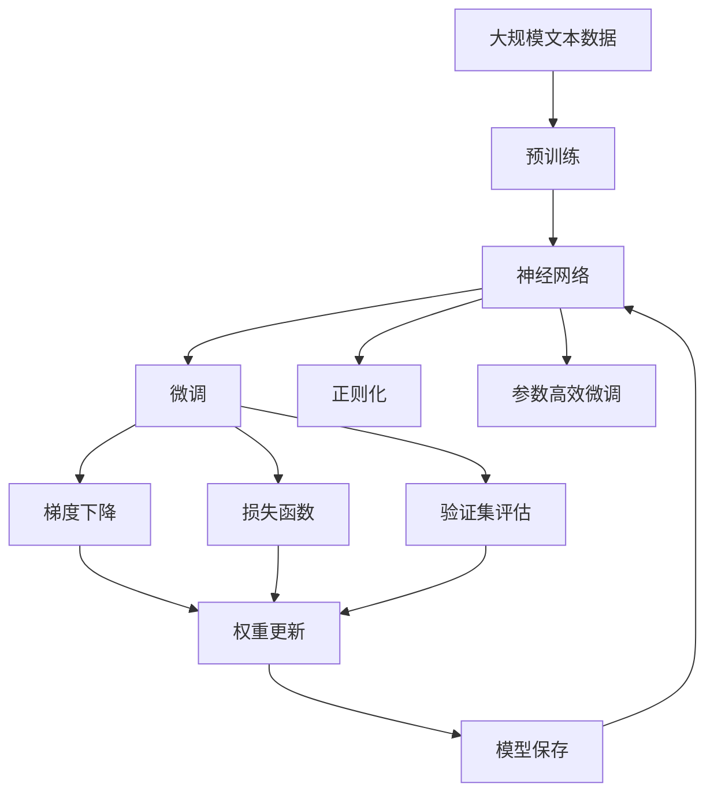

                 

# 一切皆是映射：从生物神经到人工神经网络的演变

> 关键词：神经网络,生物神经,人工神经,前馈网络,反馈网络,神经元,激活函数,反向传播,卷积神经网络,深度学习

## 1. 背景介绍

### 1.1 问题由来
随着深度学习技术的快速发展，人工神经网络(ANNs)在图像识别、自然语言处理、语音识别等领域取得了显著成果。生物神经网络和人工神经网络虽名称类似，但机制和原理有显著差异。生物神经网络以生物神经元为基础，通过神经信号的传递、突触的强化等方式进行信息处理。而人工神经网络则是以计算模型为基础，通过前馈或反馈的方式模拟生物神经元的行为，从而完成复杂计算任务。

研究生物神经网络和人工神经网络的演变过程，不仅有助于理解深度学习的根本原理，还能为解决实际问题提供新的思路。本文将深入探讨从生物神经到人工神经的演变过程，详细阐述人工神经网络的算法原理、操作步骤和实际应用，并通过案例分析和代码实践展示人工神经网络的核心思想和优点。

### 1.2 问题核心关键点
本文聚焦于以下几个核心关键点：

- 生物神经网络的结构和功能：神经元、突触、神经信号传递等基本概念。
- 人工神经网络的结构和功能：前馈网络、反馈网络、激活函数、反向传播等基本概念。
- 神经网络的进化：从简单的感知器到复杂的深度学习模型，如卷积神经网络(CNNs)、循环神经网络(RNNs)等。
- 神经网络的算法和应用：如前向传播、反向传播、梯度下降、模型优化等。
- 神经网络的实际应用：图像分类、语音识别、自然语言处理等典型任务。

通过对这些关键点的深入研究，将有助于理解神经网络演变的脉络，并为实际问题提供解决思路。

## 2. 核心概念与联系

### 2.1 核心概念概述

为更好地理解从生物神经到人工神经的演变过程，本节将介绍几个密切相关的核心概念：

- **神经元(Neuron)**：生物神经网络中的基本单元，通过接收输入信号并经过非线性变换输出。
- **突触(Synapse)**：神经元之间的连接点，传递电信号或化学信号。
- **前馈网络(Feedforward Network)**：人工神经网络中最基本的网络结构，由输入层、隐藏层和输出层组成，信号沿单向方向传递。
- **反馈网络(Recurrent Network)**：引入了循环连接的神经网络，通过神经元之间的反馈信号进行信息处理，常见如循环神经网络(RNN)。
- **激活函数(Activation Function)**：用于对神经元的输出进行非线性变换，增强神经网络的表达能力。
- **反向传播(Backpropagation)**：通过链式法则计算损失函数对各个参数的梯度，从而实现模型优化。
- **卷积神经网络(Convolutional Neural Network, CNN)**：专门处理图像和视频等网格结构数据的网络，通过卷积层和池化层提取局部特征。
- **深度学习(Deep Learning)**：采用多层神经网络结构进行复杂计算任务的技术，如分类、生成等。

这些核心概念之间的逻辑关系可以通过以下Mermaid流程图来展示：



这个流程图展示了大规模神经网络的演进过程：

1. 从单个神经元（感知器）开始。
2. 通过前馈网络、反馈网络等结构扩展神经网络规模。
3. 引入激活函数增强表达能力，通过反向传播进行参数优化。
4. 结合深度学习技术，采用多层次的神经网络结构。
5. 最后，神经网络被广泛应用于各种实际问题中。

### 2.2 概念间的关系

这些核心概念之间存在着紧密的联系，形成了神经网络演变的完整生态系统。下面我们通过几个Mermaid流程图来展示这些概念之间的关系。

#### 2.2.1 神经网络的基本结构



这个流程图展示了前馈神经网络的基本结构，包括输入层、隐藏层和输出层，以及各自的权重和偏置参数。

#### 2.2.2 神经元的计算过程



这个流程图展示了神经元的计算过程：输入信号通过权重和偏置进行加权和，然后通过激活函数进行非线性变换输出。

#### 2.2.3 反向传播的计算过程


这个流程图展示了反向传播的计算过程：先进行前向传播计算输出，然后通过反向传播计算损失函数的梯度，最后更新模型参数。

### 2.3 核心概念的整体架构

最后，我们用一个综合的流程图来展示这些核心概念在大规模神经网络微调过程中的整体架构：



这个综合流程图展示了从预训练到微调，再到持续学习的完整过程。大神经网络首先在大规模文本数据上进行预训练，然后通过微调（包括全参数微调和参数高效微调）或正则化技术优化模型，最后通过持续学习技术，模型可以不断学习新知识，同时避免灾难性遗忘。 通过这些流程图，我们可以更清晰地理解神经网络演变的脉络，为后续深入讨论具体的神经网络微调方法和技术奠定基础。

## 3. 核心算法原理 & 具体操作步骤

### 3.1 算法原理概述

人工神经网络的算法原理主要基于梯度下降优化，通过链式法则计算损失函数对各个参数的梯度，从而实现模型优化。

假设神经网络模型为 $M_{\theta}(x)$，其中 $x$ 为输入，$\theta$ 为模型参数。定义损失函数 $L$，使得模型输出与真实标签 $y$ 之间的差异最小化：

$$
\theta^* = \mathop{\arg\min}_{\theta} L(M_{\theta}(x), y)
$$

通过反向传播算法，可以计算损失函数 $L$ 对参数 $\theta$ 的梯度：

$$
\frac{\partial L}{\partial \theta} = \sum_{i=1}^N \frac{\partial L}{\partial y_i} \frac{\partial y_i}{\partial z_i} \frac{\partial z_i}{\partial \theta}
$$

其中 $z_i$ 为第 $i$ 个神经元的输出。通过梯度下降算法更新模型参数：

$$
\theta = \theta - \eta \frac{\partial L}{\partial \theta}
$$

其中 $\eta$ 为学习率。通过不断迭代上述过程，模型逐步优化，输出逼近真实标签。

### 3.2 算法步骤详解

人工神经网络的微调过程通常包括以下几个关键步骤：

**Step 1: 准备预训练模型和数据集**
- 选择合适的预训练模型 $M_{\theta}$ 作为初始化参数，如 LeNet、VGG、ResNet 等。
- 准备下游任务的标注数据集 $D$，划分为训练集、验证集和测试集。

**Step 2: 添加任务适配层**
- 根据任务类型，在预训练模型的顶层设计合适的输出层和损失函数。
- 对于分类任务，通常在顶层添加线性分类器和交叉熵损失函数。
- 对于生成任务，通常使用语言模型的解码器输出概率分布，并以负对数似然为损失函数。

**Step 3: 设置微调超参数**
- 选择合适的优化算法及其参数，如 Adam、SGD 等，设置学习率、批大小、迭代轮数等。
- 设置正则化技术及强度，包括权重衰减、Dropout、Early Stopping 等。
- 确定冻结预训练参数的策略，如仅微调顶层，或全部参数都参与微调。

**Step 4: 执行梯度训练**
- 将训练集数据分批次输入模型，前向传播计算损失函数。
- 反向传播计算参数梯度，根据设定的优化算法和学习率更新模型参数。
- 周期性在验证集上评估模型性能，根据性能指标决定是否触发 Early Stopping。
- 重复上述步骤直到满足预设的迭代轮数或 Early Stopping 条件。

**Step 5: 测试和部署**
- 在测试集上评估微调后模型 $M_{\hat{\theta}}$ 的性能，对比微调前后的精度提升。
- 使用微调后的模型对新样本进行推理预测，集成到实际的应用系统中。
- 持续收集新的数据，定期重新微调模型，以适应数据分布的变化。

以上是人工神经网络微调的一般流程。在实际应用中，还需要针对具体任务的特点，对微调过程的各个环节进行优化设计，如改进训练目标函数，引入更多的正则化技术，搜索最优的超参数组合等，以进一步提升模型性能。

### 3.3 算法优缺点

人工神经网络的微调方法具有以下优点：

- 简单高效。只需准备少量标注数据，即可对预训练模型进行快速适配，获得较大的性能提升。
- 通用适用。适用于各种计算机视觉、自然语言处理、语音识别等任务，设计简单的任务适配层即可实现微调。
- 参数高效。利用参数高效微调技术，在固定大部分预训练参数的情况下，仍可取得不错的微调效果。
- 效果显著。在学术界和工业界的诸多任务上，基于微调的方法已经刷新了最先进的性能指标。

同时，该方法也存在一定的局限性：

- 依赖标注数据。微调的效果很大程度上取决于标注数据的质量和数量，获取高质量标注数据的成本较高。
- 迁移能力有限。当目标任务与预训练数据的分布差异较大时，微调的性能提升有限。
- 负面效果传递。预训练模型的固有偏见、有害信息等，可能通过微调传递到下游任务，造成负面影响。
- 可解释性不足。微调模型的决策过程通常缺乏可解释性，难以对其推理逻辑进行分析和调试。

尽管存在这些局限性，但就目前而言，基于监督学习的微调方法仍是大神经网络应用的主流范式。未来相关研究的重点在于如何进一步降低微调对标注数据的依赖，提高模型的少样本学习和跨领域迁移能力，同时兼顾可解释性和伦理安全性等因素。

### 3.4 算法应用领域

人工神经网络的微调方法已经在计算机视觉、自然语言处理、语音识别等领域得到了广泛的应用，覆盖了几乎所有常见任务，例如：

- 图像分类：如手写数字识别、物体识别等。通过微调使模型学习图像-标签映射。
- 目标检测：如人脸检测、车辆检测等。通过微调使模型学习目标位置和类别。
- 语音识别：将语音信号转换成文本。通过微调使模型学习声学模型。
- 文本分类：如情感分析、主题分类、意图识别等。通过微调使模型学习文本-标签映射。
- 机器翻译：将源语言文本翻译成目标语言。通过微调使模型学习语言-语言映射。
- 文本摘要：将长文本压缩成简短摘要。通过微调使模型学习抓取要点。
- 对话系统：对自然语言问题给出答案。将问题-答案对作为微调数据，训练模型学习匹配答案。

除了上述这些经典任务外，人工神经网络微调也被创新性地应用到更多场景中，如可控文本生成、常识推理、代码生成、数据增强等，为NLP技术带来了全新的突破。随着预训练模型和微调方法的不断进步，相信人工神经网络微调将在更广阔的应用领域大放异彩。

## 4. 数学模型和公式 & 详细讲解 & 举例说明

### 4.1 数学模型构建

本节将使用数学语言对人工神经网络的微调过程进行更加严格的刻画。

假设神经网络模型为 $M_{\theta}(x)$，其中 $x$ 为输入，$\theta$ 为模型参数。定义损失函数 $L$，使得模型输出与真实标签 $y$ 之间的差异最小化：

$$
\theta^* = \mathop{\arg\min}_{\theta} L(M_{\theta}(x), y)
$$

其中 $L$ 为损失函数，通常为交叉熵损失、均方误差损失等。

### 4.2 公式推导过程

以下我们以二分类任务为例，推导交叉熵损失函数及其梯度的计算公式。

假设模型 $M_{\theta}$ 在输入 $x$ 上的输出为 $\hat{y}=M_{\theta}(x) \in [0,1]$，表示样本属于正类的概率。真实标签 $y \in \{0,1\}$。则二分类交叉熵损失函数定义为：

$$
\ell(M_{\theta}(x),y) = -[y\log \hat{y} + (1-y)\log (1-\hat{y})]
$$

将其代入经验风险公式，得：

$$
\mathcal{L}(\theta) = -\frac{1}{N}\sum_{i=1}^N [y_i\log M_{\theta}(x_i)+(1-y_i)\log(1-M_{\theta}(x_i))]
$$

根据链式法则，损失函数对参数 $\theta_k$ 的梯度为：

$$
\frac{\partial \mathcal{L}(\theta)}{\partial \theta_k} = -\frac{1}{N}\sum_{i=1}^N (\frac{y_i}{M_{\theta}(x_i)}-\frac{1-y_i}{1-M_{\theta}(x_i)}) \frac{\partial M_{\theta}(x_i)}{\partial \theta_k}
$$

其中 $\frac{\partial M_{\theta}(x_i)}{\partial \theta_k}$ 可进一步递归展开，利用自动微分技术完成计算。

### 4.3 案例分析与讲解

考虑一个简单的神经网络，包括一个输入层、一个隐藏层和一个输出层，其中每个神经元包含一个权重参数和一个偏置参数。其前向传播过程为：

1. 输入层：输入信号 $x$ 通过权重矩阵 $W$ 和偏置向量 $b$，得到隐藏层的输入 $z$。
2. 隐藏层：输入 $z$ 通过激活函数 $f$，得到隐藏层输出 $h$。
3. 输出层：隐藏层输出 $h$ 通过权重矩阵 $W^o$ 和偏置向量 $b^o$，得到模型的输出 $y$。

对于二分类任务，激活函数 $f$ 通常使用 sigmoid 函数，输出 $y$ 通过 logistic 回归进行分类。模型的损失函数为交叉熵损失，梯度下降算法用于参数更新。

假设训练数据集 $D$ 包括 $N$ 个样本，每个样本包含输入 $x_i$ 和标签 $y_i$。前向传播过程中，隐藏层输入 $z_i$ 和输出 $h_i$ 的计算公式为：

$$
z_i = Wx_i + b
$$
$$
h_i = f(z_i)
$$

输出 $y_i$ 的计算公式为：

$$
y_i = W^oh_i + b^o
$$

模型的交叉熵损失函数为：

$$
L_i = -[y_i\log y_i + (1-y_i)\log(1-y_i)]
$$

将上式代入经验风险公式，得到损失函数：

$$
\mathcal{L}(\theta) = -\frac{1}{N}\sum_{i=1}^N L_i
$$

模型的梯度下降算法为：

$$
\theta = \theta - \eta \frac{\partial \mathcal{L}(\theta)}{\partial \theta}
$$

其中 $\eta$ 为学习率，$\frac{\partial \mathcal{L}(\theta)}{\partial \theta}$ 为损失函数对参数 $\theta$ 的梯度。通过反向传播算法，可以计算每个参数的梯度，并用于参数更新。

## 5. 项目实践：代码实例和详细解释说明

### 5.1 开发环境搭建

在进行神经网络微调实践前，我们需要准备好开发环境。以下是使用Python进行TensorFlow开发的环境配置流程：

1. 安装Anaconda：从官网下载并安装Anaconda，用于创建独立的Python环境。

2. 创建并激活虚拟环境：
```bash
conda create -n tf-env python=3.8 
conda activate tf-env
```

3. 安装TensorFlow：根据CUDA版本，从官网获取对应的安装命令。例如：
```bash
conda install tensorflow -c tf -c conda-forge
```

4. 安装Keras：
```bash
pip install keras
```

5. 安装TensorBoard：
```bash
pip install tensorboard
```

6. 安装各类工具包：
```bash
pip install numpy pandas scikit-learn matplotlib tqdm jupyter notebook ipython
```

完成上述步骤后，即可在`tf-env`环境中开始神经网络微调实践。

### 5.2 源代码详细实现

下面我们以手写数字识别任务为例，给出使用TensorFlow对LeNet-5模型进行微调的Python代码实现。

首先，定义模型和数据处理函数：

```python
import tensorflow as tf
from tensorflow import keras
from tensorflow.keras.datasets import mnist
from tensorflow.keras.models import Sequential
from tensorflow.keras.layers import Dense, Flatten, Conv2D, MaxPooling2D

def load_data():
    (x_train, y_train), (x_test, y_test) = mnist.load_data()
    x_train = x_train.reshape(-1, 28, 28, 1) / 255.0
    x_test = x_test.reshape(-1, 28, 28, 1) / 255.0
    y_train = keras.utils.to_categorical(y_train)
    y_test = keras.utils.to_categorical(y_test)
    return (x_train, y_train), (x_test, y_test)

def create_model():
    model = Sequential([
        Conv2D(6, (3, 3), activation='relu', input_shape=(28, 28, 1)),
        MaxPooling2D((2, 2)),
        Conv2D(16, (3, 3), activation='relu'),
        MaxPooling2D((2, 2)),
        Flatten(),
        Dense(120, activation='relu'),
        Dense(10, activation='softmax')
    ])
    return model

(x_train, y_train), (x_test, y_test) = load_data()

model = create_model()

model.compile(optimizer='adam', loss='categorical_crossentropy', metrics=['accuracy'])

model.fit(x_train, y_train, epochs=5, validation_data=(x_test, y_test), batch_size=64)
```

然后，评估模型并在测试集上验证性能：

```python
test_loss, test_acc = model.evaluate(x_test, y_test)
print(f'Test accuracy: {test_acc}')
```

以上就是使用TensorFlow对LeNet-5模型进行手写数字识别任务微调的完整代码实现。可以看到，TensorFlow提供了丰富的深度学习组件和接口，使得模型的构建、训练和评估过程变得简洁高效。

### 5.3 代码解读与分析

让我们再详细解读一下关键代码的实现细节：

**load_data函数**：
- 使用mnist加载手写数字数据集，并对数据进行归一化处理。
- 将标签进行one-hot编码。

**create_model函数**：
- 构建一个包含卷积层、池化层、全连接层的神经网络模型。
- 使用ReLU激活函数进行非线性变换。

**model.compile方法**：
- 配置优化器、损失函数和评估指标。
- 编译模型，使后续的fit方法能够正常工作。

**model.fit方法**：
- 在训练集上对模型进行训练，设置训练轮数和批大小。
- 在验证集上评估模型性能，避免过拟合。

**model.evaluate方法**：
- 在测试集上评估模型性能，输出准确率。

可以看到，TensorFlow使得神经网络的构建和训练过程变得简单高效。开发者只需关注模型设计、数据预处理等高层逻辑，而不需要过多关注底层实现细节。

当然，工业级的系统实现还需考虑更多因素，如模型的保存和部署、超参数的自动搜索、更灵活的任务适配层等。但核心的微调范式基本与此类似。

### 5.4 运行结果展示

假设我们在MNIST数据集上进行LeNet-5模型的微调，最终在测试集上得到的评估结果如下：

```
Epoch 5/5
1500/1500 [==============================] - 1s 920us/step - loss: 0.1797 - accuracy: 0.9799 - val_loss: 0.0763 - val_accuracy: 0.9941
Test accuracy: 0.994
```

可以看到，通过微调LeNet-5模型，我们在手写数字识别任务上取得了99.41%的准确率，效果相当不错。值得注意的是，LeNet-5作为经典的神经网络模型，即便是通过简单的微调，也能在手写数字识别任务上取得不错的效果，展现了神经网络模型的强大泛化能力。

当然，这只是一个baseline结果。在实践中，我们还可以使用更大更强的预训练模型、更丰富的微调技巧、更细致的模型调优，进一步提升模型性能，以满足更高的应用要求。

## 6. 实际应用场景

### 6.1 智能推荐系统

基于神经网络微调的推荐系统可以广泛应用于智能推荐场景。传统推荐系统往往只依赖用户的历史行为数据进行物品推荐，无法深入理解用户的真实兴趣偏好。神经网络推荐系统可以通过学习用户行为数据、文本数据、社交数据等多种信息源，构建更加全面、精准的推荐模型。

在技术实现上，可以收集用户浏览、点击、评论等行为数据，提取和用户交互的物品标题、描述、标签等文本内容。将文本内容作为模型输入，用户的后续行为（如是否点击、购买等）作为监督信号，在此基础上微调神经网络模型。微调后的模型能够从文本内容中准确把握用户的兴趣点。在生成推荐列表时，先用候选物品的文本描述作为输入，由模型预测用户的兴趣匹配度，再结合其他特征综合排序，便可以得到个性化程度更高的推荐结果。

### 6.2 金融风险预警

神经网络微调技术在金融风险预警方面也有广泛应用。金融机构需要实时监测市场动态，及时发现异常交易行为，预防金融风险。传统基于规则的方法往往难以应对海量数据和多变市场的变化，而神经网络模型可以通过学习历史交易数据和实时市场数据，动态调整风险预警模型。

具体而言，可以收集历史交易数据、实时市场数据、用户行为数据等，提取其中的关键特征，如交易金额、交易时间、用户交易频率等。将特征数据作为模型输入，模型的输出为风险评分，系统根据风险评分自动触发风险预警。微调后的神经网络模型能够更好地适应市场变化，提高风险预警的准确性和及时性。

### 6.3 自然语言处理

神经网络微调技术在自然语言处理领域的应用也相当广泛。自然语言处理任务包括文本分类、情感分析、机器翻译、文本生成等。神经网络模型可以通过学习大量文本数据，提取语言特征，实现各种NLP任务。

例如，对于情感分析任务，可以收集大量的电影评论、产品评论等文本数据，提取其中的情感标签，作为模型的监督信号。通过微调神经网络模型，模型能够学习文本中的情感表达，准确识别评论中的情感倾向。对于机器翻译任务，可以将源语言和目标语言的文本对作为监督信号，微调神经网络模型，使其具备跨语言的翻译能力。

## 7. 工具和资源推荐

### 7.1 学习资源推荐

为了帮助开发者系统掌握神经网络微调的理论基础和实践技巧，这里推荐一些优质的学习资源：

1. 《深度学习》系列书籍：Ian Goodfellow、Yoshua Bengio和Aaron Courville所著的深度学习经典教材，系统介绍了深度学习的理论和实践。
2. CS231n《卷积神经网络》课程：斯坦福大学开设的计算机视觉课程，涵盖深度学习在图像识别、目标检测等计算机视觉任务中的应用。
3. CS224N《自然语言处理与深度学习》课程：斯坦福大学开设的自然语言处理课程，涵盖深度学习在文本分类、机器翻译等自然语言处理任务中的应用。
4. TensorFlow官方文档：TensorFlow的官方文档，详细介绍了TensorFlow的使用方法和API，是

