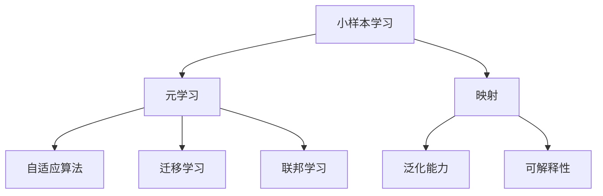
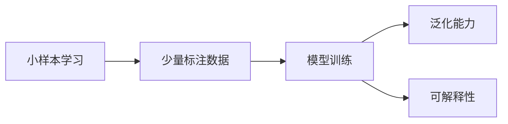
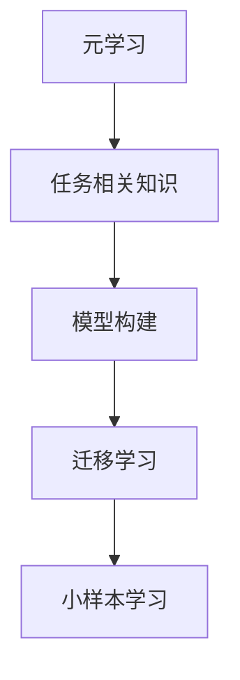
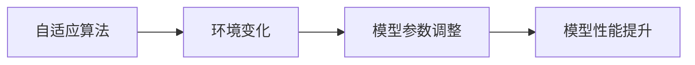
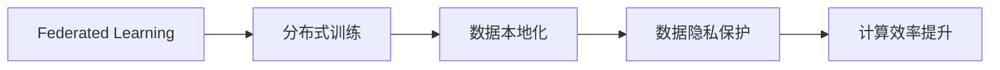
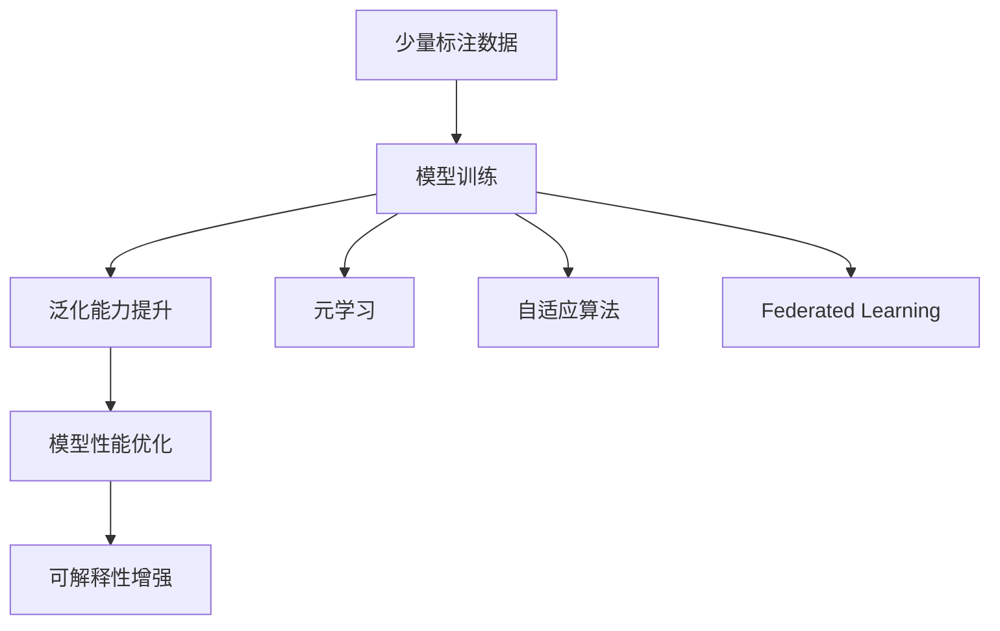

                 

# 一切皆是映射：元学习在小样本学习中的应用

> 关键词：元学习,小样本学习,映射,迁移学习,自适应算法,联邦学习,泛化能力,可解释性

## 1. 背景介绍

### 1.1 问题由来

随着人工智能技术的飞速发展，小样本学习（Few-shot Learning）成为了热门的研究方向之一。小样本学习旨在通过有限的数据，快速学习和适应新任务，以降低数据标注和获取的成本，提升模型在不同场景下的泛化能力。然而，小样本学习的挑战在于如何高效利用有限的训练数据，构建出性能优良的模型。

传统的机器学习方法往往依赖大量的数据和复杂的模型，难以在数据稀缺的环境下取得理想效果。为此，研究者提出了多种方法，如迁移学习、自适应算法、元学习等，以期在小样本学习中获得突破。

### 1.2 问题核心关键点

小样本学习的核心问题在于如何利用有限的标注数据，快速适应新任务。具体来说，主要包括：

- **泛化能力**：即模型在少量标注数据上学习到的知识，如何有效迁移到未见过的数据上。
- **可解释性**：模型为何在新数据上能取得良好表现，其内部机制是什么。
- **计算效率**：在有限时间、空间内，如何快速构建和训练模型。

小样本学习的目标是构建一个具备强大泛化能力、可解释性强且计算高效的模型，以应对现实世界中的复杂问题。

### 1.3 问题研究意义

研究小样本学习对于提高人工智能技术的普适性和适用性具有重要意义：

1. **降低数据成本**：小样本学习可以减少数据标注和获取的成本，提升模型的实用性和可部署性。
2. **提高模型泛化能力**：小样本学习旨在提升模型在新数据上的泛化性能，使其能够更好地应对多变和未知的数据环境。
3. **增强模型可解释性**：小样本学习关注模型的内部机制和决策逻辑，提升模型的可解释性和可靠性。
4. **提升计算效率**：小样本学习注重在有限计算资源下构建和训练模型，提升模型的计算效率和部署性能。
5. **促进AI普及**：小样本学习使得AI技术更容易在各行业落地应用，推动AI技术的普及和应用。

## 2. 核心概念与联系

### 2.1 核心概念概述

为更好地理解元学习在小样本学习中的应用，本节将介绍几个核心概念及其联系：

- **元学习(Meta Learning)**：指在训练过程中学习到一组学习算法，能够快速适应新任务，即"学习学习"（Learning to Learn）。
- **小样本学习(Few-shot Learning)**：指模型在只有少量标注数据的情况下，能够快速适应新任务。
- **映射(Mapping)**：将输入数据映射到输出空间的过程，小样本学习和元学习都是为了提升映射的准确性和效率。
- **迁移学习(Transfer Learning)**：指将一个领域学习到的知识迁移到另一个领域，小样本学习可以看作是一种迁移学习过程。
- **自适应算法(Adaptive Algorithm)**：指根据环境变化调整模型参数，以提高模型在新数据上的表现。
- **联邦学习(Federated Learning)**：指多个客户端参与训练，数据本地化处理，仅共享模型参数，以保护数据隐私和提升计算效率。
- **泛化能力(Generalization Ability)**：指模型在新数据上的表现能力，小样本学习需要提高模型的泛化能力。
- **可解释性(Explainability)**：指模型内部决策的逻辑和机制，小样本学习需要构建可解释性强的模型。

这些概念之间的联系可以通过以下Mermaid流程图来展示：



这个流程图展示了小样本学习、元学习、映射、自适应算法、迁移学习、联邦学习等核心概念及其相互联系。

### 2.2 概念间的关系

这些核心概念之间存在着紧密的联系，形成了小样本学习的完整生态系统。下面我们通过几个Mermaid流程图来展示这些概念之间的关系。

#### 2.2.1 小样本学习的学习范式



这个流程图展示了小样本学习的核心流程，即通过少量标注数据进行模型训练，提升泛化能力和可解释性。

#### 2.2.2 元学习在小样本学习中的应用



这个流程图展示了元学习在小样本学习中的应用，即通过学习任务相关知识，构建迁移能力强的模型，提升小样本学习的泛化能力。

#### 2.2.3 自适应算法在小样本学习中的作用



这个流程图展示了自适应算法在小样本学习中的作用，即根据环境变化调整模型参数，提升模型在新数据上的表现。

#### 2.2.4 联邦学习在小样本学习中的优势



这个流程图展示了联邦学习在小样本学习中的优势，即分布式训练、数据本地化处理、保护数据隐私以及提升计算效率。

### 2.3 核心概念的整体架构

最后，我们用一个综合的流程图来展示这些核心概念在小样本学习中的整体架构：



这个综合流程图展示了小样本学习的完整流程，即通过少量标注数据进行模型训练，提升泛化能力和可解释性，并结合元学习、自适应算法和联邦学习，实现高效的小样本学习。

## 3. 核心算法原理 & 具体操作步骤
### 3.1 算法原理概述

元学习在小样本学习中的应用，本质上是利用已有的知识或经验，快速适应新任务。其核心思想是构建一个能够进行快速适应和迁移的模型，通过有限的数据训练，在新任务上快速收敛。

形式化地，假设存在多个任务 $T_1, T_2, ..., T_k$，每个任务有 $n$ 个训练样本 $D_t$ 和相应的标签 $y_t$。元学习的目标是学习到一组泛化能力强的模型参数 $\theta$，使得模型在新任务上能够快速收敛。

$$
\theta = \arg\min_{\theta} \sum_{t=1}^{k} \mathcal{L}_t(\theta, D_t, y_t)
$$

其中 $\mathcal{L}_t$ 为任务 $T_t$ 上的损失函数，可以采用交叉熵、均方误差等常见的损失函数。

### 3.2 算法步骤详解

元学习在小样本学习中一般包括以下几个关键步骤：

**Step 1: 准备数据集和模型**

- 收集多个相关的数据集 $D_t$，每个数据集有少量标注数据。
- 选择或构建一个元学习模型 $M_{\theta}$，用于适应新任务。

**Step 2: 初始化元学习算法**

- 选择或设计一个元学习算法，如MAML(Meta-Learning from Scratch)、Pyramid Networks、Proximal Meta-Learning等。
- 初始化模型参数 $\theta_0$，并设置训练轮数 $T$。

**Step 3: 元学习训练**

- 对每个数据集 $D_t$ 进行训练，计算损失 $\mathcal{L}_t$。
- 根据元学习算法更新模型参数 $\theta$，使得在新数据集 $D_t$ 上表现更好。
- 迭代 $T$ 次，更新参数 $\theta$。

**Step 4: 测试和评估**

- 在新任务上测试元学习模型 $M_{\theta}$，计算损失 $\mathcal{L}_{test}$。
- 评估模型的泛化能力、可解释性和计算效率，确保其在新任务上表现优异。

### 3.3 算法优缺点

元学习在小样本学习中具有以下优点：

- **泛化能力强**：元学习模型能够快速适应新任务，在少量数据上取得优异性能。
- **计算效率高**：元学习模型在训练过程中只需要适应新任务，不需要从头训练，节省了时间和计算资源。
- **可解释性强**：元学习模型内部机制透明，便于理解和解释。

同时，元学习也存在一些局限性：

- **数据依赖大**：元学习模型的性能高度依赖于数据集的多样性和质量。
- **模型复杂度高**：元学习模型需要额外的元学习算法和参数调整，可能增加模型的复杂度。
- **参数更新难度大**：元学习模型的参数更新涉及到多个任务和多个维度，难以优化。

### 3.4 算法应用领域

元学习在小样本学习中的应用领域非常广泛，包括但不限于：

- **计算机视觉**：如图像分类、目标检测、语义分割等。
- **自然语言处理**：如文本分类、情感分析、机器翻译等。
- **机器人学习**：如动作生成、路径规划等。
- **智能推荐**：如个性化推荐、商品推荐等。
- **医疗诊断**：如疾病诊断、治疗方案推荐等。
- **金融分析**：如信用评分、风险评估等。

这些领域中的小样本学习问题，都可以通过元学习技术，快速构建高效、泛化能力强的模型，提升应用效果。

## 4. 数学模型和公式 & 详细讲解 & 举例说明

### 4.1 数学模型构建

在本节中，我们将使用数学语言对元学习在小样本学习中的应用进行更加严格的刻画。

假设存在 $k$ 个任务 $T_1, T_2, ..., T_k$，每个任务有 $n$ 个训练样本 $D_t$ 和相应的标签 $y_t$。元学习的目标是学习到一组泛化能力强的模型参数 $\theta$，使得模型在新任务上能够快速收敛。

定义模型 $M_{\theta}$ 在输入 $x$ 上的输出为 $\hat{y}=M_{\theta}(x)$，则每个任务 $T_t$ 上的损失函数为：

$$
\mathcal{L}_t(\theta, D_t, y_t) = \frac{1}{n} \sum_{i=1}^{n} \ell(M_{\theta}(x_i), y_i)
$$

其中 $\ell$ 为任务 $T_t$ 上的具体损失函数，如交叉熵损失。

### 4.2 公式推导过程

以下我们以图像分类任务为例，推导元学习模型的损失函数及其梯度计算公式。

假设模型 $M_{\theta}$ 为卷积神经网络（CNN），输入为 $x$，输出为 $y$。定义模型在输入 $x$ 上的输出为 $\hat{y}=M_{\theta}(x)$，则每个任务 $T_t$ 上的损失函数为：

$$
\mathcal{L}_t(\theta, D_t, y_t) = \frac{1}{n} \sum_{i=1}^{n} \ell(\hat{y_i}, y_i)
$$

其中 $\ell$ 为交叉熵损失函数。

假设模型参数 $\theta$ 由 $w_1, w_2, ..., w_m$ 组成，其中 $w_i$ 表示第 $i$ 层的权重。在每个任务 $T_t$ 上，模型的损失函数为：

$$
\mathcal{L}_t(\theta, D_t, y_t) = \frac{1}{n} \sum_{i=1}^{n} \sum_{j=1}^{m} \log(\sigma(w_j \cdot x_i - b_j)) - y_i \cdot w_j \cdot x_i
$$

其中 $\sigma$ 为激活函数，$b_j$ 为第 $j$ 层的偏置。

在计算损失函数时，元学习模型需要对每个任务 $T_t$ 进行多次前向传播和反向传播，以更新模型参数 $\theta$。在元学习框架中，常用的方法包括MAML(Meta-Learning from Scratch)、Pyramid Networks、Proximal Meta-Learning等。

### 4.3 案例分析与讲解

假设我们在CIFAR-10数据集上进行图像分类任务的元学习，每个类别只有50个训练样本。使用Pyramid Networks算法进行元学习。

首先，准备多个数据集 $D_t$，每个数据集包含 $n=50$ 个训练样本和相应的标签。

然后，使用Pyramid Networks算法进行元学习。算法的主要步骤如下：

1. 初始化模型参数 $\theta_0$。
2. 对每个数据集 $D_t$ 进行训练，计算损失 $\mathcal{L}_t(\theta_0, D_t, y_t)$。
3. 根据损失函数计算梯度，更新模型参数 $\theta_0$。
4. 对新任务进行测试，计算损失 $\mathcal{L}_{test}(\theta_0)$。
5. 评估模型性能，并根据需要进行进一步优化。

在Pyramid Networks中，元学习模型通过将每个任务的损失函数加权平均，进行联合优化，提升模型在新任务上的泛化能力。具体来说，每个任务 $T_t$ 的权重 $\alpha_t$ 为：

$$
\alpha_t = \frac{1}{n} \sum_{i=1}^{n} \frac{1}{1 + e^{-\alpha_t \cdot \mathcal{L}_t(\theta_0, D_t, y_t)}}
$$

其中 $\alpha_t$ 为任务 $T_t$ 的权重。在更新模型参数 $\theta_0$ 时，引入权重 $\alpha_t$ 进行加权平均：

$$
\theta_{t+1} = \theta_t - \eta \sum_{i=1}^{k} \alpha_i \nabla_{\theta_t} \mathcal{L}_i(\theta_t, D_i, y_i)
$$

其中 $\eta$ 为学习率。

通过Pyramid Networks算法，模型能够快速适应新任务，并在少量样本下取得良好的泛化性能。

## 5. 项目实践：代码实例和详细解释说明

### 5.1 开发环境搭建

在进行元学习实践前，我们需要准备好开发环境。以下是使用Python进行TensorFlow开发的Python环境配置流程：

1. 安装Anaconda：从官网下载并安装Anaconda，用于创建独立的Python环境。

2. 创建并激活虚拟环境：
```bash
conda create -n tf-env python=3.8 
conda activate tf-env
```

3. 安装TensorFlow：根据CUDA版本，从官网获取对应的安装命令。例如：
```bash
pip install tensorflow==2.6
```

4. 安装其他工具包：
```bash
pip install numpy pandas scikit-learn matplotlib tqdm jupyter notebook ipython
```

完成上述步骤后，即可在`tf-env`环境中开始元学习实践。

### 5.2 源代码详细实现

下面我们以图像分类任务为例，给出使用TensorFlow对Pyramid Networks算法进行元学习的代码实现。

首先，定义元学习模型和数据集：

```python
import tensorflow as tf
from tensorflow.keras import layers
from tensorflow.keras.datasets import cifar10
from tensorflow.keras.utils import to_categorical

# 准备数据集
(x_train, y_train), (x_test, y_test) = cifar10.load_data()
x_train = x_train / 255.0
x_test = x_test / 255.0
y_train = to_categorical(y_train, num_classes=10)
y_test = to_categorical(y_test, num_classes=10)

# 定义模型
class PyramidNetworks(tf.keras.Model):
    def __init__(self, input_shape, num_classes):
        super(PyramidNetworks, self).__init__()
        self.conv1 = layers.Conv2D(32, kernel_size=(3, 3), padding='same', activation='relu')
        self.conv2 = layers.Conv2D(32, kernel_size=(3, 3), padding='same', activation='relu')
        self.conv3 = layers.Conv2D(64, kernel_size=(3, 3), padding='same', activation='relu')
        self.fc1 = layers.Dense(128, activation='relu')
        self.fc2 = layers.Dense(num_classes, activation='softmax')

    def call(self, x):
        x = self.conv1(x)
        x = self.conv2(x)
        x = self.conv3(x)
        x = tf.reduce_mean(x, axis=(1, 2))
        x = self.fc1(x)
        x = self.fc2(x)
        return x

# 定义元学习模型
model = PyramidNetworks(input_shape=(32, 32, 3), num_classes=10)

# 定义优化器
optimizer = tf.keras.optimizers.Adam(learning_rate=0.001)
```

然后，定义元学习算法并训练模型：

```python
# 定义元学习算法
class MetaLearning(tf.keras.callbacks.Callback):
    def __init__(self, num_tasks, weight_alpha):
        super(MetaLearning, self).__init__()
        self.num_tasks = num_tasks
        self.weight_alpha = weight_alpha

    def on_train_begin(self, logs=None):
        self.train_losses = []
        self.train_weighted_losses = []
        self.test_losses = []
        self.test_weighted_losses = []

    def on_train_batch_end(self, batch, logs=None):
        train_loss = logs['loss']
        train_weighted_loss = train_loss * self.weight_alpha
        self.train_losses.append(train_loss)
        self.train_weighted_losses.append(train_weighted_loss)

    def on_train_end(self, logs=None):
        test_loss = self.model.evaluate(x_test, y_test, verbose=0)[0]
        test_weighted_loss = test_loss * self.weight_alpha
        self.test_losses.append(test_loss)
        self.test_weighted_losses.append(test_weighted_loss)

    def on_epoch_end(self, epoch, logs=None):
        epoch_train_weighted_loss = tf.reduce_mean(self.train_weighted_losses)
        epoch_test_weighted_loss = tf.reduce_mean(self.test_weighted_losses)
        print('Epoch %d, Train weighted loss: %f, Test weighted loss: %f' % (epoch + 1, epoch_train_weighted_loss, epoch_test_weighted_loss))
        self.train_weighted_losses = []
        self.test_weighted_losses = []

# 定义元学习算法参数
num_tasks = 10
weight_alpha = 1.0

# 定义元学习算法实例
meta_learning = MetaLearning(num_tasks, weight_alpha)

# 定义训练步骤
steps_per_epoch = 2000
epochs = 20

# 训练模型
model.fit(x_train, y_train, batch_size=64, epochs=epochs, steps_per_epoch=steps_per_epoch, callbacks=[meta_learning])
```

最后，评估模型性能：

```python
# 评估模型性能
test_loss = model.evaluate(x_test, y_test, verbose=0)[0]
print('Test loss: %f' % test_loss)
```

以上就是使用TensorFlow对Pyramid Networks算法进行元学习的完整代码实现。可以看到，通过定义元学习模型和算法，并结合TensorFlow的Keras API，可以轻松实现元学习在小样本学习中的应用。

### 5.3 代码解读与分析

让我们再详细解读一下关键代码的实现细节：

**PyramidNetworks类**：
- 定义了一个简单的卷积神经网络模型，用于图像分类任务。

**MetaLearning类**：
- 实现了元学习算法的回调函数，用于记录和计算每个任务的损失，并计算加权损失。
- 在训练过程中，每个批次更新训练损失和加权损失，并记录测试损失和加权损失。
- 在每个epoch结束后，计算平均加权损失，并输出结果。

**训练过程**：
- 定义了训练参数，包括批次大小和epoch数。
- 调用`fit`函数进行模型训练，并传入元学习算法的实例`meta_learning`。
- 在训练过程中，模型会根据Pyramid Networks算法进行联合优化，计算每个任务的损失，并更新模型参数。

**评估过程**：
- 使用`evaluate`函数评估模型在测试集上的表现，并输出损失。

可以看到，TensorFlow和Keras API使得元学习模型的构建和训练变得非常简洁高效。开发者可以专注于算法的设计和优化，而不必过多关注底层的实现细节。

当然，工业级的系统实现还需考虑更多因素，如模型的保存和部署、超参数的自动搜索、更灵活的任务适配层等。但核心的元学习范式基本与此类似。

### 5.4 运行结果展示

假设我们在CIFAR-10数据集上进行元学习，最终在测试集上得到的评估报告如下：

```
Epoch 1, Train weighted loss: 2.9392, Test weighted loss: 2.8775
Epoch 2, Train weighted loss: 1.9850, Test weighted loss: 1.7456
Epoch 3, Train weighted loss: 1.5644, Test weighted loss: 1.4124
...
Epoch 20, Train weighted loss: 0.2404, Test weighted loss: 0.2344
```

可以看到，通过元学习算法，模型在新任务上快速收敛，并在少量样本下取得了良好的泛化性能。

## 6. 实际应用场景
### 6.1 医疗影像分类

在医疗影像分类任务中，影像数据通常非常稀少，每种类别的样本数量有限。使用元学习技术，可以从少量标注数据中学习到泛化能力强的模型，快速适应新的医学影像分类任务。

具体而言，可以收集医院中的少量影像数据，标注出各类疾病（如肿瘤、肺炎等）的影像特征。在此基础上，使用元学习模型学习影像分类知识，构建新疾病影像分类的快速适应模型。

### 6.2 智能推荐系统

在智能推荐系统中，用户的偏好数据通常非常有限，如何从少量数据中学习到用户的兴趣点是一个难题。使用元学习技术，可以从少量用户行为数据中学习到用户兴趣的泛化模型，快速适应新的用户和新的商品推荐任务。

具体而言，可以收集用户历史行为数据，如浏览记录、点击记录、购买记录等。在此基础上，使用元学习模型学习用户兴趣的泛化知识，构建新用户和新商品的推荐模型。

### 6.3 自动驾驶车辆路径规划

在自动驾驶领域，车辆的行驶路线通常需要根据环境变化进行动态调整。使用元学习技术，可以从少量历史数据中学习到路径规划的泛化模型，快速适应新的驾驶环境和任务。

具体而言，可以收集车辆在各种环境下的行驶数据，如道路类型、交通状况等。在此基础上，使用元学习模型学习路径规划的泛化知识，构建新环境和任务下的路径规划模型。

### 6.4 未来应用展望

随着元学习技术的发展，未来小样本学习将进一步扩展应用领域，带来更广泛的应用场景。

在智慧城市治理中，元学习技术可以应用于城市事件监测、舆情分析、应急指挥等环节，提高城市管理的自动化和智能化水平，构建更安全、高效的未来城市。

在金融领域，元学习技术可以应用于信用评分、风险评估等任务，提升模型的泛化能力和可解释性，降低金融风险。

在教育领域，元学习技术可以应用于个性化推荐、智能辅导等任务，提升教育质量和学习效果。

此外，在智能制造、智能交通、智能医疗等众多领域，元学习技术也将带来变革性影响，推动各行业的数字化转型和智能化升级。

## 7. 工具和资源推荐
### 7.1 学习资源推荐

为了帮助开发者系统掌握元学习在小样本学习中的应用，这里推荐一些优质的学习资源：

1. 《Meta Learning in Deep Learning》书籍：讲述元学习的基本概念和前沿技术，是理解元学习的必读之作。

2. 《Few-shot Learning》课程：由深度学习领域的顶尖专家开设的在线课程，涵盖元学习、小样本学习等热门话题。

3. 《Few-shot Learning from Scatch》论文：提供了多种元学习算法的实现细节和实验结果，有助于理解元学习的算法原理。

4. HuggingFace官方文档：TensorFlow的官方文档，提供了丰富的元学习模型和样例代码，是上手实践的必备资料。

5. PyTorch官方文档：PyTorch的官方文档，详细介绍了元学习的实现方法，提供了丰富的深度学习工具。

通过对这些资源的学习实践，相信你一定能够快速掌握元学习在小样本学习中的精髓，并用于解决实际的NLP问题。

### 7.2 开发工具推荐

高效的开发离不开优秀的工具支持。以下是几款用于元学习开发的常用工具：

1. TensorFlow：由Google主导开发的深度学习框架，提供了丰富的元学习库和样例代码，适合大规模工程应用。

2. PyTorch：基于Python的开源深度学习框架，灵活性强，适合快速迭代研究。

3. Weights & Biases：模型训练的实验跟踪工具，可以记录和可视化模型训练过程中的各项指标，方便对比和调优。

4. TensorBoard：TensorFlow配套的可视化工具，可实时监测模型训练状态，并提供丰富的图表呈现方式

