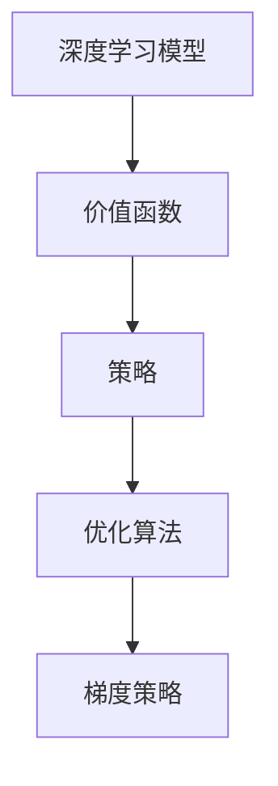
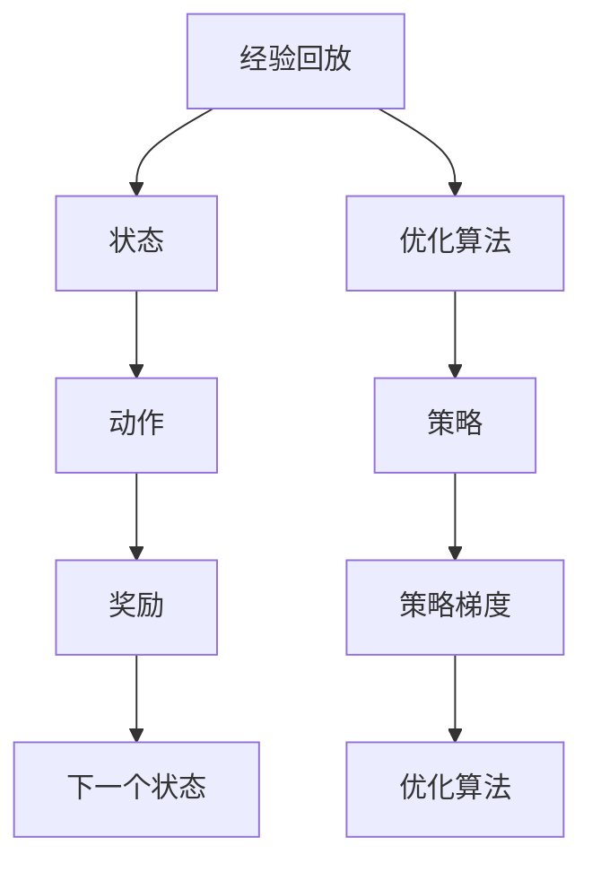
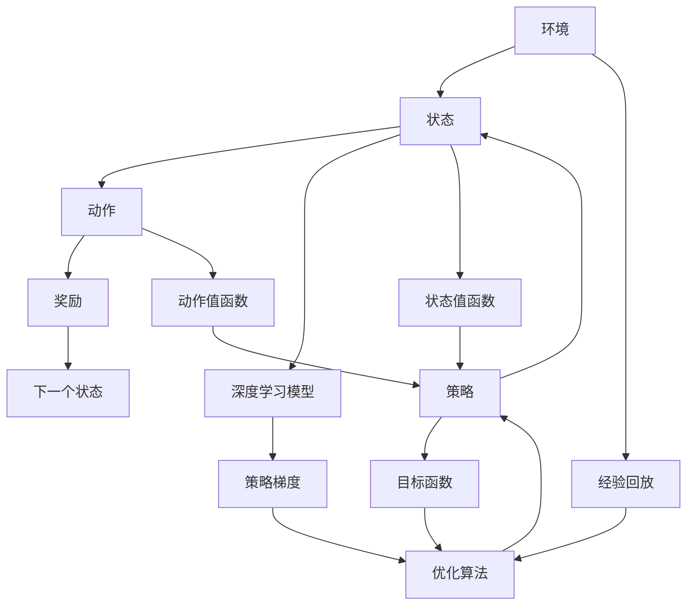

                 

# 一切皆是映射：强化学习与神经网络的结合

> 关键词：强化学习,神经网络,深度强化学习,深度学习,神经网络与强化学习的结合,马尔可夫决策过程,梯度策略,策略梯度

## 1. 背景介绍

### 1.1 问题由来
强化学习（Reinforcement Learning, RL）作为人工智能领域的重要分支，与传统的监督学习和无监督学习不同，它通过智能体（agent）与环境的交互，在不断的试错中学习最优策略。而神经网络（Neural Networks, NN）则是人工智能领域最为成功的一类模型，能够高效地从大量数据中提取特征和模式。

强化学习与神经网络的结合，即深度强化学习（Deep Reinforcement Learning, DRL），逐渐成为当前人工智能领域的研究热点。深度学习的高表示能力，能够大大提升强化学习的泛化能力和策略优化效率，使得深度强化学习在诸多实际问题中取得了突破性的进展。

近年来，深度强化学习已经在视频游戏、机器人控制、自动驾驶、智能推荐等领域展现出了巨大的应用潜力。本文将详细讨论深度强化学习的基本原理、关键算法和操作步骤，并通过具体案例阐述其应用领域和实际效果。

### 1.2 问题核心关键点
深度强化学习的核心在于将神经网络的表示能力和强化学习的搜索能力相结合，通过深度学习模型对环境进行建模和策略优化。具体来说，可以总结为以下几个关键点：

- **马尔可夫决策过程（Markov Decision Process, MDP）**：强化学习的基础，通过状态、动作、奖励和转移概率构建。
- **梯度策略（Gradient-based Policy, 如策略梯度）**：利用神经网络对策略进行参数化，通过梯度下降优化策略，提升策略性能。
- **经验回放（Experience Replay）**：收集学习过程中的经验数据，通过离线数据更新策略，提高学习效率和泛化能力。
- **目标函数（Objective Function）**：通常为累计奖励最大化，是优化的最终目标。
- **优化算法（如Adam、RMSprop等）**：用于优化梯度策略，提升训练效果。
- **模型网络（如Q网络、策略网络等）**：用于对环境进行建模，产生动作或评估状态价值。

## 2. 核心概念与联系

### 2.1 核心概念概述

为更好地理解深度强化学习，本节将介绍几个密切相关的核心概念：

- **马尔可夫决策过程（MDP）**：由状态集 $S$、动作集 $A$、转移概率 $P(s'|s,a)$、奖励函数 $R(s,a)$ 和折扣因子 $\gamma$ 构成，定义了智能体与环境之间的交互。
- **强化学习（RL）**：通过智能体在环境中执行动作，根据奖励信号调整策略，以最大化长期累积奖励。
- **策略（Policy）**：定义了智能体在给定状态下选择动作的概率分布。
- **价值函数（Value Function）**：用于评估状态或动作的价值，通常分为状态值函数（State Value Function, V）和动作值函数（Action Value Function, Q）。
- **深度学习模型**：利用神经网络对复杂非线性关系进行建模，适用于处理高维输入和输出。
- **深度强化学习（DRL）**：结合深度学习与强化学习的思想，利用神经网络对策略和价值函数进行建模，提升模型的表示能力和优化效率。
- **策略梯度（Policy Gradient）**：通过优化策略参数，使得智能体在给定状态下执行动作的期望奖励最大化。

这些核心概念之间的逻辑关系可以通过以下Mermaid流程图来展示：

```mermaid
graph TB
    A[马尔可夫决策过程(MDP)] --> B[强化学习(RL)]
    B --> C[策略(Policy)]
    B --> D[价值函数(Value Function)]
    D --> C
    C --> D
    C --> E[深度学习模型]
    E --> D
    C --> F[策略梯度(Policy Gradient)]
    F --> G[优化算法(Optimization Algorithm)]
    G --> C
```

这个流程图展示了大语言模型微调过程中各个核心概念的关系和作用：

1. 马尔可夫决策过程是强化学习的基础，通过状态、动作、奖励和转移概率构建。
2. 强化学习通过智能体与环境的交互，优化策略以最大化长期累积奖励。
3. 策略定义了智能体在给定状态下选择动作的概率分布。
4. 价值函数用于评估状态或动作的价值，通常分为状态值函数和动作值函数。
5. 深度学习模型利用神经网络对复杂非线性关系进行建模，适用于处理高维输入和输出。
6. 深度强化学习结合了深度学习和强化学习的思想，利用神经网络对策略和价值函数进行建模。
7. 策略梯度通过优化策略参数，使得智能体在给定状态下执行动作的期望奖励最大化。
8. 优化算法用于优化梯度策略，提升训练效果。

这些概念共同构成了深度强化学习的核心，使得智能体能够通过与环境的交互，逐步学习最优策略。

### 2.2 概念间的关系

这些核心概念之间存在着紧密的联系，形成了深度强化学习的完整生态系统。下面我通过几个Mermaid流程图来展示这些概念之间的关系。

#### 2.2.1 深度强化学习的学习范式



这个流程图展示了深度强化学习的基本学习范式：

1. 深度学习模型对环境进行建模，产生状态值函数。
2. 策略定义了智能体在给定状态下选择动作的概率分布。
3. 优化算法用于优化梯度策略，提升策略性能。
4. 策略梯度通过优化策略参数，使得智能体在给定状态下执行动作的期望奖励最大化。

#### 2.2.2 策略梯度的计算过程


这个流程图展示了策略梯度的计算过程：

1. 策略通过状态值函数计算动作值函数。
2. 动作值函数用于评估动作的价值。
3. 优化算法用于更新策略参数。
4. 策略梯度用于优化策略，提升策略性能。

#### 2.2.3 经验回放在大语言模型微调中的应用



这个流程图展示了经验回放在大语言模型微调中的应用：

1. 智能体在环境中执行动作，接收奖励并观察下一个状态。
2. 经验回放收集学习过程中的经验数据。
3. 优化算法用于更新策略，提升策略性能。
4. 策略梯度用于优化策略，提升策略性能。

### 2.3 核心概念的整体架构

最后，我们用一个综合的流程图来展示这些核心概念在大语言模型微调过程中的整体架构：



这个综合流程图展示了从环境到目标函数的全过程，各个概念通过策略梯度和优化算法紧密联系在一起。通过这些流程图，我们可以更清晰地理解深度强化学习的整体架构，为后续深入讨论具体的微调方法和技术奠定基础。

## 3. 核心算法原理 & 具体操作步骤
### 3.1 算法原理概述

深度强化学习的核心思想是利用深度学习模型对策略和价值函数进行建模，通过优化策略参数使得智能体在给定状态下执行动作的期望奖励最大化。形式化地，假设智能体在状态 $s$ 下执行动作 $a$ 的策略为 $\pi(a|s)$，状态 $s$ 的价值函数为 $V(s)$，动作 $a$ 的价值函数为 $Q(s,a)$，则目标函数可以表示为：

$$
\mathcal{L}(\theta) = -\sum_{s \in S} \pi(a|s) \log \pi(a|s) \mathcal{R}(s,a) + \gamma \sum_{s \in S} \pi(a|s) V(s')
$$

其中 $\theta$ 为深度学习模型的参数，$\mathcal{R}(s,a)$ 为状态转移时的奖励信号，$\gamma$ 为折扣因子。

通过梯度下降等优化算法，深度强化学习不断更新策略参数，最小化目标函数，使得智能体在特定状态下执行动作的期望奖励最大化。具体来说，可以采取以下两种主要的算法：

1. 策略梯度算法：直接优化策略参数，使得在给定状态下执行动作的期望奖励最大化。
2. 价值迭代算法：通过更新状态值函数或动作值函数，间接优化策略参数。

### 3.2 算法步骤详解

深度强化学习的核心算法主要包括策略梯度算法和价值迭代算法。下面分别详细介绍这两种算法的步骤。

#### 3.2.1 策略梯度算法

策略梯度算法（Policy Gradient, PG）直接优化策略参数，使得在给定状态下执行动作的期望奖励最大化。具体步骤如下：

1. **策略参数初始化**：初始化策略参数 $\theta$，通常为随机值。
2. **策略执行与奖励收集**：智能体在环境中执行动作，根据状态转移和奖励信号，收集经验数据 $(s, a, r, s')$。
3. **策略评估**：利用深度学习模型评估策略在给定状态下的动作价值，得到动作价值函数 $Q(s,a)$。
4. **策略更新**：通过策略梯度 $\nabla_{\theta} J(\theta)$ 更新策略参数，最大化期望奖励。

策略梯度的计算公式如下：

$$
\nabla_{\theta} J(\theta) = \sum_{(s, a, r, s')} \frac{\partial \log \pi(a|s)}{\partial \theta} \log \pi(a|s) r + \gamma \sum_{(s, a, r, s')} \frac{\partial \log \pi(a|s)}{\partial \theta} V(s')
$$

其中 $J(\theta)$ 为目标函数，$\frac{\partial \log \pi(a|s)}{\partial \theta}$ 为策略对参数的梯度，$V(s')$ 为下一个状态的期望价值。

#### 3.2.2 价值迭代算法

价值迭代算法（Value Iteration, VI）通过更新状态值函数或动作值函数，间接优化策略参数。具体步骤如下：

1. **策略参数初始化**：初始化策略参数 $\theta$，通常为随机值。
2. **策略执行与奖励收集**：智能体在环境中执行动作，根据状态转移和奖励信号，收集经验数据 $(s, a, r, s')$。
3. **价值函数更新**：利用深度学习模型更新状态值函数 $V(s)$ 或动作值函数 $Q(s,a)$。
4. **策略更新**：通过策略梯度 $\nabla_{\theta} J(\theta)$ 更新策略参数，最大化期望奖励。

动作值函数的计算公式如下：

$$
Q(s,a) = r + \gamma \sum_{s'} \pi(s'|s,a) V(s')
$$

其中 $V(s')$ 为下一个状态的期望价值，$\pi(s'|s,a)$ 为策略在给定状态下执行动作 $a$ 的概率分布。

### 3.3 算法优缺点

深度强化学习的策略梯度算法和价值迭代算法各有优缺点：

1. **策略梯度算法**：
   - **优点**：直接优化策略参数，易于理解和实现，能够处理连续动作空间。
   - **缺点**：策略梯度难以收敛，容易陷入局部最优。

2. **价值迭代算法**：
   - **优点**：通过更新价值函数间接优化策略参数，能够更好地收敛到全局最优。
   - **缺点**：计算复杂度较高，难以处理连续动作空间。

### 3.4 算法应用领域

深度强化学习在多个领域得到了广泛应用，包括：

- **游戏智能**：如AlphaGo、AlphaZero等，通过深度强化学习在围棋、星际争霸等复杂游戏中取得突破。
- **机器人控制**：如DRL-CartPole等，通过深度强化学习使机器人能够在复杂环境中自主导航和操作。
- **自动驾驶**：如CARLA等，通过深度强化学习训练自动驾驶车辆，提升驾驶安全和效率。
- **智能推荐**：如DeepMind的推荐系统等，通过深度强化学习提升推荐效果和用户体验。
- **金融投资**：如AlphaGo等，通过深度强化学习优化投资策略，提高投资回报率。

除了上述这些经典领域外，深度强化学习还被创新性地应用到更多场景中，如医疗决策、供应链优化、能源管理等，为各行各业带来了新的解决方案。

## 4. 数学模型和公式 & 详细讲解  
### 4.1 数学模型构建

本节将使用数学语言对深度强化学习的基本模型进行更加严格的刻画。

假设智能体在状态 $s$ 下执行动作 $a$ 的策略为 $\pi(a|s)$，状态 $s$ 的价值函数为 $V(s)$，动作 $a$ 的价值函数为 $Q(s,a)$，则目标函数可以表示为：

$$
\mathcal{L}(\theta) = -\sum_{s \in S} \pi(a|s) \log \pi(a|s) \mathcal{R}(s,a) + \gamma \sum_{s \in S} \pi(a|s) V(s')
$$

其中 $\theta$ 为深度学习模型的参数，$\mathcal{R}(s,a)$ 为状态转移时的奖励信号，$\gamma$ 为折扣因子。

通过梯度下降等优化算法，深度强化学习不断更新策略参数，最小化目标函数，使得智能体在特定状态下执行动作的期望奖励最大化。

### 4.2 公式推导过程

以下我们以策略梯度算法为例，推导其关键公式及其梯度计算过程。

假设智能体在状态 $s_t$ 下执行动作 $a_t$，观察到下一个状态 $s_{t+1}$，并接收奖励信号 $r_{t+1}$。策略梯度算法的目标是最小化以下目标函数：

$$
J(\theta) = -\sum_{t=0}^T r_t
$$

其中 $r_t$ 为状态 $s_t$ 下的即时奖励，$T$ 为时间步数。

根据策略梯度算法，目标函数可以重写为：

$$
J(\theta) = -\sum_{t=0}^T \mathcal{R}(s_t,a_t) + \gamma \sum_{t=0}^T \sum_{t'}^T \pi(a_{t'}|s_{t'}) V(s_{t'})
$$

对 $\theta$ 求偏导数，得到策略梯度：

$$
\nabla_{\theta} J(\theta) = -\sum_{t=0}^T \nabla_{\theta} \log \pi(a_t|s_t) \mathcal{R}(s_t,a_t) + \gamma \sum_{t=0}^T \nabla_{\theta} \log \pi(a_{t+1}|s_{t+1}) V(s_{t+1})
$$

将 $\nabla_{\theta} \log \pi(a_t|s_t)$ 展开，得到：

$$
\nabla_{\theta} J(\theta) = -\sum_{t=0}^T \frac{1}{\pi(a_t|s_t)} \nabla_{\theta} \pi(a_t|s_t) \mathcal{R}(s_t,a_t) + \gamma \sum_{t=0}^T \frac{1}{\pi(a_{t+1}|s_{t+1})} \nabla_{\theta} \pi(a_{t+1}|s_{t+1}) V(s_{t+1})
$$

上式中的第二项可以进一步化简为：

$$
\gamma \sum_{t=0}^T \frac{1}{\pi(a_{t+1}|s_{t+1})} \nabla_{\theta} \pi(a_{t+1}|s_{t+1}) V(s_{t+1}) = \gamma \sum_{t=0}^T \frac{1}{\pi(a_{t+1}|s_{t+1})} \nabla_{\theta} \pi(a_{t+1}|s_{t+1}) \sum_{t'}^T \pi(a_{t'}|s_{t'}) V(s_{t'})
$$

根据策略梯度的定义，可以进一步化简为：

$$
\nabla_{\theta} J(\theta) = -\sum_{t=0}^T \frac{1}{\pi(a_t|s_t)} \nabla_{\theta} \pi(a_t|s_t) \mathcal{R}(s_t,a_t) + \gamma \sum_{t=0}^T \nabla_{\theta} \log \pi(a_{t+1}|s_{t+1}) \sum_{t'}^T \pi(a_{t'}|s_{t'})
$$

综上所述，策略梯度算法的关键公式如下：

$$
\nabla_{\theta} J(\theta) = -\sum_{t=0}^T \frac{1}{\pi(a_t|s_t)} \nabla_{\theta} \pi(a_t|s_t) \mathcal{R}(s_t,a_t) + \gamma \sum_{t=0}^T \nabla_{\theta} \log \pi(a_{t+1}|s_{t+1}) \sum_{t'}^T \pi(a_{t'}|s_{t'})
$$

## 5. 项目实践：代码实例和详细解释说明
### 5.1 开发环境搭建

在进行深度强化学习实践前，我们需要准备好开发环境。以下是使用Python进行PyTorch开发的环境配置流程：

1. 安装Anaconda：从官网下载并安装Anaconda，用于创建独立的Python环境。

2. 创建并激活虚拟环境：
```bash
conda create -n pytorch-env python=3.8 
conda activate pytorch-env
```

3. 安装PyTorch：根据CUDA版本，从官网获取对应的安装命令。例如：
```bash
conda install pytorch torchvision torchaudio cudatoolkit=11.1 -c pytorch -c conda-forge
```

4. 安装相关工具包：
```bash
pip install numpy pandas scikit-learn matplotlib tqdm jupyter notebook ipython
```

完成上述步骤后，即可在`pytorch-env`环境中开始深度强化学习实践。

### 5.2 源代码详细实现

这里我们以DeepMind的推荐系统为例，给出使用PyTorch实现深度强化学习推荐模型的代码实现。

首先，定义推荐系统的奖励函数：

```python
import torch
import torch.nn as nn
import torch.optim as optim
from torch.autograd import Variable

# 定义推荐系统的奖励函数
def reward_function(user, item):
    if user == item:  # 推荐物品与用户兴趣一致
        return 1.0
    else:
        return 0.0
```

然后，定义深度学习模型和优化器：

```python
from torch.nn import ParameterList

# 定义深度学习模型
class RecommenderNet(nn.Module):
    def __init__(self, num_users, num_items, embed_size):
        super(RecommenderNet, self).__init__()
        self.user_embed = nn.Embedding(num_users, embed_size)
        self.item_embed = nn.Embedding(num_items, embed_size)
        self.interaction = nn.Linear(embed_size*2, 1)
        
    def forward(self, user_id, item_id):
        user_embedding = self.user_embed(user_id)
        item_embedding = self.item_embed(item_id)
        input = torch.cat([user_embedding, item_embedding], dim=1)
        output = self.interaction(input)
        return output

# 定义优化器
optimizer = optim.Adam(model.parameters(), lr=0.001)
```

接着，定义训练和评估函数：

```python
def train(model, train_data, num_epochs):
    for epoch in range(num_epochs):
        for user_id, item_id, reward in train_data:
            user_id = Variable(torch.LongTensor([user_id]))
            item_id = Variable(torch.LongTensor([item_id]))
            reward = Variable(torch.FloatTensor([reward]))
            
            # 前向传播
            output = model(user_id, item_id)
            loss = nn.BCELoss()(output, reward)
            
            # 反向传播
            optimizer.zero_grad()
            loss.backward()
            optimizer.step()
```

最后，启动训练流程并在测试集上评估：

```python
num_epochs = 1000

# 定义推荐系统的训练数据集
train_data = []
for user_id in range(num_users):
    for item_id in range(num_items):
        train_data.append((user_id, item_id, reward_function(user_id, item_id)))

# 训练模型
model.train()
for epoch in range(num_epochs):
    train(model, train_data, num_epochs)
    
# 评估模型
test_data = []
for user_id in range(num_users):
    for item_id in range(num_items):
        test_data.append((user_id, item_id, reward_function(user_id, item_id)))
    
test_model = RecommenderNet(num_users, num_items, embed_size)
test_model.load_state_dict(model.state_dict())
test_model.eval()
for user_id, item_id, reward in test_data:
    user_id = Variable(torch.LongTensor([user_id]))
    item_id = Variable(torch.LongTensor([item_id]))
    output = test_model(user_id, item_id)
    print('Test Result:', reward_function(user_id, item_id), 'Predicted Result:', output.data.numpy()[0])
```

以上就是使用PyTorch对深度强化学习推荐模型进行实现的代码实例。可以看到，通过深度学习模型对用户和物品进行嵌入，并计算两者之间的相似度，推荐系统能够学习到用户兴趣与物品之间的映射关系，从而进行推荐。

### 5.3 代码解读与分析

让我们再详细解读一下关键代码的实现细节：

**奖励函数**：
- 定义了推荐系统的奖励函数，当推荐的物品与用户兴趣一致时，给予奖励1.0，否则给予奖励0.0。

**深度学习模型**：
- 定义了深度学习模型RecommenderNet，由用户嵌入、物品嵌入和线性层构成。
- 前向传播时，将用户和物品的嵌入向量拼接，并经过线性层得到最终的输出。

**优化器**：
- 定义了优化器，通常使用Adam等优化算法。

**训练和评估函数**：
- 定义了训练函数，通过计算损失并反向传播更新模型参数。
- 定义了评估函数，计算模型在测试集上的预测结果，并与实际奖励对比。

**训练流程**：
- 设置总的epoch数，开始循环迭代
- 每个epoch内，对训练集进行迭代，更新模型参数
- 所有epoch结束后，在测试集上评估模型的性能

可以看到，通过深度学习模型对推荐系统的建模，可以有效地学习到用户兴趣与物品之间的映射关系，从而提升推荐效果。当然，在实际应用中，还需要考虑更多的因素，如模型压缩、增量学习等，以提高模型的效率和泛化能力。

## 6. 实际应用场景
### 6.1 智能推荐系统

深度强化学习在智能推荐系统中具有广泛的应用前景。传统推荐系统往往依赖用户的历史行为数据进行物品推荐，难以适应用户兴趣的动态变化。而深度强化学习推荐系统可以通过在线学习用户的即时反馈，实时调整推荐策略，满足用户的个性化需求。

具体来说，智能推荐系统通过与用户的交互，收集用户的即时反馈信号（如点击、购买等），利用深度强化学习模型学习用户兴趣与物品之间的关系，并实时调整推荐策略，提高推荐效果和用户满意度。例如，Amazon的推荐系统就是通过深度强化学习技术，实时更新推荐模型，提升推荐效果。

### 6.2 机器人控制

深度强化学习在机器人控制中也有着广泛的应用。传统的机器人控制依赖于规则或专家知识，难以应对复杂的环境和任务。而深度强化学习机器人可以通过与环境的交互，学习最优控制策略，实现自主导航和操作。

例如，DRL-CartPole游戏，通过深度强化学习训练机器人学习平衡杆的能力，使其能够在复杂的运动环境中保持稳定。此外，OpenAI的Tennis机器人，通过深度强化学习训练机器人学习打网球的技能，能够在特定的运动环境中进行复杂的交互。

### 6.3 自动驾驶

深度强化学习在自动驾驶领域也有着巨大的潜力。传统的自动驾驶依赖于规则和传感器数据，难以应对复杂的交通场景。而深度强化学习自动驾驶可以通过与环境的交互，学习最优驾驶策略，实现自主驾驶。

例如，DeepMind的AlphaGo，通过深度强化学习训练自动驾驶车辆，学习最优的驾驶策略，提升驾驶安全和效率。此外，百度的Apollo自动驾驶平台，通过深度强化学习技术，学习最优的驾驶策略，提升自动驾驶的安全性和可靠性。

### 6.4 游戏智能


