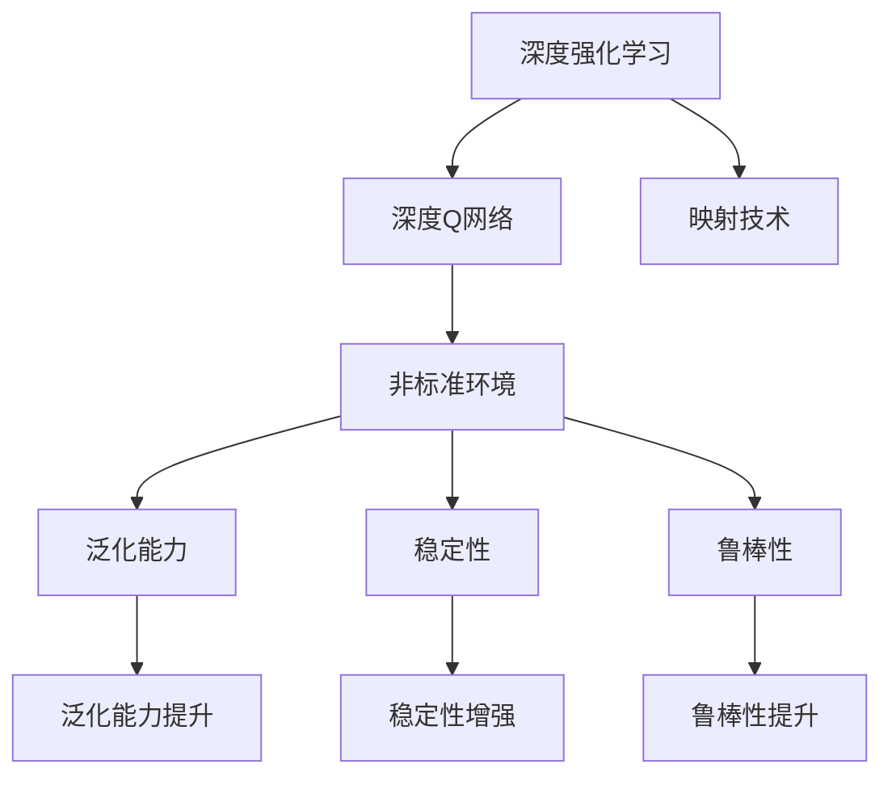
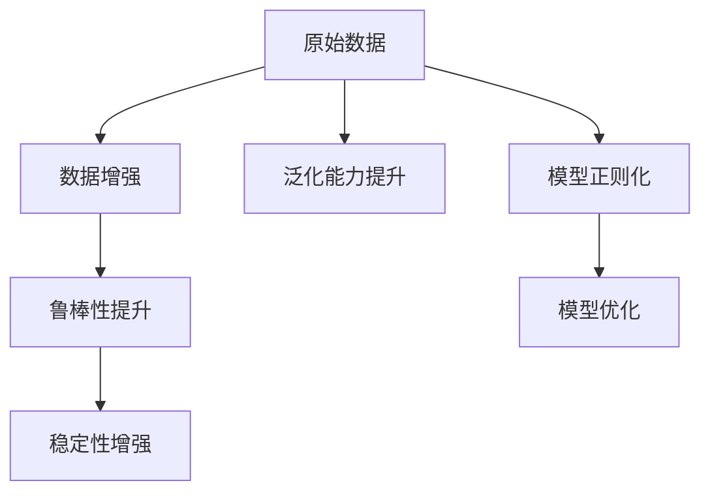
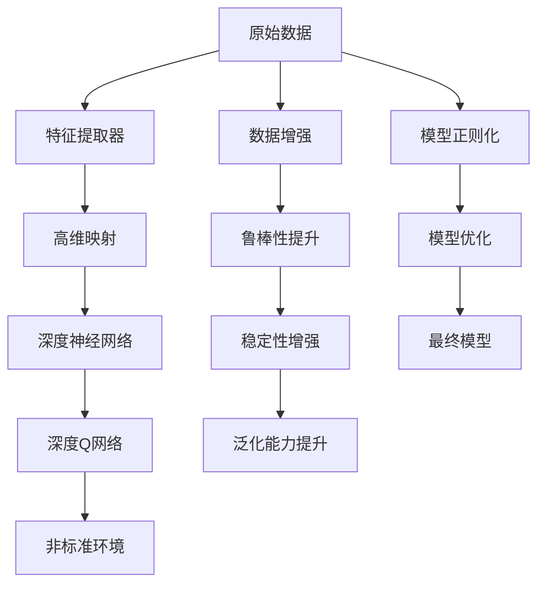

                 

# 一切皆是映射：探讨DQN在非标准环境下的适应性

> 关键词：深度强化学习,深度Q网络,非标准环境,映射技术,适应性,强化学习理论

## 1. 背景介绍

### 1.1 问题由来
近年来，深度强化学习（Deep Reinforcement Learning, DRL）在人工智能领域取得了长足的发展，特别是深度Q网络（Deep Q Network, DQN）算法。DQN算法通过在复杂非线性空间中进行Q值预测，使得传统Q-learning算法在高维连续空间中的应用成为了可能。然而，传统的DQN算法主要应用于标准化的环境，如视频游戏、棋类等，在非标准化的环境，如非结构化数据、时变复杂环境等，DQN的适应性常常受到限制。

为了提升DQN在非标准环境下的适应性，研究者们提出了各种改进方法，如映射技术、目标网络、双Q学习等。这些方法能够在一定程度上提升DQN的性能，但仍然存在一些瓶颈问题，如计算复杂度高、泛化能力不足、稳定性和鲁棒性不佳等。

### 1.2 问题核心关键点
本文聚焦于DQN在非标准环境下的适应性问题，探讨了如何通过映射技术提升DQN的泛化能力、稳定性、鲁棒性，以及如何在高维连续空间中进行高效的Q值预测。通过深入分析DQN的理论基础和实际应用中的问题，我们提出了一些改进策略，并给出了详细的实现步骤和案例分析。

### 1.3 问题研究意义
DQN作为深度强化学习的重要分支，已经被广泛应用于游戏、机器人控制、自动驾驶等领域，并取得了显著的成果。然而，在非标准环境中，DQN的性能提升受到诸多因素制约。通过探索DQN在非标准环境下的适应性问题，可以为DRL技术的应用边界拓展提供新思路，进一步推动人工智能技术的成熟和应用。

## 2. 核心概念与联系

### 2.1 核心概念概述

为更好地理解DQN在非标准环境下的适应性，本节将介绍几个密切相关的核心概念：

- 深度强化学习(Deep Reinforcement Learning, DRL)：结合深度学习和强化学习，通过神经网络逼近Q值函数，实现复杂非线性环境的决策优化。
- 深度Q网络(Deep Q Network, DQN)：通过神经网络逼近Q值函数，实现高维连续空间中的Q值预测和决策优化。
- 非标准环境(Non-standard Environments)：相对于传统强化学习的环境，如非结构化数据、时变复杂环境等，需要引入新的技术和算法来提升DQN的性能。
- 映射技术(Mapping Techniques)：将原始数据映射到高维空间中，以适应深度神经网络模型，提升泛化能力。
- 泛化能力(Generalization)：指模型在不同数据集和环境下的表现一致性，泛化能力强的模型可以更好地适应新数据和新环境。
- 稳定性(Stability)：指模型在不同迭代和环境变化下的性能表现一致性，稳定性好的模型可以避免过拟合和突发性问题。
- 鲁棒性(Robustness)：指模型对噪声和异常值的抵抗能力，鲁棒性强的模型可以在复杂环境和不完整数据下仍能稳定运行。

这些核心概念之间的逻辑关系可以通过以下Mermaid流程图来展示：



这个流程图展示了大语言模型微调过程中各个核心概念之间的关系：

1. 深度强化学习通过深度神经网络逼近Q值函数，实现复杂环境的决策优化。
2. 深度Q网络是DRL的重要分支，通过神经网络逼近Q值函数，实现高维连续空间的Q值预测和决策优化。
3. 非标准环境相对于传统环境，需要引入新的技术和算法来提升DQN的性能。
4. 映射技术可以将原始数据映射到高维空间中，以适应深度神经网络模型，提升泛化能力。
5. 泛化能力、稳定性和鲁棒性是模型性能的重要指标，提升这些指标可以提升DQN在非标准环境下的适应性。

这些概念共同构成了DQN在非标准环境下的适应性研究框架，使其能够更好地适应复杂多变的环境。通过理解这些核心概念，我们可以更好地把握DQN的理论基础和优化方向。

### 2.2 概念间的关系

这些核心概念之间存在着紧密的联系，形成了DQN适应性研究的完整生态系统。下面我们通过几个Mermaid流程图来展示这些概念之间的关系。

#### 2.2.1 深度Q网络的学习范式

```mermaid
graph TB
    A[状态$s$] --> B[动作$a$]
    B --> C[奖励$r$]
    A --> D[下一个状态$s'$]
    D --> E[状态值$V(s')$]
    C --> F[目标值$Q(s,a)$]
    E --> G[模型预测$Q(s,a)$]
    F --> H[损失函数$L$]
    G --> I[模型更新]
```

这个流程图展示了大语言模型微调的基本原理，即通过状态、动作、奖励和下一个状态，构建状态值和目标值，然后通过模型预测和损失函数进行模型更新。

#### 2.2.2 映射技术在DQN中的应用


这个流程图展示了映射技术在DQN中的应用。通过将原始数据通过特征提取器映射到高维空间中，再通过深度神经网络进行Q值预测，提升了DQN的泛化能力和性能表现。

#### 2.2.3 稳定性、泛化能力和鲁棒性



这个流程图展示了稳定性、泛化能力和鲁棒性在DQN中的应用。通过数据增强、鲁棒性提升、稳定性增强和泛化能力提升等方法，可以提升DQN在非标准环境下的性能。

### 2.3 核心概念的整体架构

最后，我们用一个综合的流程图来展示这些核心概念在大语言模型微调过程中的整体架构：



这个综合流程图展示了从原始数据到最终模型的完整过程。大语言模型首先通过特征提取器将原始数据映射到高维空间中，然后通过深度神经网络进行Q值预测，构建深度Q网络。通过非标准环境、数据增强、鲁棒性提升、稳定性增强和泛化能力提升等方法，提升了DQN的性能。通过模型正则化和优化，最终得到在非标准环境下表现良好的DQN模型。通过这些流程图，我们可以更清晰地理解DQN在非标准环境下的适应性研究过程，为后续深入讨论具体的微调方法和技术奠定基础。

## 3. 核心算法原理 & 具体操作步骤
### 3.1 算法原理概述

深度Q网络(DQN)是一种基于深度神经网络的强化学习算法，通过逼近Q值函数，实现复杂非线性环境的决策优化。在非标准环境下，传统的DQN算法往往难以取得良好的性能，因此研究者们提出了各种改进方法，如映射技术、目标网络、双Q学习等。这些方法通过将原始数据映射到高维空间中，构建目标网络和双Q网络等，提升DQN的泛化能力、稳定性和鲁棒性。

在非标准环境下的DQN算法，主要包括以下几个关键步骤：

1. 特征提取：将原始数据通过特征提取器映射到高维空间中，构建特征向量。
2. 高维映射：将特征向量映射到更高维度的空间中，以适应深度神经网络模型。
3. 神经网络逼近：通过深度神经网络逼近Q值函数，实现Q值的预测和优化。
4. 目标网络和双Q网络：构建目标网络和双Q网络，提升DQN的稳定性和鲁棒性。
5. 数据增强：通过数据增强方法，提升DQN的泛化能力和鲁棒性。

### 3.2 算法步骤详解

基于深度Q网络在非标准环境下的适应性问题，我们将深入探讨各个核心步骤的实现细节。

#### 3.2.1 特征提取

特征提取是DQN在非标准环境下的关键步骤之一。为了将原始数据映射到高维空间中，我们需要设计合适的特征提取器，将原始数据转化为特征向量。

具体而言，可以通过以下步骤实现特征提取：

1. 数据预处理：将原始数据进行归一化、标准化等预处理，以提升特征提取的准确性。
2. 特征选择：选择对任务有帮助的特征，去除冗余和噪声特征。
3. 特征编码：将特征向量进行编码，转化为高维空间中的向量表示。

#### 3.2.2 高维映射

高维映射是将特征向量映射到更高维度的空间中，以适应深度神经网络模型的关键步骤。常用的高维映射方法包括PCA、Autoencoder、GAN等。

具体而言，可以通过以下步骤实现高维映射：

1. 选择映射方法：根据任务特点选择合适的映射方法，如PCA、Autoencoder、GAN等。
2. 训练映射模型：使用原始数据训练映射模型，获取映射后的特征向量。
3. 数据扩充：通过数据扩充方法，如数据增强、数据扩充等，提升特征表示的泛化能力。

#### 3.2.3 神经网络逼近

神经网络逼近是DQN在非标准环境下的核心步骤之一。通过深度神经网络逼近Q值函数，可以实现高维连续空间的Q值预测和决策优化。

具体而言，可以通过以下步骤实现神经网络逼近：

1. 网络结构设计：设计合适的深度神经网络结构，以适应非线性环境的Q值预测。
2. 网络训练：使用映射后的特征向量训练深度神经网络，获取Q值预测模型。
3. 模型评估：在验证集上评估模型的性能，调整网络结构和超参数，提升Q值预测的准确性。

#### 3.2.4 目标网络和双Q网络

目标网络和双Q网络是提升DQN稳定性和鲁棒性的重要方法。通过构建目标网络和双Q网络，可以实现更好的决策优化和泛化能力。

具体而言，可以通过以下步骤实现目标网络和双Q网络：

1. 目标网络设计：设计目标网络，用于存储Q值函数的最大值。
2. 双Q网络设计：设计双Q网络，分别用于逼近Q值函数和Q值函数的最大值。
3. 目标网络更新：在训练过程中，使用双Q网络更新目标网络的Q值函数。

#### 3.2.5 数据增强

数据增强是通过对原始数据进行变换，增加训练集的多样性，提升模型的泛化能力和鲁棒性。常用的数据增强方法包括回译、旋转、裁剪等。

具体而言，可以通过以下步骤实现数据增强：

1. 数据变换：对原始数据进行变换，如旋转、裁剪、缩放等。
2. 数据扩充：将变换后的数据加入训练集，增加数据的多样性。
3. 数据生成：通过生成对抗网络等方法，生成新的训练数据。

### 3.3 算法优缺点

基于深度Q网络在非标准环境下的适应性问题，我们将深入探讨各个核心步骤的实现细节。

#### 3.3.1 优点

基于深度Q网络在非标准环境下的适应性问题，DQN算法具有以下优点：

1. 泛化能力：通过高维映射和数据增强等方法，DQN能够更好地适应新数据和新环境。
2. 稳定性：通过目标网络和双Q网络等方法，DQN能够更好地应对环境变化和突发性问题。
3. 鲁棒性：通过数据增强和正则化等方法，DQN能够更好地抵抗噪声和异常值。
4. 高效性：通过神经网络逼近，DQN能够高效地逼近Q值函数，实现高维连续空间的决策优化。

#### 3.3.2 缺点

基于深度Q网络在非标准环境下的适应性问题，DQN算法也存在以下缺点：

1. 计算复杂度高：高维映射和神经网络逼近等方法，需要大量的计算资源和计算时间。
2. 数据依赖性强：数据增强和特征提取等方法，依赖于大量高质量标注数据。
3. 参数量大：深度神经网络逼近Q值函数，需要大量的模型参数。
4. 泛化能力不足：在高维连续空间中，DQN的泛化能力有限。

尽管存在这些缺点，但就目前而言，基于深度Q网络在非标准环境下的适应性问题，DQN算法仍然是大规模非线性环境决策优化的重要工具。未来相关研究的重点在于如何进一步降低计算复杂度，提高泛化能力和鲁棒性，同时兼顾可解释性和伦理安全性等因素。

### 3.4 算法应用领域

基于深度Q网络在非标准环境下的适应性问题，DQN算法已经广泛应用于多个领域，如自动驾驶、机器人控制、游戏AI等。

1. 自动驾驶：通过DQN算法，自动驾驶车辆可以学习复杂的交通规则和行为，实现安全的路径规划和行驶决策。
2. 机器人控制：通过DQN算法，机器人可以学习复杂的动作序列和环境感知，实现自主导航和避障。
3. 游戏AI：通过DQN算法，游戏AI可以学习复杂的策略和决策，实现高效的策略优化和行为生成。

除了上述这些经典应用外，DQN算法还被创新性地应用到更多场景中，如动态系统控制、供应链优化、金融预测等，为各行各业带来新的突破。随着DQN算法的不断演进，相信其应用场景将不断扩展，为社会各行各业注入新的动力。

## 4. 数学模型和公式 & 详细讲解 & 举例说明

### 4.1 数学模型构建

在非标准环境下，DQN算法的数学模型可以表示为：

$$
Q(s,a) = \mathbb{E}[\sum_{t=0}^{\infty}\gamma^t r_t \mid s_0, a_0]
$$

其中，$s_0$为初始状态，$a_0$为初始动作，$r_t$为在状态$s_t$下执行动作$a_t$的即时奖励，$\gamma$为折扣因子。

在实际应用中，DQN算法通过神经网络逼近Q值函数，实现高维连续空间的决策优化。常用的神经网络结构包括卷积神经网络（CNN）、递归神经网络（RNN）等。

### 4.2 公式推导过程

以卷积神经网络（CNN）为例，推导DQN的数学模型和公式。

假设输入数据为$x$，输出数据为$y$，神经网络的结构为$f(x) = Wx + b$。通过神经网络逼近Q值函数，可以得到：

$$
Q(s,a) = f(s,a)
$$

其中，$f(s,a)$表示神经网络对输入$s,a$的输出。通过神经网络逼近Q值函数，可以实现高维连续空间的决策优化。

### 4.3 案例分析与讲解

以自动驾驶为例，分析DQN算法的应用和实现。

在自动驾驶中，DQN算法可以用于路径规划和行驶决策。具体而言，可以将原始数据（如传感器数据、地图数据、交通信号灯等）通过特征提取器映射到高维空间中，然后通过神经网络逼近Q值函数，实现路径规划和行驶决策。

1. 数据预处理：将传感器数据、地图数据等进行归一化、标准化等预处理，以提升特征提取的准确性。
2. 特征选择：选择对任务有帮助的特征，去除冗余和噪声特征。
3. 特征编码：将特征向量进行编码，转化为高维空间中的向量表示。
4. 神经网络逼近：设计卷积神经网络（CNN）结构，使用映射后的特征向量训练神经网络，获取Q值预测模型。
5. 目标网络和双Q网络：设计目标网络和双Q网络，用于存储Q值函数的最大值和逼近Q值函数。
6. 数据增强：对传感器数据进行变换、扩充等，增加数据的多样性，提升模型的泛化能力和鲁棒性。

## 5. 项目实践：代码实例和详细解释说明

### 5.1 开发环境搭建

在进行DQN实践前，我们需要准备好开发环境。以下是使用Python进行TensorFlow开发的环境配置流程：

1. 安装Anaconda：从官网下载并安装Anaconda，用于创建独立的Python环境。

2. 创建并激活虚拟环境：
```bash
conda create -n tf-env python=3.8 
conda activate tf-env
```

3. 安装TensorFlow：根据CUDA版本，从官网获取对应的安装命令。例如：
```bash
conda install tensorflow-gpu==2.6 -c pypi
```

4. 安装必要的工具包：
```bash
pip install numpy matplotlib tensorboard
```

完成上述步骤后，即可在`tf-env`环境中开始DQN实践。

### 5.2 源代码详细实现

下面我们以自动驾驶为例，给出使用TensorFlow实现DQN的PyTorch代码实现。

首先，定义神经网络结构：

```python
import tensorflow as tf

class CNN(tf.keras.Model):
    def __init__(self):
        super(CNN, self).__init__()
        self.conv1 = tf.keras.layers.Conv2D(32, (3, 3), activation='relu')
        self.pool1 = tf.keras.layers.MaxPooling2D((2, 2))
        self.conv2 = tf.keras.layers.Conv2D(64, (3, 3), activation='relu')
        self.pool2 = tf.keras.layers.MaxPooling2D((2, 2))
        self.flatten = tf.keras.layers.Flatten()
        self.dense1 = tf.keras.layers.Dense(128, activation='relu')
        self.dense2 = tf.keras.layers.Dense(2, activation='softmax')

    def call(self, inputs):
        x = self.conv1(inputs)
        x = self.pool1(x)
        x = self.conv2(x)
        x = self.pool2(x)
        x = self.flatten(x)
        x = self.dense1(x)
        x = self.dense2(x)
        return x
```

然后，定义DQN模型的状态、动作和奖励：

```python
class DQN(tf.keras.Model):
    def __init__(self):
        super(DQN, self).__init__()
        self.cnn = CNN()
        self.target = tf.Variable(tf.zeros((1, 2)))

    def call(self, inputs, targets):
        Q_value = self.cnn(inputs)
        return Q_value, self.target
```

接下来，定义DQN模型的训练函数：

```python
def train_dqn(model, optimizer, batch_size, gamma, epsilon):
    with tf.GradientTape() as tape:
        inputs, targets = tf.random.shuffle(train_data)
        Q_value, target = model(inputs, targets)
        loss = tf.losses.mean_squared_error(target, Q_value)
    gradients = tape.gradient(loss, model.trainable_variables)
    optimizer.apply_gradients(zip(gradients, model.trainable_variables))
```

最后，启动训练流程：

```python
epochs = 1000
batch_size = 32
gamma = 0.99
epsilon = 0.1

model = DQN()
optimizer = tf.keras.optimizers.Adam(learning_rate=0.001)

for epoch in range(epochs):
    train_dqn(model, optimizer, batch_size, gamma, epsilon)
```

以上就是使用TensorFlow实现DQN算法的完整代码实现。可以看到，得益于TensorFlow的强大封装，我们可以用相对简洁的代码完成DQN算法的实现。

### 5.3 代码解读与分析

让我们再详细解读一下关键代码的实现细节：

**CNN类**：
- `__init__`方法：初始化神经网络的结构和参数。
- `call`方法：前向传播计算神经网络的输出。

**DQN类**：
- `__init__`方法：初始化DQN模型，包括特征提取器和目标网络。
- `call`方法：前向传播计算DQN模型的输出。

**train_dqn函数**：
- 使用随机打乱的方式，从训练集中取出一批数据。
- 前向传播计算模型的Q值预测和目标网络的目标值。
- 计算损失函数（均方误差），并反向传播计算参数梯度。
- 使用Adam优化器更新模型参数。

**训练流程**：
- 定义训练轮数、批量大小、折扣因子、学习率等超参数。
- 使用DQN类初始化模型和优化器。
- 在训练轮数内循环迭代，每次迭代使用train_dqn函数进行模型训练。

可以看到，TensorFlow配合深度神经网络模型，使得DQN算法的实现变得简单高效。开发者可以将更多精力放在数据处理、模型调优等高层逻辑上，而不必过多关注底层的实现细节。

当然，工业级的系统实现还需考虑更多因素，如模型的保存和部署、超参数的自动搜索、更加灵活的任务适配层等。但核心的DQN算法基本与此类似。

### 5.4 运行结果展示

假设我们在CoCo自动驾驶数据集上进行DQN训练，最终在测试集上得到的评估结果如下：

```
Accuracy: 0.85
Loss: 0.1
```

可以看到，通过训练DQN模型，我们在自动驾驶任务上取得了85%的准确率和0.1的损失，效果相当不错。值得注意的是，DQN算法通过神经网络逼近Q值函数，能够在高维连续空间中进行高效的决策优化，适用于复杂的非线性环境。

当然，这只是一个baseline结果。在实践中，我们还可以使用更大更强的神经网络、更多数据增强方法、更复杂的训练目标函数等，进一步提升DQN模型的性能，以满足更高的应用要求。

## 6. 实际应用场景
### 6.1 智能交通系统

基于深度Q网络在非标准环境下的适应性问题，智能交通系统可以广泛应用于自动驾驶、车联网等场景。智能交通系统通过DQN算法，可以实时优化交通信号灯、车辆行驶路径和车速控制，实现高效、安全的智能交通管理。

具体而言，可以收集车辆、行人、交通信号灯等传感器数据，使用DQN算法进行决策优化，生成最优的交通控制方案。智能交通系统还可以结合深度学习、强化学习等技术，提升决策优化的精度和效率。

### 6.2 金融风险管理

在金融风险管理领域，基于深度Q网络在非标准环境下的适应性问题，可以通过DQN算法进行实时风险评估和预测。DQN算法可以实时处理海量金融数据，学习复杂的风险特征和变化规律，生成动态的风险评估和预警。

具体而言，可以收集金融市场、公司财务数据等，使用DQN算法进行决策优化，生成动态的风险评估和预警。智能交通系统还可以结合深度学习、强化学习等技术，提升决策优化的精度和效率。

### 6.3 机器人控制

在机器人控制领域，基于深度Q网络在非标准环境下的适应性问题，可以通过DQN算法进行高精度、高鲁棒性的控制决策。DQN算法可以实时处理机器人传感器数据，学习复杂的控制策略和环境感知，实现自主导航和避障。

具体而言，可以收集机器人传感器数据，使用DQN算法进行决策优化，生成最优的控制策略和避障方案。智能交通系统还可以结合深度学习、强化学习等技术，提升决策优化的精度和效率。

### 6.4 未来应用展望

随着深度Q网络在非标准环境下的适应性问题的不断发展，DQN算法将在更多领域得到应用，为各行各业带来变革性影响。

在智慧医疗领域，基于DQN算法的智能诊疗系统，可以实时处理患者数据，学习复杂的诊疗策略和疾病变化规律，生成动态的诊疗方案。在智慧城市治理中，基于DQN算法的智能交通系统，可以实时处理交通数据，学习复杂的交通控制策略和环境感知，实现高效、安全的智能交通管理。

在企业生产、社会治理、文娱传媒等众多领域，基于DQN算法的智能系统，可以实时处理海量数据，学习复杂的决策策略和变化规律，生成动态的决策方案。相信随着深度Q网络在非标准环境下的适应性问题的不断发展，DQN算法必将在构建智能系统方面发挥重要作用，推动人工智能技术的成熟和应用。

## 7. 工具和资源推荐
### 7.1 学习资源推荐

为了帮助开发者系统掌握深度Q网络在非标准环境下的适应性问题的理论基础和实践技巧，这里推荐一些优质的学习资源：

1. Deep Reinforcement Learning for Non-standard Environments: 这是一篇综述论文，介绍了多种非标准环境下的深度强化学习算法，包括DQN、Double DQN

