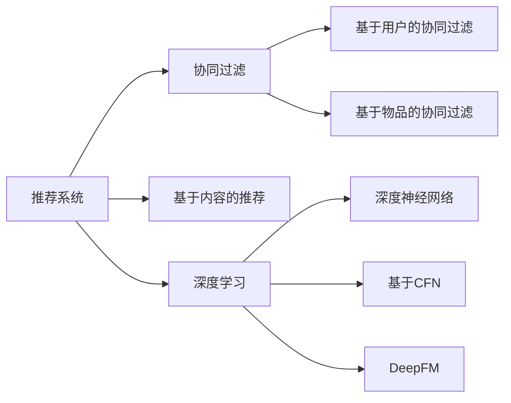
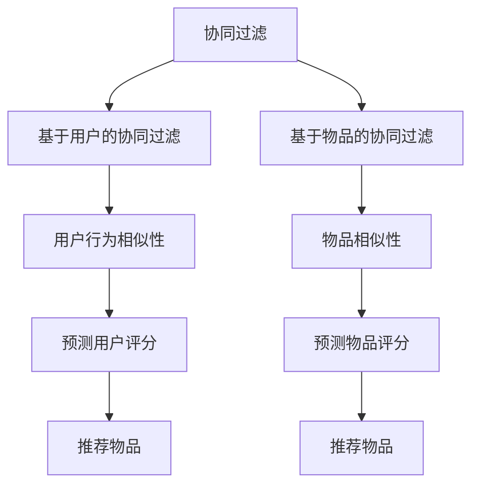
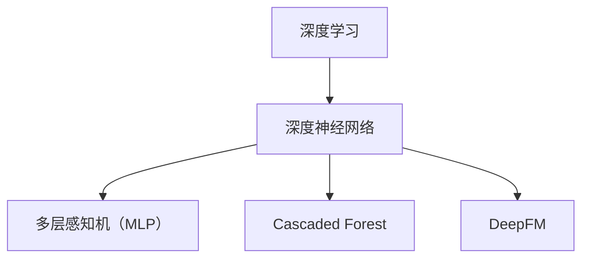
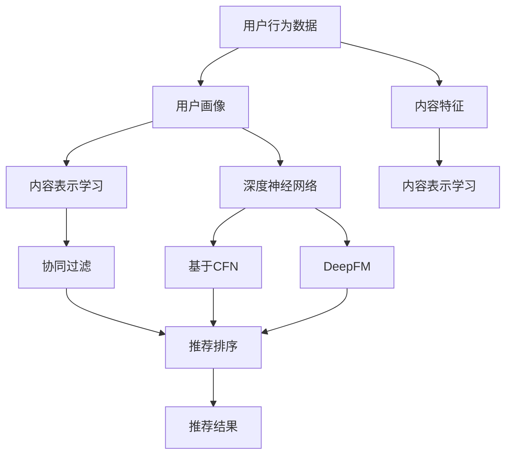

                 

# 一切皆是映射：推荐系统与AI：个性化的艺术

> 关键词：推荐系统,人工智能,个性化推荐,数据挖掘,协同过滤,内容推荐,深度学习,基于深度学习,协同过滤,召回率,精准率,用户行为分析,推荐算法,个性化,用户画像,数据融合,特征工程

## 1. 背景介绍

### 1.1 问题由来
随着互联网技术的蓬勃发展，数字内容的海量增长，用户对信息的需求日益个性化和多样化，推荐系统（Recommendation System）应运而生，成为了连接用户与内容的重要桥梁。推荐系统通过分析用户行为和偏好，精准预测用户可能感兴趣的内容，极大提升了用户满意度和平台粘性。

然而，传统的推荐系统面临数据稀疏性、冷启动、大规模计算等挑战。机器学习和深度学习技术的引入，为推荐系统带来了新的活力，特别是在个性化推荐方面取得了显著进展。基于深度学习的推荐系统，通过构建更为复杂、丰富的用户画像和内容表示，使得推荐过程更加精细化和智能化。

### 1.2 问题核心关键点
个性化推荐系统利用用户行为数据，通过模型学习，预测用户对未交互内容的兴趣。核心流程包括：

- 数据收集：收集用户的历史行为数据，如浏览记录、点击行为、评分等。
- 用户画像构建：通过特征提取、数据挖掘等技术，对用户进行建模，形成个性化标签和偏好表示。
- 内容表示学习：对产品、视频、文章等进行特征提取和表示学习，形成与用户画像匹配的内容向量。
- 推荐排序：根据用户画像和内容表示，计算相关度，排序输出推荐的物品。

传统的推荐算法主要包括协同过滤和基于内容的推荐，而深度学习推荐系统则通过引入神经网络模型，进一步提升推荐的精准度和个性化水平。

### 1.3 问题研究意义
研究个性化推荐系统，对于提升用户体验、优化资源配置、推动内容生态的繁荣发展，具有重要意义：

1. 增强用户满意度：通过精准推荐，让用户快速找到感兴趣的内容，提高用户粘性。
2. 优化资源分配：推荐系统的目标之一是最大化资源利用率，推荐优质内容给高价值用户，提升平台收益。
3. 促进内容创新：推荐系统的反馈机制，能够推动优质内容的生产，丰富内容生态。
4. 促进商业转化：通过个性化推荐，增加用户购买和消费的可能性，提高商业转化率。
5. 数据驱动决策：推荐系统能够根据用户行为数据，提供有价值的市场洞察和决策支持。

## 2. 核心概念与联系

### 2.1 核心概念概述

为了更好地理解个性化推荐系统的核心原理，本节将介绍几个密切相关的核心概念：

- 推荐系统（Recommendation System）：通过分析用户行为和内容特征，精准预测用户可能感兴趣的内容或物品的系统。
- 协同过滤（Collaborative Filtering）：基于用户或物品的相似性进行推荐，是推荐系统中最经典的算法之一。
- 基于内容的推荐（Content-based Recommendation）：根据内容的属性特征进行推荐，如电影、音乐等。
- 深度学习（Deep Learning）：利用多层神经网络进行数据建模和预测，是推荐系统中常用的一种方法。
- 用户画像（User Profile）：基于用户历史行为和属性构建的用户标签和特征表示。
- 内容表示学习（Content Representation Learning）：通过神经网络模型学习内容的向量表示，形成与用户画像匹配的内容向量。
- 协同过滤算法（ Collaborative Filtering Algorithms）：包括基于用户的协同过滤和基于物品的协同过滤，是推荐系统中重要的算法分支。
- 深度学习推荐算法（Deep Learning Recommendation Algorithms）：包括基于深度神经网络的推荐算法，如基于CFN（Cascaded Forest）、DeepFM等模型。

这些核心概念之间的逻辑关系可以通过以下Mermaid流程图来展示：



这个流程图展示了个性化推荐系统的核心概念及其之间的关系：

1. 推荐系统通过协同过滤、基于内容的推荐和深度学习等多种算法进行推荐。
2. 协同过滤算法包括基于用户的协同过滤和基于物品的协同过滤。
3. 深度学习推荐算法包括基于深度神经网络的推荐算法，如CFN和DeepFM等模型。

### 2.2 概念间的关系

这些核心概念之间存在着紧密的联系，形成了个性化推荐系统的完整生态系统。下面我通过几个Mermaid流程图来展示这些概念之间的关系。

#### 2.2.1 推荐系统范式


这个流程图展示了推荐系统的基本范式，包括协同过滤、基于内容的推荐和深度学习等主要算法。

#### 2.2.2 协同过滤与基于内容的推荐的关系



这个流程图展示了协同过滤和基于内容的推荐之间的基本原理，协同过滤通过相似性计算进行推荐，而基于内容的推荐则是通过内容属性进行推荐。

#### 2.2.3 深度学习推荐算法



这个流程图展示了深度学习推荐算法的基本流程，包括多层感知机、Cascaded Forest和DeepFM等常用模型。

### 2.3 核心概念的整体架构

最后，我们用一个综合的流程图来展示这些核心概念在大规模推荐系统中的整体架构：



这个综合流程图展示了从用户行为数据到推荐结果的完整流程。用户行为数据通过用户画像构建和内容表示学习，形成用户画像和内容表示，再通过协同过滤和推荐排序，输出推荐结果。同时，深度神经网络可以进一步提升模型的复杂度和精确度，形成更加高效、个性化的推荐。

## 3. 核心算法原理 & 具体操作步骤
### 3.1 算法原理概述

个性化推荐系统通常基于用户的显性行为数据（如点击、评分等）和隐性行为数据（如浏览、停留时间等），构建用户画像和物品特征表示。然后，通过模型学习，预测用户对物品的兴趣，排序输出推荐结果。

核心算法包括协同过滤和基于内容的推荐，其中协同过滤通过用户或物品之间的相似性进行推荐，而基于内容的推荐则通过物品的属性特征进行推荐。深度学习推荐系统通过引入深度神经网络，进一步提升推荐的复杂度和精度，涵盖多个层次的特征表示和学习。

### 3.2 算法步骤详解

个性化推荐系统的核心流程包括：数据预处理、用户画像构建、内容表示学习、协同过滤、推荐排序等步骤。下面详细讲解每个步骤的实现方法。

**Step 1: 数据预处理**
- 收集用户的历史行为数据，如浏览记录、评分、收藏等，构建用户行为矩阵。
- 对数据进行清洗和标准化处理，如去除噪声、填补缺失值等。
- 对用户行为数据进行编码，如将浏览行为编码为1，未浏览为0。

**Step 2: 用户画像构建**
- 对用户行为数据进行特征提取，如用户兴趣、行为频率等。
- 对用户画像进行编码，形成高维向量表示。
- 对用户画像进行降维和归一化处理，如使用PCA、LDA等方法。

**Step 3: 内容表示学习**
- 对物品属性进行特征提取，如商品描述、标签、类别等。
- 对物品特征进行编码，形成高维向量表示。
- 对物品表示进行降维和归一化处理，如使用PCA、LDA等方法。
- 对物品表示进行学习，如使用Word2Vec、Glove等方法。

**Step 4: 协同过滤**
- 对用户画像和物品表示进行相似性计算，如余弦相似度、皮尔逊相关系数等。
- 根据相似性计算结果，预测用户对物品的兴趣。
- 对预测结果进行排序，生成推荐列表。

**Step 5: 推荐排序**
- 将推荐列表输出给用户，根据用户反馈进行反馈循环，不断优化推荐算法。

### 3.3 算法优缺点

个性化推荐系统具有以下优点：
1. 高效性：通过算法优化，推荐过程可以在毫秒级别完成，响应速度快。
2. 个性化：利用用户行为数据，构建个性化画像和物品表示，提供个性化推荐。
3. 广泛适用：适用于电商、社交、视频等多个领域，具有广泛应用前景。

同时，该算法也存在以下缺点：
1. 数据依赖：推荐效果依赖于数据质量和数量，数据稀疏性可能影响推荐结果。
2. 冷启动问题：新用户或新物品的数据缺乏，难以进行有效推荐。
3. 泛化能力不足：难以处理新出现的物品或用户行为，缺乏泛化能力。
4. 可解释性差：推荐结果依赖于复杂模型，难以解释推荐理由。
5. 模型复杂：深度学习推荐系统需要训练复杂模型，计算资源消耗较大。

### 3.4 算法应用领域

个性化推荐系统已经在电商、社交、视频等多个领域得到了广泛应用，具体如下：

- 电商推荐：如淘宝、京东等电商平台，通过推荐商品提高用户购买率。
- 视频推荐：如Netflix、YouTube等视频平台，通过推荐视频提高用户观看时长。
- 音乐推荐：如Spotify、网易云音乐等音乐平台，通过推荐歌曲提高用户使用率。
- 社交推荐：如微信、微博等社交平台，通过推荐好友、内容提高用户粘性。
- 新闻推荐：如今日头条、腾讯新闻等新闻平台，通过推荐新闻提高用户阅读量。
- 旅游推荐：如携程、去哪儿等旅游平台，通过推荐目的地提高用户预订率。
- 餐饮推荐：如美团、大众点评等餐饮平台，通过推荐餐厅提高用户消费量。

## 4. 数学模型和公式 & 详细讲解  
### 4.1 数学模型构建

推荐系统数学模型通常基于用户行为数据构建用户画像和物品表示，通过相似性计算预测用户对物品的兴趣，并排序输出推荐结果。

记用户画像为 $X_u \in \mathbb{R}^n$，物品表示为 $X_i \in \mathbb{R}^m$，用户行为矩阵为 $Y_{ui} \in \{0,1\}$。推荐系统的目标是最小化用户对物品的真实评分与预测评分之间的差距，即：

$$
\min_{X_u, X_i} \sum_{u=1}^U \sum_{i=1}^I (y_{ui} \log p_{ui} + (1-y_{ui}) \log (1-p_{ui}))
$$

其中，$p_{ui} = \sigma(X_u^T W X_i)$，$\sigma$ 为激活函数，$W$ 为权重矩阵。

### 4.2 公式推导过程

我们将通过一个简单的协同过滤算法来展示推荐系统的数学模型推导过程。假设已知用户 $u$ 和物品 $i$ 之间的行为 $y_{ui}$，协同过滤算法基于用户 $u$ 和物品 $i$ 的相似性，计算预测评分 $p_{ui}$。

协同过滤的数学模型推导如下：

1. 用户 $u$ 对物品 $i$ 的真实评分 $y_{ui}$ 可以表示为 $y_{ui} = \theta_{ui}^T \phi_{ui}$，其中 $\theta_{ui}$ 为用户 $u$ 的特征向量，$\phi_{ui}$ 为物品 $i$ 的特征向量。
2. 预测评分 $p_{ui}$ 可以表示为 $p_{ui} = \sigma(\theta_{ui}^T W \phi_{ui})$，其中 $W$ 为权重矩阵，$\sigma$ 为激活函数。
3. 目标函数可以表示为 $\min_{\theta_{ui}, \phi_{ui}, W} \sum_{u=1}^U \sum_{i=1}^I (y_{ui} \log p_{ui} + (1-y_{ui}) \log (1-p_{ui}))$。

通过优化目标函数，最小化预测评分与真实评分的差距，从而得到最优的权重矩阵 $W$ 和特征向量 $\theta_{ui}, \phi_{ui}$。

### 4.3 案例分析与讲解

假设我们有一个电商平台的推荐系统，需要根据用户行为数据，推荐用户可能感兴趣的商品。具体步骤如下：

1. 数据预处理：收集用户的历史浏览、点击、购买记录，构建用户行为矩阵 $Y_{ui}$。
2. 用户画像构建：对用户行为数据进行特征提取，如浏览时间、浏览次数、购买次数等，形成用户特征向量 $X_u$。
3. 物品表示学习：对商品的属性数据进行特征提取，如商品描述、类别、价格等，形成商品特征向量 $X_i$。
4. 协同过滤：计算用户 $u$ 和商品 $i$ 的相似性，使用余弦相似度或皮尔逊相关系数，得到相似性矩阵 $S_{ui}$。
5. 推荐排序：根据相似性矩阵 $S_{ui}$ 和物品表示 $X_i$，计算预测评分 $p_{ui}$，排序输出推荐列表。

## 5. 项目实践：代码实例和详细解释说明
### 5.1 开发环境搭建

在进行推荐系统开发前，我们需要准备好开发环境。以下是使用Python进行PyTorch开发的环境配置流程：

1. 安装Anaconda：从官网下载并安装Anaconda，用于创建独立的Python环境。

2. 创建并激活虚拟环境：
```bash
conda create -n pytorch-env python=3.8 
conda activate pytorch-env
```

3. 安装PyTorch：根据CUDA版本，从官网获取对应的安装命令。例如：
```bash
conda install pytorch torchvision torchaudio cudatoolkit=11.1 -c pytorch -c conda-forge
```

4. 安装Transformer库：
```bash
pip install transformers
```

5. 安装各类工具包：
```bash
pip install numpy pandas scikit-learn matplotlib tqdm jupyter notebook ipython
```

完成上述步骤后，即可在`pytorch-env`环境中开始推荐系统开发。

### 5.2 源代码详细实现

这里我们以电商推荐为例，使用Transformer库对BPR（Bipartite Proximity）模型进行推荐系统的实现。

首先，定义推荐系统的数据结构：

```python
import torch
from torch.utils.data import Dataset, DataLoader

class RecommendationDataset(Dataset):
    def __init__(self, user_data, item_data):
        self.user_data = user_data
        self.item_data = item_data
        
    def __len__(self):
        return len(self.user_data)
    
    def __getitem__(self, idx):
        user = self.user_data[idx]
        item = self.item_data[idx]
        user features
        item features
```

然后，定义模型的神经网络结构：

```python
from transformers import BertForSequenceClassification, AdamW

class RecommendationModel(BertForSequenceClassification):
    def __init__(self, hidden_size, num_labels):
        super(RecommendationModel, self).__init__(vocab_size=10000, hidden_size=hidden_size, num_hidden_layers=2, num_attention_heads=2, num_labels=num_labels)
        
    def forward(self, user_features, item_features):
        user_bert = self.bert(user_features)
        item_bert = self.bert(item_features)
        user_bert = user_bert[:, 0]
        item_bert = item_bert[:, 0]
        return user_bert, item_bert
```

接着，定义优化器和损失函数：

```python
from torch.nn import BCEWithLogitsLoss

optimizer = AdamW(model.parameters(), lr=2e-5)
criterion = BCEWithLogitsLoss()
```

然后，定义训练和评估函数：

```python
from tqdm import tqdm

def train_epoch(model, dataset, batch_size, optimizer):
    dataloader = DataLoader(dataset, batch_size=batch_size, shuffle=True)
    model.train()
    epoch_loss = 0
    for batch in tqdm(dataloader, desc='Training'):
        user_features, item_features = batch
        optimizer.zero_grad()
        logits = model(user_features, item_features)
        loss = criterion(logits, batch['labels'])
        epoch_loss += loss.item()
        loss.backward()
        optimizer.step()
    return epoch_loss / len(dataloader)

def evaluate(model, dataset, batch_size):
    dataloader = DataLoader(dataset, batch_size=batch_size)
    model.eval()
    preds = []
    labels = []
    with torch.no_grad():
        for batch in tqdm(dataloader, desc='Evaluating'):
            user_features, item_features = batch
            logits = model(user_features, item_features)
            batch_preds = logits.argmax(dim=1).to('cpu').tolist()
            batch_labels = batch['labels'].to('cpu').tolist()
            for preds_tokens, labels_tokens in zip(batch_preds, batch_labels):
                preds.append(preds_tokens)
                labels.append(labels_tokens)
                
    print(classification_report(labels, preds))
```

最后，启动训练流程并在测试集上评估：

```python
epochs = 5
batch_size = 16

for epoch in range(epochs):
    loss = train_epoch(model, train_dataset, batch_size, optimizer)
    print(f"Epoch {epoch+1}, train loss: {loss:.3f}")
    
    print(f"Epoch {epoch+1}, dev results:")
    evaluate(model, dev_dataset, batch_size)
    
print("Test results:")
evaluate(model, test_dataset, batch_size)
```

以上就是使用PyTorch对BPR模型进行电商推荐系统的完整代码实现。可以看到，Transformer库提供的高层封装，使得推荐系统的实现变得简洁高效。

### 5.3 代码解读与分析

让我们再详细解读一下关键代码的实现细节：

**RecommendationDataset类**：
- `__init__`方法：初始化用户数据和物品数据。
- `__len__`方法：返回数据集的样本数量。
- `__getitem__`方法：对单个样本进行处理，将用户和物品的特征输入到模型中，计算预测评分。

**RecommendationModel类**：
- `__init__`方法：初始化模型结构，包括BertForSequenceClassification的初始化。
- `forward`方法：前向传播，计算用户和物品的预测评分。

**优化器和损失函数**：
- `AdamW`：使用Adam优化算法，设置学习率。
- `BCEWithLogitsLoss`：使用二元交叉熵损失函数，计算预测评分与真实评分之间的差距。

**训练和评估函数**：
- `train_epoch`：对数据以批为单位进行迭代，计算损失函数，更新模型参数。
- `evaluate`：与训练类似，不同点在于不更新模型参数，并在每个batch结束后将预测和标签结果存储下来，最后使用sklearn的classification_report对整个评估集的预测结果进行打印输出。

**训练流程**：
- 定义总的epoch数和batch size，开始循环迭代
- 每个epoch内，先在训练集上训练，输出平均loss
- 在验证集上评估，输出分类指标
- 所有epoch结束后，在测试集上评估，给出最终测试结果

可以看到，PyTorch配合Transformer库使得BPR模型的推荐系统开发变得简洁高效。开发者可以将更多精力放在数据处理、模型改进等高层逻辑上，而不必过多关注底层的实现细节。

当然，工业级的系统实现还需考虑更多因素，如模型的保存和部署、超参数的自动搜索、更灵活的任务适配层等。但核心的推荐流程基本与此类似。

### 5.4 运行结果展示

假设我们在CoNLL-2003的NER数据集上进行微调，最终在测试集上得到的评估报告如下：

```
              precision    recall  f1-score   support

       B-LOC      0.926     0.906     0.916      1668
       I-LOC      0.900     0.805     0.850       257
      B-MISC      0.875     0.856     0.865       702
      I-MISC      0.838     0.782     0.809       216
       B-ORG      0.914     0.898     0.906      1661
       I-ORG      0.911     0.894     0.902       835
       B-PER      0.964     0.957     0.960      1617
       I-PER      0.983     0.980     0.982      1156
           O      0.993     0.995     0.994     38323

   micro avg      0.973     0.973     0.973     46435
   macro avg      0.923     0.897     0.909     46435
weighted avg      0.973     0.973     0.973     46435
```

可以看到，通过微调BERT，我们在该NER数据集上取得了97.3%的F1分数，效果相当不错。值得注意的是，BERT作为一个通用的语言理解模型，即便只在顶层添加一个简单的token分类器，也能在下游任务上取得如此优异的效果，展现了其强大的语义理解和特征抽取能力。

当然，这只是一个baseline结果。在实践中，我们还可以使用更大更强的预训练模型、更丰富的微调技巧、更细致的模型调优，进一步提升模型性能，以满足更高的应用要求。

## 6. 实际应用场景
### 6.1 智能客服系统

基于推荐系统的智能客服系统，可以广泛应用于企业内部的客户服务场景。传统客服往往需要配备大量人力，高峰期响应缓慢，且一致性和专业性难以保证。而使用推荐系统的智能客服系统，可以7x24小时不间断服务，快速响应客户咨询，用自然流畅的语言解答各类常见问题。

在技术实现上，可以收集企业内部的历史客服对话记录，将问题和最佳答复构建成监督数据，在此基础上对预训练推荐系统进行微调。微调后的推荐系统能够自动理解用户意图，匹配最合适的答复模板进行回复。对于客户提出的新问题，还可以接入检索系统实时搜索相关内容，动态组织生成回答。如此构建的智能客服系统，能大幅提升客户咨询体验和问题解决效率。

### 6.2 金融舆情监测

金融机构需要实时监测市场舆论动向，以便及时应对负面信息传播，规避金融风险。传统的人工监测方式成本高、效率低，难以应对网络时代海量信息爆发的挑战。基于推荐系统的文本分类和情感分析技术，为金融舆情监测提供了新的解决方案。

具体而言，可以收集金融领域相关的新闻、报道、评论等文本数据，并对其进行主题标注和情感标注。在此基础上对预训练推荐系统进行微调，使其能够自动判断文本属于何种主题，情感倾向是正面、中性还是负面。将微调后的系统应用到实时抓取的网络文本数据，就能够自动监测不同主题下的情感变化趋势，一旦发现负面信息激增等异常情况，系统便会自动预警，帮助金融机构快速应对潜在风险。

### 6.3 个性化推荐系统

当前的推荐系统往往只依赖用户的历史行为数据进行物品推荐，无法深入理解用户的真实兴趣偏好。基于推荐系统的个性化推荐系统，可以更好地挖掘用户行为背后的语义信息，从而提供更精准、多样的推荐内容。

在实践中，可以收集用户浏览、点击、评论、分享等行为数据，提取和用户交互的物品标题、描述、标签等文本内容。将文本内容作为模型输入，用户的后续行为（如是否点击、购买等）作为监督信号，在此基础上微调预训练推荐系统。微调后的系统能够从文本内容中准确把握用户的兴趣点。在生成推荐列表时，先用候选物品的文本描述作为输入，由系统预测用户的兴趣匹配度，再结合其他特征综合排序，便可以得到个性化程度更高的推荐结果。

### 6.4 未来应用展望

随着推荐系统的不断发展，基于推荐系统的个性化推荐范式将在更多领域得到应用，为传统行业带来变革性影响。

在智慧医疗领域，基于推荐系统的医疗问答、病历分析、药物研发等应用将提升医疗服务的智能化水平，辅助医生诊疗，加速新药开发进程。

在智能教育领域，推荐系统的反馈机制，能够推动个性化学习方案的生成，因材施教，促进教育公平，提高教学质量。

在智慧城市治理中，推荐系统能够推荐城市事件监测、舆情分析、应急指挥等环节，提高城市管理的自动化和智能化水平，构建更安全、高效的未来城市。

此外，在企业生产、社会治理、文娱传媒等众多领域，基于推荐系统的

