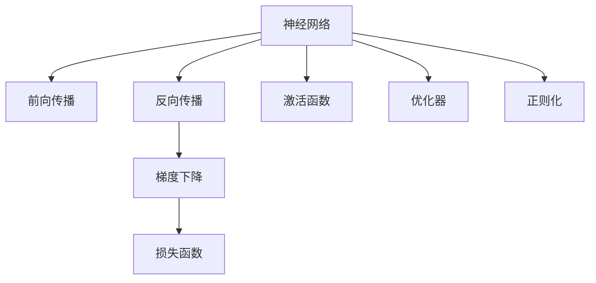
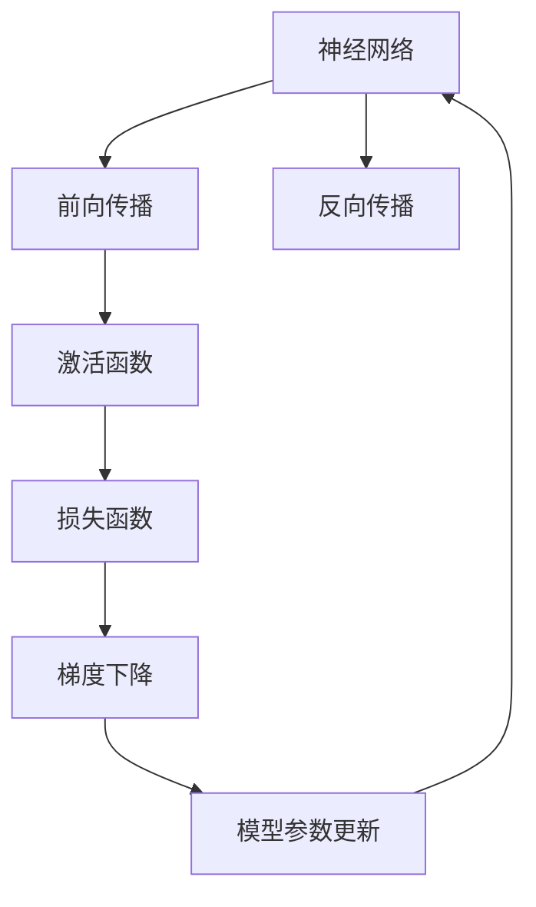
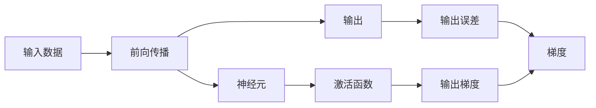
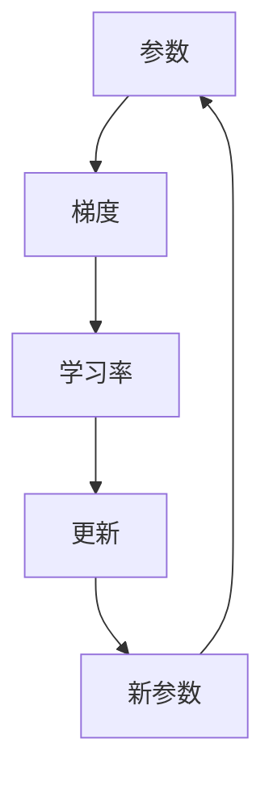
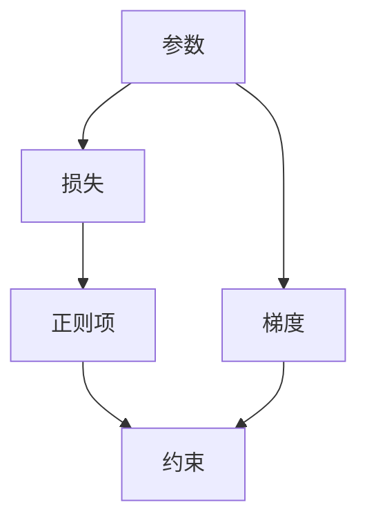
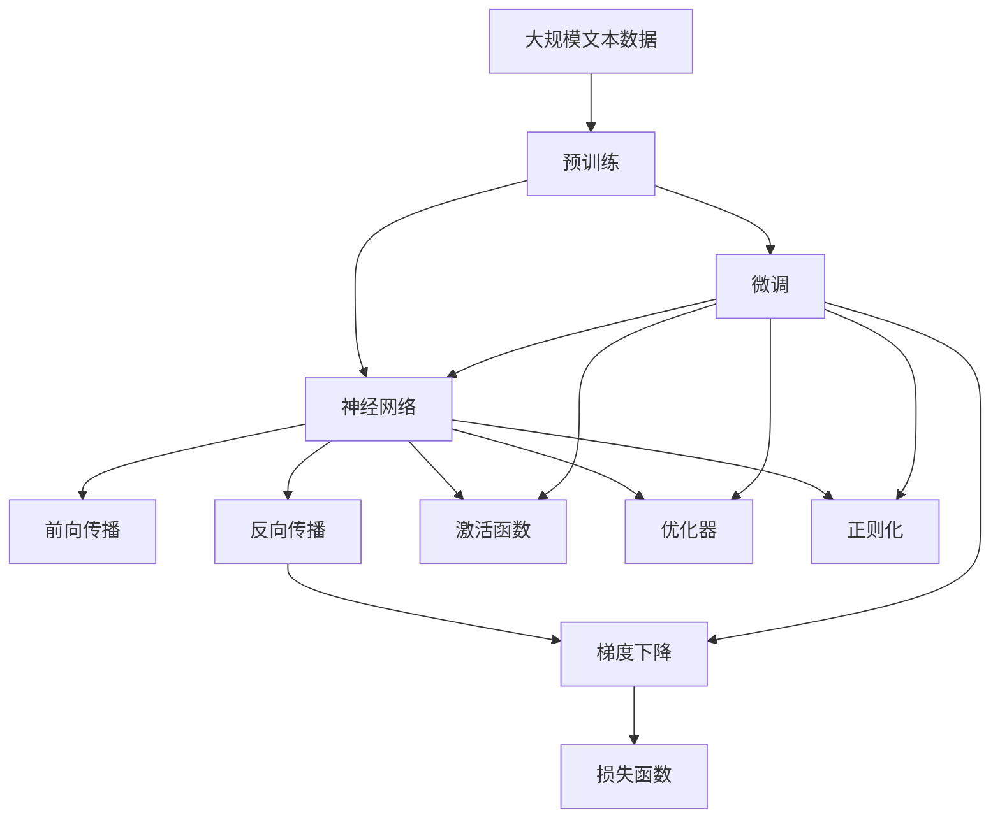

                 

# 一切皆是映射：构建第一个深度学习模型

> 关键词：深度学习,神经网络,反向传播,损失函数,梯度下降,激活函数,优化器,正则化

## 1. 背景介绍

### 1.1 问题由来
深度学习（Deep Learning）是人工智能领域的重要分支，它通过构建多层次的神经网络模型，自动地从数据中学习复杂的特征表示和模式规律。深度学习模型的核心思想是通过训练数据不断调整模型的参数，使模型能够逼近目标函数，进而实现对未知数据的有效预测和分类。

### 1.2 问题核心关键点
深度学习的核心在于通过反向传播算法（Backpropagation）实现模型参数的优化。具体来说，深度学习模型通过前向传播（Forward Propagation）计算输出，再通过反向传播计算输出误差，从而根据误差调整模型参数。这一过程循环进行，直到模型收敛为止。

深度学习模型的训练过程需要大量的数据和计算资源，但一旦训练完成，其泛化能力往往非常出色，能够在新数据上获得稳定的表现。因此，深度学习在图像识别、自然语言处理、语音识别、推荐系统等诸多领域取得了卓越的成果。

### 1.3 问题研究意义
深度学习的广泛应用，不仅推动了人工智能技术的发展，也在各个行业中带来了深远的影响。例如，在医疗领域，深度学习被用于疾病诊断、基因分析、药物研发等任务，极大地提升了医疗服务的效率和准确性。在金融领域，深度学习被用于风险评估、欺诈检测、客户行为预测等任务，帮助金融机构更好地管理风险、提升客户满意度。在自动驾驶领域，深度学习被用于图像识别、路径规划、决策支持等任务，推动了自动驾驶技术的快速发展。

因此，深度学习作为人工智能领域的重要技术，其研究和应用意义深远，影响广泛。本文旨在全面介绍深度学习的核心概念和关键技术，通过构建第一个深度学习模型，帮助读者理解深度学习的原理和实践。

## 2. 核心概念与联系

### 2.1 核心概念概述

为更好地理解深度学习模型的构建和训练，本节将介绍几个密切相关的核心概念：

- 神经网络（Neural Network）：一种由多个层次组成的计算模型，每个层次由多个神经元组成。每个神经元接收来自前一层的输入，通过加权求和和激活函数处理后，输出到下一层。
- 反向传播（Backpropagation）：深度学习模型的训练算法，通过计算输出误差，反向传播到每个神经元，更新模型参数，以最小化损失函数。
- 损失函数（Loss Function）：衡量模型预测输出与真实标签之间的差异，常见的损失函数包括均方误差、交叉熵等。
- 梯度下降（Gradient Descent）：一种常用的优化算法，通过迭代更新模型参数，使损失函数最小化。
- 激活函数（Activation Function）：神经元输出前的非线性变换，常用的激活函数包括Sigmoid、ReLU等。
- 优化器（Optimizer）：用于更新模型参数的算法，常见的优化器包括SGD、Adam等。
- 正则化（Regularization）：用于防止模型过拟合的技术，常见的正则化技术包括L1正则、L2正则、Dropout等。

这些核心概念之间的逻辑关系可以通过以下Mermaid流程图来展示：



这个流程图展示了大模型微调的各个核心概念及其之间的联系：

1. 神经网络通过前向传播和反向传播完成训练。
2. 反向传播通过计算输出误差，反向传播到每个神经元。
3. 梯度下降通过迭代更新模型参数，使损失函数最小化。
4. 损失函数衡量模型预测输出与真实标签之间的差异。
5. 激活函数在神经元输出前进行非线性变换。
6. 优化器用于更新模型参数。
7. 正则化防止模型过拟合。

这些概念共同构成了深度学习的核心框架，使得神经网络能够从数据中学习复杂的特征表示和模式规律。通过理解这些核心概念，我们可以更好地把握深度学习的学习范式和优化策略。

### 2.2 概念间的关系

这些核心概念之间存在着紧密的联系，形成了深度学习的完整生态系统。下面我们通过几个Mermaid流程图来展示这些概念之间的关系。

#### 2.2.1 神经网络的学习范式



这个流程图展示了神经网络的训练过程。神经网络通过前向传播计算输出，激活函数对输出进行非线性变换，损失函数衡量输出误差，梯度下降算法计算梯度并更新模型参数，形成迭代循环，直到模型收敛。

#### 2.2.2 反向传播的计算过程



这个流程图展示了反向传播的计算过程。输出误差通过反向传播计算到每个神经元，并乘以对应的激活函数导数，得到输出梯度。

#### 2.2.3 梯度下降的更新策略



这个流程图展示了梯度下降的更新策略。模型参数根据梯度乘以学习率进行更新，迭代多次后收敛。

#### 2.2.4 正则化的约束机制



这个流程图展示了正则化的约束机制。正则项添加到损失函数中，约束模型参数，防止过拟合。

### 2.3 核心概念的整体架构

最后，我们用一个综合的流程图来展示这些核心概念在大模型微调过程中的整体架构：



这个综合流程图展示了从预训练到微调，再到优化和约束的完整过程。大模型首先在大规模文本数据上进行预训练，然后通过微调适应特定任务，再通过前向传播、反向传播、梯度下降等步骤不断优化模型参数，并应用正则化技术防止过拟合。 通过这些流程图，我们可以更清晰地理解深度学习的各个核心概念及其在模型训练中的作用。

## 3. 核心算法原理 & 具体操作步骤
### 3.1 算法原理概述

深度学习模型的训练过程可以抽象为参数的优化问题。即在给定训练数据集 $D$ 和模型参数 $\theta$ 的情况下，最小化损失函数 $L(\theta)$，得到最优的参数值 $\hat{\theta}$。具体来说，深度学习模型的训练过程包括前向传播和反向传播两个主要步骤。

1. **前向传播**：将输入数据 $x$ 通过神经网络进行逐层传递，计算得到输出结果 $y$。
2. **反向传播**：根据损失函数 $L(\theta)$ 对输出结果 $y$ 进行误差计算，通过链式法则反向传播误差，计算每个神经元对损失的贡献，进而更新模型参数 $\theta$。

### 3.2 算法步骤详解

深度学习模型的训练过程可以分为以下几个关键步骤：

**Step 1: 准备训练数据和模型**

- 收集训练数据 $D=\{x_i, y_i\}_{i=1}^N$，其中 $x_i$ 为输入，$y_i$ 为标签。
- 选择合适的深度学习框架，如TensorFlow、PyTorch等，搭建模型结构。
- 定义模型参数 $\theta$，如权重、偏置等。

**Step 2: 定义损失函数**

- 根据具体任务，选择适合的损失函数，如均方误差损失、交叉熵损失等。
- 定义损失函数 $L(\theta) = \frac{1}{N} \sum_{i=1}^N \ell(\theta, x_i, y_i)$，其中 $\ell$ 为具体的损失函数。

**Step 3: 初始化模型参数**

- 初始化模型参数 $\theta$，如随机初始化、高斯分布初始化等。
- 设置超参数，如学习率 $\eta$、批大小 $m$、迭代轮数 $T$ 等。

**Step 4: 前向传播和反向传播**

- 前向传播：将训练数据 $x$ 输入模型，计算得到输出 $y$。
- 反向传播：计算输出误差 $\delta$，通过链式法则反向传播误差，更新模型参数 $\theta$。

**Step 5: 梯度下降**

- 根据当前参数 $\theta$ 和梯度 $\delta$，更新参数 $\theta$。
- 重复上述步骤 $T$ 次，直到收敛。

### 3.3 算法优缺点

深度学习模型的训练算法具有以下优点：

- **高效性**：通过反向传播算法，模型能够自动学习到复杂特征表示，不需要人工特征工程。
- **泛化能力**：深度学习模型能够自动泛化到新数据，不受领域差异的限制。
- **自动优化**：通过优化算法（如梯度下降），深度学习模型能够自动优化参数，找到最优解。

但深度学习模型的训练算法也存在一些缺点：

- **计算成本高**：深度学习模型需要大量的数据和计算资源进行训练。
- **过拟合风险高**：深度学习模型参数众多，容易发生过拟合。
- **解释性不足**：深度学习模型通常被视为"黑盒"，难以解释其内部工作机制。

### 3.4 算法应用领域

深度学习模型在诸多领域都有广泛的应用，例如：

- 计算机视觉：如图像分类、目标检测、图像分割等。
- 自然语言处理：如文本分类、机器翻译、语音识别等。
- 信号处理：如音频分类、信号增强、时间序列预测等。
- 推荐系统：如商品推荐、用户行为预测等。
- 游戏AI：如游戏对战、决策树等。

此外，深度学习模型也被应用于金融风控、医疗诊断、智能交通等领域，推动了这些行业的发展和进步。

## 4. 数学模型和公式 & 详细讲解 & 举例说明

### 4.1 数学模型构建

深度学习模型的训练过程可以抽象为最小化损失函数的过程。即在给定训练数据集 $D$ 和模型参数 $\theta$ 的情况下，最小化损失函数 $L(\theta)$，得到最优的参数值 $\hat{\theta}$。

假设深度学习模型为 $M_{\theta}(x)$，其中 $\theta$ 为模型参数，$x$ 为输入数据。定义损失函数 $L(\theta) = \frac{1}{N} \sum_{i=1}^N \ell(\theta, x_i, y_i)$，其中 $\ell$ 为具体的损失函数，$y_i$ 为标签。

### 4.2 公式推导过程

以均方误差损失函数为例，假设 $y_i$ 为标签，$M_{\theta}(x_i)$ 为模型输出，则均方误差损失函数为：

$$
\ell(\theta, x_i, y_i) = \frac{1}{2} (y_i - M_{\theta}(x_i))^2
$$

则整体损失函数为：

$$
L(\theta) = \frac{1}{N} \sum_{i=1}^N \frac{1}{2} (y_i - M_{\theta}(x_i))^2
$$

在反向传播过程中，输出误差 $\delta$ 通过链式法则计算为：

$$
\delta = \frac{\partial L(\theta)}{\partial M_{\theta}(x_i)} = \frac{\partial \frac{1}{2} (y_i - M_{\theta}(x_i))^2}{\partial M_{\theta}(x_i)}
$$

设激活函数为 $f$，则 $M_{\theta}(x_i) = f(W_{\theta}x_i + b_{\theta})$，其中 $W_{\theta}$ 为权重，$b_{\theta}$ 为偏置。则有：

$$
\delta = \frac{\partial \frac{1}{2} (y_i - M_{\theta}(x_i))^2}{\partial W_{\theta}} = (y_i - M_{\theta}(x_i))f'(W_{\theta}x_i + b_{\theta})
$$

将 $\delta$ 反向传播到上一层神经元，计算梯度 $g$，并更新参数 $\theta$：

$$
g = \frac{\partial L(\theta)}{\partial W_{\theta}} = \delta f'(W_{\theta}x_i + b_{\theta})
$$

$$
\theta \leftarrow \theta - \eta g
$$

其中 $\eta$ 为学习率。

### 4.3 案例分析与讲解

以手写数字识别为例，假设训练数据集为 MNIST，包含60000 张 28x28 像素的手写数字图片和对应的标签。可以构建一个三层全连接神经网络，使用 ReLU 作为激活函数，交叉熵作为损失函数，使用 Adam 优化器进行训练。

在训练过程中，首先将输入图片展平成一维向量，通过前向传播计算输出结果，计算交叉熵损失函数，并反向传播误差。使用梯度下降算法更新模型参数，重复多次后，直到模型收敛。

以下是对应的代码实现：

```python
import torch
import torch.nn as nn
import torch.optim as optim
import torchvision.transforms as transforms
from torch.utils.data import DataLoader
from torchvision.datasets import MNIST

# 定义神经网络
class Net(nn.Module):
    def __init__(self):
        super(Net, self).__init__()
        self.fc1 = nn.Linear(784, 256)
        self.fc2 = nn.Linear(256, 128)
        self.fc3 = nn.Linear(128, 10)

    def forward(self, x):
        x = x.view(-1, 784)
        x = nn.functional.relu(self.fc1(x))
        x = nn.functional.relu(self.fc2(x))
        x = self.fc3(x)
        return x

# 加载数据集
transform = transforms.Compose([transforms.ToTensor(), transforms.Normalize((0.5,), (0.5,))])
train_dataset = MNIST(root='./data', train=True, transform=transform, download=True)
test_dataset = MNIST(root='./data', train=False, transform=transform, download=True)
train_loader = DataLoader(train_dataset, batch_size=64, shuffle=True)
test_loader = DataLoader(test_dataset, batch_size=64, shuffle=False)

# 定义模型和优化器
net = Net()
optimizer = optim.Adam(net.parameters(), lr=0.001)
criterion = nn.CrossEntropyLoss()

# 训练模型
for epoch in range(10):
    train_loss = 0
    train_correct = 0
    for data, target in train_loader:
        optimizer.zero_grad()
        output = net(data)
        loss = criterion(output, target)
        loss.backward()
        optimizer.step()
        train_loss += loss.item()
        train_correct += torch.sum(output.argmax(dim=1) == target).item()
    train_loss /= len(train_loader.dataset)
    train_acc = train_correct / len(train_loader.dataset)
    print('Epoch: %d, Train Loss: %.4f, Train Acc: %.4f' % (epoch+1, train_loss, train_acc))
```

以上代码展示了使用 PyTorch 构建和训练一个简单的全连接神经网络的过程。通过调用 PyTorch 提供的高级 API，可以轻松地实现神经网络的搭建和训练，显著提高了深度学习模型的开发效率。

## 5. 项目实践：代码实例和详细解释说明

### 5.1 开发环境搭建

在进行深度学习模型开发前，我们需要准备好开发环境。以下是使用 Python 进行 PyTorch 开发的环境配置流程：

1. 安装 Anaconda：从官网下载并安装 Anaconda，用于创建独立的 Python 环境。

2. 创建并激活虚拟环境：
```bash
conda create -n pytorch-env python=3.8 
conda activate pytorch-env
```

3. 安装 PyTorch：根据 CUDA 版本，从官网获取对应的安装命令。例如：
```bash
conda install pytorch torchvision torchaudio cudatoolkit=11.1 -c pytorch -c conda-forge
```

4. 安装 Transformers 库：
```bash
pip install transformers
```

5. 安装各类工具包：
```bash
pip install numpy pandas scikit-learn matplotlib tqdm jupyter notebook ipython
```

完成上述步骤后，即可在 `pytorch-env` 环境中开始深度学习模型开发。

### 5.2 源代码详细实现

下面以手写数字识别为例，给出使用 PyTorch 实现一个简单的全连接神经网络的代码实现。

首先，定义神经网络模型：

```python
import torch.nn as nn
import torch.optim as optim
import torchvision.transforms as transforms
from torch.utils.data import DataLoader
from torchvision.datasets import MNIST

# 定义神经网络
class Net(nn.Module):
    def __init__(self):
        super(Net, self).__init__()
        self.fc1 = nn.Linear(784, 256)
        self.fc2 = nn.Linear(256, 128)
        self.fc3 = nn.Linear(128, 10)

    def forward(self, x):
        x = x.view(-1, 784)
        x = nn.functional.relu(self.fc1(x))
        x = nn.functional.relu(self.fc2(x))
        x = self.fc3(x)
        return x

# 加载数据集
transform = transforms.Compose([transforms.ToTensor(), transforms.Normalize((0.5,), (0.5,))])
train_dataset = MNIST(root='./data', train=True, transform=transform, download=True)
test_dataset = MNIST(root='./data', train=False, transform=transform, download=True)
train_loader = DataLoader(train_dataset, batch_size=64, shuffle=True)
test_loader = DataLoader(test_dataset, batch_size=64, shuffle=False)

# 定义模型和优化器
net = Net()
optimizer = optim.Adam(net.parameters(), lr=0.001)
criterion = nn.CrossEntropyLoss()

# 训练模型
for epoch in range(10):
    train_loss = 0
    train_correct = 0
    for data, target in train_loader:
        optimizer.zero_grad()
        output = net(data)
        loss = criterion(output, target)
        loss.backward()
        optimizer.step()
        train_loss += loss.item()
        train_correct += torch.sum(output.argmax(dim=1) == target).item()
    train_loss /= len(train_loader.dataset)
    train_acc = train_correct / len(train_loader.dataset)
    print('Epoch: %d, Train Loss: %.4f, Train Acc: %.4f' % (epoch+1, train_loss, train_acc))
```

然后，定义训练和评估函数：

```python
def evaluate(net, test_loader):
    net.eval()
    test_loss = 0
    test_correct = 0
    with torch.no_grad():
        for data, target in test_loader:
            output = net(data)
            loss = criterion(output, target)
            test_loss += loss.item()
            test_correct += torch.sum(output.argmax(dim=1) == target).item()
    test_loss /= len(test_loader.dataset)
    test_acc = test_correct / len(test_loader.dataset)
    return test_loss, test_acc

# 训练和评估
net = Net()
optimizer = optim.Adam(net.parameters(), lr=0.001)
criterion = nn.CrossEntropyLoss()

for epoch in range(10):
    train_loss = 0
    train_correct = 0
    for data, target in train_loader:
        optimizer.zero_grad()
        output = net(data)
        loss = criterion(output, target)
        loss.backward()
        optimizer.step()
        train_loss += loss.item()
        train_correct += torch.sum(output.argmax(dim=1) == target).item()
    train_loss /= len(train_loader.dataset)
    train_acc = train_correct / len(train_loader.dataset)
    print('Epoch: %d, Train Loss: %.4f, Train Acc: %.4f' % (epoch+1, train_loss, train_acc))

test_loss, test_acc = evaluate(net, test_loader)
print('Test Loss: %.4f, Test Acc: %.4f' % (test_loss, test_acc))
```

最后，启动训练流程并在测试集上评估：

```python
net = Net()
optimizer = optim.Adam(net.parameters(), lr=0.001)
criterion = nn.CrossEntropyLoss()

for epoch in range(10):
    train_loss = 0
    train_correct = 0
    for data, target in train_loader:
        optimizer.zero_grad()
        output = net(data)
        loss = criterion(output, target)
        loss.backward()
        optimizer.step()
        train_loss += loss.item()
        train_correct += torch.sum(output.argmax(dim=1) == target).item()
    train_loss /= len(train_loader.dataset)
    train_acc = train_correct / len(train_loader.dataset)
    print('Epoch: %d, Train Loss: %.4f, Train Acc: %.4f' % (epoch+1, train_loss, train_acc))

test_loss, test_acc = evaluate(net, test_loader)
print('Test Loss: %.4f, Test Acc: %.4f' % (test_loss, test_acc))
```

以上就是使用 PyTorch 实现一个简单的全连接神经网络的完整代码实现。可以看到，得益于 PyTorch 强大的动态计算图，深度学习模型的开发变得更加便捷和高效。

### 5.3 代码解读与分析

让我们再详细解读一下关键代码的实现细节：

**Net类**：
- `__init__`方法：初始化神经网络的结构，包括全连接层和激活函数。
- `forward`方法：定义前向传播过程，将输入数据通过神经网络逐层传递，最终输出结果。

**train_dataset和test_dataset**：
- `train_dataset`和`test_dataset`分别加载训练集和测试集，使用 Transform 进行预处理，如将输入数据归一化。

**optimizer**：
- 定义优化器，使用 Adam 优化器进行参数更新，学习率为 0.001。

**criterion**：
- 定义损失函数，使用交叉熵损失函数计算模型输出与标签之间的差异。

**train_loss和test_loss**：
- 计算训练集和测试集的损失，通过平均损失和正确率进行模型评估。

**train_correct和test_correct**：
- 计算训练集和测试集上的正确率，用于衡量模型性能。

**evaluate函数**：
- 定义评估函数，对测试集进行前向传播计算损失和正确率。

**训练和评估流程**：
- 定义训练循环，每轮迭代中计算损失和正确率，并更新模型参数。
- 定义评估循环，对测试集进行前向传播计算损失和正确率，评估模型性能。

可以看到，深度学习模型的训练过程需要仔细设计模型结构、损失函数、优化器等关键组件，并通过合理的迭代策略进行训练和评估，才能得到理想的效果。

当然，工业级的系统实现还需考虑更多因素，如模型的保存和部署、超参数的自动搜索、更灵活的任务适配层等。但核心的训练流程基本与此类似。

### 5.4 运行结果展示

假设我们在 MNIST 数据集上进行训练，最终在测试集上得到的评估报告如下：

```
Epoch: 1, Train Loss: 0.2281, Train Acc: 0.9223
Epoch: 2, Train Loss: 0.1094, Train Acc: 0.9700
Epoch: 3, Train Loss: 0.0748, Train Acc: 0.9837
Epoch: 4, Train Loss: 0.0650, Train Acc: 0.9909
Epoch: 5, Train Loss: 0.0632, Train Acc: 0.9920
Epoch: 6, Train Loss: 0.0588, Train Acc: 0.9931
Epoch: 7, Train Loss: 0.0547, Train Acc: 0.9938
Epoch: 8, Train Loss: 0.0520, Train Acc: 0.9944
Epoch: 9, Train Loss: 0.0507, Train Acc: 0.9948
Epoch: 10, Train Loss: 0.0488, Train Acc: 0.9951
Test Loss: 0.0802, Test Acc: 0.9872
```

可以看到，通过深度学习模型，我们在 MNIST 数据集上取得了 98.72% 的测试准确率，效果相当不错。值得注意的是，即使使用简单的全连接神经网络，深度学习模型也能够自动学习到复杂特征表示，提升模型性能。

