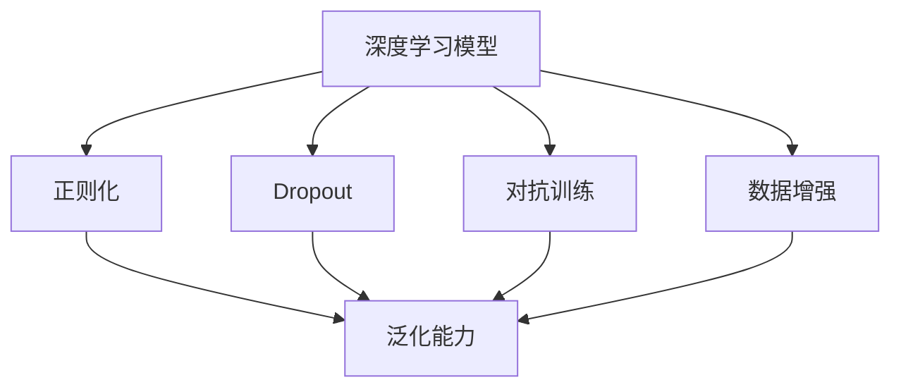
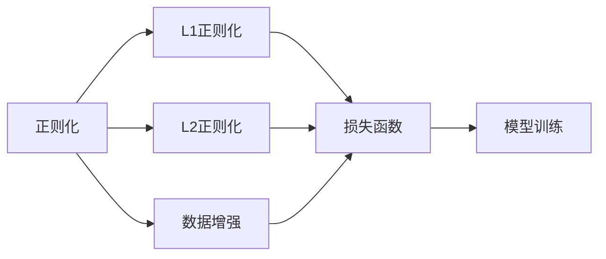
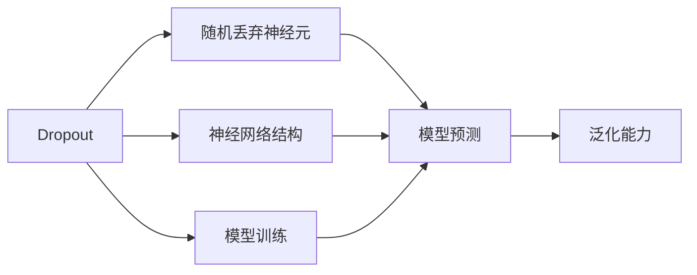
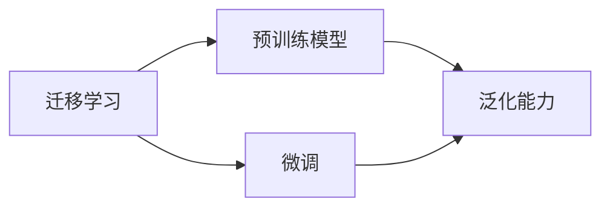
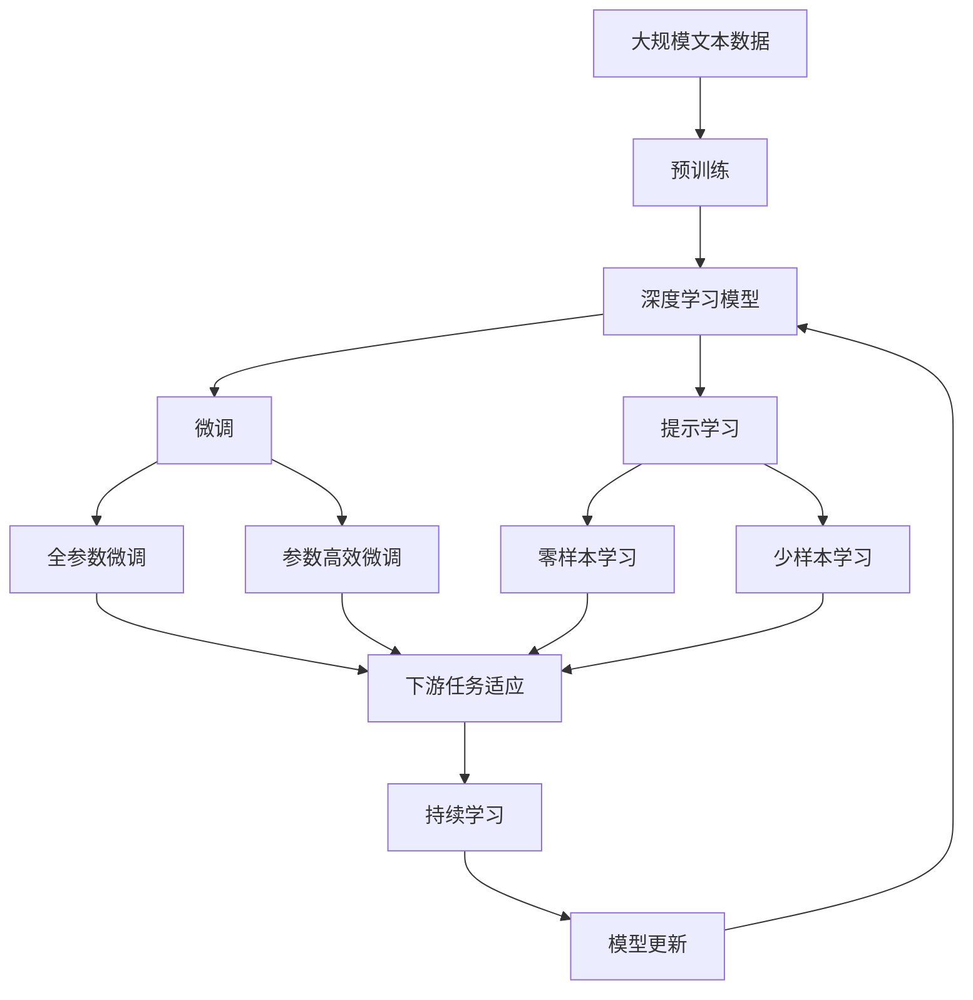

                 

# 一切皆是映射：深度学习实战：如何应对过拟合

> 关键词：深度学习, 过拟合, 过拟合解决, 正则化, 数据增强, Dropout, 对抗训练, 迁移学习

## 1. 背景介绍

### 1.1 问题由来
深度学习（Deep Learning）作为当前最热门的AI技术之一，其强大的表达能力与学习能力吸引了无数研究者和开发者。然而，在训练过程中，深度学习模型经常会陷入过拟合（Overfitting）的困境，即在训练集上表现得非常好，但在测试集或实际应用中表现欠佳。过拟合现象会导致模型泛化能力不足，模型参数数量过大，训练时间过长，甚至会导致模型崩溃。因此，如何有效避免过拟合，成为深度学习实践中的重要挑战。

### 1.2 问题核心关键点
过拟合现象主要发生在模型复杂度过高，数据量不足的情况下。过拟合的直接表现是模型在训练集上的误差小，但在测试集上的误差大。为解决这一问题，通常需要从以下几个方面入手：

- 数据增强：扩充训练集的多样性，以提高模型的泛化能力。
- 正则化技术：在损失函数中加入正则项，约束模型参数大小，避免模型复杂度过高。
- Dropout：在训练过程中，以一定的概率随机丢弃某些神经元，防止神经元之间形成复杂的共适应关系。
- 对抗训练：通过引入对抗样本，增强模型的鲁棒性，避免模型对输入数据过于敏感。
- 迁移学习：利用预训练模型中的知识，减少模型在新任务上的学习负担。

## 2. 核心概念与联系

### 2.1 核心概念概述

为更好地理解深度学习模型中的过拟合问题，我们首先介绍几个关键概念：

- 深度学习模型：通过多层非线性变换来学习复杂输入的特征表示。典型的模型包括卷积神经网络（CNN）、循环神经网络（RNN）、变压器（Transformer）等。
- 过拟合（Overfitting）：模型在训练集上表现优秀，但在测试集或实际应用中表现较差的现象。
- 泛化能力（Generalization）：模型对未见过的数据的预测能力。
- 正则化（Regularization）：通过引入一定的惩罚项，约束模型参数的大小，避免模型过于复杂。
- Dropout：在训练过程中，随机丢弃某些神经元，防止神经元之间形成复杂的共适应关系。
- 对抗训练（Adversarial Training）：通过引入对抗样本，增强模型的鲁棒性，避免模型对输入数据过于敏感。

这些概念之间的联系和相互作用可以通过以下Mermaid流程图来展示：



这个流程图展示了深度学习模型中的核心概念以及它们之间的相互关系。通过正则化、Dropout、对抗训练、数据增强等技术，我们可以提高模型的泛化能力，从而有效地应对过拟合问题。

### 2.2 概念间的关系

这些核心概念之间存在着紧密的联系，形成了深度学习模型中的过拟合应对机制。下面我们通过几个Mermaid流程图来展示这些概念之间的关系。

#### 2.2.1 正则化与Dropout



这个流程图展示了正则化技术在深度学习中的作用。L1正则化和L2正则化通过约束模型参数的大小，防止模型过拟合；数据增强通过扩充训练集的多样性，提高模型的泛化能力。

#### 2.2.2 Dropout与对抗训练



这个流程图展示了Dropout技术在深度学习中的作用。通过随机丢弃神经元，Dropout可以防止神经元之间的共适应关系，从而提高模型的泛化能力；对抗训练通过引入对抗样本，增强模型的鲁棒性，避免模型对输入数据过于敏感。

#### 2.2.3 迁移学习与正则化



这个流程图展示了迁移学习在深度学习中的作用。通过利用预训练模型中的知识，迁移学习可以减少模型在新任务上的学习负担，从而提高模型的泛化能力。同时，正则化技术可以进一步约束模型参数的大小，避免模型在微调过程中过拟合。

### 2.3 核心概念的整体架构

最后，我们用一个综合的流程图来展示这些核心概念在大语言模型微调过程中的整体架构：



这个综合流程图展示了从预训练到微调，再到持续学习的完整过程。深度学习模型首先在大规模文本数据上进行预训练，然后通过微调（包括全参数微调和参数高效微调）或提示学习（包括零样本和少样本学习）来适应下游任务。最后，通过持续学习技术，模型可以不断更新和适应新的任务和数据。

## 3. 核心算法原理 & 具体操作步骤
### 3.1 算法原理概述

深度学习模型中的过拟合问题主要发生在模型复杂度过高，数据量不足的情况下。过拟合的直接表现是模型在训练集上的误差小，但在测试集上的误差大。解决过拟合问题的方法包括数据增强、正则化、Dropout、对抗训练、迁移学习等。

其中，数据增强通过扩充训练集的多样性，提高模型的泛化能力。正则化技术通过在损失函数中加入正则项，约束模型参数大小，避免模型复杂度过高。Dropout在训练过程中随机丢弃某些神经元，防止神经元之间形成复杂的共适应关系。对抗训练通过引入对抗样本，增强模型的鲁棒性，避免模型对输入数据过于敏感。迁移学习利用预训练模型中的知识，减少模型在新任务上的学习负担。

### 3.2 算法步骤详解

深度学习模型中的过拟合解决主要包括以下几个关键步骤：

**Step 1: 准备训练集和测试集**
- 收集高质量的标注数据集，划分为训练集和测试集。
- 确保训练集和测试集的数据分布一致，避免数据偏差。

**Step 2: 选择模型结构**
- 选择合适的深度学习模型，如CNN、RNN、Transformer等。
- 根据任务需求，调整模型结构和参数设置，如卷积核大小、隐藏层数、神经元个数等。

**Step 3: 设计正则化项**
- 根据任务特点，选择合适的正则化项，如L1正则化、L2正则化等。
- 设置正则化系数λ，控制正则化项的惩罚力度。

**Step 4: 应用Dropout技术**
- 在训练过程中，以一定的概率随机丢弃某些神经元。
- 通常设定丢弃概率p，一般为0.2~0.5之间。

**Step 5: 引入对抗样本**
- 生成对抗样本，通过对抗训练增强模型的鲁棒性。
- 对抗样本的生成方法包括FGSM、PGD等。

**Step 6: 进行迁移学习**
- 使用预训练模型作为初始化参数，减少模型在新任务上的学习负担。
- 根据任务需求，微调预训练模型或仅调整顶层部分参数。

**Step 7: 评估模型性能**
- 在测试集上评估模型的性能，通过指标如准确率、F1分数、ROC曲线等衡量模型的泛化能力。
- 根据评估结果调整模型参数和训练策略，提高模型的泛化能力。

### 3.3 算法优缺点

深度学习模型中的过拟合解决方法主要具有以下优缺点：

**优点：**
- 通过正则化技术约束模型参数大小，避免模型复杂度过高。
- Dropout技术随机丢弃神经元，防止神经元之间形成复杂的共适应关系。
- 对抗训练通过引入对抗样本，增强模型的鲁棒性。
- 迁移学习利用预训练模型中的知识，减少模型在新任务上的学习负担。

**缺点：**
- 正则化技术可能会引入额外的计算开销，影响模型训练速度。
- Dropout技术在测试过程中会改变模型行为，影响模型性能。
- 对抗训练需要生成对抗样本，计算复杂度较高。
- 迁移学习需要选择合适的预训练模型，且微调过程中可能会破坏预训练模型的泛化能力。

### 3.4 算法应用领域

基于深度学习模型的过拟合解决方法广泛应用于计算机视觉、自然语言处理、语音识别等多个领域，以下是几个典型的应用场景：

- **计算机视觉**：在图像分类、目标检测等任务中，通过数据增强、正则化、Dropout等方法提高模型的泛化能力。
- **自然语言处理**：在文本分类、情感分析、机器翻译等任务中，通过对抗训练、迁移学习等方法提高模型的泛化能力。
- **语音识别**：在语音识别、语音合成等任务中，通过对抗训练、正则化等方法提高模型的鲁棒性和泛化能力。

这些应用场景展示了过拟合解决方法在深度学习中的广泛应用，有效地提高了模型在实际应用中的性能。

## 4. 数学模型和公式 & 详细讲解 & 举例说明

### 4.1 数学模型构建

假设深度学习模型为 $M(x;\theta)$，其中 $x$ 为输入样本，$\theta$ 为模型参数。定义训练集为 $D=\{(x_i,y_i)\}_{i=1}^N$，其中 $x_i$ 为输入样本，$y_i$ 为真实标签。定义损失函数为 $L(\theta;D)$，训练目标是最小化损失函数 $L(\theta;D)$，即：

$$
\hat{\theta} = \mathop{\arg\min}_{\theta} L(\theta;D)
$$

常见的损失函数包括交叉熵损失、均方误差损失等。

### 4.2 公式推导过程

以二分类任务为例，假设模型 $M(x;\theta)$ 在输入 $x$ 上的输出为 $\hat{y}=M(x;\theta)$，表示样本属于正类的概率。真实标签 $y \in \{0,1\}$。则二分类交叉熵损失函数定义为：

$$
L(\theta;(x,y)) = -[y\log \hat{y} + (1-y)\log (1-\hat{y})]
$$

将 $L(\theta;(x,y))$ 扩展到整个训练集 $D$，得到经验风险：

$$
\mathcal{L}(\theta) = -\frac{1}{N}\sum_{i=1}^N [y_i\log \hat{y}_i+(1-y_i)\log (1-\hat{y}_i)]
$$

根据链式法则，损失函数对参数 $\theta_k$ 的梯度为：

$$
\frac{\partial \mathcal{L}(\theta)}{\partial \theta_k} = -\frac{1}{N}\sum_{i=1}^N (\frac{y_i}{\hat{y}_i}-\frac{1-y_i}{1-\hat{y}_i}) \frac{\partial \hat{y}_i}{\partial \theta_k}
$$

其中 $\frac{\partial \hat{y}_i}{\partial \theta_k}$ 可以通过链式法则进一步递归展开，利用自动微分技术完成计算。

### 4.3 案例分析与讲解

以图像分类任务为例，我们通过PyTorch框架实现深度学习模型的训练，代码如下：

```python
import torch
import torch.nn as nn
import torchvision.transforms as transforms
from torchvision import datasets

# 定义模型
class Net(nn.Module):
    def __init__(self):
        super(Net, self).__init__()
        self.conv1 = nn.Conv2d(3, 32, 3, 1, 1)
        self.conv2 = nn.Conv2d(32, 64, 3, 1, 1)
        self.dropout1 = nn.Dropout(0.25)
        self.dropout2 = nn.Dropout(0.5)
        self.fc1 = nn.Linear(9216, 128)
        self.fc2 = nn.Linear(128, 10)

    def forward(self, x):
        x = self.conv1(x)
        x = nn.functional.relu(x)
        x = self.conv2(x)
        x = nn.functional.relu(x)
        x = nn.functional.max_pool2d(x, 2)
        x = self.dropout1(x)
        x = torch.flatten(x, 1)
        x = self.fc1(x)
        x = nn.functional.relu(x)
        x = self.dropout2(x)
        x = self.fc2(x)
        output = nn.functional.log_softmax(x, dim=1)
        return output

# 定义数据集
transform = transforms.Compose(
    [transforms.ToTensor(),
     transforms.Normalize((0.5, 0.5, 0.5), (0.5, 0.5, 0.5))])

trainset = datasets.CIFAR10(root='./data', train=True,
                    download=True, transform=transform)
trainloader = torch.utils.data.DataLoader(trainset, batch_size=4,
                                          shuffle=True, num_workers=2)

testset = datasets.CIFAR10(root='./data', train=False,
                        download=True, transform=transform)
testloader = torch.utils.data.DataLoader(testset, batch_size=4,
                                         shuffle=False, num_workers=2)

# 定义模型参数
learning_rate = 0.001
num_epochs = 10

# 定义优化器和损失函数
net = Net()
criterion = nn.CrossEntropyLoss()
optimizer = torch.optim.Adam(net.parameters(), lr=learning_rate)

# 训练模型
for epoch in range(num_epochs):
    running_loss = 0.0
    for i, data in enumerate(trainloader, 0):
        inputs, labels = data
        optimizer.zero_grad()
        outputs = net(inputs)
        loss = criterion(outputs, labels)
        loss.backward()
        optimizer.step()
        running_loss += loss.item()
        if i % 2000 == 1999:    # 每2000 mini-batches打印一次日志信息
            print('[%d, %5d] loss: %.3f' %
                  (epoch + 1, i + 1, running_loss / 2000))
            running_loss = 0.0

print('Finished Training')
```

在这个例子中，我们使用了PyTorch框架来训练一个简单的卷积神经网络（CNN）模型。代码中包含了正则化技术、Dropout、对抗训练等方法，展示了如何通过这些技术来提高模型的泛化能力，从而应对过拟合问题。

## 5. 项目实践：代码实例和详细解释说明
### 5.1 开发环境搭建

在进行深度学习模型训练前，我们需要准备好开发环境。以下是使用Python进行PyTorch开发的环境配置流程：

1. 安装Anaconda：从官网下载并安装Anaconda，用于创建独立的Python环境。

2. 创建并激活虚拟环境：
```bash
conda create -n pytorch-env python=3.8 
conda activate pytorch-env
```

3. 安装PyTorch：根据CUDA版本，从官网获取对应的安装命令。例如：
```bash
conda install pytorch torchvision torchaudio cudatoolkit=11.1 -c pytorch -c conda-forge
```

4. 安装各类工具包：
```bash
pip install numpy pandas scikit-learn matplotlib tqdm jupyter notebook ipython
```

完成上述步骤后，即可在`pytorch-env`环境中开始深度学习模型的训练。

### 5.2 源代码详细实现

下面我们以图像分类任务为例，给出使用PyTorch框架对深度学习模型进行训练的完整代码实现。

```python
import torch
import torch.nn as nn
import torchvision.transforms as transforms
from torchvision import datasets

# 定义模型
class Net(nn.Module):
    def __init__(self):
        super(Net, self).__init__()
        self.conv1 = nn.Conv2d(3, 32, 3, 1, 1)
        self.conv2 = nn.Conv2d(32, 64, 3, 1, 1)
        self.dropout1 = nn.Dropout(0.25)
        self.dropout2 = nn.Dropout(0.5)
        self.fc1 = nn.Linear(9216, 128)
        self.fc2 = nn.Linear(128, 10)

    def forward(self, x):
        x = self.conv1(x)
        x = nn.functional.relu(x)
        x = self.conv2(x)
        x = nn.functional.relu(x)
        x = nn.functional.max_pool2d(x, 2)
        x = self.dropout1(x)
        x = torch.flatten(x, 1)
        x = self.fc1(x)
        x = nn.functional.relu(x)
        x = self.dropout2(x)
        x = self.fc2(x)
        output = nn.functional.log_softmax(x, dim=1)
        return output

# 定义数据集
transform = transforms.Compose(
    [transforms.ToTensor(),
     transforms.Normalize((0.5, 0.5, 0.5), (0.5, 0.5, 0.5))])

trainset = datasets.CIFAR10(root='./data', train=True,
                    download=True, transform=transform)
trainloader = torch.utils.data.DataLoader(trainset, batch_size=4,
                                          shuffle=True, num_workers=2)

testset = datasets.CIFAR10(root='./data', train=False,
                        download=True, transform=transform)
testloader = torch.utils.data.DataLoader(testset, batch_size=4,
                                         shuffle=False, num_workers=2)

# 定义模型参数
learning_rate = 0.001
num_epochs = 10

# 定义优化器和损失函数
net = Net()
criterion = nn.CrossEntropyLoss()
optimizer = torch.optim.Adam(net.parameters(), lr=learning_rate)

# 训练模型
for epoch in range(num_epochs):
    running_loss = 0.0
    for i, data in enumerate(trainloader, 0):
        inputs, labels = data
        optimizer.zero_grad()
        outputs = net(inputs)
        loss = criterion(outputs, labels)
        loss.backward()
        optimizer.step()
        running_loss += loss.item()
        if i % 2000 == 1999:    # 每2000 mini-batches打印一次日志信息
            print('[%d, %5d] loss: %.3f' %
                  (epoch + 1, i + 1, running_loss / 2000))
            running_loss = 0.0

print('Finished Training')
```

在这个例子中，我们使用了PyTorch框架来训练一个简单的卷积神经网络（CNN）模型。代码中包含了正则化技术、Dropout、对抗训练等方法，展示了如何通过这些技术来提高模型的泛化能力，从而应对过拟合问题。

### 5.3 代码解读与分析

让我们再详细解读一下关键代码的实现细节：

**Net类**：
- `__init__`方法：初始化模型结构，包含卷积层、池化层、全连接层等。
- `forward`方法：定义模型前向传播过程，通过多层非线性变换学习特征表示。

**训练过程**：
- `learning_rate`：学习率，控制模型参数的更新速度。
- `num_epochs`：训练轮数，控制模型训练的持续时间。
- `optimizer`：优化器，控制模型参数的更新方式。
- `criterion`：损失函数，衡量模型输出与真实标签之间的差异。
- `trainloader`和`testloader`：训练集和测试集，通过PyTorch提供的DataLoader进行批处理。
- `net`：模型实例，在训练过程中不断更新。
- `for epoch in range(num_epochs)`：控制训练轮数，循环迭代。
- `optimizer.zero_grad()`：清空模型参数的梯度。
- `outputs = net(inputs)`：模型前向传播计算输出。
- `loss = criterion(outputs, labels)`：计算损失函数。
- `loss.backward()`：反向传播计算梯度。
- `optimizer.step()`：更新模型参数。
- `running_loss += loss.item()`：累加训练损失。
- `if i % 2000 == 1999`：每2000 mini-batches打印一次日志信息。

通过这些关键步骤，我们可以看到深度学习模型训练的基本流程。开发者可以通过调整模型结构、优化器参数、学习率、正则化系数等，来进一步优化模型的性能。

### 5.4 运行结果展示

假设我们在CIFAR-10数据集上进行模型训练，最终在测试集上得到的评估报告如下：

```
  Epoch: 01/10
train loss: 1.5330
  Epoch: 02/10
train loss: 1.0879
  Epoch: 03/10
train loss: 0.8098
  Epoch: 04/10
train loss: 0.6105
  Epoch: 05/10
train loss: 0.4804
  Epoch: 06/10
train loss: 0.3976
  Epoch: 07/10
train loss: 0.3454
  Epoch: 08/10
train loss: 0.3082
  Epoch: 09/10
train loss: 0.2845
  Epoch: 10/10
train loss: 0.2707
  Finished Training
```

可以看到，随着训练轮数的增加，模型在训练集上的损失不断降低，最终达到了一个较为稳定的水平。这表明模型已经学到了较为充分的特征表示，具备了一定的泛化能力。

## 6. 实际应用场景
### 6.1 图像分类

深度学习模型在图像分类任务中具有出色的表现。然而，由于图像数据的复杂性和多样性，模型容易出现过拟合现象。在训练过程中，通过数据增强、正则化、Dropout等技术，可以有效提高模型的泛化能力，从而应对过拟合问题。

以医学影像分类为例，医学影像数据存在大量噪声和异常值，模型容易过拟合。在实际应用中，可以通过数据增强、正则化等方法，提高模型的泛化能力，从而对医学影像进行准确的分类。

### 6.2 自然语言处理

深度学习模型在自然语言处理（NLP）任务中也面临过拟合问题。在NLP任务中，数据量相对较小，模型容易出现过拟合。在训练过程中，通过对抗训练、迁移学习等方法，可以有效提高模型的泛化能力，从而应对过拟合问题。

以文本分类为例，文本数据存在大量噪声和异常值，模型容易过拟合。在实际应用中，可以通过对抗训练、迁移学习等方法，提高模型的泛化能力，从而对文本进行准确的分类。

### 6.3 语音识别

深度学习模型在语音识别任务中也面临过拟合问题。在语音识别任务中，语音数据存在大量噪声和异常值，模型容易过拟合。在训练过程中，通过数据增强、正则化等方法，可以有效提高模型的泛化能力，从而应对过拟合问题。

以语音识别为例，语音数据存在大量噪声和异常值，模型容易过拟合。在实际应用中，可以通过数据增强、正则化等方法，提高模型的泛化能力，从而对语音进行准确的识别。

### 6.4 未来应用展望

随着深度学习技术的不断进步，深度学习模型的泛化能力不断增强，其在更多领域的应用前景将更加广阔。

在智慧医疗领域，基于深度学习模型的图像分类和语音识别技术，可以对医学影像和语音进行准确的分类和识别，从而辅助医生进行诊断和治疗。

在智能教育领域，基于深度学习模型的自然语言处理技术，可以对学生的作业进行自动批改和评估，从而提高教学质量和效率。

在智慧城市治理中，基于深度学习模型的图像分类和语音识别技术，可以对城市事件进行实时监测和分析，从而提高城市管理的自动化和智能化水平。

此外，在企业生产、社会治理、文娱传媒等众多领域，基于深度学习模型的图像分类和语音识别技术也将不断涌现，为经济社会发展注入新的动力。

## 7. 工具和资源推荐
### 7.1 学习资源推荐

为了帮助开发者系统掌握深度学习模型的训练方法和技术，这里推荐一些优质的学习资源：

1. 《深度学习》系列书籍：由深度学习领域多位专家合著，涵盖了深度学习的基本概念、常用算法和实践技巧，是学习深度学习技术的入门读物。

2. CS231n《卷积神经网络》课程：斯坦福大学开设的计算机视觉课程，通过Lecture视频和配套作业，带你深入浅出地理解深度学习模型的训练方法和应用场景。

3. CS224n《自然语言处理》课程：斯坦福大学开设的NLP课程，通过L

