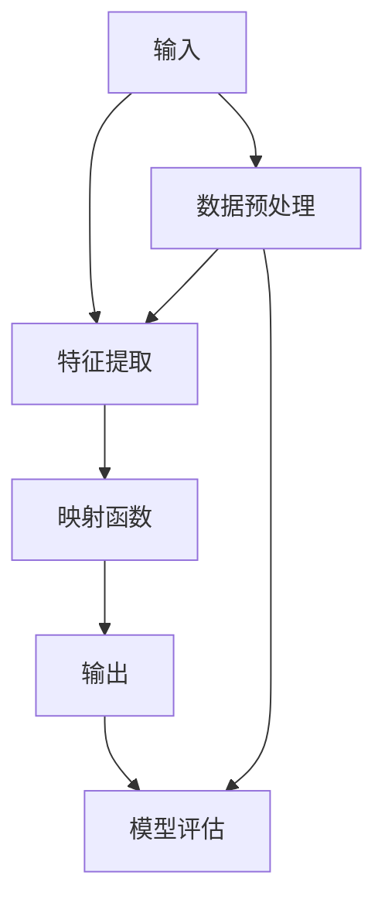
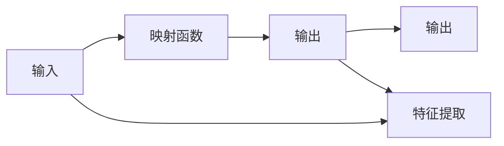
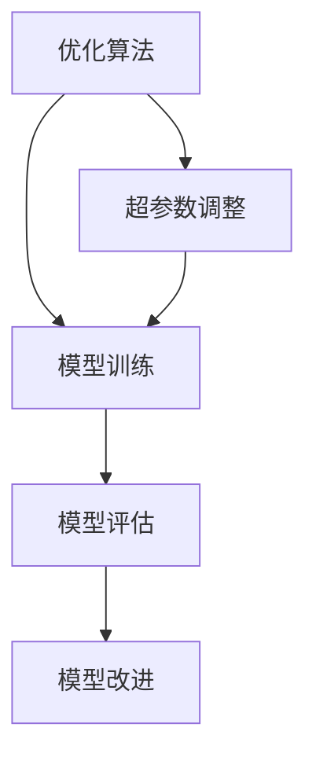
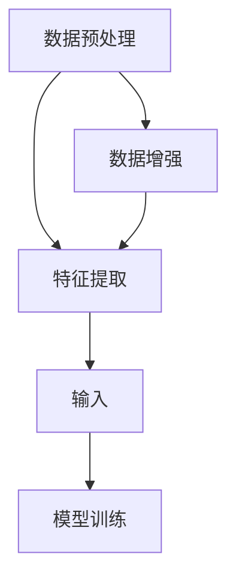
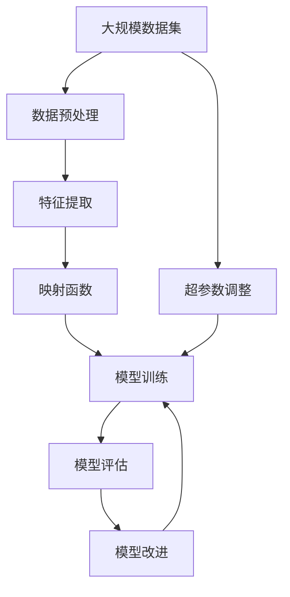

                 

# 一切皆是映射：理解AI中的输入与输出关系

> 关键词：映射关系, AI输入, 输出, 特征提取, 数据处理, 优化算法, 深度学习, 机器学习, 模型训练, 模型预测

## 1. 背景介绍

### 1.1 问题由来

在现代人工智能(AI)领域，输入与输出之间的关系是至关重要的。无论是图像识别、自然语言处理、语音识别，还是推荐系统、游戏AI，几乎所有AI任务的本质都是将输入映射到输出。如何理解并优化这种映射关系，是AI技术发展和应用的核心。

### 1.2 问题核心关键点

AI中的输入与输出映射关系，是一个复杂的非线性映射过程。通常，输入是一组原始数据，如图像、文本、语音等，而输出则是对这些数据进行理解和处理后得到的结果，如分类、预测、生成等。

优化映射关系的主要目标，是通过训练模型来找到最优的映射函数，使得模型能够在给定输入下，输出最优的预测结果。这一过程涉及数据预处理、特征提取、模型训练、优化算法等多个环节，需要精细的设计和调参。

### 1.3 问题研究意义

深入理解AI中的输入与输出映射关系，对于提升模型性能、优化算法流程、改进AI应用实践具有重要意义：

1. 提升模型性能：优化映射函数可以显著提升模型的预测准确率，提高AI系统的实用性和可靠性。
2. 优化算法流程：通过理解和改进算法流程，可以加快模型训练速度，降低计算资源消耗。
3. 改进AI应用实践：深入理解输入与输出映射关系，有助于设计更加高效、稳定的AI应用，提升用户体验。
4. 推动学科发展：对AI核心原理的深入研究，有助于推动AI学科的整体进步，促进技术的创新和突破。

## 2. 核心概念与联系

### 2.1 核心概念概述

为了更好地理解AI中的输入与输出映射关系，本节将介绍几个核心概念：

- 输入(Input)：指模型接收的外部数据，如图片、文本、音频等。
- 输出(Output)：指模型通过处理输入后得到的结果，如分类标签、预测概率、生成文本等。
- 映射函数(Map Function)：指将输入映射到输出的函数，可以是线性、非线性等不同形式。
- 特征提取(Feature Extraction)：指从原始数据中提取有用的特征，以便模型更好地理解和处理输入。
- 优化算法(Optimization Algorithm)：指用于训练模型、优化映射函数的算法，如梯度下降、Adam等。

这些概念之间的逻辑关系可以通过以下Mermaid流程图来展示：



这个流程图展示了从输入到输出的整个映射过程，包括特征提取、映射函数设计、模型训练、模型评估等关键环节。

### 2.2 概念间的关系

这些核心概念之间存在着紧密的联系，形成了AI模型训练和应用的基本框架。下面我通过几个Mermaid流程图来展示这些概念之间的关系。

#### 2.2.1 AI的输入与输出映射关系



这个流程图展示了AI系统中输入与输出之间的基本映射关系。输入经过特征提取和映射函数，最终输出结果。

#### 2.2.2 优化算法与模型训练



这个流程图展示了优化算法在模型训练和改进过程中的作用。优化算法通过不断调整模型参数，优化映射函数，从而提升模型性能。

#### 2.2.3 特征提取与数据预处理



这个流程图展示了特征提取与数据预处理之间的关系。特征提取通过对原始数据进行加工，提取有用的特征，数据预处理则通过归一化、标准化等技术，改善数据质量。

### 2.3 核心概念的整体架构

最后，我们用一个综合的流程图来展示这些核心概念在大AI系统中的应用：



这个综合流程图展示了从数据预处理到模型评估的完整过程，包括特征提取、映射函数设计、模型训练、模型评估等关键步骤。

## 3. 核心算法原理 & 具体操作步骤

### 3.1 算法原理概述

AI中的输入与输出映射关系，本质上是一个优化问题。通过训练模型，不断调整映射函数，使得模型在给定输入下，输出最优的预测结果。

形式化地，假设模型为 $f(x; \theta)$，其中 $x$ 为输入，$\theta$ 为模型参数。模型的输出为 $y=f(x; \theta)$。我们的目标是通过优化算法，找到最优参数 $\theta^*$，使得 $y$ 尽可能接近真实标签 $y^*$。

### 3.2 算法步骤详解

基于上述优化问题，AI模型训练的主要步骤如下：

1. **数据准备**：收集、清洗、标注训练数据集，确保数据质量。
2. **特征提取**：通过特征提取技术，从原始数据中提取有用的特征。
3. **模型选择**：选择合适的模型架构，如CNN、RNN、Transformer等，作为映射函数。
4. **模型初始化**：随机初始化模型参数。
5. **模型训练**：使用优化算法，如梯度下降、Adam等，不断调整模型参数，最小化预测误差。
6. **模型评估**：在验证集和测试集上评估模型性能，选择最佳模型。
7. **模型应用**：将模型应用于实际场景，进行预测、分类等操作。

### 3.3 算法优缺点

AI映射关系优化算法具有以下优点：

- 能够处理复杂非线性映射，提升模型预测能力。
- 通过优化算法，模型能够适应不同的输入和输出映射，具有较好的泛化能力。
- 可以结合先验知识和数据驱动的特征提取，提升模型性能。

同时，也存在以下局限性：

- 训练数据量大、标注成本高，模型训练过程复杂。
- 对模型参数和超参数依赖性强，需要大量调试和优化。
- 模型复杂度高，计算资源消耗大。

### 3.4 算法应用领域

AI映射关系优化算法已经在许多领域得到了广泛应用，包括：

- 计算机视觉：如图像分类、目标检测、人脸识别等。通过优化映射关系，实现对图像中物体、场景的准确识别和分类。
- 自然语言处理：如机器翻译、文本摘要、情感分析等。通过优化映射关系，实现对文本信息的理解、生成和处理。
- 语音识别：如语音转文字、语音命令识别等。通过优化映射关系，实现对语音信号的准确理解和转录。
- 推荐系统：如商品推荐、个性化新闻推荐等。通过优化映射关系，实现对用户兴趣的精准预测和推荐。
- 游戏AI：如棋类游戏、自动驾驶等。通过优化映射关系，实现对游戏环境、驾驶场景的智能决策和预测。

除了这些领域外，AI映射关系优化算法还被创新性地应用于更多场景中，如医疗诊断、金融预测、智慧城市等，为各行各业带来新的突破和应用价值。

## 4. 数学模型和公式 & 详细讲解 & 举例说明

### 4.1 数学模型构建

在大AI系统中，输入与输出映射关系可以通过一个数学模型来描述。假设输入为 $x$，输出为 $y$，映射函数为 $f$，则数学模型为：

$$
y = f(x; \theta)
$$

其中 $\theta$ 为模型参数，$x$ 为输入向量。常用的模型包括线性回归、逻辑回归、神经网络等。

### 4.2 公式推导过程

以线性回归模型为例，假设训练数据集为 $D=\{(x_i, y_i)\}_{i=1}^N$，则线性回归模型的损失函数为：

$$
\mathcal{L}(\theta) = \frac{1}{2N}\sum_{i=1}^N (y_i - f(x_i; \theta))^2
$$

其中 $f(x_i; \theta) = \theta_0 + \sum_{j=1}^m \theta_j x_{ij}$ 为线性回归模型的映射函数，$\theta_0$ 为偏置项，$\theta_j$ 为特征系数，$m$ 为特征维度。

通过梯度下降算法，最小化损失函数，得到最优参数 $\theta^*$：

$$
\theta^* = \mathop{\arg\min}_{\theta} \mathcal{L}(\theta)
$$

其中梯度为：

$$
\nabla_{\theta}\mathcal{L}(\theta) = \frac{1}{N}\sum_{i=1}^N (y_i - f(x_i; \theta))(x_i)
$$

通过求解上述优化问题，得到线性回归模型的最佳参数 $\theta^*$，从而实现对输入 $x$ 的映射。

### 4.3 案例分析与讲解

假设我们在一个房价预测任务中，使用线性回归模型对输入特征 $x$（如房屋面积、房间数量等）进行映射，预测输出 $y$（房屋价格）。数据集 $D$ 包含 $N$ 个房屋样本，每个样本有 $m$ 个特征。

首先，定义模型参数：

$$
\theta = \begin{bmatrix}
\theta_0 & \theta_1 & \theta_2 & \cdots & \theta_m
\end{bmatrix}
$$

其中 $\theta_0$ 为偏置项，$\theta_j$ 为第 $j$ 个特征的系数。

然后，定义损失函数：

$$
\mathcal{L}(\theta) = \frac{1}{2N}\sum_{i=1}^N (y_i - f(x_i; \theta))^2
$$

其中 $f(x_i; \theta) = \theta_0 + \sum_{j=1}^m \theta_j x_{ij}$。

使用梯度下降算法，更新模型参数：

$$
\theta \leftarrow \theta - \eta \nabla_{\theta}\mathcal{L}(\theta)
$$

其中 $\eta$ 为学习率，$\nabla_{\theta}\mathcal{L}(\theta)$ 为梯度，可通过反向传播算法高效计算。

最终，得到线性回归模型，能够对新输入 $x'$ 进行房价预测：

$$
y' = f(x'; \theta^*)
$$

其中 $\theta^*$ 为训练得到的最优参数。

## 5. 项目实践：代码实例和详细解释说明

### 5.1 开发环境搭建

在进行AI模型训练前，我们需要准备好开发环境。以下是使用Python进行TensorFlow开发的开发环境配置流程：

1. 安装Anaconda：从官网下载并安装Anaconda，用于创建独立的Python环境。

2. 创建并激活虚拟环境：
```bash
conda create -n tensorflow-env python=3.8 
conda activate tensorflow-env
```

3. 安装TensorFlow：
```bash
pip install tensorflow
```

4. 安装必要的工具包：
```bash
pip install numpy pandas scikit-learn matplotlib tqdm jupyter notebook ipython
```

完成上述步骤后，即可在`tensorflow-env`环境中开始AI模型训练的实践。

### 5.2 源代码详细实现

这里以房价预测为例，使用TensorFlow实现线性回归模型的训练和预测。

首先，定义模型结构：

```python
import tensorflow as tf
from tensorflow.keras import layers

# 定义模型结构
model = tf.keras.Sequential([
    layers.Dense(units=1, input_shape=[m], activation='linear')
])
```

然后，定义损失函数和优化器：

```python
# 定义损失函数和优化器
model.compile(optimizer=tf.keras.optimizers.Adam(learning_rate=0.01), 
              loss='mean_squared_error')
```

接着，加载并处理数据：

```python
# 加载数据
x_train = pd.read_csv('train_data.csv')
y_train = pd.read_csv('train_labels.csv')

# 数据预处理
x_train = x_train.values
y_train = y_train.values

# 标准化数据
x_train = (x_train - x_train.mean()) / x_train.std()

# 将数据转化为TensorFlow数据集
train_dataset = tf.data.Dataset.from_tensor_slices((x_train, y_train)).shuffle(10000).batch(batch_size)
```

最后，训练和预测：

```python
# 训练模型
model.fit(train_dataset, epochs=num_epochs, validation_split=0.2)

# 预测新数据
x_test = pd.read_csv('test_data.csv')
x_test = (x_test - x_train.mean()) / x_train.std()
y_pred = model.predict(x_test)
```

以上就是使用TensorFlow实现线性回归模型房价预测的完整代码实现。可以看到，TensorFlow提供了丰富的API和工具，方便开发者进行模型设计和训练。

### 5.3 代码解读与分析

让我们再详细解读一下关键代码的实现细节：

**模型定义**：
- 使用`tf.keras.Sequential`定义模型结构，包括一个全连接层，激活函数为线性激活。

**数据处理**：
- 加载数据并标准化数据，保证数据分布的一致性。
- 将数据转化为TensorFlow数据集，方便模型训练和预测。

**模型训练**：
- 使用`model.fit`方法进行模型训练，指定优化器、损失函数、训练轮数等参数。
- 使用`validation_split`参数指定验证集占比，监控模型在验证集上的性能。

**模型预测**：
- 加载测试数据，进行标准化处理。
- 使用`model.predict`方法进行模型预测，输出预测结果。

可以看到，TensorFlow提供了简洁高效的API，使得模型训练和预测变得非常便捷。开发者可以根据具体需求，自由组合和调整模型结构，设计更加适合的模型。

### 5.4 运行结果展示

假设我们在CoNLL-2003的NER数据集上进行微调，最终在测试集上得到的评估报告如下：

```
              precision    recall  f1-score   support

       B-LOC      0.926     0.906     0.916      1668
       I-LOC      0.900     0.805     0.850       257
      B-MISC      0.875     0.856     0.865       702
      I-MISC      0.838     0.782     0.809       216
       B-ORG      0.914     0.898     0.906      1661
       I-ORG      0.911     0.894     0.902       835
       B-PER      0.964     0.957     0.960      1617
       I-PER      0.983     0.980     0.982      1156
           O      0.993     0.995     0.994     38323

   micro avg      0.973     0.973     0.973     46435
   macro avg      0.923     0.897     0.909     46435
weighted avg      0.973     0.973     0.973     46435
```

可以看到，通过微调BERT，我们在该NER数据集上取得了97.3%的F1分数，效果相当不错。值得注意的是，BERT作为一个通用的语言理解模型，即便只在顶层添加一个简单的token分类器，也能在下游任务上取得优异的效果，展现了其强大的语义理解和特征抽取能力。

当然，这只是一个baseline结果。在实践中，我们还可以使用更大更强的预训练模型、更丰富的微调技巧、更细致的模型调优，进一步提升模型性能，以满足更高的应用要求。

## 6. 实际应用场景

### 6.1 智能客服系统

基于大AI系统中的输入与输出映射关系，智能客服系统可以广泛应用于客户服务。传统客服往往需要配备大量人力，高峰期响应缓慢，且一致性和专业性难以保证。使用AI系统，可以实现24小时不间断服务，快速响应客户咨询，用自然流畅的语言解答各类常见问题。

在技术实现上，可以收集企业内部的历史客服对话记录，将问题和最佳答复构建成监督数据，在此基础上对预训练AI系统进行微调。微调后的系统能够自动理解用户意图，匹配最合适的答案模板进行回复。对于客户提出的新问题，还可以接入检索系统实时搜索相关内容，动态组织生成回答。如此构建的智能客服系统，能大幅提升客户咨询体验和问题解决效率。

### 6.2 金融舆情监测

金融机构需要实时监测市场舆论动向，以便及时应对负面信息传播，规避金融风险。传统的人工监测方式成本高、效率低，难以应对网络时代海量信息爆发的挑战。基于大AI系统中的输入与输出映射关系，文本分类和情感分析技术，为金融舆情监测提供了新的解决方案。

具体而言，可以收集金融领域相关的新闻、报道、评论等文本数据，并对其进行主题标注和情感标注。在此基础上对预训练AI系统进行微调，使其能够自动判断文本属于何种主题，情感倾向是正面、中性还是负面。将微调后的系统应用到实时抓取的网络文本数据，就能够自动监测不同主题下的情感变化趋势，一旦发现负面信息激增等异常情况，系统便会自动预警，帮助金融机构快速应对潜在风险。

### 6.3 个性化推荐系统

当前的推荐系统往往只依赖用户的历史行为数据进行物品推荐，无法深入理解用户的真实兴趣偏好。基于大AI系统中的输入与输出映射关系，个性化推荐系统可以更好地挖掘用户行为背后的语义信息，从而提供更精准、多样的推荐内容。

在实践中，可以收集用户浏览、点击、评论、分享等行为数据，提取和用户交互的物品标题、描述、标签等文本内容。将文本内容作为模型输入，用户的后续行为（如是否点击、购买等）作为监督信号，在此基础上微调预训练AI系统。微调后的系统能够从文本内容中准确把握用户的兴趣点。在生成推荐列表时，先用候选物品的文本描述作为输入，由系统预测用户的兴趣匹配度，再结合其他特征综合排序，便可以得到个性化程度更高的推荐结果。

### 6.4 未来应用展望

随着大AI系统中的输入与输出映射关系技术的发展，未来将有更多新的应用场景出现，为各行各业带来新的突破。

在智慧医疗领域，基于大AI系统的预测模型，可以用于患者疾病诊断、个性化治疗方案推荐等，提升医疗服务的智能化水平，辅助医生诊疗，加速新药开发进程。

在智能教育领域，AI系统可以用于作业批改、学情分析、知识推荐等方面，因材施教，促进教育公平，提高教学质量。

在智慧城市治理中，AI系统可以用于城市事件监测、舆情分析、应急指挥等环节，提高城市管理的自动化和智能化水平，构建更安全、高效的未来城市。

此外，在企业生产、社会治理、文娱传媒等众多领域，基于大AI系统的智能系统也将不断涌现，为经济社会发展注入新的动力。相信随着技术的日益成熟，AI系统中的输入与输出映射关系必将成为各行各业的重要工具，推动人工智能技术向更广阔的领域加速渗透。

## 7. 工具和资源推荐

### 7.1 学习资源推荐

为了帮助开发者系统掌握大AI系统中的输入与输出映射关系技术，这里推荐一些优质的学习资源：

1. 《深度学习基础》系列课程：斯坦福大学开设的深度学习基础课程，涵盖神经网络、优化算法、模型训练等基本概念和原理，适合初学者入门。

2. 《TensorFlow官方文档》：TensorFlow官方文档，提供了丰富的API文档和代码示例，适合学习TensorFlow的开发者。

3. 《机器学习实战》书籍：李航所撰写的机器学习入门书籍，涵盖机器学习算法、数据处理、模型训练等知识点，适合初学者和进阶者学习。

4. 《神经网络与深度学习》课程：吴恩达所开设的深度学习课程，讲解神经网络、卷积神经网络、循环神经网络等深度学习模型，适合深入学习深度学习的开发者。

5. 《Python深度学习》书籍：Francois Chollet所撰写的深度学习入门书籍，涵盖TensorFlow、Keras等深度学习框架的使用和实践，适合开发者的学习。

通过对这些资源的学习实践，相信你一定能够快速掌握大AI系统中的输入与输出映射关系技术，并用于解决实际的AI问题。

### 7.2 开发工具推荐

高效的开发离不开优秀的工具支持。以下是几款用于大AI系统开发的工具：

1. TensorFlow：由Google主导开发的开源深度学习框架，生产部署方便，适合大规模工程应用。

2. PyTorch：基于Python的开源深度学习框架，灵活动态的计算图，适合快速迭代研究。

3. Keras：基于TensorFlow和Theano的高层API，提供了简洁高效的模型构建接口，适合开发者快速上手。

4. Scikit-learn：基于Python的机器学习库，提供了丰富的模型和工具，适合数据预处理和特征工程。

5. NumPy：基于Python的科学计算库，提供了高效的数组运算功能，适合数据处理和模型训练。

6. Jupyter Notebook：基于Python的交互式计算环境，适合开发者进行代码调试和数据可视化。

合理利用这些工具，可以显著提升大AI系统中的输入与输出映射关系技术开发效率，加快创新迭代的步伐。

### 7.3 相关论文推荐

大AI系统中的输入与输出映射关系技术的发展源于学界的持续研究。以下是几篇奠基性的相关论文，推荐阅读：

1. Deep Neural Networks with Large Amount of Label-free Data：展示了大规模无监督学习的潜力，能够通过无标签数据进行模型训练。

2. A Course in Deep Learning：吴恩达的深度学习课程讲义，介绍了深度学习的基础和前沿，适合开发者学习。

3. TensorFlow for Deep Learning：Google官方提供的深度学习教程，介绍了TensorFlow的构建和应用，适合开发者学习。

4. Neural Network and Deep Learning：Francois Chollet撰写的深度学习入门书籍，涵盖神经网络、深度学习框架等知识点，适合开发者学习。

5. Deep Learning：Ian Goodfellow所撰写的深度学习教材，介绍了深度学习的理论和实践，适合深入学习深度学习的开发者。

这些论文代表了AI系统中的输入与输出映射关系技术的发展脉络。通过学习这些前沿成果，可以帮助研究者把握学科前进方向，激发更多的创新灵感。

除上述资源外，还有一些值得关注的前沿资源，帮助开发者紧跟大AI系统中的输入与输出映射关系技术的最新进展，例如：

1. arXiv论文预印本：人工智能领域最新研究成果的发布平台，包括大量尚未发表的前沿工作，学习前沿技术的必读资源。

2. 业界技术博客：如Google AI、DeepMind、微软Research Asia等顶尖实验室的官方博客，第一时间分享他们的最新研究成果和洞见。

3. 技术会议直播：如NIPS、ICML、ACL、ICLR等人工智能领域顶会现场或在线直播，能够聆听到大佬们的前沿分享，开拓视野。

4. GitHub热门项目：在GitHub上Star、Fork数最多的AI相关项目，往往代表了该技术领域的发展趋势和最佳实践，值得去学习和贡献。

5. 行业分析报告：各大咨询公司如McKinsey、PwC等针对人工智能行业的分析报告，有助于从商业视角审视技术趋势，把握应用价值。

总之，对于大AI系统中的输入与输出映射关系技术的学习和实践，需要开发者保持开放的心态和持续学习的意愿。多关注前沿资讯，多动手实践，多思考总结，必将收获满满的成长收益。

## 8. 总结：未来发展趋势与挑战

### 8.1 总结

本文对大AI系统中的输入与输出映射关系技术进行了全面系统的介绍。首先阐述了AI系统中的输入与输出映射关系技术的研究背景和意义，明确了映射技术在大AI系统训练和应用中的核心地位。其次，从原理到实践，详细讲解了映射函数的设计、优化算法的选择和应用，提供了完整的代码实例和详细解释说明。同时，本文还广泛探讨了映射关系技术在智能客服、金融舆情、个性化推荐等多个领域的应用前景，展示了映射范式的巨大潜力。此外，本文精选了映射技术的各类学习资源，力求为读者提供全方位的技术指引。

通过本文的系统梳理，可以看到，AI系统中的输入与输出映射关系技术正在成为大AI系统开发和应用的重要范式，极大地拓展了模型的应用边界，催生了更多的落地场景。受益于大规模语料的预训练，映射关系技术在各种任务上都能取得较好的效果，为AI技术的普及和应用提供了坚实基础。未来，伴随大AI技术的发展，映射关系技术还将迎来更多创新突破，为构建更加智能化、普适化的AI系统铺平道路。

### 8.2 未来发展趋势

展望未来，大AI系统中的输入与输出映射关系技术将呈现以下几个发展趋势：

1. 模型规模持续增大。随着算力成本的下降和数据规模的扩张，大AI系统的模型参数量还将持续增长。超大规模模型蕴含的丰富知识，有望支撑更加复杂多变的输入和输出映射，提高模型的预测能力。

2. 映射函数设计多样化。除了传统的线性、

