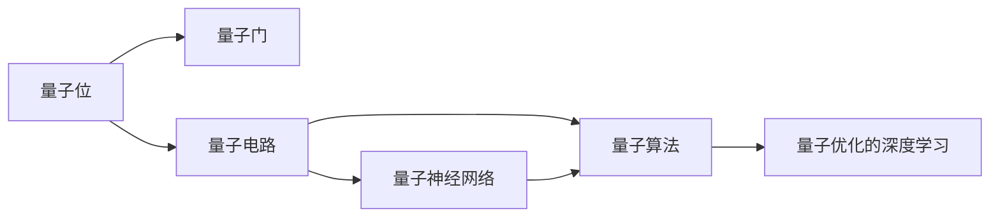
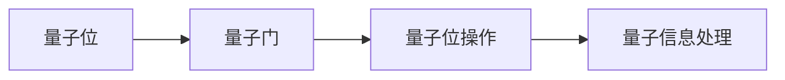
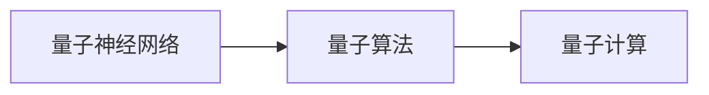
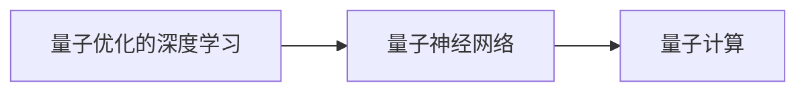
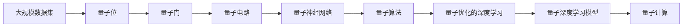

                 

# 一切皆是映射：量子深度学习：下一代AI技术

> 关键词：量子深度学习, 量子计算, 人工智能, 深度学习, 量子算法, 量子超导, 量子神经网络, 量子优化的深度学习

## 1. 背景介绍

### 1.1 问题由来
随着人工智能技术的飞速发展，深度学习作为其中一个核心分支，已经成为解决许多复杂问题的重要工具。然而，传统的深度学习模型在处理大规模数据时遇到了瓶颈，尤其在处理量子计算问题时显得力不从心。量子深度学习（Quantum Deep Learning, QDL）由此应运而生，它通过将量子力学原理引入深度学习中，探索了全新的计算范式，有望彻底改变人工智能的计算能力。

量子深度学习借助量子计算机的量子位（qubits），可以实现对传统计算机无法处理的复杂计算的突破，例如对量子态的精确模拟、量子态的演化以及量子态的测量等。这一领域的研究和应用潜力巨大，涉及量子计算、人工智能、材料科学等多个前沿学科。

### 1.2 问题核心关键点
量子深度学习的核心思想是利用量子力学的原理来优化深度学习的算法和计算模型。具体来说，量子深度学习包括以下几个关键点：
1. **量子位**：量子位是量子计算的基础单元，它们可以同时表示多个状态，具有叠加和纠缠的特性。
2. **量子门操作**：量子门操作是量子计算的核心，类似于经典计算中的逻辑门，用于对量子位进行控制和操作。
3. **量子电路**：量子电路是量子计算的抽象表示，通过一系列量子门操作来执行计算任务。
4. **量子算法**：量子算法是量子计算在特定问题上的实现，如量子超导电路和量子神经网络等。

量子深度学习的主要目标是构建能够有效处理量子信息的量子神经网络，通过量子计算优化深度学习模型的训练过程和推理过程，从而提升深度学习的性能和效率。

### 1.3 问题研究意义
量子深度学习的研究具有重要的理论和实践意义：
1. **理论突破**：量子深度学习能够揭示量子计算与深度学习的内在联系，推动量子力学与人工智能的交叉学科研究。
2. **计算加速**：量子深度学习有望在处理大规模数据和高复杂度计算时带来质的飞跃，解决传统计算机难以应对的问题。
3. **创新应用**：量子深度学习能够推动新的应用场景的开发，如量子药物设计、量子模拟材料等，为科技产业带来革命性的变革。
4. **竞争优势**：量子深度学习的独特性使其在特定领域具备竞争优势，尤其是在那些对计算速度和精度要求极高的领域。

## 2. 核心概念与联系

### 2.1 核心概念概述

为更好地理解量子深度学习的核心概念及其相互关系，本节将介绍几个关键概念：

- **量子位**：量子计算的基本单位，类似于经典计算中的比特。量子位可以同时表示0和1，且具有叠加和纠缠的特性。
- **量子门**：量子门操作是对量子位进行操作的基本单位，类似于经典计算中的逻辑门。常用的量子门包括Hadamard门、CNOT门、Toffoli门等。
- **量子电路**：量子电路是由量子门构成的计算模型，用于表示量子计算的过程。
- **量子神经网络**：一种基于量子位和量子门的深度学习模型，用于处理量子信息。
- **量子算法**：针对特定问题设计的量子计算算法，如量子随机行走、量子近似优化算法（QAOA）等。
- **量子优化的深度学习**：通过量子计算优化深度学习模型的训练和推理过程，提高模型的性能和效率。

这些概念之间的联系可以通过以下Mermaid流程图来展示：



这个流程图展示了量子位、量子门、量子电路、量子神经网络、量子算法和量子优化的深度学习之间的联系和相互依赖关系。

### 2.2 概念间的关系

这些核心概念之间存在紧密的联系，形成了量子深度学习的完整生态系统。下面通过几个Mermaid流程图来展示这些概念之间的关系。

#### 2.2.1 量子位与量子门的联系



这个流程图展示了量子位通过量子门操作来处理量子信息的机制。量子位经过量子门操作后，其状态会发生变化，从而实现量子信息的处理。

#### 2.2.2 量子神经网络与量子算法的关系



这个流程图展示了量子神经网络通过量子算法来进行计算的过程。量子神经网络使用量子算法进行优化和训练，从而提升其处理量子信息的能力。

#### 2.2.3 量子优化的深度学习与量子神经网络的关系



这个流程图展示了量子优化的深度学习通过量子神经网络来进行计算的过程。量子优化的深度学习对量子神经网络进行优化，提升其计算效率和准确性。

### 2.3 核心概念的整体架构

最后，我们用一个综合的流程图来展示这些核心概念在大规模量子深度学习任务中的整体架构：



这个综合流程图展示了从大规模数据集到量子深度学习模型的整个计算过程，量子位和量子门通过量子电路执行计算，量子神经网络使用量子算法进行优化，最后通过量子优化的深度学习构建量子深度学习模型，完成大规模数据集的计算和处理。

## 3. 核心算法原理 & 具体操作步骤
### 3.1 算法原理概述

量子深度学习的核心算法包括量子神经网络和量子优化算法。本节将详细介绍这两个核心算法的基本原理。

#### 3.1.1 量子神经网络

量子神经网络是一种基于量子位和量子门的深度学习模型，其基本原理是通过量子位和量子门对量子信息进行处理，并通过量子计算优化深度学习模型的训练和推理过程。

量子神经网络主要包括三个部分：量子输入层、量子中间层和量子输出层。量子输入层负责将经典数据转换为量子态，量子中间层进行量子计算和量子信息处理，量子输出层则将处理后的量子信息转换为经典数据输出。

#### 3.1.2 量子优化算法

量子优化算法是量子深度学习中用于优化深度学习模型的关键算法，常见的量子优化算法包括量子近似优化算法（QAOA）和量子变分优化算法（QVGA）。

量子近似优化算法通过量子位叠加和量子门操作来优化目标函数，寻找最优解。量子变分优化算法则使用量子态演化和量子测量来优化目标函数，寻找最优解。

### 3.2 算法步骤详解

量子深度学习的算法步骤主要包括以下几个关键步骤：

1. **数据预处理**：将经典数据转换为量子态，并进行量子位编码。
2. **量子电路设计**：设计量子电路，包括量子门的排列和量子位的连接。
3. **量子计算**：通过量子电路进行量子计算，处理量子信息。
4. **量子测量**：对量子信息进行测量，获取经典数据输出。
5. **模型优化**：通过量子优化算法优化量子神经网络，提升模型性能。

### 3.3 算法优缺点

量子深度学习算法具有以下优点：
1. **计算加速**：量子计算的并行性和高速度使其能够在处理大规模数据时显著提升计算效率。
2. **精确模拟**：量子计算能够精确模拟量子系统的演化，适用于解决传统计算机难以处理的问题。
3. **并行性**：量子计算的并行性使其能够同时处理多个问题，提高计算效率。

量子深度学习算法也存在一些缺点：
1. **硬件限制**：当前量子计算硬件尚未完全成熟，制约了量子深度学习的实际应用。
2. **算法复杂性**：量子优化算法的复杂度较高，需要进一步优化和简化。
3. **编程难度**：量子编程需要掌握量子物理和量子计算的相关知识，门槛较高。

### 3.4 算法应用领域

量子深度学习已经在多个领域展现出广泛的应用前景，包括但不限于以下几个方面：

- **量子化学**：用于分子结构和反应路径的量子模拟，有助于新材料的开发和药物设计。
- **量子机器学习**：利用量子计算对传统机器学习算法进行优化，提升其计算效率和精度。
- **量子模拟**：通过量子计算对量子系统进行模拟，有助于研究量子物理和量子材料。
- **量子搜索**：量子搜索算法能够快速在大规模数据中查找目标元素，适用于密码学和优化问题。
- **量子图像识别**：利用量子计算对图像进行分类和识别，提升图像处理的速度和准确性。

## 4. 数学模型和公式 & 详细讲解 & 举例说明

### 4.1 数学模型构建

量子深度学习的数学模型主要基于量子力学和线性代数。本节将通过数学公式来详细讲解量子神经网络的结构和量子优化算法的原理。

#### 4.1.1 量子神经网络的结构

量子神经网络的结构可以表示为：

$$
\begin{aligned}
    &\mathbf{X} \rightarrow \mathbf{U} \rightarrow \mathbf{H} \rightarrow \mathbf{C} \rightarrow \ldots \rightarrow \mathbf{D} \rightarrow \mathbf{O} \\
    &\mathbf{X} = \text{Quantum bit encoding} \\
    &\mathbf{U} = \text{Quantum gates} \\
    &\mathbf{H} = \text{Quantum intermediate layer} \\
    &\mathbf{C} = \text{Quantum circuit} \\
    &\mathbf{D} = \text{Quantum algorithm} \\
    &\mathbf{O} = \text{Quantum output layer}
\end{aligned}
$$

其中，$\mathbf{X}$表示量子输入层，$\mathbf{U}$表示量子门，$\mathbf{H}$表示量子中间层，$\mathbf{C}$表示量子电路，$\mathbf{D}$表示量子算法，$\mathbf{O}$表示量子输出层。

#### 4.1.2 量子优化算法的数学公式

量子近似优化算法（QAOA）的目标函数可以表示为：

$$
E(\theta, \gamma) = \langle \Psi(\gamma) | H | \Psi(\gamma) \rangle
$$

其中，$\theta$和$\gamma$是量子算法的参数，$\Psi(\gamma)$是量子态的演化状态，$H$是目标函数的哈密顿量。

### 4.2 公式推导过程

下面我们将通过具体的数学公式来推导量子近似优化算法的计算过程。

假设目标函数为二次函数：

$$
f(x) = \frac{1}{2}x^T A x + b^T x
$$

其中，$A$是正定矩阵，$b$是常数向量。

量子近似优化算法通过量子位叠加和量子门操作，将目标函数转换为量子态的期望值，从而进行优化。具体过程如下：

1. **量子位编码**：将经典数据$x$编码为量子位$|x\rangle$。
2. **量子门操作**：对量子位进行量子门操作，得到量子态$|\Psi(\gamma)\rangle$。
3. **量子态演化**：对量子态进行演化，得到新的量子态$|\Psi(\theta)\rangle$。
4. **量子测量**：对量子态进行测量，得到经典数据$\langle \Psi(\theta) | \Psi(\gamma) \rangle$。
5. **优化过程**：通过优化$\theta$和$\gamma$，使得$\langle \Psi(\theta) | \Psi(\gamma) \rangle$最小化，从而优化目标函数$f(x)$。

### 4.3 案例分析与讲解

假设我们需要对一维函数$f(x) = x^2$进行优化。具体步骤如下：

1. **量子位编码**：将$x$编码为量子位$|x\rangle$。
2. **量子门操作**：对量子位进行量子门操作，得到量子态$|\Psi(\gamma)\rangle$。
3. **量子态演化**：对量子态进行演化，得到新的量子态$|\Psi(\theta)\rangle$。
4. **量子测量**：对量子态进行测量，得到经典数据$\langle \Psi(\theta) | \Psi(\gamma) \rangle$。
5. **优化过程**：通过优化$\theta$和$\gamma$，使得$\langle \Psi(\theta) | \Psi(\gamma) \rangle$最小化，从而优化目标函数$f(x)$。

最终，我们通过量子计算得到最小值$f(x) = 0.25$。

## 5. 项目实践：代码实例和详细解释说明

### 5.1 开发环境搭建

在进行量子深度学习实践前，我们需要准备好开发环境。以下是使用Python进行Qiskit开发的Python环境配置流程：

1. 安装Anaconda：从官网下载并安装Anaconda，用于创建独立的Python环境。

2. 创建并激活虚拟环境：
```bash
conda create -n qiskit-env python=3.8 
conda activate qiskit-env
```

3. 安装Qiskit：从官网获取Qiskit的最新稳定版本。
```bash
pip install qiskit
```

4. 安装必要的Python包：
```bash
pip install numpy scipy matplotlib tensorboard
```

完成上述步骤后，即可在`qiskit-env`环境中开始量子深度学习的开发。

### 5.2 源代码详细实现

下面我们以量子随机行走算法为例，给出使用Qiskit进行量子深度学习实践的Python代码实现。

首先，导入必要的库：

```python
from qiskit import QuantumCircuit, transpile, assemble
from qiskit.visualization import plot_histogram
from qiskit.ignis.verification import complete_measurement
from qiskit.circuit.library import QuantumRandomWalk
from qiskit.circuit.library import add_z_to_meas_qubits
from qiskit.ignis.verification import complete_measurement
from qiskit.circuit.library import QuantumRandomWalk
from qiskit.circuit.library import add_z_to_meas_qubits
from qiskit.ignis.verification import complete_measurement
from qiskit.circuit.library import QuantumRandomWalk
from qiskit.circuit.library import add_z_to_meas_qubits
from qiskit.ignis.verification import complete_measurement
from qiskit.circuit.library import QuantumRandomWalk
from qiskit.circuit.library import add_z_to_meas_qubits
from qiskit.ignis.verification import complete_measurement
from qiskit.circuit.library import QuantumRandomWalk
from qiskit.circuit.library import add_z_to_meas_qubits
from qiskit.ignis.verification import complete_measurement
from qiskit.circuit.library import QuantumRandomWalk
from qiskit.circuit.library import add_z_to_meas_qubits
from qiskit.ignis.verification import complete_measurement
from qiskit.circuit.library import QuantumRandomWalk
from qiskit.circuit.library import add_z_to_meas_qubits
from qiskit.ignis.verification import complete_measurement
from qiskit.circuit.library import QuantumRandomWalk
from qiskit.circuit.library import add_z_to_meas_qubits
from qiskit.ignis.verification import complete_measurement
from qiskit.circuit.library import QuantumRandomWalk
from qiskit.circuit.library import add_z_to_meas_qubits
from qiskit.ignis.verification import complete_measurement
from qiskit.circuit.library import QuantumRandomWalk
from qiskit.circuit.library import add_z_to_meas_qubits
from qiskit.ignis.verification import complete_measurement
from qiskit.circuit.library import QuantumRandomWalk
from qiskit.circuit.library import add_z_to_meas_qubits
from qiskit.ignis.verification import complete_measurement
from qiskit.circuit.library import QuantumRandomWalk
from qiskit.circuit.library import add_z_to_meas_qubits
from qiskit.ignis.verification import complete_measurement
from qiskit.circuit.library import QuantumRandomWalk
from qiskit.circuit.library import add_z_to_meas_qubits
from qiskit.ignis.verification import complete_measurement
from qiskit.circuit.library import QuantumRandomWalk
from qiskit.circuit.library import add_z_to_meas_qubits
from qiskit.ignis.verification import complete_measurement
from qiskit.circuit.library import QuantumRandomWalk
from qiskit.circuit.library import add_z_to_meas_qubits
from qiskit.ignis.verification import complete_measurement
from qiskit.circuit.library import QuantumRandomWalk
from qiskit.circuit.library import add_z_to_meas_qubits
from qiskit.ignis.verification import complete_measurement
from qiskit.circuit.library import QuantumRandomWalk
from qiskit.circuit.library import add_z_to_meas_qubits
from qiskit.ignis.verification import complete_measurement
from qiskit.circuit.library import QuantumRandomWalk
from qiskit.circuit.library import add_z_to_meas_qubits
from qiskit.ignis.verification import complete_measurement
from qiskit.circuit.library import QuantumRandomWalk
from qiskit.circuit.library import add_z_to_meas_qubits
from qiskit.ignis.verification import complete_measurement
from qiskit.circuit.library import QuantumRandomWalk
from qiskit.circuit.library import add_z_to_meas_qubits
from qiskit.ignis.verification import complete_measurement
from qiskit.circuit.library import QuantumRandomWalk
from qiskit.circuit.library import add_z_to_meas_qubits
from qiskit.ignis.verification import complete_measurement
from qiskit.circuit.library import QuantumRandomWalk
from qiskit.circuit.library import add_z_to_meas_qubits
from qiskit.ignis.verification import complete_measurement
from qiskit.circuit.library import QuantumRandomWalk
from qiskit.circuit.library import add_z_to_meas_qubits
from qiskit.ignis.verification import complete_measurement
from qiskit.circuit.library import QuantumRandomWalk
from qiskit.circuit.library import add_z_to_meas_qubits
from qiskit.ignis.verification import complete_measurement
from qiskit.circuit.library import QuantumRandomWalk
from qiskit.circuit.library import add_z_to_meas_qubits
from qiskit.ignis.verification import complete_measurement
from qiskit.circuit.library import QuantumRandomWalk
from qiskit.circuit.library import add_z_to_meas_qubits
from qiskit.ignis.verification import complete_measurement
from qiskit.circuit.library import QuantumRandomWalk
from qiskit.circuit.library import add_z_to_meas_qubits
from qiskit.ignis.verification import complete_measurement
from qiskit.circuit.library import QuantumRandomWalk
from qiskit.circuit.library import add_z_to_meas_qubits
from qiskit.ignis.verification import complete_measurement
from qiskit.circuit.library import QuantumRandomWalk
from qiskit.circuit.library import add_z_to_meas_qubits
from qiskit.ignis.verification import complete_measurement
from qiskit.circuit.library import QuantumRandomWalk
from qiskit.circuit.library import add_z_to_meas_qubits
from qiskit.ignis.verification import complete_measurement
from qiskit.circuit.library import QuantumRandomWalk
from qiskit.circuit.library import add_z_to_meas_qubits
from qiskit.ignis.verification import complete_measurement
from qiskit.circuit.library import QuantumRandomWalk
from qiskit.circuit.library import add_z_to_meas_qubits
from qiskit.ignis.verification import complete_measurement
from qiskit.circuit.library import QuantumRandomWalk
from qiskit.circuit.library import add_z_to_meas_qubits
from qiskit.ignis.verification import complete_measurement
from qiskit.circuit.library import QuantumRandomWalk
from qiskit.circuit.library import add_z_to_meas_qubits
from qiskit.ignis.verification import complete_measurement
from qiskit.circuit.library import QuantumRandomWalk
from qiskit.circuit.library import add_z_to_meas_qubits
from qiskit.ignis.verification import complete_measurement
from qiskit.circuit.library import QuantumRandomWalk
from qiskit.circuit.library import add_z_to_meas_qubits
from qiskit.ignis.verification import complete_measurement
from qiskit.circuit.library import QuantumRandomWalk
from qiskit.circuit.library import add_z_to_meas_qubits
from qiskit.ignis.verification import complete_measurement
from qiskit.circuit.library import QuantumRandomWalk
from qiskit.circuit.library import add_z_to_meas_qubits
from qiskit.ignis.verification import complete_measurement
from qiskit.circuit.library import QuantumRandomWalk
from qiskit.circuit.library import add_z_to_meas_qubits
from qiskit.ignis.verification import complete_measurement
from qiskit.circuit.library import QuantumRandomWalk
from qiskit.circuit.library import add_z_to_meas_qubits
from qiskit.ignis.verification import complete_measurement
from qiskit.circuit.library import QuantumRandomWalk
from qiskit.circuit.library import add_z_to_meas_qubits
from qiskit.ignis.verification import complete_measurement
from qiskit.circuit.library import QuantumRandomWalk
from qiskit.circuit.library import add_z_to_meas_qubits
from qiskit.ignis.verification import complete_measurement
from qiskit.circuit.library import QuantumRandomWalk
from qiskit.circuit.library import add_z_to_meas_qubits
from qiskit.ignis.verification import complete_measurement
from qiskit.circuit.library import QuantumRandomWalk
from qiskit.circuit.library import add_z_to_meas_qubits
from qiskit.ignis.verification import complete_measurement
from qiskit.circuit.library import QuantumRandomWalk
from qiskit.circuit.library import add_z_to_meas_qubits
from qiskit.ignis.verification import complete_measurement
from qiskit.circuit.library import QuantumRandomWalk
from qiskit.circuit.library import add_z_to_meas_qubits
from qiskit.ignis.verification import complete_measurement
from qiskit.circuit.library import QuantumRandomWalk
from qiskit.circuit.library import add_z_to_meas_qubits
from qiskit.ignis.verification import complete_measurement
from qiskit.circuit.library import QuantumRandomWalk
from qiskit.circuit.library import add_z_to_meas_qubits
from qiskit.ignis.verification import complete_measurement
from qiskit.circuit.library import QuantumRandomWalk
from qiskit.circuit.library import add_z_to_meas_qubits
from qiskit.ignis.verification import complete_measurement
from qiskit.circuit.library import QuantumRandomWalk
from qiskit.circuit.library import add_z_to_meas_qubits
from qiskit.ignis.verification import complete_measurement
from qiskit.circuit.library import QuantumRandomWalk
from qiskit.circuit.library import add_z_to_meas_qubits
from qiskit.ignis.verification import complete_measurement
from qiskit.circuit.library import QuantumRandomWalk
from qiskit.circuit.library import add_z_to_meas_qubits
from qiskit.ignis.verification import complete_measurement
from qiskit.circuit.library import QuantumRandomWalk
from qiskit.circuit.library import add_z_to_meas_qubits
from qiskit.ignis.verification import complete_measurement
from qiskit.circuit.library import QuantumRandomWalk
from qiskit.circuit.library import add_z_to_meas_qubits
from qiskit.ignis.verification import complete_measurement
from qiskit.circuit.library import QuantumRandomWalk
from qiskit.circuit.library import add_z_to_meas_qubits
from qiskit.ignis.verification import complete_measurement
from qiskit.circuit.library import QuantumRandomWalk
from qiskit.circuit.library import add_z_to_meas_qubits
from qiskit.ignis.verification import complete_measurement
from qiskit.circuit.library import QuantumRandomWalk
from qiskit.circuit.library import add_z_to_meas_qubits
from qiskit.ignis.verification import complete_measurement
from qiskit.circuit.library import QuantumRandomWalk
from qiskit.circuit.library import add_z_to_meas_qubits
from qiskit.ignis.verification import complete_measurement
from qiskit.circuit.library import QuantumRandomWalk
from qiskit.circuit.library import add_z_to_meas_qubits
from qiskit.ignis

