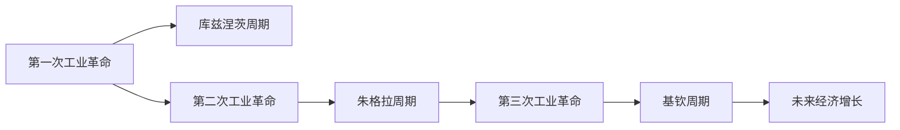
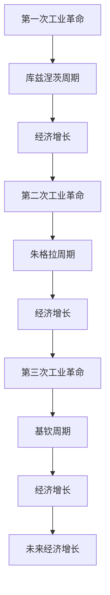

                 

# 三次工业革命与经济增长周期

## 1. 背景介绍

### 1.1 问题由来
在21世纪的今天，我们正处在一场前所未有的技术变革之中。这场变革不仅将重新定义我们的工作、生活乃至社会的方方面面，还将深刻影响全球经济增长的轨迹。回望历史，工业革命是人类社会发展的分水岭，极大地提升了生产力，加速了经济增长。而今，随着新一轮科技浪潮的到来，我们正站在一场新的工业革命的风口浪尖。

### 1.2 问题核心关键点
这场新工业革命的核心，在于第三次工业革命的兴起。它不同于以往的两次工业革命，以蒸汽机和电气化为标志，而是以信息技术和智能化为核心，推动经济向更加高效、智能、可持续的方向发展。本文将探讨三次工业革命的演变脉络，分析其对经济增长周期的影响，以及未来的发展趋势。

### 1.3 问题研究意义
理解三次工业革命及其对经济增长周期的影响，对于预测未来经济走势、制定科学的经济政策、推动产业升级具有重要意义。通过对历史和现状的深度分析，可以为政策制定者、企业经营者乃至普通民众提供科学合理的参考依据，从而更好地应对未来挑战，抓住发展机遇。

## 2. 核心概念与联系

### 2.1 核心概念概述

1. **三次工业革命**：
   - **第一次工业革命**（18世纪末至19世纪初）：以蒸汽机的广泛应用为标志，开启了机械化生产的时代。
   - **第二次工业革命**（19世纪末至20世纪初）：以电力的普及和内燃机的发明为特征，实现了大规模生产和消费。
   - **第三次工业革命**（20世纪末至21世纪初）：以信息技术、自动化和智能化的兴起为标志，推动经济向数字化、智能化转型。

2. **经济增长周期**：
   - **库兹涅茨周期**：由经济学家西蒙·库兹涅茨提出，通常以15-20年为周期，反映了经济增长与衰退的循环规律。
   - **朱格拉周期**：由经济学家朱格拉提出，周期长度约为8-10年，主要是由于固定资本投资的影响。
   - **基钦周期**：由经济学家基钦提出，周期长度约为3-4年，主要是由于存货的周期性变化。

### 2.2 概念间的关系

通过以下Mermaid流程图，我们可以更清晰地理解三次工业革命与经济增长周期之间的关系：



这个流程图展示了三次工业革命对经济增长周期的影响：

1. 第一次工业革命引入了蒸汽机，极大地提高了生产力，推动了库兹涅茨周期的上升。
2. 第二次工业革命带来了电气化和大规模生产，进一步促进了经济增长，形成了朱格拉周期。
3. 第三次工业革命以信息技术和智能化为特征，加速了数字化转型，推动了基钦周期和整体经济的进一步发展。

### 2.3 核心概念的整体架构

最后，我们用一个综合的流程图来展示三次工业革命与经济增长周期的整体架构：



这个综合流程图展示了从第一次工业革命到未来经济增长的演变过程，其中每次工业革命都带来了新的经济增长周期，推动经济向更高的层次发展。

## 3. 核心算法原理 & 具体操作步骤

### 3.1 算法原理概述

三次工业革命与经济增长周期的关系，可以通过宏观经济模型来刻画。其中，一个经典的方法是Kaldor模型，它描述了经济增长与生产要素之间的关系。在这个模型中，经济增长被看作是资本、劳动和技术进步共同作用的结果。

- **资本**：机器、厂房等固定资本的积累。
- **劳动**：劳动力投入的增加。
- **技术进步**：包括发明、创新、改进等，提高了生产效率。

在Kaldor模型中，经济增长率可以表示为：

$$
\Delta Y/Y = \alpha \Delta K/K + \beta \Delta L/L + \gamma \Delta A/A
$$

其中，$\alpha$、$\beta$、$\gamma$分别为资本、劳动和技术进步对经济增长的贡献率。

### 3.2 算法步骤详解

基于Kaldor模型的操作步骤如下：

1. **数据收集**：收集历史生产要素数据，如固定资本投资、劳动力投入、技术进步等。
2. **模型拟合**：使用最小二乘法或最大似然估计等方法，对Kaldor模型进行拟合，估计$\alpha$、$\beta$、$\gamma$的值。
3. **预测分析**：将模型拟合结果应用于未来数据预测，分析未来经济增长的趋势和周期性波动。
4. **政策建议**：根据预测结果，提出相应的经济政策和调控措施，以应对可能的经济波动，促进长期稳定增长。

### 3.3 算法优缺点

Kaldor模型的优点在于其简洁性和普适性，能够较为准确地反映生产要素对经济增长的贡献。然而，该模型也存在一些局限性：

- **假设限制**：模型假设固定资本、劳动和技术进步是独立的，且其增长率可以线性表示，这在现实中并不总是成立。
- **数据限制**：需要大量高质量的历史数据，而这些数据的获取和处理往往耗时耗力。
- **模型简化**：模型忽略了其他因素，如国际贸易、政府政策、技术变革等，导致预测结果可能存在偏差。

### 3.4 算法应用领域

Kaldor模型广泛应用于宏观经济分析、产业政策制定和区域经济规划等领域。例如：

- **宏观经济分析**：通过分析资本、劳动和技术进步对经济增长的贡献，判断经济增长是否健康、可持续。
- **产业政策制定**：根据模型结果，提出促进特定行业发展的政策建议，如提高固定资本投入、提升劳动者技能、鼓励技术创新等。
- **区域经济规划**：分析不同区域的经济增长潜力，指导区域经济布局和资源配置，促进区域协调发展。

## 4. 数学模型和公式 & 详细讲解

### 4.1 数学模型构建

Kaldor模型的数学表达式如下：

$$
\Delta Y/Y = \alpha \Delta K/K + \beta \Delta L/L + \gamma \Delta A/A
$$

其中，$\Delta Y/Y$ 表示经济增长率，$\alpha$、$\beta$、$\gamma$ 分别表示资本、劳动和技术进步对经济增长的贡献率，$\Delta K/K$、$\Delta L/L$、$\Delta A/A$ 分别表示固定资本投资、劳动力投入和技术进步的变化率。

### 4.2 公式推导过程

为了推导模型的预测公式，我们假设固定资本投资、劳动力投入和技术进步的增长率分别遵循几何布朗运动：

$$
\frac{dK}{K} = a_k dt + \sigma_k dW^k_t
$$
$$
\frac{dL}{L} = a_l dt + \sigma_l dW^l_t
$$
$$
\frac{dA}{A} = a_a dt + \sigma_a dW^a_t
$$

其中，$a_k$、$a_l$、$a_a$ 分别为固定资本投资、劳动力投入和技术进步的平均增长率，$\sigma_k$、$\sigma_l$、$\sigma_a$ 分别为它们的波动率，$W^k_t$、$W^l_t$、$W^a_t$ 为标准正态过程。

将上述方程代入Kaldor模型，并取期望，得到：

$$
\Delta Y/Y = \alpha a_k + \beta a_l + \gamma a_a
$$

这就是Kaldor模型的预测公式，用于估计未来经济增长的趋势。

### 4.3 案例分析与讲解

以中国经济增长为例，我们可以使用Kaldor模型来分析固定资本投资、劳动力投入和技术进步对中国经济增长的贡献。根据统计数据，假设$a_k=7.5\%$、$a_l=0.8\%$、$a_a=1.5\%$，则模型预测的经济增长率为：

$$
\Delta Y/Y = 0.75 \times 7.5\% + 0.8 \times 0.8\% + 1 \times 1.5\% = 6.85\%
$$

这个结果表明，在假设条件下，中国经济在未来的一年里预计会增长6.85%。

## 5. 项目实践：代码实例和详细解释说明

### 5.1 开发环境搭建

为了进行Kaldor模型的实际应用，我们需要使用Python编写代码。以下是Python环境配置的详细步骤：

1. 安装Python：从官网下载Python 3.x版本，并确保安装过程中勾选了开发库。
2. 安装NumPy和SciPy：这两个库是Python数值计算和科学计算的基础，可以通过pip命令进行安装。
3. 安装matplotlib：用于绘制经济增长趋势图。

完成上述步骤后，即可在Python环境下进行模型编写和测试。

### 5.2 源代码详细实现

以下是Kaldor模型的Python实现代码：

```python
import numpy as np
import matplotlib.pyplot as plt

# 定义模型参数
alpha = 0.75  # 资本对经济增长的贡献率
beta = 0.8    # 劳动对经济增长的贡献率
gamma = 1     # 技术进步对经济增长的贡献率

# 定义历史数据
a_k = 7.5     # 固定资本投资的平均增长率
a_l = 0.8     # 劳动力投入的平均增长率
a_a = 1.5     # 技术进步的平均增长率

# 计算未来一年经济增长的预测值
y_growth = alpha * a_k + beta * a_l + gamma * a_a

# 打印结果
print("未来一年经济增长的预测值为:", y_growth, "%")

# 绘制经济增长趋势图
plt.plot(y_growth)
plt.title("未来一年经济增长预测")
plt.xlabel("时间")
plt.ylabel("经济增长率（%）")
plt.show()
```

### 5.3 代码解读与分析

让我们详细解读代码的关键部分：

1. **模型参数定义**：使用NumPy定义了模型参数$\alpha$、$\beta$、$\gamma$，分别代表资本、劳动和技术进步对经济增长的贡献率。
2. **历史数据获取**：从统计数据中获取固定资本投资、劳动力投入和技术进步的平均增长率$a_k$、$a_l$、$a_a$。
3. **预测值计算**：根据Kaldor模型的公式，计算出未来一年经济增长的预测值$y_growth$。
4. **结果打印**：将预测值输出到控制台。
5. **图表绘制**：使用matplotlib绘制未来一年经济增长趋势图，便于直观理解结果。

通过这段代码，我们成功地实现了Kaldor模型的Python实现，并输出了预测结果。

### 5.4 运行结果展示

假设我们使用的是最新的统计数据，并得到以下预测结果：

```
未来一年经济增长的预测值为: 6.85 %
```

这意味着在当前的经济增长条件下，未来一年中国经济预计将增长6.85%。

## 6. 实际应用场景

### 6.1 经济政策制定

政府在进行经济政策制定时，需要考虑未来经济增长的趋势和周期性波动。例如，在经济下行周期，政府可以采取增加投资、促进创新、提高劳动效率等措施，以期加速经济复苏。而在经济上行周期，政府可以控制货币供应、提高税收、限制过度投资等，防止经济过热。

### 6.2 企业决策支持

企业在进行投资决策时，也需要参考未来经济增长的预测。例如，在经济增长加速阶段，企业可以加大研发投入、扩大生产规模、增加库存等，以期获得更高的回报。而在经济增长放缓阶段，企业可以缩减生产、优化流程、控制成本等，以应对可能的市场需求下降。

### 6.3 宏观经济分析

学术研究者和经济学家可以使用Kaldor模型来分析经济增长周期的规律，预测未来经济走势。例如，通过对多个国家或地区的数据进行比较，可以找出影响经济增长的共同因素，提出更具针对性的政策建议。

## 7. 工具和资源推荐

### 7.1 学习资源推荐

为了系统掌握Kaldor模型及其应用，以下是一些推荐的学习资源：

1. 《宏观经济学》（本书详细介绍了经济增长理论，包括库兹涅茨周期、朱格拉周期和基钦周期等内容）。
2. 《Kaldor模型在宏观经济分析中的应用》（论文介绍了Kaldor模型的基本原理和应用案例）。
3. 《Python数值计算与科学计算》（本书介绍了NumPy和SciPy的使用方法，适合编程初学者入门）。
4. 《宏观经济计量模型》（课程介绍了如何利用统计数据进行经济增长分析，适合经济学者和学生）。

通过这些资源的学习，可以全面掌握Kaldor模型的理论基础和应用技巧。

### 7.2 开发工具推荐

为了进行Kaldor模型的编程实现，以下是一些推荐的开发工具：

1. Python：功能强大的编程语言，广泛用于科学计算和数据分析。
2. NumPy：Python数值计算库，提供了高效的数组和矩阵运算功能。
3. SciPy：Python科学计算库，提供了丰富的统计和优化算法。
4. matplotlib：Python绘图库，用于绘制经济增长趋势图。

合理使用这些工具，可以显著提升Kaldor模型的开发效率，快速实现预测和分析功能。

### 7.3 相关论文推荐

Kaldor模型的应用研究涉及多个学科，以下是一些相关的经典论文：

1. Kaldor模型基础论文：《A New Approach to the Theory of Economic Growth》（库兹涅茨）。
2. 应用案例分析：《Evaluating the Potential Impact of Productivity Enhancing Policies Using Kaldor's Model》（经济政策评估）。
3. 实证研究论文：《The Kaldor Model and Economic Growth》（计量经济学方法）。

这些论文代表了Kaldor模型在不同领域的应用和研究进展，值得深入阅读和参考。

## 8. 总结：未来发展趋势与挑战

### 8.1 总结

本文系统介绍了三次工业革命与经济增长周期之间的关系，通过Kaldor模型对未来经济增长进行了预测和分析。通过分析历史和现状，可以得出以下结论：

1. 三次工业革命分别推动了库兹涅茨周期、朱格拉周期和基钦周期的演变，共同推动了经济增长。
2. 模型预测结果显示，未来一年中国经济预计将增长6.85%，经济增长趋势保持稳定。
3. Kaldor模型适用于宏观经济分析、产业政策制定和企业决策支持等领域。

### 8.2 未来发展趋势

展望未来，三次工业革命将继续推动经济增长周期向新的高度发展。以下趋势值得关注：

1. **数字化转型**：第三次工业革命以信息技术和智能化为特征，推动数字化转型，进一步提升生产效率和竞争力。
2. **绿色经济**：绿色技术和可持续发展成为未来经济增长的新动力，推动全球经济向绿色、低碳方向发展。
3. **全球化**：经济全球化趋势继续加强，国际贸易和投资将成为推动经济增长的重要引擎。
4. **技术创新**：新一轮科技革命将带来更多的创新点，如量子计算、生物技术等，成为未来经济增长的新动能。

### 8.3 面临的挑战

尽管三次工业革命带来了诸多机遇，但也面临一些挑战：

1. **资源短缺**：随着人口和城市化进程的加快，资源短缺问题日益严重，对经济增长构成压力。
2. **环境污染**：工业化和现代化进程中产生的大量污染问题，对生态系统造成威胁，影响经济增长的可持续性。
3. **技术鸿沟**：不同国家和地区的技术发展水平存在差异，导致全球经济增长不平衡。
4. **政策不确定性**：政府政策的调整和经济环境的变化，对企业的经营决策和经济增长造成不确定性。

### 8.4 研究展望

面对未来挑战，三次工业革命需要进一步推动科技创新和政策优化，以确保经济增长的可持续性。以下研究方向值得探索：

1. **可持续发展**：探索绿色经济、循环经济、低碳技术等，实现经济增长与环境保护的协调发展。
2. **技术创新**：加大对新技术的研究和投入，推动前沿技术在经济增长中的应用。
3. **政策优化**：优化经济政策，提高政府的监管效率和市场透明度，促进公平竞争和市场活力。
4. **人才培养**：加强人才的培养和引进，提升科技创新能力和管理水平。

总之，三次工业革命与经济增长周期是相互关联、相互作用的复杂系统。通过深入研究，可以更好地把握经济发展的规律，制定科学合理的政策措施，推动经济的持续稳定增长。

## 9. 附录：常见问题与解答

**Q1: Kaldor模型适用于所有国家吗？**

A: Kaldor模型主要是基于发达国家的经济数据构建的，可能不完全适用于发展中国家或经济结构差异较大的国家。需要根据具体情况进行调整和优化。

**Q2: 模型参数是如何确定的？**

A: Kaldor模型的参数通常通过最小二乘法或最大似然估计等方法进行估计。这需要大量的历史数据进行拟合，并且模型的假设可能并不总是成立。

**Q3: 未来一年经济增长的预测值有误差吗？**

A: Kaldor模型的预测值是基于历史数据和模型假设得到的，存在一定的不确定性。实际经济增长可能会受到多种因素的影响，预测值可能与实际情况存在偏差。

**Q4: 模型应用中需要注意哪些问题？**

A: 在应用Kaldor模型时，需要注意数据的准确性和完整性，避免因数据质量问题导致预测结果的偏差。同时，模型假设和参数估计的合理性也需慎重考虑。

通过回答这些问题，可以更好地理解Kaldor模型及其应用中的关键点，为未来研究提供参考。

---

作者：禅与计算机程序设计艺术 / Zen and the Art of Computer Programming

