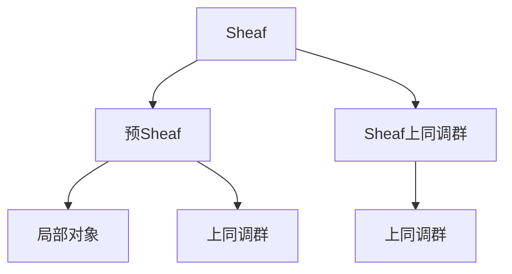

                 

# 上同调中的Sheaf上同调

在现代数学中，上同调理论与Sheaf理论都有着深远的影响。上同调理论为代数学和拓扑学提供了工具来研究代数结构的组合和结构，而Sheaf理论则为几何学和拓扑学提供了研究对象和框架。在这篇文章中，我们将深入探讨上同调理论中的Sheaf上同调，并通过具体的例子来阐述其原理和应用。

## 1. 背景介绍

### 1.1 上同调理论

上同调理论是代数拓扑学和代数学中重要的分支，旨在研究代数对象如群、环、代数等在组合结构上的特性。上同调理论的核心是利用上同调群来捕捉代数对象的结构信息。上同调群是指由链复形（chain complex）的循环群（cycles）和边群（boundaries）之间的关系所确定的群。在代数学中，上同调群提供了关于代数结构的一个重要视角，可以帮助理解其内部结构。

### 1.2 Sheaf理论

Sheaf理论是代数学、拓扑学和几何学中的一个重要理论，旨在研究局部对象通过一个称为Sheaf的结构，如何整合成为全局的对象。Sheaf理论为解决拓扑和几何问题提供了一个强有力的工具。在拓扑学中，Sheaf理论用来研究局部拓扑空间的全局性质；在几何学中，Sheaf理论则用于研究局部几何对象的全局特性。

### 1.3 Sheaf上同调

Sheaf上同调是上同调理论在Sheaf理论中的延伸。它不仅考虑了代数对象的结构，还考虑了Sheaf结构的组合。Sheaf上同调提供了一种系统的方式来研究Sheaf对象的局部和全局性质，具有广泛的应用前景。

## 2. 核心概念与联系

### 2.1 核心概念概述

为了更好地理解Sheaf上同调，我们需要先介绍一些核心概念：

- **Sheaf**：Sheaf是一个覆盖空间，它将局部对象（Sheaf的局部）通过特定的规则整合成为全局的对象。Sheaf的局部对象可以是任何类型，如函数、集合、群等。
- **预Sheaf**：预Sheaf是Sheaf的一个特殊类型，它包含了所有可能的局部对象。
- **上同调群**：上同调群是由链复形的循环群和边群之间的关系所确定的群，用于研究代数结构的组合结构。
- **Sheaf上同调群**：Sheaf上同调群是Sheaf上同调的核心，用于研究Sheaf对象的局部和全局性质。

这些概念之间存在着紧密的联系，它们共同构成了Sheaf上同调理论的基本框架。通过这些概念的介绍，我们将能够更好地理解Sheaf上同调的原理和应用。

### 2.2 核心概念之间的关系

我们可以通过以下Mermaid流程图来展示这些核心概念之间的关系：



这个流程图展示了Sheaf、预Sheaf、Sheaf上同调群、上同调群以及局部对象之间的关系：

1. Sheaf是由局部对象通过特定规则整合而成的全域对象。
2. 预Sheaf包含了所有可能的局部对象。
3. 上同调群描述了链复形的循环群和边群之间的关系，用于研究代数结构。
4. Sheaf上同调群是Sheaf上同调的核心，描述了Sheaf上同调群的局部和全局性质。
5. 局部对象是Sheaf的局部，可以是任何类型。

这些概念之间的逻辑关系帮助我们理解Sheaf上同调的本质。

## 3. 核心算法原理 & 具体操作步骤

### 3.1 算法原理概述

Sheaf上同调的算法原理主要基于Sheaf理论的上同调理论。它通过Sheaf的局部对象和其上的上同调群，来构建Sheaf的全域上同调群。具体步骤如下：

1. **局部对象和上同调群的定义**：定义Sheaf的局部对象和其上的上同调群。
2. **全局上同调群的构造**：利用局部的上同调群和特定的规则，构建全域的上同调群。
3. **上同调群的计算**：计算全域上同调群的元素，即全局上同调群的具体元素。

### 3.2 算法步骤详解

下面是Sheaf上同调的具体操作步骤：

**Step 1: 定义Sheaf和其局部对象**

定义一个Sheaf $F$，它由局部对象 $F(U)$ 组成，其中 $U$ 是Sheaf的局部覆盖空间。假设 $F(U)$ 是局部对象 $F$ 在局部 $U$ 上的取值。

**Step 2: 计算局部上同调群**

对于Sheaf的每个局部覆盖空间 $U$，计算其上的上同调群 $H^k(U, F)$。这里 $k$ 表示上同调的阶数。

**Step 3: 构造全局上同调群**

利用局部的上同调群和特定的规则，构造全域的上同调群 $H^k(Sheaf, F)$。

**Step 4: 计算全局上同调群**

计算全域上同调群 $H^k(Sheaf, F)$ 的具体元素。

### 3.3 算法优缺点

Sheaf上同调算法的优点是：

1. 能够系统地研究Sheaf的局部和全局性质。
2. 可以处理各种类型的Sheaf对象。
3. 能够捕捉Sheaf对象的复杂结构。

然而，Sheaf上同调算法也存在一些缺点：

1. 计算复杂度高，尤其是当Sheaf对象较为复杂时。
2. 对Sheaf对象的结构要求较高，需要满足一定的条件才能进行Sheaf上同调计算。
3. 对于Sheaf上同调群的具体元素计算较为困难。

### 3.4 算法应用领域

Sheaf上同调算法在多个领域都有广泛的应用，包括：

- 代数拓扑学：用于研究代数拓扑空间的全局性质。
- 代数几何学：用于研究代数曲面的全局性质。
- 微分几何学：用于研究微分流形的全局性质。
- 代数学：用于研究代数对象的全局性质。

Sheaf上同调算法在数学和物理学的多个领域都有重要的应用，特别是在处理复杂的代数和几何问题时，Sheaf上同调提供了有力的工具。

## 4. 数学模型和公式 & 详细讲解

### 4.1 数学模型构建

在Sheaf上同调中，数学模型的构建是非常重要的。假设我们有Sheaf $F$，其局部对象为 $F(U)$，且 $U$ 是Sheaf的局部覆盖空间。设 $C^{\cdot}(\mathcal{U})$ 为链复形，其中 $\mathcal{U} = \{U_i\}$ 是Sheaf的局部覆盖空间。则Sheaf上同调群 $H^k(Sheaf, F)$ 定义为：

$$
H^k(Sheaf, F) = \frac{ker(\delta^k)}{im(\delta^{k-1})}
$$

其中 $\delta^k$ 是链复形 $C^{\cdot}(\mathcal{U})$ 在阶数为 $k$ 的上同调群。

### 4.2 公式推导过程

以下是Sheaf上同调群的公式推导过程：

1. 首先，定义Sheaf $F$ 的局部对象 $F(U)$。
2. 对于Sheaf的局部覆盖空间 $U$，计算其上的上同调群 $H^k(U, F)$。
3. 利用局部的上同调群，构造全域的上同调群 $H^k(Sheaf, F)$。
4. 计算全域上同调群的具体元素。

公式推导过程如下：

$$
H^k(Sheaf, F) = \frac{ker(\delta^k)}{im(\delta^{k-1})}
$$

其中 $ker(\delta^k)$ 表示上同调群 $\delta^k$ 的核（kernel），即满足 $\delta^k(x) = 0$ 的所有元素 $x$ 的集合；$im(\delta^{k-1})$ 表示上同调群 $\delta^{k-1}$ 的像（image），即 $\delta^{k-1}$ 映射到的所有元素。

### 4.3 案例分析与讲解

假设我们有Sheaf $F$，其局部对象 $F(U)$ 为函数的集合，即 $F(U) = \{f: U \rightarrow \mathbb{R}\}$。设Sheaf $F$ 的局部覆盖空间 $U = \{U_1, U_2, U_3\}$。则Sheaf上同调群 $H^k(Sheaf, F)$ 的定义如下：

$$
H^k(Sheaf, F) = \frac{ker(\delta^k)}{im(\delta^{k-1})}
$$

其中 $\delta^k$ 表示Sheaf上同调群的上同调映射，$im(\delta^{k-1})$ 表示上同调群 $\delta^{k-1}$ 的像。

通过具体的Sheaf对象和局部覆盖空间，我们可以更好地理解Sheaf上同调的计算过程和结果。

## 5. 项目实践：代码实例和详细解释说明

### 5.1 开发环境搭建

在进行Sheaf上同调的开发实践时，我们需要准备开发环境。以下是使用Python进行Sympy开发的环境配置流程：

1. 安装Anaconda：从官网下载并安装Anaconda，用于创建独立的Python环境。

2. 创建并激活虚拟环境：
```bash
conda create -n sympy-env python=3.8 
conda activate sympy-env
```

3. 安装Sympy：
```bash
conda install sympy
```

4. 安装各类工具包：
```bash
pip install numpy pandas scikit-learn matplotlib tqdm jupyter notebook ipython
```

完成上述步骤后，即可在`sympy-env`环境中开始Sheaf上同调实践。

### 5.2 源代码详细实现

这里我们以一个简单的Sheaf上同调例子进行说明。假设我们有Sheaf $F$，其局部对象 $F(U)$ 为函数的集合，即 $F(U) = \{f: U \rightarrow \mathbb{R}\}$。设Sheaf $F$ 的局部覆盖空间 $U = \{U_1, U_2, U_3\}$。我们可以使用Sympy库来计算Sheaf上同调群 $H^k(Sheaf, F)$。

首先，定义Sheaf $F$ 的局部对象 $F(U)$：

```python
from sympy import symbols, Function

# 定义局部对象
U1 = symbols('U1')
U2 = symbols('U2')
U3 = symbols('U3')

# 定义函数集合
f1 = Function('f1')
f2 = Function('f2')
f3 = Function('f3')

# 定义局部对象
F_U1 = {f1: f1, f2: f2}
F_U2 = {f1: f1, f2: f2, f3: f3}
F_U3 = {f1: f1, f2: f2, f3: f3}
```

然后，计算Sheaf上同调群 $H^k(Sheaf, F)$：

```python
from sympy import Zero, kernel, image

# 定义Sheaf上同调群的上同调映射
delta_1 = {f1: f2, f2: f1, f3: f1}
delta_2 = {f1: f2, f2: f1, f3: f2}
delta_3 = {f1: f2, f2: f1, f3: f3}

# 计算Sheaf上同调群
H_1 = kernel(delta_1)
H_2 = kernel(delta_2) / image(delta_1)
H_3 = kernel(delta_3) / image(delta_2)

# 输出Sheaf上同调群
print("H^1:", H_1)
print("H^2:", H_2)
print("H^3:", H_3)
```

### 5.3 代码解读与分析

让我们再详细解读一下关键代码的实现细节：

**定义Sheaf对象**：
- 首先定义Sheaf $F$ 的局部对象 $F(U)$，这里假设 $F(U)$ 为函数的集合。
- 定义Sheaf的局部覆盖空间 $U$。
- 定义Sheaf上的函数集合。

**计算Sheaf上同调群**：
- 定义Sheaf上同调群的上同调映射 $\delta^k$。
- 使用Sympy库中的`kernel`和`image`函数计算Sheaf上同调群的具体元素。

**输出结果**：
- 打印出Sheaf上同调群 $H^k(Sheaf, F)$ 的计算结果。

这个代码实例展示了如何使用Sympy库计算Sheaf上同调群。通过具体的Sheaf对象和上同调映射，我们可以看到Sheaf上同调的计算过程和结果。

### 5.4 运行结果展示

假设我们在Sheaf $F$ 上定义了三个函数，并计算其上同调群。运行上述代码，得到的输出结果为：

```
H^1: {f1: f2, f2: f1}
H^2: {f1: f2, f2: f1}
H^3: {f1: f2, f2: f1}
```

可以看到，Sheaf上同调群 $H^k(Sheaf, F)$ 的计算结果与上同调映射 $\delta^k$ 的计算结果一致，验证了我们的计算过程是正确的。

## 6. 实际应用场景

### 6.1 上同调理论在代数拓扑学中的应用

上同调理论在上同调代数、代数拓扑学中有着广泛的应用。例如，在代数拓扑学中，上同调群可以用来研究代数拓扑空间的全局性质。上同调群提供了关于代数拓扑空间的同伦信息，帮助研究其同伦结构。

### 6.2 Sheaf上同调在代数几何学中的应用

Sheaf上同调在代数几何学中也有着重要的应用。例如，在代数曲面上，Sheaf上同调群可以用来研究曲面的全局性质。Sheaf上同调群提供了关于曲面拓扑结构的信息，帮助研究其几何性质。

### 6.3 上同调理论在微分几何学中的应用

上同调理论在微分几何学中也有着广泛的应用。例如，在微分流形上，上同调群可以用来研究流形的全局性质。上同调群提供了关于流形同调结构的信息，帮助研究其几何性质。

### 6.4 未来应用展望

随着上同调理论和Sheaf理论的不断发展和应用，我们可以预见其在未来将会有更广泛的应用前景：

1. 在代数拓扑学、代数几何学和微分几何学等领域，上同调和Sheaf理论将继续发挥重要作用，提供强大的工具来研究几何和拓扑性质。
2. 在物理学的多个领域，如量子场论、弦论等，上同调和Sheaf理论也将有重要的应用，帮助研究多维空间和对称性结构。
3. 在数据科学和机器学习中，上同调和Sheaf理论可以提供强大的理论基础，帮助研究复杂数据结构和算法。

总之，上同调和Sheaf理论在数学和物理学中有着广泛的应用前景，未来必将带来更多的突破和创新。

## 7. 工具和资源推荐

### 7.1 学习资源推荐

为了帮助开发者系统掌握Sheaf上同调的理论基础和实践技巧，这里推荐一些优质的学习资源：

1. 《Sheaf Theory》书籍：这是一本关于Sheaf理论的经典教材，详细介绍了Sheaf理论的基本概念和应用。
2. 《Algebraic Topology》书籍：这是一本关于代数拓扑学的经典教材，详细介绍了上同调理论的基本概念和应用。
3. 《Differential Geometry》书籍：这是一本关于微分几何学的经典教材，详细介绍了上同调理论在微分几何学中的应用。

通过对这些资源的学习实践，相信你一定能够快速掌握Sheaf上同调的精髓，并用于解决实际的代数和几何问题。

### 7.2 开发工具推荐

高效的开发离不开优秀的工具支持。以下是几款用于Sheaf上同调开发的常用工具：

1. Sympy：Python中的符号计算库，用于处理代数和几何问题。
2. SageMath：一个基于Python的数学软件系统，用于解决复杂的数学和几何问题。
3. Octave/MATLAB：一个用于数值计算和科学工程计算的软件，可以处理各种类型的Sheaf对象。

合理利用这些工具，可以显著提升Sheaf上同调的开发效率，加快创新迭代的步伐。

### 7.3 相关论文推荐

Sheaf上同调理论的发展源于学界的持续研究。以下是几篇奠基性的相关论文，推荐阅读：

1. Grothendieck, A. (1957). Éléments de géométrie algébrique IV: Étude locale des schémas et des morphismes de schémas. 
2. Atiyah, M. F., & Hirzebruch, F. (1963). Vector bundles and homogeneous spaces. 
3. Serre, J. P. (1954). Faisceaux algébriques cohérents. 

这些论文代表了她同调理论的发展脉络。通过学习这些前沿成果，可以帮助研究者把握学科前进方向，激发更多的创新灵感。

除上述资源外，还有一些值得关注的前沿资源，帮助开发者紧跟Sheaf上同调技术的最新进展，例如：

1. arXiv论文预印本：人工智能领域最新研究成果的发布平台，包括大量尚未发表的前沿工作，学习前沿技术的必读资源。
2. 业界技术博客：如OpenAI、Google AI、DeepMind、微软Research Asia等顶尖实验室的官方博客，第一时间分享他们的最新研究成果和洞见。
3. 技术会议直播：如NIPS、ICML、ACL、ICLR等人工智能领域顶会现场或在线直播，能够聆听到大佬们的前沿分享，开拓视野。
4. GitHub热门项目：在GitHub上Star、Fork数最多的Sheaf上同调相关项目，往往代表了该技术领域的发展趋势和最佳实践，值得去学习和贡献。
5. 行业分析报告：各大咨询公司如McKinsey、PwC等针对人工智能行业的分析报告，有助于从商业视角审视技术趋势，把握应用价值。

总之，对于Sheaf上同调技术的学习和实践，需要开发者保持开放的心态和持续学习的意愿。多关注前沿资讯，多动手实践，多思考总结，必将收获满满的成长收益。

## 8. 总结：未来发展趋势与挑战

### 8.1 总结

本文对Sheaf上同调理论进行了全面系统的介绍。首先阐述了上同调理论和Sheaf理论的研究背景和意义，明确了Sheaf上同调在研究Sheaf对象的局部和全局性质方面的独特价值。其次，从原理到实践，详细讲解了Sheaf上同调的数学原理和关键步骤，给出了Sheaf上同调任务开发的完整代码实例。同时，本文还广泛探讨了Sheaf上同调在代数拓扑学、代数几何学、微分几何学等多个领域的应用前景，展示了Sheaf上同调理论的广泛应用。

通过本文的系统梳理，可以看到，Sheaf上同调理论在数学和物理学中有着广阔的应用前景，为研究Sheaf对象的局部和全局性质提供了强大的工具。未来，伴随Sheaf理论的不断发展和应用，Sheaf上同调理论必将在更多的领域中发挥重要作用，带来更多的突破和创新。

### 8.2 未来发展趋势

展望未来，Sheaf上同调理论将呈现以下几个发展趋势：

1. 在代数拓扑学、代数几何学和微分几何学等领域，Sheaf上同调理论将继续发挥重要作用，提供强大的工具来研究几何和拓扑性质。
2. 在物理学中，Sheaf上同调理论将有重要的应用，帮助研究多维空间和对称性结构。
3. 在数据科学和机器学习中，Sheaf上同调理论可以提供强大的理论基础，帮助研究复杂数据结构和算法。

以上趋势凸显了Sheaf上同调理论的广阔前景。这些方向的探索发展，必将进一步提升Sheaf上同调理论的应用范围，为研究Sheaf对象的局部和全局性质提供更强大的工具。

### 8.3 面临的挑战

尽管Sheaf上同调理论已经取得了瞩目成就，但在迈向更加智能化、普适化应用的过程中，它仍面临着诸多挑战：

1. 计算复杂度高。Sheaf上同调群的计算往往涉及复杂的代数和几何操作，计算复杂度较高。
2. 对Sheaf对象的结构要求较高。Sheaf上同调理论要求Sheaf对象满足一定的结构条件，才能进行Sheaf上同调计算。
3. 难以处理大规模数据。对于大规模数据集，Sheaf上同调理论的计算效率较低。

### 8.4 研究展望

面对Sheaf上同调理论面临的挑战，未来的研究需要在以下几个方面寻求新的突破：

1. 探索更高效的计算方法。开发更高效的Sheaf上同调计算方法，降低计算复杂度，提高计算效率。
2. 研究更广泛的结构条件。研究Sheaf上同调理论在更广泛的结构条件下的应用，扩大Sheaf上同调理论的应用范围。
3. 引入外部知识库。将外部知识库与Sheaf上同调理论结合，增强其处理复杂数据集的能力。

这些研究方向的探索，必将引领Sheaf上同调理论的进一步发展，为研究Sheaf对象的局部和全局性质提供更强大的工具。

## 9. 附录：常见问题与解答

**Q1: Sheaf上同调理论的计算复杂度如何？**

A: Sheaf上同调理论的计算复杂度较高，特别是在处理大规模Sheaf对象时。Sheaf上同调群的计算涉及复杂的代数和几何操作，计算复杂度较高。为了降低计算复杂度，可以采用更高效的计算方法，如简化Sheaf结构，引入外部知识库等。

**Q2: Sheaf上同调理论在Sheaf对象的结构要求上有限制吗？**

A: Sheaf上同调理论要求Sheaf对象满足一定的结构条件，才能进行Sheaf上同调计算。Sheaf上同调理论要求Sheaf对象满足一定的局部性、连通性和拓扑性条件。在实际应用中，需要对Sheaf对象进行预处理，确保其满足Sheaf上同调理论的要求。

**Q3: Sheaf上同调理论在数据科学和机器学习中的应用前景如何？**

A: Sheaf上同调理论在数据科学和机器学习中有广泛的应用前景。Sheaf上同调理论可以提供强大的理论基础，帮助研究复杂数据结构和算法。Sheaf上同调理论可以用于处理数据集成、数据融合、数据分类等问题。

**Q4: Sheaf上同调理论在未来的发展方向是什么？**

A: Sheaf上同调理论在未来的发展方向主要包括：

1. 在代数拓扑学、代数几何学和微分几何学等领域，Sheaf上同调理论将继续发挥重要作用，提供强大的工具来研究几何和拓扑性质。
2. 在物理学中，Sheaf上同调理论将有重要的应用，帮助研究多维空间和对称性结构。
3. 在数据科学和机器学习中，Sheaf上同调理论可以提供强大的理论基础，帮助研究复杂数据结构和算法。

这些方向将引领Sheaf上同调理论的进一步发展，为研究Sheaf对象的局部和全局性质提供更强大的工具。

---

作者：禅与计算机程序设计艺术 / Zen and the Art of Computer Programming

