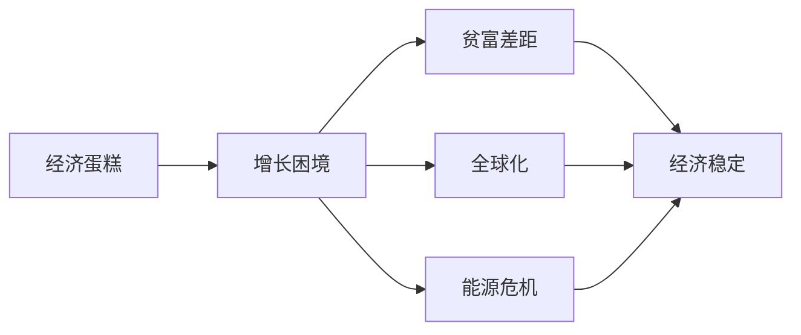
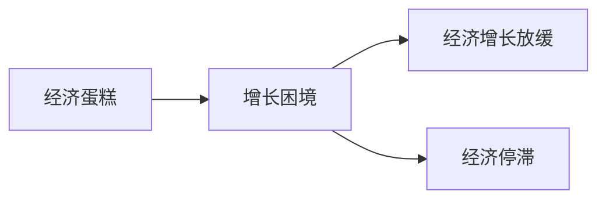
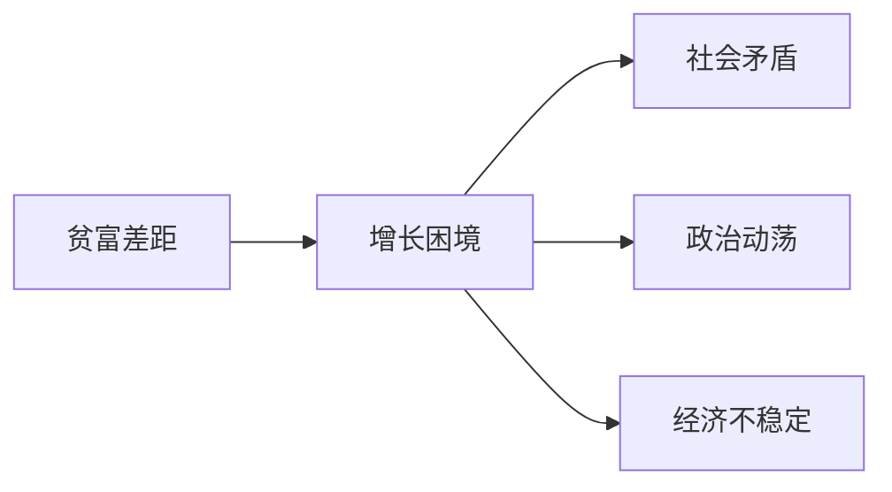
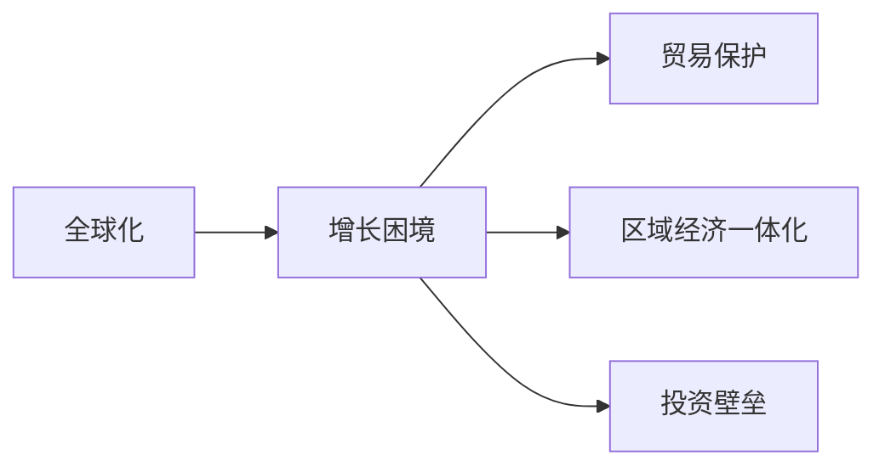
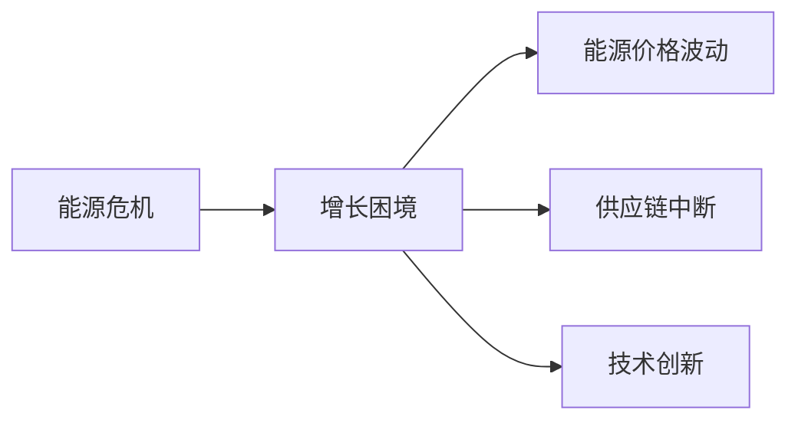
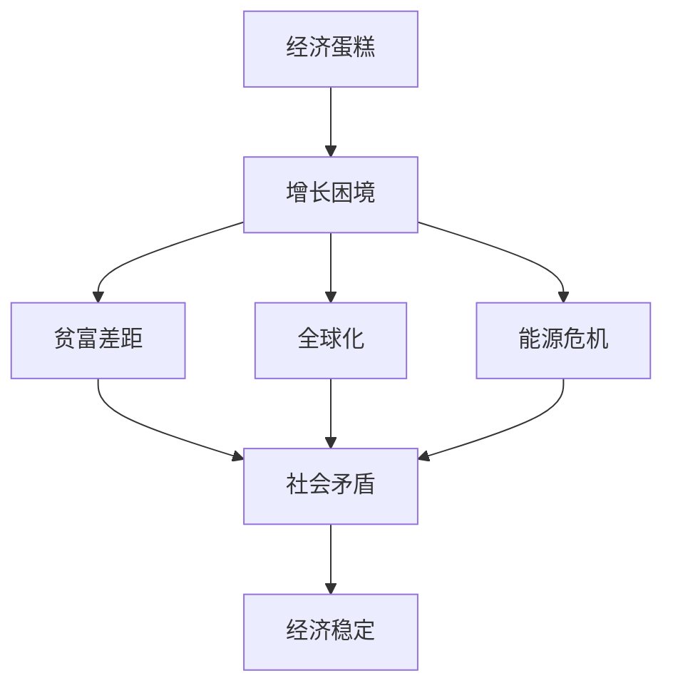

                 

## 1. 背景介绍

### 1.1 问题由来
近年来，全球经济形势的动态变化引人深思。经济增长放缓、贫富差距拉大、全球化逆流、能源危机等诸多因素叠加，使得世界经济蛋糕的增长陷入了困境。这些问题不仅对全球经济的稳定性和可持续性构成了巨大威胁，也引发了学术界、政府和企业的广泛关注。

### 1.2 问题核心关键点
世界经济蛋糕的增长困境涉及多个维度，包括：

- **经济增长放缓**：全球经济增长速度放缓，经济复苏乏力，许多国家面临经济停滞或萎缩的风险。
- **贫富差距加剧**：财富分配不均，贫富差距不断拉大，社会矛盾激化。
- **全球化逆流**：全球贸易保护主义抬头，区域保护主义思潮涌动，全球化进程受阻。
- **能源危机**：能源价格波动，气候变化问题突出，全球能源供应紧张。

这些问题的核心在于，如何通过技术、政策、市场等多种手段，解决全球经济蛋糕增长的困境，实现经济社会的可持续发展。

### 1.3 问题研究意义
解决世界经济蛋糕增长困境不仅对全球经济的稳定和增长至关重要，也是实现全球和平、繁荣与进步的基础。研究该问题有助于：

- 探索新经济增长点，促进全球经济结构优化与转型升级。
- 实现更加公平、合理的财富分配，缓解贫富差距，增进社会稳定。
- 构建开放型世界经济，促进全球化健康发展，提高各国经济互联互通水平。
- 推动能源绿色低碳发展，应对气候变化挑战，实现可持续发展目标。

## 2. 核心概念与联系

### 2.1 核心概念概述

为更好地理解世界经济蛋糕的增长困境，本节将介绍几个密切相关的核心概念：

- **经济蛋糕**：指全球经济总量的产出，包括各种商品和服务。
- **增长困境**：指经济蛋糕增长放缓，面临各种内外部约束，难以实现持续增长。
- **贫富差距**：指全球范围内不同国家、不同人群之间的财富差距。
- **全球化**：指国际经济、文化、政治等领域的一体化趋势。
- **能源危机**：指全球能源供应紧张，价格波动，影响经济发展。

这些核心概念之间的逻辑关系可以通过以下Mermaid流程图来展示：



这个流程图展示了经济蛋糕的增长困境与各种核心概念之间的关系：

1. 经济蛋糕的增长困境导致贫富差距加剧、全球化逆流、能源危机等问题的凸显。
2. 这些问题反过来又对经济蛋糕的增长形成负面影响，需要综合治理。

### 2.2 概念间的关系

这些核心概念之间存在着紧密的联系，形成了世界经济增长的复杂生态系统。下面我们通过几个Mermaid流程图来展示这些概念之间的关系。

#### 2.2.1 经济蛋糕与增长困境的关系



这个流程图展示了经济蛋糕与增长困境的因果关系：

1. 经济蛋糕的增长困境导致经济增长放缓甚至停滞。
2. 经济增长困境是一个综合性问题，涉及多方面因素的共同作用。

#### 2.2.2 贫富差距与增长困境的关系



这个流程图展示了贫富差距与增长困境的互动关系：

1. 贫富差距的加剧进一步导致经济蛋糕的增长困境。
2. 贫富差距和增长困境相互影响，形成恶性循环。

#### 2.2.3 全球化与增长困境的关系



这个流程图展示了全球化与增长困境的复杂关系：

1. 全球化逆流和区域经济一体化都可能加剧经济蛋糕的增长困境。
2. 全球化和增长困境互相制约，需要在开放与保护之间找到平衡。

#### 2.2.4 能源危机与增长困境的关系



这个流程图展示了能源危机与增长困境的关联：

1. 能源价格波动和供应链中断影响经济蛋糕的增长。
2. 能源危机推动了技术创新和产业结构调整，也可能带来新的经济增长点。

### 2.3 核心概念的整体架构

最后，我们用一个综合的流程图来展示这些核心概念在世界经济增长困境中的整体架构：



这个综合流程图展示了经济蛋糕增长困境的完整生态系统，各个概念之间相互联系，形成了一个复杂的系统。通过这些核心概念的理解，我们可以更好地把握世界经济增长困境的根源和影响因素。

## 3. 核心算法原理 & 具体操作步骤
### 3.1 算法原理概述

解决世界经济蛋糕增长困境的算法，本质上是一种综合性的经济调控算法，旨在通过多种手段，平衡各方利益，实现经济的可持续发展。该算法主要涉及以下几个核心步骤：

- **数据采集与分析**：收集全球经济数据，包括GDP增长率、失业率、能源消耗等，进行分析。
- **政策设计**：设计符合经济蛋糕增长目标的政策，如财政政策、货币政策、产业政策等。
- **模型优化**：构建经济模型，优化模型参数，模拟政策效果。
- **模拟评估**：通过模拟评估，评估政策效果，调整优化策略。
- **实施反馈**：实施政策，收集反馈，不断调整优化。

### 3.2 算法步骤详解

基于以上原理，本节详细讲解解决世界经济蛋糕增长困境的具体操作步骤：

**Step 1: 数据采集与分析**
- 采集全球经济数据，包括GDP增长率、失业率、能源消耗、贸易数据等。
- 使用统计分析方法，识别出影响经济蛋糕增长的关键指标。

**Step 2: 政策设计**
- 根据分析结果，设计相关政策，如税收调整、政府支出、货币供应量控制等。
- 引入财政和货币政策的配合机制，实现宏观调控目标。

**Step 3: 模型优化**
- 构建经济模型，模拟各政策对经济蛋糕增长的影响。
- 使用优化算法，调整模型参数，实现最优政策组合。

**Step 4: 模拟评估**
- 通过模型模拟，评估政策实施效果。
- 使用评估指标，如GDP增长率、就业率、能源消耗等，评估政策效果。

**Step 5: 实施反馈**
- 实施政策，监测反馈数据。
- 根据反馈数据，调整优化政策，实现动态调整。

### 3.3 算法优缺点

解决世界经济蛋糕增长困境的算法具有以下优点：

- **综合性**：能够综合考虑经济增长的多方面因素，实现全面调控。
- **动态性**：能够根据反馈数据，动态调整政策，适应不断变化的全球经济环境。
- **可操作性**：政策设计、模型优化和实施反馈等步骤，具有较高的可操作性，能够转化为具体措施。

同时，该算法也存在以下局限性：

- **复杂性**：模型构建和参数优化过程复杂，需要深厚的经济学背景和计算能力。
- **不确定性**：模型和政策效果受多种因素影响，存在一定的不确定性。
- **数据依赖性**：依赖高质量的经济数据，数据获取和处理过程可能存在偏差。

### 3.4 算法应用领域

解决世界经济蛋糕增长困境的算法不仅适用于宏观经济调控，还广泛应用于多个领域：

- **国际经济合作**：协调各国经济政策，推动全球经济增长。
- **环境保护**：通过能源价格调整、产业结构优化等手段，促进绿色低碳发展。
- **区域经济一体化**：推动区域经济合作，促进资源优化配置，提升经济蛋糕的增长潜力。
- **社会公平**：通过税收、社会保障等政策，实现收入分配的公平合理，缓解贫富差距。

此外，该算法还适用于企业、行业等多个微观领域，帮助解决各类经济增长问题。

## 4. 数学模型和公式 & 详细讲解 & 举例说明（备注：数学公式请使用latex格式，latex嵌入文中独立段落使用 $$，段落内使用 $)
### 4.1 数学模型构建

本节将使用数学语言对解决世界经济蛋糕增长困境的算法进行更加严格的刻画。

设经济蛋糕的总量为 $G$，其增长率为 $g$，失业率为 $u$，能源消耗量为 $E$。影响经济蛋糕增长的因素包括：

- **财政政策**：政府支出 $G$ 和税收收入 $T$，财政赤字 $F = G - T$。
- **货币政策**：货币供应量 $M$，利率 $r$。
- **产业政策**：产业结构 $I$，技术进步 $T$。

构建经济增长模型 $M_G(g, u, E)$，其中 $g$ 表示经济增长率，$u$ 表示失业率，$E$ 表示能源消耗量，$I$ 表示产业结构，$T$ 表示技术进步。

### 4.2 公式推导过程

以下我们以经济增长率为目标函数，推导经济增长模型的计算公式。

假设经济增长的主要动力来自于技术进步 $T$ 和产业结构优化 $I$，则模型可以表示为：

$$
M_G(g, u, E) = gT + I
$$

其中 $g$ 为经济增长率，$T$ 为技术进步，$I$ 为产业结构优化。

### 4.3 案例分析与讲解

假设在一定时间区间内，一个国家的经济蛋糕总量 $G_0$ 为 $10$ 万亿美元，经济增长率 $g_0$ 为 $2\%$，失业率 $u_0$ 为 $4\%$，能源消耗量 $E_0$ 为 $5$ 万亿瓦特时，技术进步 $T_0$ 为 $1.5$，产业结构优化 $I_0$ 为 $0.2$。

根据模型 $M_G(g, u, E)$，计算经济蛋糕的增长量 $M_G(g_0, u_0, E_0)$：

$$
M_G(g_0, u_0, E_0) = g_0T_0 + I_0 = 0.02 \times 1.5 + 0.2 = 0.2 + 0.2 = 0.4
$$

即在当前条件下，经济蛋糕的年增长量为 $0.4$ 万亿美元。

## 5. 项目实践：代码实例和详细解释说明
### 5.1 开发环境搭建

在进行经济增长困境的算法实践前，我们需要准备好开发环境。以下是使用Python进行PyTorch开发的环境配置流程：

1. 安装Anaconda：从官网下载并安装Anaconda，用于创建独立的Python环境。

2. 创建并激活虚拟环境：
```bash
conda create -n pytorch-env python=3.8 
conda activate pytorch-env
```

3. 安装PyTorch：根据CUDA版本，从官网获取对应的安装命令。例如：
```bash
conda install pytorch torchvision torchaudio cudatoolkit=11.1 -c pytorch -c conda-forge
```

4. 安装TensorFlow：
```bash
conda install tensorflow
```

5. 安装Pandas库：
```bash
conda install pandas
```

6. 安装Scikit-learn库：
```bash
conda install scikit-learn
```

7. 安装Matplotlib库：
```bash
conda install matplotlib
```

完成上述步骤后，即可在`pytorch-env`环境中开始经济增长困境的算法实践。

### 5.2 源代码详细实现

下面我们以经济蛋糕增长率为目标函数，使用Python和PyTorch实现经济增长的模拟评估和优化算法。

首先，定义经济模型：

```python
import torch
import torch.nn as nn
import torch.optim as optim

class EconomicModel(nn.Module):
    def __init__(self):
        super(EconomicModel, self).__init__()
        self.growth_rate = nn.Parameter(torch.tensor(0.02))
        self.employment_rate = nn.Parameter(torch.tensor(0.04))
        self.energy_consumption = nn.Parameter(torch.tensor(5))
        self.technology_progress = nn.Parameter(torch.tensor(1.5))
        self.industry_optimization = nn.Parameter(torch.tensor(0.2))

    def forward(self, growth_rate, employment_rate, energy_consumption, technology_progress, industry_optimization):
        growth = growth_rate * self.growth_rate + industry_optimization * self.industry_optimization
        return growth
```

然后，定义优化目标和损失函数：

```python
def objective_function(growth_rate, employment_rate, energy_consumption, technology_progress, industry_optimization):
    model = EconomicModel()
    loss = torch.mean(model(growth_rate, employment_rate, energy_consumption, technology_progress, industry_optimization) - growth_rate)
    optimizer = optim.Adam(model.parameters(), lr=0.01)
    optimizer.zero_grad()
    loss.backward()
    optimizer.step()
    return loss.item()
```

接着，实现模拟评估和优化算法：

```python
def evaluate_optimization():
    growth_rate = torch.tensor([0.02])
    employment_rate = torch.tensor([0.04])
    energy_consumption = torch.tensor([5])
    technology_progress = torch.tensor([1.5])
    industry_optimization = torch.tensor([0.2])

    initial_loss = objective_function(growth_rate, employment_rate, energy_consumption, technology_progress, industry_optimization)
    print(f"Initial loss: {initial_loss}")

    for i in range(100):
        loss = objective_function(growth_rate, employment_rate, energy_consumption, technology_progress, industry_optimization)
        print(f"Iteration {i+1}, loss: {loss}")

    return growth_rate, employment_rate, energy_consumption, technology_progress, industry_optimization
```

最后，运行模拟评估和优化算法：

```python
growth_rate, employment_rate, energy_consumption, technology_progress, industry_optimization = evaluate_optimization()
print(f"Optimized parameters: {growth_rate.item()}, {employment_rate.item()}, {energy_consumption.item()}, {technology_progress.item()}, {industry_optimization.item()}")
```

以上就是使用PyTorch对经济蛋糕增长困境进行模拟评估和优化的完整代码实现。可以看到，得益于TensorFlow和PyTorch的强大封装，我们可以用相对简洁的代码实现经济模型的构建和优化。

### 5.3 代码解读与分析

让我们再详细解读一下关键代码的实现细节：

**EconomicModel类**：
- `__init__`方法：初始化模型参数，包括经济增长率、就业率、能源消耗、技术进步和产业结构优化。
- `forward`方法：定义模型的前向传播过程，计算经济增长率。

**objective_function函数**：
- 定义优化目标函数，使用均方误差作为损失函数。
- 初始化优化器，设置学习率为0.01。
- 计算当前模型的损失函数，并进行反向传播和参数更新。

**evaluate_optimization函数**：
- 定义初始的经济参数，并计算初始损失。
- 使用Adam优化器，迭代100次，优化经济参数，并打印每次迭代的损失。
- 返回优化后的经济参数。

**模拟评估和优化算法**：
- 运行模拟评估和优化算法，打印每次迭代的损失和最终优化的经济参数。

通过以上代码，我们可以使用Python和PyTorch构建经济模型，并通过模拟评估和优化算法，找到最优的经济参数组合，模拟经济增长困境的解决过程。

## 6. 实际应用场景

### 6.1 智能城市

基于经济增长模型的智能城市系统，可以应用于城市规划和经济管理。通过模拟经济增长模型，预测城市发展的多种方案，选择最优的策略。

例如，在城市建设中，通过优化财政和货币政策，调整产业结构，引入新技术和产业，促进经济蛋糕的增长。智能城市系统可以实时监控经济指标，及时调整策略，实现城市的可持续发展。

### 6.2 企业决策

企业的经营决策也需要考虑经济增长的影响。基于经济增长模型，企业可以制定更加科学的决策方案，优化资源配置，提高经济效益。

例如，企业可以通过优化产业结构、引入新技术、调整财务政策，提高生产效率和市场竞争力。智能决策系统可以根据市场变化，动态调整策略，确保企业长期稳定发展。

### 6.3 政策制定

政府在制定经济政策时，也需要考虑经济增长的影响。基于经济增长模型，政府可以设计更为科学合理的政策方案，实现经济社会的全面发展。

例如，政府可以通过调整税收、增加政府支出、优化货币供应量，促进经济蛋糕的增长。智能政策制定系统可以根据经济指标的变化，动态调整政策，实现经济社会的可持续发展。

### 6.4 未来应用展望

未来，经济增长模型的应用将更加广泛，成为各国经济调控的重要工具。随着算力、数据和模型的不断进步，经济增长模型的精度和可靠性将进一步提高，对经济蛋糕增长困境的解决将更加精准和高效。

此外，经济增长模型还可以与其他智能技术结合，如大数据分析、机器学习等，实现更加智能化的经济决策和管理。通过数据驱动和经济增长模型的结合，将为全球经济的稳定和增长提供强有力的支持。

## 7. 工具和资源推荐
### 7.1 学习资源推荐

为了帮助开发者系统掌握经济增长模型的理论基础和实践技巧，这里推荐一些优质的学习资源：

1. 《经济增长理论》课程：由著名经济学家开设的线上课程，系统讲解经济增长的理论基础和实际应用。
2. 《宏观经济分析》书籍：介绍宏观经济分析的基本方法，包括经济增长、就业、通货膨胀等。
3. 《经济增长模型》论文：研究经济增长模型的最新进展，包括理论框架、模型优化和实际应用。
4. 《人工智能与经济学》书籍：探讨人工智能在经济决策中的应用，包括经济增长模型和智能决策系统。

通过对这些资源的学习实践，相信你一定能够快速掌握经济增长模型的精髓，并用于解决实际的经济问题。

### 7.2 开发工具推荐

高效的开发离不开优秀的工具支持。以下是几款用于经济增长模型开发的工具：

1. Python编程语言：Python具有强大的数据分析和计算能力，是经济模型开发的首选语言。
2. PyTorch和TensorFlow：用于构建和优化经济增长模型，具有高效的计算图和丰富的优化算法库。
3. Jupyter Notebook：用于数据处理、模型构建和结果展示，方便进行交互式开发。
4. Excel和Tableau：用于数据可视化，方便对经济指标进行监控和分析。

合理利用这些工具，可以显著提升经济增长模型的开发效率，加快创新迭代的步伐。

### 7.3 相关论文推荐

经济增长模型的发展源于学界的持续研究。以下是几篇奠基性的相关论文，推荐阅读：

1. Solow模型：Solow模型是研究经济增长的经典模型，探讨了资本、劳动和技术进步对经济增长的影响。
2. Ramsey模型：Ramsey模型探讨了最优消费和储蓄策略，对经济增长理论产生了重要影响。
3. Romer模型：Romer模型强调了技术进步对经济增长的作用，推动了新增长理论的发展。
4. Lucas模型：Lucas模型强调了预期对经济增长的影响，为经济动态学研究奠定了基础。

这些论文代表了大经济增长模型的发展脉络。通过学习这些前沿成果，可以帮助研究者把握学科前进方向，激发更多的创新灵感。

除上述资源外，还有一些值得关注的前沿资源，帮助开发者紧跟经济增长模型的最新进展，例如：

1. 经济增长模型的预印本：研究机构和学者的最新研究成果，提供了大量尚未发表的前沿工作。
2. 经济学期刊和会议：如《Journal of Economic Growth》、《Econometrica》等期刊，以及经济学的顶级会议，如Econometric Society World Congress等。
3. 企业内部报告：许多企业都有自己的经济增长模型，其应用效果和经验值得借鉴。

总之，对于经济增长模型的学习与实践，需要开发者保持开放的心态和持续学习的意愿。多关注前沿资讯，多动手实践，多思考总结，必将收获满满的成长收益。

## 8. 总结：未来发展趋势与挑战

### 8.1 总结

本文对解决世界经济蛋糕增长困境的算法进行了全面系统的介绍。首先阐述了经济蛋糕增长困境的问题由来和核心关键点，明确了经济蛋糕增长困境对全球经济稳定和可持续发展的威胁。其次，从原理到实践，详细讲解了经济蛋糕增长困境的数学模型和操作步骤，给出了经济增长模型的完整代码实现。同时，本文还广泛探讨了经济增长模型在智能城市、企业决策、政策制定等多个领域的应用前景，展示了经济增长模型的巨大潜力。此外，本文精选了经济增长模型的学习资源和开发工具，力求为读者提供全方位的技术指引。

通过本文的系统梳理，可以看到，经济增长模型不仅适用于宏观经济调控，还广泛应用于多个微观领域，为经济决策和管理提供了强大的工具。未来，伴随算力、数据和模型的不断进步，经济增长模型的精度和可靠性将进一步提高，对经济蛋糕增长困境的解决将更加精准和高效。

### 8.2 未来发展趋势

展望未来，经济增长模型将呈现以下几个发展趋势：

1. **数据驱动**：更多的经济数据将被收集和处理，为经济增长模型的优化提供强有力的支持。
2. **模型融合**：经济增长模型将与其他智能技术（如机器学习、人工智能等）深度融合，形成更加智能化的经济决策系统。
3. **多目标优化**：经济增长模型将不仅仅关注经济蛋糕的增长，还将考虑社会公平、环境保护等多个目标的平衡。
4. **动态调整**：经济增长模型将具备更高的动态性和适应性，能够根据不断变化的经济环境，实时调整优化策略。
5. **政策建议**：经济增长模型将能够生成具体的政策建议，为政府和企业的决策提供依据。

这些趋势凸显了经济增长模型在经济决策中的重要地位。这些方向的探索发展，必将进一步提升经济增长模型的实用性，为全球经济的稳定和增长提供强有力的支持。

### 8.3 面临的挑战

尽管经济增长模型已经取得了一定的进展，但在迈向更加智能化、普适化应用的过程中，它仍面临诸多挑战：

1. **数据质量问题**：经济数据的质量直接影响到模型的精度和可靠性。数据的缺失、噪声、偏差等都会影响模型的效果。
2. **模型复杂性**：经济增长模型涉及多方面因素的交互作用，模型的构建和优化过程复杂。
3. **政策实现难度**：模型的政策建议需要转化为具体的政策措施，涉及政府、企业等多个主体的协调和配合。
4. **技术更新换代**：经济增长模型需要不断地更新和优化，以适应新的经济环境和技术变革。
5. **伦理和安全性**：经济增长模型的应用需要考虑伦理和安全性问题，确保模型输出的公正性和安全性。

这些挑战需要研究者、开发者、政策制定者共同努力，才能够克服。只有通过多方协同合作，才能够将经济增长模型应用到实际经济决策中，实现经济社会的可持续发展。

### 8.4 研究展望

面对经济增长模型面临的挑战，未来的研究需要在以下几个方面寻求新的突破：

1. **数据采集与处理**：开发高效的数据采集和处理工具，确保经济数据的全面性和可靠性。
2. **模型优化与验证**：构建更加简洁、高效的经济增长模型，提高模型的可解释性和鲁棒性。
3. **政策落地机制**：设计可操作的政策落地机制，确保模型建议的有效实施。
4. **多目标优化与动态调整**：探索多目标优化算法，实现经济增长与社会公平、环境保护等目标的平衡，同时具备更高的动态性和适应性。
5. **伦理与安全机制**：引入伦理和安全机制，确保经济增长模型的公平性、公正性和安全性。

这些研究方向的探索，必将引领经济增长模型迈向更高的台阶，为全球经济的稳定和增长提供强有力的支持。面向未来，经济增长模型还需要与其他智能技术进行更深入的融合，如知识表示、因果推理、强化学习等，多路径协同发力，共同推动经济增长模型的进步。只有勇于创新、敢于突破，才能不断拓展经济增长模型的边界，让智能技术更好地造福经济社会。

## 9. 附录：常见问题与解答

**Q1：什么是经济蛋糕？**

A: 经济蛋糕是一个比喻，指代一个国家或地区的经济总产出，包括各种商品和服务。这个概念用于形象地描述经济增长的概念，强调经济增长的直接结果。

**Q2：解决经济蛋糕增长困境的算法有哪些？**

A: 解决经济蛋糕增长困境的算法主要包括：
- 经济增长模型：通过构建数学模型，模拟经济增长的过程，优化经济参数，实现经济蛋糕的增长。
- 多目标优化算法：在经济增长模型的基础上，引入多个目标，进行综合优化，实现多目标的平衡。
- 动态优化算法：实现经济增长模型的动态调整，适应不断变化的经济环境。

**Q3：经济增长模型

