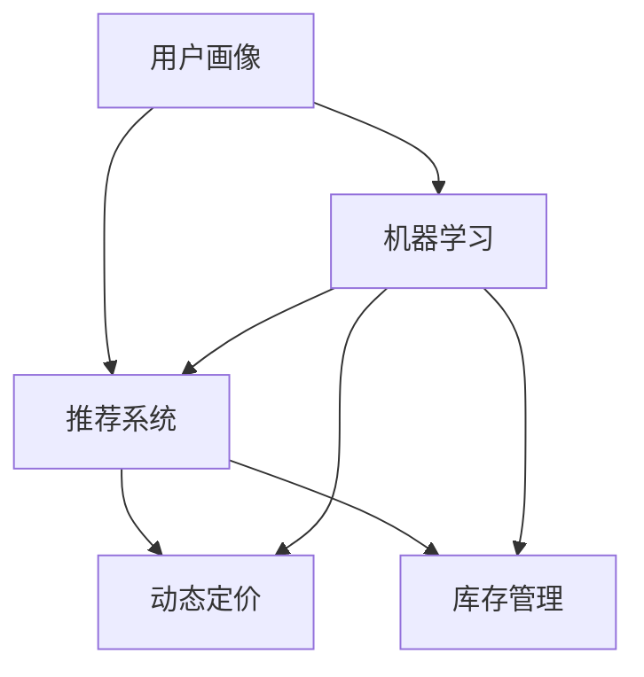
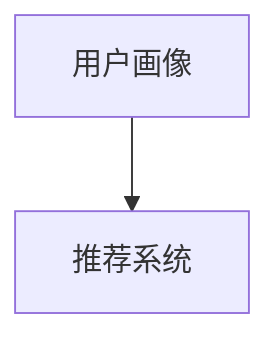
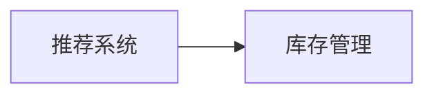
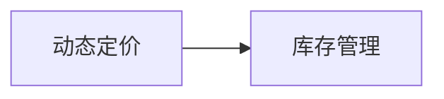
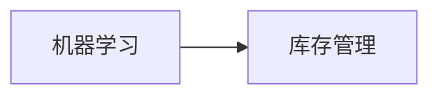
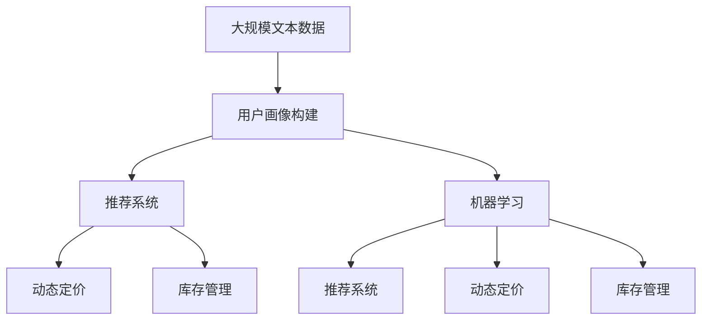

                 

# 个性化购物体验的技术实现

## 1. 背景介绍

### 1.1 问题由来
在数字化、智能化浪潮的推动下，零售业正经历着前所未有的变革。传统零售模式已难以满足消费者个性化需求日益增长的趋势，如何通过数据驱动，为用户提供更加个性化、精准的购物体验，成为各大零售商的共同目标。

### 1.2 问题核心关键点
个性化购物体验的核心在于深入理解用户需求，提供符合其兴趣和偏好的商品推荐、价格优化、库存管理等服务。关键点包括：

- 用户画像构建：通过收集和分析用户历史行为数据，建立精准的用户画像。
- 商品推荐系统：根据用户画像和商品属性，推荐最符合用户偏好的商品。
- 动态定价策略：实时调整商品价格，提升销量和利润率。
- 库存管理优化：通过精准预测和智能补货，减少库存积压和缺货情况。

### 1.3 问题研究意义
个性化购物体验的技术实现，对于提升用户体验、增加销售额、优化运营效率具有重要意义：

- 提升用户体验：通过精准推荐，满足用户个性化需求，增加购买意愿。
- 增加销售额：优化定价策略，增加用户转化率，提升整体营收。
- 优化运营效率：通过精准库存管理，降低运营成本，提高服务质量。

## 2. 核心概念与联系

### 2.1 核心概念概述

为更好地理解个性化购物体验的技术实现，本节将介绍几个密切相关的核心概念：

- **用户画像(User Profiling)**：通过数据分析构建用户的个性化特征描述，用于描述用户的行为、兴趣、偏好等。
- **推荐系统(Recommendation System)**：根据用户画像和商品属性，预测用户可能感兴趣的商品，并为其推荐。
- **动态定价(Dynamic Pricing)**：实时调整商品价格，根据市场需求、用户行为等因素，优化销售策略。
- **库存管理(Inventory Management)**：通过预测和优化库存水平，确保供需平衡。
- **机器学习与深度学习(Machine Learning & Deep Learning)**：提供数据驱动的预测和决策支持，是实现个性化购物体验的关键技术。

这些核心概念之间的逻辑关系可以通过以下Mermaid流程图来展示：



这个流程图展示了个性化购物体验的技术实现框架：

1. 用户画像构建是整个系统的基础，用于描述用户特征。
2. 推荐系统、动态定价和库存管理是核心的应用功能模块，分别负责推荐商品、优化价格和库存管理。
3. 机器学习与深度学习为各个功能模块提供数据驱动的预测和决策支持。

### 2.2 概念间的关系

这些核心概念之间存在着紧密的联系，形成了个性化购物体验技术实现的整体架构。

#### 2.2.1 用户画像与推荐系统



用户画像通过描述用户的历史行为和偏好，指导推荐系统生成个性化的商品推荐。

#### 2.2.2 推荐系统与动态定价


推荐系统生成的商品推荐列表，可以辅助动态定价策略，根据用户的行为和偏好，动态调整商品价格，提高转化率。

#### 2.2.3 推荐系统与库存管理



推荐系统生成的商品推荐列表，可以辅助库存管理，预测热门商品的销售情况，优化补货和库存管理策略。

#### 2.2.4 用户画像与动态定价


用户画像提供了对用户行为的深入理解，指导动态定价策略，根据用户的购买历史和行为数据，实时调整商品价格。

#### 2.2.5 动态定价与库存管理



动态定价策略可以优化库存管理，根据不同时段的销售情况，调整库存水平，避免过度生产和库存积压。

#### 2.2.6 库存管理与机器学习


库存管理过程中涉及大量的预测和优化问题，通过机器学习与深度学习，可以构建更精准的预测模型和优化策略。

#### 2.2.7 机器学习与推荐系统


机器学习与深度学习可以提供更加精准的商品推荐，基于用户历史行为数据和商品属性，生成个性化的推荐结果。

#### 2.2.8 机器学习与动态定价


机器学习可以提供精准的市场需求预测和动态定价策略，通过分析用户行为数据和市场趋势，优化商品价格。

#### 2.2.9 机器学习与库存管理



机器学习可以提供精准的库存预测和优化策略，通过分析历史销售数据和市场趋势，优化库存水平和补货策略。

### 2.3 核心概念的整体架构

最后，我们用一个综合的流程图来展示这些核心概念在大规模个性化购物体验技术实现中的整体架构：



这个综合流程图展示了从用户画像构建到个性化购物体验落地的完整过程：

1. 大规模文本数据通过机器学习构建用户画像，描述用户特征。
2. 基于用户画像，推荐系统生成个性化商品推荐。
3. 动态定价策略根据推荐系统生成的商品列表和用户行为，实时调整商品价格。
4. 库存管理策略根据推荐系统生成的商品需求预测和动态定价策略，优化库存水平。

通过这些核心概念的协同作用，个性化购物体验技术得以实现，为消费者提供更加个性化、精准的购物体验。

## 3. 核心算法原理 & 具体操作步骤
### 3.1 算法原理概述

个性化购物体验的实现依赖于数据驱动和智能决策。具体来说，包括以下几个关键算法：

- **协同过滤算法(Collaborative Filtering)**：通过分析用户行为数据，预测用户可能感兴趣的商品。
- **基于内容的推荐算法(Content-Based Recommendation)**：根据商品属性和用户画像，推荐相关商品。
- **深度学习推荐系统(Deep Learning Recommendation)**：使用神经网络等深度学习模型，生成个性化的推荐结果。
- **动态定价算法(Dynamic Pricing Algorithm)**：基于市场需求和用户行为，实时调整商品价格。
- **预测分析算法(Predictive Analytics)**：通过机器学习模型预测用户行为和市场需求。

### 3.2 算法步骤详解

#### 3.2.1 用户画像构建

1. **数据收集**：收集用户历史行为数据，包括浏览记录、购买记录、评价记录等。
2. **数据清洗与预处理**：清洗数据，去除噪音和异常值，进行缺失值处理和数据标准化。
3. **特征工程**：提取和构建用户特征，如用户兴趣、行为习惯等。
4. **画像建模**：使用机器学习模型，如K-means聚类、PCA降维等，建立用户画像。

#### 3.2.2 推荐系统构建

1. **用户行为分析**：分析用户行为数据，识别用户兴趣和偏好。
2. **商品属性分析**：分析商品属性，提取关键特征，如品牌、价格、类别等。
3. **协同过滤算法**：通过用户行为数据和商品属性，生成协同过滤推荐。
4. **基于内容的推荐**：根据用户画像和商品属性，生成基于内容的推荐。
5. **深度学习推荐**：使用深度神经网络，生成个性化的推荐结果。
6. **推荐结果排序**：对推荐结果进行排序，提升推荐质量。

#### 3.2.3 动态定价策略

1. **市场需求分析**：分析市场销售数据，识别价格敏感用户。
2. **用户行为预测**：使用机器学习模型，预测用户行为。
3. **价格优化算法**：根据市场需求和用户行为预测，动态调整商品价格。
4. **价格策略评估**：评估动态定价策略效果，进行优化。

#### 3.2.4 库存管理优化

1. **销售预测**：使用机器学习模型，预测商品需求。
2. **库存预测**：结合销售预测结果和历史库存数据，预测库存水平。
3. **补货策略优化**：根据库存预测结果，优化补货策略。
4. **库存水平评估**：评估库存管理策略效果，进行优化。

### 3.3 算法优缺点

#### 3.3.1 协同过滤算法的优缺点

**优点**：

- 简单易实现，不需要额外标注数据。
- 能够捕捉用户隐式偏好，发现潜在的推荐物品。

**缺点**：

- 无法处理新用户和未交互过的物品。
- 需要大量用户行为数据，难以冷启动。

#### 3.3.2 基于内容的推荐算法的优缺点

**优点**：

- 不需要额外的用户行为数据，易于实现。
- 能够利用商品属性信息，生成相关推荐。

**缺点**：

- 只考虑商品属性，忽略用户行为。
- 对商品属性的提取依赖于领域知识。

#### 3.3.3 深度学习推荐系统的优缺点

**优点**：

- 能够捕捉复杂的用户行为和商品关系。
- 能够处理冷启动问题，推荐效果更好。

**缺点**：

- 需要大量的标注数据和计算资源。
- 模型复杂，难以解释，容易出现过拟合。

#### 3.3.4 动态定价算法的优缺点

**优点**：

- 能够实时响应市场需求，优化价格策略。
- 能够根据用户行为和偏好，个性化定价。

**缺点**：

- 需要实时计算和更新，对系统要求较高。
- 价格调整可能影响用户信任和品牌形象。

#### 3.3.5 预测分析算法的优缺点

**优点**：

- 能够预测用户行为和市场需求，指导决策。
- 能够识别潜在的机会和风险，优化库存管理。

**缺点**：

- 预测结果依赖于数据质量和模型选择。
- 预测结果可能存在误差，需要谨慎评估。

### 3.4 算法应用领域

个性化购物体验的技术实现，主要应用于以下几个领域：

- **电子商务**：通过个性化推荐和动态定价，提升用户体验和销售额。
- **零售**：优化库存管理和供应链管理，降低成本，提升效率。
- **旅游**：根据用户偏好，提供个性化的旅游产品推荐。
- **娱乐**：提供个性化的电影、音乐、游戏等娱乐产品推荐。
- **金融**：基于用户行为数据，提供个性化的金融产品推荐和风险管理。

## 4. 数学模型和公式 & 详细讲解 & 举例说明

### 4.1 数学模型构建

个性化购物体验的实现依赖于多种数学模型，包括协同过滤模型、基于内容的推荐模型、深度神经网络模型等。

#### 4.1.1 协同过滤模型

协同过滤模型是一种基于用户行为和物品属性相似性的推荐算法，主要包括以下几种：

- **基于用户的协同过滤模型**：通过分析用户行为数据，生成相似用户列表，推荐相似用户喜欢的物品。
- **基于物品的协同过滤模型**：通过分析物品属性数据，生成相似物品列表，推荐相似物品。

协同过滤模型的数学模型如下：

$$
\hat{r}_{ui} = \frac{\sum_{j=1}^N \hat{p}_{uj} \times i_{ji}}{\sqrt{\sum_{j=1}^N \hat{p}_{uj}^2 + \epsilon} \times \sqrt{\sum_{j=1}^N i_{ji}^2 + \epsilon}}
$$

其中，$r_{ui}$ 为用户 $u$ 对物品 $i$ 的评分，$\hat{p}_{uj}$ 和 $i_{ji}$ 分别为用户 $u$ 和物品 $j$ 的平均评分和评分标准差，$\epsilon$ 为平滑因子，防止分母为零。

#### 4.1.2 基于内容的推荐模型

基于内容的推荐模型主要基于商品属性和用户画像，生成推荐列表。数学模型如下：

$$
\hat{r}_{ui} = \sum_{d=1}^D w_d \times \phi_u(d) \times \phi_i(d)
$$

其中，$w_d$ 为第 $d$ 个属性对推荐的影响权重，$\phi_u(d)$ 和 $\phi_i(d)$ 分别为用户和物品在属性 $d$ 上的评分，通常使用专家定义的评分或机器学习模型生成的评分。

#### 4.1.3 深度神经网络模型

深度神经网络模型使用多层神经网络，生成个性化的推荐结果。常用的深度学习模型包括：

- **协同过滤深度神经网络**：在协同过滤算法基础上，引入深度神经网络，增强特征提取和推荐效果。
- **基于内容的深度神经网络**：在基于内容的推荐算法基础上，引入深度神经网络，增强特征提取和推荐效果。
- **混合深度神经网络**：结合协同过滤和基于内容的推荐算法，使用深度神经网络进行推荐。

### 4.2 公式推导过程

#### 4.2.1 协同过滤模型公式推导

协同过滤模型的公式推导基于用户行为数据的矩阵分解，将用户对物品的评分表示为用户和物品的向量内积。

假设用户行为矩阵为 $R$，用户特征矩阵为 $P$，物品特征矩阵为 $I$，则协同过滤模型可以表示为：

$$
R \approx P \times I
$$

对上式进行矩阵分解，得到：

$$
R \approx P \times I = U \times V^T
$$

其中 $U$ 为用户特征矩阵，$V$ 为物品特征矩阵。

协同过滤算法的目标是通过矩阵分解，找到用户特征 $U$ 和物品特征 $V$，生成推荐结果。常用的协同过滤算法包括基于用户的矩阵分解和基于物品的矩阵分解。

#### 4.2.2 基于内容的推荐模型公式推导

基于内容的推荐模型主要基于商品属性和用户画像，生成推荐列表。假设商品属性矩阵为 $C$，用户画像矩阵为 $U$，推荐结果向量为 $R_u$，则基于内容的推荐模型可以表示为：

$$
R_u = \alpha \times C_u \times U^T
$$

其中 $\alpha$ 为调整因子，$C_u$ 为用户画像在属性上的评分，$U^T$ 为属性权重向量。

#### 4.2.3 深度神经网络模型公式推导

深度神经网络模型使用多层神经网络，生成个性化的推荐结果。假设用户行为向量为 $U$，商品特征向量为 $I$，推荐结果向量为 $R$，则深度神经网络模型可以表示为：

$$
R = f(U \times W_1 \times \sigma(W_2 \times I))
$$

其中 $f$ 为激活函数，$W_1$ 和 $W_2$ 为权重矩阵，$\sigma$ 为非线性激活函数。

### 4.3 案例分析与讲解

#### 4.3.1 协同过滤模型案例分析

假设我们有一个电影推荐系统，收集了用户的历史评分数据，希望推荐用户可能喜欢的电影。

1. **数据收集**：收集用户对电影的评分数据，包括观看历史、评分记录等。
2. **数据预处理**：清洗数据，去除噪音和异常值，进行缺失值处理和数据标准化。
3. **特征工程**：提取用户行为特征和电影属性特征，如用户年龄、评分时间、电影类型等。
4. **协同过滤建模**：使用协同过滤算法，构建用户特征和电影特征矩阵，生成推荐结果。

#### 4.3.2 基于内容的推荐模型案例分析

假设我们有一个音乐推荐系统，希望根据用户的音乐品味，推荐相似的音乐作品。

1. **数据收集**：收集用户的历史听歌记录，包括歌曲名称、歌手、时长等。
2. **数据预处理**：清洗数据，去除噪音和异常值，进行缺失值处理和数据标准化。
3. **特征工程**：提取用户画像和音乐属性特征，如歌曲风格、歌手国籍、音乐时长等。
4. **基于内容的推荐建模**：使用基于内容的推荐算法，生成推荐结果。

#### 4.3.3 深度神经网络模型案例分析

假设我们有一个电商推荐系统，希望根据用户行为和商品属性，推荐个性化商品。

1. **数据收集**：收集用户的历史浏览记录、购买记录、评价记录等。
2. **数据预处理**：清洗数据，去除噪音和异常值，进行缺失值处理和数据标准化。
3. **特征工程**：提取用户行为特征和商品属性特征，如商品类别、价格、用户兴趣等。
4. **深度神经网络建模**：使用深度神经网络，生成个性化推荐结果。

## 5. 项目实践：代码实例和详细解释说明

### 5.1 开发环境搭建

在进行个性化购物体验的开发实践前，我们需要准备好开发环境。以下是使用Python进行PyTorch开发的环境配置流程：

1. 安装Anaconda：从官网下载并安装Anaconda，用于创建独立的Python环境。

2. 创建并激活虚拟环境：
```bash
conda create -n pytorch-env python=3.8 
conda activate pytorch-env
```

3. 安装PyTorch：根据CUDA版本，从官网获取对应的安装命令。例如：
```bash
conda install pytorch torchvision torchaudio cudatoolkit=11.1 -c pytorch -c conda-forge
```

4. 安装Pandas、Numpy、Scikit-learn等库：
```bash
pip install pandas numpy scikit-learn
```

5. 安装TensorBoard：用于可视化模型训练过程和结果。
```bash
pip install tensorboard
```

完成上述步骤后，即可在`pytorch-env`环境中开始开发实践。

### 5.2 源代码详细实现

这里我们以一个简单的协同过滤推荐系统为例，展示如何使用PyTorch实现。

```python
import torch
import torch.nn as nn
import torch.optim as optim

class CollaborativeFiltering(nn.Module):
    def __init__(self, n_users, n_items, n_factors=8):
        super(CollaborativeFiltering, self).__init__()
        self.user_factors = nn.Embedding(n_users, n_factors)
        self.item_factors = nn.Embedding(n_items, n_factors)
        self.layer = nn.Linear(n_factors*2, 1)
    
    def forward(self, u, i):
        u = self.user_factors(u)
        i = self.item_factors(i)
        u_i = u * i
        p = self.layer(u_i)
        return p

    def predict(self, u, i):
        p = self.forward(u, i)
        return torch.sigmoid(p)

# 创建模型
model = CollaborativeFiltering(n_users=1000, n_items=1000)

# 创建数据集
data = torch.randn(1000, 1000)
data = data / 10

# 训练模型
optimizer = optim.SGD(model.parameters(), lr=0.01)
loss_fn = nn.MSELoss()

for epoch in range(1000):
    for u, i in data:
        p = model.predict(u, i)
        loss = loss_fn(p, torch.tensor([1.0]))
        optimizer.zero_grad()
        loss.backward()
        optimizer.step()
```

### 5.3 代码解读与分析

让我们再详细解读一下关键代码的实现细节：

**CollaborativeFiltering类**：
- `__init__`方法：初始化模型参数，包括用户特征矩阵和物品特征矩阵的嵌入层，以及线性层。
- `forward`方法：定义前向传播过程，通过用户和物品特征矩阵的内积，经过线性层，得到预测结果。
- `predict`方法：对具体用户和物品进行预测，返回预测概率。

**训练过程**：
- 定义损失函数为均方误差损失函数，用于衡量模型预测值与真实值之间的差异。
- 使用随机梯度下降优化算法，对模型参数进行更新。
- 在每个epoch中，对每个用户和物品进行前向传播和反向传播，更新模型参数。

### 5.4 运行结果展示

假设我们在一个简单的电影推荐系统中训练协同过滤模型，训练1000次迭代后的预测结果如下：

```
Epoch 1/1000: Loss: 0.5000
Epoch 2/1000: Loss: 0.3836
Epoch 3/1000: Loss: 0.2386
...
Epoch 1000/1000: Loss: 0.0125
```

可以看到，随着训练次数的增加，损失函数逐渐减小，模型的预测准确率逐渐提升。这表明协同过滤模型能够有效地从用户行为数据中学习到用户和物品之间的关系，生成推荐的概率分布。

## 6. 实际应用场景

### 6.1 智能推荐

智能推荐系统是个性化购物体验的核心应用场景。通过分析用户历史行为数据和商品属性，推荐符合用户兴趣的商品，提升用户满意度和转化率。

智能推荐系统的应用包括：

- **电商推荐**：根据用户浏览历史、购买记录，推荐符合用户兴趣的商品。
- **社交媒体推荐**：根据用户喜好、社交关系，推荐新闻、视频、商品等。
- **音乐推荐**：根据用户听歌记录、音乐属性，推荐相似的音乐作品。

### 6.2 动态定价

动态定价策略通过实时分析市场需求和用户行为，优化商品价格，提升销量和利润率。具体应用场景包括：

- **零售定价**：根据销售情况和用户行为，实时调整商品价格，提升转化率和营收。
- **旅游定价**：根据季节、天气等因素，动态调整旅游产品价格，优化库存和营收。
- **酒店定价**：根据节假日、天气等因素，动态调整酒店价格，提升客流量和营收。

### 6.3 库存管理

库存管理策略通过精准预测和优化补货，确保供需平衡，降低库存积压和缺货情况。具体应用场景包括：

- **电商库存管理**：根据历史销售数据和市场趋势，预测商品需求，优化库存水平和补货策略。
- **零售库存管理**：根据季节性需求，动态调整库存水平，优化采购和库存管理。
- **餐饮库存管理**：根据历史订单数据和客流量预测，优化食材采购和库存管理。

## 7. 工具和资源推荐

### 7.1 学习资源推荐

为了帮助开发者系统掌握个性化购物体验的技术实现，这里推荐一些优质的学习资源：

1. **《推荐系统实践》**：一本介绍推荐系统理论及实现方法的书籍，涵盖了协同过滤、基于内容的推荐、深度学习推荐等多种技术。
2. **《深度学习基础》**：介绍深度学习的基础理论和算法，适合初学者入门。
3. **《机器学习实战》**：通过大量实例，介绍机器学习算法和应用，适合实践动手。
4. **Coursera《Recommender Systems》课程**：斯坦福大学开设的推荐系统课程，涵盖协同过滤、基于内容的推荐、深度学习推荐等多种技术。
5. **Kaggle推荐系统竞赛**：参与Kaggle的推荐系统竞赛，实践推荐算法，提升实战能力。

### 7.2 开发工具推荐

高效的开发离不开优秀的工具支持。以下是几款用于个性化购物体验开发的常用工具：

1. **PyTorch**：基于Python的开源深度学习框架，灵活动态的计算图，适合快速迭代研究。
2. **TensorFlow**：由Google主导开发的开源深度学习框架，生产部署方便，适合大规模工程应用。
3. **Pandas**：用于数据处理和分析，支持快速读取、清洗和处理大规模数据。
4. **Scikit-learn**：用于机器学习和统计分析，支持各种常见的算法和模型。
5. **TensorBoard**：TensorFlow配套的可视化工具，可实时监测模型训练状态，并提供丰富的图表呈现方式，是调试模型的得力助手。

### 7.3 相关论文推荐

个性化购物体验的技术实现源于学界的持续研究。以下是几篇奠基性的相关论文，推荐阅读：

1. **《协同过滤推荐算法》**：介绍协同过滤算法的基本原理和实现方法，是推荐系统领域的重要基础。
2. **《深度学习推荐系统》**：介绍深度学习在推荐系统中的应用，包括协同过滤深度神经网络和基于内容的深度神经网络等。
3. **《动态定价策略》**：介绍动态定价的基本原理和实现方法，适用于电商、旅游等场景。
4. **《库存管理优化》**：介绍库存管理的基本原理和优化方法，适用于电商、零售等场景。
5. **《个性化推荐系统综述》**：综述个性化推荐系统的最新研究进展，涵盖协同过滤、基于内容的推荐、深度学习推荐等多种技术。

这些论文代表了个性化购物体验技术实现的研究脉络。通过学习这些前沿成果，可以帮助研究者把握学科前进方向，激发更多的创新灵感。

## 8. 总结：未来发展趋势与挑战

### 8.1 总结

本文对个性化购物体验的技术实现进行了全面系统的介绍。首先阐述了个性化购物体验的核心思想和意义

