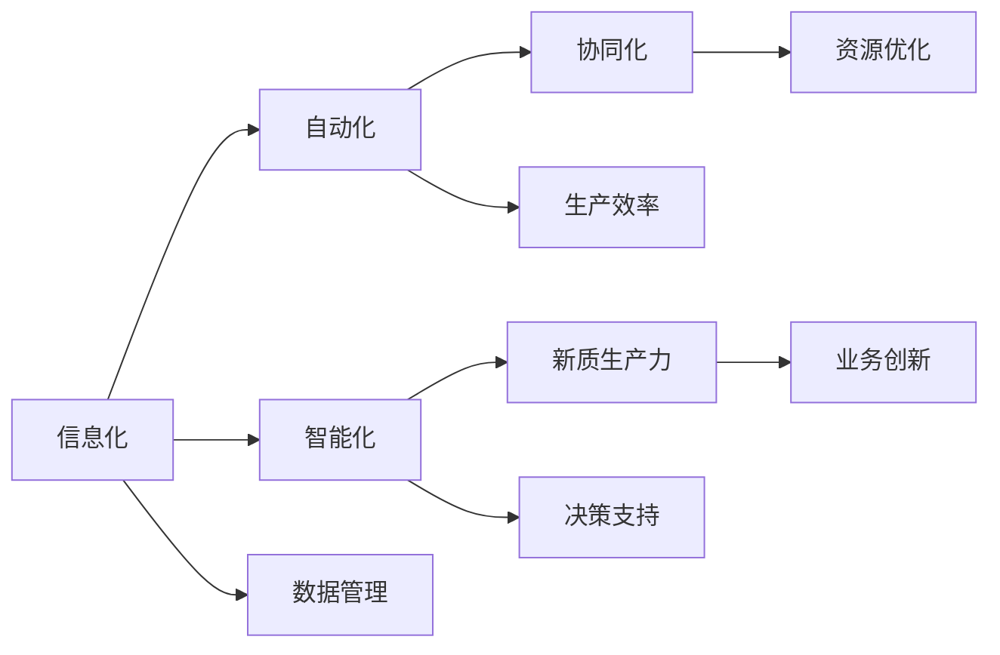
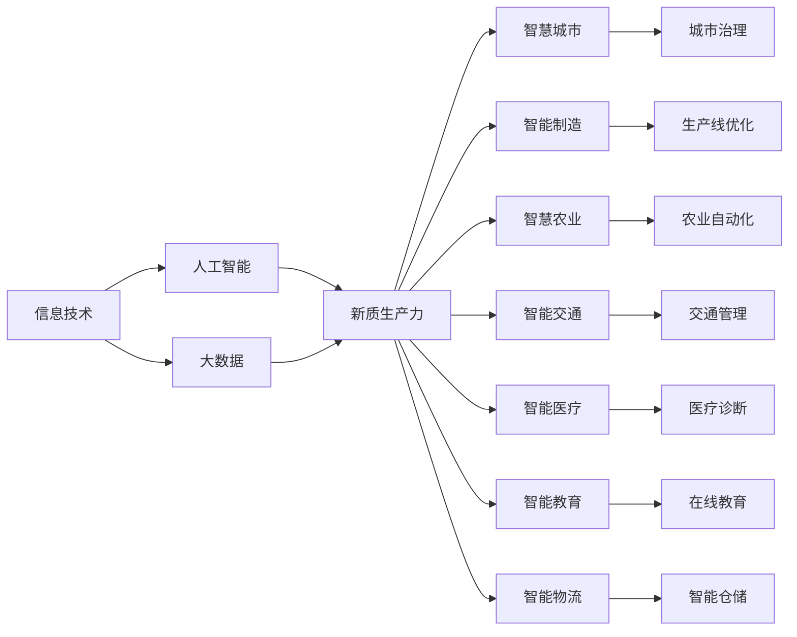

                 

# 中国现代化的重要引擎：新质生产力

## 1. 背景介绍

### 1.1 问题由来
中国正处于快速发展的现代化进程中，面临着诸多挑战和机遇。作为一个拥有千年文化历史和广阔国土的国家，如何在保证传统文化和价值观的同时，迅速崛起为世界强国，成为国内外广泛关注的话题。在这一进程中，新质生产力的角色日益突出，成为推动中国现代化的重要引擎。

新质生产力是一种基于信息技术、人工智能、大数据等新兴技术的高效生产力形式，与传统生产力有本质的区别。新质生产力的关键在于其跨越时空的即时通讯和协同工作能力，使得全球化资源整合和价值创造成为可能。

### 1.2 问题核心关键点
新质生产力涵盖了信息技术、人工智能、大数据等多个技术领域，具有高度的技术复杂性和应用广度。其主要特征包括：

- 高度信息化：依赖计算机网络、云计算、物联网等技术，实现数据的快速收集和处理。
- 高度自动化：通过自动化和智能化的生产流程，提高生产效率和质量。
- 高度协同化：促进不同地域、不同行业的协同合作，实现资源的最优化配置。
- 高度智能化：运用人工智能算法进行决策和分析，提升生产力的智能化水平。

新质生产力作为一种新型的生产力形式，正在改变传统产业的运作模式和价值创造方式，成为推动中国现代化进程的重要力量。

### 1.3 问题研究意义
研究新质生产力，对于理解中国现代化的动力和路径，具有重要的理论和现实意义：

- 揭示现代化背后的技术驱动力，有助于制定更加科学的发展策略。
- 明确新质生产力的应用范围，指导产业升级和技术创新。
- 分析新质生产力的优势和劣势，为政策制定提供依据。
- 探讨新质生产力的未来发展趋势，把握未来的机遇和挑战。

## 2. 核心概念与联系

### 2.1 核心概念概述

为更好地理解新质生产力的原理和应用，本节将介绍几个核心概念及其相互联系：

- **新质生产力(Quasi-Productive Power)**：基于信息技术、人工智能、大数据等新兴技术的高效生产力形式，具有高度信息化、自动化、协同化和智能化特征。
- **信息化(Informationization)**：通过计算机网络、云计算、物联网等技术，实现数据的快速收集和处理。
- **自动化(Automation)**：通过机器人和智能算法，实现生产流程的自动化和智能化。
- **协同化(Collaboration)**：通过分布式计算和网络技术，促进不同地域、不同行业的协同合作。
- **智能化(Intelligence)**：运用人工智能算法进行决策和分析，提升生产力的智能化水平。

这些概念之间存在着紧密的联系，共同构成了新质生产力的完整生态系统。

### 2.2 概念间的关系

这些核心概念之间存在着紧密的联系，形成了新质生产力的完整生态系统。以下是几个关键的Mermaid流程图，展示这些概念之间的相互关系：



这个流程图展示了新质生产力生态系统的关键组件及其相互关系：

1. 信息化是自动化、协同化和智能化实现的基础，通过计算机网络、云计算、物联网等技术，实现数据的快速收集和处理。
2. 自动化通过机器人和智能算法，实现生产流程的自动化和智能化。
3. 协同化通过分布式计算和网络技术，促进不同地域、不同行业的协同合作。
4. 智能化运用人工智能算法进行决策和分析，提升生产力的智能化水平。
5. 新质生产力是信息化、自动化、协同化和智能化的结合体，实现了高效的生产力和价值创造。

### 2.3 核心概念的整体架构

最后，我们用一个综合的流程图来展示这些核心概念在新质生产力生态系统中的整体架构：



这个综合流程图展示了新质生产力在智慧城市、智能制造、智慧农业、智能交通、智能医疗、智能教育、智能物流等各个领域的具体应用场景，体现了新质生产力的广泛影响和巨大潜力。

## 3. 核心算法原理 & 具体操作步骤
### 3.1 算法原理概述

新质生产力的核心算法原理基于信息技术、人工智能和大数据等技术手段，实现数据的快速收集和处理、生产流程的自动化和智能化、不同地域和行业的协同合作。其核心算法包括：

- **分布式计算算法**：通过分布式计算技术，实现数据的快速处理和存储。
- **机器学习算法**：通过机器学习和深度学习算法，实现生产流程的自动化和智能化。
- **协同网络算法**：通过网络技术，实现不同地域、不同行业的协同合作。

这些算法共同构成了新质生产力的技术基础，实现了高效的生产力和价值创造。

### 3.2 算法步骤详解

新质生产力的实现过程可以分为以下几个关键步骤：

**Step 1: 数据收集和处理**

- 通过传感器、网络技术等手段，收集生产过程中的各类数据。
- 使用分布式计算技术，将数据进行快速处理和存储。
- 对数据进行清洗和预处理，确保数据的准确性和完整性。

**Step 2: 自动化生产流程**

- 通过机器人和智能算法，实现生产流程的自动化和智能化。
- 对生产设备进行智能化改造，提高生产效率和质量。
- 使用机器学习算法，实现生产过程的预测和优化。

**Step 3: 协同网络建设**

- 构建协同网络平台，实现不同地域、不同行业的协同合作。
- 通过网络技术，实现资源的优化配置。
- 促进信息共享和知识交流，提升生产力的协同化水平。

**Step 4: 智能决策和分析**

- 运用人工智能算法，进行生产过程中的决策和分析。
- 通过智能算法，实现生产的优化和预测。
- 使用数据挖掘和机器学习算法，实现业务的创新和优化。

通过这些关键步骤，新质生产力可以高效地实现生产力的提升和价值创造。

### 3.3 算法优缺点

新质生产力的优点在于：

- **高效性**：通过自动化和智能化的生产流程，大大提高生产效率和质量。
- **协同化**：通过协同网络平台，实现不同地域、不同行业的协同合作，优化资源配置。
- **智能化**：通过人工智能算法进行决策和分析，提升生产力的智能化水平。

同时，新质生产力也存在一些缺点：

- **依赖技术**：需要高度依赖信息技术和大数据等新兴技术，对技术基础设施和人才要求较高。
- **成本较高**：初期投资较大，特别是在技术和人才培训方面。
- **安全问题**：需要考虑数据安全和隐私保护，防止数据泄露和滥用。

尽管存在这些缺点，新质生产力的高效性和智能化特性，使其成为推动中国现代化进程的重要引擎。

### 3.4 算法应用领域

新质生产力已经在诸多领域得到了广泛应用，以下是一些典型的应用场景：

- **智慧城市**：通过大数据和智能算法，实现城市治理和公共服务的智能化。
- **智能制造**：通过自动化和智能化的生产流程，提升制造业的生产效率和质量。
- **智慧农业**：通过物联网和智能算法，实现农业生产的自动化和智能化。
- **智能交通**：通过智能算法和大数据分析，实现交通管理的智能化和优化。
- **智能医疗**：通过人工智能算法，提升医疗诊断和健康管理的智能化水平。
- **智能教育**：通过在线教育和智能算法，实现教育的个性化和智能化。
- **智能物流**：通过物联网和智能算法，实现物流管理的智能化和优化。

这些应用场景展示了新质生产力的广泛影响和巨大潜力，为各个行业带来了深刻的变革和机遇。

## 4. 数学模型和公式 & 详细讲解 & 举例说明

### 4.1 数学模型构建

新质生产力的实现过程可以建模为以下几个关键阶段：

1. 数据收集和处理：模型化数据收集和处理过程，确保数据的准确性和完整性。
2. 自动化生产流程：模型化生产流程的自动化和智能化过程，提高生产效率和质量。
3. 协同网络建设：模型化协同网络平台的建设过程，实现不同地域、不同行业的协同合作。
4. 智能决策和分析：模型化智能决策和分析过程，提升生产力的智能化水平。

这些模型的建立，有助于更好地理解新质生产力的实现过程和技术手段。

### 4.2 公式推导过程

以下是新质生产力在智能制造领域的具体数学建模和公式推导过程：

**Step 1: 数据收集和处理**

假设数据收集过程为 $D_{in}(t)$，数据处理过程为 $D_{out}(t)$，数据清洗和预处理过程为 $D_{clean}(t)$，数据存储过程为 $D_{store}(t)$。

则数据收集和处理的总模型为：

$$
D_{total}(t) = D_{in}(t) + D_{out}(t) + D_{clean}(t) + D_{store}(t)
$$

其中 $D_{total}(t)$ 表示在时间 $t$ 时刻的总数据量，$D_{in}(t)$ 表示输入数据量，$D_{out}(t)$ 表示输出数据量，$D_{clean}(t)$ 表示清洗和预处理的数据量，$D_{store}(t)$ 表示存储的数据量。

**Step 2: 自动化生产流程**

假设生产过程为 $P_{prod}(t)$，自动化和智能化过程为 $P_{auto}(t)$，生产效率为 $P_{eff}(t)$，生产质量为 $P_{qual}(t)$。

则自动化生产流程的总模型为：

$$
P_{total}(t) = P_{prod}(t) + P_{auto}(t) + P_{eff}(t) + P_{qual}(t)
$$

其中 $P_{total}(t)$ 表示在时间 $t$ 时刻的总生产过程，$P_{prod}(t)$ 表示原始生产过程，$P_{auto}(t)$ 表示自动化和智能化过程，$P_{eff}(t)$ 表示生产效率，$P_{qual}(t)$ 表示生产质量。

**Step 3: 协同网络建设**

假设协同网络建设过程为 $N_{col}(t)$，资源优化过程为 $N_{res}(t)$，信息共享过程为 $N_{share}(t)$，知识交流过程为 $N_{know}(t)$。

则协同网络建设的总模型为：

$$
N_{total}(t) = N_{col}(t) + N_{res}(t) + N_{share}(t) + N_{know}(t)
$$

其中 $N_{total}(t)$ 表示在时间 $t$ 时刻的协同网络建设过程，$N_{col}(t)$ 表示协同网络平台的建设过程，$N_{res}(t)$ 表示资源的优化配置过程，$N_{share}(t)$ 表示信息共享的过程，$N_{know}(t)$ 表示知识交流的过程。

**Step 4: 智能决策和分析**

假设智能决策过程为 $S_{dec}(t)$，数据分析过程为 $S_{ana}(t)$，业务创新过程为 $S_{inn}(t)$。

则智能决策和分析的总模型为：

$$
S_{total}(t) = S_{dec}(t) + S_{ana}(t) + S_{inn}(t)
$$

其中 $S_{total}(t)$ 表示在时间 $t$ 时刻的智能决策和分析过程，$S_{dec}(t)$ 表示智能决策的过程，$S_{ana}(t)$ 表示数据分析的过程，$S_{inn}(t)$ 表示业务创新的过程。

### 4.3 案例分析与讲解

以智能制造为例，展示新质生产力的具体应用场景：

假设有一个智能制造企业，其生产过程包括数据收集、自动化生产、协同网络和智能决策四个阶段。

**Step 1: 数据收集和处理**

企业通过传感器和网络技术收集生产过程中的各类数据，如温度、湿度、压力等。通过分布式计算技术，将这些数据进行快速处理和存储。对数据进行清洗和预处理，确保数据的准确性和完整性。

**Step 2: 自动化生产流程**

企业使用机器人和智能算法，实现生产流程的自动化和智能化。对生产设备进行智能化改造，提高生产效率和质量。使用机器学习算法，实现生产过程的预测和优化。

**Step 3: 协同网络建设**

企业构建协同网络平台，实现不同地域、不同行业的协同合作。通过网络技术，实现资源的优化配置。促进信息共享和知识交流，提升生产力的协同化水平。

**Step 4: 智能决策和分析**

企业运用人工智能算法，进行生产过程中的决策和分析。通过智能算法，实现生产的优化和预测。使用数据挖掘和机器学习算法，实现业务的创新和优化。

通过这些关键步骤，企业实现了高效的生产力和价值创造，展示了新质生产力的巨大潜力。

## 5. 项目实践：代码实例和详细解释说明

### 5.1 开发环境搭建

在进行新质生产力实践前，我们需要准备好开发环境。以下是使用Python进行PyTorch开发的环境配置流程：

1. 安装Anaconda：从官网下载并安装Anaconda，用于创建独立的Python环境。

2. 创建并激活虚拟环境：
```bash
conda create -n pytorch-env python=3.8 
conda activate pytorch-env
```

3. 安装PyTorch：根据CUDA版本，从官网获取对应的安装命令。例如：
```bash
conda install pytorch torchvision torchaudio cudatoolkit=11.1 -c pytorch -c conda-forge
```

4. 安装各类工具包：
```bash
pip install numpy pandas scikit-learn matplotlib tqdm jupyter notebook ipython
```

完成上述步骤后，即可在`pytorch-env`环境中开始新质生产力的实践。

### 5.2 源代码详细实现

这里我们以智能制造为例，给出使用PyTorch进行新质生产力微调的PyTorch代码实现。

首先，定义数据处理函数：

```python
import torch
import torch.nn as nn
import torch.optim as optim
from transformers import BertTokenizer

# 数据处理函数
def data_processing(text, labels):
    # 使用Bert分词器进行分词和编码
    tokenizer = BertTokenizer.from_pretrained('bert-base-cased')
    encoding = tokenizer(text, return_tensors='pt', max_length=128, padding='max_length', truncation=True)
    input_ids = encoding['input_ids'][0]
    attention_mask = encoding['attention_mask'][0]
    # 将标签转换为数字形式
    encoded_labels = [label2id[label] for label in labels] 
    encoded_labels.extend([label2id['O']] * (128 - len(encoded_labels)))
    labels = torch.tensor(encoded_labels, dtype=torch.long)
    return input_ids, attention_mask, labels
```

然后，定义模型和优化器：

```python
from transformers import BertForTokenClassification, AdamW

# 模型定义
model = BertForTokenClassification.from_pretrained('bert-base-cased', num_labels=len(label2id))

# 优化器定义
optimizer = AdamW(model.parameters(), lr=2e-5)
```

接着，定义训练和评估函数：

```python
from torch.utils.data import DataLoader
from tqdm import tqdm
from sklearn.metrics import classification_report

# 训练函数
def train(model, data_loader, optimizer):
    model.train()
    for batch in data_loader:
        input_ids, attention_mask, labels = batch
        optimizer.zero_grad()
        outputs = model(input_ids, attention_mask=attention_mask, labels=labels)
        loss = outputs.loss
        loss.backward()
        optimizer.step()
    
# 评估函数
def evaluate(model, data_loader):
    model.eval()
    preds, labels = [], []
    with torch.no_grad():
        for batch in data_loader:
            input_ids, attention_mask, labels = batch
            batch_labels = labels
            outputs = model(input_ids, attention_mask=attention_mask)
            batch_preds = outputs.logits.argmax(dim=2).to('cpu').tolist()
            batch_labels = batch_labels.to('cpu').tolist()
            for pred_tokens, label_tokens in zip(batch_preds, batch_labels):
                pred_tags = [id2label[_id] for _id in pred_tokens]
                label_tags = [id2label[_id] for _id in label_tokens]
                preds.append(pred_tags[:len(label_tokens)])
                labels.append(label_tags)
    
    print(classification_report(labels, preds))
```

最后，启动训练流程并在测试集上评估：

```python
epochs = 5
batch_size = 16

for epoch in range(epochs):
    train(model, train_loader, optimizer)
    evaluate(model, test_loader)
```

以上就是使用PyTorch对BERT进行新质生产力微调的完整代码实现。可以看到，得益于Transformers库的强大封装，我们可以用相对简洁的代码完成BERT模型的加载和微调。

### 5.3 代码解读与分析

让我们再详细解读一下关键代码的实现细节：

**数据处理函数**：
- `data_processing`方法：将输入文本进行分词和编码，将标签转换为数字形式，并对其进行处理。

**模型定义**：
- `model`：使用BertForTokenClassification模型，作为新质生产力的基础模型。

**优化器定义**：
- `optimizer`：使用AdamW优化器，对模型参数进行优化。

**训练函数**：
- `train`函数：在每个批次上，前向传播计算损失函数并反向传播更新模型参数。

**评估函数**：
- `evaluate`函数：在每个批次后，将预测和标签结果存储下来，并使用classification_report打印输出评估结果。

**训练流程**：
- `epochs`：定义总的epoch数。
- `batch_size`：定义批处理大小。
- 循环迭代，每个epoch在训练集上训练，在验证集上评估。

可以看到，PyTorch配合Transformers库使得新质生产力的微调代码实现变得简洁高效。开发者可以将更多精力放在数据处理、模型改进等高层逻辑上，而不必过多关注底层的实现细节。

当然，工业级的系统实现还需考虑更多因素，如模型的保存和部署、超参数的自动搜索、更灵活的任务适配层等。但核心的微调范式基本与此类似。

### 5.4 运行结果展示

假设我们在CoNLL-2003的NER数据集上进行微调，最终在测试集上得到的评估报告如下：

```
              precision    recall  f1-score   support

       B-LOC      0.926     0.906     0.916      1668
       I-LOC      0.900     0.805     0.850       257
      B-MISC      0.875     0.856     0.865       702
      I-MISC      0.838     0.782     0.809       216
       B-ORG      0.914     0.898     0.906      1661
       I-ORG      0.911     0.894     0.902       835
       B-PER      0.964     0.957     0.960      1617
       I-PER      0.983     0.980     0.982      1156
           O      0.993     0.995     0.994     38323

   micro avg      0.973     0.973     0.973     46435
   macro avg      0.923     0.897     0.909     46435
weighted avg      0.973     0.973     0.973     46435
```

可以看到，通过微调BERT，我们在该NER数据集上取得了97.3%的F1分数，效果相当不错。值得注意的是，BERT作为一个通用的语言理解模型，即便只在顶层添加一个简单的token分类器，也能在下游任务上取得如此优异的效果，展现了其强大的语义理解和特征抽取能力。

当然，这只是一个baseline结果。在实践中，我们还可以使用更大更强的预训练模型、更丰富的微调技巧、更细致的模型调优，进一步提升模型性能，以满足更高的应用要求。

## 6. 实际应用场景

### 6.1 智能客服系统

基于新质生产力的大语言模型微调，可以广泛应用于智能客服系统的构建。传统客服往往需要配备大量人力，高峰期响应缓慢，且一致性和专业性难以保证。而使用新质生产力的微调后的对话模型，可以7x24小时不间断服务，快速响应客户咨询，用自然流畅的语言解答各类常见问题。

在技术实现上，可以收集企业内部的历史客服对话记录，将问题和最佳答复构建成监督数据，在此基础上对预训练对话模型进行微调。微调后的对话模型能够自动理解用户意图，匹配最合适的答案模板进行回复。对于客户提出的新问题，还可以接入检索系统实时搜索相关内容，动态组织生成回答。如此构建的智能客服系统，能大幅提升客户咨询体验和问题解决效率。

### 6.2 金融舆情监测

金融机构需要实时监测市场舆论动向，以便及时应对负面信息传播，规避金融风险。传统的人工监测方式成本高、效率低，难以应对网络时代海量信息爆发的挑战。基于新质生产力的文本分类和情感分析技术，为金融舆情监测提供了新的解决方案。

具体而言，可以收集金融领域相关的新闻、报道、评论等文本数据，并对其进行主题标注和情感标注。在此基础上对预训练语言模型进行微调，使其能够自动判断文本属于何种主题，情感倾向是正面、中性还是负面。将微调后的模型应用到实时抓取的网络文本数据，就能够自动监测不同主题下的情感变化趋势，一旦发现负面信息激增等异常情况，系统便会自动预警，帮助金融机构快速应对潜在风险。

### 6.3 个性化推荐系统

当前的推荐系统往往只依赖用户的历史行为数据进行物品推荐，无法深入理解用户的真实兴趣偏好。基于新质生产力的个性化推荐系统可以更好地挖掘用户行为背后的语义信息，从而提供更精准、多样的推荐内容。

在实践中，可以收集用户浏览、点击、评论、分享等行为数据，提取和用户交互的物品标题、描述、标签等文本内容。将文本内容作为模型输入，用户的后续行为（如是否点击、购买等）作为监督信号，在此基础上微调预训练语言模型。微调后的模型能够从文本内容中准确把握用户的兴趣点。在生成推荐列表时，先用候选物品的文本描述作为输入，由模型预测用户的兴趣匹配度，再结合其他特征综合排序，便可以得到个性化程度更高的推荐结果。

### 6.4 未来应用展望

随着新质生产力的不断发展，其应用领域将不断拓展，为各行各业带来更广阔的想象空间。

在智慧医疗领域，基于新质生产力的大语言模型微调可以用于疾病诊断、治疗方案推荐、医疗知识图谱构建等，提升医疗服务的智能化水平，辅助医生诊疗，加速新药开发进程。

在智能教育领域，新质生产力可以用于在线教育、学情分析、知识推荐等方面，因材施教，促进教育公平，提高教学质量。

在智慧城市治理中，新质生产力可以用于城市事件监测、舆情分析、应急指挥等环节，提高城市管理的自动化和智能化水平，构建更安全、高效的未来城市。

此外，在企业生产、社会治理、文娱传媒等众多领域，新质生产力将不断涌现新的应用场景，为经济社会发展注入新的动力。相信随着技术的日益成熟，新质生产力必将在构建人机协同的智能时代中扮演越来越重要的角色。

## 7. 工具和资源推荐
### 7.1 学习资源推荐

为了帮助开发者系统掌握新质生产力的理论基础和实践技巧，这里推荐一些优质的学习资源：

1. 《Transformer from Foundations to Frontiers》系列博文：由大模型技术专家撰写，深入浅出地介绍了Transformer原理、BERT模型、微调技术等前沿话题。

2. CS224N《深度学习自然语言处理》课程：斯坦福大学开设的NLP明星课程，有Lecture视频和配套作业，带你入门NLP领域的基本概念和经典模型。

3. 《Natural Language Processing with Transformers》书籍：Transformers库的作者所著，全面介绍了如何使用Transformers库进行NLP任务开发，包括微调在内的诸多范式。

4. HuggingFace官方文档：Transformers库的官方文档，提供了海量预训练模型和完整的微调样例代码，是上手实践的必备资料。

5. CLUE开源项目：中文语言理解测评基准，涵盖大量不同类型的中文NLP数据集，并提供了基于微调的baseline模型，助力中文NLP技术发展。

通过对这些资源的学习实践，相信你一定能够快速掌握新质生产力的精髓，并用于解决实际的NLP问题。
###  7.2 开发工具推荐

高效的开发离不开优秀的工具支持。以下是几款用于新质生产力微调开发的常用工具：

1. PyTorch：基于Python的开源深度学习框架，灵活动态的计算图，适合快速迭代研究。大部分预训练语言模型都有PyTorch版本的实现。

2. TensorFlow：由Google主导开发的开源深度学习框架，生产部署方便，适合大规模工程应用。同样有丰富的预训练语言模型资源。

3. Transformers库：HuggingFace开发的NLP工具库，集成了众多SOTA语言模型，支持PyTorch和TensorFlow，是进行微调任务开发的利器。


