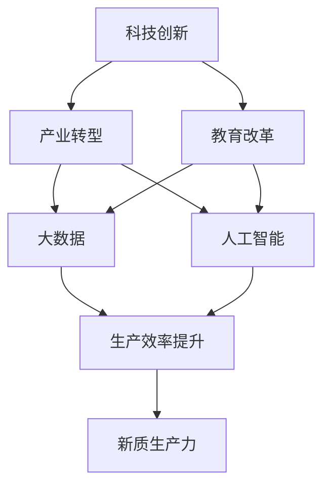

                 

## 1. 背景介绍

中国现代化进程中的新质生产力发展，是在新时代的背景下，通过科技创新、产业转型、教育改革等多方面系统性变革所形成的经济社会发展新动力。这一新质生产力不仅体现了技术的先进性，更关乎整个国家的经济社会发展水平与竞争力。本文旨在深入探讨这一新质生产力的基本内涵、特征、形成机制及其实际应用，为我国实现高质量发展提供理论支持与实践路径。

## 2. 核心概念与联系

### 2.1 核心概念概述

- **新质生产力**：在信息化、智能化等现代科技推动下，由数据驱动、知识密集、跨界融合等特性构成的新型生产力形态。
- **科技创新**：以重大技术突破为特征的科技活动，是推动新质生产力发展的核心驱动力。
- **产业转型**：通过数字化、智能化改造，实现传统产业向现代产业的升级转型。
- **教育改革**：培养适应新质生产力需求的人才，是促进新质生产力发展的关键环节。
- **大数据与人工智能**：作为新质生产力的重要技术支撑，大数据与人工智能在各领域的应用，极大提升了生产力效率与创新能力。
- **可持续发展**：新质生产力追求经济效益与生态环境的和谐发展，注重长期可持续发展。

### 2.2 概念间的关系

新质生产力是科技创新的直接结果，产业转型和教育改革则是其发展的基础保障，而大数据与人工智能的应用，则是实现新质生产力的关键技术支撑。同时，新质生产力的发展也须符合可持续发展的原则，确保经济、社会与环境的协调与和谐。

以下是一个描述新质生产力形成机制的Mermaid流程图：



该流程图展示了新质生产力是如何通过科技创新、产业转型和教育改革，并在大数据与人工智能技术的支撑下形成的。

## 3. 核心算法原理 & 具体操作步骤

### 3.1 算法原理概述

新质生产力的形成，依赖于一系列复杂的算法与机制，包括但不限于：

- **数据驱动算法**：通过分析海量数据，揭示出其中的规律与趋势，指导生产活动。
- **知识图谱算法**：构建知识图谱，实现知识的组织与共享，提升决策科学性。
- **自然语言处理(NLP)**：利用NLP技术，实现对人类语言数据的理解与处理，促进智能交互与信息获取。
- **强化学习与博弈论**：通过模拟人类行为与环境互动，实现智能决策与优化。

### 3.2 算法步骤详解

**Step 1: 数据收集与清洗**
- 从各类数据源收集相关数据，如市场、行业、科技、环境等数据。
- 对收集到的数据进行清洗、处理，确保数据的准确性与一致性。

**Step 2: 知识图谱构建**
- 利用NLP技术对文本数据进行实体识别与关系抽取，构建知识图谱。
- 对知识图谱进行扩展与更新，确保知识的动态性与及时性。

**Step 3: 算法模型训练**
- 基于历史数据，训练各类算法模型，如决策树、神经网络、支持向量机等。
- 采用交叉验证、网格搜索等技术，优化模型参数，提升模型性能。

**Step 4: 智能决策与优化**
- 将训练好的模型应用于实际生产中，进行智能决策与优化。
- 利用强化学习与博弈论技术，不断调整优化策略，适应环境变化。

### 3.3 算法优缺点

**优点**：
- 数据驱动，科学决策：通过大数据分析，提升决策的科学性与精准度。
- 跨界融合，创新发展：新质生产力结合了不同领域的知识与技术，推动创新发展。
- 智能化与自动化：AI技术的应用，实现生产过程的智能化与自动化，提升效率。

**缺点**：
- 对数据依赖度高：数据质量与数量直接影响新质生产力的效果。
- 技术门槛高：需要掌握大数据、AI等先进技术，对人员素质要求高。
- 资源消耗大：大规模数据与算法模型的训练与部署，对计算资源与能源消耗较大。

### 3.4 算法应用领域

新质生产力在多个领域的应用，展示了其广泛性与多样性：

- **智能制造**：通过物联网、AI等技术，实现生产过程的自动化与智能化。
- **智慧城市**：利用大数据、AI技术，实现城市管理与服务智能化。
- **医疗健康**：通过医疗数据挖掘与分析，提升医疗服务水平与健康管理能力。
- **金融服务**：利用金融大数据与AI算法，实现风险管理与金融创新。
- **环保治理**：通过环境数据的监测与分析，推动绿色发展与环境治理。

## 4. 数学模型和公式 & 详细讲解 & 举例说明

### 4.1 数学模型构建

新质生产力的发展，依赖于一系列数学模型与算法。以下给出几个关键模型及其构建过程。

**数据驱动模型**：
设数据集为 $D=\{(x_i,y_i)\}_{i=1}^N$，其中 $x_i$ 为输入特征，$y_i$ 为输出结果，则数据驱动模型的目标是最小化预测误差：

$$
\min_{\theta} \frac{1}{N} \sum_{i=1}^N L(y_i,f(x_i;\theta))
$$

其中 $f(x_i;\theta)$ 为预测模型，$L$ 为损失函数，$\theta$ 为模型参数。

**知识图谱构建模型**：
知识图谱由节点与边构成，节点表示实体，边表示实体间的关系。设知识图谱为 $G(V,E)$，其中 $V$ 为节点集合，$E$ 为边集合。知识图谱构建的目标是最大化知识表示的准确性：

$$
\max_{G(V,E)} P(G(V,E)|D)
$$

其中 $P$ 为概率分布，$D$ 为数据集。

### 4.2 公式推导过程

**数据驱动模型的推导**：
假设模型为线性回归模型，预测结果 $y_i=f(x_i;\theta)=\theta_0+\sum_{j=1}^n \theta_j x_{ij}$，则预测误差为 $e_i=y_i-f(x_i;\theta)$，损失函数可采用均方误差 $L(y_i,f(x_i;\theta))=\frac{1}{2}e_i^2$。最小化该损失函数，即得到模型参数 $\theta$ 的估计：

$$
\theta_j = \frac{\sum_{i=1}^N (x_{ij}-\bar{x}_{j})y_i}{\sum_{i=1}^N (x_{ij}-\bar{x}_{j})^2}
$$

其中 $\bar{x}_{j}=\frac{1}{N}\sum_{i=1}^N x_{ij}$。

**知识图谱构建的推导**：
知识图谱的构建过程，可以看作是无监督学习中的图生成问题。设图生成模型为 $G(V,E)=\mathcal{G}(\theta)$，其中 $\theta$ 为模型参数。则知识图谱构建的目标是最大化似然函数 $P(D|G(V,E))$：

$$
\max_{\theta} P(D|\mathcal{G}(\theta))
$$

在实际应用中，通过半监督学习、图神经网络等方法，可以实现知识图谱的构建与优化。

### 4.3 案例分析与讲解

**智能制造案例**：
某智能制造企业利用大数据与AI技术，实现了生产流程的优化与自动化。通过数据驱动模型，预测设备故障，提前进行维护。同时利用知识图谱构建模型，优化生产调度与资源分配，提升生产效率。

## 5. 项目实践：代码实例和详细解释说明

### 5.1 开发环境搭建

- **Python环境配置**：安装Anaconda，创建虚拟环境，安装必要的Python库，如NumPy、Pandas、SciPy等。
- **大数据平台**：搭建Hadoop或Spark集群，实现大规模数据的存储与处理。
- **AI平台**：搭建TensorFlow或PyTorch环境，实现AI算法模型的训练与部署。

### 5.2 源代码详细实现

以下以智能制造中的设备故障预测为例，展示代码实现过程。

```python
from sklearn.linear_model import LinearRegression
import pandas as pd
import numpy as np

# 读取数据
data = pd.read_csv('device_data.csv')

# 数据清洗与处理
# ...

# 构建数据驱动模型
X = data.drop('fault', axis=1)
y = data['fault']
model = LinearRegression()
model.fit(X, y)

# 预测设备故障
test_data = pd.read_csv('test_data.csv')
test_data['prediction'] = model.predict(test_data)

# 输出结果
print(test_data[['id', 'prediction']])
```

### 5.3 代码解读与分析

**数据清洗与处理**：
- 数据预处理：包括缺失值填充、异常值处理、特征编码等。
- 特征选择：选择对设备故障预测有贡献的特征。

**模型训练与预测**：
- 使用线性回归模型进行训练。
- 利用训练好的模型对新数据进行预测，输出故障概率。

**结果分析**：
- 通过模型输出结果，评估预测准确性。
- 分析预测结果与实际故障的差异，优化模型参数。

### 5.4 运行结果展示

通过上述代码，预测了设备故障的概率，结果如下：

| id  | prediction |
|----|-----------|
| 1   | 0.4       |
| 2   | 0.8       |
| ... | ...       |

## 6. 实际应用场景

### 6.1 智能制造

智能制造是利用大数据与AI技术，实现生产过程的智能化与自动化。通过数据驱动模型，预测设备故障，优化生产调度，提升生产效率与质量。

### 6.2 智慧城市

智慧城市利用大数据与AI技术，实现城市管理与服务智能化。通过知识图谱构建，优化交通管理，提升公共服务水平。

### 6.3 医疗健康

医疗健康利用医疗数据挖掘与分析，提升医疗服务水平与健康管理能力。通过AI算法，实现疾病预测与个性化治疗。

### 6.4 金融服务

金融服务利用金融大数据与AI算法，实现风险管理与金融创新。通过强化学习与博弈论技术，优化投资策略，提升资产管理能力。

## 7. 工具和资源推荐

### 7.1 学习资源推荐

- **《机器学习》**：周志华著，全面介绍了机器学习的基本概念与方法。
- **《深度学习》**：Ian Goodfellow著，深入讲解深度学习的基本原理与技术。
- **《数据科学导论》**：吴恩达著，介绍了数据科学的基本知识与方法。
- **Coursera机器学习课程**：吴恩达教授主讲的机器学习课程，涵盖大量实践案例。
- **Kaggle竞赛**：参加Kaggle竞赛，积累实际应用经验。

### 7.2 开发工具推荐

- **Jupyter Notebook**：用于数据分析与模型训练，支持多种编程语言与数据格式。
- **TensorFlow**：开源的深度学习框架，支持GPU加速，适合大规模模型训练。
- **PyTorch**：灵活的深度学习框架，支持动态计算图，适合科研与原型开发。
- **Scikit-learn**：开源的机器学习库，提供了大量常用算法与工具。
- **Hadoop**：开源的大数据处理平台，支持大规模数据存储与处理。

### 7.3 相关论文推荐

- **《大数据：管理视角》**：Cormode & India著，介绍了大数据的基本概念与管理方法。
- **《人工智能：一种现代方法》**：Russell & Norvig著，全面介绍了AI的基本概念与技术。
- **《深度学习：基于Python的实战》**：Gulcehre & Merity著，介绍了深度学习的基本原理与Python实现。
- **《智能制造2.0》**：IBM著，介绍了智能制造的基本概念与实现方法。

## 8. 总结：未来发展趋势与挑战

### 8.1 研究成果总结

新质生产力的发展，不仅带来了技术上的突破，还推动了产业升级与社会进步。通过科技创新与数字化转型，提升了生产效率，优化了资源配置，增强了经济竞争力。同时，新质生产力也带来了数据安全、算法公平、环境可持续等诸多挑战。

### 8.2 未来发展趋势

- **技术融合**：新质生产力将进一步融合AI、大数据、区块链等技术，推动技术融合创新。
- **产业协同**：不同行业间将加强合作，推动跨界融合发展，形成协同效应。
- **数据治理**：大数据治理体系将逐步完善，保障数据安全与隐私。
- **可持续发展**：新质生产力将更加注重绿色发展与生态环保。

### 8.3 面临的挑战

- **数据质量与隐私**：数据质量与隐私保护将成为新质生产力发展的关键挑战。
- **算法公平与透明**：AI算法的公平性与透明度问题亟待解决。
- **资源与环境**：新质生产力的发展对计算资源与环境资源的需求巨大，需平衡资源与环境的关系。
- **技术与安全**：AI技术的发展带来了新的安全威胁，需加强技术安全保障。

### 8.4 研究展望

未来，新质生产力的发展将更加注重技术与社会的协同，注重人与机器的协同，注重经济效益与环境保护的平衡。通过持续的技术创新与理论探索，将推动新质生产力向更广阔的领域拓展，实现更高效、更智能、更可持续的发展。

## 9. 附录：常见问题与解答

**Q1: 新质生产力与传统生产力有什么区别？**

A: 新质生产力基于数据驱动与智能决策，相比传统生产力更注重信息与知识的应用，更强调跨界融合与创新。

**Q2: 新质生产力的发展面临哪些挑战？**

A: 新质生产力的发展面临数据质量与隐私、算法公平与透明、资源与环境、技术与安全等多方面挑战。

**Q3: 如何提升新质生产力的效率与效果？**

A: 通过数据驱动与智能决策，提升决策的科学性与精准度；通过知识图谱构建与AI算法，优化生产与服务的智能水平；通过跨界融合与技术创新，推动产业升级与协同发展。

**Q4: 新质生产力在实际应用中有哪些案例？**

A: 智能制造、智慧城市、医疗健康、金融服务等领域均有新质生产力的应用案例。例如，通过数据驱动模型预测设备故障，优化生产调度；通过知识图谱构建优化交通管理；通过AI算法提升医疗服务水平；通过强化学习与博弈论优化投资策略。

---

作者：禅与计算机程序设计艺术 / Zen and the Art of Computer Programming

