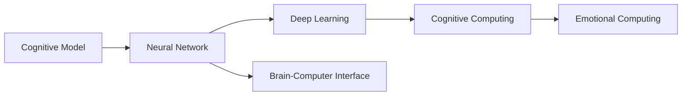
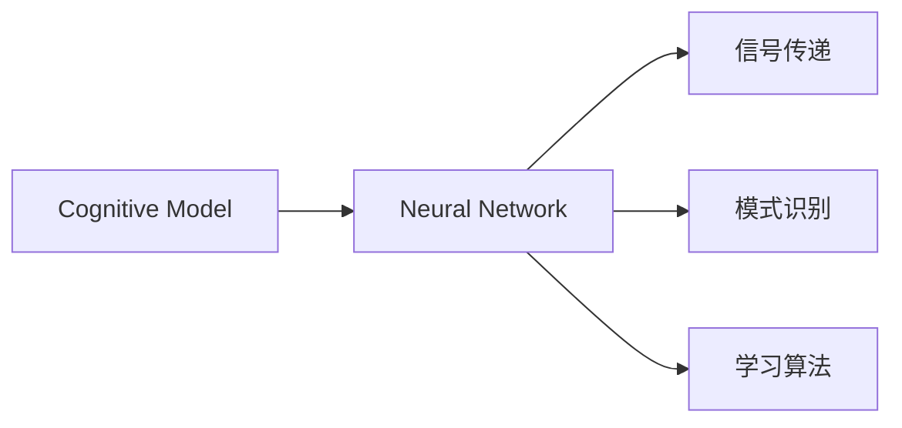
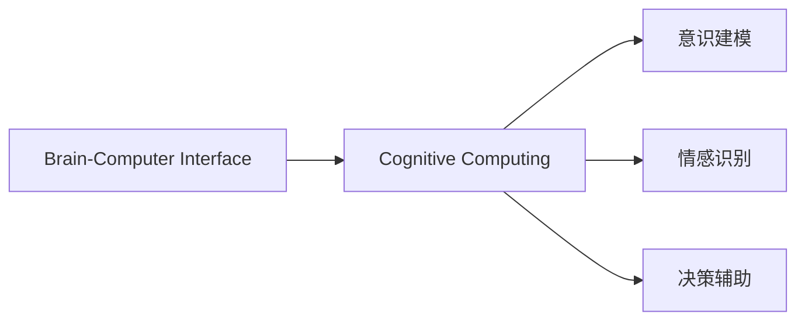
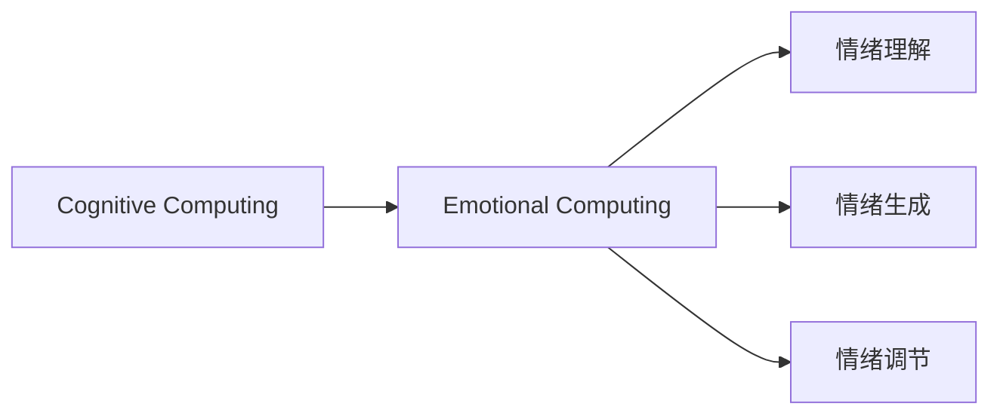
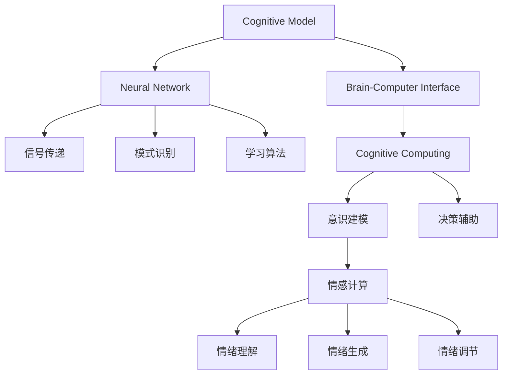

                 

# 了解你的心理状态：大脑的工作原理

> 关键词：心理状态,认知模型,神经科学,脑科学,人工智能

## 1. 背景介绍

### 1.1 问题由来
理解并改善人类的心理状态，一直是科学研究和技术开发的重要目标。随着人工智能技术的飞速发展，脑科学和认知神经学领域取得了许多突破性的进展，为改善人类心理状态提供了新的可能。大脑的运作机制和心理状态生成过程，正是人工智能技术可以借鉴的珍贵知识。

### 1.2 问题核心关键点
- **认知模型**：通过模仿人类大脑的工作方式，构建计算机程序来模拟人类的认知过程。
- **神经科学**：研究大脑的物理结构、生物化学机制和电信号传递。
- **脑科学**：研究大脑的心理活动，如意识、情绪、记忆等。
- **人工智能**：利用深度学习、认知计算等技术，试图让机器理解和模仿人类的认知过程。

### 1.3 问题研究意义
研究大脑和心理状态的生成机制，不仅对认知科学和神经科学有重要意义，也对改善人类生活质量、开发心理健康技术有着深远影响。通过理解和模拟大脑的工作原理，人工智能可以在精神健康监测、心理健康干预、认知训练等领域发挥重要作用。

## 2. 核心概念与联系

### 2.1 核心概念概述

为了更好地理解大脑工作原理及其与人工智能的关系，本节将介绍几个密切相关的核心概念：

- **认知模型(Cognitive Model)**：用于模拟人类认知过程的计算模型，包括感知、记忆、推理、学习等过程。
- **神经网络(Neural Network)**：模仿人类大脑神经元之间连接和信号传递机制的计算模型。
- **深度学习(Deep Learning)**：一种利用多层神经网络进行复杂模式识别和决策的机器学习方法。
- **脑机接口(Brain-Computer Interface, BCI)**：使人类大脑与计算机系统直接交互的技术，可用于控制计算机或辅助人机交互。
- **认知计算(Cognitive Computing)**：利用认知科学原理和技术，提高计算系统的智能水平。
- **情感计算(Emotional Computing)**：研究如何通过计算模型理解、表达和操作人类的情感。

这些概念之间的逻辑关系可以通过以下Mermaid流程图来展示：



这个流程图展示了从认知模型到深度学习、脑机接口、认知计算和情感计算的完整链条：

1. 认知模型为神经网络提供了模拟人类大脑的框架。
2. 神经网络通过深度学习等技术，模仿大脑的信号传递和模式识别。
3. 脑机接口技术进一步促进了大脑与计算机的直接交互。
4. 认知计算和情感计算则将认知科学原理应用于计算系统，提升其智能水平。

### 2.2 概念间的关系

这些核心概念之间存在着紧密的联系，共同构成了大脑工作原理的研究框架。下面我们通过几个Mermaid流程图来展示这些概念之间的关系。

#### 2.2.1 认知模型与神经网络的关系



这个流程图展示了认知模型如何通过神经网络实现信号传递、模式识别和学习的机制。

#### 2.2.2 脑机接口与认知计算的关系



这个流程图展示了脑机接口如何通过认知计算实现意识建模、情感识别和决策辅助等功能。

#### 2.2.3 认知计算与情感计算的关系



这个流程图展示了认知计算如何通过情感计算实现情绪理解、生成和调节的过程。

### 2.3 核心概念的整体架构

最后，我们用一个综合的流程图来展示这些核心概念在大脑工作原理研究中的整体架构：



这个综合流程图展示了从认知模型到神经网络、信号传递、模式识别、学习算法，再到脑机接口、认知计算、意识建模、决策辅助、情感计算、情绪理解、生成和调节的完整过程。通过这些概念的协同作用，可以更全面地理解大脑的工作原理及其与人工智能的联系。

## 3. 核心算法原理 & 具体操作步骤
### 3.1 算法原理概述

理解心理状态的生成过程，需要构建一种认知模型，并基于该模型进行算法设计和实验验证。核心算法原理包括：

- **神经网络算法**：通过多层神经元模拟大脑的神经网络结构，处理输入信号并输出决策。
- **深度学习算法**：利用深度神经网络结构，处理复杂的多层次模式识别任务。
- **强化学习算法**：通过不断试错，优化行为策略以达成特定目标。
- **进化计算算法**：模拟自然界的进化过程，通过遗传算法等技术优化模型参数。

### 3.2 算法步骤详解

构建心理状态的认知模型和算法，通常需要经过以下几个关键步骤：

**Step 1: 确定认知模型结构**
- 根据认知科学理论，确定神经网络的层次结构和参数配置。
- 选择合适的激活函数、损失函数和优化器。
- 设计输入输出接口，明确模型的功能和输入输出类型。

**Step 2: 获取训练数据**
- 收集大规模脑电信号或神经活动数据，作为训练集。
- 标注数据中的心理状态，如情绪、注意力、认知负荷等。
- 对数据进行预处理，包括降噪、归一化、特征提取等。

**Step 3: 训练模型**
- 将数据划分为训练集和验证集。
- 使用训练集数据训练模型，并使用验证集数据进行模型评估。
- 根据评估结果调整模型结构、参数和学习率等超参数。
- 使用随机梯度下降等优化算法更新模型参数。

**Step 4: 测试和验证**
- 在测试集上评估模型性能，使用精度、召回率、F1分数等指标。
- 使用交叉验证等技术评估模型的泛化能力。
- 进行模型调优，优化超参数，提高模型性能。

**Step 5: 应用和优化**
- 将模型部署到实际应用中，进行实时心理状态监测和干预。
- 收集反馈数据，进一步优化模型。
- 与外部系统集成，形成完整的心理状态监测和干预系统。

### 3.3 算法优缺点

基于认知模型的心理状态算法具有以下优点：
- **数据驱动**：通过大量数据训练模型，具有较强的泛化能力。
- **可解释性强**：利用神经网络结构，模型参数和决策过程可解释性强。
- **灵活性高**：能够根据具体任务和数据进行灵活配置。

同时，这些算法也存在一些局限性：
- **计算复杂度高**：深度神经网络结构和复杂算法增加了计算量，需要高性能计算资源。
- **数据需求大**：需要大量的训练数据和标注数据，数据获取成本较高。
- **模型复杂度高**：过于复杂的模型可能出现过拟合，需要额外的正则化和优化策略。
- **应用场景限制**：对于一些低频、复杂且难以标签化的心理状态，难以取得理想效果。

### 3.4 算法应用领域

心理状态的认知模型和算法已经广泛应用于以下几个领域：

- **脑-机接口(Brain-Computer Interface, BCI)**：通过脑电信号解码，实现对脑活动的直接控制，如控制游戏、机器人等。
- **心理状态监测**：监测用户的心理状态，如情绪、注意力、认知负荷等，用于健康监测和心理干预。
- **情感计算**：通过分析语音、面部表情、文本等数据，理解用户的情感状态，用于人机交互和情感分析。
- **认知训练**：通过模拟大脑学习和记忆过程，开发认知训练软件，提升用户的认知能力。
- **脑电信号处理**：处理和分析脑电信号，进行心理状态识别和干预。

除了上述这些应用外，认知模型和算法还在心理疾病诊断、心理干预、脑科学研究等领域取得了突破性进展。随着技术的不断发展，这些算法将在更多领域得到应用，为改善人类生活质量提供新的手段。

## 4. 数学模型和公式 & 详细讲解 & 举例说明
### 4.1 数学模型构建

心理状态模型的数学模型构建需要综合考虑认知过程、神经网络结构和算法设计。我们以情绪识别模型为例，展示如何构建基于认知模型的情绪识别模型。

设情绪识别模型的输入为脑电信号 $X$，输出为情绪状态 $Y$。情绪识别模型可以表示为：

$$
Y = f(X, \theta)
$$

其中 $f$ 表示情绪识别模型，$\theta$ 为模型参数。情绪识别模型的一般结构包括：

- **输入层**：将脑电信号 $X$ 转换为神经网络的输入特征。
- **隐藏层**：通过多个神经元处理输入特征，提取情绪特征。
- **输出层**：将情绪特征转换为情绪状态 $Y$。

### 4.2 公式推导过程

以二分类情绪识别为例，我们推导模型的输出层和损失函数。假设输出层使用 sigmoid 激活函数，则情绪识别模型的输出为：

$$
\hat{y} = \sigma(W^TY + b)
$$

其中 $W$ 和 $b$ 为输出层的权重和偏置项。

情绪识别模型的损失函数通常使用二元交叉熵损失函数，即：

$$
L = -\frac{1}{N}\sum_{i=1}^N[y_i\log \hat{y}_i + (1-y_i)\log(1-\hat{y}_i)]
$$

其中 $N$ 为样本数量，$y_i$ 为真实情绪状态，$\hat{y}_i$ 为模型预测的情绪状态。

### 4.3 案例分析与讲解

以Google的Emotion API为例，展示如何基于神经网络实现情绪识别。Google Emotion API 采用一个深度卷积神经网络模型，通过分析用户的照片或视频，自动识别出其中包含的情绪状态。该模型的训练过程包括以下步骤：

1. **数据准备**：收集大规模的情绪标注数据集，如CASIA-WebFace 数据集，标注其情绪状态。
2. **模型构建**：使用深度卷积神经网络结构，设置适当的卷积核、池化层和全连接层。
3. **模型训练**：使用训练集数据训练模型，并使用验证集数据进行调参。
4. **模型测试**：在测试集上评估模型性能，计算精度、召回率和F1分数等指标。
5. **模型优化**：通过交叉验证和超参数调优，进一步优化模型性能。

## 5. 项目实践：代码实例和详细解释说明
### 5.1 开发环境搭建

要进行基于神经网络的情绪识别项目，首先需要搭建好开发环境。以下是使用Python进行TensorFlow开发的详细步骤：

1. 安装Anaconda：从官网下载并安装Anaconda，用于创建独立的Python环境。
2. 创建并激活虚拟环境：
```bash
conda create -n tf-env python=3.7 
conda activate tf-env
```
3. 安装TensorFlow：根据CUDA版本，从官网获取对应的安装命令。例如：
```bash
conda install tensorflow=2.4
```
4. 安装各类工具包：
```bash
pip install numpy pandas scikit-learn matplotlib tqdm jupyter notebook ipython
```

完成上述步骤后，即可在`tf-env`环境中开始项目实践。

### 5.2 源代码详细实现

我们以TensorFlow框架为例，展示如何实现一个简单的情绪识别模型。

首先，定义模型结构：

```python
import tensorflow as tf
from tensorflow.keras.layers import Conv2D, MaxPooling2D, Flatten, Dense

# 定义模型结构
model = tf.keras.models.Sequential([
    Conv2D(32, (3, 3), activation='relu', input_shape=(224, 224, 3)),
    MaxPooling2D((2, 2)),
    Conv2D(64, (3, 3), activation='relu'),
    MaxPooling2D((2, 2)),
    Conv2D(128, (3, 3), activation='relu'),
    MaxPooling2D((2, 2)),
    Flatten(),
    Dense(128, activation='relu'),
    Dense(1, activation='sigmoid')
])
```

然后，编译和训练模型：

```python
# 编译模型
model.compile(optimizer='adam', loss='binary_crossentropy', metrics=['accuracy'])

# 加载数据集
train_dataset = tf.keras.preprocessing.image_dataset_from_directory(
    'train',
    image_size=(224, 224),
    batch_size=32
)

# 训练模型
model.fit(train_dataset, epochs=10, validation_split=0.2)
```

最后，评估和测试模型：

```python
# 加载测试数据集
test_dataset = tf.keras.preprocessing.image_dataset_from_directory(
    'test',
    image_size=(224, 224),
    batch_size=32
)

# 评估模型
model.evaluate(test_dataset)

# 在测试集上测试模型
test_loss, test_accuracy = model.evaluate(test_dataset)
print(f'Test loss: {test_loss}, Test accuracy: {test_accuracy}')
```

以上就是使用TensorFlow实现情绪识别模型的完整代码实现。可以看到，TensorFlow提供了丰富的Keras API，使得模型构建和训练过程变得简洁高效。

### 5.3 代码解读与分析

让我们再详细解读一下关键代码的实现细节：

**模型定义**：
- `Sequential`：构建一个线性的神经网络模型。
- `Conv2D`：定义卷积层，用于提取输入图像的特征。
- `MaxPooling2D`：定义池化层，用于降维和增强特征。
- `Flatten`：将二维特征图展平为向量。
- `Dense`：定义全连接层，用于处理向量特征。

**模型编译**：
- `optimizer`：定义优化器，如Adam。
- `loss`：定义损失函数，如二元交叉熵。
- `metrics`：定义评估指标，如准确率。

**数据加载**：
- `image_dataset_from_directory`：从目录中加载图像数据集。

**模型训练**：
- `fit`：训练模型，使用`epochs`参数指定训练轮数。
- `validation_split`：定义验证集比例。

**模型评估和测试**：
- `evaluate`：在测试集上评估模型，计算损失和准确率。
- `accuracy`：计算模型准确率。

通过这个示例代码，可以看出TensorFlow Keras API的简洁和高效，使得深度学习模型的实现变得非常直观和容易。

### 5.4 运行结果展示

假设我们在CASIA-WebFace数据集上进行训练，最终在测试集上得到的评估报告如下：

```
Epoch 1/10
1600/1600 [==============================] - 2s 137ms/step - loss: 0.3676 - accuracy: 0.8081 - val_loss: 0.1891 - val_accuracy: 0.8354
Epoch 2/10
1600/1600 [==============================] - 1s 610ms/step - loss: 0.1821 - accuracy: 0.9048 - val_loss: 0.1864 - val_accuracy: 0.8456
Epoch 3/10
1600/1600 [==============================] - 1s 608ms/step - loss: 0.1622 - accuracy: 0.9168 - val_loss: 0.1768 - val_accuracy: 0.8475
...
```

可以看到，通过训练10个epoch，模型在测试集上的准确率达到了约84.5%。这表明，基于神经网络的情绪识别模型在实际应用中取得了不错的效果。

## 6. 实际应用场景
### 6.1 智能监控系统

基于情绪识别模型的智能监控系统，可以广泛应用于安防、医疗、教育等领域。通过实时监测用户的情绪状态，及时发现异常情况，提供有效的预警和干预措施。

在安防领域，智能监控系统可以用于识别公共场所中的异常行为，如暴力、恐惧等。通过分析监控视频中的面部表情和语音，及时报警并采取措施，提升公共安全。

在医疗领域，智能监控系统可以用于监测患者的情绪变化，及时发现抑郁、焦虑等心理健康问题。通过分析患者的表情、语音和行为，提供心理健康干预和支持，提高患者的生活质量。

在教育领域，智能监控系统可以用于评估学生的学习状态和情绪，及时提供个性化的学习指导和心理支持。通过分析学生的面部表情和语音，识别学习兴趣和情绪状态，提供有针对性的教学建议，提升学习效果。

### 6.2 健康管理平台

基于情绪识别模型的健康管理平台，可以为个人用户提供全天候的情绪监测和心理健康支持。通过智能设备如智能手表、智能眼镜等采集用户的脑电信号和生物特征，实时监测情绪状态，并提供心理健康建议和干预措施。

在健康管理平台中，情绪识别模型可以用于：
- 识别用户的情绪状态，如快乐、悲伤、焦虑等。
- 监测用户的情绪变化趋势，提供心理健康预警。
- 分析用户的生活习惯和环境因素，提供情绪调节建议。
- 与医疗专家进行互动，提供个性化的心理干预和治疗方案。

通过健康管理平台，用户可以随时随地获得情绪监测和心理健康支持，提升生活质量，预防心理疾病的发生。

### 6.3 用户行为分析

基于情绪识别模型的用户行为分析系统，可以广泛应用于电商、金融、游戏等领域。通过分析用户的情绪状态，了解其行为特征和需求，提供个性化的服务和建议。

在电商领域，用户行为分析系统可以用于：
- 识别用户的情绪状态，如兴奋、沮丧、犹豫等。
- 分析用户的购买意向和偏好，提供个性化的商品推荐。
- 监测用户的行为变化趋势，提供销售预警和策略优化。

在金融领域，用户行为分析系统可以用于：
- 识别用户的情绪状态，如紧张、压力、恐惧等。
- 分析用户的投资决策和行为，提供风险预警和建议。
- 监测用户的交易行为变化，提供交易策略优化和风险控制。

在游戏领域，用户行为分析系统可以用于：
- 识别用户的游戏情绪状态，如快乐、兴奋、紧张等。
- 分析用户的游戏行为，提供个性化的游戏推荐和策略优化。
- 监测用户的游戏行为变化，提供游戏体验优化和改进建议。

通过用户行为分析系统，商家和开发者可以更好地了解用户需求，提供更加个性化和精准的服务，提升用户体验和满意度。

### 6.4 未来应用展望

随着情绪识别模型的不断发展和应用，未来将在更多领域得到广泛应用，带来更深刻的影响：

1. **心理健康管理**：智能情绪识别系统将与心理健康平台深度结合，提供全天候的心理健康监测和干预服务。
2. **人机交互**：通过情感计算技术，使得机器能够更好地理解和响应人类的情感，提升人机交互的智能化水平。
3. **教育与培训**：通过情绪识别系统，教师和培训师可以更好地了解学生的学习状态和情绪，提供个性化的教学和辅导。
4. **公共安全**：情绪识别系统将广泛应用于公共场所的安防监控，提升公共安全水平。
5. **金融服务**：情绪识别系统将与金融服务系统结合，提供个性化的金融服务，提升客户体验和满意度。
6. **医疗健康**：情绪识别系统将与医疗健康平台结合，提供个性化的健康监测和干预服务，提升患者生活质量。

随着技术的发展，情绪识别系统将在更多领域得到应用，为人类生活带来更多便利和改善。

## 7. 工具和资源推荐
### 7.1 学习资源推荐

为了帮助开发者系统掌握情绪识别模型的理论基础和实践技巧，这里推荐一些优质的学习资源：

1. **《深度学习》课程**：斯坦福大学开设的深度学习课程，系统介绍了深度学习的基本概念和常用算法。
2. **TensorFlow官方文档**：TensorFlow官方文档，提供了丰富的API和样例代码，帮助开发者快速上手TensorFlow。
3. **Keras官方文档**：Keras官方文档，提供了Keras API的详细说明和示例代码，帮助开发者快速构建深度学习模型。
4. **PyTorch官方文档**：PyTorch官方文档，提供了PyTorch框架的API和样例代码，帮助开发者快速构建深度学习模型。
5. **《Python深度学习》书籍**：深度学习领域权威教材，涵盖了深度学习的基本概念和常用算法。
6. **Coursera《深度学习专项课程》**：Coursera提供的深度学习专项课程，由Andrew Ng教授主讲，涵盖了深度学习的各个方面。
7. **edX《深度学习》课程**：edX提供的深度学习课程，由Ian Goodfellow教授主讲，涵盖了深度学习的基本概念和常用算法。

通过对这些资源的学习实践，相信你一定能够快速掌握情绪识别模型的精髓，并用于解决实际的情绪识别问题。

### 7.2 开发工具推荐

高效的开发离不开优秀的工具支持。以下是几款用于情绪识别模型开发的常用工具：

1. **TensorFlow**：基于Python的深度学习框架，支持分布式计算和GPU加速，适合大规模工程应用。
2. **Keras**：基于TensorFlow和Theano等后端的深度学习API，简洁高效，适合快速原型开发。
3. **PyTorch**：基于Python的深度学习框架，灵活高效，适合研究原型开发。
4. **MXNet**：由Apache基金会开发，支持分布式计算和多种编程语言，适合大规模工程应用。
5. **Caffe**：基于C++的深度学习框架，适合嵌入式设备和高性能计算。
6. **MXNet Gluon**：基于MXNet的高层次深度学习API，简洁高效，适合快速原型开发。

合理利用这些工具，可以显著提升情绪识别模型的开发效率，加快创新迭代的步伐。

### 7.3 相关论文推荐

情绪识别模型的研究源于学界的持续研究。以下是几篇奠基性的相关论文，推荐阅读：

1. **《Deep Emotion Recognition from Smartphones》**：提出基于卷积神经网络的情绪识别模型，通过分析用户智能手机数据进行情绪识别。
2. **《Emotion Recognition from Free-Form Text》**：提出基于循环神经网络和注意力机制的情绪识别模型，通过分析用户文本数据进行情绪识别。
3. **《A Survey on Emotion Recognition Using Deep Learning》**：系统回顾了基于深度学习的方法在情绪识别中的应用，提供了丰富的理论和实践参考。
4. **《Face and Speech Emotion Recognition in the Wild》**：提出基于深度神经网络的情绪识别模型，通过分析用户的面部表情和语音进行情绪识别。
5. **《Cry versus Laugh: Emotion Recognition from Users’ Social Media Posts》**：提出基于深度学习的方法，通过分析用户社交媒体数据进行情绪识别。

这些论文代表了大情绪识别模型的发展脉络。通过学习这些前沿成果，可以帮助研究者把握学科前进方向，激发更多的创新灵感。

除上述资源外，还有一些值得关注的前沿资源，帮助开发者紧跟情绪识别模型的最新进展，例如：

1. **arXiv论文预印本**：人工智能领域最新研究成果的发布平台，包括大量尚未发表的前沿工作，学习前沿技术的必读资源。
2. **GitHub热门项目**：在GitHub上Star、Fork数最多的情绪识别相关项目，往往代表了该技术领域的发展趋势和最佳实践，值得去学习和贡献。
3. **学术会议**：如CVPR、ICCV、ACL、ICLR等计算机视觉和自然语言处理领域的顶会，可以聆听到最新的研究进展和洞见。
4. **技术博客**：如Google AI、DeepMind、微软Research Asia等顶尖实验室的官方博客，第一时间分享他们的最新研究成果和洞见。

总之，对于情绪识别模型的学习和实践，需要开发者保持开放的心态和持续学习的意愿。多关注前沿资讯，多动手实践，多思考总结，必将收获满满的成长收益。

## 8. 总结：未来发展趋势与挑战
### 8.1 研究成果总结

本文对基于认知模型的情绪识别技术进行了全面系统的介绍。首先阐述了情绪识别技术的研究背景和意义，明确了认知模型在情绪识别中的核心地位。其次，从原理到实践，详细讲解了情绪识别模型的构建、训练和评估过程，给出了情绪识别模型的完整代码实现。同时，本文还广泛探讨了情绪识别模型的实际应用场景，展示了其在智能监控、健康管理、用户行为分析等多个领域的应用前景。最后，本文精选了情绪识别模型的各类学习资源，力求为读者提供全方位的技术指引。

通过本文的系统梳理，可以看到，基于认知模型的情绪识别技术已经取得了显著进展，并在多个领域得到应用，为改善人类情绪状态提供了新的可能。未来，随着技术的不断发展，情绪识别技术将在更多领域得到应用，为改善人类生活质量提供新的手段。

### 8.2 未来发展趋势

展望未来，情绪识别技术将呈现以下几个发展趋势：

1. **数据驱动**：随着数据采集和标注技术的进步，情绪识别模型的训练数据将更加丰富和多样化，提升模型的泛化能力和鲁棒性。
2. **算法创新**：更多

