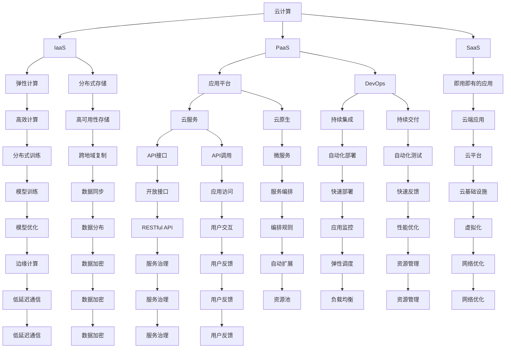
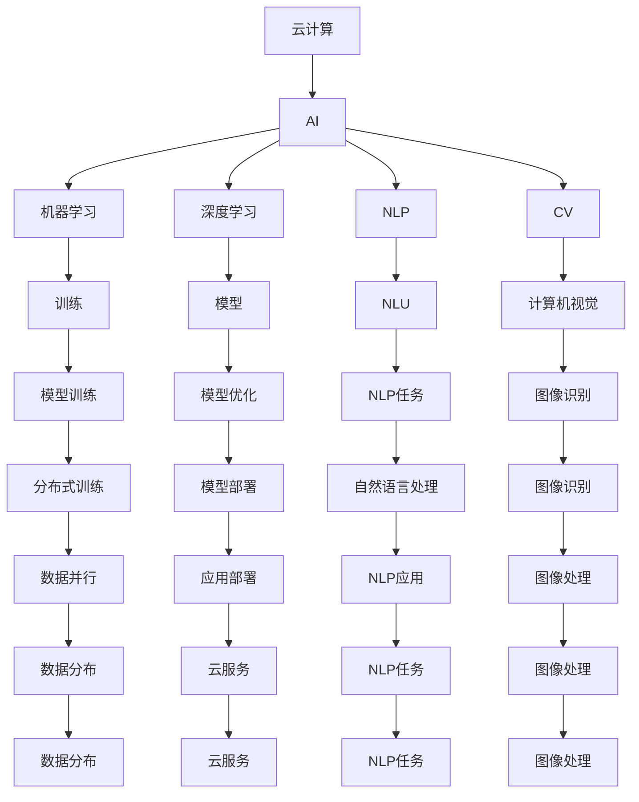
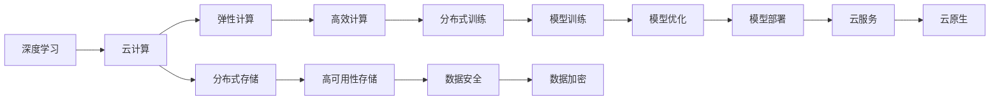
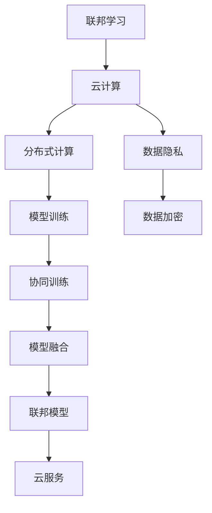
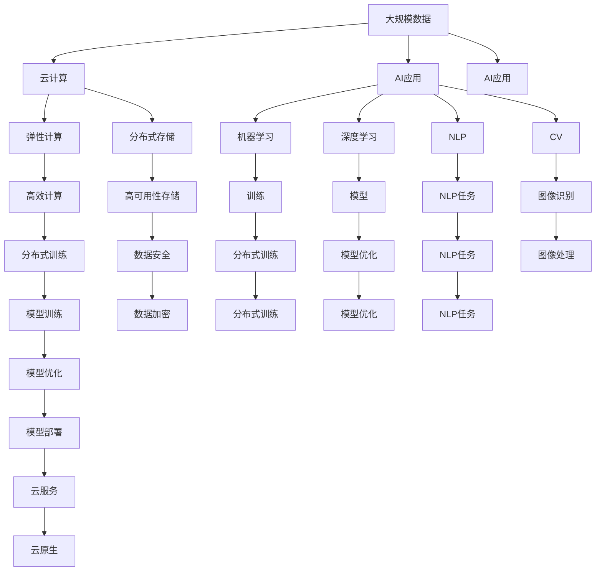

                 

# 云计算与AI的融合：贾扬清的独特视角，Lepton AI的云战略

> 关键词：云计算,人工智能,Lepton AI,贾扬清,云战略,深度学习,分布式训练,联邦学习,数据安全,算力提升,边缘计算

## 1. 背景介绍

### 1.1 问题由来
随着人工智能（AI）技术的高速发展，云计算在AI应用中扮演着越来越重要的角色。云计算提供了强大的计算资源和灵活的部署模式，使得AI模型的训练和应用变得更为便捷和高效。然而，云计算在AI领域的实际应用仍然面临诸多挑战。例如，如何高效地进行分布式训练、保证数据安全、提升算力利用率、实现边-云协同等，这些问题都亟待解决。

在这一背景下，Lepton AI的创始人贾扬清博士提出了一个全新的云战略，旨在将云计算与AI深度融合，以实现更高效、更安全、更可靠的AI应用。Lepton AI专注于AI芯片的研发，结合分布式训练和联邦学习等技术，构建了全球领先的云边协同AI平台。本文将从贾扬清博士的独特视角出发，深入探讨云计算与AI的融合，以及Lepton AI在这一领域的探索和实践。

### 1.2 问题核心关键点
贾扬清博士认为，云计算与AI的深度融合需要解决以下几个核心问题：

- **高效分布式训练**：如何在大规模数据集上进行高效的分布式训练，避免单点瓶颈，提高训练效率。
- **数据隐私与安全**：如何在云计算环境中保护用户数据隐私，避免数据泄露和滥用。
- **算力提升与优化**：如何充分利用云计算资源，提升算力利用率和模型性能。
- **云边协同**：如何在云中心和边缘设备间高效协同，实现数据与算力的平衡分布。

这些核心问题相互关联，共同决定了云计算与AI的深度融合效果。贾扬清博士通过Lepton AI的实践，对这些问题的解决进行了深入探索和创新。

### 1.3 问题研究意义
云计算与AI的融合，对于推动AI技术在各行各业的落地应用具有重要意义：

- **降低成本**：通过云计算共享计算资源，降低企业AI应用的硬件成本和运维成本。
- **提升效率**：云计算提供了弹性资源和高效分布式训练能力，加速AI模型的训练和部署。
- **保障安全**：云计算通过数据隔离和加密等技术，保护用户数据隐私，避免数据泄露和滥用。
- **增强可扩展性**：云计算支持大规模数据集和复杂模型的分布式训练，提升了AI系统的可扩展性。
- **推动创新**：云计算提供了强大的计算资源和灵活的部署模式，促进AI技术的不断创新。

## 2. 核心概念与联系

### 2.1 核心概念概述

为更好地理解云计算与AI的融合，本文将介绍几个关键概念：

- **云计算（Cloud Computing）**：通过互联网提供按需、可扩展的计算资源，支持弹性计算和分布式存储。云计算模式主要包括IaaS（基础设施即服务）、PaaS（平台即服务）和SaaS（软件即服务）。
- **人工智能（Artificial Intelligence）**：通过算法和模型，使计算机具备类人智能，实现自主决策和自动化任务。AI主要涉及机器学习、深度学习、自然语言处理、计算机视觉等领域。
- **深度学习（Deep Learning）**：一种基于神经网络的AI技术，通过多层非线性变换，实现对复杂数据的高效建模。深度学习在图像识别、语音识别、自然语言处理等领域有广泛应用。
- **分布式训练（Distributed Training）**：通过多台计算设备并行处理数据，实现大规模模型的训练，提高训练效率。分布式训练通常涉及数据划分、参数同步、模型聚合等技术。
- **联邦学习（Federated Learning）**：一种分布式机器学习范式，各参与方在不共享数据的情况下，协同训练模型。联邦学习可以有效保护用户隐私，同时提升模型性能。
- **数据安全（Data Security）**：在数据收集、存储、传输和处理过程中，采取技术和管理措施，保护数据隐私和安全。
- **算力提升（Compute Optimization）**：通过优化算法、硬件设计和资源调度，提升AI模型的计算效率和性能。
- **云边协同（Cloud-Edge Collaboration）**：通过云中心和边缘设备的协同，实现数据和算力的分布式存储和处理，提升AI系统的实时性和可靠性。

这些概念之间的逻辑关系可以通过以下Mermaid流程图来展示：



这个流程图展示了几大核心概念之间的关系：

1. 云计算提供了弹性计算和分布式存储资源，支持高效计算和数据安全。
2. 深度学习是AI技术的重要分支，通过多层神经网络实现复杂数据建模。
3. 分布式训练通过多台设备并行处理，加速大规模模型训练。
4. 联邦学习在不共享数据的前提下，协同训练模型，保护用户隐私。
5. 数据安全包括数据收集、存储、传输和处理各环节的保护措施。
6. 算力提升涉及算法优化、硬件设计和资源调度的多方面优化。
7. 云边协同通过云中心和边缘设备的协同，实现数据和算力的分布式存储和处理。

### 2.2 概念间的关系

这些核心概念之间存在着紧密的联系，构成了云计算与AI深度融合的完整生态系统。下面我们通过几个Mermaid流程图来展示这些概念之间的关系：

#### 2.2.1 云计算与AI的融合



这个流程图展示了云计算与AI融合的典型应用场景，包括AI任务的训练、模型优化、模型部署和应用。

#### 2.2.2 深度学习在云计算中的应用



这个流程图展示了深度学习在云计算中的应用，包括高效计算、分布式训练、数据安全和模型优化等关键技术。

#### 2.2.3 联邦学习在云计算中的应用



这个流程图展示了联邦学习在云计算中的应用，包括分布式计算、数据隐私保护和模型协同训练等关键技术。

### 2.3 核心概念的整体架构

最后，我们用一个综合的流程图来展示这些核心概念在大规模AI应用中的整体架构：



这个综合流程图展示了从大规模数据到AI应用的完整流程，包括数据处理、云计算资源利用、深度学习训练、模型优化和应用部署等关键环节。通过这些流程图的展示，我们可以更清晰地理解云计算与AI的深度融合过程。

## 3. 核心算法原理 & 具体操作步骤
### 3.1 算法原理概述

云计算与AI的融合，本质上是通过云计算提供的弹性计算和分布式存储资源，实现大规模AI模型的高效训练和应用。其核心算法原理主要包括：

1. **分布式训练**：通过多台计算设备并行处理数据，加速大规模模型的训练。分布式训练涉及数据划分、参数同步和模型聚合等技术。
2. **联邦学习**：在不共享数据的情况下，各参与方协同训练模型，保护用户隐私。联邦学习通过模型聚合实现全局模型的更新。
3. **数据加密和安全传输**：在数据收集、存储、传输和处理过程中，采取加密和安全传输等措施，保护用户数据隐私。
4. **算力优化**：通过优化算法、硬件设计和资源调度，提升AI模型的计算效率和性能。
5. **云边协同**：通过云中心和边缘设备的协同，实现数据和算力的分布式存储和处理，提升AI系统的实时性和可靠性。

这些核心算法原理共同构成了云计算与AI深度融合的技术基础。

### 3.2 算法步骤详解

基于云计算与AI融合的核心算法原理，Lepton AI提出了以下详细的微步骤：

**Step 1: 数据预处理与划分**

1. **数据收集与清洗**：收集来自不同源的原始数据，并进行清洗和标注，确保数据的质量和一致性。
2. **数据划分**：将数据集划分为训练集、验证集和测试集，每个集按照一定比例划分。
3. **数据加密**：对数据进行加密处理，确保数据传输和存储的安全性。

**Step 2: 分布式训练环境搭建**

1. **选择计算资源**：根据任务需求，选择合适的云计算资源，如云服务器、GPU/TPU等。
2. **搭建分布式训练框架**：搭建基于Dask或Spark等分布式计算框架，实现多台计算设备的并行计算。
3. **部署训练模型**：将预训练模型部署到云计算环境中，并进行模型的优化和调参。

**Step 3: 联邦学习模型的构建与训练**

1. **设计联邦学习算法**：选择合适的联邦学习算法，如FedAvg、FedSGD等。
2. **选择联邦学习参与方**：确定参与联邦学习的各方，并设计数据传输协议。
3. **训练联邦模型**：各参与方在本地数据上训练模型，并定期更新全局模型。

**Step 4: 数据安全和隐私保护**

1. **数据加密与脱敏**：对敏感数据进行加密和脱敏处理，确保数据隐私。
2. **访问控制与权限管理**：采用访问控制和权限管理技术，限制对数据的访问权限。
3. **数据审计与监控**：定期审计和监控数据访问和处理情况，确保数据安全和合规性。

**Step 5: 算力优化与性能提升**

1. **优化算法与模型**：优化算法和模型结构，提升模型训练和推理的效率。
2. **硬件加速与优化**：采用硬件加速技术和优化措施，提升计算资源利用率。
3. **资源调度和负载均衡**：根据任务需求，动态调整资源配置，实现负载均衡。

**Step 6: 云边协同与边缘计算**

1. **云边数据同步**：实现云中心与边缘设备的数据同步，确保数据的一致性。
2. **边缘计算与本地推理**：在边缘设备上进行模型推理，提升系统实时性和可靠性。
3. **云边协同优化**：优化云边协同机制，确保数据和算力的高效利用。

### 3.3 算法优缺点

基于云计算与AI融合的微步骤，Lepton AI的算法具有以下优缺点：

**优点：**

1. **高效分布式训练**：通过分布式训练，加速大规模模型的训练，提高训练效率。
2. **数据隐私保护**：通过联邦学习，在不共享数据的前提下，协同训练模型，保护用户隐私。
3. **算力优化与提升**：通过优化算法和硬件设计，提升计算资源利用率，提升模型性能。
4. **云边协同**：通过云中心和边缘设备的协同，实现数据和算力的分布式存储和处理，提升系统的实时性和可靠性。

**缺点：**

1. **数据传输成本**：在联邦学习中，各参与方需要频繁传输数据，增加数据传输成本和网络延迟。
2. **算法复杂性**：联邦学习算法设计复杂，需要考虑数据传输和模型聚合等问题，实现难度较大。
3. **资源消耗**：分布式训练和边缘计算需要大量计算资源，可能带来较高的资源消耗和成本。
4. **系统复杂性**：云计算与AI融合涉及多种技术，系统设计和实现复杂，需要较高的技术水平和经验。

### 3.4 算法应用领域

基于云计算与AI融合的算法，广泛应用于以下领域：

1. **自然语言处理（NLP）**：包括文本分类、情感分析、机器翻译、智能问答等任务，通过分布式训练和联邦学习，提升模型性能和鲁棒性。
2. **计算机视觉（CV）**：包括图像识别、目标检测、人脸识别、图像生成等任务，通过分布式训练和边缘计算，提升模型实时性和可靠性。
3. **推荐系统**：包括商品推荐、个性化推荐、广告推荐等任务，通过联邦学习保护用户隐私，提升推荐效果。
4. **医疗健康**：包括疾病预测、基因分析、医学影像分析等任务，通过数据安全和隐私保护，提升医疗健康应用的安全性和可靠性。
5. **金融服务**：包括信用评分、欺诈检测、风险评估等任务，通过数据加密和访问控制，保护用户隐私和数据安全。

这些领域的应用场景展示了云计算与AI融合的广泛应用，并展示了其在提升模型性能和数据安全方面的优势。

## 4. 数学模型和公式 & 详细讲解  
### 4.1 数学模型构建

本节将使用数学语言对云计算与AI融合的微步骤进行更加严格的刻画。

设数据集为 $D = \{(x_i, y_i)\}_{i=1}^N$，其中 $x_i \in \mathcal{X}$，$y_i \in \mathcal{Y}$。设本地训练模型为 $f_k(\cdot)$，参与联邦学习的各方为 $k=1,...,K$。联邦学习的目标是最小化全局损失函数 $\mathcal{L}(f) = \frac{1}{N}\sum_{i=1}^N \ell(f(x_i), y_i)$。

在联邦学习中，每个参与方在本地数据 $D_k$ 上训练模型 $f_k$，并计算梯度 $\hat{g}_k = \frac{1}{|\mathcal{D}_k|}\sum_{(x,y) \in \mathcal{D}_k}\nabla_{\theta}f(x)$，然后将梯度发送到中央服务器进行聚合。全局模型的更新公式为：

$$
\theta = \theta - \eta \sum_{k=1}^K \hat{g}_k
$$

其中 $\eta$ 为学习率，$\theta$ 为模型参数。

### 4.2 公式推导过程

以下我们以联邦学习中的FedAvg算法为例，推导全局模型更新的公式。

假设每个参与方 $k$ 本地数据集为 $D_k = \{(x_i^{(k)}, y_i^{(k)})\}_{i=1}^{N_k}$，其中 $N_k$ 为 $k$ 的本地数据数量。设 $f_k(\cdot)$ 为 $k$ 的本地模型，$\hat{g}_k$ 为 $k$ 的梯度估计，全局模型为 $f(\cdot)$，全局梯度为 $g$。

FedAvg算法的关键在于如何计算全局梯度 $g$。假设 $f_k(\cdot)$ 在 $D_k$ 上的平均梯度为 $\hat{g}_k = \frac{1}{N_k}\sum_{i=1}^{N_k}\nabla_{\theta}f_k(x_i^{(k)})$，则全局梯度 $g$ 可以表示为：

$$
g = \frac{1}{N}\sum_{i=1}^N\nabla_{\theta}f(x_i)
$$

其中 $N$ 为全局数据数量。将 $\hat{g}_k$ 代入全局梯度 $g$ 的计算公式，得：

$$
g = \frac{1}{N}\sum_{i=1}^N \frac{1}{K}\sum_{k=1}^K \nabla_{\theta}f_k(x_i^{(k)})
$$

因此，全局模型的更新公式为：

$$
\theta = \theta - \eta \frac{1}{N}\sum_{i=1}^N \frac{1}{K}\sum_{k=1}^K \nabla_{\theta}f_k(x_i^{(k)})
$$

这个公式展示了联邦学习中全局模型的更新过程，通过本地模型梯度的聚合，实现全局模型的更新。

### 4.3 案例分析与讲解

假设我们在一个医疗健康应用中，使用联邦学习训练一个疾病预测模型。具体步骤如下：

1. **数据预处理**：收集各医院的患者数据，并进行清洗和标注。
2. **数据划分**：将数据集划分为训练集、验证集和测试集。
3. **本地训练**：各医院在本地数据上训练本地模型，计算梯度。
4. **联邦聚合**：各医院将梯度发送到中央服务器，进行聚合更新全局模型。
5. **模型验证与部署**：在验证集上评估模型性能，并在生产环境中部署模型。

通过联邦学习，我们可以在不共享数据的情况下，协同训练出一个高精度的疾病预测模型，保护患者隐私的同时，提升模型的预测能力。

## 5. 项目实践：代码实例和详细解释说明
### 5.1 开发环境搭建

在进行云计算与AI融合的实践前，我们需要准备好开发环境。以下是使用Python进行PyTorch开发的环境配置流程：

1. 安装Anaconda：从官网下载并安装Anaconda，用于创建独立的Python环境。

2. 创建并激活虚拟环境：
```bash
conda create -n pytorch-env python=3.8 
conda activate pytorch-env
```

3. 安装PyTorch：根据CUDA版本，从官网获取对应的安装命令。例如：
```bash
conda install pytorch torchvision torchaudio cudatoolkit=11.1 -c pytorch -c conda-forge
```

4. 安装Transformers库：
```bash
pip install transformers
```

5. 安装各类工具包：
```bash
pip install numpy pandas scikit-learn matplotlib tqdm jupyter notebook ipython
```

完成上述步骤后，即可在`pytorch-env`环境中开始云计算与AI融合的实践。

### 5.2 源代码详细实现

下面我们以医疗健康应用为例，给出使用Transformers库进行联邦学习的PyTorch代码实现。

首先，定义数据处理函数：

```python
from transformers import BertTokenizer
from torch.utils.data import Dataset
import torch

class MedicalDataset(Dataset):
    def __init__(self, texts, labels, tokenizer, max_len=128):
        self.texts = texts
        self.labels = labels
        self.tokenizer = tokenizer
        self.max_len = max_len
        
    def __len__(self):
        return len(self.texts)
    
    def __getitem__(self, item):
        text = self.texts[item]
        label = self.labels[item]
        
        encoding = self.tokenizer(text, return_tensors='pt', max_length=self.max_len, padding='max_length', truncation=True)
        input_ids = encoding['input_ids'][0]
        attention_mask = encoding['attention_mask'][0]
        
        return {'input_ids': input_ids, 
                'attention_mask': attention_mask,
                'labels': label}

# 标签与id的映射
label2id = {'0': 0, '1': 1, '2': 2, '3': 3}
id2label = {v: k for k, v in label2id.items()}

# 创建dataset
tokenizer = BertTokenizer.from_pretrained('bert-base-cased')

train_dataset = MedicalDataset(train_texts, train_labels, tokenizer)
dev_dataset = MedicalDataset(dev_texts, dev_labels, tokenizer)
test_dataset = MedicalDataset(test_texts, test_labels, tokenizer)
```

然后，定义模型和优化器：

```python
from transformers import BertForTokenClassification, AdamW

model = BertForTokenClassification.from_pretrained('bert-base-cased', num_labels=len(label2id))

optimizer = AdamW(model.parameters(), lr=2e-5)
```

接着，定义训练和评估函数：

```python
from torch.utils.data import DataLoader
from tqdm import tqdm
from sklearn.metrics import classification_report

device = torch.device('cuda') if torch.cuda.is_available() else torch.device('cpu')
model.to(device)

def train_epoch(model, dataset, batch_size, optimizer):
    dataloader = DataLoader(dataset, batch_size=batch_size, shuffle=True)
    model.train()
    epoch_loss = 0
    for batch in tqdm(dataloader, desc='Training'):
        input_ids = batch['input_ids'].to(device)
        attention_mask = batch['attention_mask'].to(device)
        labels = batch['labels'].to(device)
        model.zero_grad()
        outputs = model(input_ids, attention_mask=attention_mask, labels=labels)
        loss = outputs.loss
        epoch_loss += loss.item()
        loss.backward()
        optimizer.step()
    return epoch_loss / len(dataloader)

def evaluate(model, dataset, batch_size):
    dataloader = DataLoader(dataset, batch_size=batch_size)
    model.eval()
    preds, labels = [], []
    with torch.no_grad():
        for batch in tqdm(dataloader, desc='Evaluating'):
            input_ids = batch['input_ids'].to(device)
            attention_mask = batch['attention_mask'].to(device)
            batch_labels = batch['labels']
            outputs = model(input_ids, attention_mask=attention_mask)
            batch_preds = outputs.logits.argmax(dim=

