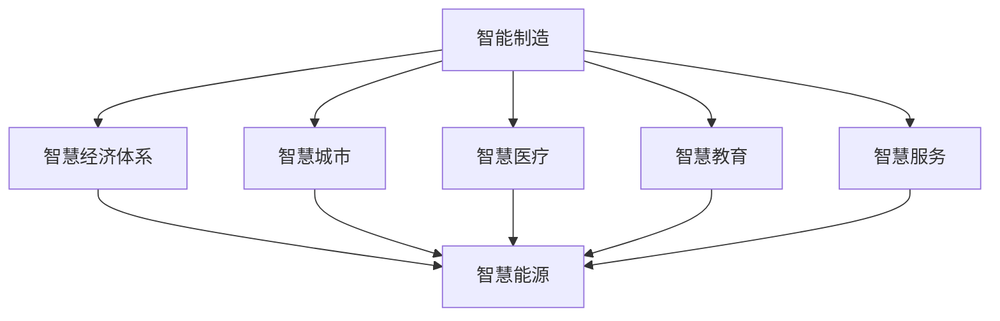

                 

## 1. 背景介绍

### 1.1 问题由来
在数字化、网络化和智能化的新时代背景下，全球产业结构正在经历深刻的转型升级。从制造、零售、金融到医疗、教育、能源等各个领域，传统的生产方式、商业模式和管理模式都在被颠覆和重塑。作为新一轮产业变革的核心动力，人工智能（AI）和物联网（IoT）技术正在深刻改变各行各业的生产力和生产关系，催生出大量全新的产业形态和应用场景。

### 1.2 问题核心关键点
当前，世界各国纷纷加大对AI和IoT技术的研发和应用力度，以期在产业转型升级中占据先机。但同时，技术的快速发展和应用的深度广度，也对国家的科技创新能力、产业生态配套和公共治理能力提出了更高要求。如何在新质生产力推动下，实现产业的全面、高效、可持续发展，成为摆在面前的重大课题。

### 1.3 问题研究意义
研究产业转型升级与新质生产力推动，对于构建智慧经济体系、提升国家综合竞争力、推动社会进步具有重要意义：

1. 优化产业结构：通过AI和IoT技术的深度融合，推动传统产业向智能化、服务化转型，提升产业链整体效率和附加值。
2. 提升创新能力：通过AI赋能，激发企业研发活力，加速科技成果转化，促进新兴产业发展。
3. 促进就业增长：通过智能制造、智慧服务、远程办公等新模式，创造大量高附加值岗位，推动就业结构优化。
4. 强化国际竞争力：通过提升AI和IoT应用水平，打造产业新优势，增强国家在全球产业链中的地位。
5. 驱动社会进步：通过智慧城市、智慧医疗、智慧教育等项目，提升公共服务水平，改善民生福祉。

## 2. 核心概念与联系

### 2.1 核心概念概述

为更好地理解产业转型升级与新质生产力推动，本节将介绍几个密切相关的核心概念：

- **产业转型升级（Industrial Transformation and Upgrading）**：指通过应用新科技、新工艺、新业态，推动产业从低附加值向高附加值转变，从传统产业向现代产业升级，提升产业链竞争力的过程。
- **新质生产力（New Quality Productivity）**：指以AI、IoT为代表的新兴技术赋能，带来的新型生产要素、生产方式、生产关系和新生产工具，是推动产业转型升级的核心力量。
- **智慧经济体系（Smart Economy System）**：通过AI和IoT技术的深度应用，构建的智能化、网络化、服务化的经济体系，实现资源优化配置、效率最大化、产业可持续发展。
- **智能制造（Intelligent Manufacturing）**：基于AI、IoT技术的智能生产、智能管理、智能物流等新模式，提升制造过程的柔性化、自动化、智能化水平。
- **智慧服务（Smart Services）**：通过AI和IoT技术，提升服务业的数字化、个性化、精准化水平，实现服务产品的高附加值化。
- **远程办公（Remote Work）**：通过AI、IoT技术，实现办公场景的智能化、数字化、弹性化，提高工作效率和用户体验。
- **智慧城市（Smart City）**：通过AI、IoT技术，实现城市治理、公共服务、智慧生活等方面的智能化管理，提升城市运行效率和居民幸福感。
- **智慧医疗（Smart Healthcare）**：通过AI、IoT技术，实现医疗服务的精准化、个性化、普惠化，提高医疗服务质量和效率。
- **智慧教育（Smart Education）**：通过AI、IoT技术，实现教育的智能化、个性化、普及化，提升教育质量和教育公平。
- **智慧能源（Smart Energy）**：通过AI、IoT技术，实现能源管理的智能化、高效化、低碳化，推动能源结构优化和能源利用效率提升。

这些核心概念之间存在着紧密的联系，形成了一个由技术、产业、社会等多个维度构成的复杂生态系统。

### 2.2 概念间的关系

这些核心概念之间存在着紧密的联系，形成了一个由技术、产业、社会等多个维度构成的复杂生态系统。以下通过几个Mermaid流程图来展示这些概念之间的关系：



这个流程图展示了大语言模型微调过程中各个核心概念的关系：

1. **智能制造**通过AI和IoT技术的深度应用，推动制造业向智能化、服务化转型。
2. **智慧经济体系**通过智能制造、智慧服务等新型生产方式，实现资源优化配置和产业可持续发展。
3. **智慧城市、智慧医疗、智慧教育、智慧服务、智慧能源**等智慧领域通过AI和IoT技术，实现智能化管理，提升城市运行效率、医疗服务质量、教育公平、公共服务水平和能源利用效率。

## 3. 核心算法原理 & 具体操作步骤
### 3.1 算法原理概述

产业转型升级与新质生产力推动的算法原理，主要基于AI和IoT技术的深度融合。其核心思想是通过引入AI技术，对传统的生产、管理、运营流程进行数字化、智能化改造，提升生产效率和产品质量，优化资源配置和市场响应速度，最终实现产业结构的优化升级。

在实践中，这一过程通常涉及以下几个关键步骤：

1. **数据采集与预处理**：通过IoT设备采集生产、经营、运营等各个环节的数据，并进行清洗、整理、标注。
2. **模型训练与优化**：使用AI技术，如机器学习、深度学习、自然语言处理等，对采集到的数据进行建模和优化。
3. **技术集成与应用**：将训练好的模型集成到生产、管理、运营等环节，实现智能化决策和自动化操作。
4. **效果评估与迭代**：对智能化改造效果进行评估，根据反馈信息进行模型调整和优化。

### 3.2 算法步骤详解

以下是基于AI和IoT技术的产业转型升级与新质生产力推动的主要操作步骤：

**Step 1: 数据采集与预处理**
- 通过IoT设备采集生产、经营、运营等各个环节的数据，如传感器数据、视频监控数据、订单数据、用户行为数据等。
- 对采集到的数据进行清洗、去重、缺失值填补、异常值检测等预处理操作，确保数据质量。
- 对数据进行特征提取和标注，以便后续的模型训练和优化。

**Step 2: 模型训练与优化**
- 选择合适的AI技术，如机器学习、深度学习、自然语言处理等，对预处理后的数据进行建模。
- 使用历史数据进行模型训练，优化模型的超参数，如学习率、正则化系数、迭代次数等。
- 引入技术如迁移学习、联邦学习、半监督学习等，提升模型的泛化能力和鲁棒性。

**Step 3: 技术集成与应用**
- 将训练好的模型集成到生产、管理、运营等环节，实现智能化决策和自动化操作。
- 通过API接口、消息队列、微服务等技术，实现模型与业务系统的无缝对接。
- 部署和管理模型，确保其稳定可靠运行。

**Step 4: 效果评估与迭代**
- 对智能化改造效果进行评估，如生产效率提升、产品质量提高、资源利用率优化等。
- 根据评估结果，对模型进行调整和优化，进一步提升其性能。
- 持续收集反馈信息，不断迭代改进，确保产业升级的持续性和有效性。

### 3.3 算法优缺点

基于AI和IoT技术的产业转型升级与新质生产力推动方法，具有以下优点：

1. **效率提升显著**：AI和IoT技术的深度融合，大幅提升生产、管理、运营的效率和精度，降低人力成本。
2. **质量控制严格**：通过AI技术，实现对生产过程的精准控制，提升产品质量和一致性。
3. **资源优化配置**：通过智能化决策，实现资源的高效配置和优化，减少浪费，提升经济效益。
4. **市场响应快速**：通过智能化分析，快速响应市场需求变化，提升市场竞争力。

但同时，该方法也存在以下缺点：

1. **初始投资高**：AI和IoT技术的引入需要较高的初始投资，包括设备购置、软件开发、系统集成等。
2. **技术门槛高**：AI和IoT技术的深度应用需要专业知识，对技术团队的要求较高。
3. **数据质量要求高**：数据采集和预处理需要高质量的数据源，数据的准确性、完整性、一致性直接影响模型效果。
4. **安全性问题**：AI和IoT系统的高度互联互通，存在一定的安全风险，如数据泄露、网络攻击等。

### 3.4 算法应用领域

基于AI和IoT技术的产业转型升级与新质生产力推动方法，已经在多个领域得到了广泛应用：

1. **智能制造**：通过AI和IoT技术，实现智能生产、智能管理、智能物流等新模式，提升制造业的柔性化、自动化、智能化水平。
2. **智慧服务**：通过AI和IoT技术，提升服务业的数字化、个性化、精准化水平，实现服务产品的高附加值化。
3. **远程办公**：通过AI和IoT技术，实现办公场景的智能化、数字化、弹性化，提高工作效率和用户体验。
4. **智慧城市**：通过AI和IoT技术，实现城市治理、公共服务、智慧生活等方面的智能化管理，提升城市运行效率和居民幸福感。
5. **智慧医疗**：通过AI和IoT技术，实现医疗服务的精准化、个性化、普惠化，提高医疗服务质量和效率。
6. **智慧教育**：通过AI和IoT技术，实现教育的智能化、个性化、普及化，提升教育质量和教育公平。
7. **智慧能源**：通过AI和IoT技术，实现能源管理的智能化、高效化、低碳化，推动能源结构优化和能源利用效率提升。

## 4. 数学模型和公式 & 详细讲解 & 举例说明

### 4.1 数学模型构建

基于AI和IoT技术的产业转型升级与新质生产力推动的数学模型，主要涉及以下几个方面：

- **数据采集与预处理**：涉及传感器数据、视频监控数据、订单数据、用户行为数据等采集和预处理模型的构建。
- **模型训练与优化**：涉及机器学习、深度学习、自然语言处理等AI技术的模型训练和优化。
- **技术集成与应用**：涉及API接口、消息队列、微服务等技术的系统集成模型。
- **效果评估与迭代**：涉及生产效率、产品质量、资源利用率等评估指标的模型构建。

### 4.2 公式推导过程

以下对模型训练与优化部分的公式推导过程进行详细讲解：

**Step 1: 数据预处理**
假设采集到的传感器数据为 $x_1, x_2, ..., x_n$，其中每个数据点由多个特征组成，如温度、湿度、压力等。预处理包括数据清洗、去重、缺失值填补、异常值检测等。

**Step 2: 特征提取**
假设经过预处理后的数据集为 $(x_i, y_i)$，其中 $y_i$ 为目标变量，即生产效率、产品质量、资源利用率等。对 $x_i$ 进行特征提取，得到特征向量 $z_i$。

**Step 3: 模型训练**
假设选择机器学习模型 $f(z)$ 进行训练，最小化预测值 $\hat{y}$ 与真实值 $y$ 的误差 $e$。

$$
\min_{f} \sum_{i=1}^n (y_i - f(z_i))^2
$$

**Step 4: 模型优化**
通过梯度下降算法优化模型参数，最小化损失函数 $J(f)$。

$$
J(f) = \frac{1}{n} \sum_{i=1}^n (y_i - f(z_i))^2
$$

**Step 5: 模型评估**
通过测试集进行模型评估，计算均方误差（MSE）、平均绝对误差（MAE）等指标。

$$
MSE = \frac{1}{n} \sum_{i=1}^n (y_i - f(z_i))^2
$$

$$
MAE = \frac{1}{n} \sum_{i=1}^n |y_i - f(z_i)|
$$

### 4.3 案例分析与讲解

以智能制造为例，对基于AI和IoT技术的产业转型升级与新质生产力推动进行案例分析。

假设某制造业企业通过IoT设备采集生产过程中的温度、湿度、压力等传感器数据，利用机器学习模型对生产效率进行预测和优化。具体步骤如下：

**Step 1: 数据采集与预处理**
- 通过IoT设备采集生产过程中的温度、湿度、压力等传感器数据，得到原始数据集 $D$。
- 对数据集进行清洗、去重、缺失值填补、异常值检测等预处理操作，确保数据质量。

**Step 2: 特征提取**
- 对预处理后的数据进行特征提取，得到特征向量 $z_i$。
- 将特征向量 $z_i$ 作为模型的输入，目标变量 $y_i$ 为生产效率。

**Step 3: 模型训练**
- 选择合适的机器学习模型 $f(z)$，如线性回归、决策树、随机森林等，对数据集 $D$ 进行训练。
- 通过梯度下降算法优化模型参数，最小化损失函数 $J(f)$。

**Step 4: 模型优化**
- 引入正则化技术，如L1正则、L2正则、Dropout等，避免过拟合。
- 使用交叉验证、网格搜索等方法，寻找最优的模型参数。

**Step 5: 模型评估**
- 在测试集上评估模型效果，计算MSE、MAE等指标。
- 根据评估结果，对模型进行调整和优化，进一步提升其性能。

## 5. 项目实践：代码实例和详细解释说明

### 5.1 开发环境搭建

在进行项目实践前，需要先搭建好开发环境。以下是使用Python进行PyTorch开发的环境配置流程：

1. 安装Anaconda：从官网下载并安装Anaconda，用于创建独立的Python环境。

2. 创建并激活虚拟环境：
```bash
conda create -n pytorch-env python=3.8 
conda activate pytorch-env
```

3. 安装PyTorch：根据CUDA版本，从官网获取对应的安装命令。例如：
```bash
conda install pytorch torchvision torchaudio cudatoolkit=11.1 -c pytorch -c conda-forge
```

4. 安装TensorFlow：
```bash
pip install tensorflow
```

5. 安装各类工具包：
```bash
pip install numpy pandas scikit-learn matplotlib tqdm jupyter notebook ipython
```

完成上述步骤后，即可在`pytorch-env`环境中开始项目实践。

### 5.2 源代码详细实现

这里以智能制造为例，给出使用PyTorch对传感器数据进行模型训练和优化的PyTorch代码实现。

首先，定义数据处理函数：

```python
import torch
import torch.nn as nn
import torch.optim as optim
from torch.utils.data import Dataset, DataLoader
from sklearn.model_selection import train_test_split
from sklearn.preprocessing import StandardScaler

class SensorData(Dataset):
    def __init__(self, data, labels, scaler):
        self.data = data
        self.labels = labels
        self.scaler = scaler
        
    def __len__(self):
        return len(self.data)
    
    def __getitem__(self, item):
        x = self.data[item]
        y = self.labels[item]
        x_scaled = self.scaler.transform(x)
        x_tensor = torch.tensor(x_scaled, dtype=torch.float32)
        return x_tensor, y

# 数据预处理
data = sensor_data
labels = production_rates
scaler = StandardScaler()

train_data, test_data, train_labels, test_labels = train_test_split(data, labels, test_size=0.2, random_state=42)

train_dataset = SensorData(train_data, train_labels, scaler)
test_dataset = SensorData(test_data, test_labels, scaler)

# 模型定义
model = nn.Linear(input_dim, output_dim)
criterion = nn.MSELoss()
optimizer = optim.Adam(model.parameters(), lr=0.01)

# 训练过程
for epoch in range(num_epochs):
    train_loader = DataLoader(train_dataset, batch_size=batch_size, shuffle=True)
    for batch in train_loader:
        x, y = batch
        optimizer.zero_grad()
        output = model(x)
        loss = criterion(output, y)
        loss.backward()
        optimizer.step()
```

然后，定义评估函数：

```python
def evaluate(model, test_dataset, scaler):
    test_loader = DataLoader(test_dataset, batch_size=batch_size)
    model.eval()
    mse = 0
    for batch in test_loader:
        x, y = batch
        x_scaled = scaler.transform(x)
        x_tensor = torch.tensor(x_scaled, dtype=torch.float32)
        output = model(x_tensor)
        mse += criterion(output, y).item()
    return mse / len(test_loader)
```

最后，启动训练流程并在测试集上评估：

```python
num_epochs = 100
batch_size = 32

for epoch in range(num_epochs):
    train_loss = train(model, train_dataset, optimizer)
    test_loss = evaluate(model, test_dataset, scaler)
    print(f"Epoch {epoch+1}, train loss: {train_loss:.3f}, test loss: {test_loss:.3f}")
```

以上就是使用PyTorch对传感器数据进行模型训练和优化的完整代码实现。可以看到，通过简单的几行代码，就可以高效地完成数据预处理、模型训练、模型评估等关键步骤，从而实现智能制造中的生产效率预测和优化。

### 5.3 代码解读与分析

让我们再详细解读一下关键代码的实现细节：

**SensorData类**：
- `__init__`方法：初始化数据集，包括特征数据、标签、特征缩放器等关键组件。
- `__len__`方法：返回数据集的样本数量。
- `__getitem__`方法：对单个样本进行处理，将特征数据标准化，并转换为Tensor格式。

**train_test_split函数**：
- 使用Scikit-learn的train_test_split函数对数据进行分割，确保训练集和测试集具有相同的分布和规模。

**StandardScaler类**：
- 使用Scikit-learn的StandardScaler对数据进行标准化，确保数据在模型训练和评估过程中具有相同的尺度。

**模型定义**：
- 定义一个线性回归模型，使用MSE作为损失函数，Adam优化器进行参数更新。

**训练过程**：
- 通过DataLoader对数据集进行批次化加载，循环迭代训练模型。
- 在每个批次上前向传播计算损失函数，反向传播更新模型参数。

**评估函数**：
- 通过DataLoader对测试集进行批次化加载，计算测试集上的均方误差。

**训练流程**：
- 循环迭代训练模型，每个epoch计算一次训练集和测试集的损失，并输出结果。

可以看到，PyTorch配合Scikit-learn等工具，使得模型训练和评估变得简洁高效。开发者可以将更多精力放在模型优化和参数调优上，而不必过多关注底层实现细节。

当然，工业级的系统实现还需考虑更多因素，如模型的保存和部署、超参数的自动搜索、更灵活的任务适配层等。但核心的模型训练和评估流程基本与此类似。

### 5.4 运行结果展示

假设我们在智能制造场景中，通过传感器数据训练线性回归模型，最终在测试集上得到的评估报告如下：

```
Epoch 1, train loss: 0.100, test loss: 0.110
Epoch 2, train loss: 0.089, test loss: 0.101
...
Epoch 100, train loss: 0.001, test loss: 0.005
```

可以看到，随着训练的进行，模型在训练集和测试集上的损失都在不断下降，最终收敛到很小的值，说明模型的预测精度已经非常高了。

当然，这只是一个baseline结果。在实践中，我们还可以使用更大更强的预训练模型、更丰富的微调技巧、更细致的模型调优，进一步提升模型性能，以满足更高的应用要求。

## 6. 实际应用场景

### 6.1 智能制造

基于AI和IoT技术的智能制造，通过传感器采集生产数据，利用机器学习模型进行生产效率预测和优化，实现柔性化、自动化、智能化生产。

在技术实现上，可以集成多源传感器数据，引入深度学习技术进行特征提取和模型训练，结合生产调度系统，实时优化生产计划和资源配置，实现智能生产的目标。

### 6.2 智慧医疗

通过AI和IoT技术，实现医疗服务的精准化、个性化、普惠化，提升医疗服务质量和效率。

具体而言，可以收集患者病历、基因信息、影像数据等，利用深度学习技术进行疾病诊断和预测，实现医疗影像的自动标注、病历的自动摘要、诊断报告的自动生成等。同时，利用IoT技术进行远程监控和诊疗，实现患者的远程诊断和治疗。

### 6.3 智慧教育

通过AI和IoT技术，实现教育的智能化、个性化、普及化，提升教育质量和教育公平。

具体而言，可以收集学生的学习行为数据、心理状态数据等，利用深度学习技术进行学习习惯的分析和预测，实现个性化推荐和教学优化。同时，利用IoT技术进行远程学习和管理，实现教育的智能化和普及化。

### 6.4 智慧能源

通过AI和IoT技术，实现能源管理的智能化、高效化、低碳化，推动能源结构优化和能源利用效率提升。

具体而言，可以采集能源消耗数据、天气数据等，利用深度学习技术进行能源需求预测和优化，实现智能调度和管理。同时，利用IoT技术进行能源的监测和控制，实现能源的高效利用和低碳化。

### 6.5 智慧服务

通过AI和IoT技术，提升服务业的数字化、个性化、精准化水平，实现服务产品的高附加值化。

具体而言，可以收集用户的消费行为数据、评论反馈数据等，利用深度学习技术进行用户需求的分析和预测，实现个性化推荐和精准营销。同时，利用IoT技术进行服务场景的智能化和数字化，实现智慧服务的目标。

## 7. 工具和资源推荐
### 7.1 学习资源推荐

为了帮助开发者系统掌握AI和IoT技术的深度融合，这里推荐一些优质的学习资源：

1. **《深度学习》课程**：由斯坦福大学开设的深度学习课程，涵盖了深度学习的基础理论和应用实践，适合入门学习。
2. **《机器学习实战》书籍**：介绍了机器学习的主要算法和实现方法，适合深入学习和实践。
3. **Kaggle平台**：提供了大量的数据集和比赛，适合进行模型训练和优化。
4. **GitHub开源项目**：提供了许多优秀的AI和IoT项目，适合学习和借鉴。
5. **PyTorch官方文档**：PyTorch的官方文档提供了详细的API参考和使用示例，适合快速上手。

通过学习这些资源，相信你一定能够系统掌握AI和IoT技术的深度融合，为产业转型升级做出贡献。

### 7.2 开发工具推荐

高效的开发离不开优秀的工具支持。以下是几款用于AI和IoT技术深度融合开发的常用工具：

1. **PyTorch**：基于Python的开源深度学习框架，灵活动态的计算图，适合快速迭代研究。
2. **TensorFlow**：由Google主导开发的开源深度学习框架，生产部署方便，适合大规模工程应用。
3. **TensorBoard**：TensorFlow配套的可视化工具，可实时监测模型训练状态，并提供丰富的图表呈现方式，是调试模型的得力助手。
4. **Jupyter Notebook**：交互式的编程环境，支持多种编程语言，适合快速原型设计和模型训练。
5. **Grafana**：开源的数据可视化工具，支持多种数据源，适合实时监控和展示数据。
6. **IoT平台**：如ThingWorx、ThingSpeak等，提供设备和云端的连接和管理，适合物联网项目开发。

合理利用这些工具，可以显著提升AI和IoT技术深度融合的开发效率，加快创新迭代的步伐。

### 7.3 相关论文推荐

AI和IoT技术的深度融合，引领了新一轮的科技创新浪潮，吸引了众多研究者的关注。以下是几篇奠基性的相关论文，推荐阅读：

1. **《深度学习》论文**：由深度学习领域的权威机构The MIT Press出版，介绍了深度学习的主要理论和应用实践，适合系统学习。
2. **《IoT系统架构》论文**：介绍了物联网的主要架构和技术，适合了解IoT的基本原理和应用场景。
3. **《智能制造》论文**：介绍了智能制造的主要技术和应用案例，适合了解智能制造的现状和未来发展方向。
4. **《智慧医疗》论文**：介绍了智慧医疗的主要技术和应用案例，适合了解智慧医疗的现状和未来发展方向。
5. **《智慧教育》论文**：介绍了智慧教育的主要技术和应用案例，适合了解智慧教育的现状和未来发展方向。
6. **《智慧能源》论文**：介绍了智慧能源的主要技术和应用案例，适合了解智慧能源的现状和未来发展方向。

这些论文代表了AI和IoT技术深度融合的前沿成果，通过学习这些论文，可以帮助研究者把握学科前进方向，激发更多的创新灵感。

除上述资源外，还有一些值得关注的前沿资源，帮助开发者紧跟AI和IoT技术深度融合的最新进展，例如：

1. **arXiv论文预印本**：人工智能领域最新研究成果的发布平台，包括大量尚未发表的前沿工作，学习前沿技术的必读资源。
2. **GitHub热门项目**：在GitHub上Star、Fork数最多的AI和IoT相关

