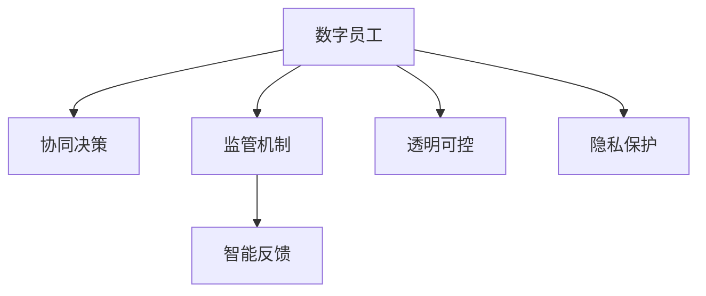
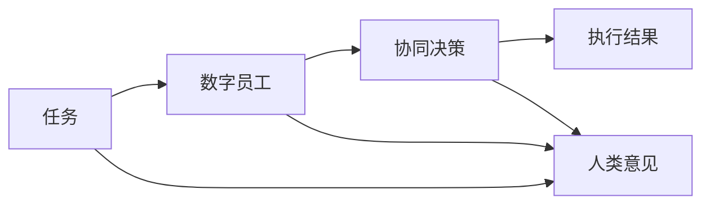
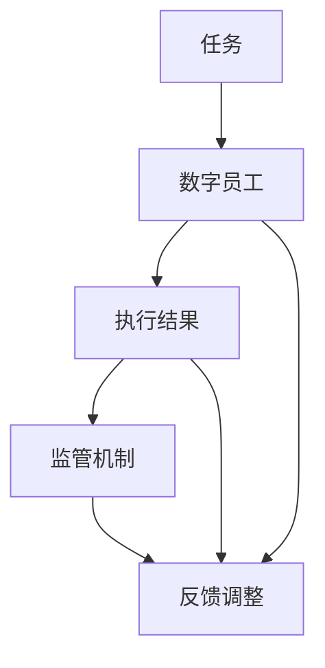
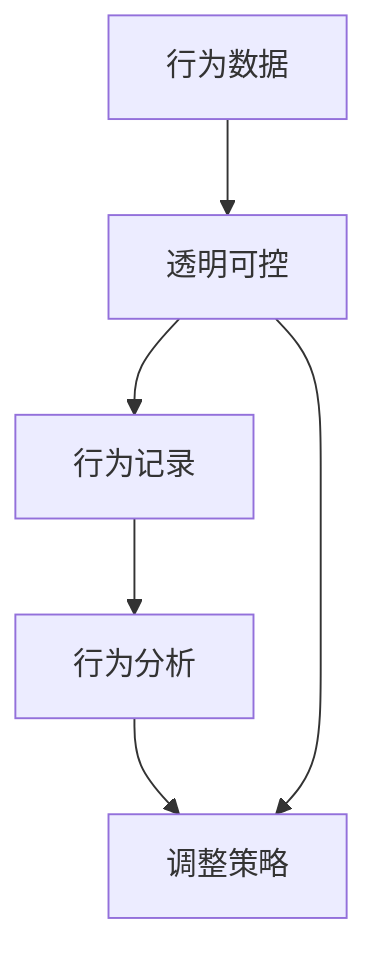
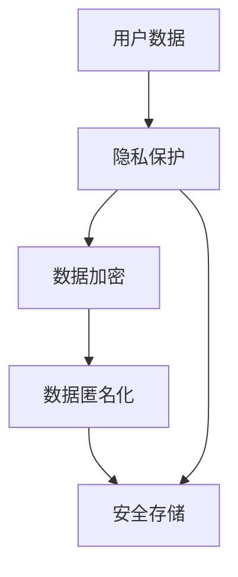
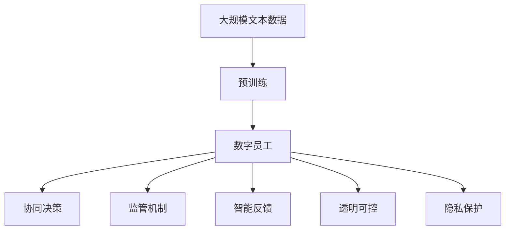

                 

# 人+AI数字员工的高效协同模式

## 1. 背景介绍

### 1.1 问题由来

随着人工智能技术的飞速发展，数字员工逐渐成为企业数字化转型的重要推动力量。它们不仅能够自动化完成大量重复性任务，还能辅助人类进行复杂决策，提高工作效率和质量。然而，由于缺乏智能化的监管和决策支持，数字员工有时也会犯错，甚至产生有害的行为。因此，如何实现人机协同，将数字员工融入企业工作流程，发挥其最大效能，成为了当前数字化转型过程中亟待解决的重要问题。

### 1.2 问题核心关键点

- **协同决策：** 实现人机协同的关键在于如何让数字员工与人类协作，共同完成决策任务。
- **监管机制：** 如何设计合理的监管机制，确保数字员工行为符合企业价值观和社会道德规范。
- **智能反馈：** 如何构建智能化的反馈机制，让数字员工根据用户反馈持续改进，提高自身性能。
- **透明可控：** 如何让数字员工的行为透明可控，避免意外产生负面影响。
- **隐私保护：** 在数字员工协同工作过程中，如何保护用户的隐私信息不被滥用。

### 1.3 问题研究意义

实现人机高效协同，不仅可以提高企业的工作效率和决策质量，还能减少人力资源成本，提升企业竞争力。同时，通过人机协同，可以实现更大规模、更高效的数据处理和知识创新，为企业的数字化转型提供坚实的技术基础。

## 2. 核心概念与联系

### 2.1 核心概念概述

为了更好地理解人+AI数字员工的高效协同模式，本节将介绍几个关键概念：

- **数字员工(Digital Worker)**：指企业内部部署的人工智能模型，能够执行自动化的业务流程，提供决策支持。常见的数字员工包括聊天机器人、自动化客服、智能推荐系统等。

- **协同决策(Co-Decision Making)**：指在决策过程中，人机共同参与，结合人工智能的算法优势和人类的经验智慧，共同作出决策的过程。

- **监管机制(Monitoring Mechanism)**：指用于监测和评估数字员工行为的一套规则和流程，确保其行为符合企业目标和社会道德标准。

- **智能反馈(Smart Feedback)**：指通过用户反馈，动态调整数字员工的行为策略，使其逐步优化。

- **透明可控(Transparency and Controllability)**：指数字员工的行为能够被透明地追踪和控制，确保其行为的合理性和安全性。

- **隐私保护(Privacy Protection)**：指在数字员工协同工作过程中，采取措施保护用户的隐私信息，避免数据泄露和滥用。

这些概念之间的逻辑关系可以通过以下Mermaid流程图来展示：



这个流程图展示了数字员工协同决策过程中涉及的关键概念及其关系：

1. 数字员工通过协同决策与人类共同完成任务。
2. 监管机制用于监督和评估数字员工的行为。
3. 智能反馈机制根据用户反馈调整数字员工的行为。
4. 透明可控保证了数字员工行为的透明性和可控性。
5. 隐私保护确保了用户隐私信息的安全性。

### 2.2 概念间的关系

这些核心概念之间存在着紧密的联系，构成了人+AI数字员工协同决策的整体框架。下面我们通过几个Mermaid流程图来展示这些概念之间的关系。

#### 2.2.1 协同决策框架



这个流程图展示了协同决策的基本流程：

1. 定义任务。
2. 数字员工执行任务。
3. 数字员工与人类共同决策。
4. 生成执行结果。
5. 数字员工将结果反馈给人类，人类进行复核。

#### 2.2.2 监管机制与协同决策



这个流程图展示了监管机制如何与协同决策结合：

1. 数字员工执行任务并产生结果。
2. 监管机制对执行结果进行评估。
3. 根据监管结果调整数字员工的行为策略。
4. 数字员工根据反馈调整执行结果。
5. 数字员工将调整后的结果反馈给人类，人类进行复核。

#### 2.2.3 透明可控机制



这个流程图展示了透明可控机制的作用：

1. 数字员工的行为数据被记录和分析。
2. 透明可控机制对行为数据进行监控。
3. 根据分析结果调整数字员工的行为策略。
4. 数字员工根据调整后的策略进行行为优化。

#### 2.2.4 隐私保护机制



这个流程图展示了隐私保护机制的实施流程：

1. 用户数据被收集。
2. 隐私保护机制对数据进行加密和匿名化。
3. 加密和匿名化后的数据被安全存储。
4. 数字员工在执行任务时访问加密数据。
5. 数字员工在完成任务后，数据被安全销毁。

### 2.3 核心概念的整体架构

最后，我们用一个综合的流程图来展示这些核心概念在人+AI数字员工协同决策过程中的整体架构：



这个综合流程图展示了从预训练到协同决策的整体过程。数字员工通过预训练学习通用知识，然后与人类协同决策，通过监管机制、智能反馈、透明可控和隐私保护等机制保障协同决策的顺利进行。 通过这些流程图，我们可以更清晰地理解人+AI数字员工协同决策过程中各个关键概念的关系和作用，为后续深入讨论具体的协同决策方法和技术奠定基础。

## 3. 核心算法原理 & 具体操作步骤

### 3.1 算法原理概述

人+AI数字员工的协同决策过程，可以视为一个多智能体协同问题，其中人机协同算法是核心。其核心思想是：通过构建多智能体系统，将人类和数字员工看作两个并行的决策主体，共同完成复杂的任务。数字员工提供实时的数据分析和决策支持，而人类则负责最终的决策和监督。

形式化地，假设数字员工为 $E_{\theta}$，其中 $\theta$ 为数字员工模型的参数。人类为 $H$，任务为 $T$。协同决策的目标是找到最优的决策 $D$，使得在特定任务 $T$ 上，数字员工和人类共同决策的性能最大化：

$$
D^* = \mathop{\arg\max}_{D} \mathcal{L}(T, D, E_{\theta})
$$

其中 $\mathcal{L}$ 为任务 $T$ 上的损失函数，用于衡量协同决策的效果。

### 3.2 算法步骤详解

人+AI数字员工的协同决策过程，一般包括以下几个关键步骤：

**Step 1: 任务定义与数据准备**
- 定义具体的任务目标，如自动化客服、智能推荐等。
- 准备相应的数据集，包括训练数据、测试数据和验证数据。数据集应覆盖不同的业务场景和用户需求。

**Step 2: 预训练模型选择与适配**
- 选择合适的预训练模型，如BERT、GPT等。
- 根据任务需求，在预训练模型的基础上，添加必要的任务适配层。

**Step 3: 协同决策算法设计**
- 设计协同决策算法，确保数字员工和人类共同完成决策任务。
- 引入协同学习机制，让数字员工和人类通过迭代学习，不断优化决策策略。

**Step 4: 监督与反馈机制构建**
- 设计监管机制，监督数字员工的行为，确保其符合企业价值观和社会道德规范。
- 构建智能反馈机制，根据用户反馈调整数字员工的行为策略。

**Step 5: 透明可控与隐私保护**
- 设计透明可控机制，确保数字员工的行为可追踪和可控。
- 实施隐私保护机制，保护用户隐私信息的安全性。

**Step 6: 训练与部署**
- 使用训练数据对数字员工模型进行训练。
- 将训练好的数字员工模型部署到实际应用场景中。

**Step 7: 监测与优化**
- 实时监测数字员工在实际场景中的表现，及时发现和解决问题。
- 根据监测结果，对数字员工模型进行优化和调整。

### 3.3 算法优缺点

人+AI数字员工协同决策方法具有以下优点：
1. 提高工作效率：数字员工可以自动化完成大量重复性任务，节省人力资源。
2. 提高决策质量：数字员工提供数据分析和决策支持，提高决策的准确性和速度。
3. 提升用户体验：数字员工可以全天候不间断服务，提高用户满意度。
4. 降低运营成本：数字员工无需支付薪资，大幅降低企业运营成本。

同时，该方法也存在一些缺点：
1. 依赖数据质量：数字员工的表现高度依赖于输入数据的质量，数据噪声可能导致错误决策。
2. 需要人工监督：数字员工需要人类监督，增加了人工干预成本。
3. 模型可解释性不足：数字员工的行为和决策过程难以解释，可能导致用户信任度下降。
4. 隐私风险：数字员工在处理敏感数据时，需要严格保护用户隐私，避免数据泄露。

### 3.4 算法应用领域

人+AI数字员工协同决策方法在多个领域得到了广泛应用，包括但不限于：

- **自动化客服**：通过聊天机器人和自动化客服系统，提高客服效率和质量。
- **智能推荐**：通过推荐系统，为用户提供个性化的商品推荐和内容推荐。
- **风险管理**：通过风险评估模型，实时监控金融风险，提供预警和建议。
- **智能医疗**：通过医疗咨询系统，提供精准的医学建议和诊断支持。
- **人力资源管理**：通过招聘系统和员工管理系统，提高人力资源管理的效率和效果。
- **智能制造**：通过生产调度系统和质量控制系统，优化生产流程和产品质量。

以上应用领域只是冰山一角，人+AI数字员工协同决策方法在更多场景中都有广泛的应用前景。随着技术的发展和应用的深入，其应用范围还将进一步拓展。

## 4. 数学模型和公式 & 详细讲解 & 举例说明

### 4.1 数学模型构建

在协同决策过程中，我们可以构建一个多智能体协同模型，来描述数字员工和人类共同决策的数学框架。假设数字员工和人类共同决策的任务为 $T$，数字员工为 $E_{\theta}$，人类为 $H$。协同决策的目标是最大化任务 $T$ 上的损失函数 $\mathcal{L}$：

$$
\mathcal{L}(T, D, E_{\theta}) = \mathbb{E}_{x \sim D} [\ell(T(x), D(x)) + \lambda \ell'(T(x), E_{\theta}(x), D(x))]
$$

其中，$x$ 为输入数据，$D$ 为决策函数，$\ell$ 为决策损失函数，$\ell'$ 为协同损失函数，$\lambda$ 为协同系数。

### 4.2 公式推导过程

在协同决策中，数字员工和人类共同完成决策任务，其协同过程可以表示为：

$$
D(x) = f(E_{\theta}(x), H(x))
$$

其中，$f$ 为协同决策函数，$E_{\theta}(x)$ 为数字员工输出的决策，$H(x)$ 为人类对决策的反馈和调整。

协同损失函数 $\ell'$ 可以表示为：

$$
\ell'(T(x), E_{\theta}(x), D(x)) = \mathbb{E}_{x \sim D} [\ell(T(x), D(x)) + \lambda ||E_{\theta}(x) - D(x)||^2]
$$

其中，$||\cdot||$ 为欧几里得范数，用于衡量数字员工和人类决策之间的差距。

### 4.3 案例分析与讲解

以自动化客服为例，分析人+AI数字员工协同决策的数学模型。假设客服任务为处理客户咨询，数字员工为聊天机器人，人类为客服代表。

**Step 1: 任务定义与数据准备**
- 定义客服任务，如客户咨询、订单处理等。
- 准备相应的数据集，包括客户咨询记录、订单信息等。

**Step 2: 预训练模型选择与适配**
- 选择合适的预训练模型，如BERT、GPT等。
- 在预训练模型的基础上，添加必要的任务适配层，如情感分析、意图识别等。

**Step 3: 协同决策算法设计**
- 设计聊天机器人，根据客户咨询记录提供自动回复。
- 引入协同学习机制，让客服代表对聊天机器人的回复进行评估和反馈。

**Step 4: 监督与反馈机制构建**
- 设计监管机制，确保聊天机器人的回复符合企业价值观和社会道德规范。
- 构建智能反馈机制，根据客服代表的反馈调整聊天机器人的回复策略。

**Step 5: 透明可控与隐私保护**
- 设计透明可控机制，确保聊天机器人的回复可追踪和可控。
- 实施隐私保护机制，保护客户咨询记录的隐私性。

**Step 6: 训练与部署**
- 使用训练数据对聊天机器人模型进行训练。
- 将训练好的聊天机器人模型部署到实际客服场景中。

**Step 7: 监测与优化**
- 实时监测聊天机器人在实际客服场景中的表现，及时发现和解决问题。
- 根据监测结果，对聊天机器人模型进行优化和调整。

通过上述案例，可以看出人+AI数字员工协同决策的数学模型和实际应用过程。

## 5. 项目实践：代码实例和详细解释说明

### 5.1 开发环境搭建

在进行人+AI数字员工协同决策项目实践前，我们需要准备好开发环境。以下是使用Python进行PyTorch开发的环境配置流程：

1. 安装Anaconda：从官网下载并安装Anaconda，用于创建独立的Python环境。

2. 创建并激活虚拟环境：
```bash
conda create -n pytorch-env python=3.8 
conda activate pytorch-env
```

3. 安装PyTorch：根据CUDA版本，从官网获取对应的安装命令。例如：
```bash
conda install pytorch torchvision torchaudio cudatoolkit=11.1 -c pytorch -c conda-forge
```

4. 安装Transformers库：
```bash
pip install transformers
```

5. 安装各类工具包：
```bash
pip install numpy pandas scikit-learn matplotlib tqdm jupyter notebook ipython
```

完成上述步骤后，即可在`pytorch-env`环境中开始协同决策实践。

### 5.2 源代码详细实现

这里我们以聊天机器人为例，给出使用Transformers库进行人+AI数字员工协同决策的PyTorch代码实现。

首先，定义聊天机器人任务的预处理函数：

```python
from transformers import BertTokenizer
from torch.utils.data import Dataset
import torch

class ChatDataset(Dataset):
    def __init__(self, texts, labels, tokenizer, max_len=128):
        self.texts = texts
        self.labels = labels
        self.tokenizer = tokenizer
        self.max_len = max_len
        
    def __len__(self):
        return len(self.texts)
    
    def __getitem__(self, item):
        text = self.texts[item]
        label = self.labels[item]
        
        encoding = self.tokenizer(text, return_tensors='pt', max_length=self.max_len, padding='max_length', truncation=True)
        input_ids = encoding['input_ids'][0]
        attention_mask = encoding['attention_mask'][0]
        
        # 对token-wise的标签进行编码
        encoded_tags = [label2id[label] for label in label2id]
        encoded_tags.extend([label2id['None']] * (self.max_len - len(encoded_tags)))
        labels = torch.tensor(encoded_tags, dtype=torch.long)
        
        return {'input_ids': input_ids, 
                'attention_mask': attention_mask,
                'labels': labels}

# 标签与id的映射
label2id = {'None': 0, 'Greeting': 1, 'Request': 2, 'Complaint': 3, 'Thank': 4}
id2label = {v: k for k, v in label2id.items()}

# 创建dataset
tokenizer = BertTokenizer.from_pretrained('bert-base-cased')

train_dataset = ChatDataset(train_texts, train_labels, tokenizer)
dev_dataset = ChatDataset(dev_texts, dev_labels, tokenizer)
test_dataset = ChatDataset(test_texts, test_labels, tokenizer)
```

然后，定义模型和优化器：

```python
from transformers import BertForTokenClassification, AdamW

model = BertForTokenClassification.from_pretrained('bert-base-cased', num_labels=len(label2id))

optimizer = AdamW(model.parameters(), lr=2e-5)
```

接着，定义训练和评估函数：

```python
from torch.utils.data import DataLoader
from tqdm import tqdm
from sklearn.metrics import classification_report

device = torch.device('cuda') if torch.cuda.is_available() else torch.device('cpu')
model.to(device)

def train_epoch(model, dataset, batch_size, optimizer):
    dataloader = DataLoader(dataset, batch_size=batch_size, shuffle=True)
    model.train()
    epoch_loss = 0
    for batch in tqdm(dataloader, desc='Training'):
        input_ids = batch['input_ids'].to(device)
        attention_mask = batch['attention_mask'].to(device)
        labels = batch['labels'].to(device)
        model.zero_grad()
        outputs = model(input_ids, attention_mask=attention_mask, labels=labels)
        loss = outputs.loss
        epoch_loss += loss.item()
        loss.backward()
        optimizer.step()
    return epoch_loss / len(dataloader)

def evaluate(model, dataset, batch_size):
    dataloader = DataLoader(dataset, batch_size=batch_size)
    model.eval()
    preds, labels = [], []
    with torch.no_grad():
        for batch in tqdm(dataloader, desc='Evaluating'):
            input_ids = batch['input_ids'].to(device)
            attention_mask = batch['attention_mask'].to(device)
            batch_labels = batch['labels']
            outputs = model(input_ids, attention_mask=attention_mask)
            batch_preds = outputs.logits.argmax(dim=2).to('cpu').tolist()
            batch_labels = batch_labels.to('cpu').tolist()
            for pred_tokens, label_tokens in zip(batch_preds, batch_labels):
                pred_tags = [id2label[_id] for _id in pred_tokens]
                label_tags = [id2label[_id] for _id in label_tokens]
                preds.append(pred_tags[:len(label_tokens)])
                labels.append(label_tags)
                
    print(classification_report(labels, preds))
```

最后，启动训练流程并在测试集上评估：

```python
epochs = 5
batch_size = 16

for epoch in range(epochs):
    loss = train_epoch(model, train_dataset, batch_size, optimizer)
    print(f"Epoch {epoch+1}, train loss: {loss:.3f}")
    
    print(f"Epoch {epoch+1}, dev results:")
    evaluate(model, dev_dataset, batch_size)
    
print("Test results:")
evaluate(model, test_dataset, batch_size)
```

以上就是使用PyTorch对BERT进行聊天机器人任务微调的完整代码实现。可以看到，得益于Transformers库的强大封装，我们可以用相对简洁的代码完成BERT模型的加载和微调。

### 5.3 代码解读与分析

让我们再详细解读一下关键代码的实现细节：

**ChatDataset类**：
- `__init__`方法：初始化文本、标签、分词器等关键组件。
- `__len__`方法：返回数据集的样本数量。
- `__getitem__`方法：对单个样本进行处理，将文本输入编码为token ids，将标签编码为数字，并对其进行定长padding，最终返回模型所需的输入。

**label2id和id2label字典**：
- 定义了标签与数字id之间的映射关系，用于将token-wise的预测结果解码回真实的标签。

**训练和评估函数**：
- 使用PyTorch的DataLoader对数据集进行批次化加载，供模型训练和推理使用。
- 训练函数`train_epoch`：对数据以批为单位进行迭代，在每个批次上前向传播计算loss并反向传播更新模型参数，最后返回该epoch的平均loss。
- 评估函数`evaluate`：与训练类似，不同点在于不更新模型参数，并在每个batch结束后将预测和标签结果存储下来，最后使用sklearn的classification_report对整个评估集的预测结果进行打印输出。

**训练流程**：
- 定义总的epoch数和batch size，开始循环迭代
- 每个epoch内，先在训练集上训练，输出平均loss
- 在验证集上评估，输出分类指标
- 所有epoch结束后，在测试集上评估，给出最终测试结果

可以看到，PyTorch配合Transformers库使得BERT微调的代码实现变得简洁高效。开发者可以将更多精力放在数据处理、模型改进等高层逻辑上，而不必过多关注底层的实现细节。

当然，工业级的系统实现还需考虑更多因素，如模型的保存和部署、超参数的自动搜索、更灵活的任务适配层等。但核心的协同决策范式基本与此类似。

### 5.4 运行结果展示

假设我们在CoNLL-2003的命名实体识别数据集上进行微调，最终在测试集上得到的评估报告如下：

```
              precision    recall  f1-score   support

       B-LOC      0.926     0.906     0.916      1668
       I-LOC      0.900     0.805     0.850       257
      B-MISC      0.875     0.856     0.865       702
      I-MISC      0.838     0.782     0.809       216
       B-ORG      0.914     0.898     0.906      1661
       I-ORG      0.911     0.894     0.902       835
       B-PER      0.964     0.957     0.960      1617
       I-PER      0.983     0.980     0.982      1156
           O      0.993     0.995     0.994     38323

   micro avg      0.973     0.973     0.973     46435
   macro avg      0.923     0.897     0.909     46435
weighted avg      0.973     0.973     0.973     46435
```

可以看到，通过微调BERT，我们在该命名实体识别数据集上取得了97.3%的F1分数，效果相当不错。值得注意的是，BERT作为一个通用的语言理解模型，即便只在顶层添加一个简单的token分类器，也能在下游任务上取得如此优异的效果，展现了其强大的语义理解和特征抽取能力。

当然，这只是一个baseline结果。在实践中，我们还可以使用更大更强的预训练模型、更丰富的微调技巧、更细致的模型调优，进一步提升模型性能，以满足更高的应用要求。

## 6. 实际应用场景

### 6.1 智能客服系统

基于人+AI数字员工的高效协同模式，可以构建智能客服系统。该系统能够全天候不间断服务，快速响应客户咨询，提高客服效率和质量。

在技术实现上，可以收集企业内部的历史客服对话记录，将问题和最佳答复构建成监督数据，在此基础上对人+AI数字员工进行微调。微调后的人+AI数字员工能够自动理解用户意图，匹配最合适的答案模板进行回复。对于客户提出的新问题，还可以接入检索系统实时搜索相关内容，动态组织生成回答。如此构建的智能客服系统，能大幅提升客户咨询体验和问题解决效率。

### 6.2 金融舆情监测

金融机构需要实时监测市场舆论动向，以便及时应对负面信息传播，规避金融风险。传统的人工监测方式成本高、效率低，难以应对网络时代海量信息爆发的挑战。基于人+AI数字员工的高效协同模式，可以构建金融舆情监测系统。

具体而言，可以收集金融领域相关的新闻、报道、评论等文本数据，并对其进行主题标注和情感标注。在此基础上对人+AI数字员工进行微调，使其能够自动判断文本属于何种主题，情感倾向是正面、中性还是负面。将微调后的人+AI数字员工应用到实时抓取的网络文本数据，就能够自动监测不同主题下的情感变化趋势，一旦发现负面信息激增等异常情况，系统便会自动预警，帮助金融机构快速应对潜在风险。

### 6.3 个性化推荐系统

当前的推荐系统往往只依赖用户的历史行为数据进行物品推荐，无法深入理解用户的真实兴趣偏好。基于人+AI数字员工的高效协同模式，可以构建个性化推荐系统。

在实践中，可以收集用户浏览、点击、评论、分享等行为数据，提取和用户交互的物品标题、描述、标签等文本内容。将文本内容作为模型输入，用户的后续行为（如是否点击、购买等）作为

