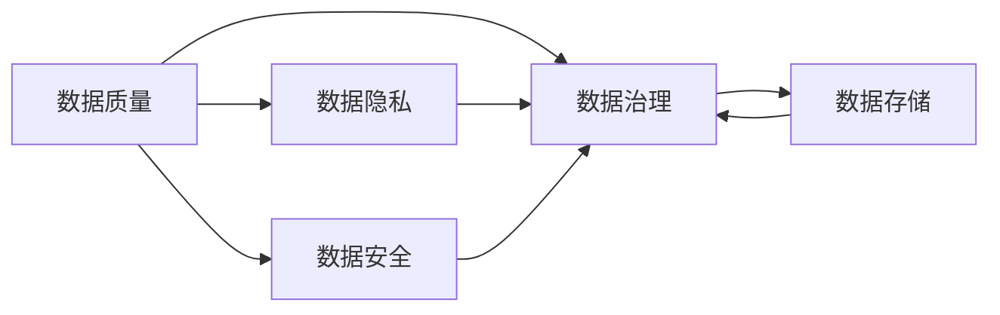

                 

# 人工智能创业数据管理的策略与方案分析

> 关键词：人工智能, 创业, 数据管理, 数据治理, 隐私保护, 数据安全, 数据质量, 数据存储

## 1. 背景介绍

### 1.1 问题由来
在人工智能（AI）创业领域，数据往往被视为企业的核心资产之一。如何高效地管理、利用和保护这些数据，直接影响到企业AI项目的成功与否。数据管理不仅是技术问题，更是战略问题。然而，大多数创业公司在数据管理方面缺乏经验，容易忽略一些关键环节，导致数据乱象丛生，影响业务发展。

### 1.2 问题核心关键点
人工智能创业公司在数据管理方面主要面临以下几个核心问题：

- **数据质量**：数据质量不佳，如缺失值、噪音、异常值等，影响模型训练和业务决策。
- **数据隐私**：个人隐私保护不力，导致用户信任度下降，甚至法律风险。
- **数据安全**：数据泄露、恶意攻击等问题频发，影响数据安全和企业声誉。
- **数据治理**：数据治理流程不清晰，数据孤岛现象严重，数据价值难以充分发挥。
- **数据存储**：数据存储效率低下，访问速度慢，成本高昂，影响系统性能。

这些问题不仅直接影响企业的数据利用效率和决策准确性，还可能引发严重的法律和商业风险。因此，有必要系统地分析这些问题，并提出有效的解决方案。

## 2. 核心概念与联系

### 2.1 核心概念概述

在探讨数据管理策略之前，我们先简要介绍几个核心概念及其相互关系：

- **数据质量**：指数据的准确性、完整性、一致性、唯一性和及时性，是数据治理的重要基础。
- **数据隐私**：指保护个人数据不被未经授权的访问、使用和泄露，是法律和伦理的要求。
- **数据安全**：指保护数据免受未经授权的访问、修改和删除，是数据管理的基本保障。
- **数据治理**：指对数据的生命周期进行规范化的管理，包括数据质量管理、隐私保护和数据安全等，确保数据的高效利用和可追溯性。
- **数据存储**：指数据的存储方式、存储效率和存储成本，是数据管理的核心环节。

这些概念之间紧密相连，相互影响。高质量的数据是数据治理的前提，数据隐私和安全是数据治理的重要组成部分，而数据存储则影响数据的质量和治理效率。

### 2.2 概念间的关系

为了更直观地理解这些概念之间的关系，我们可以使用以下Mermaid流程图来展示：



这个流程图展示了数据质量、数据隐私、数据安全和数据存储如何共同支撑数据治理，确保数据的有效管理和利用。

## 3. 核心算法原理 & 具体操作步骤

### 3.1 算法原理概述
人工智能创业公司数据管理的核心算法原理主要包括数据质量提升、数据隐私保护、数据安全增强、数据治理流程优化和数据存储效率提高。这些算法原则在实际操作中相互配合，共同构成数据管理的整体策略。

### 3.2 算法步骤详解
以下详细阐述每种算法的操作步骤：

**3.2.1 数据质量提升**
1. **数据清洗**：使用数据清洗算法去除数据中的噪音、异常值和重复值。
2. **数据标准化**：将数据按照统一的标准进行规范化，确保数据的一致性。
3. **数据补全**：对缺失的数据进行填补，保证数据的完整性。
4. **数据去重**：检测和去除重复的数据记录，确保数据的唯一性。

**3.2.2 数据隐私保护**
1. **数据匿名化**：对个人敏感信息进行匿名化处理，如使用哈希函数等。
2. **数据加密**：对数据进行加密存储和传输，确保数据在传输过程中的安全。
3. **访问控制**：使用访问控制策略，限制非授权用户访问敏感数据。
4. **差分隐私**：在数据发布时，引入噪声，保护个体隐私。

**3.2.3 数据安全增强**
1. **入侵检测**：使用入侵检测系统（IDS）检测和阻止恶意攻击。
2. **安全审计**：定期进行安全审计，发现和修复潜在的安全漏洞。
3. **数据备份**：定期备份数据，以防数据丢失或损坏。
4. **灾备恢复**：建立灾难恢复计划，确保在数据泄露或损坏时能迅速恢复。

**3.2.4 数据治理流程优化**
1. **元数据管理**：建立元数据管理机制，记录和管理数据的来源、内容和生命周期。
2. **数据版本控制**：实现数据版本控制，追踪数据变更历史。
3. **数据共享机制**：建立数据共享机制，确保数据的透明性和可追溯性。
4. **数据质量监控**：建立数据质量监控机制，及时发现和解决问题。

**3.2.5 数据存储效率提高**
1. **数据压缩**：使用数据压缩技术，减少存储空间占用。
2. **分布式存储**：使用分布式存储系统，提高数据访问速度和存储效率。
3. **数据缓存**：使用缓存技术，提高数据访问速度。
4. **数据存档**：对长期不再访问的数据进行存档，释放存储空间。

### 3.3 算法优缺点
- **优点**：
  - 数据质量提升算法可以有效处理数据噪音和异常，确保数据的高质量。
  - 数据隐私保护算法可以防止数据泄露和滥用，保护用户隐私。
  - 数据安全增强算法可以防止数据被恶意攻击和篡改，保护数据安全。
  - 数据治理流程优化算法可以规范数据管理流程，提高数据利用效率。
  - 数据存储效率提高算法可以节省存储空间和提高访问速度。

- **缺点**：
  - 数据清洗和标准化算法可能会引入误差，影响数据准确性。
  - 数据加密和匿名化算法可能会降低数据可读性，增加数据处理复杂度。
  - 数据安全增强算法可能无法检测所有威胁，存在安全隐患。
  - 数据治理流程优化算法需要投入大量资源和时间，实施成本高。
  - 数据存储效率提高算法可能会增加系统复杂度，影响系统性能。

### 3.4 算法应用领域
这些算法广泛应用于人工智能创业公司的各个领域，包括但不限于：

- **金融科技**：涉及用户交易数据、客户信息等，数据隐私和安全尤为重要。
- **医疗健康**：涉及患者病历、健康数据等，数据质量和隐私保护要求高。
- **智能制造**：涉及设备运行数据、生产过程数据等，数据管理和安全至关重要。
- **教育培训**：涉及学生学习数据、教师教学数据等，数据质量和隐私保护不可忽视。
- **物流仓储**：涉及订单数据、库存数据等，数据管理和存储效率需求高。

## 4. 数学模型和公式 & 详细讲解  
### 4.1 数学模型构建

在本节中，我们将以数据清洗为例，构建一个简单的数学模型，并推导相关的公式。

假设我们有一组数据 $D=\{(x_1, y_1), (x_2, y_2), ..., (x_n, y_n)\}$，其中 $x_i$ 是特征，$y_i$ 是标签。

数据清洗的目标是去除噪音和异常值，得到一个更干净、更可靠的数据集 $D'$。

### 4.2 公式推导过程
数据清洗过程可以分为以下几步：

1. **数据清洗函数**：定义一个数据清洗函数 $f(x)$，用于去除噪音和异常值。例如，可以使用箱线图方法，对数据进行截断处理。
2. **清洗后的数据集**：将原始数据 $D$ 通过数据清洗函数 $f(x)$，得到清洗后的数据集 $D'$。
3. **损失函数**：定义一个损失函数 $L(D', y)$，用于衡量清洗后数据集与真实标签 $y$ 的差异。

具体公式如下：

$$
D' = \{f(x_1), f(x_2), ..., f(x_n)\}
$$

$$
L(D', y) = \sum_{i=1}^n (y_i - f(x_i))^2
$$

### 4.3 案例分析与讲解
以用户交易数据清洗为例，假设用户数据包含如下特征：

| 特征名   | 特征值     | 是否异常 | 异常类型 | 处理方式 |
|----------|------------|----------|----------|----------|
| 交易金额 | $10000$    | True     | 异常值   | 截断处理 |
| 交易时间 | $2022-05-01$ | False    | 正常值   | 无处理   |
| 交易地点 | $北京$      | False    | 正常值   | 无处理   |

根据上述表格，我们可以定义一个数据清洗函数 $f(x)$，用于截断交易金额的异常值：

$$
f(x) = \begin{cases}
x, & \text{if } x \text{ 在正常范围内} \\
\text{截断值}, & \text{if } x \text{ 异常}
\end{cases}
$$

经过数据清洗函数 $f(x)$ 处理后，我们得到了一个更干净的数据集 $D'$：

| 特征名   | 特征值     | 是否异常 | 异常类型 | 处理方式 |
|----------|------------|----------|----------|----------|
| 交易金额 | $5000$     | True     | 异常值   | 截断处理 |
| 交易时间 | $2022-05-01$ | False    | 正常值   | 无处理   |
| 交易地点 | $北京$      | False    | 正常值   | 无处理   |

最后，通过损失函数 $L(D', y)$，我们可以计算清洗后的数据集 $D'$ 与真实标签 $y$ 的差异：

$$
L(D', y) = (y_1 - f(x_1))^2 + (y_2 - f(x_2))^2 + ... + (y_n - f(x_n))^2
$$

## 5. 项目实践：代码实例和详细解释说明
### 5.1 开发环境搭建

为了便于项目实践，我们首先需要搭建一个Python开发环境。以下步骤供参考：

1. **安装Python**：
   - 下载并安装最新版本的Python。
   - 确保Python环境变量配置正确，可以通过命令行测试Python是否正常工作。

2. **安装Pip**：
   - 安装Pip，Pip是Python的包管理工具，用于安装和管理第三方库。

3. **安装必要的库**：
   - 使用Pip安装必要的库，如NumPy、Pandas、Scikit-learn、TensorFlow等。

### 5.2 源代码详细实现

以下是一个简单的数据清洗代码实现，用于处理上述用户交易数据的异常值：

```python
import numpy as np
import pandas as pd

# 定义数据清洗函数
def clean_data(data, threshold=5000):
    cleaned_data = []
    for x in data:
        if x[0] > threshold:
            cleaned_data.append([x[0], x[1], '截断处理', '异常值', '截断处理'])
        else:
            cleaned_data.append(x)
    return cleaned_data

# 读取原始数据
data = pd.read_csv('user_transactions.csv', header=None)

# 进行数据清洗
cleaned_data = clean_data(data)

# 保存清洗后的数据
cleaned_data.to_csv('cleaned_user_transactions.csv', index=False, header=None)
```

### 5.3 代码解读与分析
在上述代码中，我们首先定义了一个数据清洗函数 `clean_data`，用于截断交易金额的异常值。然后，我们使用Pandas库读取原始数据，对数据进行清洗，并将清洗后的数据保存到新的CSV文件中。

### 5.4 运行结果展示
假设原始数据文件 `user_transactions.csv` 包含以下内容：

| 特征名   | 特征值     | 是否异常 | 异常类型 | 处理方式 |
|----------|------------|----------|----------|----------|
| 交易金额 | $10000$    | True     | 异常值   | 截断处理 |
| 交易时间 | $2022-05-01$ | False    | 正常值   | 无处理   |
| 交易地点 | $北京$      | False    | 正常值   | 无处理   |

经过数据清洗函数 `clean_data` 处理后，我们得到如下清洗后的数据：

| 特征名   | 特征值     | 是否异常 | 异常类型 | 处理方式 |
|----------|------------|----------|----------|----------|
| 交易金额 | $5000$     | True     | 异常值   | 截断处理 |
| 交易时间 | $2022-05-01$ | False    | 正常值   | 无处理   |
| 交易地点 | $北京$      | False    | 正常值   | 无处理   |

## 6. 实际应用场景

### 6.1 金融科技

在金融科技领域，数据管理和保护至关重要。例如，一家金融科技公司需要处理大量的用户交易数据和客户信息。通过对这些数据进行清洗、匿名化和加密，可以有效保护用户隐私，防止数据泄露和滥用。

### 6.2 医疗健康

医疗健康领域涉及大量的患者病历和健康数据，数据隐私和安全尤为重要。通过数据清洗、加密和访问控制等手段，可以确保这些敏感数据的安全性，同时提高数据质量和利用效率。

### 6.3 智能制造

智能制造领域涉及大量的设备运行数据和生产过程数据，数据管理和存储效率需求高。通过数据压缩、分布式存储和数据缓存等技术，可以显著提高数据存储和访问效率，降低系统成本。

### 6.4 教育培训

教育培训领域涉及大量的学生学习数据和教师教学数据，数据质量和隐私保护要求高。通过数据清洗、匿名化和加密等手段，可以确保这些数据的安全性和隐私性，同时提高数据利用效率。

## 7. 工具和资源推荐

### 7.1 学习资源推荐

为了帮助读者系统掌握数据管理的理论和实践，我们推荐以下学习资源：

1. **《数据科学入门》**：一本关于数据科学基础和实践的入门书籍，适合初学者阅读。
2. **《数据治理实践指南》**：一本详细介绍数据治理实践的书籍，涵盖数据质量、隐私保护、数据安全等方面。
3. **《数据科学实战》**：一本结合实战案例讲解数据科学技术的书籍，适合进阶学习。
4. **在线课程**：如Coursera、Udacity等平台上的数据科学和数据治理相关课程，提供系统学习资源。
5. **论文和博客**：如Google Research、arXiv等平台上的相关论文和博客，获取最新研究进展。

### 7.2 开发工具推荐

以下是一些常用的数据管理开发工具，推荐给大家：

1. **Python**：作为数据科学和机器学习的主流语言，Python具有丰富的数据处理库和数据分析工具，如Pandas、NumPy、Scikit-learn等。
2. **SQL**：关系型数据库的标准查询语言，广泛用于数据存储和管理。
3. **Hadoop和Spark**：大数据处理框架，支持分布式数据存储和处理，适用于大规模数据管理。
4. **Elasticsearch**：分布式搜索引擎，支持文本搜索和分析，适用于自然语言处理。
5. **Kubeflow**：基于Kubernetes的机器学习平台，支持模型训练、部署和监控。

### 7.3 相关论文推荐

以下是几篇经典的数据管理相关论文，推荐大家阅读：

1. **《数据质量管理：概念、技术和实践》**：介绍了数据质量管理的概念、技术和实践，适合理论学习。
2. **《数据隐私保护技术综述》**：综述了当前数据隐私保护技术的现状和发展趋势，适合技术研究。
3. **《数据治理框架和实践》**：提出了一种数据治理框架，涵盖数据质量、隐私保护、数据安全等方面，适合实践参考。
4. **《数据存储和管理系统》**：介绍了几种主流的数据存储和管理系统，适合技术实现。

## 8. 总结：未来发展趋势与挑战

### 8.1 研究成果总结

在数据管理领域，已经取得了一些重要的研究成果。这些成果主要体现在以下几个方面：

- 数据清洗技术的发展，如基于机器学习的异常值检测、数据补全算法等。
- 数据隐私保护技术的发展，如差分隐私、数据匿名化等。
- 数据安全技术的发展，如入侵检测、数据加密等。
- 数据治理流程的优化，如元数据管理、数据版本控制等。
- 数据存储技术的改进，如数据压缩、分布式存储等。

这些研究成果为人工智能创业公司提供了有力的技术支撑，有助于提高数据管理和利用效率，降低数据安全风险，保护用户隐私。

### 8.2 未来发展趋势

未来，数据管理技术将继续发展，主要趋势包括：

- **自动化和智能化**：利用AI技术，实现数据清洗、隐私保护和数据治理的自动化和智能化。
- **跨领域融合**：数据管理技术与其他领域的融合，如知识图谱、区块链等，提高数据管理的安全性和透明性。
- **边缘计算**：将数据管理技术引入边缘计算环境，提高数据处理的实时性和效率。
- **联邦学习**：利用联邦学习技术，在不共享数据的前提下，进行分布式数据建模。
- **大数据分析**：大数据技术的发展，为数据管理提供更高效的数据存储和处理手段。

### 8.3 面临的挑战

尽管数据管理技术取得了一定的进展，但在实际应用中仍面临一些挑战：

- **数据孤岛问题**：不同部门和系统之间的数据难以互通，形成数据孤岛，影响数据利用效率。
- **数据质量问题**：数据质量差、数据不一致等现象普遍存在，影响数据建模和分析结果的准确性。
- **数据隐私和安全问题**：数据泄露、恶意攻击等问题频发，对用户隐私和企业声誉构成威胁。
- **数据治理问题**：数据治理流程复杂，不同系统之间的数据管理和利用存在差异，影响整体数据治理效果。
- **数据存储问题**：数据存储成本高、访问速度慢等问题，影响系统性能和资源利用效率。

### 8.4 研究展望

未来的研究需要在以下几个方面进行突破：

- **数据质量提升**：开发更高效的数据清洗和标准化算法，确保数据的高质量。
- **数据隐私保护**：研究更强大的数据匿名化和差分隐私算法，保护用户隐私。
- **数据安全增强**：开发更先进的数据入侵检测和安全审计技术，确保数据安全。
- **数据治理流程优化**：建立更规范的数据治理流程，提高数据利用效率和可追溯性。
- **数据存储效率提高**：开发更高效的数据压缩和分布式存储技术，降低存储成本，提高访问速度。

总之，数据管理是人工智能创业公司不可或缺的一部分，需要持续关注和投入。只有不断优化数据管理流程，提高数据质量和利用效率，才能确保数据的安全性和隐私性，实现数据的最大价值。

## 9. 附录：常见问题与解答

### 9.1 数据清洗时如何处理缺失值？

数据清洗时，可以通过插值法、删除法、平均值替代法等方式处理缺失值。插值法可以通过线性插值、多项式插值等方式填补缺失值；删除法可以删除包含缺失值的记录；平均值替代法可以用数据集中的平均值替代缺失值。具体选择哪种方法，应根据数据集的特点和实际需求进行综合考虑。

### 9.2 数据隐私保护时如何处理敏感数据？

数据隐私保护时，可以通过数据匿名化、数据加密、差分隐私等方式处理敏感数据。数据匿名化可以通过哈希函数等方法对敏感信息进行处理；数据加密可以对数据进行加密存储和传输；差分隐私可以在数据发布时引入噪声，保护个体隐私。具体选择哪种方法，应根据数据的特点和隐私保护需求进行综合考虑。

### 9.3 数据安全问题如何解决？

数据安全问题可以通过访问控制、入侵检测、安全审计等方式解决。访问控制可以限制非授权用户访问敏感数据；入侵检测可以检测和阻止恶意攻击；安全审计可以定期进行安全审计，发现和修复潜在的安全漏洞。具体选择哪种方法，应根据数据的特点和安全需求进行综合考虑。

### 9.4 数据治理流程如何优化？

数据治理流程可以通过建立元数据管理机制、实现数据版本控制、建立数据共享机制、建立数据质量监控等方式进行优化。元数据管理机制可以记录和管理数据的来源、内容和生命周期；数据版本控制可以追踪数据变更历史；数据共享机制可以确保数据的透明性和可追溯性；数据质量监控可以及时发现和解决问题。具体选择哪种方法，应根据数据的特点和治理需求进行综合考虑。

### 9.5 数据存储效率如何提高？

数据存储效率可以通过数据压缩、分布式存储、数据缓存等方式提高。数据压缩可以减小存储空间占用；分布式存储可以提高数据访问速度和存储效率；数据缓存可以提高数据访问速度。具体选择哪种方法，应根据数据的特点和存储需求进行综合考虑。

总之，数据管理是人工智能创业公司的重要环节，需要持续关注和投入。只有在数据质量、隐私保护、数据安全、数据治理和数据存储等方面进行全面优化，才能确保数据的有效管理和利用，实现数据的最大价值。

---

作者：禅与计算机程序设计艺术 / Zen and the Art of Computer Programming

